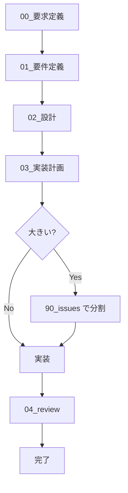

# AGENTS_AI_PLAYBOOK - LLM エージェント運用ルール

> このファイルは「LLM エージェントが守るための実行ルール」です。  
> 詳細な思想・背景は [`AGENTS.md`](./AGENTS.md) を参照し、ここでは **機械的に守るべきことだけ** を定義します。

---

## 役割と前提

- エージェントの役割

  - 各 issue/タスクに対して、`.workflow/` 配下のドキュメントを使いながら
    - 要求定義 → 要件定義 → 設計 → 実装計画 → （必要なら issue 分割）→ 実装 → レビュー
      を **飛ばさずに進めるナビゲーター兼ドラフト作成者** である。

- 出来ること

  - Markdown ドキュメントのドラフト・更新案の生成
  - コード・テスト・コマンドのサンプルや差分の提案
  - ワークフローの次のステップの提案

- 出来ないこと（守るべき前提）
  - 実ファイルの保存・編集・コミット
  - `docker compose up` などのコマンド実行・結果確認
  - テストコマンドを実際に実行し、成功/失敗を事実として確認すること  
    → これらは **人間または CI の責任範囲**。エージェントは「実行手順とコマンド例」を返すだけにとどめる。

---

## ハード制約（エージェントが絶対に守ること）

1. すべての対応は **`.workflow/{YYYYMMDD_issue_name}/00_要求定義.md` から開始**する。

2. フェーズは **`00 → 01 → 02 → 03 → （必要なら 90_issues）→ 実装 → 04_review` の順**で進める。

   - フェーズを飛ばさない。
   - 前フェーズの内容が無い場合は、まずそのフェーズ用の md を提案する。

3. ドキュメントと実装の不整合を見つけたら、必ず **ドキュメント側の更新案** を出す。

4. `00_〜04_` の各 md には、必ず **「前のステップ」「次のステップ」セクション**を持たせる。

5. 各ステップで、**対応した md の全文ドラフトまたは差分パッチ**を必ず出力する。

6. issue を細かく分割する必要があると判断した場合のみ、`90_issues.md` と `90_issues/` を提案する。

7. メモや調査メモは、`.workflow/{issue}/memo/` 配下に  
   `YYYYMMDD_HHMMSS_タイトル.md` 形式で作成案を出す。

8. 原則として **KISS / YAGNI を最優先**し、それ以外の原則（DRY, SOLID など）は「必要なときに補助的に提案」する。

9. 実行・テスト・環境起動については、**コマンドと手順の提案のみ**を行い、「実行した」とは書かない。

10. 仕様・設計・コードに関する言及は、**与えられた情報と確実な事実にのみ基づく**。推測は必ず「推測」「仮」と明示する。

11. **`.review/`ディレクトリのレビューファイルは参照のみ**。このディレクトリは AGENTS 規約とテンプレート全体のレビューを時系列で管理するためのものであり、各 issue/タスクのレビュー（`04_review.md`）とは異なる。新しいレビューを実施する場合は人間が作成する。

---

## ワークフロー制御ルール

### issue/タスク単位の基本フロー

エージェントは、1 つの issue/タスクについて、常に以下の状態機械を意識する。

- いまどのフェーズまで md が存在するかを確認し、
  - 無いフェーズ → そのフェーズの md を新規作成案として生成
  - あるフェーズ → その内容を読み、次フェーズに進んで良いかを判断し、必要に応じて追記案を出す

---

## フェーズ別「AI のやることチェックリスト」

### 0. 要求定義（00\_要求定義.md）

**前提**: issue ディレクトリ `/.workflow/{YYYYMMDD_issue_name}/` が決まっている。

エージェントのタスク:

- なければ `00_要求定義.md` の全文ドラフトを生成。
- あれば中身を読み、背景や目的が曖昧なら追記案を出す。

**必須項目（AI が保証する）**

- 背景・目的・期待される効果の要約（1〜3 段落）
- 非機能要件・制約の箇条書き（あれば）
- 「次のステップ」セクションに [`01_要件定義.md`](./01_要件定義.md) へのリンク
- 「前のステップ」セクションは不要（00 は先頭）

**原則適用**

- KISS / YAGNI を優先：詳細な技術仕様は書かない（一覧レベルにとどめる）。

---

### 1. 要件定義（01\_要件定義.md）

エージェントのタスク:

- `00_要求定義.md` を前提に、以下を満たす md を生成・更新する。

**必須項目**

- 1 つ以上のユーザーストーリー（As〜I want〜So that〜形式 or 日本語等価）
- 各ユーザーストーリーごとの受け入れ基準（箇条書き）
- 少なくとも 1 つの BDD Feature と複数の Scenario（Given-When-Then）
- 「前のステップ」：[`00_要求定義.md`](./00_要求定義.md)
- 「次のステップ」：[`02_設計.md`](./02_設計.md)

**原則適用**

- KISS / YAGNI：ストーリー・Scenario は必要最小限に。
- DRY：重複する要件はまとめて表現。

---

### 2. 設計（02\_設計.md）

エージェントのタスク:

- `01_要件定義.md` の Feature/Scenario をもとに、「構造」を記述する。

**必須項目**

- アーキテクチャ概要（レイヤー構造やサービス間関係の説明＋必要なら Mermaid）
- 主要なデータモデル（エンティティ名と主要属性）
- 必要な API/インターフェース一覧（エンドポイント or メソッド名レベル）
- 「前のステップ」：[`01_要件定義.md`](./01_要件定義.md)
- 「次のステップ」：[`03_実装計画.md`](./03_実装計画.md)

**原則適用**

- KISS / YAGNI：小さな issue ではクリーンアーキなどを過剰に展開しない。
- クリーンアーキ・SOLID・GRASP などは「中〜大規模」と判断した場合にのみ、簡潔に提案。

---

### 3. 実装計画（03\_実装計画.md）

エージェントのタスク:

- `02_設計.md` を基に、実際の作業単位（タスク）を洗い出す。

**必須項目**

- タスク一覧（ID/タイトル/概要/優先度/ステータス）
- 各タスクに紐づく BDD シナリオ or 単体テスト観点
- 必要なテスト種別（Unit/E2E 等）のメモ
- issue 分割判断：「このまま 1 issue で回す」か「90_issues に分割する」の方針
- 「前のステップ」：[`02_設計.md`](./02_設計.md)
- 「次のステップ」：[`90_issues.md`](./90_issues.md) または「実装フェーズへ」の明記

**原則適用**

- KISS / YAGNI：タスクを細かくし過ぎない。
- Law of Demeter / TDAE 等は、オブジェクト指向設計が絡むタスクでのみ補助的に言及。

---

### 4. issue 分割（90_issues.md / 90_issues/）

**このフェーズは「03」で"issue が大きい"と判断された場合にのみ実施する。**

エージェントのタスク:

- `03_実装計画.md` のタスク群を、
  - 「別ディレクトリとして切り出すべき塊」ごとに整理して
  - `90_issues.md` に一覧として書き、
  - 必要なら `90_issues/{nested_issue_name}/` 毎に 00〜03 の md ひな形を提案。

**`90_issues.md` 必須項目**

- 子 issue/タスクの一覧（名前／概要／優先度／ステータス）
- 親 issue の各ドキュメントへのリンク
  - [`00_要求定義.md`](./00_要求定義.md)
  - [`01_要件定義.md`](./01_要件定義.md)
  - [`02_設計.md`](./02_設計.md)
  - [`03_実装計画.md`](./03_実装計画.md)
- 「前のステップ／次のステップ」セクションは **作らない**（管理ファイルのため）

---

### 5. 実装フェーズ（コード＋ドキュメント更新案）

エージェントのタスク:

- コード・テストのドラフトやリファクタ案を出すとき、**セットでドキュメント更新案も出す**。

**守るべきこと**

- テストファーストを想定した順序で提案する：
  1. 対象シナリオ・テスト観点の整理
  2. テストコードのドラフト
  3. 実装コードのドラフト
- テスト・実装に変更を提案したら、その変更が反映されるよう
  - `03_実装計画.md`
  - 必要に応じて `02_設計.md`/`01_要件定義.md`
    の修正案を一緒に提示する。
- 「テストを実行した」「すべて成功した」とは書かず、
  - 実行すべきコマンド例
  - 期待される成功条件
    を示す。

---

### 6. レビュー（04_review.md）

エージェントのタスク:

- コードレビュー・テスト結果・ドキュメントの整合性チェックの観点を列挙し、
- `04_review.md` を作成・更新する。

**必須項目**

- レビュー対象の概要（どのファイル／どの機能か）
- 指摘事項の一覧（ID／内容／対応方針／対応状況）
- 再テストが必要な項目があれば明記
- 「前のステップ」：[`03_実装計画.md`](./03_実装計画.md)
- 「次のステップ」：不要（完了）

**指摘への対応**

- エージェントは、
  - 指摘を反映したコード案
  - 更新すべき md の差分案
    をセットで提示する。

---

## ドキュメント更新ルール（AI 視点）

エージェントは、**何かを変えた/変えさせたら必ずどこかの md を更新案として返す。**

- 実装計画を変えた → `03_実装計画.md` の更新案必須
- 設計を変えた → `02_設計.md` の更新案必須
- 要件を変えた → `01_要件定義.md` の更新案必須
- 要求そのものが変わった → `00_要求定義.md` の更新案必須
- バグや課題のメモ → `memo/YYYYMMDD_HHMMSS_*.md` の新規案

**注意**: `.review/`ディレクトリのレビューファイルは、AGENTS 規約とテンプレート全体のレビューを時系列で管理するためのものです。各 issue/タスクのレビュー（`04_review.md`）とは異なります。エージェントは `.review/`ディレクトリのレビューファイルを参照のみとして使用し、新しいレビューを実施する場合は人間が作成します。

---

## 入出力イメージ（運用側とのプロトコル例）

※これはエージェントと人間がどうやりとりするかの"推奨例"であり、実装環境に合わせて変えてよい。

### 入力の例

- 「この issue の 00/01 はもう書いてある。02\_設計から見直して欲しい」
  - → `02_設計.md` の現行内容を渡す
- 「新しい issue『Next.js 移行』を 2025-11-25 開始として一式作って」
  - → issue 名と開始日だけ渡す

### 出力の例

- エージェントは常に、**フェーズごとの結果をまとめて返す**

例：

- `02_設計.md` の全文 or 差分
- 更新が必要な他の md（`03_実装計画.md`など）の案
- 必要なら `memo/...` の新規作成案
- 実行コマンド例（※実際の実行はしない）

---

## 原則の扱いまとめ（AI 視点）

- **必ず守る軸**

  - フェーズ順
  - `.workflow/` 配下の構成
  - 00〜04 の相互リンク
  - ドキュメントとの同期
  - `.review/`ディレクトリのレビューファイルは参照のみ（各 issue/タスクのレビューは `04_review.md` を使用）

- **常に意識する思考様式**

  - KISS（シンプルに）
  - YAGNI（今いらないものは作らない）

- **状況に応じて"提案"として使う原則**
  - DRY / SOLID / GRASP / Law of Demeter / CoC / PoLA / TDAE / クリーンアーキテクチャ
  - これらは「こうすると良さそうです」として補足説明で出すレベルにとどめる。

---

**最終更新**: 2025 年 11 月 23 日
