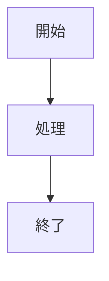

# AGENTS_DOCS_RULES - システム仕様書作成ルール

> このドキュメントは、**Markdown + Mermaid で書くシステム仕様書（納品物）の作成ルール**と、  
> **LLM エージェントが絶対に守るべき具体的な実行ルール**を定義します。  
> ワークフロー全体の規約は [`AGENTS.md`](./AGENTS.md)、  
> LLM 向けの全体ルールは [`AGENTS_AI_PLAYBOOK.md`](./AGENTS_AI_PLAYBOOK.md) を参照してください。

---

## クイックリファレンス（絶対に守ること）

1. **システム仕様書は `docs/` ディレクトリに配置する**
   - `docs/README.md` を全体のインデックスとして作成
   - 各セクションは `docs/{セクション名}/README.md` として作成

2. **Mermaid 図作成時は `AGENTS_MERMAID_RULES.md` を必ず参照する**
   - ノード ID の命名規則（英数字とアンダースコアのみ）
   - ラベルの引用符ルール（ダブルクォート必須）
   - エッジラベルの引用符ルール
   - 改行の扱い（`<br/>` タグ使用）

3. **テンプレートを使用する**
   - `.workflow/templates/docs/` 配下のテンプレートをコピーして使用
   - テンプレートの構造とフォーマットを維持する

4. **参照パス確認は必須**
   - すべての参照パスが正しいか確認する
   - Markdown リンク形式（`[テキスト](./パス)`）を使用する

---

## 対象と前提

### この規約がカバーするもの

- システム仕様書（納品物）の作成
- Markdown + Mermaid による仕様書の記述
- クライアントへの納品物としての仕様書の形式

### 前提条件

- システム仕様書は `docs/` ディレクトリに配置する
- 各セクションは `docs/{セクション名}/README.md` として作成する
- Mermaid 図は [`AGENTS_MERMAID_RULES.md`](./AGENTS_MERMAID_RULES.md) のルールに従う

---

## ディレクトリ構造

システム仕様書は以下のディレクトリ構造で管理します：

```
docs/
├── README.md                    # 全体のインデックス
├── 01_システム概要/
│   └── README.md                # システム概要のテンプレート
├── 02_画面設計/
│   └── README.md                # 画面設計のテンプレート
├── 03_データ設計/
│   └── README.md                # データ設計のテンプレート
└── 04_機能設計/
    └── README.md                # 機能設計のテンプレート
```

### 各セクションの役割

#### `docs/README.md` - 全体のインデックス

**目的**: システム仕様書全体の構成と各セクションへのナビゲーションを提供する。

**含まれるもの**:
- システム仕様書の目的と読み方
- 各セクションへのリンク
- ドキュメントの更新履歴

#### `docs/01_システム概要/README.md` - システム概要

**目的**: システムの全体像、構成、業務フローを定義する。

**含まれるもの**:
- システム構成図（Mermaid flowchart）
- 業務フロー概要（Mermaid sequenceDiagram）
- 技術スタック
- 外部システム連携

#### `docs/02_画面設計/README.md` - 画面設計

**目的**: 画面の動きと、各画面の項目を定義する。

**含まれるもの**:
- 画面遷移図（Mermaid stateDiagram-v2）
- 画面詳細定義（入力項目仕様、イベント仕様）
- UI コンポーネント仕様

#### `docs/03_データ設計/README.md` - データ設計

**目的**: ER図とテーブル定義を定義する。

**含まれるもの**:
- ER図（Mermaid erDiagram）
- テーブル定義書
- インデックス定義
- 制約定義

#### `docs/04_機能設計/README.md` - 機能設計

**目的**: 複雑なロジックやバッチ処理を定義する。

**含まれるもの**:
- 機能フロー（Mermaid flowchart）
- シーケンス図（Mermaid sequenceDiagram）
- バッチ処理仕様
- API 仕様

---

## 基本ルール

### 1. テンプレートの使用

**基本方針**:
- `.workflow/templates/docs/` 配下のテンプレートをコピーして使用する
- テンプレートの構造とフォーマットを維持する
- プロジェクト固有の内容に置き換える

**正しい例**:
1. `.workflow/templates/docs/01_システム概要/README.md` をコピー
2. `docs/01_システム概要/README.md` に貼り付け
3. プロジェクト固有の内容に置き換える

**間違った例**:
- テンプレートを無視して一から作成する
- テンプレートの構造を変更する

### 2. Mermaid 図の作成

**基本方針**:
- Mermaid 図作成時は [`AGENTS_MERMAID_RULES.md`](./AGENTS_MERMAID_RULES.md) を必ず参照する
- ノード ID は英数字とアンダースコアのみ
- ラベルはダブルクォートで囲む
- エッジラベルも引用符で囲む
- 改行は `<br/>` タグを使用

**正しい例**:


**間違った例**:


**問題点**: ノード ID に日本語を使用しているため、エラーが発生する可能性がある

### 3. 参照パスの確認

**基本方針**:
- すべての参照パスが正しいか確認する
- Markdown リンク形式（`[テキスト](./パス)`）を使用する
- 相対パスの形式が正しいか確認する

**正しい例**:
- `[システム概要](./01_システム概要/README.md)`
- `[画面設計](./02_画面設計/README.md)`

**間違った例**:
- `システム概要`（リンク形式ではない）
- `[システム概要](01_システム概要/README.md)`（相対パスが不正確）

### 4. ドキュメントの更新

**基本方針**:
- 実装の変更に合わせてドキュメントを更新する
- ドキュメントと実装の整合性を保つ
- 更新履歴を記録する

---

## LLM エージェント向け実行ルール（必須）

> ここから下は、**AI がシステム仕様書を作成するときに絶対に守るチェックリスト**です。

### 共通前提

- すべてのシステム仕様書作成は、この `AGENTS_DOCS_RULES.md` のルールに従う
- Mermaid 図作成時は [`AGENTS_MERMAID_RULES.md`](./AGENTS_MERMAID_RULES.md) を必ず参照する
- テンプレートは `.workflow/templates/docs/` 配下からコピーして使用する

### 1. ディレクトリ構造の遵守

AI はシステム仕様書を作成するとき、**必ず次を守る**：

- **ディレクトリ構造**: `docs/` ディレクトリに配置する
- **ファイル名**: 各セクションは `README.md` として作成する
- **インデックス**: `docs/README.md` を全体のインデックスとして作成する

**禁止事項**:
- ディレクトリ構造を変更する
- ファイル名を変更する
- インデックスファイルを作成しない

### 2. テンプレートの使用

AI はシステム仕様書を作成するとき、**必ず次を守る**：

- **テンプレートのコピー**: `.workflow/templates/docs/` 配下のテンプレートをコピーして使用する
- **構造の維持**: テンプレートの構造とフォーマットを維持する
- **内容の置き換え**: プロジェクト固有の内容に置き換える

**禁止事項**:
- テンプレートを無視して一から作成する
- テンプレートの構造を変更する

### 3. Mermaid 図の作成

AI は Mermaid 図を作成するとき、**必ず次を守る**：

- **ルールの参照**: [`AGENTS_MERMAID_RULES.md`](./AGENTS_MERMAID_RULES.md) を必ず参照する
- **ノード ID**: 英数字とアンダースコアのみを使用する
- **ラベル**: ダブルクォートで囲む
- **エッジラベル**: 引用符で囲む
- **改行**: `<br/>` タグを使用する

**禁止事項**:
- ノード ID に日本語や特殊文字を含める
- ラベルを引用符で囲まない
- エッジラベルを引用符で囲まない
- 改行を直接使用する

### 4. 参照パスの確認

AI はシステム仕様書を作成するとき、**必ず次を守る**：

- **参照パスの確認**: すべての参照パスが正しいか確認する
- **リンク形式**: Markdown リンク形式（`[テキスト](./パス)`）を使用する
- **相対パス**: 相対パスの形式が正しいか確認する

**禁止事項**:
- 参照パスを推測する
- リンク形式を使用しない
- 相対パスが不正確

---

## AI 自己チェックリスト（システム仕様書作成前）

> **重要**: AI は、システム仕様書を作成する前に、**必ず以下のチェックリストを自問自答し、すべての項目を確認すること**。

### システム仕様書作成時の自己チェック

システム仕様書を作成する前に、以下を確認：

- [ ] **ディレクトリ構造**: `docs/` ディレクトリに配置しているか？
- [ ] **ファイル名**: 各セクションは `README.md` として作成しているか？
- [ ] **インデックス**: `docs/README.md` を全体のインデックスとして作成しているか？
- [ ] **テンプレート**: `.workflow/templates/docs/` 配下のテンプレートをコピーして使用しているか？
- [ ] **構造の維持**: テンプレートの構造とフォーマットを維持しているか？
- [ ] **Mermaid 図**: [`AGENTS_MERMAID_RULES.md`](./AGENTS_MERMAID_RULES.md) のルールに従っているか？
- [ ] **ノード ID**: すべてのノード ID が英数字とアンダースコアのみか？
- [ ] **ラベル**: すべてのラベルがダブルクォートで囲まれているか？
- [ ] **エッジラベル**: すべてのエッジラベルが引用符で囲まれているか？
- [ ] **改行**: ラベル内で改行する場合は `<br/>` タグを使用しているか？
- [ ] **参照パス**: すべての参照パスが正しいか？
- [ ] **リンク形式**: Markdown リンク形式（`[テキスト](./パス)`）を使用しているか？

### チェックリストの使い方

1. **作成前に確認**: システム仕様書を作成する前に、上記のチェックリストを確認する
2. **不備があれば修正**: チェックリストの項目に不備があれば、作成前に修正する
3. **確認結果を明示**: 作成物と一緒に「自己チェック結果」を簡潔に記載する（例: 「✅ ディレクトリ構造遵守、テンプレート使用、Mermaid 図ルール遵守、参照パス確認済み」）

---

## Issue 完了時のシステム仕様書更新チェック（必須）

> **重要**: AI は、issue/タスク完了時（レビューフェーズ完了時）に、**必ずシステム仕様書の更新が必要か確認し、必要に応じて加筆修正を行うこと**。

### 基本方針

- **Issue 完了時は必ずシステム仕様書の更新チェックを実施する**
- **実装内容とシステム仕様書の整合性を確認する**
- **必要に応じて、システム仕様書を更新する**

### チェック項目

Issue 完了時（レビューフェーズ完了時）に、以下の項目を**必ず確認**すること：

1. **実装内容の確認**
   - 実装した機能がシステム仕様書に記載されているか
   - 実装した画面がシステム仕様書に記載されているか
   - 実装したデータ構造がシステム仕様書に記載されているか
   - 実装した API がシステム仕様書に記載されているか

2. **システム仕様書の更新が必要か判断**
   - 実装内容がシステム仕様書に反映されていない場合 → **更新が必要**
   - 実装内容とシステム仕様書に矛盾がある場合 → **更新が必要**
   - 実装内容がシステム仕様書の記載と一致している場合 → **更新不要**

3. **更新が必要な場合の対応**
   - 該当するセクション（`01_システム概要`、`02_画面設計`、`03_データ設計`、`04_機能設計`）を更新する
   - 更新内容を `04_review.md` に記録する
   - 更新履歴を `docs/README.md` に記録する

### 更新が必要なケース

以下のケースでは、**必ずシステム仕様書を更新する**こと：

- **新規機能の追加**: 新規機能を実装した場合、該当するセクションを更新
- **画面の追加・変更**: 新規画面を追加した場合、または既存画面を変更した場合、`02_画面設計/README.md` を更新
- **データ構造の変更**: テーブル定義を追加・変更した場合、`03_データ設計/README.md` を更新
- **API の追加・変更**: 新規 API を追加した場合、または既存 API を変更した場合、`04_機能設計/README.md` を更新
- **システム構成の変更**: システム構成を変更した場合、`01_システム概要/README.md` を更新
- **技術スタックの変更**: 使用する技術スタックを変更した場合、`01_システム概要/README.md` を更新

### 更新が不要なケース

以下のケースでは、システム仕様書の更新は不要：

- **バグ修正**: 仕様に影響しないバグ修正の場合
- **リファクタリング**: 実装の改善のみで、仕様に影響しない場合
- **テストコードの追加**: テストコードのみの追加の場合

### Issue 完了時のチェックリスト

Issue 完了時（レビューフェーズ完了時）に、以下を**必ず確認**すること：

- [ ] **実装内容の確認**: 実装した機能、画面、データ構造、API を確認したか？
- [ ] **システム仕様書の確認**: 実装内容がシステム仕様書に記載されているか確認したか？
- [ ] **整合性の確認**: 実装内容とシステム仕様書に矛盾がないか確認したか？
- [ ] **更新の必要性判断**: システム仕様書の更新が必要か判断したか？
- [ ] **更新の実施**: 更新が必要な場合、該当するセクションを更新したか？
- [ ] **レビュー書への記録**: 更新内容を `04_review.md` に記録したか？
- [ ] **更新履歴の記録**: 更新履歴を `docs/README.md` に記録したか？

### チェックリストの使い方

1. **Issue 完了時に確認**: Issue 完了時（レビューフェーズ完了時）に、上記のチェックリストを確認する
2. **更新が必要な場合**: 更新が必要な場合、該当するセクションを更新する
3. **レビュー書に記録**: 更新内容を `04_review.md` の「システム仕様書の更新」セクションに記録する
4. **更新履歴に記録**: 更新履歴を `docs/README.md` の「更新履歴」セクションに記録する

---

## 参考資料

### プロジェクトドキュメント

- [`AGENTS_AI_PLAYBOOK.md`](./AGENTS_AI_PLAYBOOK.md) - LLM エージェント運用ルール
- [`AGENTS.md`](./AGENTS.md) - 開発規約の全体像
- [`AGENTS_MERMAID_RULES.md`](./AGENTS_MERMAID_RULES.md) - Mermaid 図作成規約

**重要**: 参照パスを記載する際は、必ず実際のファイルパスを確認し、正しい相対パスを使用すること。詳細は [`AGENTS.md`](./AGENTS.md) の「ドキュメント原則」セクションを参照。

### テンプレート

- `.workflow/templates/docs/README.md` - 全体のインデックステンプレート
- `.workflow/templates/docs/01_システム概要/README.md` - システム概要のテンプレート
- `.workflow/templates/docs/02_画面設計/README.md` - 画面設計のテンプレート
- `.workflow/templates/docs/03_データ設計/README.md` - データ設計のテンプレート
- `.workflow/templates/docs/04_機能設計/README.md` - 機能設計のテンプレート

### 外部参考資料

- [Mermaid 公式ドキュメント](https://mermaid.js.org/)
- [Markdown ガイド](https://www.markdownguide.org/)

---

## 最後に（人間向け）

- この `AGENTS_DOCS_RULES.md` は、**Markdown + Mermaid で書くシステム仕様書（納品物）の作成に特化した規約**です。
- 迷ったときは：
  1. テンプレートをコピーして使用する
  2. Mermaid 図作成時は `AGENTS_MERMAID_RULES.md` を参照する
  3. 参照パスを確認する
  4. それでも悩んだら `.workflow/{issue}/memo/` にメモを残してから検討

---

**最終更新**: 2025 年 12 月 22 日（Issue 完了時のシステム仕様書更新チェックルールを追加）
