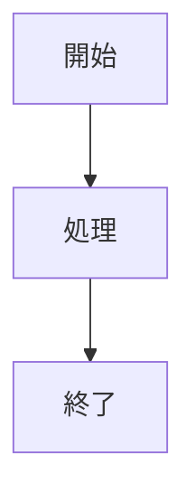

# AGENTS_DOCS_RULES - システム仕様書作成ルール

> このドキュメントは、**Markdown + Mermaid で書くシステム仕様書（納品物）の作成ルール**と、  
> **LLM エージェントが絶対に守るべき具体的な実行ルール**を定義します。  
> ワークフロー全体の規約は [`AGENTS.md`](./AGENTS.md)、  
> LLM 向けの全体ルールは [`AGENTS_AI_PLAYBOOK.md`](./AGENTS_AI_PLAYBOOK.md) を参照してください。

---

## クイックリファレンス（絶対に守ること）

1. **システム仕様書は `docs/` ディレクトリに配置する**
   - `docs/README.md` を全体のインデックスとして作成
   - 各セクションは `docs/{セクション名}/README.md` として作成

2. **Mermaid 図作成時は `AGENTS_MERMAID_RULES.md` を必ず参照する**
   - ノード ID の命名規則（英数字とアンダースコアのみ）
   - ラベルの引用符ルール（ダブルクォート必須）
   - エッジラベルの引用符ルール
   - 改行の扱い（`<br/>` タグ使用）

3. **テンプレートを使用する**
   - `.workflow/templates/docs/` 配下のテンプレートをコピーして使用
   - テンプレートの構造とフォーマットを維持する
   - **機能別テンプレート**: 機能設計の場合は、`.workflow/templates/docs/04_機能設計/機能名/` ディレクトリをコピーして、`{機能名}/` として使用する
     - テンプレートディレクトリ内の `README.md` の `{機能名}` を実際の機能名に置き換える
     - 機能フロー、シーケンス図、API仕様を実際の内容に置き換える

4. **参照パス確認は必須**
   - すべての参照パスが正しいか確認する
   - Markdown リンク形式（`[テキスト](./パス)`）を使用する

5. **ID命名規則と管理（必須）**
   - `docs/99_ID命名規則と管理/README.md` でIDを一元管理する
   - 新規ID追加時は、必ず一覧表を更新する
   - 各ドキュメントでIDを定義する際は、一覧表を参照し、重複や不整合がないことを確認する
   - レビュー時は、必ずIDの重複や不整合がないことを確認する

---

## 対象と前提

### この規約がカバーするもの

- システム仕様書（納品物）の作成
- Markdown + Mermaid による仕様書の記述
- クライアントへの納品物としての仕様書の形式

### 前提条件

- システム仕様書は `docs/` ディレクトリに配置する
- 必須セクション（`01_システム概要/`, `02_画面設計/`, `03_データ設計/`, `04_機能設計/`, `99_ID命名規則と管理/`）を作成する
- 各セクションは `docs/{セクション名}/README.md` として作成する
- Mermaid 図は [`AGENTS_MERMAID_RULES.md`](./AGENTS_MERMAID_RULES.md) のルールに従う
- ID命名規則と管理は `docs/99_ID命名規則と管理/README.md` で一元管理する（必須）

---

## ディレクトリ構造

システム仕様書は以下のディレクトリ構造で管理します。**システム概要、画面設計、データ設計、機能設計、ID命名規則と管理は必須セクション**です。

```text
docs/
├── README.md                    # 全体のインデックス
├── 00_review/                   # レビュー結果ディレクトリ
│   └── YYYYMMDD_HHMMSS_review.md # レビュー結果ファイル（日時プレフィックス付き）
├── 01_システム概要/             # システム概要（必須）
│   └── README.md                # システム概要のドキュメント
├── 02_画面設計/                 # 画面設計（必須）
│   └── README.md                # 画面設計のドキュメント
├── 03_データ設計/               # データ設計（必須）
│   └── README.md                # データ設計のドキュメント
├── 04_機能設計/                 # 機能設計（必須）
│   ├── README.md                # 機能設計のインデックス
│   ├── {機能名1}/               # 機能1（プロジェクト固有の機能名）
│   │   └── README.md            # 機能1の詳細設計
│   ├── {機能名2}/               # 機能2（プロジェクト固有の機能名）
│   │   └── README.md            # 機能2の詳細設計
│   └── {機能名N}/               # 機能N（プロジェクト固有の機能名）
│       └── README.md            # 機能Nの詳細設計
└── 99_ID命名規則と管理/        # ID命名規則と管理（必須）
    └── README.md                # ID命名規則と一元管理表
```

**注意**: 
- **必須セクション**: `01_システム概要/`, `02_画面設計/`, `03_データ設計/`, `04_機能設計/`, `99_ID命名規則と管理/` は必須です。すべてのプロジェクトで作成してください。
- **機能名**: `04_機能設計/` 内の機能名（`{機能名1}`, `{機能名2}`など）は、プロジェクトの特性に応じて適切に命名してください（例: `ログイン/`, `データ処理/`, `共通機能/` など）。

### 各セクションの役割

#### `docs/README.md` - 全体のインデックス

**目的**: システム仕様書全体の構成と各セクションへのナビゲーションを提供する。

**含まれるもの**:
- システム仕様書の目的と読み方
- 各セクションへのリンク
- ドキュメントの更新履歴

#### `docs/00_review/` - レビュー結果ディレクトリ

**目的**: システム仕様書の徹底的なレビュー結果を記録する。

**含まれるもの**:
- レビュー結果ファイル（`YYYYMMDD_HHMMSS_review.md` 形式）
- 各レビュー結果には、レビュー実施日時、レビュー対象ドキュメント、レビュー方針、レビュー結果（指摘事項の一覧）、修正実施結果、再レビュー実施結果、総合評価が含まれる

**注意**: レビュー結果ファイルのファイル名は、ファイル作成時にシステムの現在日時を取得して使用する（`YYYYMMDD_HHMMSS` 形式）。

#### `docs/01_システム概要/README.md` - システム概要

**目的**: システムの全体像、構成、業務フローを定義する。

**含まれるもの**:
- システム構成図（Mermaid flowchart）
- 業務フロー概要（Mermaid sequenceDiagram）
- 技術スタック
- 外部システム連携

#### `docs/02_画面設計/README.md` - 画面設計

**目的**: 画面の動きと、各画面の項目を定義する。

**含まれるもの**:
- 画面遷移図（Mermaid stateDiagram-v2）
- 画面詳細定義（入力項目仕様、イベント仕様）
- UI コンポーネント仕様

#### `docs/03_データ設計/README.md` - データ設計

**目的**: ER図とテーブル定義を定義する。

**含まれるもの**:
- ER図（Mermaid erDiagram）
- テーブル定義書
- インデックス定義
- 制約定義

#### `docs/04_機能設計/` - 機能設計

**目的**: 複雑なロジックやバッチ処理を定義する。

**ディレクトリ構造**:
- `docs/04_機能設計/README.md` - 機能設計のインデックス（各機能へのリンク）
- `docs/04_機能設計/{機能名}/README.md` - 各機能の詳細設計（機能別ディレクトリ構造）

**機能別ディレクトリ構造**:
- 機能設計は、機能別にディレクトリを分割して管理する
- 各機能ディレクトリには `README.md` を配置し、その機能に関するすべての情報（機能フロー、シーケンス図、API仕様など）を含める
- ディレクトリ名は連番を付けず、機能名のみを使用する（例: `ログイン/`, `ユーザー登録/`, `注文処理/`, `共通機能/`）
- **テンプレートの使用**: `.workflow/templates/docs/04_機能設計/機能名/` ディレクトリをコピーして、`{機能名}/` として使用する
  - テンプレートディレクトリ内の `README.md` の `{機能名}` を実際の機能名に置き換える
  - 機能フロー、シーケンス図、API仕様を実際の内容に置き換える

**含まれるもの**:
- 機能フロー（Mermaid flowchart）
- シーケンス図（Mermaid sequenceDiagram）
- バッチ処理仕様（該当する場合）
- API 仕様（該当する場合）

**注意**: 機能名（`{機能名}`）はプロジェクトの特性に応じて適切に命名してください（例: `ログイン/`, `データ処理/`, `共通機能/` など）。

#### `docs/99_ID命名規則と管理/README.md` - ID命名規則と管理（必須）

**目的**: システムドキュメントで使用するIDの命名規則と一元管理を定義する。

**含まれるもの**:
- ID命名規則一覧（IDプレフィックスの意味と使用箇所）
- ID管理のルール（新規ID追加時、ID定義時、ID変更時、ID削除時のルール）
- ID一覧（各カテゴリーのID一覧表）

**重要**: 
- 本ドキュメントは、IDの**一元管理表**として機能します。新しいIDを追加する際は、必ず本ドキュメントの該当する一覧表を更新してください。
- 各ドキュメントでIDを定義する際は、本ドキュメントの一覧表を参照し、重複や不整合がないことを確認してください。
- 本ディレクトリは**必須**です。すべてのプロジェクトで作成してください。

**機能別ディレクトリの例**:
```
docs/04_機能設計/
├── README.md                    # 機能設計のインデックス
├── ログイン/
│   └── README.md                # ログイン機能の詳細設計
├── ユーザー登録/
│   └── README.md                # ユーザー登録機能の詳細設計
├── 注文処理/
│   └── README.md                # 注文処理機能の詳細設計
└── 共通機能/
    └── README.md                # 共通機能の詳細設計
```

---

## 基本ルール

### 1. テンプレートの使用

**基本方針**:
- `.workflow/templates/docs/` 配下のテンプレートをコピーして使用する
- テンプレートの構造とフォーマットを維持する
- プロジェクト固有の内容に置き換える

**正しい例**:
1. `.workflow/templates/docs/01_システム概要/README.md` をコピー
2. `docs/01_システム概要/README.md` に貼り付け
3. プロジェクト固有の内容に置き換える

**間違った例**:
- テンプレートを無視して一から作成する
- テンプレートの構造を変更する

### 1.5. `.workflow` への参照禁止

**重要**: システム仕様書（`docs/` ディレクトリ）には、**`.workflow` ディレクトリへの参照を記載してはいけません**。

**基本方針**:
- システム仕様書は実装内容に基づいて作成する
- `.workflow` ディレクトリは開発プロセスの管理用であり、システム仕様書とは分離する

**禁止事項**:
- `.workflow/` ディレクトリへの参照を記載する
- `.workflow/` ディレクトリ内のファイルへのリンクを記載する

### 1.6. `docs` ディレクトリ内での完結

**重要**: システム仕様書（`docs/` ディレクトリ）は、**`docs` ディレクトリ内で完結すること**。

**基本方針**:
- システム仕様書は `docs/` ディレクトリ内の他のドキュメントへの参照のみを使用する
- 外部サイト（公式情報）への参照は許可する
- プロジェクトルートやその他のディレクトリ（`.workflow/`, `frontend/`, `backend/` 等）への参照は禁止する

**許可される参照**:
- `docs/` ディレクトリ内の他のドキュメントへの参照（例: `[02 画面設計](../02_画面設計/README.md)`）
- 外部サイト（公式情報）への参照（例: `[Mermaid 公式ドキュメント](https://mermaid.js.org/)`）

**禁止事項**:
- プロジェクトルートのファイルへの参照（例: `[AGENTS_DOCS_RULES.md](../../AGENTS_DOCS_RULES.md)`, `[README.md](../../README.md)`）
- `.workflow/` ディレクトリへの参照
- `frontend/`, `backend/` 等の実装ディレクトリへの参照
- その他のプロジェクトルート配下のファイルへの参照

**正しい例**:
- `[02 画面設計](../02_画面設計/README.md)` - `docs` 内の参照
- `[Mermaid 公式ドキュメント](https://mermaid.js.org/)` - 外部サイト（公式情報）

**間違った例**:
- `[AGENTS_DOCS_RULES.md](../../AGENTS_DOCS_RULES.md)` - プロジェクトルートへの参照（禁止）
- `[README.md](../../README.md)` - プロジェクトルートへの参照（禁止）
- `[frontend/README.md](../../frontend/README.md)` - 実装ディレクトリへの参照（禁止）
- `[backend/README.md](../../backend/README.md)` - 実装ディレクトリへの参照（禁止）

### 2. Mermaid 図の作成

**基本方針**:
- Mermaid 図作成時は [`AGENTS_MERMAID_RULES.md`](./AGENTS_MERMAID_RULES.md) を必ず参照する
- ノード ID は英数字とアンダースコアのみ
- ラベルはダブルクォートで囲む
- エッジラベルも引用符で囲む
- 改行は `<br/>` タグを使用

**正しい例**:

```mermaid
flowchart TD
  START["開始"]
  PROCESS["処理"]
  END["終了"]
  
  START --> PROCESS
  PROCESS --> END
```

**間違った例**:

```mermaid
flowchart TD
  開始 --> 処理
  処理 --> 終了
```

**問題点**: ノード ID に日本語を使用しているため、エラーが発生する可能性がある

### 3. 参照パスの確認

**基本方針**:
- すべての参照パスが正しいか確認する
- Markdown リンク形式（`[テキスト](./パス)`）を使用する
- 相対パスの形式が正しいか確認する

**正しい例**:
- `[システム概要](./01_システム概要/README.md)`
- `[画面設計](./02_画面設計/README.md)`

**間違った例**:
- `システム概要`（リンク形式ではない）
- `[システム概要](01_システム概要/README.md)`（相対パスが不正確）

### 4. ドキュメントの更新

**基本方針**:
- 実装の変更に合わせてドキュメントを更新する
- ドキュメントと実装の整合性を保つ
- 更新履歴を記録する

### 5. ID命名規則と管理

**基本方針**:
- **一元管理**: ID命名規則と管理は `docs/99_ID命名規則と管理/README.md` で一元管理する
- **新規ID追加時**: 新しいIDを追加する際は、必ず `docs/99_ID命名規則と管理/README.md` の該当する一覧表を更新する
- **ID定義時**: 各ドキュメントでIDを定義する際は、`docs/99_ID命名規則と管理/README.md` の一覧表を参照し、重複や不整合がないことを確認する
- **ID変更時**: IDを変更する際は、`docs/99_ID命名規則と管理/README.md` の一覧表と、該当するすべてのドキュメントを更新する
- **ID削除時**: IDを削除する際は、`docs/99_ID命名規則と管理/README.md` の一覧表から該当IDを削除する（ただし、過去のドキュメントとの整合性を保つため、削除は慎重に行う）

**ID命名規則**:
- **G**: GUI（画面）の識別子（例: G001、G002）
- **F**: Functional Flow（機能フロー）の識別子（例: F001、F002）
- **API**: API Specification（API仕様）の識別子（例: API001、API002）
- **S**: Sequence Diagram（シーケンス図）の識別子（例: S001、S002）
- **T**: Table（テーブル）の識別子（例: T01、T02）

**正しい例**:
- 新規画面を追加する際、`docs/99_ID命名規則と管理/README.md` の画面ID一覧表を確認し、使用済みIDを避けて新しいID（例: G004）を割り当てる
- 新規APIを追加する際、`docs/99_ID命名規則と管理/README.md` のAPI仕様ID一覧表を確認し、使用済みIDを避けて新しいID（例: API015）を割り当てる

**間違った例**:
- `docs/99_ID命名規則と管理/README.md` を参照せずに、既存のIDと重複するIDを使用する
- 新規IDを追加する際、`docs/99_ID命名規則と管理/README.md` の一覧表を更新しない

---

## LLM エージェント向け実行ルール（必須）

> ここから下は、**AI がシステム仕様書を作成するときに絶対に守るチェックリスト**です。

### 共通前提

- すべてのシステム仕様書作成は、この `AGENTS_DOCS_RULES.md` のルールに従う
- Mermaid 図作成時は [`AGENTS_MERMAID_RULES.md`](./AGENTS_MERMAID_RULES.md) を必ず参照する
- テンプレートは `.workflow/templates/docs/` 配下からコピーして使用する

### 1. ディレクトリ構造の遵守

AI はシステム仕様書を作成するとき、**必ず次を守る**：

- **ディレクトリ構造**: `docs/` ディレクトリに配置する
- **ファイル名**: 各セクションは `README.md` として作成する
- **インデックス**: `docs/README.md` を全体のインデックスとして作成する
- **機能設計の構造**: `docs/04_機能設計/` は機能別ディレクトリ構造を使用する
  - `docs/04_機能設計/README.md` を機能設計のインデックスとして作成する
  - 各機能は `docs/04_機能設計/{機能名}/README.md` として作成する
  - ディレクトリ名は連番を付けず、機能名のみを使用する（例: `ログイン/`, `ユーザー登録/`, `注文処理/`）

**禁止事項**:
- 必須セクション（`01_システム概要/`, `02_画面設計/`, `03_データ設計/`, `04_機能設計/`, `99_ID命名規則と管理/`）を作成しない
- ディレクトリ構造を変更する（必須セクションのディレクトリ名を変更する）
- ファイル名を変更する（`README.md` 以外のファイル名を使用する）
- インデックスファイルを作成しない
- 機能設計のディレクトリ名に連番を付ける（例: `01_ログイン/` は禁止、`ログイン/` はOK）
- `docs/99_ID命名規則と管理/README.md` を作成しない（必須ディレクトリ）
- `docs/99_ID命名規則と管理/README.md` を参照せずに、既存のIDと重複するIDを使用する
- 新規IDを追加する際、`docs/99_ID命名規則と管理/README.md` の一覧表を更新しない

### 2. テンプレートの使用

AI はシステム仕様書を作成するとき、**必ず次を守る**：

- **テンプレートのコピー**: `.workflow/templates/docs/` 配下のテンプレートをコピーして使用する
- **構造の維持**: テンプレートの構造とフォーマットを維持する
- **内容の置き換え**: プロジェクト固有の内容に置き換える
- **機能別テンプレート**: 機能設計の場合は、`.workflow/templates/docs/04_機能設計/機能名/` ディレクトリをコピーして、`{機能名}/` として使用する
  - テンプレートディレクトリ内の `README.md` の `{機能名}` を実際の機能名に置き換える
  - 機能フロー、シーケンス図、API仕様を実際の内容に置き換える

**禁止事項**:
- テンプレートを無視して一から作成する
- テンプレートの構造を変更する
- 機能別テンプレートディレクトリを使用せずに、機能設計のREADME.mdを一から作成する

### 2.5. `.workflow` への参照禁止

AI はシステム仕様書を作成するとき、**必ず次を守る**：

- **`.workflow` への参照禁止**: システム仕様書には `.workflow` ディレクトリへの参照を記載しない
- **実装内容に基づく**: 実装内容に基づいてドキュメントを作成する

**禁止事項**:
- `.workflow/` ディレクトリへの参照を記載する
- `.workflow/` ディレクトリ内のファイルへのリンクを記載する

### 2.6. `docs` ディレクトリ内での完結

AI はシステム仕様書を作成するとき、**必ず次を守る**：

- **`docs` ディレクトリ内での完結**: システム仕様書は `docs/` ディレクトリ内で完結する
- **許可される参照**: `docs/` ディレクトリ内の他のドキュメントへの参照、外部サイト（公式情報）への参照のみ
- **禁止される参照**: プロジェクトルートやその他のディレクトリ（`.workflow/`, `frontend/`, `backend/` 等）への参照

**許可される参照**:
- `docs/` ディレクトリ内の他のドキュメントへの参照（例: `[02 画面設計](../02_画面設計/README.md)`）
- 外部サイト（公式情報）への参照（例: `[Mermaid 公式ドキュメント](https://mermaid.js.org/)`）

**禁止事項**:
- プロジェクトルートのファイルへの参照（例: `[AGENTS_DOCS_RULES.md](../../AGENTS_DOCS_RULES.md)`, `[README.md](../../README.md)`）
- `.workflow/` ディレクトリへの参照
- `frontend/`, `backend/` 等の実装ディレクトリへの参照
- その他のプロジェクトルート配下のファイルへの参照

### 3. Mermaid 図の作成

AI は Mermaid 図を作成するとき、**必ず次を守る**：

- **ルールの参照**: [`AGENTS_MERMAID_RULES.md`](./AGENTS_MERMAID_RULES.md) を必ず参照する
- **ノード ID**: 英数字とアンダースコアのみを使用する
- **ラベル**: ダブルクォートで囲む
- **エッジラベル**: 引用符で囲む
- **改行**: `<br/>` タグを使用する

**禁止事項**:
- ノード ID に日本語や特殊文字を含める
- ラベルを引用符で囲まない
- エッジラベルを引用符で囲まない
- 改行を直接使用する

### 4. 参照パスの確認

AI はシステム仕様書を作成するとき、**必ず次を守る**：

- **参照パスの確認**: すべての参照パスが正しいか確認する
- **リンク形式**: Markdown リンク形式（`[テキスト](./パス)`）を使用する
- **相対パス**: 相対パスの形式が正しいか確認する

**禁止事項**:
- 参照パスを推測する
- リンク形式を使用しない
- 相対パスが不正確

### 5. ID命名規則と管理

AI はシステム仕様書を作成するとき、**必ず次を守る**：

- **一元管理**: ID命名規則と管理は `docs/99_ID命名規則と管理/README.md` で一元管理する
- **新規ID追加時**: 新しいIDを追加する際は、必ず `docs/99_ID命名規則と管理/README.md` の該当する一覧表を更新する
- **ID定義時**: 各ドキュメントでIDを定義する際は、`docs/99_ID命名規則と管理/README.md` の一覧表を参照し、重複や不整合がないことを確認する
- **ID変更時**: IDを変更する際は、`docs/99_ID命名規則と管理/README.md` の一覧表と、該当するすべてのドキュメントを更新する
- **ID削除時**: IDを削除する際は、`docs/99_ID命名規則と管理/README.md` の一覧表から該当IDを削除する（ただし、過去のドキュメントとの整合性を保つため、削除は慎重に行う）

**ID命名規則**:
- **G**: GUI（画面）の識別子（例: G001、G002）
- **F**: Functional Flow（機能フロー）の識別子（例: F001、F002）
- **API**: API Specification（API仕様）の識別子（例: API001、API002）
- **S**: Sequence Diagram（シーケンス図）の識別子（例: S001、S002）
- **T**: Table（テーブル）の識別子（例: T01、T02）

**禁止事項**:
- `docs/99_ID命名規則と管理/README.md` を参照せずに、既存のIDと重複するIDを使用する
- 新規IDを追加する際、`docs/99_ID命名規則と管理/README.md` の一覧表を更新しない
- IDの命名規則に従わないIDを使用する（例: `G1` ではなく `G001` を使用する）

---

## AI 自己チェックリスト（システム仕様書作成前）

> **重要**: AI は、システム仕様書を作成する前に、**必ず以下のチェックリストを自問自答し、すべての項目を確認すること**。

### システム仕様書作成時の自己チェック

システム仕様書を作成する前に、以下を確認：

- [ ] **ディレクトリ構造**: `docs/` ディレクトリに配置しているか？
- [ ] **ファイル名**: 各セクションは `README.md` として作成しているか？
- [ ] **インデックス**: `docs/README.md` を全体のインデックスとして作成しているか？
- [ ] **機能設計の構造**: `docs/04_機能設計/` は機能別ディレクトリ構造を使用しているか？
- [ ] **機能設計のインデックス**: `docs/04_機能設計/README.md` を機能設計のインデックスとして作成しているか？
- [ ] **機能ディレクトリ名**: 機能設計のディレクトリ名に連番を付けていないか？（例: `ログイン/` はOK、`01_ログイン/` はNG）
- [ ] **テンプレート**: `.workflow/templates/docs/` 配下のテンプレートをコピーして使用しているか？（テンプレートが存在する場合）
- [ ] **構造の維持**: テンプレートの構造とフォーマットを維持しているか？（テンプレートが存在する場合）
- [ ] **機能別テンプレート**: 機能設計の場合は、`.workflow/templates/docs/04_機能設計/機能名/` ディレクトリをコピーして使用しているか？
- [ ] **機能名の置き換え**: テンプレートディレクトリ内の `README.md` の `{機能名}` を実際の機能名に置き換えているか？
- [ ] **実装内容に基づく**: 実装内容に基づいてドキュメントを作成しているか？
- [ ] **実装ファイルの直接確認**: 実装ファイル（`frontend/`, `backend/` 等）を直接確認し、実装内容を正確に反映しているか？
- [ ] **予測の排除**: 実装ファイルで確認できない情報は記載していないか？（予測は一切入れない）
- [ ] **`.workflow` への参照禁止**: `.workflow` ディレクトリへの参照を記載していないか？
- [ ] **`docs` ディレクトリ内での完結**: `docs/` ディレクトリ内で完結しているか？（プロジェクトルートやその他のディレクトリへの参照を記載していないか？）
- [ ] **Mermaid 図**: [`AGENTS_MERMAID_RULES.md`](./AGENTS_MERMAID_RULES.md) のルールに従っているか？
- [ ] **ノード ID**: すべてのノード ID が英数字とアンダースコアのみか？
- [ ] **ラベル**: すべてのラベルがダブルクォートで囲まれているか？
- [ ] **エッジラベル**: すべてのエッジラベルが引用符で囲まれているか？
- [ ] **改行**: ラベル内で改行する場合は `<br/>` タグを使用しているか？
- [ ] **参照パス**: すべての参照パスが正しいか？
- [ ] **リンク形式**: Markdown リンク形式（`[テキスト](./パス)`）を使用しているか？
- [ ] **ID命名規則と管理**: `docs/99_ID命名規則と管理/README.md` を参照し、IDの重複や不整合がないことを確認したか？
- [ ] **新規ID追加時**: 新しいIDを追加する際、`docs/99_ID命名規則と管理/README.md` の該当する一覧表を更新したか？
- [ ] **ID定義時**: 各ドキュメントでIDを定義する際、`docs/99_ID命名規則と管理/README.md` の一覧表を参照し、重複や不整合がないことを確認したか？

### チェックリストの使い方

1. **作成前に確認**: システム仕様書を作成する前に、上記のチェックリストを確認する
2. **不備があれば修正**: チェックリストの項目に不備があれば、作成前に修正する
3. **確認結果を明示**: 作成物と一緒に「自己チェック結果」を簡潔に記載する（例: 「✅ ディレクトリ構造遵守、テンプレート使用、Mermaid 図ルール遵守、参照パス確認済み」）

### システム仕様書作成後の徹底的なレビュー（必須）

> **重要**: AI は、システム仕様書を作成・更新した後、**必ず実装と照らし合わせた徹底的なレビューを実施すること**。

**基本方針**:
- **実装ファイルを直接確認**: 実装ファイル（`frontend/`, `backend/` 等）を直接確認し、実装内容を正確に反映する
- **予測は一切入れない**: 実装ファイルで確認できない情報は記載しない
- **齟齬の徹底的な洗い出し**: 実装内容とドキュメントの間の矛盾や不整合をすべて洗い出す
- **考慮漏れの徹底的な洗い出し**: 実装されているがドキュメントに記載されていない項目をすべて洗い出す
- **記載漏れの徹底的な洗い出し**: 実装されているがドキュメントに記載されていない機能をすべて洗い出す
- **自問自答を繰り返す**: AI自身が自問自答を繰り返して、齟齬や考慮漏れ、記載漏れがない完璧なシステム仕様書とする

**レビュー実施方法**:

1. **実装ファイルの確認**: 実装ファイル（`frontend/package.json`, `backend/pyproject.toml`, `backend/app/api/v1/*.py`, `frontend/src/app/**/*.tsx`等）を直接確認する
2. **ドキュメントとの照合**: 実装ファイルの内容とドキュメントの内容を照らし合わせる
3. **齟齬の洗い出し**: 実装内容とドキュメントの間の矛盾や不整合をすべて洗い出す
4. **考慮漏れの洗い出し**: 実装されているがドキュメントに記載されていない項目をすべて洗い出す
5. **記載漏れの洗い出し**: 実装されているがドキュメントに記載されていない機能をすべて洗い出す
6. **ID命名規則と管理の確認（必須）**: `docs/99_ID命名規則と管理/README.md` を参照し、すべてのIDが一覧表に記載されているか、重複や不整合がないことを確認する
   - 各ドキュメントで使用されているID（G001、F001、API001、S001、T01など）が `docs/99_ID命名規則と管理/README.md` の一覧表に記載されているか確認
   - 一覧表に記載されているIDが実際のドキュメントで使用されているか確認
   - IDの重複がないか確認（同じIDが複数の場所で使用されていないか）
   - IDの不整合がないか確認（IDの命名規則に従っているか）
7. **レビュー結果の記録**: レビュー結果を `docs/00_review/YYYYMMDD_HHMMSS_review.md` に記録する（日時はファイル作成時にシステムの現在日時を取得して使用する）
8. **修正の実施**: 指摘事項があれば修正し、修正後再度レビューを実施する
9. **セルフレビューの繰り返し**: **重要**: セルフレビューは**必ず3回以上実施すること**。指摘事項がなくても、最低3回はレビューを実施し、見落としがないか確認する。各レビューでは、異なる観点から確認する（実装内容の確認、ドキュメント整合性、考慮漏れ、記載漏れ等）
10. **完了**: 指摘事項がなくなり、かつ3回以上のレビューを実施した時点で、レビューを完了とする

**レビュー結果の記録**:

- **レビュー結果ディレクトリ**: `docs/00_review/` ディレクトリにレビュー結果を記録する
- **レビュー結果ファイル**: `docs/00_review/YYYYMMDD_HHMMSS_review.md` 形式でレビュー結果を記録する（日時はファイル作成時にシステムの現在日時を取得して使用する）
- **記載内容**:
  - レビュー実施日時
  - レビュー対象ドキュメント
  - レビュー方針
  - レビュー結果（指摘事項の一覧）
  - 修正実施結果
  - 再レビュー実施結果
  - 総合評価

**必須事項**:
- **実装に忠実であること**: 実装ファイルで確認できる事実のみを記載する
- **予測などは一切入れない**: 実装ファイルで確認できない情報は記載しない
- **完璧なシステム仕様書**: 齟齬や考慮漏れ、記載漏れがない完璧なシステム仕様書とする

---

## Issue 完了時のシステム仕様書更新チェック（必須）

> **重要**: AI は、issue/タスク完了時（レビューフェーズ完了時）に、**必ずシステム仕様書の更新が必要か確認し、必要に応じて加筆修正を行うこと**。

### 基本方針

- **Issue 完了時は必ずシステム仕様書の更新チェックを実施する**
- **実装内容とシステム仕様書の整合性を確認する**
- **必要に応じて、システム仕様書を更新する**

### チェック項目

Issue 完了時（レビューフェーズ完了時）に、以下の項目を**必ず確認**すること：

1. **実装内容の確認**
   - 実装した機能がシステム仕様書に記載されているか
   - 実装した画面がシステム仕様書に記載されているか
   - 実装したデータ構造がシステム仕様書に記載されているか
   - 実装した API がシステム仕様書に記載されているか
   - **実装ファイルを直接確認**: 実装ファイル（`frontend/`, `backend/` 等）を直接確認し、実装内容を正確に反映する
   - **予測の排除**: 実装ファイルで確認できない情報は記載しない（予測は一切入れない）
   - **齟齬の徹底的な洗い出し**: 実装内容とドキュメントの間の矛盾や不整合をすべて洗い出す
   - **考慮漏れの徹底的な洗い出し**: 実装されているがドキュメントに記載されていない項目をすべて洗い出す
   - **記載漏れの徹底的な洗い出し**: 実装されているがドキュメントに記載されていない機能をすべて洗い出す

2. **システム仕様書の更新が必要か判断**
   - 実装内容がシステム仕様書に反映されていない場合 → **更新が必要**
   - 実装内容とシステム仕様書に矛盾がある場合 → **更新が必要**
   - 実装内容がシステム仕様書の記載と一致している場合 → **更新不要**

3. **更新が必要な場合の対応**
   - 該当する必須セクション（`01_システム概要/`, `02_画面設計/`, `03_データ設計/`, `04_機能設計/`）を更新する
   - **実装ファイルを直接確認**: 実装ファイル（`frontend/`, `backend/` 等）を直接確認し、実装内容を正確に反映する
   - **予測の排除**: 実装ファイルで確認できない情報は記載しない（予測は一切入れない）
   - **`.workflow` への参照は記載しない**: プロジェクトルートやその他のディレクトリへの参照は記載しない
   - **`docs` ディレクトリ内での完結**: `docs/` ディレクトリ内の他のドキュメントへの参照、外部サイト（公式情報）への参照のみを使用する
   - 更新内容を `04_review.md` に記録する
   - 更新履歴を `docs/README.md` に記録する
   - **徹底的なレビューの実施**: 更新後、実装と照らし合わせた徹底的なレビューを実施し、`docs/00_review/YYYYMMDD_HHMMSS_review.md` に記録する（日時はファイル作成時にシステムの現在日時を取得して使用する）

### 更新が必要なケース

以下のケースでは、**必ずシステム仕様書を更新する**こと：

- **新規機能の追加**: 新規機能を実装した場合、該当するセクションを更新
- **画面の追加・変更**: 新規画面を追加した場合、または既存画面を変更した場合、`02_画面設計/README.md` を更新
- **データ構造の変更**: テーブル定義を追加・変更した場合、`03_データ設計/README.md` を更新
- **API の追加・変更**: 新規 API を追加した場合、または既存 API を変更した場合、`04_機能設計/README.md` を更新
- **システム構成の変更**: システム構成を変更した場合、`01_システム概要/README.md` を更新
- **技術スタックの変更**: 使用する技術スタックを変更した場合、`01_システム概要/README.md` を更新

### 更新が不要なケース

以下のケースでは、システム仕様書の更新は不要：

- **バグ修正**: 仕様に影響しないバグ修正の場合
- **リファクタリング**: 実装の改善のみで、仕様に影響しない場合
- **テストコードの追加**: テストコードのみの追加の場合

### Issue 完了時のチェックリスト

Issue 完了時（レビューフェーズ完了時）に、以下を**必ず確認**すること：

- [ ] **実装内容の確認**: 実装した機能、画面、データ構造、API を確認したか？
- [ ] **実装ファイルの直接確認**: 実装ファイル（`frontend/`, `backend/` 等）を直接確認したか？
- [ ] **予測の排除**: 実装ファイルで確認できない情報は記載していないか？（予測は一切入れない）
- [ ] **システム仕様書の確認**: 実装内容がシステム仕様書に記載されているか確認したか？
- [ ] **整合性の確認**: 実装内容とシステム仕様書に矛盾がないか確認したか？
- [ ] **齟齬の徹底的な洗い出し**: 実装内容とドキュメントの間の矛盾や不整合をすべて洗い出したか？
- [ ] **考慮漏れの徹底的な洗い出し**: 実装されているがドキュメントに記載されていない項目をすべて洗い出したか？
- [ ] **記載漏れの徹底的な洗い出し**: 実装されているがドキュメントに記載されていない機能をすべて洗い出したか？
- [ ] **`.workflow` への参照禁止**: `.workflow` ディレクトリへの参照を記載していないか？
- [ ] **`docs` ディレクトリ内での完結**: `docs/` ディレクトリ内で完結しているか？
- [ ] **許可される参照のみ**: `docs/` ディレクトリ内の他のドキュメントへの参照、外部サイト（公式情報）への参照のみを使用しているか？
- [ ] **禁止される参照**: プロジェクトルートやその他のディレクトリ（`.workflow/`, `frontend/`, `backend/` 等）への参照を記載していないか？
- [ ] **更新の必要性判断**: システム仕様書の更新が必要か判断したか？
- [ ] **更新の実施**: 更新が必要な場合、該当するセクションを更新したか？
- [ ] **徹底的なレビューの実施**: 更新後、実装と照らし合わせた徹底的なレビューを実施し、`docs/00_review/YYYYMMDD_HHMMSS_review.md` に記録したか？（日時はファイル作成時にシステムの現在日時を取得して使用する）
- [ ] **セルフレビューを3回以上実施**: セルフレビューを**必ず3回以上実施したか**？指摘事項がなくても、最低3回はレビューを実施し、見落としがないか確認したか？
- [ ] **レビュー修正の繰り返し**: 指摘事項があれば修正し、修正後再度レビューを実施したか？（指摘事項がなくなり、かつ3回以上のレビューを実施するまで繰り返す）
- [ ] **ID命名規則と管理の確認（必須）**: `docs/99_ID命名規則と管理/README.md` を参照し、すべてのIDが一覧表に記載されているか、重複や不整合がないことを確認したか？
- [ ] **IDの重複確認**: 各ドキュメントで使用されているID（G001、F001、API001、S001、T01など）が重複していないか確認したか？
- [ ] **IDの不整合確認**: IDの命名規則に従っているか確認したか？（G、F、API、S、Tの各プレフィックスが正しく使用されているか）
- [ ] **ID一覧表の更新**: 新規IDを追加した場合、`docs/99_ID命名規則と管理/README.md` の該当する一覧表を更新したか？
- [ ] **レビュー書への記録**: 更新内容を `04_review.md` に記録したか？
- [ ] **更新履歴の記録**: 更新履歴を `docs/README.md` に記録したか？

### チェックリストの使い方

1. **Issue 完了時に確認**: Issue 完了時（レビューフェーズ完了時）に、上記のチェックリストを確認する
2. **実装ファイルの直接確認**: 実装ファイル（`frontend/`, `backend/` 等）を直接確認し、実装内容を正確に把握する
3. **徹底的なレビューの実施**: 実装と照らし合わせた徹底的なレビューを実施し、`docs/00_review/YYYYMMDD_HHMMSS_review.md` に記録する（日時はファイル作成時にシステムの現在日時を取得して使用する）
4. **更新が必要な場合**: 更新が必要な場合、該当するセクションを更新する（実装ファイルを直接確認し、予測は一切入れない）
5. **レビュー修正の繰り返し**: 指摘事項があれば修正し、修正後再度レビューを実施する（指摘事項がなくなるまで繰り返す）
6. **レビュー書に記録**: 更新内容を `04_review.md` の「システム仕様書の更新」セクションに記録する
7. **更新履歴に記録**: 更新履歴を `docs/README.md` の「更新履歴」セクションに記録する

---

## 参考資料

### プロジェクトドキュメント

- [`AGENTS_AI_PLAYBOOK.md`](./AGENTS_AI_PLAYBOOK.md) - LLM エージェント運用ルール
- [`AGENTS.md`](./AGENTS.md) - 開発規約の全体像
- [`AGENTS_MERMAID_RULES.md`](./AGENTS_MERMAID_RULES.md) - Mermaid 図作成規約

**重要**: 参照パスを記載する際は、必ず実際のファイルパスを確認し、正しい相対パスを使用すること。詳細は [`AGENTS.md`](./AGENTS.md) の「ドキュメント原則」セクションを参照。

### テンプレート

**注意**: テンプレートが存在する場合は使用するが、存在しない場合は実装内容に基づいて一から作成する。

- `.workflow/templates/docs/README.md` - 全体のインデックステンプレート（存在する場合）
- `.workflow/templates/docs/{セクション名}/README.md` - 各セクションのテンプレート（存在する場合）
- `.workflow/templates/docs/{機能設計セクション}/README.md` - 機能設計のインデックステンプレート（存在する場合）
- `.workflow/templates/docs/{機能設計セクション}/機能名/` - 機能別テンプレートディレクトリ（存在する場合、コピーして `{機能名}/` として使用）
- `.workflow/templates/docs/99_ID命名規則と管理/README.md` - ID命名規則と管理のテンプレート（存在する場合）

### 外部参考資料

- [Mermaid 公式ドキュメント](https://mermaid.js.org/)
- [Markdown ガイド](https://www.markdownguide.org/)

---

## 最後に（人間向け）

- この `AGENTS_DOCS_RULES.md` は、**Markdown + Mermaid で書くシステム仕様書（納品物）の作成に特化した規約**です。
- 迷ったときは：
  1. テンプレートをコピーして使用する
  2. **`.workflow` への参照は記載しない**
  3. **`docs` ディレクトリ内で完結する**: `docs/` ディレクトリ内の他のドキュメントへの参照、外部サイト（公式情報）への参照のみを使用する
  4. Mermaid 図作成時は外部サイト（公式情報）を参照する
  5. 参照パスを確認する

---

**最終更新**: 2026 年 01 月 21 日（ID命名規則と管理のルール追加、レビュー時のID重複確認を必須化、必須セクションを明記）
