# AGENTS_MERMAID_RULES - Mermaid図作成規約

> このドキュメントは、**Mermaid図を作成する際のエラーを防ぐためのルール**と  
> **LLM エージェントが必ず守るべき具体的な実行ルール**を定義します。  
> ワークフロー全体の規約は [`AGENTS.md`](./AGENTS.md)、  
> LLM 向けの全体ルールは [`AGENTS_AI_PLAYBOOK.md`](./AGENTS_AI_PLAYBOOK.md) を参照してください。

---

## クイックリファレンス（絶対に守ること）

1. **ラベルは必ずダブルクォート（`""`）で囲む**
   - 日本語、特殊文字、空白を含むラベルは必ず `"ラベル"` 形式で記述
   - ノードIDとラベルを分離する

2. **ノードIDは英数字とアンダースコアのみ**
   - 日本語や特殊文字を含むノードIDは使用しない
   - 例: `START`、`API_LAYER`、`user_service` など

3. **特殊文字は必ず引用符で囲む**
   - 括弧 `()`、スラッシュ `/`、コロン `:`、ハイフン `-` などは引用符で囲む
   - 例: `"API 層（FastAPI ルーター）"`、`"src/components/06-ui/"` など

4. **エッジラベルも引用符で囲む**
   - エッジのラベルに日本語や特殊文字を含む場合は引用符で囲む
   - 例: `A -->|"はい"| B`、`A -->|"いいえ"| B` など

5. **改行は `<br/>` を使用**
   - ラベル内で改行する場合は `<br/>` タグを使用
   - 例: `"API 層<br/>（FastAPI ルーター）"`

---

## 対象と前提

### 目的

Mermaid図を作成する際に発生しやすいエラーを防ぎ、安定した図を作成するためのルールを定義する。

### この規約がカバーするもの

- Flowchart（フローチャート）
- Sequence Diagram（シーケンス図）
- Class Diagram（クラス図）
- ER Diagram（ER図）
- State Diagram（状態遷移図）
- Gantt Chart（ガントチャート）
- その他のMermaid図タイプ

---

## 基本ルール

### 1. ノードIDとラベルの分離

#### 基本方針

- **ノードID**: 英数字とアンダースコアのみ（日本語不可）
- **ラベル**: 引用符で囲むことで、日本語や特殊文字を使用可能

#### 正しい例

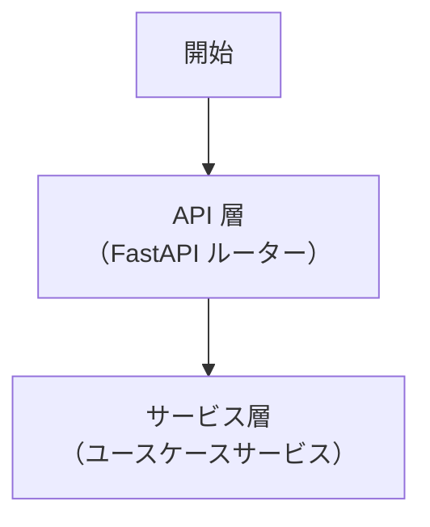

#### 間違った例

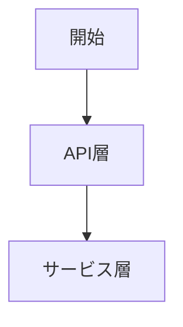

**問題点**: ノードIDに日本語を使用しているため、エラーが発生する可能性がある

### 2. 引用符の使い方

#### 基本方針

- **ダブルクォート（`""`）を必ず使用**: シングルクォート（`''`）は使用しない
- **すべてのラベルを引用符で囲む**: 日本語や特殊文字を含まない場合でも、統一性のために引用符で囲むことを推奨

#### 正しい例

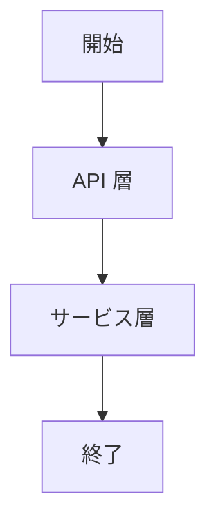

#### 間違った例

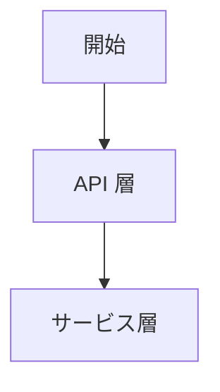

**問題点**: 日本語を含むラベルが引用符で囲まれていないため、エラーが発生する可能性がある

### 3. 特殊文字の扱い

#### 基本方針

以下の特殊文字を含むラベルは、必ず引用符で囲む：

- 括弧: `()`、`[]`、`{}`
- スラッシュ: `/`、`\`
- コロン: `:`
- ハイフン: `-`（ただし、ノードID内のアンダースコア `_` は問題なし）
- その他の記号: `!`、`@`、`#`、`$`、`%`、`^`、`&`、`*`、`+`、`=`、`|`、`~`、`` ` ``、`<`、`>`、`?`

#### 正しい例

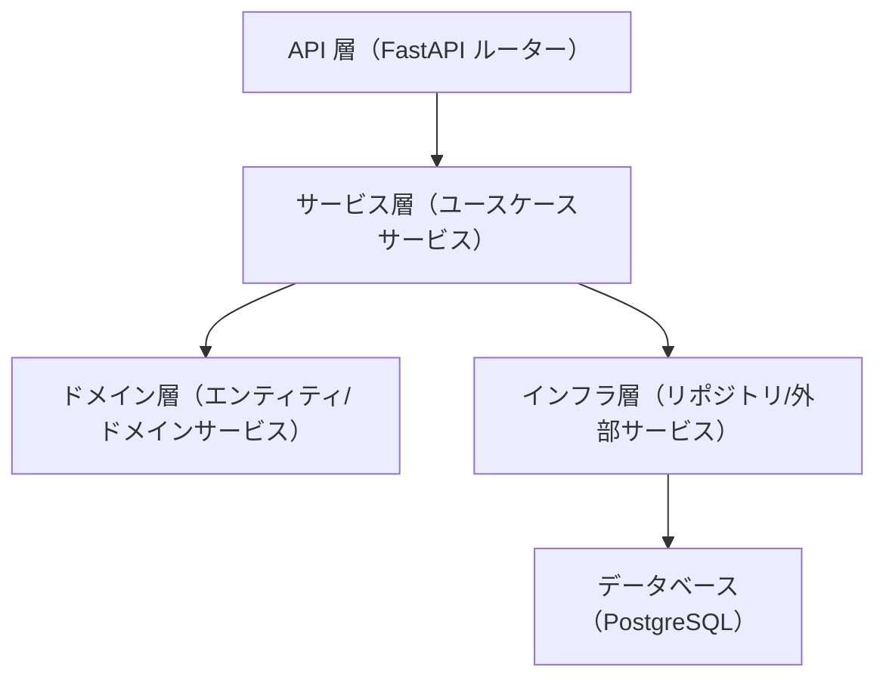

#### 間違った例

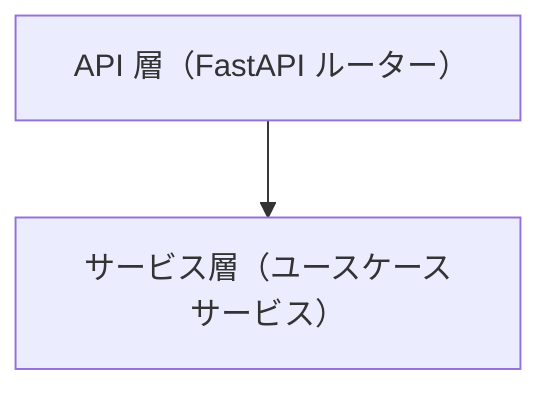

**問題点**: 括弧を含むラベルが引用符で囲まれていないため、エラーが発生する可能性がある

### 4. エッジラベルの扱い

#### 基本方針

- エッジラベルに日本語や特殊文字を含む場合は、引用符で囲む
- エッジラベルは `|"ラベル"|` 形式で記述

#### 正しい例

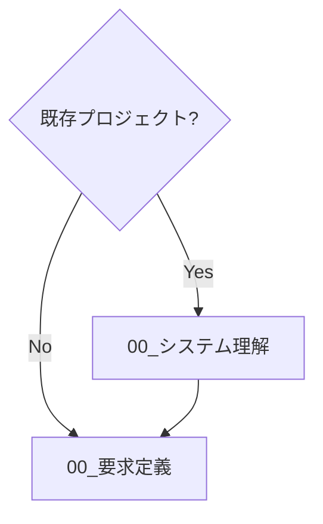

#### 間違った例


**問題点**: 
- ノードIDに日本語や特殊文字（`?`）を含んでいる
- エッジラベルが引用符で囲まれていない

### 5. 改行の扱い

#### 基本方針

- ラベル内で改行する場合は `<br/>` タグを使用
- 引用符内で `<br/>` を使用する

#### 正しい例

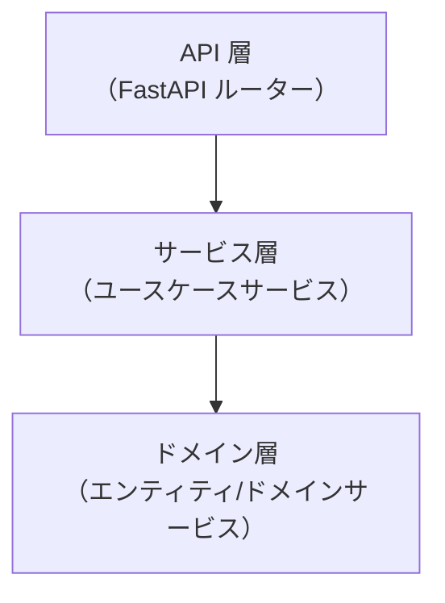

#### 間違った例

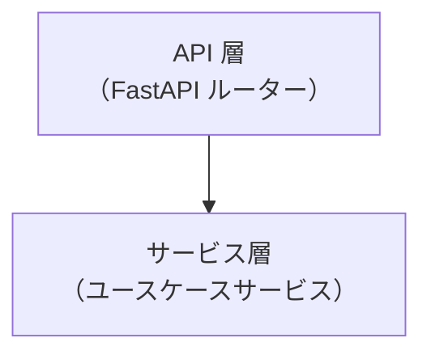

**問題点**: 改行を直接使用しているため、エラーが発生する可能性がある

---

## 図タイプ別のルール

### Flowchart（フローチャート）

#### 基本構文

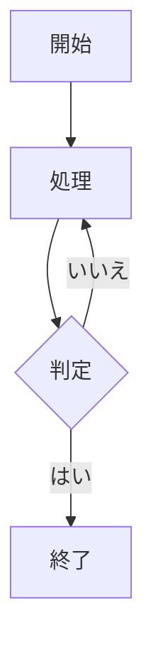

#### ノード形状

- **矩形**: `A["ラベル"]`
- **角丸矩形**: `B("ラベル")`
- **菱形（判定）**: `C{"ラベル"}`
- **円形**: `D(("ラベル"))`
- **円柱形**: `E[("ラベル")]`
- **六角形**: `F{{"ラベル"}}`
- **平行四辺形**: `G[/"ラベル"/]` または `H[\"ラベル"\]
- **台形**: `I[/"ラベル"\]` または `J[\"ラベル"/]`

**重要**: すべてのラベルは引用符で囲む

#### 方向指定

- `TD`（Top Down）: 上から下
- `BT`（Bottom Top）: 下から上
- `LR`（Left Right）: 左から右
- `RL`（Right Left）: 右から左

### Sequence Diagram（シーケンス図）

#### 基本構文

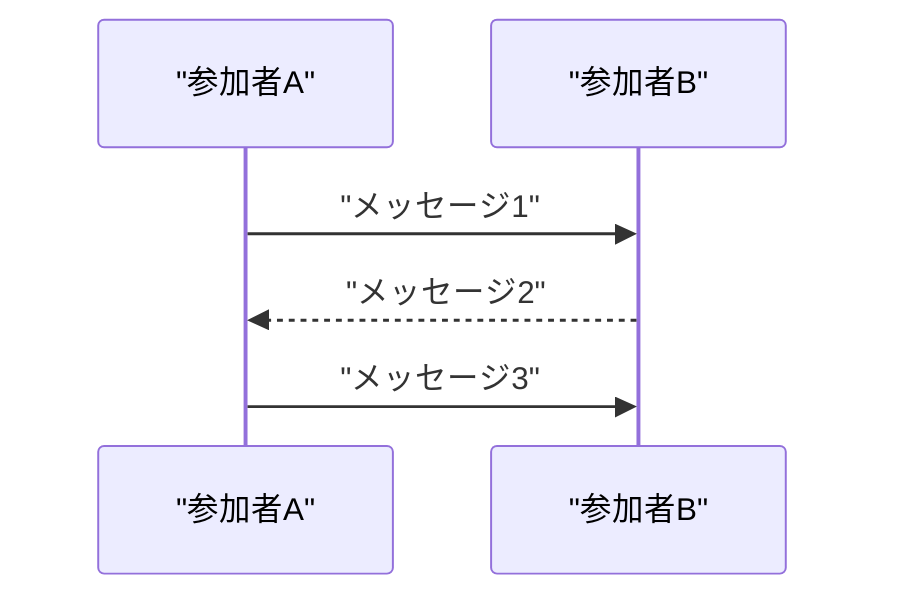

#### 正しい例

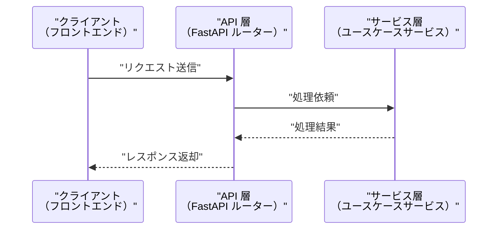

#### 間違った例

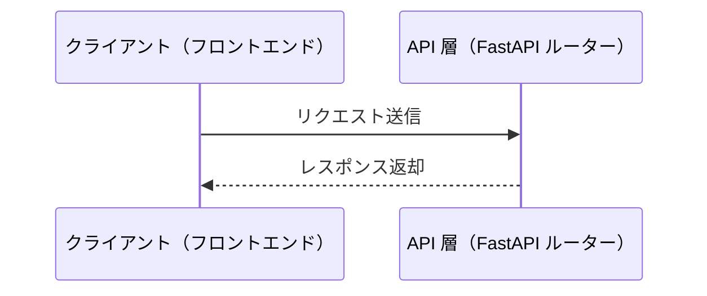

**問題点**: 
- `as` の後のラベルが引用符で囲まれていない
- メッセージラベルが引用符で囲まれていない

### Class Diagram（クラス図）

#### 基本構文

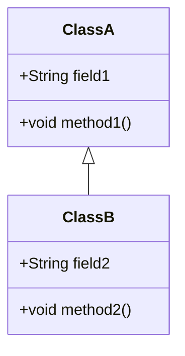

#### 正しい例

```mermaid
classDiagram
  class "API層" {
    +handleRequest()
    +validateRequest()
  }
  class "サービス層" {
    +processBusinessLogic()
    +validateBusinessRule()
  }
  class "ドメイン層" {
    +String entityId
    +void validate()
  }
  
  "API層" --> "サービス層"
  "サービス層" --> "ドメイン層"
```

#### 間違った例

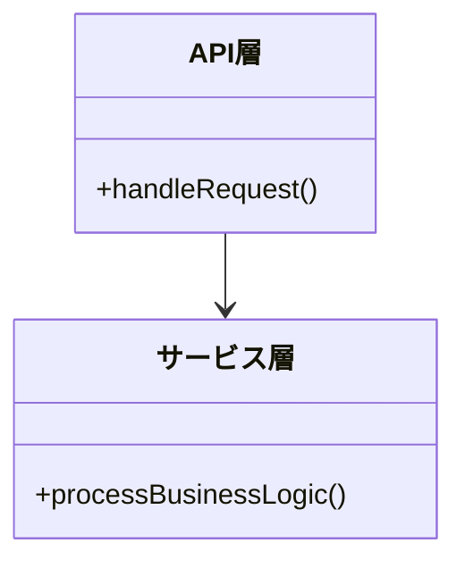

**問題点**: クラス名に日本語を使用しているため、エラーが発生する可能性がある

### ER Diagram（ER図）

#### 基本構文

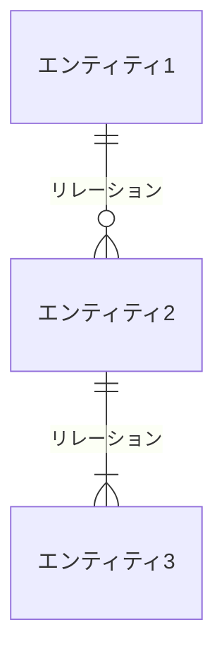

#### 正しい例

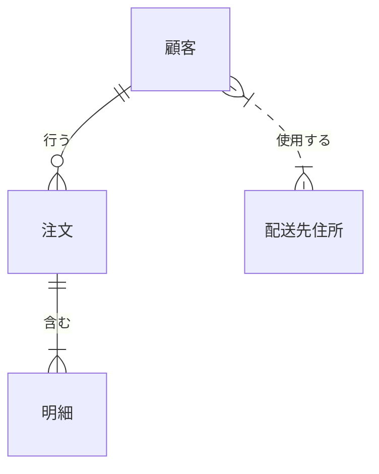

#### 間違った例

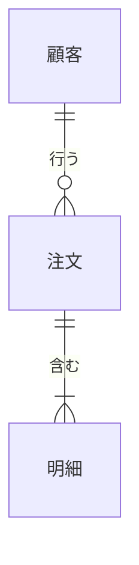

**問題点**: エンティティ名とリレーション名が引用符で囲まれていない

---

## よくあるエラーと対処法

### エラー1: 日本語を含むノードID

**エラー例**:
```mermaid
flowchart TD
  開始 --> 終了
```

**対処法**: ノードIDを英数字にし、ラベルを引用符で囲む
```mermaid
flowchart TD
  START["開始"]
  END["終了"]
  START --> END
```

### エラー2: 特殊文字を含むラベルが引用符で囲まれていない

**エラー例**:
```mermaid
flowchart TD
  A[API 層（FastAPI）]
  B[サービス層（ユースケース）]
  A --> B
```

**対処法**: ラベルを引用符で囲む
```mermaid
flowchart TD
  A["API 層（FastAPI）"]
  B["サービス層（ユースケース）"]
  A --> B
```

### エラー3: エッジラベルが引用符で囲まれていない

**エラー例**:
```mermaid
flowchart TD
  A{判定}
  B[処理1]
  C[処理2]
  
  A -->|はい| B
  A -->|いいえ| C
```

**対処法**: エッジラベルを引用符で囲む
```mermaid
flowchart TD
  A{"判定"}
  B["処理1"]
  C["処理2"]
  
  A -->|"はい"| B
  A -->|"いいえ"| C
```

### エラー4: 改行を直接使用している

**エラー例**:
```mermaid
flowchart TD
  A[API 層
  （FastAPI）]
```

**対処法**: `<br/>` タグを使用
```mermaid
flowchart TD
  A["API 層<br/>（FastAPI）"]
```

---

## LLM エージェント向け実行ルール（必須）

> ここから下は、**AI が Mermaid 図を生成するときに絶対に守るチェックリスト**です。

### 共通前提

- すべての Mermaid 図は、この `AGENTS_MERMAID_RULES.md` のルールに従う。
- エラーが発生しやすいパターンを避け、安定した図を作成する。

### 1. ノードIDの命名規則

AI は Mermaid 図を生成するとき、**必ず次を守る**：

- **ノードIDは英数字とアンダースコアのみ**: 日本語や特殊文字を含まない
- **大文字小文字を区別**: `START`、`API_LAYER`、`user_service` など
- **意味のある名前を使用**: `A`、`B`、`C` などの無意味な名前は避ける

**禁止事項**:
- ノードIDに日本語を使用する
- ノードIDに特殊文字（`-`、`/`、`:`、`()` など）を含める

### 2. ラベルの引用符ルール

AI は Mermaid 図を生成するとき、**必ず次を守る**：

- **すべてのラベルをダブルクォートで囲む**: `"ラベル"` 形式
- **日本語を含むラベルは必ず引用符で囲む**
- **特殊文字を含むラベルは必ず引用符で囲む**
- **統一性のため、英数字のみのラベルも引用符で囲むことを推奨**

**禁止事項**:
- シングルクォート（`'`）の使用
- 引用符なしで日本語や特殊文字を含むラベルを記述

### 3. エッジラベルの引用符ルール

AI は Mermaid 図を生成するとき、**必ず次を守る**：

- **エッジラベルに日本語や特殊文字を含む場合は引用符で囲む**: `|"ラベル"|` 形式
- **統一性のため、すべてのエッジラベルを引用符で囲むことを推奨**

**禁止事項**:
- 引用符なしで日本語や特殊文字を含むエッジラベルを記述

### 4. 改行の扱い

AI は Mermaid 図を生成するとき、**必ず次を守る**：

- **ラベル内で改行する場合は `<br/>` タグを使用**: `"ラベル1<br/>ラベル2"` 形式
- **引用符内で `<br/>` を使用する**

**禁止事項**:
- ラベル内で直接改行を使用する

### 5. 特殊文字の扱い

AI は Mermaid 図を生成するとき、**必ず次を守る**：

- **括弧、スラッシュ、コロンなどの特殊文字を含むラベルは必ず引用符で囲む**
- **特殊文字を含むノードIDは使用しない**

**禁止事項**:
- 特殊文字を含むラベルを引用符なしで記述
- 特殊文字を含むノードIDを使用

### 6. 参照パス確認ルール

AI は Mermaid 図生成時にドキュメントを生成するとき、**必ず次を守る**：

- **参照パス確認は必須**: ドキュメント作成・更新時は、**必ずすべての参照パスが正しいか確認すること**
- **確認タイミング**: ドキュメント作成時、更新時、レビュー時
- **確認方法**: すべての参照パス（Markdown リンク形式）を確認し、実際のファイルパスと一致しているか検証する
- **確認項目**:
  - 相対パスの形式が正しいか（`./`、`../` など）
  - ファイル名が正しいか（大文字小文字、拡張子を含む）
  - ディレクトリ構造が正しいか
  - リンク形式が正しいか（Markdown リンク形式: `[テキスト](./パス)`）
- **禁止事項**:
  - 参照パスを推測する
  - ファイル名を記憶に基づいて記載する
  - ディレクトリ構造を確認せずに参照パスを記載する
  - ファイルが存在しないのに参照パスを記載する
- **必須事項**: 参照パスを記載する前に、必ず実際のファイルパスを確認する
- **詳細**: 参照パス確認の詳細なルールは [`AGENTS.md`](./AGENTS.md) の「ドキュメント原則」セクションを参照

---

## AI 自己チェックリスト（Mermaid図生成前）

> **重要**: AI は、Mermaid 図を生成する前に、**必ず以下のチェックリストを自問自答し、すべての項目を確認すること**。

### Mermaid図生成時の自己チェック

Mermaid 図を生成する前に、以下を確認：

- [ ] **ノードID**: すべてのノードIDが英数字とアンダースコアのみか？（日本語や特殊文字を含まないか？）
- [ ] **ラベルの引用符**: すべてのラベルがダブルクォート（`""`）で囲まれているか？
- [ ] **エッジラベルの引用符**: すべてのエッジラベルが引用符で囲まれているか？（特に日本語や特殊文字を含む場合）
- [ ] **特殊文字**: 括弧、スラッシュ、コロンなどの特殊文字を含むラベルが引用符で囲まれているか？
- [ ] **改行**: ラベル内で改行する場合は `<br/>` タグを使用しているか？
- [ ] **図タイプ別のルール**: Flowchart、Sequence Diagram、Class Diagram、ER Diagram など、図タイプに応じたルールを守っているか？
- [ ] **参照パス**: 生成するドキュメント内のすべての参照パスが正しいか？（Markdown リンク形式、相対パス、ファイル名、ディレクトリ構造を確認）

### チェックリストの使い方

1. **生成前に確認**: Mermaid 図を生成する前に、上記のチェックリストを確認する
2. **不備があれば修正**: チェックリストの項目に不備があれば、生成前に修正する
3. **確認結果を明示**: 生成物と一緒に「自己チェック結果」を簡潔に記載する（例: 「✅ ノードIDは英数字のみ、すべてのラベルをダブルクォートで囲み、エッジラベルも引用符で囲みました」）

---

## 実装例（正しいパターン）

### Flowchart例

```mermaid
flowchart TD
  START{"既存プロジェクト?"}
  SU["00_システム理解"]
  R0["00_要求定義"]
  R1["01_要件定義"]
  R2["02_設計"]
  R3["03_実装計画"]
  R4{"大きい?"}
  R5["90_issues で分割"]
  E["実装"]
  RV["04_review"]
  FC{"外部設定必要?"}
  FC2["05_最終確認"]
  DONE["完了"]
  
  START -->|"Yes"| SU
  START -->|"No"| R0
  SU --> R0
  R0 --> R1
  R1 --> R2
  R2 --> R3
  R3 --> R4
  R4 -->|"Yes"| R5
  R4 -->|"No"| E
  R5 --> E
  E --> RV
  RV --> FC
  FC -->|"Yes"| FC2
  FC -->|"No"| DONE
  FC2 --> DONE
```

### Sequence Diagram例

```mermaid
sequenceDiagram
  participant Client as "クライアント<br/>（フロントエンド）"
  participant NextJS as "Next.js API Router"
  participant FastAPI as "FastAPI<br/>（バックエンド）"
  
  Client->>NextJS: "リクエスト送信<br/>（HTTPOnly Cookie付き）"
  NextJS->>FastAPI: "リクエスト転送<br/>（Authorization ヘッダー付き）"
  FastAPI-->>NextJS: "レスポンス返却"
  NextJS-->>Client: "レスポンス転送"
```

### Class Diagram例

```mermaid
classDiagram
  class "API層" {
    +handleRequest()
    +validateRequest()
  }
  class "サービス層" {
    +processBusinessLogic()
    +validateBusinessRule()
  }
  class "ドメイン層" {
    +String entityId
    +void validate()
  }
  class "インフラ層" {
    +saveEntity()
    +findEntity()
  }
  
  "API層" --> "サービス層"
  "サービス層" --> "ドメイン層"
  "サービス層" --> "インフラ層"
```

### ER Diagram例

```mermaid
erDiagram
  "顧客" ||--o{ "注文" : "行う"
  "注文" ||--|{ "明細" : "含む"
  "顧客" }|..|{ "配送先住所" : "使用する"
  "商品" ||--o{ "明細" : "含まれる"
```

---

## 参考資料

### プロジェクトドキュメント

- [`AGENTS_AI_PLAYBOOK.md`](./AGENTS_AI_PLAYBOOK.md) - LLM エージェント運用ルール
- [`AGENTS.md`](./AGENTS.md) - 開発規約の全体像

### 外部参考資料

- [Mermaid 公式ドキュメント](https://mermaid.js.org/)
- [Mermaid Flowchart 構文](https://mermaid.js.org/syntax/flowchart.html)
- [Mermaid Sequence Diagram 構文](https://mermaid.js.org/syntax/sequenceDiagram.html)
- [Mermaid Class Diagram 構文](https://mermaid.js.org/syntax/classDiagram.html)
- [Mermaid ER Diagram 構文](https://mermaid.js.org/syntax/entityRelationshipDiagram.html)

---

## 最後に（人間向け）

- この `AGENTS_MERMAID_RULES.md` は、**Mermaid 図を作成する際のエラーを防ぐための規約**です。
- 迷ったときは：
  1. ノードIDは英数字とアンダースコアのみ
  2. すべてのラベルをダブルクォートで囲む
  3. エッジラベルも引用符で囲む
  4. 改行は `<br/>` タグを使用
  5. それでもエラーが出る場合は、`.workflow/{issue}/memo/` にメモを残してから検討

---

**最終更新**: 2025年12月19日（Mermaid図作成規約の初版作成）

