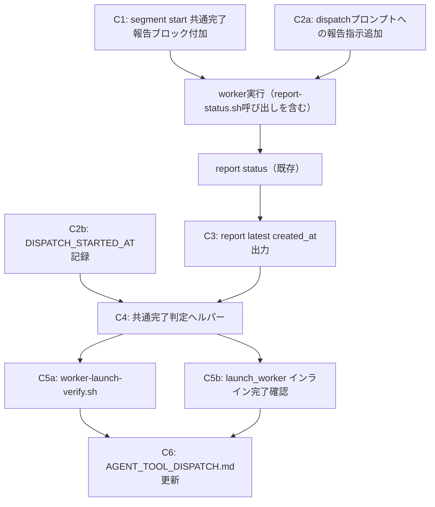

# DESIGN: launch_worker/worker-launch-verify の完了確認が、ワーカーに配達されない report status 投稿を前提としており、実運用で10/10のfalse-positive blockedを生む

- Issue: `ISSUE-642`
- 対応する SPEC: `SPEC.md`

## 要件 → 設計要素の対応表

| 要件 / AC-ID | 対応する設計要素 | 備考 |
|---|---|---|
| `AC-1`（全4ロール共通contractに完了報告手順が含まれる） | `C1: segment start 共通完了報告ブロック付加` | `config/roles.yaml` 個別編集ではなく生成側（`src/commands/segment.ts`）で機械的に付加する |
| `AC-2`（Agent tool dispatchのdispatchプロンプトにも完了報告指示が明記される） | `C2: _dispatch_via_agent_tool プロンプト拡張` | claude/codex 両分岐、既存の「最終応答限定」指示は維持したまま追加する |
| `AC-3`（契約に従い報告したworkerの完了がcompletedと正しく判定される） | `C1` + `C4: 共通完了判定ヘルパー` + `C5: 呼び出し箇所の統一` | 既存の一致判定ロジック自体は維持し、報告が実際に届く前提を回復することで通過させる |
| `AC-4`（前サイクルの古い報告を新サイクルの完了根拠として採用しない） | `C2`（`DISPATCH_STARTED_AT`記録） + `C3: report latest created_at出力` + `C4`（鮮度判定） | dispatch開始時刻より前に作成された報告を完了根拠から除外する |
| `AC-5`（blocked_reasonが報告不履行を正確に示し取り違えを誘発しない） | `C4` | 「報告なし/古い報告のみ」と「今回サイクルの報告はあるがstatus/target_sha不一致」を文言レベルで分離する |
| `AC-6`（既存のcompletion条件が変更・弱化されない） | `C1` / `C4` / `C5` | いずれも既存条件への追加としてのみ実装し、既存の commit+push・Draft PR 作成等の条件文言・判定は変更しない |

## 責務・境界

### コンポーネント構成

- `C1: segment start 共通完了報告ブロック付加`（`src/commands/segment.ts`）: `role_contracts.<role>` のYAMLダンプに続けて、対象role・segment・issue_idを埋め込んだ固定形式の完了報告手順ブロックを常に付加する。対象は spec/design/implementation/validation の4ロール全て。`config/roles.yaml` の `role_contracts.*.completion` 本文は変更しない（AC-6）。
- `C2: _dispatch_via_agent_tool プロンプト拡張・dispatch起点記録`（`.agent-skill-chain/adapters/claude.sh`）: 責務は2つ。(a) Agent tool dispatchプロンプト（claude分岐・codex分岐の両方）へ、成果物commit・push後にreport-status投稿を実行してから最終応答するよう明示する一文を追加する。既存の「最終応答は完了状態・target_sha・簡潔な1文要約のみに限定する」という指示文はそのまま維持し、その直前に挿入する。(b) dispatch用一時ディレクトリ作成直後にUTC ISO8601形式の時刻を取得し、既存の `contract.sha256`（`CONTRACT_SHA256`/`CONTRACT_LINES`を保持する監査ファイル）へ `DISPATCH_STARTED_AT` として追記する。新規ファイルを増やさず、既存の監査証跡ファイルの拡張として扱う。
- `C3: report latest created_at出力`（`src/commands/report.ts` の `latest`）: 既存の `status=<value>\ntarget_sha=<value>` 出力に `created_at=<UTC ISO8601>` 行を追加する。ローカルモードはreportファイルの最終更新時刻（`fs.statSync().mtime`）、GitHubモードは既に取得済みのコメント `createdAt`（GitHubサーバ側の確定値）をそのまま用いる。既存の2行（`status=`/`target_sha=`）は変更・削除しない（既存の `sed -n 's/^status=//p'` 等の抽出パターンへの互換性を保つ）。
- `C4: 共通完了判定ヘルパー`（`.agent-skill-chain/adapters/claude.sh` へ新設する関数）: 引数として issue_id・role・segment・比較基準時刻（dispatch経路は `DISPATCH_STARTED_AT`、headless経路はworker起動直前に取得したローカル時刻）を受け取り、次の順で判定する。
  1. `report latest` 自体が失敗（報告が1件も存在しない） → 「workerがreportを投稿していません（契約不履行の可能性）」を理由として不合格を返す。
  2. `report latest` は成功するが、取得した `created_at` が比較基準時刻より前（＝今回のdispatch/起動サイクルより前に作成された報告） → 同じく「workerがreportを投稿していません（契約不履行の可能性、dispatch開始前の報告のみ検出）」を理由として不合格を返す。
  3. `created_at` が比較基準時刻以降（＝今回サイクルの報告が存在する）が、`status` が `completed` でない、または `target_sha` が現在の `git rev-parse HEAD` と一致しない → 具体的な報告内容（status・target_sha・現在HEAD）を含む診断メッセージを理由として不合格を返す（既存文言の踏襲、今回サイクルの実報告に基づく正当な不一致であるため）。
  4. 上記いずれにも該当しない（今回サイクルの `completed` かつ `target_sha` 一致） → 合格を返す。
  呼び出し側は不合格時、既存の `_fail_blocked`（`report_status ... blocked ...` 投稿＋`release_lease`）または `_release_only_blocked` を、このヘルパーが返した理由文字列を渡して呼ぶ。
- `C5: 呼び出し箇所の統一`（`.agent-skill-chain/adapters/claude.sh` の `launch_worker` 末尾のインライン完了確認、および `.agent-skill-chain/scripts/worker-launch-verify.sh`）: 両箇所の個別実装（`report latest` 呼び出し＋status/target_sha比較＋blocked_reason組み立て）を `C4` の呼び出しへ置き換える。`worker-launch-verify.sh` は `contract.sha256` から `DISPATCH_STARTED_AT` を読み取って渡す。headless経路（`launch_worker` インライン確認）はworker起動直前に取得したローカル変数の時刻を渡す。
- `C6: 運用手順書の更新`（`.agent-skill-chain/standards/AGENT_TOOL_DISPATCH.md`）: `C1`〜`C5` 適用後のdispatch手順・完了条件（報告手順の明示、鮮度判定の追加）を自己完結する形で反映する。新しい決定の記録ではなく既存手順書の現状追従であるため、ADRの対象ではなく実装セグメントでのドキュメント更新として扱う。

### 依存関係

`C1` と `C2` は互いに独立してworkerへ届く二重の指示経路（contract本体／dispatchプロンプト）であり、実装順序上の依存はない。`C4` は `C3` が出力する `created_at` と `C2` が記録する `DISPATCH_STARTED_AT` の両方を入力として要求する。`C5` は `C4` を呼び出す側であり、`C4` の完成を前提とする。`C6` はすべての振る舞い変更が確定した後の記述更新である。



### 図示要否の判断

- 判断: `要`
- 根拠: 依存関係が `C1`・`C2a`・`C2b`・`C3`・`C4`・`C5a`・`C5b`・`C6` の8要素にまたがり3つ以上あるため（基準に該当）。責務境界も `C1`〜`C6` の6コンポーネントで3つ以上あるため重ねて該当する。

## 関連ADR

```yaml
related_adrs:
  - id: ADR-0058
    relation: references
```

`ADR-0058`（Agent tool dispatch層へ解決済みadapter名を環境変数で伝搬しadapter別に分岐させる決定）は `C2` が変更する `_dispatch_via_agent_tool` のclaude/codex分岐構造そのものを確立した既存の accepted 決定であり、本設計はその分岐構造の中にプロンプト文言追加と `DISPATCH_STARTED_AT` 記録を追加する形で整合させる（分岐構造自体は変更しない）。本Issue固有の新しい決定（`C1`の生成側付加方式、`C3`/`C4`の鮮度判定方式）は `ADR-0060` として別途 `status: proposed` で作成する。

## 障害・ロールバック考慮

- 想定される失敗モード:
  - `C1` の付加ブロックがcontract本文の先頭行（`role: <role_name>`、既存の `sed -n 's/^role:[[:space:]]*//p'` によるrole抽出対象）より前に挿入されると、既存のrole抽出処理（`_dispatch_via_agent_tool`・`worker-launch-verify.sh` 双方）が壊れる。設計上、付加ブロックは既存の `toYamlString(contract).trim()` の**後**（`parts.push` の末尾）にのみ追加し、先頭行を変更しない。
  - `C2b` の `DISPATCH_STARTED_AT` 記録漏れ・形式不正（UTC ISO8601以外の形式が混入する等）。`C5a`（`worker-launch-verify.sh`）は既存の `CONTRACT_SHA256`/`CONTRACT_LINES` と同様に必須項目として扱い、欠落・形式不正時は既存の `INTEGRITY_ERROR` 経路（監査証跡欠落として即blocked）へ倒す。新しい失敗モードを未検査のまま通過させない。
  - `C3` の `created_at` 追加行が、既存の `status=`/`target_sha=` に対する `sed` 抽出（`_dispatch_via_agent_tool` 外の既存呼び出し箇所を含む）に影響する。既存2行は変更せず新規1行を追記するだけであるため、行順・行内容ともに既存抽出パターンとの互換性を維持する。
  - `C4` の鮮度判定導入により、実際には今回サイクルの正当な完了報告であるにもかかわらず境界値（dispatch開始時刻と報告時刻が同一秒）で誤ってstale判定される回帰。比較は「報告時刻 < 比較基準時刻」を不合格条件とし、同時刻は合格側（`>=`）に倒すことで境界値を許容する。
- ロールバック手順: `C1`〜`C6` は独立したcommitに分割して実装する（PLAN.md参照）。いずれの変更単位も新規の外部状態・スキーマ変更を伴わないGit管理下ファイルの変更のみであり、対象commitのrevertだけで元の挙動（付加なしcontract・鮮度判定なし・既存blocked_reason文言）へ戻せる。`ADR-0060` は `status: superseded` への遷移で無効化できる。
- 影響を受ける既存機能:
  - `worker.agent_tool_dispatch.enabled: false` のheadless専用運用（`launch_worker` インライン完了確認のみを使用する経路）。`C5b` により判定ロジックが `C4` へ置き換わるが、既存の合否結果（`status=completed` かつ `target_sha` 一致で合格）自体は変更しない。
  - `adapter: codex` のdispatch経路（`_dispatch_via_agent_tool` のcodex分岐）。`C2a`/`C2b` は claude分岐・codex分岐の両方に適用する。
  - `.agent-skill-chain/config/roles.yaml` をカスタマイズしているconsumer project。`C1` は生成側（`segment start`）で付加するため、consumer側 `roles.yaml` の編集は不要かつ影響を受けない。ただし `segment start` の出力全体をパースする独自ツールを持つconsumerが仮に存在する場合、末尾追加ブロックの出現により出力形式が変わる（既知のconsumer依存は無い）。
