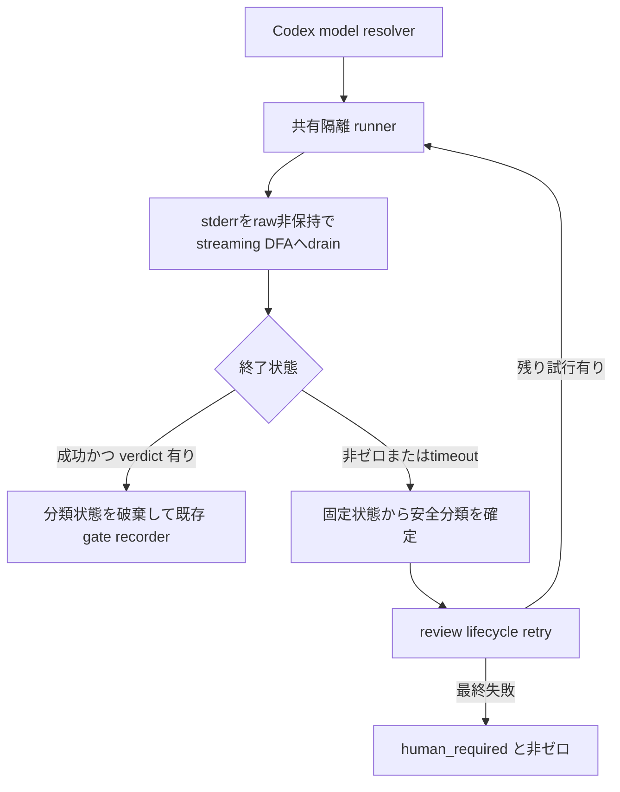

# DESIGN: Codex ゲートレビュアの起動失敗を安全に診断可能にする

- Issue: `ISSUE-744`
- 対応する SPEC: `SPEC.md`
- risk: `high`

## 目的・対象範囲

Codex ゲートレビュアの非ゼロ終了を、秘密値や raw stderr を外へ出さずに分類できるようにする。
対象は共有隔離 runner の stderr 処理、Codex reviewer の non-core model 解決、既存 lifecycle の
失敗報告である。成功 verdict、core review の能力証明、認証 probe、read-only 隔離、再試行、
watchdog、`human_required` へのフェイルセーフは維持する。

## 入力・出力・制約

- 入力: reviewer command、prompt、timeout、core/non-core 区分、明示 model override、終了コード、stderr。
- 出力: 成功時は従来の verdict、失敗時は非ゼロと安全な診断、gate 状態は `human_required`。
- stderr は raw byte・文字列断片・行をファイルにも親プロセスのメモリにも保持せず、先頭 64 KiB だけを
  streaming DFA の分類入力とする。外部診断全体の上限は 4 KiB とする。
- prompt、reviewer stdout の一時ファイル、認証素材は隔離領域内だけに置き、全終了経路で削除する。
  成功時の構造化 verdict は従来どおり lifecycle へ返す。
- 診断は固定分類と数値・真偽値だけから構成し、stderr の文字列断片を転載しない。
- 実サービス・実資格情報は設計検証の入力にせず、代替 reviewer と偽の秘密値を使う。

## 要件 → 設計要素の対応表

| 要件 / AC-ID | 対応する設計要素 | 検証可能な結果 |
|---|---|---|
| `AC-1` | D1 streaming DFA、D2 完全一致分類、D4 lifecycle 結線 | 4分類と rc・試行回数を区別 |
| `AC-2` | D1 有界検査、D3 安全な診断 envelope | 64 KiB / 4 KiB の境界を検査 |
| `AC-3` | D1 raw非保持、D3 allowlist、D5 cleanup | 秘密値・raw断片・一時領域が残らない |
| `AC-4` | D3 検証失敗時の縮退 | 分類と rc だけで非ゼロ終了 |
| `AC-5` | D6 non-core model 解決、D2 model分類 | 暗黙 `gpt-5.6` を使わず専用分類 |
| `AC-6` | D6 override 優先順位 | 明示値を無改変で command へ渡す |
| `AC-7` | D7 core 境界の不変 | policy 不一致を起動前に拒否 |
| `AC-8` | D4 lifecycle 結線、D5 cleanup | 認証・timeout・retry・成功経路の回帰なし |

## 責務・境界

### コンポーネント構成

- **Codex model resolver**: non-core の明示 override と組込み既定を選び、選択元を診断 context にする。
- **共有隔離 runner**: stderr pipeを末尾までdrainし、raw内容を保持せず検査byte countと超過だけを管理する。
- **streaming分類器**: 各byteを固定grammarのDFAへ送り、秘密値へ逆変換できない固定サイズ状態だけを返す。
- **review lifecycle**: retry を管理し、最終失敗へ rc・試行回数・安全な分類を結線する。
- **gate recorder**: 既存どおり成功 verdict を記録し、失敗時は `human_required` を維持する。

### 依存関係と状態遷移



循環は lifecycle から runner への bounded retry だけであり、分類器や model resolver は gate 状態を
変更しない。状態変更は既存 recorder / fail-safe に限定する。

### 図示要否の判断

- 判断: `要`
- 根拠: 5つの責務境界と、成功・非ゼロ・timeout・retry・最終失敗の複数状態を持つため。

## 設計判断

### D1: stderr は raw 内容を保持しない streaming DFA へ drain する

実 reviewer の stderr は pipe へ接続し、隔離 runner の親制御処理が reviewer と並行して末尾まで読む。
親はraw byte、文字列断片、行を保存せず、先頭64 KiBを逐次DFAへ入力する。保持可能なのはgrammar上の
有限状態、検査byte count、`truncated`、model/auth各signatureの成立・衝突状態だけで、入力へ逆変換できる
可変長値は持たない。64 KiB超過後は分類入力を止めて`truncated=true`とするが、readerを閉じてreviewerの
終了コードをSIGPIPEで変えないよう末尾まで読み捨てる。成功、非ゼロ、timeoutのいずれでもstderr fileや
raw bufferを作らない。pipeまたはDFAを準備できない場合はreviewerを起動せずexecution failureとする。

### D2: raw 文字列を返さない固定分類を使う

分類値は `MODEL_UNAVAILABLE`、`AUTHENTICATION_FAILURE`、`TIMEOUT`、
`EXECUTION_FAILURE` の閉じた集合とする。timeout marker があれば `TIMEOUT` とする。それ以外はDFAが
ASCII case-insensitiveに逐次照合し、行末CRを許容した**行全体**の完全一致だけを次のgrammarで成立させる。

- model identifierは**1〜128 byte**とし、各byteを単一引用符（`0x27`）以外のASCII可視文字（`0x21`〜`0x7E`）
  に限る。空、空白・タブ・制御文字・`0x7F`、`0x80`以上のbyteはidentifierを成立させない（照合は`LC_ALL=C`
  固定のため多byte文字は構成byte単位で不一致となる）。区切り文字`/` `:` `+`を含む値、大文字を含む値は成立する。
  この集合で`error: model '<id>' is not available`、`error: model '<id>' is not supported`、
  `error: model '<id>' does not exist`、`error: unknown model '<id>'`の4形式だけをmodel signatureとする。
  identifierをこの集合とするのは、明示 override が任意のmodel identifierを取り得る（`AC-6`）ため、
  英小文字・数字・`.` `_` `-` に限ると到達可能な`vendor/model`等のmodel unavailableが`AC-1`の判別対象から
  落ちるからである。行全体の完全一致という成立条件は変えないため、他の実行失敗の誤分類は増やさない。
- authentication signatureは`error: authentication failed`、`error: unauthorized`、
  `error: not authenticated`、`error: login required`、`error: not logged in`、
  `error: http 401`、`error: http 403`の7行だけとする。
- modelとauthenticationの両signatureが同じstderrに現れる場合、またはどちらにも完全一致しない場合は、
  原因を推測せず`EXECUTION_FAILURE`とする。

各候補は現在位置・identifier長・行終端到達だけを状態遷移で管理し、identifier自体や行を保持しない。
したがって`unknown option for model command`、追加suffix、部分文字列一致はmodel分類にならない。
non-core の組込み既定を使ったmodel failureだけは外部codeを
`NONCORE_DEFAULT_MODEL_UNAVAILABLE`とする。分類器はstderr本文を返さない。

### D3: 安全な診断は allowlist envelope に限定する

外部へ出せるフィールドは `code`、`classification`、整数 `rc`、整数 `attempts`、真偽値
`stderr_truncated` に限定する。値を厳密な enum / 数値 / 真偽表現へ再検証し、全体を 4 KiB 以下に
制限する。検証に失敗した場合は本文を捨て、`classification` と `rc` だけの固定文へ縮退する。
credential 値や stderr 由来の可変文字列を envelope の候補にしないため、既知・未知の秘密値を
文字列置換で追いかける設計にはしない。

### D4: attempt 情報は lifecycle が最終診断へ結線する

runner はreviewer終了後、成功ならDFA状態を破棄してverdictだけを返し、診断を生成しない。非ゼロなら
固定サイズの成立・衝突状態から安全分類を確定して終了状態とともに返す。timeoutはraw内容に依存せず
`TIMEOUT`とする。lifecycle は既存retry回数を数え、最終失敗時だけ最後の安全分類、rc、実際の試行回数、
`truncated`をfail-safe messageへ含める。分類不能や診断受渡し失敗は一般execution failureに縮退し、
承認へ倒さない。

### D5: cleanup は単一の終了処理で保証する

成功、通常の非ゼロ、timeout、watchdog準備失敗、分類失敗のすべてで、watchdogとstderr drainを回収し、
DFA状態を消去して隔離rootを削除する。stderr fileとraw bufferは全経路で存在しない。隔離root外へ返せるのは
成功時の構造化verdictと、非ゼロ・timeout時に固定状態から作った安全な診断だけである。raw stderr、prompt、
stdoutの一時ファイル、認証ファイルを隔離root外へ移動・複製しない。

### D6: non-core model は明示 override を最優先する

`CODEX_REVIEWER_MODEL` が非空なら値を変更せず最優先する。未指定の non-core は、観測上利用不能な
汎用名 `gpt-5.6` を選ばず、Codex adapter が現在対応する concrete default `gpt-5.6-sol` を選ぶ。
組込み既定で model unavailable になった場合は専用 code で停止する。実行時の model discovery、
provider CLI 全般の互換層、複数 model への自動 fallback は導入しない。

### D7: core review の選択と能力証明は別経路のまま維持する

core の model と reasoning は protected project policy の必須値から解決し、完全 command override の
attestation、read-only 条件、不一致時の起動前拒否を変更しない。non-core の組込み既定や診断分類を、
core の不足値を補う fallback として使わない。

## 障害・ロールバック考慮

- pipe drain・DFA状態遷移の失敗: reviewer群とwatchdogを停止し、`EXECUTION_FAILURE`で非ゼロにする。
- signature の未知化: raw 内容を出さず一般分類へ縮退する。将来 signature を増やす判断は別変更とする。
- 誤分類: gate はどの分類でも `human_required` のため silent approval は生じない。
- model 既定の利用不能: 専用分類で停止し、明示 override による運用回避を可能にする。
- ロールバック: D1〜D4 と D6 を同一 commit で戻す。既存の stderr 破棄と `human_required` は復元される。
- 影響範囲: Codex gate reviewer。Claude 固有の認証・model 解決は変更しない。

## 関連ADR

```yaml
related_adrs:
  - id: ADR-0051
    relation: references
  - id: ADR-0071
    relation: references
  - id: ADR-0079
    relation: adopts
```

## 検証方針・完了条件

- 4つのmodel完全一致fixture、7つの認証fixture、`unknown option for model command`、複合signatureを注入する。
- 成功reviewerへ秘密値を含むstderrを出させ、raw内容の保持、stderr file、診断がすべて0件であることを検査する。
- 非ゼロreviewerで64 KiB境界、超過、秘密値、chunk分割、retry、timeoutを決定的に注入し、固定状態だけを検査する。
- command 記録 stub で明示 override、non-core 既定、core attestation 不一致を検査する。
- 一時 root と追跡対象差分を検査し、raw stderr・偽秘密値・認証素材が残らないことを確認する。
- `npm run build` と全自動テスト、secret scan、適用される lint を implementation / validation で通す。

## 未決事項・対象外

未決事項はない。prompt 入力閉包、verdict stdout の secret 検査、実行パスの信頼境界、Claude 固有の
認証・資格情報ストア stderr・model 選択、実サービス疎通、provider CLI の将来互換層は対象外とする。
範囲外に真因が見つかった場合は設計を拡張せず、再現可能な証跡を進行役へ返す。
