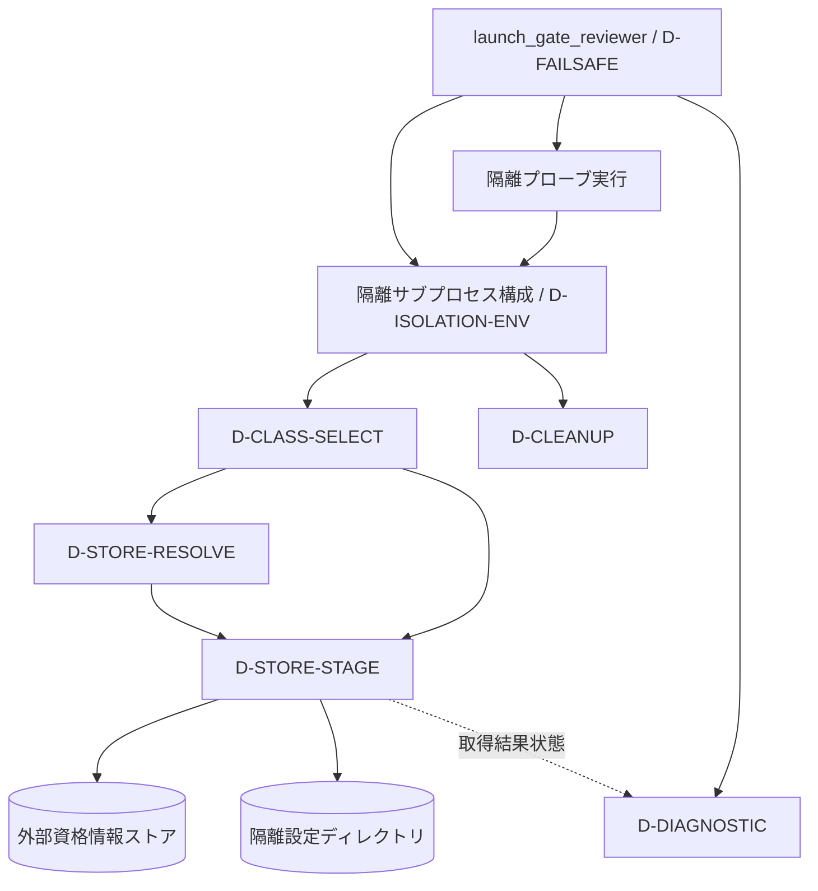
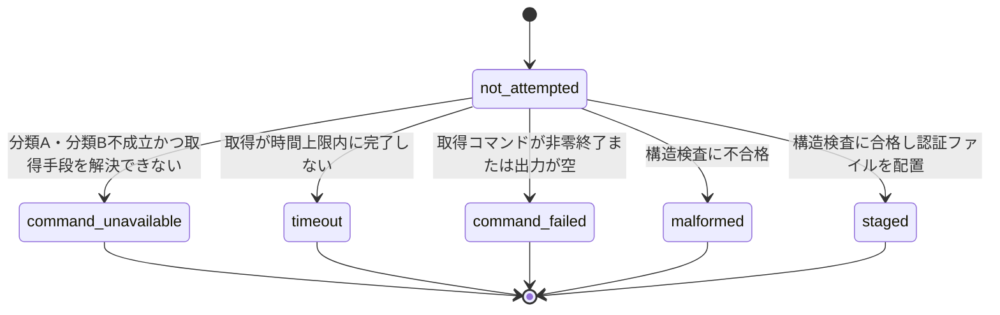

# DESIGN: env トークン非設定の資格情報ストア限定環境でゲートレビュアが認証できない

- Issue: `ISSUE-758`
- 対応する SPEC: `SPEC.md`

## 目的・対象範囲

claude アダプタのゲートレビュア起動経路について、認証情報の所在が外部資格情報ストアのみ（分類C）である
構成でも、実行系の上書きなしに verdict を得られる状態にする設計を確定する。あわせて、認証が成立しない
場合に原因が診断から特定できること、およびこの拡張によってゲートレビュアの隔離と read-only 性が
弱まらないことを設計上担保する。

対象は `.agent-skill-chain/adapters/claude.sh` のゲートレビュア起動経路（隔離サブプロセスの構成・認証素材の
準備・認証確認・診断・復帰処理）、`.agent-skill-chain/standards/TEST_POLICY.md`（実機確認規約と模倣前提の
記録）、および claude アダプタのゲートレビュア起動経路を駆動する結合テストである。

## 前提

- 認証情報の所在は3分類に限られる。分類A＝環境変数（`ANTHROPIC_API_KEY` / `CLAUDE_CODE_OAUTH_TOKEN`）、
  分類B＝設定ディレクトリ配下の通常ファイル（`.credentials.json`）、分類C＝外部資格情報ストア限定
  （macOS Keychain 等。設定ディレクトリ配下に通常ファイルとして存在しない）。
- ゲートレビュアは `env -i` で構成した基底環境集合のうえで `/bin/bash` を子プロセスとして起動する。
  基底集合は `PATH`・`HOME`・`XDG_CONFIG_HOME`・`GH_CONFIG_DIR`・`GIT_CONFIG_GLOBAL`・`GIT_CONFIG_SYSTEM`・
  `GIT_TERMINAL_PROMPT`・`TMPDIR`・`LANG`・`LC_ALL` の10個であり、claude 経路ではこれに
  `CLAUDE_CONFIG_DIR` が無条件に加わる。シェルが自身の起動に伴い設定する `PWD`・`SHLVL`・`_` は
  子プロセス内の列挙結果に必ず現れる。
- 隔離領域は一時ディレクトリとして作成され、ディレクトリは 0700、複製した認証ファイルは 0600 で作られる。
  隔離領域は正常終了・時間上限超過・監視プロセス起動失敗のいずれの復帰経路でも削除される。
- 隔離環境の認証確認（以下「隔離プローブ」）はレビュア本体と同じ隔離サブプロセス内で実行され、
  レビュア実行系とは別個に上書きできる。上書き値は呼び出し元プロセスで解決され、隔離サブプロセスで
  実行するコマンド文字列として渡るため、上書きの有無は子プロセスの環境変数名の集合を変えない。
- 隔離サブプロセスの構成関数は1回のゲートレビュア起動につき2回呼ばれる。1回目は隔離プローブ、
  2回目はレビュア本体である。各回が独立した隔離領域を作り、終了時にそれを削除する。
- 分類Cの資格情報は呼び出し元プロセスからコマンドで機械的に取得でき、その出力は分類Bの認証ファイルと
  同一形式のテキストであると SPEC が前提を置く。本設計はこの前提が外れた場合に誤った成功へ倒れない
  ことを設計要素で担保する（後述の `D-STORE-STAGE` と未決事項）。

## 用語

- 認証素材の準備: 隔離領域内の設定ディレクトリ（以下「隔離設定ディレクトリ」）へ認証に必要な要素を
  用意する処理、および分類Aの環境変数トークンを隔離サブプロセスへ引き継ぐ処理の総称。
- 取得ステップ: 分類Cの資格情報を呼び出し元プロセス上で外部資格情報ストアから取得するコマンド実行。
- 取得結果状態: 取得ステップの結末を表す本設計の内部状態。値は `not_attempted`・`command_unavailable`・
  `timeout`・`command_failed`・`malformed`・`staged` の6種。

## 入力・出力

- 入力: 呼び出し元プロセスの環境（分類Aの環境変数、設定ディレクトリの位置、取得コマンドと時間上限の
  上書き変数）、呼び出し元設定ディレクトリ配下の認証ファイルの有無、外部資格情報ストアの応答。
- 出力: 隔離サブプロセスへ与える環境と隔離設定ディレクトリの内容、gate report の `final`、
  呼び出し元の標準エラーへ出力する診断、取得結果状態。

## 要件 → 設計要素の対応表

| 要件 / AC-ID | 対応する設計要素 | 備考 |
|---|---|---|
| 要件1 / `AC-1` | `D-ISOLATION-ENV` | 設定ディレクトリの値は隔離領域内に固定。未設定にも呼び出し元設定ディレクトリにもしない |
| 要件2 / `AC-2` | `D-CLASS-SELECT` / `D-STORE-RESOLVE` / `D-STORE-STAGE` | 分類A・分類B不成立時のみ取得し隔離設定ディレクトリへ配置する |
| 要件2・要件7 / `AC-3` | `D-STORE-STAGE` / `D-DIAGNOSTIC` / `D-FAILSAFE` | 時間上限超過を含む不成立時に分類別診断を出し `human_required` へ倒す |
| 要件2 / `AC-11` | `D-CLASS-SELECT` | 分類A・分類Bが成立した構成では取得ステップを起動しない |
| 要件3 / `AC-5` | `D-STORE-STAGE` / `D-ISOLATION-ENV` | 隔離設定ディレクトリへ書くのは認証ファイル1点のみ。作業ファイルは同ディレクトリ外へ置く |
| 要件4 / `AC-4` | `D-ISOLATION-ENV` / `D-STORE-RESOLVE` | 基底集合を変更せず、新設の上書き変数を隔離サブプロセスへ渡さない |
| 要件5 / `AC-6` | `D-STORE-STAGE` / `D-CLEANUP` | 認証ファイルを 0600 で先行作成し、正常終了後は隔離領域ごと削除する |
| 要件5 / `AC-8` | `D-STORE-STAGE` / `D-DIAGNOSTIC` | 実値の唯一の流路をリダイレクトに限定し、失敗経路の診断へ実値を載せない |
| 要件5 / `AC-12` | `D-CLEANUP` / `D-DIAGNOSTIC` | 認証確認不成立でも隔離領域を削除し診断を出す |
| 要件5 / `AC-13` | `D-CLEANUP` / `D-STORE-STAGE` | 取得の時間上限超過を含む全復帰経路で隔離領域を削除する |
| 要件6 / `AC-7` | `D-STORE-RESOLVE` / `D-ISOLATION-ENV` | 既定の取得コマンドは読取り専用。呼び出し元ホーム・設定ディレクトリへ書かない |
| 要件8 / `AC-9` | `D-REGRESSION-SUITE` | 3分類それぞれを対象とする結合テストを持つ |
| 要件8 / `AC-10` | `D-ASSUMPTION-REGISTRY` | 実機確認の実施時期・実行者・記録先と模倣前提を規約として持続させる |

## 責務・境界

### コンポーネント構成

- `D-ISOLATION-ENV`（隔離環境構成）: 隔離領域の作成と権限設定、基底環境集合の構成、
  `CLAUDE_CONFIG_DIR` を隔離設定ディレクトリへ固定すること、分類Aの環境変数トークンの引き継ぎ。
  本 Issue では**変更しない**。基底集合へ環境変数を追加せず、`CLAUDE_CONFIG_DIR` を未設定にする分岐も
  設けない。設定ディレクトリを未設定にすると CLI の探索先が呼び出し元ホーム配下へ後退し、呼び出し元
  由来の設定・hooks・MCP サーバ定義・権限設定がゲートレビュアへ適用され得るため、この分岐は採らない。
- `D-CLASS-SELECT`（分類判定）: 認証素材の準備において、分類A（呼び出し元環境のトークンが非空）と
  分類B（呼び出し元設定ディレクトリに複製可能な通常ファイルが実在し、隔離設定ディレクトリへ複製できた）
  のいずれかが成立するかを判定する。いずれも不成立で、かつレビュー対象アダプタが claude の場合に限り
  `D-STORE-STAGE` を起動する。判定は呼び出し元の状態のみに依存するため、1回の起動における2回の呼出しで
  同じ結論になる。トークンが非空だが実サービスで無効な場合も分類Aは「用意できた」と判定し、
  取得ステップは起動しない（判定を呼び出し元状態のみで決定的に定めるため。結果として認証は隔離プローブで
  不成立となり `D-DIAGNOSTIC` が分類Aの検出結果を提示する）。
- `D-STORE-RESOLVE`（取得コマンド解決）: 取得ステップとして実行するコマンド文字列と時間上限を決定する。
  上書き変数（コマンド文字列・時間上限）が呼び出し元環境に指定されていればそれを用いる。未指定の場合の
  既定値は、実行ホストが macOS であり既定の資格情報ストア問い合わせコマンドが実行可能な場合に限り
  与える。いずれも満たさない場合は取得手段なしと解決する。上書き変数は呼び出し元プロセスの環境変数で
  あり、基底環境集合へは加えない。既定コマンドは資格情報ストアを読み取るのみで、呼び出し元ホーム・
  設定ディレクトリへ書き込まない。
- `D-STORE-STAGE`（取得と配置）: 取得ステップの実行・時間上限の強制・隔離設定ディレクトリへの配置・
  値を出力しない構造検査・取得結果状態の記録を行う。次の制約を満たす。
  - 配置先の認証ファイルは、作成マスクを制限した状態で空ファイルとして先行作成し 0600 とする。作成から
    権限設定までの間に緩い権限で存在する窓を作らない。取得ステップの標準出力はシェルのリダイレクトで
    その認証ファイルのみへ接続する。取得結果を保持する変数・コマンド引数・中間の一時ファイル・
    パイプ中継を作らない。したがって実値は取得ステップの標準出力から認証ファイルへ直接流れる1経路
    だけを通り、コマンド起動列にも環境変数にも現れない。
  - 取得ステップの標準エラーは破棄する。資格情報ストア由来の診断が実値またはその一部を含み得るため、
    呼び出し元へ到達させない。
  - 時間上限は本設計の監視プロセスで強制する。取得ステップは独自のプロセスグループで起動し、
    上限到達時はプロセスグループ全体へ終了要求を送り、猶予後も残るプロセスを強制終了する。
    外部の時間上限コマンドの有無に依存しない。
  - 取得ステップの作業用ファイル（時間上限到達の記録等）は隔離設定ディレクトリの外（隔離領域直下）へ
    置く。隔離設定ディレクトリの内容を認証ファイル1点に保つため。
  - 取得後の検査は値を出力しない構造検査に限る。認証ファイルが非空であること、先頭の非空白文字が
    オブジェクト開始文字であること、末尾の非空白文字がオブジェクト終了文字であることのみをパターン照合で
    判定し、照合コマンドの出力は破棄する。内容を変数・標準出力・標準エラー・ログのいずれへも書き出さない。
  - 取得結果状態が `staged` 以外の場合は配置した認証ファイルを削除する。時間上限超過時に書かれ得る
    部分的な内容を隔離プローブへ渡さないため。
  - 取得結果状態がどれであっても呼び出し側へは失敗を返さず、状態の記録にとどめる。認証の成否は
    隔離プローブが実経路で判定する唯一の判定点であり、取得の可否をもう一つの判定点にしないため。
    要件2 が定める「取得が時間上限内に完了しない場合は待ち続けず失敗として扱う」は、取得を打ち切って
    分類Cの資格情報を用意できなかったものとして扱うことを指す。取得結果状態 `timeout` の記録と配置した
    認証ファイルの削除によりこれを実現し、その帰結として隔離プローブが不成立となり、`D-DIAGNOSTIC` が
    時間上限超過を提示し `D-FAILSAFE` が `human_required` へ倒す。打ち切り後に残る待ちは
    隔離プローブ自身の時間上限に限られ、取得ステップの応答を待ち続けることはない。
- `D-DIAGNOSTIC`（診断）: 認証不成立時に、分類Aの検出結果・分類Bの検出結果・分類Cの取得結果状態・
  設定ディレクトリの扱いを呼び出し元の標準エラーへ出力する。分類Cの記述は取得結果状態を根拠に決定し、
  取得できなかった原因（取得手段が無い／時間上限内に完了しない／取得コマンドが失敗した／
  取得結果が想定の形式でない）と、取得できたが隔離環境の認証確認が成立しなかった場合とを区別する。
  資格情報の実値・その一部・認証ファイルの内容・取得ステップの標準エラーはいずれも出力しない。
  設定ディレクトリの扱いとして、`CLAUDE_CONFIG_DIR` が常に隔離領域内を指し呼び出し元設定ディレクトリを
  解決先にしないことを明記する。
- `D-CLEANUP`（復帰時の削除）: 隔離サブプロセス構成関数の全復帰経路（正常終了・レビュア時間上限超過・
  監視プロセス起動失敗・取得の時間上限超過を経た認証不成立）で隔離領域を削除する。削除は取得ステップの
  プロセス群の終了を確認した後に行う。本 Issue は新たな復帰経路を追加せず、取得ステップの結末は
  既存の復帰経路のいずれかへ合流する。
- `D-FAILSAFE`（安全側復帰）: 認証不成立・実行系不在・起動失敗・時間上限超過・verdict 空・結線失敗の
  いずれでも gate report の `final` を `human_required` として復帰する。本 Issue では変更しない。
- `D-ASSUMPTION-REGISTRY`（模倣前提と実機確認の規約）: 自動テストが模倣する前提を識別子付きで列挙し、
  各前提が外れた場合に観測される挙動と確認手段を対応付けた規約を `.agent-skill-chain/standards/TEST_POLICY.md`
  へ置く。あわせて、分類C経路（隔離設定ディレクトリの構成・資格情報の取得と配置）を変更する Issue は
  macOS 実機での手動確認を独立検証セグメントで実施し、実行者・実行日時・前提識別子ごとの結果を当該
  Issue の `VALIDATION.md` へ記録する規約を置く。Issue 単位の成果物は Issue 完了後に既定ブランチ直下へ
  残らないため、規約の所在を配布対象の標準文書とする。
- `D-REGRESSION-SUITE`（3分類回帰テスト）: claude アダプタのゲートレビュア起動経路を実際のシェルで
  駆動し、分類A・分類B・分類Cそれぞれの成立と、分類C固有の失敗経路（取得手段なし・取得失敗・
  時間上限超過・認証確認不成立）、実値非露出、隔離設定ディレクトリの内容限定、呼び出し元副作用なし、
  子プロセス環境変数の集合を検証する。

### 模倣前提（`D-ASSUMPTION-REGISTRY` が保持する内容）

| 識別子 | 前提 | 前提が外れた場合に観測される挙動 |
|---|---|---|
| `STORE-A1` | 既定の取得コマンドが分類Cの資格情報を標準出力へ返す | 取得結果状態が `command_failed` となり診断が出る |
| `STORE-A2` | 取得結果は分類Bの認証ファイルと同一形式であり変換せず配置できる | 構造検査で `malformed`、または隔離プローブが不成立となり診断が出る |
| `STORE-A3` | 取得結果の末尾に付随する改行以外の余分な出力が無い | 同上 |
| `STORE-A4` | 取得が対話的承認を要求しない、または要求しても時間上限内に決着する | 取得結果状態が `timeout` となり診断が出る |
| `STORE-A5` | 取得コマンドは資格情報ストアを読み取るのみで呼び出し元へ副作用を与えない | 呼び出し元ホーム・設定ディレクトリの内容一覧と更新時刻が変化する |
| `STORE-A6` | 隔離設定ディレクトリへ配置した認証ファイルだけで CLI の認証が成立する | 隔離プローブが不成立となり診断が出る |

`STORE-A5` を除く各前提は、外れた場合に誤った成功へ倒れず、観測可能な不成立と診断へ倒れる。`STORE-A5`
のみは外れた場合に呼び出し元への副作用として現れるため、既定の取得コマンドを資格情報ストアの読取り操作に
限定することで前提を成立させる。上書き変数で別のコマンドを指定する運用における副作用の有無は利用者の
責任範囲とし、本設計は既定の取得コマンドについてのみ副作用の不在を担保する。前提の充足そのものは
`AC-10` の実機確認で確定する。

### 依存関係



循環は無い。`D-STORE-STAGE` から `D-DIAGNOSTIC` へは取得結果状態のみが一方向に渡り、`D-DIAGNOSTIC` は
どの設計要素へも制御を戻さない。責務は取得（`D-STORE-STAGE`）・解決（`D-STORE-RESOLVE`）・
判定（`D-CLASS-SELECT`）・提示（`D-DIAGNOSTIC`）・削除（`D-CLEANUP`）へ分割し、隔離サブプロセス構成関数へ
集中させない。

### 取得結果状態の遷移



`not_attempted` のまま終わる経路は、分類Aまたは分類Bが成立した場合とレビュー対象アダプタが claude で
ない場合である。`staged` 以外の終端では配置した認証ファイルを削除する。

### 図示要否の判断

- 判断: `要`
- 根拠: 設計要素間および外部システム（外部資格情報ストア・隔離設定ディレクトリ）との依存関係が
  3つ以上あり、取得結果状態の遷移も2つ以上ある。責務境界も3つ以上ある。基準3項目すべてに該当する。

## 制約

- 基底環境集合へ環境変数を追加しない。新設する上書き変数は呼び出し元プロセスの環境にのみ存在させる。
- 取得ステップは呼び出し元の環境で実行する。資格情報ストアの参照が呼び出し元のログインセッションに
  紐づくため。取得ステップのために資格情報を保持する環境変数を新設しない。
- 取得した資格情報を隔離領域の外へ複製・保存・キャッシュしない。1回のゲートレビュア起動で隔離サブ
  プロセス構成関数が2回呼ばれるため取得も2回行われるが、隔離領域外へ持ち出す複製を作らないことを
  優先する。隔離領域外のキャッシュは新たな残存経路となり要件5に反する。
- 実値を保持し得る箇所を増やさない。取得結果を変数へ代入しない（シェルのトレース出力に値が現れるため）、
  コマンド引数へ置かない、隔離設定ディレクトリの認証ファイル以外のファイルへ書かない。
- 取得の可否そのものを認証成否の判定点にしない。判定点は隔離プローブ1つに保つ。

## 障害・ロールバック考慮

- 想定される失敗モード:
  - 取得コマンドが対話的承認を要求して応答しない: 時間上限で打ち切り、部分的な内容を削除し、
    隔離領域を削除して診断へ倒れる。
  - 取得結果の形式が前提と異なる: 構造検査または隔離プローブで不成立となり診断へ倒れる。誤った成功には
    倒れない。
  - 時間上限の指定値が不正: 取得手段を解決できないものとして扱い、取得結果状態を
    `command_unavailable` とする。
  - 監視プロセスを起動できない: 取得ステップを起動しないか、起動済みなら打ち切り、取得結果状態を
    `command_failed` とする。いずれも配置した認証ファイルを削除し、既存の安全側復帰へ合流する。
  - 分類A・分類Bが成立する既存構成への影響: 取得ステップを起動しないため、既存の起動経路の挙動は
    変わらない。
- ロールバック手順: 本変更は claude アダプタへの追加分岐・診断の記述・標準文書の追記・テスト追加で
  構成される。切り戻しは当該コミットの revert で完結する。設定ファイル・スキーマ・状態ファイルの
  形式変更を伴わないため、移行処理も互換性処理も不要である。切り戻し後の挙動は分類Cが不成立の
  現行挙動へ戻る。
- 影響を受ける既存機能: claude アダプタのゲートレビュア起動経路のみ。セグメント作業ワーカー起動経路・
  codex アダプタ・ゲート判定ロジック・Coordination Backend 連携は変更しない。

## 完了条件

- SPEC.md の全要件・全 AC-ID が上表のいずれかの設計要素に対応している。
- 分類Cの資格情報の実値が、成功経路・取得失敗経路・時間上限超過経路・認証確認不成立経路のいずれでも、
  環境変数・プロセス起動列・診断・ログへ現れない設計になっている。
- 隔離領域の削除が上記4経路すべてで行われる設計になっている。
- 子プロセス環境変数の検査が、シェルが機械的に付加する変数で偽陽性にならず、かつ資格情報・呼び出し元
  識別情報の混入を検出できる設計になっている。

## 検証方法

`AC-1`〜`AC-9`・`AC-11`〜`AC-13` は `D-REGRESSION-SUITE` の結合テストで自動検証する。`AC-10` は
`D-ASSUMPTION-REGISTRY` が定める手順で macOS 実機の人間の実行者が手動検証し、結果を `VALIDATION.md` へ
記録する。実装単位ごとの対応は `PLAN.md` が定める。

## 関連ADR

```yaml
related_adrs: []
```

本設計の判断根拠は `ADR-0071`（`status: proposed`）に記録する。`related_adrs:` は `accepted` の ADR のみを
対象とするフィールドであるため、設計ゲート承認前の本 ADR はここへ記載しない。

## 未決事項

- SPEC.md の未決事項が求める「取得結果の形式の実機実測」「対話的承認要求の有無の実機実測」は、macOS と
  設定済みの資格情報ストアを備えたホストでのみ実施できる。本設計ではこれらを前提の確定によってではなく
  `D-STORE-STAGE` の構造検査と隔離プローブによる fail-closed 化で扱い、前提が外れても誤った成功へ
  倒れないようにした。前提そのものの確定は `AC-10` の実機確認で行い、`D-ASSUMPTION-REGISTRY` の
  識別子ごとに結果を記録する。実機確認で `STORE-A2` または `STORE-A3` が不成立と判明した場合は取得結果の
  変換が必要となり、本設計の `D-STORE-STAGE` の変更を要する。その変更は別 Issue として扱う。
- 既定の取得コマンドが参照する資格情報ストアの項目名は Issue #758 本文の実測に基づく。項目名が
  利用者環境で異なる場合は上書き変数で指定する運用とし、既定値の網羅は本 Issue では扱わない。

## 対象外

- codex アダプタのゲートレビュア起動経路、およびセグメント作業ワーカー起動経路の認証判定。
- macOS Keychain 以外の外部資格情報ストアへの個別対応。
- 認証情報の取得・更新・失効の管理。
- 隔離方針そのものの再設計（基底環境集合・隔離領域の構成方式・`HOME` の値の変更）。
- 呼び出し元プロセスが強制終了された場合の隔離領域の残存。
- ゲートレビュア子プロセス自身の標準エラーの呼び出し元への保全。
