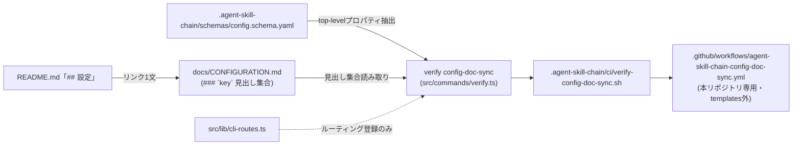

# DESIGN: docs: 各種モード・設定項目が散在しており体系的に一望できるドキュメントが無い(設定リファレンス整備)

- Issue: `ISSUE-429`
- 作成者: `design_worker`
- 対応する SPEC: `SPEC.md`

## 要件 → 設計要素の対応表

| 要件 / AC-ID | 対応する設計要素 | 備考 |
|---|---|---|
| `AC-1`（全項目一覧化） | `docs/CONFIGURATION.md`（設定項目一覧セクション） | `.agent-skill-chain/schemas/config.schema.yaml` の `properties` トップレベル17項目（`schema_version`除く）を `### \`<key>\`` 見出しで列挙 |
| `AC-2`（5要素必須） | `docs/CONFIGURATION.md`（各項目エントリの記述規約） | 既定値・取りうる値・影響・詳細リンクの4要素＋見出し自体が設定名 |
| `AC-3`（独立軸の関係） | `docs/CONFIGURATION.md`（「独立な設定軸の関係」節） | `autonomy`⇔`human_confirmation.*`、`risk`×`autonomy`→strict trigger（I8）を明文化 |
| `AC-4`（ARCHITECTURE.mdとの役割分担） | `docs/CONFIGURATION.md`（「ARCHITECTURE.mdとの役割分担」節） | ARCHITECTURE.md側は変更しない（既に「動作フロー図解が役割」と冒頭に明記済み） |
| `AC-5`（README.mdリンク） | README.md「## 設定」節への1文追加 | |
| `AC-6`（内容一致） | `docs/CONFIGURATION.md` 執筆規律 | 着手時点の実ファイル（`.agent-skill-chain/config/agent-skill-chain.yaml`・`.agent-skill-chain/schemas/config.schema.yaml`）を一次情報として記述する（本DESIGN.md作成時点で両ファイルを読了済み） |
| `AC-7`（機械検査新設） | `verify config-doc-sync` CLIサブコマンド／`.agent-skill-chain/ci/verify-config-doc-sync.sh`／`.github/workflows/agent-skill-chain-config-doc-sync.yml` | |
| `AC-8`（配布されない） | 上記CI検査を配布テンプレート外（`.github/workflows/` 直下の本リポジトリ専用ファイル）として新設する配置決定 | ADR-0024の主題 |
| `AC-9`（vocab/references lint） | 全設計要素の執筆規律 | `docs/CONFIGURATION.md`・README.mdはlint走査対象外（`defaultLiveFileRoots`不含）。`src/**`・`.agent-skill-chain/ci/**`・`.github/workflows/**`が対象、禁止語・§参照・file:line参照を避ける |

## 責務・境界

### コンポーネント構成

- `docs/CONFIGURATION.md`: 設定リファレンス本体。責務は全トップレベル設定項目の一覧化と、独立軸の関係整理・ARCHITECTURE.mdとの役割分担明記のみ。設定値そのものの正本ではなく、正本（`.agent-skill-chain/config/agent-skill-chain.yaml`・`.agent-skill-chain/schemas/config.schema.yaml`）の要約・道案内役に徹する。
- `README.md`（「## 設定」節）: 導線。`docs/CONFIGURATION.md` へのリンクを1文追加するのみで、内容を重複させない。
- `src/commands/verify.ts` の `configDocSync` 関数: 検査ロジック本体。責務は「schema.propertiesのキー集合」と「CONFIGURATION.mdの `### \`<key>\`` 見出し集合」の一方向差分検出のみ（既存 `computeTemplateSyncDiffs` と同型のsource→dest一方向比較。逆方向＝CONFIGURATION.md側にのみ存在する見出しはAC-7のGiven/Thenの対象外のため検査しない）。
- `src/lib/cli-routes.ts`: `'verify config-doc-sync': verify.configDocSync` の1行追加のみ（既存14件の `verify *` エントリと同一パターン）。
- `.agent-skill-chain/ci/verify-config-doc-sync.sh`: 既存 `verify-doc-length.sh`・`verify-template-sync.sh` と同一の薄いラッパー（CLI解決フォールバック＋`exec ... verify config-doc-sync`）。
- `.github/workflows/agent-skill-chain-config-doc-sync.yml`: 本リポジトリ専用のCIトリガー。責務はPR起動→build→検査実行のみで、Issue文脈解決（issue_id抽出等）は持たない（この検査はIssueスコープではなくリポジトリ全体のスキーマ⇔文書整合性を見るため）。

### 依存関係

```text
.agent-skill-chain/schemas/config.schema.yaml（読み取り専用）
  → verify config-doc-sync（src/commands/verify.ts）
      ← docs/CONFIGURATION.md（### `<key>` 見出し集合を読み取り）
  → .agent-skill-chain/ci/verify-config-doc-sync.sh（薄いラッパー）
      → .github/workflows/agent-skill-chain-config-doc-sync.yml（本リポジトリ専用、templates外）
src/lib/cli-routes.ts --(ルーティング登録のみ)--> verify config-doc-sync
README.md「## 設定」 --(リンク)--> docs/CONFIGURATION.md
```

循環依存なし。`docs/CONFIGURATION.md` はスキーマを読むだけの下流であり、スキーマ側は文書の存在に一切依存しない（スキーマ変更が文書執筆をブロックしない）。

### 図示要否の判断

- 判断: `要`
- 根拠: 依存関係の当事者が7つ（schema・CONFIGURATION.md・CLIサブコマンド・cli-routes・ラッパースクリプト・新設workflow・README.md）で3つ以上に該当し、責務境界（コンポーネント）も6つで3つ以上に該当するため、DESIGN.mdテンプレートの図示必須基準に該当する。



## 関連ADR

```yaml
related_adrs: []
```

本Issueに直接関連するADR-0017（配布テンプレートと本体専用ファイルの分離基準）・ADR-0021（issue_sync）・ADR-0015（segment_overrides）はいずれも本DESIGN.md作成時点で `status: proposed` であり、`related_adrs:` 構造化フィールドの参照対象（`accepted` のみ）に該当しないため、構造化フィールドには載せない（AGENTS.md「related_adrs 参照ルール」）。ADR-0017が確立した「配布テンプレートと本体専用ファイルを分離する」判断基準は、下記「新設ADR」および本設計のCI配置決定（AC-8対応）が自然文で踏襲する歴史的言及として扱う。

## 障害・ロールバック考慮

- 想定される失敗モード1: 将来 `config.schema.yaml` のトップレベルプロパティが追加・削除された際、`docs/CONFIGURATION.md` の追随を忘れる。→ `verify config-doc-sync` が当該PRで失敗し、本リポジトリ自身のCI上で顕在化する（consumerプロジェクトのCIには一切影響しない。AC-8）。
- 想定される失敗モード2: `docs/CONFIGURATION.md` の見出し表記が規約（`### \`<key>\`` の完全一致）から逸脱する（例: バッククォート抜け、H2で書く等）。→ 実際には項目が記載されていても機械検査が「欠落」と誤判定する（偽陽性）。対応は見出し表記を規約に合わせるのみで、内容の書き直しは不要。実装セグメントの単体テストで規約違反ケース（バッククォート抜け等）を1つ以上含める。
- 想定される失敗モード3: 新設する `.github/workflows/agent-skill-chain-config-doc-sync.yml` が `.agent-skill-chain/templates/github/.github/workflows/` に存在しないことにより `verify-template-sync`（byte単位比較）が誤検知しないか。→ `computeTemplateSyncDiffs`（`src/lib/template-sync.ts`）は `templates/github/.github/` 側のファイル集合のみを走査し、`.github/` 側にのみ存在する余剰ファイルは走査対象にしないため誤検知しない。既存の `agent-skill-chain-release.yml`（ADR-0017）が同型の前例として現に無検知で共存している。
- ロールバック手順: 本Issueの変更はいずれも「新規ファイル追加」「既存ファイルへの追記1文」「新規CLIサブコマンド追加」のみで、既存の実行時ロジック（segment/gate/lease/worker起動等）を一切変更しない。PRをrevertするだけで旧状態へ完全復帰する。
- 影響を受ける既存機能: なし。既存の `verify *` サブコマンド14件・`agent-skill-chain-ci.yml`・`agent-skill-chain-ci.yml` のテンプレート源はbyte単位で無変更。
