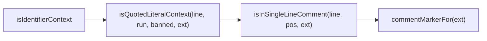

# DESIGN: lint-vocab: isQuotedLiteralContextが非散文ファイルのコメント中の禁止語誤用まで誤って除外する

- Issue: `ISSUE-484`
- 対応する SPEC: `SPEC.md`

## 要件 → 設計要素の対応表

| 要件 / AC-ID | 対応する設計要素 | 備考 |
|---|---|---|
| 要件1, 要件2 / AC-1, AC-2 | `commentMarkerFor(ext)`（新設）+ `isInSingleLineComment(line, pos, ext)`（新設） | 対象は単一行コメント（`//`・`#`）に限定し、`/* ... */` 等の複数行コメント構文は扱わない |
| 要件3 / AC-1, AC-2 | `commentMarkerFor(ext)` の拡張子ディスパッチ | `TEXT_EXTENSIONS`（`src/lib/scan.ts`）が定義する固定の拡張子集合に基づく一般規則。個別ファイル・個別行のハードコード例外を持たない |
| 要件4 / AC-4 | 既存4関数（`isCodeIdentifierContext`・`isYamlIdentifierContext`・`isCliSubcommandContext`・`isExternalVocabAllowlisted`）は無変更 | `isIdentifierContext()` の呼び出し順序・各分岐の実装・戻り値は一切変更しない |
| 要件5 / AC-3 | `isQuotedLiteralContext(line, run, banned, ext)`（変更、`ext` 引数追加） | 既存の単一引用符＋配列要素・関数呼び出し引数の構文境界判定はそのまま維持し、冒頭にコメント位置ガードを追加するのみ |
| 要件6 / AC-1〜AC-4 | 回帰テスト（`test/integration/lint.test.ts`） | 修正前は失敗し修正後は成功するケースを追加する |

## 責務・境界

### コンポーネント構成

- `commentMarkerFor(ext)`（新設、`src/commands/lint.ts`）: 拡張子ごとの単一行コメント開始記号を返す純関数。`lint vocab`/`lint references` が対象とする拡張子は `TEXT_EXTENSIONS`（`src/lib/scan.ts`）が定義する閉じた集合（`.md`・`.yaml`・`.yml`・`.sh`・`.json`・`.ts`）に限られる。うち `.md` は既に `isProseFile(ext)` により本判定の呼び出し自体の対象外、`.json` はコメント構文を持たない。残る `.ts` → `'//'`、`.sh`・`.yaml`・`.yml` → `'#'` を返し、それ以外は `undefined` を返す。
- `isInSingleLineComment(line, pos, ext)`（新設、`src/commands/lint.ts`）: `commentMarkerFor(ext)` が記号を返す場合に限り、その記号が `line` 中で `pos` より前の位置に出現するかどうかを判定する純関数。記号が存在しない拡張子（`undefined`）では常に `false` を返す。
- `isQuotedLiteralContext(line, run, banned, ext)`（変更、`ext` 引数を追加）: 冒頭で `isInSingleLineComment(line, run.runStart, ext)` を判定し、真であればコード値リテラル文脈として扱わず `false` を返す（＝以降の識別子文脈判定・散文誤用検出に委ねる）。それ以外の既存判定条件（禁止語と完全一致する識別子run・直前直後の単一引用符・配列要素/関数呼び出し引数の構文境界）は一切変更しない。
- `isIdentifierContext()`（既存、呼び出し1箇所のみ変更）: `isQuotedLiteralContext(line, run, banned, ext)` の呼び出しに `ext` 引数を追加して渡すだけで、呼び出し順序・他の分岐（`isCodeIdentifierContext`・`isYamlIdentifierContext`・`isCliSubcommandContext`・`isExternalVocabAllowlisted`）には一切手を加えない。

### 依存関係

新設2関数は `TEXT_EXTENSIONS` 相当の拡張子集合と文字列の `indexOf` のみに依存し、新規の外部依存・新規ヘルパーを追加しない。

```text
isIdentifierContext → isQuotedLiteralContext(..., ext) → isInSingleLineComment(line, pos, ext) → commentMarkerFor(ext)
```

### 図示要否の判断

- 判断: `要`
- 根拠: 新設2関数＋変更1関数（`isQuotedLiteralContext`）＋呼び出し元1箇所（`isIdentifierContext`）の計4つの責務境界に変更が及ぶため、基準「責務境界（コンポーネント）が3つ以上ある」に該当する。実態は下記の通り分岐・状態を持たない単純な直列合成だが、基準への該当を機械的に優先し図示する。



## 関連ADR

```yaml
related_adrs: []
```

本Issue専用のADRとして、`docs/adr/ADR-0036-lint-vocab-quoted-code-literal-context.md`（Issue #469が`isQuotedLiteralContext`を新設した際の決定。単一引用符＋配列要素/関数呼び出し引数の構文境界のみに基づく判定とし、コード行かコメント行かを区別しない設計だったため本Issueが指摘する盲点を生んだ。本Issueにより`superseded`へ遷移させる）をsupersedeする`docs/adr/ADR-0037-lint-vocab-single-line-comment-scope-exclusion.md`（`status: proposed`、`isQuotedLiteralContext`に単一行コメント位置の除外ガードを追加する決定）を新規作成した。ADR本文の不変原則（一度`accepted`になった後は書き換え不可）に従い、判定基準の変更はADR-0036本文の修正ではなく新ADR（ADR-0037）の作成で反映する。既存の他Issueの`accepted`ADRで本設計が直接`adopts`するものは無く、ADR-0036・ADR-0037自体も本Issue時点でいずれも`accepted`ではない（ADR-0036は本Issueにより`superseded`へ、ADR-0037は本Issueで新規`proposed`）ため、`related_adrs`は空にする（本文中の自然文言及のみ行う）。

## 障害・ロールバック考慮

- 想定される失敗モード: 文字列リテラル内部に偶然 `//` や `#` を含むがコメント開始ではない行（例: URL文字列 `'https://example.com'` を含むコード行の後続に配列要素・関数呼び出し引数が続く場合）で、`commentMarkerFor`/`isInSingleLineComment` がその位置をコメント開始と誤判定し、コメント外の正当なコード値リテラル除外（Issue #469 が解消した誤検知）を局所的に再発させる可能性がある。SPEC.mdスコープ外（字句解析の高度化は対象外）として明示済みの残存リスクであり、本Issueでは受容する。
- ロールバック手順: `isQuotedLiteralContext` への `ext` 引数追加・コメントガード呼び出し、および新設2関数（`commentMarkerFor`・`isInSingleLineComment`）を1コミットでrevertすれば、既存4関数・呼び出し順序を一切変更していないため #469 時点（PR #481 マージ後）の挙動へ完全に復元できる。
- 影響を受ける既存機能: `lint vocab`（`agent-skill-chain lint vocab`）のみ。`lint references`・`lint adr`・`lint secrets` 等、他のlint系サブコマンドおよびlint以外の機能への影響はない。
