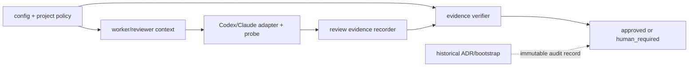

# DESIGN: worker・core gate review の reasoning 上限を high に統一する

- Issue: `ISSUE-814`
- 対応する SPEC: `SPEC.md`

## 目的・対象・入出力

worker と gate reviewer の現行 runtime における reasoning effort の上限を `high` にし、core review は provider にかかわらず `high` を必須にする。入力は config、registered project policy、core 判定、reviewer context、adapter 起動値・runtime probe、review evidence である。出力は許可値で起動した worker、または Strict 独立 reviewer 2体の検証済み evidence、不一致時の設定エラーまたは `human_required` である。ADR と固定 bootstrap 証跡は歴史的入力ではなく不変の監査記録として変更対象から隔離する。

## 要件 → 設計要素の対応表

| 要件 / AC-ID | 対応する設計要素 | 備考 |
|---|---|---|
| AC-1 | D1 共通 `high` policy | Strict・2体・read-only・fail-closed は維持する |
| AC-2 | D2 Codex tuple 境界 | `gpt-5.6-sol / high / read-only` を完全一致で検証する |
| AC-3 | D3 Claude runtime 証明境界 | runtime 固有 model/probe と evidence tier `high` を検証する |
| AC-4 | D4 worker・non-core 許可値境界 | 許容集合を `medium | high` に閉じる |
| AC-5 | D5 伝播・規範同期 | config から起動・evidence・生きた文書まで同期する |
| AC-6 | D6 負例の fail-closed | 旧値を全入力境界で拒否する |
| AC-7 | D7 歴史的証跡の隔離 | ADR/bootstrap を差分対象に含めない |

## 責務・境界

### D1 共通 `high` policy

`.agent-skill-chain/project/manifest.yaml`、project-policy schema、`CoreReviewPolicy` 型のベンダー中立 reasoning tier を `high` にする。reviewer context は同値を launcher と evidence recorder へ渡す。Strict、reviewer count 2、`frontier_coding`、read-only、分類不能時の `human_required` は変えない。

### D2 Codex tuple 境界

Codex core policy は model `gpt-5.6-sol` と reasoning effort `high` を保持する。Codex adapter は policy 由来の model/effort、read-only sandbox、完全 command override attestation を起動前に完全一致で検査する。evidence verifier は reviewer の model、reasoning、capability tier、read-only を protected policy と照合し、いずれかの不一致を承認しない。

### D3 Claude runtime 証明境界

Claude adapter は実行環境が宣言する実在 model を公式 model 指定へ渡し、model tier attestation、reasoning tier `high` の attestation、実行環境固有 reasoning probe、無書込み tool を起動前に検証する。probe は選択 runtime で `high` が有効であることを証明し、単なる `maximum_reasoning` 文字列の一致を成功条件にしない。recorder は reviewer reasoning と capability reasoning tier を `high` と記録し、verifier は両方を照合する。Codex 固有 model/設定 key は Claude 経路へ渡さない。

### D4 worker・non-core 許可値境界

config schema と `ReasoningEffort` 型、worker CLI help/context の許容集合を `medium | high` にする。登録済み実装 role policy から実装者判断による `xhigh` 格上げ許可を削除する。Codex worker と non-core reviewer の環境上書きは schema 外の runtime 入力であるため、adapter 自身も `medium | high` の allowlist を起動前に検証する。現行 implementation worker の恒久値 `high`、reasoning 未指定時の既存 fallback は `high` 以下である限り維持する。

### D5 伝播・規範同期

project manifest/schema/type、config/schema/type、gate/worker context、launcher、Codex/Claude adapter、review recorder/verifier、`MODEL_TIER_TABLE.md`、登録済み implementation role policy、test fixture を同一契約へ同期する。値の別名、互換分岐、追加フラグは作らない。

### D6 負例の fail-closed

config と project policy の旧値は schema error、環境上書きの旧値は adapter の起動前検査失敗、Claude の旧 attestation/probe と旧 evidence は `human_required`、Codex の旧 effort/evidence は policy mismatch とする。拒否後に lower effort へ自動変換せず、worker/reviewer subprocess と gate success へ進ませない。

### D7 歴史的証跡の隔離

`docs/adr/` と bootstrap ledger・command・fixture は編集しない。静的検索は現行 runtime asset と歴史的 asset を別集合として評価し、後者の旧文字列を現行許可値と誤認しない。accepted ADR-0031/ADR-0079 は effort 値の変更を妨げず、旧値を記録する ADR-0009/ADR-0015 は proposed であるため、新規 superseding ADR は作らない。

### 依存関係

policy から選択・起動・記録・検証への一方向依存とし、adapter/evidence から policy を書き戻さない。歴史的証跡は現行値の解決には使わない。

### 図示要否の判断

- 判断: `要`
- 根拠: worker と2 provider の起動境界、evidence 検証、歴史的証跡の隔離という複数責務の依存方向を明示する必要がある。

## テスト・fixture の同期範囲

- policy/config/schema/type: core capability が `high`、worker 許容値が `medium | high`、Strict 2体・Claude/human 契約が維持されることを検証する。旧値を持つ manifest/config は invalid とする。
- context: worker context と core reviewer context が `high` を出力し、help に旧許容値を表示しないことを検証する。
- Codex adapter: core の正しい tuple と通常 worker/reviewer の許可値を成功させ、各環境上書きの `xhigh` / `maximum_reasoning` は subprocess 起動前に失敗させる。
- Claude adapter: runtime 固有 model、`high` attestation、成功 probe、read-only を成功させ、旧 tier、probe 不足・失敗、provider 不一致を `human_required` とする。
- evidence: Strict 2 slot の Codex/Claude `high` evidence を承認し、reasoning または capability tier が旧値の evidence は `human_required` とする。
- 静的回帰: 生きた runtime asset に旧許可値が残らず、ADR/bootstrap 集合に差分が無いことを path 限定検索と `git diff` で検証する。

## 障害・ロールバック考慮

policy/schema/型/adapter/fixture の一部だけが旧値のままなら設定不適合、起動拒否、証跡拒否として顕在化させる。例外を追加せず最初にずれた正本または伝播先を修正する。ロールバックが必要なら実装 checkpoint 全体を一括で戻し、混在状態を残さない。歴史的 ADR/bootstrap は最初から変更しないためロールバック対象にも含めない。

## 完了条件・検証・未決事項

AC-1〜AC-7 の正負テスト、型検査、文書・静的検査が成功し、現行 runtime asset の `xhigh` / `maximum_reasoning` が許可経路としてゼロ、歴史的 ADR/bootstrap の差分がゼロであることを完了条件とする。未決事項はない。
