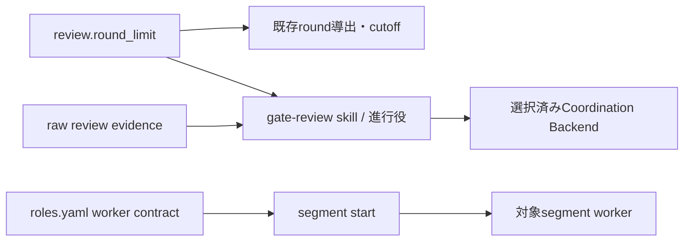

# DESIGN: ゲート差し戻しのラウンド予算と非追記型の是正方針

- Issue: `ISSUE-786`
- 対応する SPEC: `SPEC.md`

## 目的・範囲・前提

本設計は、既存のラウンド予算を進行役へ、非追記型の是正方針を対象セグメントの作業ワーカーへ配布する。入力は Issue の目的・risk・autonomy、対象ゲート、既存 review evidence、`review.round_limit` の解決値、レビュー結果である。出力は、レビュー開始前の予算宣言、最終ラウンド後の分類・follow-up 手続き、全セグメント作業ワーカーの是正契約である。

Issue #729 で実装済みの `review.round_limit`、round 0 起算、耐久 review evidence からの導出、限定閾値、cutoff、導出不能時の通常差し戻しを前提とする。設定、別カウンタ、別の導出元、severity 降格台帳は追加しない。既定値では `cutoff_threshold: 4` が最終 round 4、round 0 から最大5回を意味する。

ラウンド値を解決できない場合は予算による限定・打ち切り・降格を適用せず、取得不能だけを理由に `human_required` へ固定しない。既存の blocking 判定による差し戻しを維持し、この経路の有限性は保証しない。

## 要件 → 設計要素の対応表

| 要件 / AC-ID | 対応する設計要素 | 備考 |
|---|---|---|
| R1 / AC-1 | D1 既存予算の単一利用 | 全ゲートで解決済み cutoff を最終ラウンドとして配布 |
| R1 / AC-2 | D2 進行役の事前宣言契約 | レビュー開始前の耐久記録を必須化 |
| R1 / AC-3 | D2 最終後の4類型分類 | 限定列挙以外を warning にする |
| R1 / AC-4 | D2 安全分類 | データ喪失・セキュリティ低下は常時 blocking |
| R1 / AC-5 | D2 evidence・follow-up 手続き | raw evidenceを変更せず追跡先を確定 |
| R1 / AC-6 | D1 cutoff/fallback、D2 最終判断 | 解決可能時は収束、不能時は既存fallback |
| R2 / AC-7 | D3 worker role contract | 4 workerへ選択的に同一方針を配布 |
| R3 / AC-8 | D4 回帰防止検査 | ゲート・2観点・レビュア数・Strict・quickを不変にする |

## 責務・境界

### D1: 既存ラウンド予算の単一利用

- `.agent-skill-chain/config/agent-skill-chain.yaml` と standard/lightweight 配布テンプレートの `review.round_limit` を唯一の閾値設定とする。
- `src/lib/gate-round.ts` の既存導出結果と `src/lib/review-evidence.ts` の既存 cutoff 判定を再利用する。本 Issue ではこれらの算出・判定ロジックを変更しない。
- 「最終ラウンド」は解決済み `cutoff_threshold` と同じ値であり、ゲート別の別設定や別名の定数を作らない。
- 導出不能時は accepted ADR-0068 の fallback を維持する。事前宣言記録をラウンド導出元または cutoff 判定入力にしてはならない。

### D2: 進行役へ届くゲート運用契約

`.agent-skill-chain/templates/claude/skills/gate-review/SKILL.md` を進行役向け手続きの正本とし、配布済み `.claude/skills/gate-review/SKILL.md` へ init/upgrade が展開する。標準・軽量の両 profile で同じ skill を配るため、AGENTS.md だけに依存しない。

進行役はラウンド値を解決でき、rejectされた反復の既存導出結果に1を加えた値が解決済み最終ラウンドと一致した時、その差し戻しを確定する同じ状態遷移で「次回が最終」と宣言する。宣言は `gate`、直前の `attempt_id`、解決済み `final_round`、4類型、類型外findingのwarning化・follow-upを含む不変payloadとする。GitHub modeは固定marker付きIssueコメント、local modeは`state.yaml`の任意`gate.round_budget_declaration`に耐久化する。これは既存導出結果のsnapshotであり、round計数やcutoffの導出元にはしない。

最終反復のtrusted launcherはreviewer起動前に、最新完了attemptが宣言の直前attemptと一致し、既存導出値が宣言の`final_round`と一致することを検査する。宣言のCoordination Backend上の作成順序とcanonical digestを既存attemptの開始attestation・prompt・review evidenceへ結線する。宣言なし、レビュー開始後の作成、結果確定後の追加、payloadの上書き、直前attempt・digest・導出値の不一致は証跡検証で拒否して`human_required`とする。GitHubではコメントのAPI作成・更新metadataとPR reviewの順序、localではreview開始時に読み取ったstateのdigestとgate-report内のattempt結線を検査するため、事後追加はschema適合だけでは通過できない。attempt IDと既存review開始attestationを再利用し、新round counter・別導出元・宣言専用台帳は作らない。導出不能時は宣言遷移を推測せずD1のfallbackを維持する。

最終ラウンド後は各 finding を次のいずれかへ再分類する。

1. 既出 blocking の未是正
2. Issue 目的の直接阻害
3. test/build 失敗または回帰
4. データ喪失またはセキュリティ低下

1〜4が残れば最終判定は `human_required` とし、進行役の裁量で追加差し戻しをしない。4はラウンド、risk、profileに関係なく blocking とする。類型外findingは同じfinding記録の`severity`をwarningとし、必須`reclassification`に`original_severity`、`classified_severity: warning`、`downgrade_reason`、4類型すべてに該当しない根拠、永続化済み`follow_up_issue_id`を保持する。既存`evidence`配列をraw evidence原文として不変保持し、元reviewの値との完全一致を検査する。

GitHub modeはraw PR reviewを削除・改変せず、source review IDを持つ固定marker付き分類記録にfinding全体を保存する。local modeは`.agent-skill-chain/schemas/gate-report.schema.yaml`の同じ現行findingへ`reclassification`を保存する。`gate record-verdict`とschema検査はcurrent record単独で全必須値とraw evidence一致を判定し、Git履歴からの元severity復元を前提にしない。follow-up永続化前、必須値欠落、raw evidence変更では進行せず`human_required`とする。これはゲートの現行追跡記録の拡張であり、専用の降格台帳やIssue #745のworker除外契約は導入しない。

### D3: workerへ届く非追記型の是正契約

`.agent-skill-chain/config/roles.yaml` の `spec_worker`、`design_worker`、`implementation_worker`、`validation_worker` の各 `rules` を唯一の worker 正本とする。`src/commands/segment.ts` が起動対象ロールだけを直列化する既存経路により、進行役の手書きなしで対象workerへ届く。

各契約へ同じ意味の次の規範を追加する。

- blocking を局所的な条項・例外・分岐・フラグの追記で塞がず、原因となる既存記述・実装を書き換えるか削除する。
- 不要な要求・挙動を減らして発生源を除けるかを先に評価し、原因が上流なら最小の上流改訂と必要な再ゲートを選ぶ。
- Issue目的に本来必要な追加は例外として認めるが、書換え・削除・不要要求の削減・上流最小改訂のいずれでも目的を達成できない理由を検証可能なworker reportへ残す場合に限る。
- 真因が Issue の範囲外なら成果物を拡張せず、対象SHA・再現コマンド・終了コード・該当assetを実測報告する。

`.agent-skill-chain/schemas/worker-report.schema.yaml`の任意`remediations`は、是正方法を`rewrite|delete|reduce_unneeded|upstream_minimal_revision|required_addition|out_of_scope`から選ぶ。blocking付きremediation dispatchのcompleted報告では1件以上を必須とし、`required_addition`だけは非追加手段で達成不能な具体的理由を必須にする。`report status`は空理由の必要追加をschema検査で拒否する。個別worker間で文言を独自拡張せず、4契約の意味的同値とgate reviewerへの誤配布禁止を検査する。Issue #745が扱う降格済みfindingの除外・伝達は追加しない。

### D4: 配布・回帰検査

- `test/unit/roles.test.ts`: 全4 workerにD3の4規範があり、`gate_reviewer`には編集規範が無いことを検査する。
- `test/unit/gate-round-policy-assets.test.ts`: gate-review skillに既定round 0〜4、最終直前の宣言遷移、4類型、常時blocking、同一findingの追跡値、`human_required`、導出不能fallbackが揃うことを検査する。
- `test/unit/state.test.ts`とgate証跡検査: local宣言のschema適合・任意性・非導出境界、直前attemptとdigestの一致、宣言なし・レビュー開始後・結果後・上書きの拒否を検査する。GitHub fixtureでもAPI順序とdigest不一致を拒否する。
- `test/integration/gate-judgment.test.ts`: warning分類後のcurrent recordだけから元/分類後severity、理由、4類型外根拠、raw evidence、follow-upを検証し、Git履歴を参照しない。
- `test/integration/worker-adapters.test.ts`: remediation dispatchの報告を検査し、理由なし`required_addition`とremediation未報告を拒否する。
- `test/integration/init.test.ts` と `test/integration/upgrade.test.ts`: standard/lightweight の双方で role contract・gate-review skill・state schema が配布され、配布元との不一致を残さないことを検査する。
- 既存 `test/unit/gate-round.test.ts`、`test/unit/review-evidence.test.ts`、`test/integration/gate-judgment.test.ts` を回帰検査として維持し、round導出、cutoff、取得不能 fallback、conformance/falsification、Strict の件数を変えない。

### 依存関係



循環依存はない。進行役契約は既存runtimeの解決値とraw evidenceを読むが、宣言・分類記録をruntimeのラウンド導出へ戻さない。worker契約は対象ロールへ一方向配布される。

### 図示要否の判断

- 判断: `要`
- 根拠: 設定、round runtime、進行役skill、Coordination Backend、worker contract、配布処理の6責務があり、誤って宣言をround導出へ戻す循環を防ぐ必要がある。

## 関連ADR

```yaml
related_adrs:
  - id: ADR-0068
    relation: adopts
```

ADR-0068 のround導出、閾値、cutoff、取得不能 fallbackを採用し、その判断境界は変更しない。新しいアーキテクチャ判断を導入しないため proposed ADR は作成しない。

## 障害・ロールバック考慮

- 宣言未記録・事後追加・事後変更: attempt結線またはdigest検査で拒否し`human_required`。既存review evidenceを削除・上書きしない。
- follow-up永続化失敗: warning findingを黙って消さず `human_required`。便宜的にblockingへ戻して記録失敗を隠さない。
- local declaration・reclassification不正: state/gate-report schema検査で停止する。任意フィールドのため既存state/reportは移行なしで有効とする。
- worker契約の誤配布: role unit testとsegment起動の既存テストで検出し、旧配布物へ戻す。
- ロールバック: role contract、skill、state schemaの追加差分を同一checkpoint単位でrevertする。既存 `round_limit`、round導出、review evidenceは変更しないため、従来の通常差し戻しへ戻る。
- 影響を受けない機能: ゲート数、2観点、reviewer数、Strict固定、quick免除、既存config/default、反証ルーブリック、accepted ADR-0068。

## 完了条件・未決事項・対象外

全ACが上記テストへ対応し、standard/lightweight配布物から進行役と4 workerが各自の契約を観測できることを完了条件とする。未決事項はない。降格専用台帳、降格済みfindingのworker contract除外、別round counter、新設定、一般的な分量上限・テスト適用性、Strict並列化、別スループット施策、診断改善は対象外とする。
