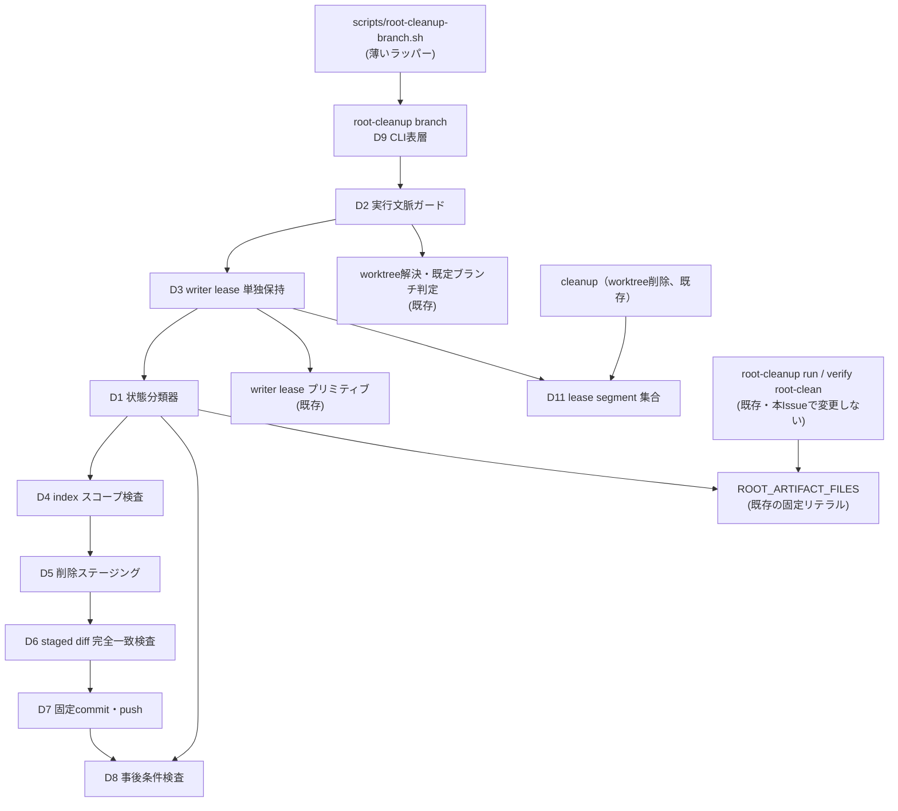
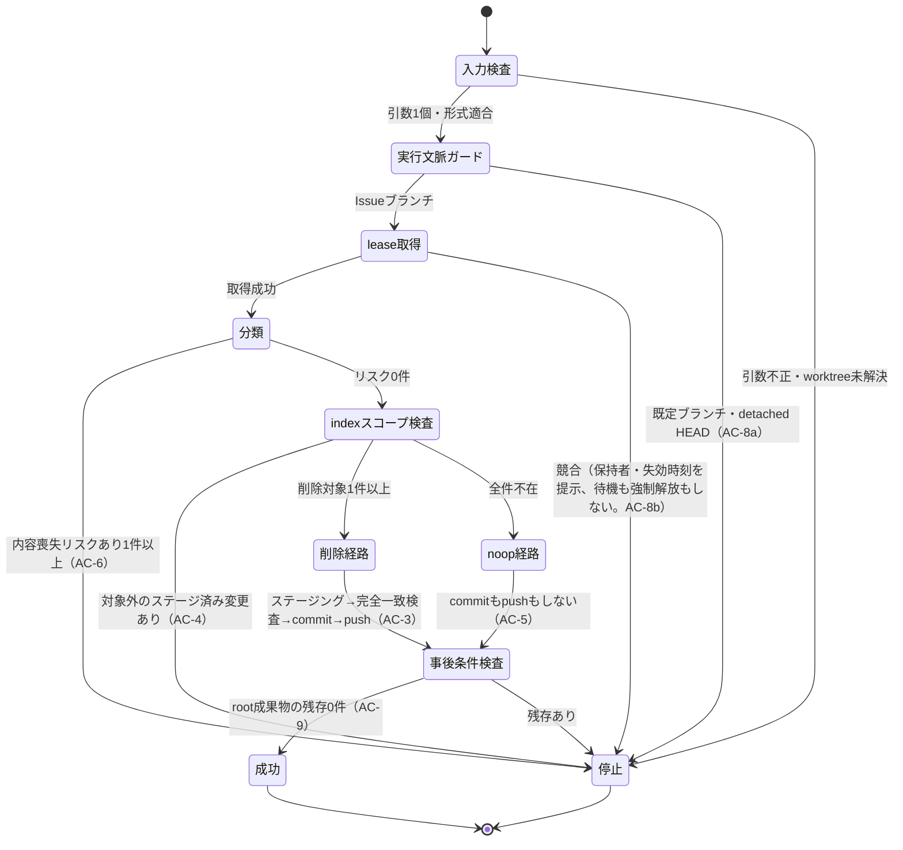

# DESIGN: root成果物の削除をscope限定ロールと決定的コマンドへ移す

- Issue: `ISSUE-798`
- 対応する SPEC: `SPEC.md`
- risk: `normal`

## 目的・対象範囲

repository root 直下の Issue セグメント成果物4ファイル（`SPEC.md`・`DESIGN.md`・`PLAN.md`・`VALIDATION.md`。以下 **root成果物**）を Issue ブランチ上でマージ前に削除する操作を、LLMワーカーの1ラウンドから、scope を限定した専用ロールと進行役が起動する決定的コマンドへ移す。あわせて claude adapter のセグメント作業ワーカーが push 前に `.agent-skill-chain/ci/` 配下の read-only 検査を自ら実行できるようにする。

対象は (a) 新設する決定的コマンドとその薄いラッパー、(b) `.agent-skill-chain/config/roles.yaml` のロール定義と入出力契約、(c) writer lease の segment 集合、(d) `cleanup`（worktree削除）が走査する lease segment 集合、(e) claude adapter の許可コマンド列挙である。

**対象外**: 既定ブランチへの push を契機とする既存の事後清掃自動化（`root-cleanup run`）、root 直下の残存を検査する既存の検査コマンド（`verify root-clean`）、進行役の権限、codex adapter の sandbox 境界、4セグメント・4ゲートの構成、root成果物の生成場所そのもの。これらは本設計で1行も変更しない。

## 用語（本DESIGN内での定義）

- **root成果物**: repository root 直下の `SPEC.md`・`DESIGN.md`・`PLAN.md`・`VALIDATION.md` の4ファイル。実装上は既存の固定リテラル集合（`src/lib/root-artifacts.ts` の `ROOT_ARTIFACT_FILES`）をそのまま用い、設定化しない。
- **本コマンド**: 本Issueで新設する CLI サブコマンド `root-cleanup branch <issue_id>` と、その薄いラッパー `.agent-skill-chain/scripts/root-cleanup-branch.sh`。
- **クリーンアップロール**: 本Issueで新設する `root_artifact_cleanup_worker`（`scope: root_artifacts_only`）。
- **対象worktree**: 指定 Issue に対応する worktree。`findIssueWorktree` が解決する。
- **削除対象 / 内容喪失リスクあり / 不在**: SPEC が定義する対象ファイルの3状態区分。本DESIGNでもこの3語を同じ意味で用いる。

## 入力・出力・制約

- **入力**: 対象 Issue の識別子 1個のみ（`^ISSUE-[0-9]+$`）。`-h`／`--help` は使い方表示。それ以外の引数はすべて使い方エラーとして拒否する。標準入力は一切読まない。
- **出力**: 成功時は削除経路なら作成した commit の SHA、no-op 経路ならその旨を標準出力へ。失敗時は日本語で原因と利用者が取るべき操作を標準エラー出力へ出し、非ゼロ終了する。
- **制約**:
  - ファイル内容・commit メッセージ本文・任意テキストを外部から受け取る経路を持たない。commit メッセージは固定文字列で、可変部は `[0-9]+` に限定された Issue 番号だけである。
  - LLM・対話エージェント・アダプタを起動しない。同一入力・同一リポジトリ状態に対して同一の動作を行う。
  - 作られる commit は root成果物の削除のみで構成し、追加行・他パスへの変更を一切含まない。
  - Git から復元できない内容（未追跡ファイル・未commitの変更）を失わせない。該当があれば削除せず停止する。
  - 対象 Issue の writer lease を取得できない場合は待機も強制解放もせず停止する。
  - 終了コード0は、削除経路・no-op 経路のいずれであっても、対象ブランチの先頭 commit と対象worktree の作業ツリーの双方に root成果物が1件も存在しない状態が成立していることを意味する。

## 要件 → 設計要素の対応表

| 要件 / AC-ID | 対応する設計要素 | 検証可能な結果 |
|---|---|---|
| `AC-1` | D10 ロール定義・入出力契約 | `roles:`／`role_contracts:` 双方に scope・capabilities・forbidden が既存の scope 限定ロールと同構造で存在する |
| `AC-2` | D9 CLI表層（厳密arity・stdin不読）、D7 固定commitメッセージ、D13 依存閉包検査 | 引数1個以外を拒否し、import 閉包にアダプタ・LLM起動系が現れない |
| `AC-3` | D1 状態分類、D5 削除ステージング、D6 staged diff 完全一致検査、D7 commit/push | 削除のみのcommitが作られ SHA が出力され終了コード0 |
| `AC-4` | D4 index スコープ検査、D6 staged diff 完全一致検査 | 対象外のステージ済み変更があれば commit・push せず非ゼロ、worktree/index 不変 |
| `AC-5` | D1 状態分類、D8 事後条件検査 | 全件「不在」のときだけ commit も push もせず終了コード0 |
| `AC-6` | D1 状態分類（fail-closed） | 「内容喪失リスクあり」1件以上で削除せず非ゼロ、該当ファイル名を提示 |
| `AC-7` | D4 index スコープ検査、D5 pathspec 限定削除 | 対象外パスの未ステージ変更・未追跡ファイルが commit へ入らず実行後も残る |
| `AC-8` | D2 実行文脈ガード、D3 writer lease 単独保持 | 既定ブランチ・lease競合の双方で削除もcommitもpushもせず非ゼロ、lease は保持者と失効時刻を提示 |
| `AC-9` | D8 事後条件検査 | 終了コード0の直前に HEAD tree と作業ツリーの双方を検査し、残存があれば0を返さない |
| `AC-10` | D12 許可コマンド列挙の更新 | `ci/` 実行が `scripts/` と同表記で許可され、削除系は不在、理由が近傍に記述される |
| `AC-11` | D14 既存モジュール非干渉 | 既存の清掃自動化・残存検査の実装ファイルに差分が無く、既存テストが期待値変更なしで成功 |
| `AC-12` | D10 ロール定義、D3 lease | 進行役の forbidden が不変で、クリーンアップロールに著述・内容編集能力が無い |

## 責務・境界

### コンポーネント構成

- **D1 root成果物状態分類器**（`src/lib/root-artifact-state.ts`、新設）: git の機械可読な観測結果（HEAD tree のエントリ集合、index のエントリ集合、`git status --porcelain=v2 -z --untracked-files=all` のレコード列）だけを入力とする純関数。対象4ファイルそれぞれを「削除対象」「内容喪失リスクあり」「不在」のいずれか1つへ写像する。
  - **相互排他・網羅性**: 判定は次の決定表を上から1回だけ評価し、最初に成立した区分を確定させる。全ファイルがいずれか1区分に必ず落ちるため、3区分は相互排他かつ網羅的である。
    1. worktree または index に、HEAD と異なる内容を伴って存在する（未追跡・新規ステージ済み・内容変更・mode変更・型変更・rename/copy・未マージ）→ **内容喪失リスクあり**
    2. HEAD に存在する（作業ツリー上に存在する場合と、未ステージの削除・ステージ済みの削除により既に存在しない場合を含む）→ **削除対象**
    3. 上記いずれでもない → **不在**
  - **fail-closed**: 解釈できない porcelain レコード、未マージエントリ、blob OID または file mode が HEAD と一致しない一切の状態は「内容喪失リスクあり」へ倒す。削除して失う側ではなく停止する側へ倒すのは、SPEC が復元可能性の担保を成功条件ではなく停止条件として要求しているためである。
  - 「削除（不在）は HEAD と異なる内容に当たらない」ため、追跡済みファイルの未ステージ削除・ステージ済み削除は区分1ではなく区分2に落ちる。削除によって失われる内容は無く HEAD から復元できるためである。
- **D2 実行文脈ガード**（本コマンド内）: `findIssueWorktree` で対象worktree を解決し、そのチェックアウトが既定ブランチ（`defaultBranch`）でないこと、およびブランチが解決できること（detached HEAD でないこと）を確認する。既定ブランチであれば、既定ブランチ root 直下の清掃が既存の別自動化の担当であること、および既定ブランチへ直接 commit しないことを理由として示して停止する。
- **D3 writer lease 単独保持**（本コマンド内、`src/lib/github-lease.ts` の既存プリミティブを利用）: 1 Issue につき同時1つという writer lease の制約に本コマンド自身も従う。segment 値 `root_artifact_cleanup` で取得し、取得できなければ保持者と失効時刻を示して停止する。**待機も強制解放も行わない。** 取得後は成功・失敗・例外のいずれの終了経路でも必ず解放する。
- **D4 index スコープ検査**（本コマンド内）: 削除をステージする前に、index と HEAD の差分に対象4ファイル以外のパスが含まれていないことを確認する。含まれていれば、対象外のパスが commit へ含まれることを理由として示し、worktree と index を一切変更せずに停止する。
- **D5 決定的削除ステージング**（本コマンド内）: 削除対象について、pathspec を対象4ファイルのリテラルに限定した `git rm` で削除をステージする。作業ツリー上に存在するものは作業ツリーと index の双方から、作業ツリーに無く index にあるものは index から取り除く。既にステージ済みの削除は何もしない。pathspec がリテラル固定であるため、対象外パスの未ステージ変更・未追跡ファイルは構造的に巻き込めない。
- **D6 staged diff 完全一致検査**（本コマンド内）: commit を作る直前に、index と HEAD の差分が「削除対象の集合と完全に一致し、かつ全エントリが削除である」ことを再検査する。一致しなければ commit せず停止する。分類結果を信用せず commit 直前の実体を1点で検査することで、「削除のみで構成された commit」を構造的に保証する。既定ブランチ側の既存自動化がマージ直前に行う同趣旨のスコープ検査と、層は違うが同じ考え方である。
- **D7 固定commit・push**（本コマンド内）: `ensureGitIdentity` で commit 実行者の identity を確保し、固定メッセージで commit し、対象ブランチへ push する。メッセージの可変部は検証済み Issue 番号だけである。
- **D8 終了コード0の事後条件検査**（本コマンド内）: 終了コード0を返す直前に、削除経路・no-op 経路の双方で共通に、対象ブランチの先頭 commit の tree と対象worktree の作業ツリーの双方から root成果物が1件も観測されないことを検査する。1件でも残っていれば0を返さず停止する。作業ツリー側も見るのは、既存の残存検査コマンドが作業ツリー上の存在を見る実装だからである。
- **D9 CLI表層と薄いラッパー**: `root-cleanup branch <issue_id>` をディスパッチテーブルへ1行追加し、`.agent-skill-chain/scripts/root-cleanup-branch.sh` を既存ラッパーと同一の CLI 解決前文で用意する。引数はちょうど1個を要求し、超過・不足・形式不正はすべて使い方エラーとする。
- **D10 ロール定義と入出力契約**（`.agent-skill-chain/config/roles.yaml`）: `roles:` 配下へ `root_artifact_cleanup_worker`（`lease: writer`、`scope: root_artifacts_only`、capabilities は lease 取得・更新・解放と自ブランチへの commit・push のみ、forbidden に「対象4ファイル以外への変更」と「ファイル内容の編集」）、`role_contracts:` 配下へ同名の入出力契約（inputs・outputs・rules・completion・forbidden）を、既存の scope 限定ロールと同じ構造で置く。
- **D11 lease segment 集合の単一正本化**（`src/lib/lease-segments.ts`、新設）: writer lease が取り得る segment 値の集合をコード側の単一定数として定義し、`root_artifact_cleanup` を加える。`.agent-skill-chain/schemas/lease.schema.yaml` の enum は同じ集合であることを単体テストで突き合わせる。`cleanup`（worktree削除）が有効 lease を探すときに列挙している segment 名の直書きを、この定数の走査へ置き換える。直書きのまま6件目を足すと、将来 segment が増えたときに `cleanup` が有効 lease を見落として worktree を削除しうる欠陥が再発するため、追記ではなく走査元の置換で断つ。
- **D12 許可コマンド列挙の更新**（`.agent-skill-chain/adapters/claude.sh`）: セグメント作業ワーカーの既定許可コマンド列挙へ `.agent-skill-chain/ci/` 配下の実行を `.agent-skill-chain/scripts/` 配下と同じ2表記で加える。削除系コマンドは追加しない。列挙の近傍に、削除がワーカーの責務ではなくなったこと、およびその帰結として削除系を意図的に列挙しないことを理由として記述する。
- **D13 依存閉包検査**（テスト側）: 本コマンド実装モジュールの推移的 import 閉包に、アダプタ起動・ワーカー起動・ゲートレビュア起動の実装が含まれないことを、既存の依存トレース補助を用いて機械検査する。AC-2 の「LLMまたは対話エージェントの起動を含まない」を宣言ではなく構造で担保するためである。
- **D14 既存モジュール非干渉**: 既存の事後清掃自動化・残存検査の実装、およびそれぞれの薄いラッパーには一切差分を入れない。本コマンドは別モジュールとして新設し、既存側との接点はディスパッチテーブルへの1行追加と、対象ファイル集合を与える既存の固定リテラルの共有だけに限る。

### 依存関係



依存は上から下への一方向であり、循環は無い。既存側（`root-cleanup run`・`verify root-clean`）と新設側は `ROOT_ARTIFACT_FILES` を共有するだけで、互いを呼び出さない。責務は分類・ガード・lease・スコープ検査・ステージング・commit・事後検査へ分割し、単一モジュールへ集中させない。

### 状態遷移（判定順序）

停止条件は常に no-op 判定より優先する。上から順に評価し、最初に成立した1つだけを実行する。



lease は「成功」「停止」いずれの終端へ到達する場合も解放する。

### 図示要否の判断

- 判断: `要`
- 根拠: 責務境界（D1 分類器・D2 ガード・D3 lease・D4 スコープ検査・D5 ステージング・D6 完全一致検査・D7 commit/push・D8 事後条件検査）が3つ以上あり、コンポーネント間・既存資産との依存関係も3つ以上ある。さらに判定順序が「停止・削除・no-op」の3遷移を持ち、状態遷移が2つ以上あるという基準にも該当する。したがって依存関係図と判定順序の状態遷移図の双方を記載する。

## 設計判断とその根拠

### 進行役に成果物ブランチへの commit 能力を与えない構造

本コマンドは進行役が起動するが、commit の主体は進行役ではなくクリーンアップロールである。進行役の権限は本Issueで一切拡大せず、`forbidden` の「成果物branchへのcommit禁止」「成果物の著述禁止」を取り除かない。加えて、本コマンドは内容を与える入力経路（ファイル内容・commitメッセージ本文・任意テキストの引数、標準入力）を持たないため、進行役が本コマンドを経由して成果物を著述することは構造的に不可能である。これは AGENTS.md の不変条件 I5 を宣言ではなく引数仕様で担保するという設計である。

### writer lease から WIP 上限判定と可視性副作用を外す

本コマンドの lease 取得は「1 Issue につき同時1つ」という排他性のみを目的とし、既存の `lease acquire` サブコマンドが併せて行う WIP 上限判定・Issue ラベル付与・Issue コメント投稿は行わない。理由は次の3点である。

1. WIP 上限は新規作業を pipeline へ受け入れる際の入口判定である。本コマンドは既に受け入れ済みの Issue に対する終端処理であり、しかも実行はマージ直前に集中する。ここで上限判定を課すと、上限に達している状況——すなわちマージを最も急ぐ状況——でマージ前削除が拒否され、本Issueが解消しようとしている遅延をむしろ増幅する。
2. 実行時間が秒単位であり、可視性ラベル・コメントの付与と即時削除は Issue 上の雑音にしかならない。
3. 排他性そのものは lease ref への force 無し push（compare-and-set）が担保しており、WIP 判定を外しても二重取得は発生しない。

なお、有効な lease を保持したまま WIP 判定用ラベルを付けないため、他 Issue から見た有効 lease 数が本コマンドの実行中（秒単位）だけ1件少なく数えられる。上限判定は advisory であり、この誤差で不変条件が破れることはない。既存の `lease acquire` サブコマンドの外部挙動は変更しない。

### セグメント作業ワーカーが本コマンドを起動しても削除できない

許可コマンド列挙は `.agent-skill-chain/scripts/` 配下の実行を許可しているため、セグメント作業ワーカーは本コマンドのラッパーを呼び出せる。しかしワーカーは自身の segment で writer lease を保持しているため、本コマンドの lease 取得は必ず競合で失敗し、削除は行われない。「削除はワーカーの責務ではない」という方針が、列挙の増減ではなく writer lease の制約によって構造的に成立する。

### 新しい設定項目を追加しない

対象4ファイルは既に固定リテラルとして実装済みであり、設定化しないという既存の決定を踏襲する。対象集合・commitメッセージ・判定順序のいずれもプロジェクトごとに変える必要が無く、変えられることが AC-9 の事後条件や AC-3 の「削除のみのcommit」を弱めるため、ハードコードが正しい。したがってスキーマ更新・既定値定義・migration も発生しない。

### lease segment 集合の拡張が破壊的でない理由

`.agent-skill-chain/schemas/lease.schema.yaml` の segment enum へ値を1つ加える変更は、既存の lease 文書をすべて有効なまま保つ後方互換な拡張であり、schema 名前空間の版更新を要しない。同スキーマには過去にも同種の scope 限定ロール用の値が追加されている。

## 関連ADR

```yaml
related_adrs:
  - id: ADR-0080
    relation: adopts
  - id: ADR-0007
    relation: references
```

`ADR-0080` は本Issueで新規に作成する（`status: proposed`）。`ADR-0007` は既定ブランチへの push を契機とする事後清掃自動化を定めた既存の決定であり、本設計が置き換えず併存させる対象として参照する。

## 障害・ロールバック考慮

- **想定される失敗モード**:
  - **push 失敗（remote 先行・権限・接続）**: commit は作成済みでローカルに残る。commit を巻き戻すと削除内容の復元可能性を損なう経路が増えるため、巻き戻さずに非ゼロ終了し、診断へ保持している commit の SHA と実行すべき push コマンドを明示する。この状態で本コマンドを再実行すると、削除は既に HEAD に入っているため no-op として終了コード0を返す。したがって診断には「再実行ではなく push の完了が必要である」ことを明記する。
  - **lease 解放失敗**: commit・push が成功していても非ゼロ終了し、回収手段を診断へ示す。終了コード0が「clean に完了した」以外を意味しないようにするためであり、解放されない lease を黙って残すと次の書込み主体が原因不明で止まる。
  - **分類の入力を解釈できない**: 未知の porcelain レコード・未マージエントリはすべて「内容喪失リスクあり」へ倒し、削除せず停止する。
  - **対象worktree 未解決・detached HEAD**: 削除も commit も push も行わず非ゼロ終了する。commit 先ブランチが確定しない状態で書き込まないためである。
  - **既に他主体が書込み中**: lease 競合として停止する。待機による無限待ちも、強制解放による他主体の作業破壊も選ばない。
- **ロールバック手順**: 本Issueの変更は、新規モジュール追加・ディスパッチテーブル1行追加・ロール定義追記・許可コマンド列挙追記・lease segment 走査元の置換で構成される。commit 単位の revert で導入前の挙動へ戻り、既存の事後清掃自動化と残存検査は本Issueの変更に依存しないため revert 後も動作する。本コマンドが削除した成果物の内容は Git 履歴に残り、当該 commit の revert で復元できる。
- **影響を受ける既存機能**:
  - `cleanup`（worktree削除）: 走査する lease segment が1件増える。有効 lease を見落とさなくなる方向の変更であり、削除を許す条件は緩まない。
  - claude adapter のセグメント作業ワーカー: `.agent-skill-chain/ci/` 配下の read-only 検査を実行できるようになる。書込み能力は増えない。
  - writer lease スキーマ: enum に値が1つ増える。既存文書は有効なまま。
  - 既存の事後清掃自動化・残存検査・`lease acquire`・進行役の権限: 変更しない。

## 未決事項

- 既存の ADR status 更新コマンドは、対応するロール定義が lease 取得能力を持つと宣言している一方、実装では writer lease を取得していない。本コマンドは SPEC の要求どおり lease を取得するため本Issueの完了には影響しないが、既存側の宣言と実装の不一致は本Issueの範囲外であり、成果物を拡張して是正しない。ワーカー報告で観測事実として報告する。
