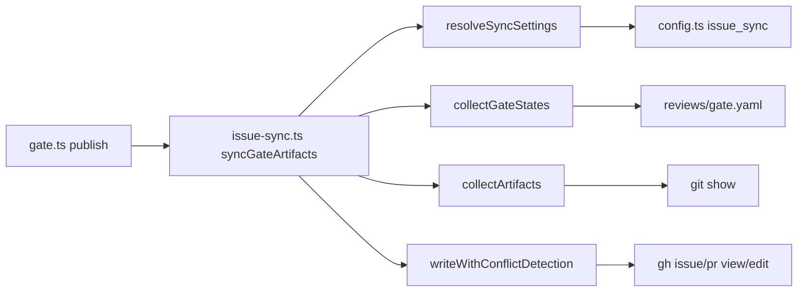

# DESIGN: GitHubモードで成果物全文をIssue/PR本文へ転記するissue_syncのMVP実装

- Issue: `ISSUE-354`
- 対応する SPEC: `SPEC.md`（本Issueは`ADR-0021`の起票を起点に着手したためSPEC.mdは作成せず、
  要件はADR-0021のDecision節D-1〜D-5を要件相当として下表に対応させる）

## 要件 → 設計要素の対応表

| 要件 / AC-ID | 対応する設計要素 | 備考 |
|---|---|---|
| D-1（I1/I3をCoordination Backend別に条件分岐） | `AGENTS.md`のI1・I3・Coordination Backend表の改定（本Issueのcommitで実施済み） | コード実装ではなく規範文書の改定。ADR-0021本文が判断根拠 |
| D-2（`issue_sync.enabled`のオプトイン、既定false） | `.agent-skill-chain/config/agent-skill-chain.yaml`の`issue_sync`セクション、`.agent-skill-chain/schemas/config.schema.yaml`の追加、`src/lib/config.ts`の`AgentSkillChainConfig.issue_sync?`（任意項目） | 未設定の既存プロジェクトを妥当なまま扱うため、`config.schema.yaml`のtop-level requiredには含めない |
| D-3（`gate publish`成功直後にマーカー区間のみ置換） | `src/commands/gate.ts`の`publish()`内、Check Run発行成功後の`syncGateArtifacts()`呼び出し。`src/lib/issue-sync.ts`の`renderSyncBlock`/`extractSyncBlock`/`replaceSyncBlock` | 転記失敗はtry/catchで捕捉し警告出力のみ、`publish`の戻り値には影響しない |
| D-4-1（1Issueに紐づくopenなPRの一意特定） | `selectUniqueOpenPr()`（close参照正規表現＋headブランチ命名規則の2経路） | 0件・複数件はエラーにせずスキップ理由を返す |
| D-4-3（同時更新の競合検知） | `writeWithConflictDetection()`（読み直し比較→1回リトライ→不一致ならスキップ） | GitHub側に前提バージョン指定手段が無いためcompare-and-swap相当を自前実装 |
| D-4-4（本文上限超過時の縮退） | `renderSyncBlock()`の`overflow`分岐、`max_body_chars`設定 | 全文の代わりにGit側参照の案内文へ切替。専用コメント分割は対象外（Consequences節に将来検討として記録） |
| D-5（設定に出す値・出さない値の限定） | `issue_sync`は`enabled`/`target`/`max_body_chars`の3項目のみ。`SYNC_SOURCE_FILES`等はコード内固定値 | 内部で固定できる値を設定へ出さない既存の設定追加手順に従う |

## 責務・境界

### コンポーネント構成

- `resolveSyncSettings()`: config（`issue_sync`セクション）から有効可否・転記先・本文上限を解決する。ローカルモードでは常に無効化する判定もここで行う。
- `collectGateStates()` / `collectArtifacts()`: 転記内容の材料収集。前者は4ゲートそれぞれのゲート別reviewファイル（`reviewFilePath()`が解決するyaml）から`final`状態を、後者は対象commit SHAに対する`git show`でSPEC/DESIGN/PLAN/VALIDATIONの各`.md`全文を集める。
- `renderSyncBlock()` / `renderHeader()` / `neutralizeMarkers()`: 収集した材料からマーカー区間の中身（見出し・最終同期commit・ゲート状態・成果物全文）を組み立てる。成果物本文中に偶然マーカー文字列が含まれる場合に区間構造が壊れないよう無害化する。
- `extractSyncBlock()` / `replaceSyncBlock()`: 既存本文からマーカー区間を切り出す・置換するテキスト操作。マーカー外の文字列は1文字も変更しない不変条件をこの2関数が担保する。
- `selectUniqueOpenPr()` / `listOpenPulls()`: 転記先がPR本文の場合に、対象Issueに紐づくopenなPRを一意に絞り込む。
- `readBody()` / `writeBody()`: `gh issue view` / `gh pr view` / `gh issue edit` / `gh pr edit`経由の本文読み書きI/O。
- `writeWithConflictDetection()`: 読み直し比較による競合検知・上限超過時の縮退render切替・実書込みを束ねる。
- `syncGateArtifacts()`: 上記全体のエントリポイント。無効時は即座に空配列を返し、有効時のみ収集・render・（issue/pr/both分の）書込みを行う。

### 依存関係

```text
gate.ts の publish()
  → syncGateArtifacts()（issue-sync.ts）
      → resolveSyncSettings()  → config.ts（AgentSkillChainConfig.issue_sync）
      → collectGateStates()    → local-state.ts（reviewFilePath） → reviews配下ゲート別yaml
      → collectArtifacts()     → exec.ts（git show 対象SHA:対象path）
      → writeWithConflictDetection()
          → exec.ts（gh issue/pr view・edit）
```

呼び出し方向は一方通行（`gate.ts` → `issue-sync.ts` → `git`/`gh` CLI）であり循環は無い。`issue-sync.ts`の失敗は呼び出し元の戻り値へ伝播しない設計（後述「障害・ロールバック考慮」）ため、依存はあっても`gate.ts`側の責務（Check Run発行の成否判定）を汚染しない。

### 図示要否の判断

- 判断: `要`
- 根拠: 責務境界（コンポーネント）が上記のとおり8個（`resolveSyncSettings`・`collectGateStates`・`collectArtifacts`・`renderSyncBlock`系・`extractSyncBlock`/`replaceSyncBlock`・`selectUniqueOpenPr`/`listOpenPulls`・`readBody`/`writeBody`・`writeWithConflictDetection`/`syncGateArtifacts`）で3つ以上に該当し、依存関係も`gh`・`git`・`reviews`配下ゲート別yaml・configの4系統で3つ以上に該当するため、テキスト矢印表記だけでは全体像が追いにくく図示を必須とする。



## 関連ADR

```yaml
related_adrs: []
```

`docs/adr/ADR-0021-github-issue-sync-full-text-content-canonical.md`は本Issueで新設する成果物であり（`status: proposed`、design-gate承認時にfinalizationで`accepted`へ遷移）、同一設計セグメントの主成果物であるため`related_adrs:`には計上しない（他Issueから参照する場合にのみ対象となる、`.agent-skill-chain/templates/adr/ADR.md`の参照ルールと同一取り扱い）。`accepted`のADRの中に本設計と直接関連するものは無い。

## 障害・ロールバック考慮

- 想定される失敗モード: `gh`コマンドの失敗（認証切れ・レート制限・ネットワーク断）、本文上限超過、同時更新競合。いずれも`syncGateArtifacts()`内で捕捉され、`gate.ts`の`publish()`は`try/catch`で囲んだ上で戻り値の警告文字列（`process.stderr`）としてのみ表出し、Check Run発行が成功していれば`publish`自体は成功のまま終了する。転記は正本（Check Run・Git）からの一方向導出でありゲート判定の入力に使わないため、転記失敗が可用性を損なわない設計である。
- ロールバック手順: `issue_sync.enabled: false`（既定値）へ戻すだけで無効化できる。無効化すると`resolveSyncSettings().enabled`が`false`になり`syncGateArtifacts()`は即座に空配列を返して何も書き込まない。過去に書き込まれたマーカー区間は残存するが、次にゲートを通過させない限り更新されず、削除したい場合は該当区間を手動で除去すればよい（マーカー外の人間記述には影響しない）。コード自体を戻す場合もdf75ddb1（本Issueの実装commit）のrevertのみで完結する（他機能への副作用なし）。
- 影響を受ける既存機能: `gate publish`を経由する全Issueのspec/design/implementation/validation各ゲート。ただし`issue_sync.enabled`が既定`false`の間は`resolveSyncSettings().enabled`が常に`false`となり本文への書込みが一切発生しないため、既存プロジェクトの`gate publish`挙動（Check Run発行の成否）自体には変化が無い。
