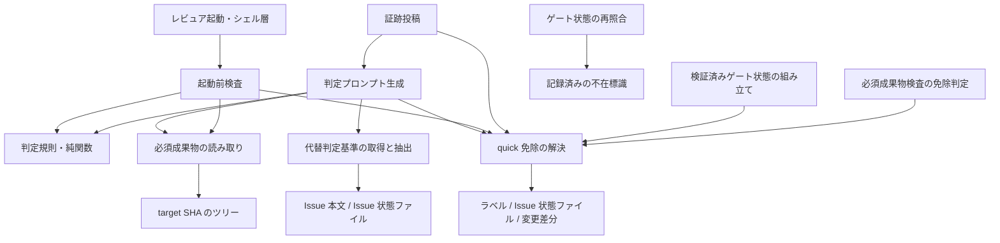
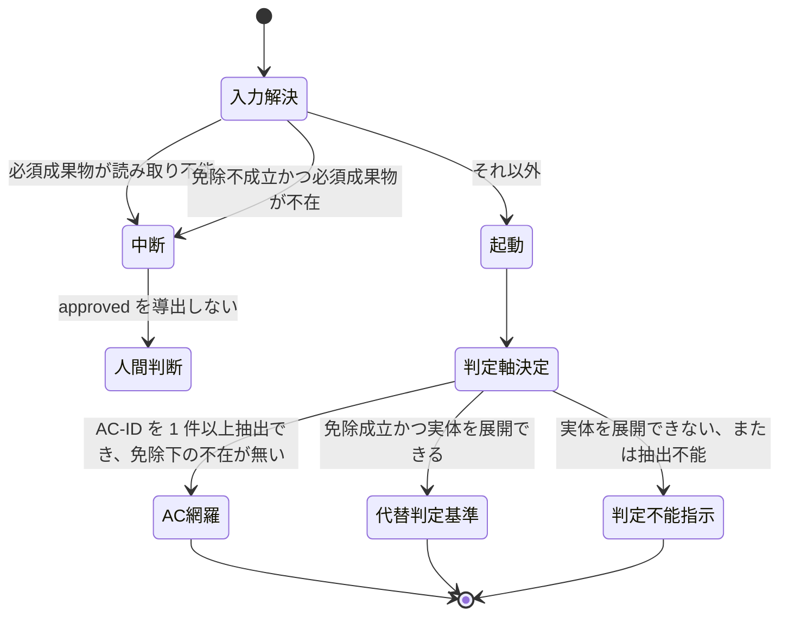

# DESIGN: size:quick の Issue でゲートが構造上通過不能な問題の是正

- Issue: `ISSUE-733`
- 対応する SPEC: `SPEC.md`

## 目的・対象範囲

quick 免除に正しく従った Issue（4 成果物を作らない Issue）は、現在どのゲートも構造上 `approved` に到達できない。原因は判定機構が Issue の size を一切参照しないことにあり、次の 2 経路として現れる。(A) 判定プロンプトが「`SPEC.md` から AC-ID を検出できず。conformance は inconclusive とし human_required へ倒すこと」という指示を出力し、conformance が構造上 pass になりえない。(B) ゲートレビュー起動経路が対象セグメントの必須成果物を target SHA から読めないときに中断し、conformance・falsification とも `pending` のまま確定する。

本設計は、判定機構に quick 免除の成否（以下 E）を第一級の入力として導入し、判定プロンプトを**判定対象区間**（レビュアが読むべき成果物の内容、または存在しない事由を提示する区間）と**判定軸区間**（conformance を何によって判定するかを指示する区間）へ分離したうえで、E と必須成果物の読み取り結果・AC-ID 抽出結果・代替判定基準の展開可否から、判定軸区間の値 S（`AC-ID 全件網羅` / `代替判定基準` / `inconclusive 指示`）と起動経路の中断有無を決定する。あわせて、判定軸の実体の取得経路を、リポジトリの default branch を保護された基点として実行される起動経路（以下 trusted base 側の起動経路）が Coordination Backend の一次情報から取得した値のみに限定する。

対象範囲は次の 6 点である。

- (a) size シグナル・risk シグナル・変更差分のガードレール判定を三値で解決し、E を導く機構の新設。
- (b) 必須成果物の読み取り結果と AC-ID 抽出結果を、「取得できた」「不在であることを確認できた」「読み取り不能」の三値で保持する機構の新設。
- (c) 判定軸区間の値 S・判定対象区間の提示種別・ゲートレビュー起動経路の中断有無を決める規則の新設（いずれも外部入出力を持たない純関数として実装する）。
- (d) 代替判定基準の実体を trusted base 側の起動経路のみから取得し、判定軸区間へ展開する機構の新設。
- (e) 判定プロンプトへの区間境界の導入と、埋め込み内容による境界偽装の無害化。
- (f) 必須成果物が quick 免除により正当に不在である場合に、ゲートレビュー起動経路を中断させない変更。

次は対象外とし無変更とする。quick 免除の範囲そのもの（憲法が定める免除規定）。反証（falsification）側のルーブリックの停止条件・severity 基準。判定プロンプト生成の決定性の保証、判定プロンプトの再生成による証跡照合、prompt digest の一致検査、およびそのための入力スナップショットの確定・保存（証跡照合機構）。レビュアが判定プロンプトの明示指示に反する verdict を返した場合の検知・強制。必須成果物検査（継続的統合上の成果物存在検査）が用いる免除判定。

## 用語

本設計は次の用語を用いる。いずれも `SPEC.md` が定義する語と同一の意味である。

- **quick 免除（E）**: size シグナルが `quick` に解決され、risk シグナルが `normal` に解決され、ガードレール判定が「含まない」であるときに限り成立する、4 成果物の作成義務免除。
- **ガードレール対象パス**: `docs/adr/`・`.agent-skill-chain/config/segments.yaml`・`AGENTS.md`・`.agent-skill-chain/schemas/`。
- **判定プロンプト**: レビュアへ渡される read-only の判定指示文字列。レビュアにはツール呼び出しが一切許可されないため、判定に使える情報はこの文字列に展開済みの内容のみである。
- **判定対象区間 / 判定軸区間**: 判定プロンプト内の互いに重ならない 2 区間。前者は成果物の内容または不在事由を提示し、後者は conformance の判定軸を指示する。
- **代替判定基準**: quick 免除下で `AC-ID 全件網羅` に代わって用いる conformance の判定軸。実体は当該 Issue 本文に記載された要求・期待する挙動・受入基準であり、対象ゲートの別を問わず同一の実体を用いる。
- **trusted base 側の起動経路**: リポジトリの default branch を保護された基点として実行される、ゲートレビュー起動・判定プロンプト生成の実行経路。
- **ワーカー供給経路**: セグメント作業ワーカーまたはゲートレビュアが内容を書き込める経路。ブランチ上の成果物ファイル、PR 本文、Issue コメント、ワーカーが作成した Issue 本文の写しを含む。区別の基準は書き込み主体であって格納媒体ではない。
- **必須成果物**: 対象ゲートが判定の前提として存在を要求する成果物。spec は `SPEC.md`、design は `DESIGN.md` と `PLAN.md`、implementation は無し、validation は `VALIDATION.md`。
- **判定対象成果物**: 判定対象区間へ内容を展開する対象。必須成果物を含むが同一ではない（design は変更差分に現れた `docs/adr/` 配下、validation はテスト実行ログ、implementation は 4 成果物以外の変更パス全体を含む）。

## 前提の実地確認

要求・要件セグメントのゲートレビューでは憲法本文がレビュアへ展開されておらず、`SPEC.md` が置いた前提の真偽が未検証のまま申し送られた。本設計では該当箇所を憲法（`AGENTS.md`）の実物に当たって確認した。結果は次のとおりで、`SPEC.md` の前提といずれも一致する。齟齬は無い。

| `SPEC.md` が置いた前提 | 憲法の実物で確認した記述 | 判定 |
|---|---|---|
| size シグナルの取得元は GitHub モードが Issue ラベル、ローカルモードが Issue 状態ファイルの `size` キー | quick の定義に「GitHub モードは Issue ラベル `size:quick`、ローカルモードは `state.yaml` の `size: quick`」と明記されている | 一致 |
| size シグナルの既定値は `standard` | 同じ定義に「既定は standard」と明記されている | 一致 |
| size シグナルの書き込み主体はセグメント作業ワーカーの権限に含まれない | 同じ定義に「進行役の明示的オプトインのみで成立し自動昇格しない」と明記され、役割・権限の表はセグメント作業ワーカーの権限を「自ブランチへの commit / push、Draft PR 作成（SPEC ワーカーのみ）、Issue コメント」に限定している。ラベル操作・状態遷移は進行役の権限として別行に置かれている | 一致 |
| risk が `normal` 以外（`unclassified` を含む）は非 normal 側として扱う | 不変条件 I8 が「`risk != normal`（`unclassified` 含む）OR `autonomy == full` → `review_profile: strict`」と定めている | 一致 |
| quick 免除の成立条件に risk が `normal` であることとガードレール対象パス非該当が含まれる | quick の規定に「ただし risk が `normal` 以外、または変更差分に `docs/adr/`・`.agent-skill-chain/config/segments.yaml`・`AGENTS.md`・`.agent-skill-chain/schemas/` を含む場合は免除せず通常フローを強制する」と明記されている | 一致（ガードレール対象パスの集合も完全一致） |
| quick 免除の対象は `SPEC.md`・`DESIGN.md`・`PLAN.md`・`VALIDATION.md` の作成義務 | quick の規定が同じ 4 ファイルを列挙している | 一致 |
| 免除シグナルは免除対象の成果物に依存しない場所に置かれる | quick の規定に「シグナルは免除対象の成果物に一切依存しない場所にのみ置く」と明記されている | 一致（シグナルを成果物本文から読まない本設計の方針と整合） |
| Issue コメント・PR 本文・ブランチ上の成果物はワーカー供給経路である | 役割・権限の表がセグメント作業ワーカーへ「自ブランチへの commit / push、Draft PR 作成、Issue コメント」を与えている。すなわちこの 3 経路はワーカーが内容を制御できる | 一致 |
| GitHub モードのゲートは自動 CI 強制を持たず、実施要否は進行役が判断する | 不変条件 I2 が「GitHub モード、または `profile: lightweight` の場合はガイドライン（実施要否は進行役が判断）」と定めている | 一致 |

加えて、憲法の Coordination Backend の規定は「`issue_sync` が有効な GitHub モードでは、ゲート通過ごとに成果物全文とゲート状態を Issue / PR 本文の固定マーカー区間へ一方向転記し、転記結果をゲート判定の入力として読み戻すことはしない」と定めている。この規定は本設計の判断 D5 の直接の根拠であり、`SPEC.md` の前提と矛盾しない（後述）。

## 設計判断

### D1. quick 免除の解決を、判定機構専用の三値解決として新設する

size シグナル・risk シグナル・ガードレール判定を、それぞれ次の三値へ解決する。

| 次元 | 値 | 解決規則 |
|---|---|---|
| size シグナル | `quick` / `standard` / 解決不能 | 取得元から `size:` 接頭辞のラベル（GitHub モード）または `size` キー（ローカルモード）を読む。値が 0 件なら既定値 `standard`。1 件で値域内ならその値。値域外なら解決不能。2 件以上が同時に与えられていれば解決不能。取得自体に失敗した場合も解決不能 |
| risk シグナル | `normal` / `normal` 以外 / 解決不能 | 同様に `risk:` 接頭辞のラベルまたは `risk` キーを読む。値が 0 件なら既定値 `unclassified` を `normal` 以外へ写像する。`normal` のみ `normal`、`high`・`unclassified` は `normal` 以外。値域外・複数・取得失敗は解決不能 |
| ガードレール判定 | 含まない / 含む / 判定不能 | base SHA から target SHA までの変更差分のパス集合を取得し、ガードレール対象パスに該当するものがあるかを判定する。base SHA が与えられていない場合、および差分取得が失敗した場合は判定不能 |

E は「size が `quick` かつ risk が `normal` かつガードレール判定が「含まない」」のときに限り成立し、それ以外はすべて不成立とする。解決不能・判定不能は不成立側へ写像する。

**なぜ既存の免除判定を再利用しないか。** 継続的統合の必須成果物検査が用いる既存の免除判定は、(1) 変更差分の基点を「当該 Issue の worktree の default branch との差分と未コミット差分の合成」に取るため target SHA に固定されておらず、ゲート判定の入力として使うと同一 target SHA でも結果が変わりうる。(2) シグナルの取得失敗を「quick 未要求」と同一へ畳み込む二値であり、本設計が要する三値の区別を持たない。(3) その挙動を変えると必須成果物検査の側に回帰を生む。したがって判定機構専用の解決を新設し、既存の免除判定の観測挙動は変更しない。ただし取得元へのアクセス（ラベル取得・Issue 状態ファイル読み取り）という下位の関心事は新設側へ集約し、既存の免除判定はそれを呼び出して自身の二値へ畳み込む形へ寄せる。これにより同一の取得元に対する読み取り実装が 2 つに分かれることを避ける。

**なぜ解決不能を既定値へ落とさないか。** 落とすと、外形的な取得障害（一時的なネットワーク断、権限不足、応答の解釈失敗）によって quick 免除が誤成立し、判定軸が代替判定基準へ降格したまま `approved` へ到達しうる。逆にシグナル未付与まで解決不能に含めると、size ラベルを運用していない既存の全 Issue が解決不能となり、適正な `SPEC.md` を持つ通常の Issue まで `approved` へ到達できなくなる。両者を分離し、未付与は決定的な既定値、取得の失敗は安全側とする。

### D2. 必須成果物の読み取りと AC-ID 抽出を三値化し、「不在」を肯定的に確認する

現行実装は成果物の内容取得コマンドの非 0 終了をそのまま「不在」とみなしている。この畳み込みがあると、実在する成果物の読み取り障害が「quick 免除により正当に不在」として提示され、レビュアは成果物を読まないまま判定し、同時に AC-ID 抽出結果が 0 件へ写像されて判定軸が無言で降格する。

そこで必須成果物ごとの読み取り結果を「存在し内容を取得できた」「存在しないことを確認できた」「読み取り不能」の三値とし、**不在は肯定的に確認する**。具体的には target SHA のツリーを対象パスで列挙し、列挙自体が成功して該当エントリが 0 件であることをもって不在とする。列挙が失敗した場合、エントリが blob 以外である場合、および列挙で得た blob の内容取得が失敗した場合は読み取り不能とする。非 0 終了の理由を出力文言から推測する方法は取らない（文言は実行系の版に依存し、推測を誤れば読み取り障害が不在へ再び畳み込まれるため）。

必須成果物集合全体の値は、1 件以上が読み取り不能ならば「読み取り不能」、そうでなく 1 件以上が不在ならば「不在」、それ以外は「すべて取得できた」とする。必須成果物を持たないゲートは「すべて取得できた」とする（空集合のすべての要素について内容を取得できたと解する）。

AC-ID 抽出結果は `SPEC.md` の読み取り結果から導く。取得できた場合は既存の抽出規則（第 4 レベル見出しに現れる正規の受入条件宣言のみを数える）を適用して「1 件以上」または「0 件」、不在を確認できた場合は「0 件」、読み取り不能の場合は「抽出不能」とする。

### D3. 判定軸・提示種別・中断有無を、外部入出力を持たない純関数へ切り出す

判定軸区間の値 S、判定対象区間の提示種別、ゲートレビュー起動経路の中断有無は、いずれも解決済みの入力値だけから決まる全域関数である。これらを Git・GitHub・ファイルシステムのいずれにも触れない関数として実装し、判定プロンプト生成と起動経路の双方から呼び出す。副作用と外部依存を持たないため、レビュアもゲート起動も介さずに単体テストから全状態を直接検証できる。

S の決定規則は次のとおりである。

| E | 必須成果物の読み取り | AC-ID 抽出 | 代替判定基準 | S |
|---|---|---|---|---|
| 問わない | 問わない | 抽出不能 | 問わない | `inconclusive 指示` |
| 成立 | すべて取得できた、または読み取り不能 | 1 件以上 | 問わない | `AC-ID 全件網羅` |
| 成立 | 不在 | 1 件以上 | 展開できる | `代替判定基準` |
| 成立 | 不在 | 1 件以上 | 展開できない | `inconclusive 指示` |
| 成立 | 問わない | 0 件 | 展開できる | `代替判定基準` |
| 成立 | 問わない | 0 件 | 展開できない | `inconclusive 指示` |
| 不成立 | 問わない | 1 件以上 | 問わない | `AC-ID 全件網羅` |
| 不成立 | 問わない | 0 件 | 問わない | `inconclusive 指示` |

判定対象区間の提示種別は必須成果物ごとに決める（判断 D8 を参照）。起動経路の中断有無は「必須成果物が読み取り不能ならば中断」「E が不成立で 1 件以上が不在ならば中断」「それ以外は中断しない」とする。

代替判定基準の展開可否は S の決定に必要な場合にのみ解決する。すなわち E が成立し、かつ AC-ID 抽出が 0 件であるか、または AC-ID を 1 件以上抽出できて必須成果物が不在である場合に限る。それ以外の入力では Issue 本文を取得しない。E が不成立である主経路では取得元へのアクセスが一切増えず、本変更前と同じ入力だけで判定軸が決まる。

### D4. 代替判定基準の実体は trusted base 側の起動経路のみから取得する

代替判定基準の実体の取得元は、GitHub モードでは Issue 本文取得 API、ローカルモードでは Issue 状態ファイルの要求内容フィールドに限る。呼び出しの基点は共通（メイン）作業ツリーのルートとし、当該 Issue の worktree を基点にしない。ワーカー供給経路（ブランチ上の成果物ファイル、PR 本文、Issue コメント、ワーカーが作成した本文の写し）は、当該記述がそこに存在するか否かによらず一切読まない。

**なぜ前提の記述ではなく機構として置くか。** quick 免除が成立し AC-ID を抽出できない場合、conformance の判定軸は代替判定基準だけになる。この実体の取得経路を機構で閉じないと、判定を受ける側であるセグメント作業ワーカーが自ら判定軸を供給でき、緩い受入基準相当の記述を置くだけで `approved` へ到達する自己承認経路が成立する。これは quick 経路に限って不変条件 I8（安全側ラチェット・silent pass 禁止）を実質的に無効化する。

判定対象区間へ展開される成果物、および `SPEC.md` から抽出した AC-ID 集合はワーカーが著述するものだが、これは判定対象そのものであるため本限定の対象外とする。限定するのは代替判定基準の実体の取得経路のみである。

### D5. Issue 本文のうち、成果物全文の一方向転記区間を代替判定基準から除去する

GitHub モードでは、ゲート通過ごとに 4 成果物の全文とゲート状態を Issue 本文の固定マーカー区間へ一方向転記する機能が既定で有効である。したがって Issue 本文には、ワーカーが著述した `SPEC.md`・`DESIGN.md`・`PLAN.md`・`VALIDATION.md` の全文が機械的に転記されて含まれうる。転記を実行するのは trusted な発行経路だが、**転記された内容の著述主体はセグメント作業ワーカーである**。ワーカー供給経路の判別基準は書き込み主体であって格納媒体ではないため、この区間は Issue 本文の一部でありながらワーカー供給経路に属する。

これは机上の懸念ではなく到達可能な経路である。quick 免除は成果物の作成を免除するだけで禁止はしないため、ワーカーが `SPEC.md` だけを著述し `DESIGN.md`・`PLAN.md` を作らない状態は正当に成立する。この状態で spec ゲートを通過させると `SPEC.md` 全文が Issue 本文へ転記され、続く design ゲートでは必須成果物が不在であるため判定軸が代替判定基準へ切り替わる。除去しなければ、その代替判定基準の実体にワーカー著述の `SPEC.md` 全文が含まれ、緩い受入基準を自ら書いて自ら通過できる。

そこで代替判定基準の抽出では、取得した Issue 本文から転記区間（開始マーカーから終了マーカーまで、マーカー行を含む）をすべて除去したうえで抽出する。開始マーカーのみが存在し終了マーカーが無い場合は開始マーカー以降のすべてを、終了マーカーのみが存在する場合は先頭から終了マーカーまでを除去する（マーカーの片側が人手で削除された状態でも転記内容が残らない側へ倒す）。この除去は、憲法が定める「転記結果をゲート判定の入力として読み戻すことはしない」という規定の直接の実装でもある。

### D6. 代替判定基準の抽出規則は、見出し一致ではなく本文ブロックの採用とする

転記区間を除去した残りの本文を空行区切りのブロックへ分割し、空白のみ・HTML コメントのみ・水平線のみのブロックを捨てる。残ったブロックが 1 件以上あれば「展開できる」とし、残ったブロック全体を原文の順序のまま判定軸区間へ書き出す。0 件であれば「展開できない」とする。Issue 本文そのものを取得できない場合も「展開できない」とする。

**なぜ見出し一致を採らないか。** 「要求」「期待する挙動」「受入基準」に相当する見出しの表記は Issue ごとに揺れる。見出し一致を採ると、実質的な要求が書かれている Issue でも見出しが一致しなければ抽出 0 件となり、判定軸が `inconclusive 指示` へ落ちて本 Issue の目的（quick 免除に従った Issue が進行役の上書き無しに通過できること）が達成されない。ブロック採用は表記の揺れに影響されず、かつ「1 件以上取り出せるか」を機械的に判定できる。

**なぜ Issue のタイトルを含めないか。** 代替判定基準の実体は Issue 本文に記載された記述と定義されており、タイトルはそこに含まれない。タイトルを補助的に加えると、本文が空の Issue でも「展開できる」となり、実質的に判定軸が無い状態から `approved` へ到達しうる。安全側として本文のみを用いる。

**なぜ実装差分・テスト実行結果・継続的統合の結果を代替判定基準へ加えないか。** 実装差分は既に判定対象区間へ展開されており、判定軸へも展開すると判定対象を判定軸の実体に用いることになり D4 の限定に抵触する。テスト実行結果と継続的統合の結果はブランチ上のファイルまたは PR に紐づく状態であり、ワーカー供給経路に属する。したがって代替判定基準の入力は Issue 本文のみとし、対象ゲートの別によらず同一とする。

### D7. 判定プロンプトへ明示の区間境界を導入し、埋め込み内容による境界偽装を無害化する

判定プロンプトに、判定対象区間と判定軸区間それぞれの開始・終了を表す 4 つの一意な標識行を導入する。標識は HTML コメント形式の固定文字列とし、判定プロンプトの本文としては意味を持たない行にする（既存の見出し文字列を境界に流用しない。見出し文字列は成果物本文にも自然に現れうるため、境界の一意な識別に使えない）。

**埋め込む可変内容に対して標識文字列を無害化する。** 成果物本文・変更差分・Issue 本文を判定プロンプトへ展開する際、上記 4 標識と同一の文字列が含まれていれば無害な表記へ置換する。無害化しない場合、ワーカーは成果物ファイルへ終了標識を書き込むだけで判定対象区間を早期に閉じ、以降の内容を判定軸区間の側へ見せかけられる。すなわち区間の非重複性そのものをワーカーが破れる。

区間の割り当ては次のとおりとする。

- **判定軸区間**: S に応じた判定軸の指示と、その実体（`AC-ID 全件網羅` の場合は AC-ID 列、`代替判定基準` の場合は抽出したブロック列、`inconclusive 指示` の場合は実体を持たない）、および conformance ルーブリック本文。
- **判定対象区間**: 判定対象の差分、判定対象成果物ごとの提示、上流の承認済み成果物。
- **いずれの区間にも属さない中立域**: 冒頭の役割説明、ハルシネーション防止の指示、falsification ルーブリック、final の扱い、出力 JSON 契約。

**conformance ルーブリック本文を判定軸区間へ入れる理由。** 現行のルーブリックは「適用対象の全 AC-ID / 要件が当該セグメント成果物で証跡付きに充足されているか」と、判定軸が AC-ID 全件網羅であることを本文へ固定的に書き込んでいる。S が `代替判定基準` のときにこの本文をそのまま残すと、判定軸区間の指示とルーブリックが同一の判定プロンプト内で矛盾する。ルーブリック本文は「conformance を何によって判定するか」の記述そのものであり、判定軸区間に属する。

falsification ルーブリックを中立域に残すのは、反証観点が本 Issue の対象外であり、同一箇所を変更する別 Issue（反証ルーブリックの停止条件を扱うもの）と衝突させないためでもある。

### D8. 判定対象区間の提示は必須成果物ごとに決め、不在と読み取り不能の混在を解消する

必須成果物集合全体の値は「1 件以上が読み取り不能」を「1 件以上が不在」より優先するため、不在の成果物と読み取り不能の成果物が同時に存在する入力では、集合全体としては読み取り不能になる。この状態で不在側の成果物をどう提示するかは `SPEC.md` が定めていない。

本設計では、判定対象区間の提示を**成果物ごとに個別に**決める。各必須成果物について、その成果物自身の読み取り結果と E から提示種別を決める。

| その成果物の読み取り結果 | E | 提示 |
|---|---|---|
| 取得できた | 問わない | 内容を展開する |
| 不在を確認できた | 成立 | 名称と、quick 免除により正当に不在である旨を明示する |
| 不在を確認できた | 不成立 | 名称と、本来存在すべきであるのに欠落している旨を明示する |
| 読み取り不能 | 問わない | 名称と、内容を取得できなかった旨を明示する。正当な不在としても欠落としても提示しない |

混在状態では、読み取り不能な成果物は 4 行目の提示、不在の成果物は E に応じて 2 行目または 3 行目の提示となる。集合全体の値は起動経路の中断判断にのみ用い、提示内容には用いない。この分割により、集合全体の値だけでは決まらない提示が一意に定まり、かつ読み取り不能を正当な不在として提示しないという要求も満たされる。なお当該入力ではゲートレビュー起動経路が中断するため、この提示は判定プロンプトを単独で生成した場合にのみ観測できる。

必須成果物以外の判定対象成果物は、target SHA に存在するものだけを提示し、存在しないものは提示対象から外す。これらは変更差分から導かれた集合であり、削除されたパスは差分区間で観測できるため、判定対象区間に不在の記述を追加する必要がない。上流の承認済み成果物（spec 以外のゲートで整合検査用に展開する `SPEC.md`）も同じ扱いとし、取得できた場合のみ展開し、不在の場合は当該提示自体を出力せず、読み取り不能の場合は内容を取得できなかった旨を明示する。

### D9. ゲートレビュー起動経路の中断を、判定プロンプト生成から切り離して起動前へ置く

現行実装では、必須成果物を読めないことによる中断は証跡投稿の段で起きる。すなわちレビュアが起動して verdict を返した後に中断するため、「レビュアを起動しない」という要求を満たさず、レビュアの実行資源も無駄になる。

そこで中断判定を独立した一段として、レビュアを起動する直前に置く。判定プロンプト生成は中断規則を一切適用せず、どの入力に対しても判定プロンプトを生成する（生成が成功することは、代替判定基準を展開できない場合にも要求される）。この責務分割により、判定対象区間の提示規則のうち起動経路では到達しない組み合わせ（免除不成立かつ必須成果物が不在、および読み取り不能）も、判定プロンプト生成を直接呼び出して観測できる。

証跡投稿の段の既存検査は撤去せず、多層防御として残す。ただし承認対象成果物の収集で不在を許容する条件を、「必須成果物を持たないゲートである」から「必須成果物を持たないゲートである、または quick 免除が成立している」へ拡張する。拡張しなければ、起動前検査を通過した quick 免除下の入力が証跡投稿の段で従来どおり中断する。

### D10. ゲート状態の再照合では、承認時に不在であった成果物を記録済みの不在標識で照合する

承認済み成果物の digest を再照合してゲート状態を継承・無効化する経路は、base SHA を引数に取らないため E を再解決できない。ここで E を再解決するために base SHA を新たに要求すると、呼び出し側の契約が広がるうえ、承認時と再照合時とで E が変わりうる（ラベルは後から変更できる）。

そこで再照合では E を用いず、**承認時に記録された digest が不在標識であるか否か**で不在の許容を決める。承認時に不在だった成果物は、再照合時にも不在であれば不在標識どうしが一致して「変化なし」となり、実在するようになっていれば digest が一致せず「変化あり」として当該ゲートと全下流ゲートが無効化される。承認時に実在した成果物が読めなくなった場合は従来どおり読み取りの失敗として扱う。この規則は E の再解決を要さず決定的であり、かつ成果物の出現・消滅をいずれも変化として検出する。

### D11. quick 免除下で必須成果物が不在の場合に判定軸を切り替える根拠（判断の正確な射程）

`SPEC.md` は、quick 免除が成立し `SPEC.md` から AC-ID を抽出できる Issue において、対象ゲートの必須成果物が免除により不在である入力（design ゲートで `DESIGN.md`・`PLAN.md` が不在、validation ゲートで `VALIDATION.md` が不在）では判定軸を代替判定基準へ切り替えると定めている。切り替えないと、網羅を立証すべき成果物が判定対象区間に存在しないまま `AC-ID 全件網羅` が判定軸として指示され、conformance が成果物の品質と無関係に構造上 fail となるためである。

`SPEC.md` はこの切替が安全である根拠の 1 つとして「判定を受ける側が切替を発火させられない」と述べているが、**この命題は厳密には偽である**。切替の条件には「必須成果物が不在であること」が含まれ、成果物を作るか否かはセグメント作業ワーカーが制御できる入力だからである。本設計は正確な根拠を次のとおり置き換える。切替が安全であるのは、切替を発火させられないからではなく、**発火させても判定軸の信頼度が下がらないから**である。具体的には次の 4 点による。

1. **切替先の実体をワーカーが供給できない。** 代替判定基準の実体は trusted base 側の起動経路が Coordination Backend の一次情報から取得した Issue 本文のみに由来し、そこから成果物全文の転記区間を除去したものである（判断 D4・D5）。ワーカーは切替を発火させられるが、切替先の内容を書けない。したがって「自分に都合のよい判定軸へ切り替える」ことはできない。
2. **切替の前提条件は進行役だけが与えられる。** 切替は E が成立する場合にのみ起きる。E の成立には size シグナルが `quick`、risk シグナルが `normal` であることを要し、憲法の役割・権限がこれらの書き込みを進行役の権限としている（前掲の実地確認）。E が不成立の主経路では、ワーカーが必須成果物を作らなくても判定軸は切り替わらず、代わりに起動経路が中断する。すなわちワーカーが制御できる入力は、進行役が既に quick 免除へオプトインした場合にのみ判定軸へ影響する。
3. **免除下では成果物の不在自体が正当な状態である。** 憲法が 4 成果物の作成義務を免除している以上、それらを作らないことは規約違反ではなく規約に従った状態である。ワーカーが得るのは「自分が書いた弱い判定軸」ではなく「進行役側が管理する Issue 本文という判定軸」である。
4. **取得の失敗では切り替わらない。** 切替の条件は「不在であることを確認できた」ことであり、読み取り不能では切り替わらず起動経路が中断する（判断 D2・D9）。取得の失敗による判定軸の無言の降格は起こらない。

なお切替の非発火性そのものを観測する受入条件は存在しない。本設計は非発火性に依存せず、上記 4 点の各々が個別の設計要素（D2・D4・D5・D9）と対応するため、根拠の変更によって設計要素が増減することはない。

### D12. 判定不能な判定軸からの `approved` 抑止は本 Issue では機構化しない

判定軸が `inconclusive 指示` である attempt では、レビュアが指示に従う限り conformance が `pass` にならないため `approved` は導出されない。ここでレビュアの遵守に依存せず、trusted 側の値だけで `approved` を機械的に抑止する防御的既定を置くことは技術的には可能である。

本設計はこれを置かない。理由は 2 点である。(1) この抑止は判定軸の値だけを入力とする独立した是正であり、本 Issue の目的（quick 経路で `approved` に到達できない欠陥の是正）とは逆方向の関心事である。同一変更へ混ぜると、通過できるようにする変更と通過できなくする変更が 1 つのゲートで同時に評価され、回帰の切り分けが困難になる。(2) `SPEC.md` は当該状態を「レビュアは明示指示に従う」という前提の下で発生しない状態として明示的に除外しており、そこへ実装上の期待結果を与えると、状態表の行と実装の対応が一対一でなくなる。抑止の是正は別 Issue（`inconclusive` 指示からの `approved` クランプを扱うもの）が管轄する。

### D13. 免除不成立の主経路の挙動を、本変更の前後で一切変えない

E が不成立の入力では、判定軸区間の値は従来どおり AC-ID 抽出結果のみで決まり（1 件以上なら `AC-ID 全件網羅`、0 件なら `inconclusive 指示`）、代替判定基準は展開されず、必須成果物が欠落していれば従来どおり起動経路が中断する。Issue 本文の取得も行わない。これは最大の回帰対象であり、判定軸の決定規則を純関数として切り出したうえで、E が不成立である全組み合わせに対する期待値を単体テストで固定する。

## 要件 → 設計要素の対応表

`SPEC.md` の全要件・全 AC-ID が、いずれかの設計要素に対応していることを示す。

| 要件 / AC-ID | 対応する設計要素 | 備考 |
|---|---|---|
| 要件1, `AC-1`, `AC-2` | D1 | 既定値への決定的解決を含む |
| 要件2, `AC-3` | D1 | 解決不能・判定不能を免除不成立へ写像 |
| 要件3, `AC-18` | D7 | 区間境界の導入と標識の無害化 |
| 要件3, `AC-4`, `AC-9`, `AC-10`, `AC-11` | D7, D8 | 各受入条件が一方の区間のみを観測できることは区間分離が保証する |
| 要件4, `AC-4`, `AC-5`, `AC-6` | D3, D4, D6, D11 | `AC-4` は「読み取り不能では切替を起こさない」という要件4 の但し書きに対応する |
| 要件5, `AC-4`, `AC-7`, `AC-8`, `AC-19` | D3, D13 | 免除不成立の主経路と抽出不能の扱い |
| 要件5, `AC-14`, `AC-15` | 既存の最終判定導出（無変更） | 否定判定の優先順位は現行実装のまま |
| 要件6, `AC-10`, `AC-11`, `AC-12`, `AC-13`, `AC-20`, `AC-21` | D2, D8, D9 | 起動前中断と不在許容の拡張を含む |
| 要件9, `AC-17` | D4, D5 | 転記区間の除去は本要件の実装の一部である |
| 要件10, `AC-6`, `AC-13`, `AC-16`, `AC-19`, `AC-21` | D3, D9, および既存の最終判定導出（無変更） | 判定軸を実体化できない場合に `approved` を導出しない |
| 要件12, `AC-22` | D1, D4 のモード別解決 | 両モードを入力とする自動テストで担保する |
| — | D10 | ゲート状態の再照合が不在標識と整合するための付随変更（要件の追加ではない） |
| — | D12 | 本 Issue で機構化しないことの明示（要件の追加ではない） |

## 責務・境界

### コンポーネント構成

- `quick 免除の解決`（新規モジュール）: size シグナル・risk シグナル・ガードレール判定の三値解決と E の導出。取得元へのアクセス（ラベル取得・Issue 状態ファイル読み取り）を保持する唯一の場所。
- `必須成果物の読み取り`（新規モジュール）: target SHA のツリー列挙による成果物ごとの三値解決と、集合全体の値の導出、AC-ID 抽出結果の三値化。
- `代替判定基準の取得と抽出`（新規モジュール）: trusted base 側からの Issue 本文取得、転記区間の除去、ブロック抽出。抽出部分は入出力を持たない純関数として独立させる。
- `判定規則`（新規モジュール、純関数のみ）: 判定軸区間の値 S の決定、必須成果物ごとの提示種別の決定、起動経路の中断有無の決定。
- `判定プロンプト生成`（既存、変更）: 上記 4 モジュールの結果を受け取り、区間境界と無害化を適用して判定プロンプト文字列を組み立てる。
- `起動前検査`（新規のサブコマンド）: `判定規則` の中断判定を評価し、中断する場合に非 0 終了と理由を返す。
- `レビュア起動`（既存のシェル層、変更）: アダプタ起動の直前に `起動前検査` を呼び、非 0 のときは既存のフェイルセーフ（最終判定を人間判断へ倒す）と同じ経路で終了する。
- `証跡投稿`・`検証済みゲート状態の組み立て`・`ゲート状態の再照合`（既存、変更）: 承認対象成果物の収集で不在を許容する条件を拡張する。
- `必須成果物検査の免除判定`（既存、限定的変更）: 取得元アクセスを `quick 免除の解決` から呼び出す形へ寄せる。観測挙動は変更しない。

### 依存関係

```text
レビュア起動（シェル層） → 起動前検査 → 判定規則
判定プロンプト生成 → 判定規則
判定プロンプト生成 → quick 免除の解決 → 取得元（ラベル / Issue 状態ファイル / 変更差分）
判定プロンプト生成 → 必須成果物の読み取り → target SHA のツリー
判定プロンプト生成 → 代替判定基準の取得と抽出 → 取得元（Issue 本文 / Issue 状態ファイル）
証跡投稿・検証済みゲート状態の組み立て → quick 免除の解決
ゲート状態の再照合 → 記録済みの不在標識（quick 免除の解決には依存しない）
必須成果物検査の免除判定 → quick 免除の解決（取得元アクセスのみ）
```

`判定規則` はいずれのモジュールにも依存しない葉である。`quick 免除の解決`・`必須成果物の読み取り`・`代替判定基準の取得と抽出` は互いに依存しない。したがって循環依存は生じない。責務の集中を避けるため、判定プロンプト生成は「解決」も「規則」も持たず、解決済みの値を受け取って文字列を組み立てることだけを行う。

### 図示要否の判断

- 判断: `要`
- 根拠: 依存関係が 3 つ以上あり（判定プロンプト生成から 4 モジュールへ、レビュア起動から起動前検査へ、既存 3 経路から quick 免除の解決へ）、責務境界となるコンポーネントも 3 つ以上（新規 4 モジュール＋新規サブコマンド＋変更する既存 5 箇所）であるため、上記の基準に該当する。





## 未決事項に対する確定

`SPEC.md` が設計セグメントへ送った未決事項について、本設計は次のとおり確定する。

- **判定軸そのものの改変の扱い（`approved` 到達後の Issue 本文の変化を下流ゲートの無効化事由とするか）**: 事由と**しない**。ゲート状態の無効化は承認済み成果物の digest 照合で成り立っており、その入力は target SHA に固定された Git オブジェクトである。Issue 本文は target SHA に固定されないため、これを無効化の入力へ加えると、commit が一切変化していないのに下流ゲートが無効化される経路が生じる。しかもその検知には判定プロンプト生成時点の入力を保存して照合する機構が必要であり、それは本 Issue の対象外である。
- **判定軸そのものの改変の扱い（セグメント作業ワーカーによる Issue 本文の編集を禁止するか、検知した場合に人間判断へ倒すか）**: 憲法の役割・権限がセグメント作業ワーカーへ与えるのは自ブランチへの commit / push、Draft PR 作成、Issue コメントであり、Issue 本文の編集は元々含まれない（前掲の実地確認）。したがって新たな禁止規則を設けず、既存の権限境界の帰結として扱う。自動検知は導入しない（検知には上記と同じ保存・照合機構を要するため）。判定軸への実害は、本文のうちワーカーが実際に書き込める部分（成果物全文の転記区間）を代替判定基準から除去すること（判断 D5）で塞ぐ。
- **代替判定基準として Issue 本文以外の入力をどこまで展開するか**: 加えない（判断 D6 に理由を記載）。全ゲートで同一の入力集合とし、ゲート別の分岐は導入しない。
- **Issue 本文からの抽出規則**: 転記区間を除去したうえでの本文ブロック採用とする（判断 D6）。
- **判定対象区間と判定軸区間を区切る具体的な表現**: HTML コメント形式の一意な標識行 4 本とし、埋め込み内容に対して同一文字列を無害化する（判断 D7）。
- **必須成果物が不在の入力で判定対象区間が単独生成経路でのみ観測できる件**: 判定プロンプト生成に中断規則を持たせず、中断は独立の段に置くことで確定する（判断 D9）。

## 関連ADR

```yaml
related_adrs:
  - id: ADR-0022
    relation: references
```

ADR-0022 は、Issue の作業規模指定に基づいて 4 成果物の作成義務を免除する仕組みと、その免除を無効化する安全側ガードレール（risk が `normal` 以外、および変更差分がガードレール対象パスを含む場合）を定めた決定である。本 Issue はこの免除の範囲・条件・ガードレール対象パスを一切変更せず、免除が成立している状態をゲート判定機構の側が認識できるようにするだけである。免除の成否を決める 3 条件と対象パス集合は、本設計の判断 D1 が用いる規則と完全に一致する。

本 Issue 自体の決定のうち、判定プロンプトの区間分離と、判定軸の実体の取得経路を trusted base 側の一次情報に限りかつ成果物全文の転記区間を除去する方針は、`docs/adr/ADR-0066-gate-prompt-section-separation-and-judgment-axis-provenance.md`（`status: proposed`）として新規に記録する。ADR とする理由は、「Issue 本文の一部なのだから転記区間も代替判定基準に使ってよい」という一見自然な単純化が将来入りうるためであり、その単純化が自己承認経路を再び開くことを判断の記録として残す必要があるためである。

## 障害・ロールバック考慮

- **想定される失敗モード（判定軸の誤降格）**: シグナル取得の一時障害により E が不成立へ倒れ、quick 免除の Issue が従来どおり通過できない。これは本変更前と同じ状態であり、安全側への劣化にとどまる。復旧は取得元の回復と再実行のみで足りる。
- **想定される失敗モード（判定軸の誤成立）**: シグナルの誤設定により E が誤って成立すると、判定軸が代替判定基準へ降格する。ただし E の成立には進行役だけが書き込めるシグナルが 2 つとも必要であり、かつ切替先の実体はワーカーが供給できない。誤成立の是正はラベルまたは Issue 状態ファイルの修正と再実行で足りる。
- **想定される失敗モード（判定プロンプトの内容が起動ごとに変わる）**: Issue 本文・ラベル・変更差分の取得可否は target SHA に固定されないため、同一 target SHA でも判定プロンプトが起動ごとに変わりうる。現行の証跡には判定プロンプトの digest が記録され、将来の自動検証経路はそれを再計算して照合する設計になっているため、この経路が再導入された場合には成果物に欠陥が無くても照合が不一致となり人間判断へ倒れうる。現時点では当該自動検証経路は本リポジトリに存在せず（証跡は PR レビューとして残り、digest は投稿時に 1 回だけ計算される）実害は生じない。恒久的な解消は証跡照合機構を扱う別 Issue の管轄であり、本 Issue では対象外である。本設計は影響を最小化するため、E が不成立の入力では Issue 本文を取得せず、可変入力の導入範囲を quick 免除が成立する入力に限定する。
- **想定される失敗モード（起動前検査の誤中断）**: 起動前検査が誤って中断すると、レビューが実行されず最終判定が人間判断へ倒れる。`approved` を導出しない側であるため安全側であり、既存のフェイルセーフと同じ扱いになる。
- **ロールバック手順**: 本変更は 1 つの PR に閉じており、Coordination Backend の状態モデル・スキーマ・設定項目・ゲート状態の記録形式のいずれも変更しない。したがって当該 PR の revert のみで完全に復旧できる。revert 後に残る影響は、本変更中に quick 免除下で `approved` となったゲート状態が、revert 後の再照合で承認済み成果物の不在標識を読めずに人間判断へ倒れる可能性である。これは `approved` を維持しない側であり安全側である。
- **影響を受ける既存機能**: 判定プロンプトの文字列（既存の固定文言・見出し構成が変わるため、判定プロンプトの内容を突き合わせる自動テストと固定出力の比較用データを更新する）。ゲートレビュー起動シェル（検査段を 1 つ追加する）。承認対象成果物の収集（不在を許容する条件を拡張する）。ゲート状態の再照合（不在標識の扱いを拡張する）。必須成果物検査の免除判定（取得元アクセスの呼び出し先のみ変更し、観測挙動は変更しない）。反証ルーブリックは中立域に据え置くため、同一箇所を変更する別 Issue との衝突面は最小である。
