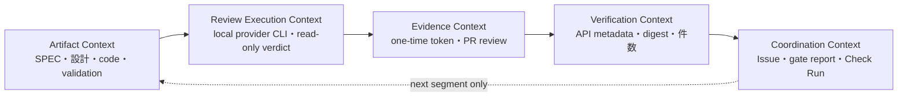

# DESIGN: ローカル独立レビュー証跡をCIで検証する

- Issue: `ISSUE-271`
- 対応SPEC: `SPEC.md`

## 目的・設計方針

AI inference と gate 状態遷移を分離する。進行役はローカル adapter へ read-only review を委譲し、trusted recorder が verdict を GitHub PR review として保存する。GitHub Actions はモデルを起動せず、Review API から取得した証跡を trusted CLI で再検証して Check Run を発行する。

```text
進行役 → local adapter capability probe → read-only reviewer process
      → trusted recorder → GitHub PR Review API
      → repository_dispatch → default-main evidence verifier（GITHUB_TOKEN: actions read）
                            → dedicated GitHub App in-progress Check
                            → artifact attestation
                            → success/failure/action_required（最後のPATCH）
```

## 要件と設計要素

| AC | 設計要素 |
|---|---|
| AC-1 | inferenceを除去したgate workflow、ローカルadapter |
| AC-2 | manifest能力契約、model-selection classifier、adapter probe |
| AC-3 | Review API metadata、SHA/prompt/artifact digest再検証 |
| AC-4 | one-time launcher token、attempt ID、reviewer run ID/slot、latest attempt集約 |
| AC-5 | verdict envelope、canonical evidence digest、Check output、cache復元、reconcile |
| AC-6 | GitHub/local backend分岐、通常モデル明示選択 |
| AC-7 | schema、template sync、回帰テスト |
| AC-8 | default-main dispatch、専用App Check、run tuple attestation、success-last |

## 責務と境界

### project policy / classifier

manifest の `core_review` は次を保持する。

- `execution: local`、`evidence_transport: github_pr_review`、`ci_role: verify_only`
- `trusted_reviewer_actors`: writer credentialから分離した専用Review API recorder principal
- `required_profile: strict`、`reviewer_count: 2`
- `triggers`: `review:core-audit`、ローカルstate値、root exact paths、`.agent-skill-chain/`・`.github/`・`src/`・`test/`・永続設計文書の包括prefix
- vendor-neutral capability `frontier_coding` / `maximum_reasoning`
- Codex固定値とClaude capability probe入力。未登録adapterは利用不能

classifier は base...target 差分とbackend正本の監査区分だけを解釈する。Git pathは `-z` のNUL境界で取得し、改行を含むpathを保持する。invalid UTF-8、終端NUL欠落、差分取得不能は `required/unresolved` とし、lossy変換やordinaryへの降格をしない。GitHubでもconfigの明示adapterを尊重し、Codexへ暗黙固定しない。

### trust rootとactor関係

GitHub Actionsは `pull_request_target` / `pull_request_review` のrepository default branchにある保護base revisionのworkflow、classifier、policy、schema、verifierだけを実行する。PR headのコードはcheckout・build・sourceせず、対象成果物はGit objectとしてread-onlyに参照する。当該PRが変更したallowlistやverifierを、同じPRの承認へ使わない。PR base refがdefault branchでなければローカルlauncher・recorder・workflowの全境界で拒否する。

writer actor集合はGitHub APIのPR authorと全commitのauthor/committer loginから作る。review evidenceのauthorはAIレビュア本人ではなく、ローカル実行結果をCoordination Backendへ記録する専用trusted recorder principalである。manifestのrecorder actorがwriter集合と1件でも重なる場合、または投稿review actorがwriterと同一なら承認しない。one-time tokenや公開digestだけではlauncher起源を証明できないため、writerが使用できない専用recorder credentialをtrust rootへ含める。証跡本文のwriter自己申告値は判定に使わず、APIから得たactor関係だけを`distinct_from_writer`としてgate reportへ記録する。

### local reviewer / trusted recorder

既存 `codex.sh` / `claude.sh` が同じvendor-neutral契約を実装する。

- 共通: read-only、非対話実行、conformance/falsification JSON、AC-ID別判定・証跡、target SHA、prompt digest、成果物digest
- Codex: adapterが組み立てる`codex exec --sandbox read-only -m gpt-5.6-sol -c model_reasoning_effort=xhigh`の固定argvだけを許可する。`CODEX_REVIEWER_CMD` / `GATE_REVIEWER_CMD`による完全command上書きと自己申告booleanはcore reviewでは検証不能なので無条件拒否する
- Claude Code: 実在model、`frontier_coding` / `maximum_reasoning` attestation、reasoning probe、無書込みtool。tier宣言とprobe commandを構成する管理主体はprovider能力を保証するtrust rootであり、モデル出力による自己申告として受理しない。管理主体が保証できない環境は`human_required`とする
- Cursor: adapter・安定した非対話CLI・probeが未実装なので選択を拒否する

launcher呼出しごとに暗号学的乱数の `attempt-` IDを1つ生成し、profile由来の期待件数と `review-` namespaceの一意なrun ID・Strict slot (`1|2`) を0600のone-time tokenへ固定する。GitHub backendは外側のprotected launcherがslotごとにadapterを起動する。ローカルbackendのStrictはadapter自身が2つの独立processを、別々のfresh workspace・fresh HOMEで起動し、両verdictが揃うまでreportを書かない。adapterはmodel出力を直接状態へ書かず、trusted CLIへ標準入力で返す。orchestratorのtrusted recorderは専用tokenでGitHub APIの自身のlogin、PR/commit writer集合を再取得し、actor分離、capability、slot、prompt/artifact digestを確認してmarker付きPR reviewを作る。専用token無し・未登録identity・writer同一・one-time token無し・mode/owner不正・再利用・attempt不一致の直接submitは拒否する。workerとreviewer roleには専用tokenとReview API commandを与えない。CLIは導入環境のGitHub CLIが自動pagination optionを備えると仮定せず、配列APIを100件単位の明示的なpage走査で全件取得する。上限到達・途中API失敗・非配列応答は部分集合で判定せず停止する。

local recorder自身もprotected baseをtrust rootにする。進行役はIssue worktree内のcandidateではなく、cleanなbase worktreeまたはversion固定したinstalled packageから `gate local-review` を起動する。launcherはprotected base SHAからephemeral cloneを作り、credential-bearing originを削除して、そのclone内でbuildしたclassifier、prompt generator、adapter、recorderだけを使う。判定対象は長さ付きJSON stringの非信頼データとしてprompt内へ埋め込み、成果物内の命令やMarkdown fenceをレビュー指示として扱わせない。AI subprocessは全adapter共通の空workspaceをcurrent directoryとし、空HOME・`env -i`・gh/git config・専用recorder token無しで起動する。callerが隔離root用の環境変数や事前配置workspaceを注入しても無視し、adapter呼出しごとに新しい0700相当の一時rootを作成・破棄する。Claudeはtool無し、Codexはephemeral/ignore-user-config・shell env allowlist・caller HOME denyのread-only permissionを重ねる。Claude evidenceのmodel/reasoningは実際に選択・probeした値から構築し、ambient `ASC_REVIEW_MODEL` / `ASC_REVIEW_REASONING`を参照しない。

target成果物は `git show <target_sha>:<path>` の標準出力を文字列化せずbyte列のままhashする。実在blobはdomain prefix付き、欠落は別domainのsentinelとしてhashし、sentinelと同じbyte列を持つ実在blobとの衝突を防ぐ。新規local scaffoldはbase...targetのNUL区切り差分からgate別の承認対象path集合を確定し、各approved verdictへ空集合や部分集合ではなく完全一致を要求する。固定launcher構成ファイル一覧のblob digestも証跡へattestする。dirty・version不一致・由来不明の実行系は `human_required` とする。

### evidence envelope

PR review本文には次を保存する。

- schema version、Issue、gate、target SHA、profile
- reviewer run ID、slot、adapter、model、reasoning/capability、read-only
- attempt ID、profile由来期待件数、launcher version、trusted base SHA、launcher/token digest、ephemeral-clone/read-only実行attestation
- prompt digest、target SPECの全AC-IDに対する個別conformance・証跡、approved artifactsとdigest、verdict

GitHub APIのreview `id` / `user.login` / `commit_id` / `state` とPR/commit actorは本文外の正本である。CIはdismissed review、未登録recorder、実行attestation不一致、target SHA不一致を除外せずエラーとして扱う。PRまたはいずれかのcommitのauthor/committer loginがnull・未解決ならactor関係を推測せず `human_required` とする。branch内のgate reportやJSONは承認入力にしない。

### evidence verifier / aggregator

新しいCLI経路はPR・commit・Review API metadataを取得し、現在のtarget SHA用scaffoldへ結線する。

1. Issue/gate/profile/SHA、API `commit_id`、registered dedicated recorder actorと全writer actorの非重複を検証する。
2. promptをtarget SHAから再生成しdigestを照合する。
3. `git show <sha>:<path>` のexact bytesで成果物digestを再計算する。
4. target SPECからAC-ID集合を再抽出し、各verdictの集合が重複なしの完全一致であること、各ACに非空証跡があること、aggregate conformanceがAC別判定から一意に導出される値と一致することを検証する。
5. 同じIssue/gate/profile/targetのv3証跡をattempt単位に分け、最大Review API IDを含むattemptだけをlatestとする。旧attemptは監査履歴として無視し、latest不完全時に旧completeへfallbackしない。
6. protected base SHA、launcher/token digest、ephemeral clone、credential-scrubbed read-only sandbox、`review-` run ID namespaceを検証し、同一attemptのrun ID/slotが重複しないことを確認する。Standardはslot 1を1件、Strictはslot 1・2を各1件要求する。
7. 各pass verdictのapproved artifact path集合がscaffoldと完全一致することを検証する。conformanceまたはfalsificationのfailには差し戻し可能な`origin`付きblocking findingを必須とする。
8. 全件pass/pass・全AC passかつblocking無しだけapproved、ACを含むfail/blockingはrejected、不足・不一致・判定不能はhuman_requiredとする。

同じlatest attempt内の複数候補やslot再投稿は曖昧性として拒否する。古いSHAの証跡を最新SHAへ継承しない。gate reportにはAPI review ID/actor、検証済みreviewer metadata、attempt ID・期待件数、slot順のAPI ID/actor/commit/evidenceから算出したcanonical evidence digestを残す。

### GitHub Actions

legacy gate workflowは `pull_request_target` と `pull_request_review` を契機に、base revisionのcheckout/build、PR metadataとtarget Git objectの取得、evidence import、schema検査だけを行う。provider secret、Codex Action、Claude/Codex CLI、self-hosted label、Checks書込み権限を含めず、PR head由来の実行可能ファイルを実行しない。証跡不足・検証器異常はjobを失敗させ、canonical Checkを生成しない。reconcile workflowはIssue #283のtrusted rollout完了までcandidate branchをcheckout/buildせず、gate-reconcileも実行しない明示no-opとする。canonical Checkの作成・terminal更新はdefault-mainの専用App recorderだけへ集約する。

verified gate report全体をCheck Run `output.text`へ保存する。protected-base CLIはcurrent SHAの同一App候補を全conclusionから列挙し、最大Check Run IDを先に選び、そのlatestがsuccessの場合だけschema、approved状態、artifact digest、attempt/token provenanceを再検証してnoncanonicalなローカルcacheへ復元する。このApp一致は履歴選択の整合性条件であってsource trustの証明ではない。ローカルbackendは既存adapterがtrusted CLIを介して `reviews/<gate>.yaml` を生成するため、Review APIを要求しない。新scaffoldだけにexact artifact集合を要求し、旧reportの読み取り互換は維持する。

bootstrap後の通常sourceを作れる最小recorderとして、default branchの `repository_dispatch` workflowを追加する。信頼入力はPR番号・gate・40桁target SHAだけで、actor権限・default base/current head・Issue/profile・latest v3 attempt・artifactをAPIから再取得する。workflow sourceとcheckoutは同じ `github.workflow_sha` へ固定し、queue中のmain更新による別revision実行を拒否する。`GITHUB_TOKEN`はworkflow run再検証に必要な`actions: read`とattestation発行だけを許可し、Checks writeを与えない。main限定environmentのGitHub App ID/private keyから内部HTTPだけに使う短命installation tokenを生成する。

専用Appのin-progress Check IDとworkflow run tupleを含むattestation envelopeを `actions/attest` の完全SHA固定actionで署名し、exact signer workflow/ref/digestとenvelope内容を再検証する。prepareはCheck作成直後に状態を耐久化し、状態書込み前・破損時には専用App APIからcurrent run tuple・target SHA・Check名・in-progress状態が全一致する候補だけを回収する。48KiB以内のcanonical reportだけをCheck outputへ保存し、successは全検査後の最後のPATCHに限定する。terminal PATCHはHTTP成功だけを完了条件とし、不要なresponse JSON parseで成功後にworkflowを失敗させない。prepare後にattestation・verification・通常finalizeが失敗した場合も状態fileの有無にかかわらずabortを実行し、同じAppが最後のPATCHで`action_required`へterminalizeする。

### 配布assetと既導入fixture migration

配布正本 `.agent-skill-chain/templates/github/.github/workflows/agent-skill-chain-gate.yml` / `agent-skill-chain-reconcile.yml` とroot展開物を同時更新する。`init` のfixture検証では新規対象repositoryへ検証専用gate workflowとrollout待ちno-op reconcileを配る。

`upgrade` は全書込み前に、fixtureの展開済みgate workflowと、既に導入済みの配布templateを比較する。

- 同一ならmanaged assetとして両方を新workflowへ置換し、API credentialとCI内model起動を除去する。
- 不一致ならlocal customization競合としてupgrade全体を無変更で停止し、installed versionも進めない。
- 片方の欠落・読取不能もfail-closed。`--dry-run` は移行または競合だけを報告し書かない。

preflightは通常のmirror loopが旧templateを上書きする前に行う。安全なlegacy修復、競合時no-op、新規init、template sync、配布元と展開物にprovider secret/Codex Action/provider CLI/self-hosted runnerが0件であることを回帰検査する。このIssueが動的に検証するのはself-repositoryのworkflow実行とasset移行までであり、任意consumerのCLI解決はIssue #285へ分離する。

## DDD境界と依存方向



| Bounded Context | 責務 | 禁止境界 |
|---|---|---|
| Artifact | SPEC/DESIGN/PLAN/code/VALIDATION | reviewer・進行役は変更しない |
| Review Execution | provider CLI、capability probe、read-only verdict | GitHub調整状態を書かない |
| Evidence | one-time token、attempt/slot、PR review保存 | verdict内容を裁定しない |
| Verification | API metadata・digest・件数・AC集合の検証 | providerを呼ばない |
| Coordination | Issue、gate report、Check Run、次segment起動 | GitHub/local正本を同期しない |

依存は `policy → execution → evidence → verification → gate` の一方向で、CIからexecutionへ逆流させない。

## schema・互換性・障害

- project-policy schemaへ任意のmodel-selection契約としてローカル実行・transport・CI責務・trusted actor・reviewer数を追加し、自己拡張manifestのpolicy versionを上げる。mainの既存v1 manifestにはmodel-selection自体がなく、この追加blockは任意なので既存manifestの必須migrationはない。block不在は従来の通常adapter選択、block存在時は全新フィールド必須とする。rollbackはblock除去で旧manifestへ戻せる。
- gate-report schemaへAC-ID別判定、検証済みreviewer metadata、review attempt provenanceを追加する。新規local scaffoldはAC別配列を生成する。schema version据置の互換境界として旧local reportは読めるが、GitHub Review由来reportはAC別配列とattempt provenanceなしでは拒否する。
- API/CLI/capability/分類/証跡検証の失敗はhuman_required。`neutral`や推測値を使わない。
- rollbackは新workflow/policy/CLIを同一commitで戻す。既存レビュー証跡はPR履歴として残るが旧実装は参照しない。

## trust-root bootstrap

導入PRはcandidate verifierやcandidate allowlistで自己承認しない。GitHubのrequired statusは同じGitHub Actions App内のworkflow/eventを区別できないため、App slug一致だけでI2を満たしたとは扱わない。PR #274はprotected base経路・固定SHA・独立レビューによる一回限りbootstrap対象だが、固定SHA内に最小専用App recorderを含める。merge後、Issue #283がruleset integration ID・chunk ledger・完全materialize/reconcile/rolloutを通常運用へ有効化する。それまでは通常PRを `human_required` に停止し、candidate code、branch内の自己申告証跡、同名Checkを承認根拠に使わない。

## ADR

ADR-0009を「CI内model実行」から「ローカル実行・外部証跡・base trust rootによるCI検証」へ改訂する。provider固有値をvendor-neutral能力へ写像し、未証明providerをfail-closedにする長期判断は維持する。

## 完了条件

全ACの単体・結合テスト、型検査、policy/schema/template sync、lint/SAST/secret scanを成功させる。独立検証はwriter/recorder同一actor拒否、専用tokenのAI subprocess非継承、default base、token無し直接submit、token再利用、same-SHA retry、latest attempt不足、canonical evidence digest、Check cache復元、未解決actor、偽造・古いSHA・upgrade競合を反証する。任意consumer可搬性を完了と主張せずIssue #285へ追跡し、base gateの停止は迂回せず#283依存として報告する。
