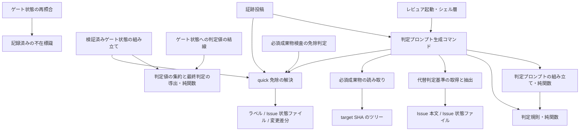
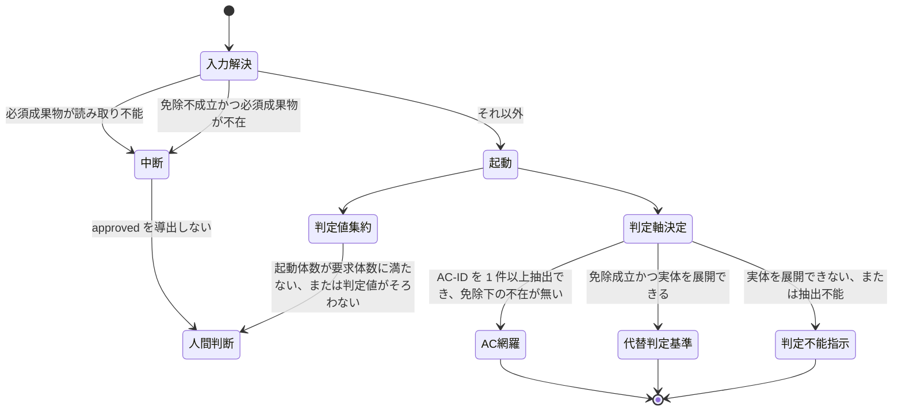

# DESIGN: size:quick の Issue でゲートが構造上通過不能な問題の是正

- Issue: `ISSUE-733`
- 対応する SPEC: `SPEC.md`

## 目的・対象範囲

quick 免除に正しく従った Issue（4 成果物を作らない Issue）は、現在どのゲートも構造上 `approved` に到達できない。原因は判定機構が Issue の size を一切参照しないことにあり、次の 2 経路として現れる。(A) 判定プロンプトが「`SPEC.md` から AC-ID を検出できず。conformance は inconclusive とし human_required へ倒すこと」という指示を出力し、conformance が構造上 pass になりえない。(B) ゲートレビュー起動経路が対象セグメントの必須成果物を target SHA から読めないときに中断し、conformance・falsification とも `pending` のまま確定する。

本設計は、判定機構に quick 免除の成否（以下 E）を第一級の入力として導入し、判定プロンプトを**判定対象区間**（レビュアが読むべき成果物の内容、または存在しない事由を提示する区間）と**判定軸区間**（conformance を何によって判定するかを指示する区間）へ分離したうえで、E と必須成果物の読み取り結果・AC-ID 抽出結果・代替判定基準の展開可否から、判定軸区間の値 S（`AC-ID 全件網羅` / `代替判定基準` / `inconclusive 指示`）と起動経路の中断有無を決定する。あわせて、判定軸の実体の取得経路を、リポジトリの default branch を保護された基点として実行される起動経路（以下 trusted base 側の起動経路）が Coordination Backend の一次情報から取得した値のみに限定する。

対象範囲は次の 6 点である。

- (a) size シグナル・risk シグナル・変更差分のガードレール判定を三値で解決し、E を導く機構の新設。
- (b) 必須成果物の読み取り結果と AC-ID 抽出結果を、「取得できた」「不在であることを確認できた」「読み取り不能」の三値で保持する機構の新設。
- (c) 判定軸区間の値 S・判定対象区間の提示種別・ゲートレビュー起動経路の中断有無を決める規則の新設（いずれも外部入出力を持たない純関数として実装する）。
- (d) 代替判定基準の実体を trusted base 側の起動経路のみから取得し、判定軸区間へ展開する機構の新設。
- (e) 判定プロンプトへの区間境界の導入と、埋め込み内容による境界偽装の無害化。
- (f) 必須成果物が quick 免除により正当に不在である場合に、ゲートレビュー起動経路を中断させない変更。
- (g) 1 回のゲートレビュー起動単位（以下 attempt）について、起動されたレビュア群の判定値を 1 つへ集約して最終判定を導く規則の変更。集約の母数を、実際に起動されたレビュアの体数ではなく、当該 attempt のレビュープロファイルが要求するレビュア体数とする。

次は対象外とし無変更とする。quick 免除の範囲そのもの（憲法が定める免除規定）。反証（falsification）側のルーブリックの停止条件・severity 基準。判定プロンプト生成の決定性の保証、判定プロンプトの再生成による証跡照合、prompt digest の一致検査、およびそのための入力スナップショットの確定・保存（証跡照合機構）。代替判定基準の一次情報（GitHub モードは Issue 本文、ローカルモードは Issue 状態ファイル）そのものに対して、判定を受ける側が変更操作を行った場合の防止・検知・無効化、およびその対策の一部として代替判定基準への適合を立証するために判定対象区間へ変更差分の証跡を展開すること。レビュアが判定プロンプトの明示指示に反する verdict を返した場合の検知・強制。必須成果物検査（継続的統合上の成果物存在検査）が用いる免除判定。

## 用語

本設計は次の用語を用いる。いずれも `SPEC.md` が定義する語と同一の意味である。

- **quick 免除（E）**: size シグナルが `quick` に解決され、risk シグナルが `normal` に解決され、ガードレール判定が「含まない」であるときに限り成立する、4 成果物の作成義務免除。
- **ガードレール対象パス**: `docs/adr/`・`.agent-skill-chain/config/segments.yaml`・`AGENTS.md`・`.agent-skill-chain/schemas/`。
- **判定プロンプト**: レビュアへ渡される read-only の判定指示文字列。レビュアにはツール呼び出しが一切許可されないため、判定に使える情報はこの文字列に展開済みの内容のみである。
- **判定対象区間 / 判定軸区間**: 判定プロンプト内の互いに重ならない 2 区間。前者は成果物の内容または不在事由を提示し、後者は conformance の判定軸を指示する。
- **代替判定基準**: quick 免除下で `AC-ID 全件網羅` に代わって用いる conformance の判定軸。実体は当該 Issue 本文に記載された要求・期待する挙動・受入基準であり、対象ゲートの別を問わず同一の実体を用いる。
- **trusted base 側の起動経路**: リポジトリの default branch を保護された基点として実行される、ゲートレビュー起動・判定プロンプト生成の実行経路。
- **ワーカー供給経路**: セグメント作業ワーカーまたはゲートレビュアが内容を書き込める経路。ブランチ上の成果物ファイル、PR 本文、Issue コメント、ワーカーが作成した Issue 本文の写しを含む。区別の基準は書き込み主体であって格納媒体ではない。
- **必須成果物**: 対象ゲートが判定の前提として存在を要求する成果物。spec は `SPEC.md`、design は `DESIGN.md` と `PLAN.md`、implementation は無し、validation は `VALIDATION.md`。
- **判定対象成果物**: 判定対象区間へ内容を展開する対象。必須成果物を含むが同一ではない（design は変更差分に現れた `docs/adr/` 配下、validation はテスト実行ログ、implementation は 4 成果物以外の変更パス全体を含む）。
- **attempt**: 1 回のゲートレビュー起動単位。同一の attempt 識別子・target SHA・base SHA・レビュープロファイルのもとで起動されたレビュア群と、その証跡の集合を指す。
- **要求体数**: 1 つの attempt について、レビュープロファイルが起動と判定値の返却を要求するレビュアの体数。standard プロファイルと light プロファイルは 1 体、strict プロファイルは 2 体である。当該 attempt のプロファイルから決定的に定まり、実際に起動された体数によって変化しない。
- **slot**: 1 つの attempt の中で個々のレビュアへ割り当てられる識別子。attempt の開始時に要求体数の分だけ割り当てるが、起動側の再試行・重複起動・起動制御の欠陥により要求体数を超えてレビュアが起動されることがあり、その場合は超過分のレビュアにも相異なる slot 識別子を与える。したがって slot の総数は要求体数を下回ることも上回ることもあり、要求体数を上限としない。**起動済み slot の集合**は、レビュアの起動に成功した slot の集合をいい、起動に失敗した slot を含まない。その要素数が当該 attempt の実際の起動体数であり、要求体数とは独立に定まる。
- **判定結果の未確定**: 起動済み slot について、レビュアの判定値を確定できない状態。未返却・タイムアウト・異常終了・応答スキーマの不適合を区別せず 1 つの値として扱う。
- **要求記述節**: Issue 本文のうち、見出しテキストが要求・期待する挙動・受入基準を担う固定ラベルのいずれかに一致する節。代替判定基準の実体はこの節の内容だけから採る（判断 D6）。
- **判定値 / 最終判定**: 立証観点（conformance）・反証観点（falsification）についてレビュアが返す `pass` / `fail` / `pending` の値と、attempt 全体についてそれらから機械的に導く `approved` / `rejected` / `human_required` の値。

## 前提の実地確認

要求・要件セグメントのゲートレビューでは憲法本文がレビュアへ展開されておらず、`SPEC.md` が置いた前提の真偽が未検証のまま申し送られた。本設計では該当箇所を憲法（`AGENTS.md`）の実物に当たって確認した。結果は次のとおりで、`SPEC.md` の前提といずれも一致する。齟齬は無い。

| `SPEC.md` が置いた前提 | 憲法の実物で確認した記述 | 判定 |
|---|---|---|
| size シグナルの取得元は GitHub モードが Issue ラベル、ローカルモードが Issue 状態ファイルの `size` キー | quick の定義に「GitHub モードは Issue ラベル `size:quick`、ローカルモードは `state.yaml` の `size: quick`」と明記されている | 一致 |
| size シグナルの既定値は `standard` | 同じ定義に「既定は standard」と明記されている | 一致 |
| size シグナルの書き込み主体はセグメント作業ワーカーの権限に含まれない | 同じ定義に「進行役の明示的オプトインのみで成立し自動昇格しない」と明記され、役割・権限の表はセグメント作業ワーカーの権限を「自ブランチへの commit / push、Draft PR 作成（SPEC ワーカーのみ）、Issue コメント」に限定している。ラベル操作・状態遷移は進行役の権限として別行に置かれている | 一致 |
| risk が `normal` 以外（`unclassified` を含む）は非 normal 側として扱う | 不変条件 I8 が「`risk != normal`（`unclassified` 含む）OR `autonomy == full` → `review_profile: strict`」と定めている | 一致 |
| quick 免除の成立条件に risk が `normal` であることとガードレール対象パス非該当が含まれる | quick の規定に「ただし risk が `normal` 以外、または変更差分に `docs/adr/`・`.agent-skill-chain/config/segments.yaml`・`AGENTS.md`・`.agent-skill-chain/schemas/` を含む場合は免除せず通常フローを強制する」と明記されている | 一致（ガードレール対象パスの集合も完全一致） |
| quick 免除の対象は `SPEC.md`・`DESIGN.md`・`PLAN.md`・`VALIDATION.md` の作成義務 | quick の規定が同じ 4 ファイルを列挙している | 一致 |
| 免除シグナルは免除対象の成果物に依存しない場所に置かれる | quick の規定に「シグナルは免除対象の成果物に一切依存しない場所にのみ置く」と明記されている | 一致（シグナルを成果物本文から読まない本設計の方針と整合） |
| Issue コメント・PR 本文・ブランチ上の成果物はワーカー供給経路である | 役割・権限の表がセグメント作業ワーカーへ「自ブランチへの commit / push、Draft PR 作成、Issue コメント」を与えている。すなわちこの 3 経路はワーカーが内容を制御できる | 一致 |
| GitHub モードのゲートは自動 CI 強制を持たず、実施要否は進行役が判断する | 不変条件 I2 が「GitHub モード、または `profile: lightweight` の場合はガイドライン（実施要否は進行役が判断）」と定めている | 一致 |

加えて、憲法の Coordination Backend の規定は「`issue_sync` が有効な GitHub モードでは、ゲート通過ごとに成果物全文とゲート状態を Issue / PR 本文の固定マーカー区間へ一方向転記し、転記結果をゲート判定の入力として読み戻すことはしない」と定めている。この規定は本設計の判断 D5 の直接の根拠であり、`SPEC.md` の前提と矛盾しない（後述）。

### 実装の実地確認（Issue 本文への書き込み経路と転記マーカー）

`SPEC.md` は「Issue 本文は人間・進行役・セグメント作業ワーカーが編集できる」ことを事実として述べ、その改変の禁止・自動検知の要否を未決事項として本セグメントへ送っている。確定にあたり、Issue 本文への書き込みが**技術的に**遮断されているか否かを、役割定義・アダプタ・実行制約の実物に当たって確認した。結果は次のとおりである。

| 確認対象 | 実物で確認した内容 | 判定 |
|---|---|---|
| ベンダー中立の role contract が定めるセグメント作業ワーカーの権限 | 付与されるのは自ブランチへの commit / push、Draft PR 作成、Issue コメント、テスト実行、writer lease 操作、固定スキーマによる報告であり、Issue 本文の編集は列挙されていない | 運用規約としての禁止は成立する |
| Claude Code アダプタがワーカー起動時に渡すツール allowlist の既定値 | Issue へのコメント投稿は許可されるが Issue 本文の編集コマンドは列挙されておらず、列挙外はヘッドレスで拒否される。ただし当該既定値は環境変数で完全に上書きでき、加えて `.agent-skill-chain/scripts/` 配下のスクリプト実行と CLI 実行が広く許可されている | 技術的遮断としては不完全 |
| Codex アダプタがワーカー起動時に用いる実行制約 | 書き込み可能な作業ツリーとネットワーク接続を許可し、実行コマンドの allowlist を持たない | Issue 本文の編集は技術的に実行可能 |
| 配線される事前実行フックの拒否範囲 | 拒否するのは cleanup を経由しない worktree 削除と命名規約違反のブランチ作成の 2 種のみで、それ以外は無条件に通過させる（fail-open） | Issue 本文の書き込みは対象外 |
| ワーカーへ渡す GitHub credential の分離 | ゲートレビュアには GitHub credential を渡さない隔離が実装されている一方、ワーカーは Issue コメント投稿と push のために同一の GitHub credential を用いる。Issue 本文の編集だけを除いた権限へ絞る仕組みは無い | 権限分離による遮断は無い |
| 一方向転記の実装がマーカー文字列に対して行う処理 | 転記区間を組み立てる際、成果物本文に含まれる開始・終了マーカーと同一の文字列を無害な表記へ置換している | 転記側のマーカー偽装の無害化は既に存在する |

**確認の結論。** セグメント作業ワーカーによる Issue 本文への書き込みは、役割・権限（運用規約）としては禁止されているが、**機構上は遮断されていない**。したがって本設計は「ワーカーが Issue 本文を書けない」という命題を前提として用いず、判断 D11 と後掲の残存リスクでその射程を明示する。一方、転記されるマーカーの偽装については転記側に無害化が実在することを確認できたため、判断 D5 はこれを二層のうちの一層として扱い、抽出側だけでも成立する規則を置く。

## 設計判断

### D1. quick 免除の解決を、判定機構専用の三値解決として新設する

size シグナル・risk シグナル・ガードレール判定を、それぞれ次の三値へ解決する。

| 次元 | 値 | 解決規則 |
|---|---|---|
| size シグナル | `quick` / `standard` / 解決不能 | 取得元から `size:` 接頭辞のラベル（GitHub モード）または `size` キー（ローカルモード）を読む。値が 0 件なら既定値 `standard`。1 件で値域内ならその値。値域外なら解決不能。2 件以上が同時に与えられていれば解決不能。取得自体に失敗した場合も解決不能 |
| risk シグナル | `normal` / `normal` 以外 / 解決不能 | 同様に `risk:` 接頭辞のラベルまたは `risk` キーを読む。値が 0 件なら既定値 `unclassified` を `normal` 以外へ写像する。`normal` のみ `normal`、`high`・`unclassified` は `normal` 以外。値域外・複数・取得失敗は解決不能 |
| ガードレール判定 | 含まない / 含む / 判定不能 | base SHA から target SHA までの変更差分のパス集合を取得し、ガードレール対象パスに該当するものがあるかを判定する。base SHA が与えられていない場合、および差分取得が失敗した場合は判定不能 |

E は「size が `quick` かつ risk が `normal` かつガードレール判定が「含まない」」のときに限り成立し、それ以外はすべて不成立とする。解決不能・判定不能は不成立側へ写像する。

**なぜ既存の免除判定を再利用しないか。** 継続的統合の必須成果物検査が用いる既存の免除判定は、(1) 変更差分の基点を「当該 Issue の worktree の default branch との差分と未コミット差分の合成」に取るため target SHA に固定されておらず、ゲート判定の入力として使うと同一 target SHA でも結果が変わりうる。(2) シグナルの取得失敗を「quick 未要求」と同一へ畳み込む二値であり、本設計が要する三値の区別を持たない。(3) その挙動を変えると必須成果物検査の側に回帰を生む。したがって判定機構専用の解決を新設し、既存の免除判定の観測挙動は変更しない。ただし取得元へのアクセス（ラベル取得・Issue 状態ファイル読み取り）という下位の関心事は新設側へ集約し、既存の免除判定はそれを呼び出して自身の二値へ畳み込む形へ寄せる。これにより同一の取得元に対する読み取り実装が 2 つに分かれることを避ける。

**なぜ解決不能を既定値へ落とさないか。** 落とすと、外形的な取得障害（一時的なネットワーク断、権限不足、応答の解釈失敗）によって quick 免除が誤成立し、判定軸が代替判定基準へ降格したまま `approved` へ到達しうる。逆にシグナル未付与まで解決不能に含めると、size ラベルを運用していない既存の全 Issue が解決不能となり、適正な `SPEC.md` を持つ通常の Issue まで `approved` へ到達できなくなる。両者を分離し、未付与は決定的な既定値、取得の失敗は安全側とする。

### D2. 必須成果物の読み取りと AC-ID 抽出を三値化し、「不在」を肯定的に確認する

現行実装は成果物の内容取得コマンドの非 0 終了をそのまま「不在」とみなしている。この畳み込みがあると、実在する成果物の読み取り障害が「quick 免除により正当に不在」として提示され、レビュアは成果物を読まないまま判定し、同時に AC-ID 抽出結果が 0 件へ写像されて判定軸が無言で降格する。

そこで必須成果物ごとの読み取り結果を「存在し内容を取得できた」「存在しないことを確認できた」「読み取り不能」の三値とし、**不在は肯定的に確認する**。具体的には target SHA のツリーを対象パスで列挙し、列挙自体が成功して該当エントリが 0 件であることをもって不在とする。列挙が失敗した場合、エントリが blob 以外である場合、および列挙で得た blob の内容取得が失敗した場合は読み取り不能とする。非 0 終了の理由を出力文言から推測する方法は取らない（文言は実行系の版に依存し、推測を誤れば読み取り障害が不在へ再び畳み込まれるため）。

必須成果物集合全体の値は、1 件以上が読み取り不能ならば「読み取り不能」、そうでなく 1 件以上が不在ならば「不在」、それ以外は「すべて取得できた」とする。必須成果物を持たないゲートは「すべて取得できた」とする（空集合のすべての要素について内容を取得できたと解する）。

集合全体の値は三値であり、成果物ごとの読み取り結果が「1 件以上が読み取り不能」かつ「別の 1 件以上が不在」である混在状態は「読み取り不能」へ畳み込まれる。畳み込んでよいのは、集合全体の値を入力とする判断が判定軸の決定（判断 D3）と起動経路の中断（判断 D9）の 2 つに限られ、そのいずれも混在状態を「1 件以上が読み取り不能」と同一に扱うからである。混在状態で扱いが分かれる唯一の観測点である判定対象区間の提示は、集合全体の値を用いず成果物ごとの三値から決める（判断 D8）。したがって畳み込みによって失われる情報は無い。混在状態は必須成果物を 2 件以上持つゲート（design）でのみ到達する。

AC-ID 抽出結果は `SPEC.md` の読み取り結果から導く。取得できた場合は既存の抽出規則（第 4 レベル見出しに現れる正規の受入条件宣言のみを数える）を適用して「1 件以上」または「0 件」、不在を確認できた場合は「0 件」、読み取り不能の場合は「抽出不能」とする。

### D3. 判定軸・提示種別・中断有無を、外部入出力を持たない純関数へ切り出す

判定軸区間の値 S、判定対象区間の提示種別、ゲートレビュー起動経路の中断有無は、いずれも解決済みの入力値だけから決まる全域関数である。これらを Git・GitHub・ファイルシステムのいずれにも触れない関数として実装し、判定プロンプト生成と起動経路の双方から呼び出す。副作用と外部依存を持たないため、レビュアもゲート起動も介さずに単体テストから全状態を直接検証できる。

S の決定規則は次のとおりである。

| E | 必須成果物の読み取り | AC-ID 抽出 | 代替判定基準 | S |
|---|---|---|---|---|
| 問わない | 問わない | 抽出不能 | 問わない | `inconclusive 指示` |
| 成立 | すべて取得できた、または読み取り不能（不在との混在を含む） | 1 件以上 | 問わない | `AC-ID 全件網羅` |
| 成立 | 不在 | 1 件以上 | 展開できる | `代替判定基準` |
| 成立 | 不在 | 1 件以上 | 展開できない | `inconclusive 指示` |
| 成立 | 問わない | 0 件 | 展開できる | `代替判定基準` |
| 成立 | 問わない | 0 件 | 展開できない | `inconclusive 指示` |
| 不成立 | 問わない | 1 件以上 | 問わない | `AC-ID 全件網羅` |
| 不成立 | 問わない | 0 件 | 問わない | `inconclusive 指示` |

判定対象区間の提示種別は必須成果物ごとに決める（判断 D8 を参照）。起動経路の中断有無は「必須成果物が読み取り不能ならば中断」「E が不成立で 1 件以上が不在ならば中断」「それ以外は中断しない」とする。不在と読み取り不能が混在する入力では集合全体の値が「読み取り不能」となるため、免除の成否によらず中断する。

代替判定基準の展開可否は S の決定に必要な場合にのみ解決する。すなわち E が成立し、かつ AC-ID 抽出が 0 件であるか、または AC-ID を 1 件以上抽出できて必須成果物が不在である場合に限る。それ以外の入力では Issue 本文を取得しない。E が不成立である主経路では取得元へのアクセスが一切増えず、本変更前と同じ入力だけで判定軸が決まる。

### D4. 代替判定基準の実体は trusted base 側の起動経路のみから取得する

代替判定基準の実体の取得元は、GitHub モードでは Issue 本文取得 API、ローカルモードでは Issue 状態ファイルの要求内容フィールドに限る。呼び出しの基点は共通（メイン）作業ツリーのルートとし、当該 Issue の worktree を基点にしない。ワーカー供給経路（ブランチ上の成果物ファイル、PR 本文、Issue コメント、ワーカーが作成した本文の写し）は、当該記述がそこに存在するか否かによらず一切読まない。

**なぜ前提の記述ではなく機構として置くか。** quick 免除が成立し AC-ID を抽出できない場合、conformance の判定軸は代替判定基準だけになる。この実体の取得経路を機構で閉じないと、判定を受ける側であるセグメント作業ワーカーが自ら判定軸を供給でき、緩い受入基準相当の記述を置くだけで `approved` へ到達する自己承認経路が成立する。これは quick 経路に限って不変条件 I8（安全側ラチェット・silent pass 禁止）を実質的に無効化する。

判定対象区間へ展開される成果物、および `SPEC.md` から抽出した AC-ID 集合はワーカーが著述するものだが、これは判定対象そのものであるため本限定の対象外とする。限定するのは代替判定基準の実体の取得経路のみである。

### D5. Issue 本文のうち、成果物全文の一方向転記区間を代替判定基準から除去する

GitHub モードでは、ゲート通過ごとに 4 成果物の全文とゲート状態を Issue 本文の固定マーカー区間へ一方向転記する機能が既定で有効である。したがって Issue 本文には、ワーカーが著述した `SPEC.md`・`DESIGN.md`・`PLAN.md`・`VALIDATION.md` の全文が機械的に転記されて含まれうる。転記を実行するのは trusted な発行経路だが、**転記された内容の著述主体はセグメント作業ワーカーである**。ワーカー供給経路の判別基準は書き込み主体であって格納媒体ではないため、この区間は Issue 本文の一部でありながらワーカー供給経路に属する。

これは机上の懸念ではなく到達可能な経路である。quick 免除は成果物の作成を免除するだけで禁止はしないため、ワーカーが `SPEC.md` だけを著述し `DESIGN.md`・`PLAN.md` を作らない状態は正当に成立する。この状態で spec ゲートを通過させると `SPEC.md` 全文が Issue 本文へ転記され、続く design ゲートでは必須成果物が不在であるため判定軸が代替判定基準へ切り替わる。除去しなければ、その代替判定基準の実体にワーカー著述の `SPEC.md` 全文が含まれ、緩い受入基準を自ら書いて自ら通過できる。

そこで代替判定基準の抽出では、取得した Issue 本文から転記区間を除去したうえで抽出する。除去範囲は、開始マーカーの**最初**の出現と終了マーカーの**最後**の出現を基準として次の 4 通りに一意に定める。マーカーの片側が失われた状態でも、いずれの場合も転記内容が残らない側へ倒す。

| 本文中のマーカーの出現 | 除去範囲 |
|---|---|
| 開始マーカーが 1 つ以上あり、その最初の出現より後に終了マーカーが 1 つ以上ある | 最初の開始マーカー行から最後の終了マーカー行まで（両マーカー行を含む） |
| 開始マーカーが 1 つ以上あり、その最初の出現より後に終了マーカーが無い | 最初の開始マーカー行から本文末尾まで |
| 開始マーカーが無く、終了マーカーが 1 つ以上ある | 本文先頭から最後の終了マーカー行まで |
| いずれのマーカーも無い | 除去しない |

**除去範囲を「最初の終了マーカーまで」ではなく「最後の終了マーカーまで」とする理由（マーカー偽装の無害化）。** quick 免除は成果物の作成を免除するだけで禁止しないため、ワーカーが成果物本文の中へ終了マーカーと同一の行を書き込む入力は正当に到達可能である。この入力を転記すると Issue 本文は「開始マーカー → ワーカー著述の内容 → ワーカーが埋め込んだ終了マーカー → ワーカー著述の残りの内容 → 本来の終了マーカー」という並びになりうる。除去を最初の終了マーカーまでとすると、埋め込まれた終了マーカー以降のワーカー著述内容が本文に残る。成果物本文は `要求`・`目的` 等の見出しを持つため、残った内容は判断 D6 が要求記述節として一致させる見出しを含み、判定軸区間へ代替判定基準の実体として書き出される。最後の終了マーカーまでを除去すれば、区間内部に埋め込まれた終了マーカーは除去範囲の内側へ入り、この経路は成立しない。これは判断 D7 が判定プロンプトの区間標識に対して採る無害化（埋め込み内容による境界偽装の無効化）と同型の対処を、読み取り側で行うものである。除去後に残った本文に開始・終了いずれかのマーカーと同一の行がなお含まれる場合、その行自体も捨てる（判定軸の実体に境界標識の残骸を混入させない）。

**転記側にも同型の無害化が既に存在する。** 前掲の実地確認のとおり、一方向転記の実装は転記区間を組み立てる際に成果物本文へ含まれる開始・終了マーカーと同一の文字列を無害な表記へ置換している。したがってマーカー偽装の無効化は、転記側（書き込み時の置換）と抽出側（最後の終了マーカーまでの除去）の二層で担保される。本設計は前者に依存せず後者だけで成立させる。無害化が導入される前に転記された古い本文が残っている場合や、転記側の無害化が将来失われた場合にも、抽出側の規則だけで判定軸区間へのワーカー著述内容の流入を阻止するためである。マーカー文字列の定義は転記側と抽出側で単一の定義を共有し、形式変更時に両者が同時に追随することを保証する。

**過剰除去は安全側である。** 転記側は本文中の転記区間を 1 つだけ置換または新設する実装であり（前掲の実地確認）、開始マーカーと最後の終了マーカーの間に人間が書いた要求が挟まる並びは通常発生しない。仮にそうした本文が生じて過剰に除去されたとしても、残る要求記述節とそのブロックが減るだけであり、0 件になれば「展開できない」として判定軸は `inconclusive 指示` へ倒れる。すなわち過剰除去は `approved` を導出しない側へ働く。

この除去は、憲法が定める「転記結果をゲート判定の入力として読み戻すことはしない」という規定の直接の実装でもある。

### D6. 代替判定基準の抽出規則は、要求記述節の見出し一致による採用とする

`SPEC.md` は、代替判定基準の展開可否を「Issue 本文から要求・期待する挙動・受入基準に相当する記述を 1 件以上取り出して判定軸区間へ書き出せるか」で定め、取り出せる記述が 0 件であれば展開不能として `inconclusive 指示` へ倒すことを確定している。

**本設計はこの判定を「記述が要求として意味的に十分か」の判定として実装しない。** 自然文の意味的な十分性は判定機構にもレビュアにも機械的に判定できない。これを近似しようとすると、必ず量的な閾値か意味の推定が入る。閾値を厳しくすれば短くとも正当な受入基準（`終了コードを 0 にする。` のような 1 行）を弾き、**正当に到達可能な quick 免除下の Issue を再び構造上 `approved` へ到達不能にする**——これは本 Issue が解消しようとしている欠陥そのものである。逆に閾値を緩めれば実質を持たない記述が通る。どちらの向きの誤りも、閾値の値をどう選んでも同時には消せない。したがって本設計は精度を上げる方向を採らず、**抽出規則を、(i) 見出し構造による節の選別、(ii) 記入省略表現の固定列挙への完全一致による除外、(iii) 除外後に残る記述が 0 件なら展開不能、の 3 つだけへ縮小する。** 縮小の結果として残る誤りは後掲「本規則が残す誤りと、その射程」に明示する。

抽出は次の順で行う。いずれの段も文字列処理だけで決まり、記述の意味を解釈しない。

1. 判断 D5 の転記区間除去を適用した本文を先頭から 1 度だけ走査し、**囲み区間**（fenced code block と HTML コメント）を特定する。囲み区間の開始は、行頭から半角空白 3 個以内の字下げに続く 3 個以上の連続した `` ` `` または `~`（fenced code block）、および `<!--`（HTML コメント）とする。fenced code block の終了は、開始と同じ記号が開始以上の個数だけ並び、それ以外に情報文字列を持たない行とする。HTML コメントの終了は `-->` とする。走査中に先に開始した種別の区間が優先し、その内部に現れる他方の開始記号は区間の一部として扱う。終了が現れないまま本文が尽きた場合は、開始位置から本文末尾までを囲み区間とする。
2. 囲み区間の内部の行を見出し行として扱わないことを前提に、本文を ATX 見出し行（行頭の `#` が 1〜6 個で、その後に空白と見出しテキストが続く行）で節へ分割する。1 つの節は、見出し行の次の行から、`#` の個数が同じかそれより少ない次の見出し行の直前までとする。最初の見出し行より前の本文は、いずれの節にも属さない前文として扱う。1 つの節の内容には、当該節に含まれるより深い見出し行とその配下も含む。囲み区間の内部の行は、それを含む節の内容（最初の見出し行より前にあるときは前文）の一部として残るが、節の境界を作らない。
3. 各節の見出しテキストを正規化する。正規化は、前後の空白除去・強調記号（`*`・`_`・`` ` ``）の除去・末尾のコロン除去・英字の小文字化・全角英数字と全角空白の半角化からなる。
4. 正規化後の見出しテキストが**要求記述節ラベル**のいずれかへ完全一致する節を**要求記述節**とする。ラベル集合は次の固定列挙とし、実装のコード上の定数として持つ。設定ファイル・環境変数・成果物のいずれからも与えない（判定を受ける側が供給できる値で採否を変えられないようにするため）。
   - `課題・目的` / `課題` / `目的` / `背景・目的` / `目的・背景` / `要求` / `要件` / `要求・要件` / `期待する挙動` / `期待される挙動` / `期待動作` / `期待結果` / `受入基準` / `受入条件` / `完了条件`
   - `problem` / `purpose` / `goal` / `objective` / `requirement` / `requirements` / `expected behavior` / `expected behaviour` / `acceptance criteria` / `definition of done`
5. 要求記述節の内容を空行区切りのブロックへ分割し、(a) 空白のみ、(b) HTML コメントのみ、(c) 水平線のみ、(d) **記入省略表現のみ**からなるブロックを捨てる。記入省略表現とは、正規化（前後の空白除去・英字の小文字化・末尾の句読点除去）後に `無し` / `なし` / `特になし` / `未定` / `不明` / `tbd` / `n/a` / `none` / `後日追記` のいずれかへ完全一致する 1 行のブロックをいい、これも同様にコード上の固定列挙とする。
6. 残ったブロックを、すべての要求記述節にわたって原文の順序のまま連結したものを抽出結果とする。**残ったブロックが 1 件以上ある場合に「展開できる」**とし、抽出結果を判定軸区間へ書き出す。残ったブロックが 1 件も無い場合は「展開できない」とする。要求記述節が 1 件も無い場合と、Issue 本文そのものを取得できない場合も「展開できない」とする。**この段では文字数・分量その他の量的な判定を一切行わず、記述の意味も推定しない。**
7. 要求記述節以外の節と前文は、要求記述節の有無にかかわらず判定軸区間へ書き出さない。

**本規則の既定は「展開できない」である（安全側の既定）。** 上記の各段は、**展開できると判定してよい条件を網羅的に列挙したもの**であり、その条件をすべて満たす入力だけが「展開できる」となる。抽出のいずれかの段で、規則の前提が満たされない・規則が一意に適用できない・入力の構造から要求記述節を確定できないなど、**上記 1〜7 を最後まで適用しきれない入力**は、例外なく「展開できない」とし `inconclusive 指示` へ倒す。ここで判定するのは規則を適用しきれたか否かだけであり、記述の意味が要求として十分かは判定しない。判定不能を展開可能側へ寄せると、判定軸を実体化できていない状態から `approved` へ到達しうるため、不変条件 I8（安全側ラチェット・silent pass 禁止）に反する。

**なぜ本文全体の非空ブロックを採用条件にしないか。** 本文のどこにあるかを問わず空でないブロックを採用すると、`初期自走範囲`・`リスク分類`・担当者欄のような管理上の節の内容や、前文の定型文しか書かれていない本文でも「展開できる」となり、要求でも期待する挙動でも受入基準でもない文字列が唯一の判定軸として判定軸区間へ置かれる。見出し構造による節の選別は、採用範囲を要求記述節ラベルへ一致する節の内容だけに限ることでこの経路を閉じる。閉じられるのは**採用範囲**であって、採用した節の内容が要求として十分かどうかではない（後掲「本規則が残す誤りと、その射程」）。

**本規則が残す誤りと、その射程。** 要求記述節ラベルへ一致する見出しの下に、記入省略表現の固定列挙へ完全一致しないブロックが 1 件以上あれば「展開できる」となる。したがって `## 要求` の内容が「担当者は未定です。詳細は関係者との調整後に別途追記します。」のように、実質的な要求を含まないが列挙へ完全一致もしない本文は、展開可能と判定される。**本設計はこの誤りが残ることを承知のうえで規則を縮小する。** この誤りを機械的に排除しようとすれば量的な閾値か意味の推定が必要になり、その瞬間に逆向きの誤り（短くとも正当な受入基準を弾く）が生じて、quick 免除下の Issue を再び構造上 `approved` へ到達不能にする。両方向の誤りを同時に消す機械的規則は存在しない。残る誤りは「機械検査で充足判定できない要求」という一般の問題に属し、`ISSUE-768` がその射程で扱う。本 Issue はこれを扱わない。なお、この誤りは判定軸の実体が薄くなることを意味するが、判定軸の実体の供給元そのものは判断 D4・D5（`SPEC.md` の要件9）により trusted base 側が取得した Issue 本文へ限定されており、判定を受ける側が自らの供給経路から判定軸を差し込む経路は本設計で閉じている。**記入省略表現の列挙はこれ以上増やさない。** 増やしても言い換えは有限個の列挙に収まらず、列挙を足すたびに列挙外の表現が残るためである。

**なぜ囲み区間の内部を見出し検出から除くか。** fenced code block と HTML コメントの内部の行は、Markdown として見出しを構成しない。除外しないと、コード例として引用した `# 要求` や、テンプレートの記入案内として本文に残る HTML コメント内の `# 要求` が要求記述節の見出しとして一致し、その配下の管理記述や案内文が代替判定基準の実体として判定軸区間へ書き出される。この入力は正当に到達可能である——Issue 本文にコード例を貼ることも、Issue フォームが記入案内を HTML コメントとして残すことも通常の操作だからである。囲み区間の内部を見出し検出から除けば、この経路は成立しない。終了記号が現れない囲み区間を本文末尾までとするのも同じ向きの選択であり、検出される見出しが減る側、すなわち「展開できない」へ倒れやすい側へ働く。

**なぜ見出し一致で機械的に決まるか。** 上記 1〜7 はいずれも行の形（`#` の個数・囲み記号の並び）と文字列の完全一致だけで決まる。記述が要求として十分かどうかを意味から判定する段も、分量を量る段も無く、判定機構にもレビュアにも意味の解釈を要求しない。同じ本文に対して同じ結果が決定的に定まる。

**なぜ見出しの揺れが主経路の障害にならないか。** 配布される Issue テンプレートは 6 種すべてが同一のフォーム項目を持ち、Issue フォームは各項目のラベルを見出しとして本文へ書き出す。したがってテンプレート経由で起票された Issue の本文は必ず `課題・目的` の節を持ち、当該項目はテンプレート上の必須入力である。テンプレートは当該項目の記入内容として、不具合修正では「現在の振る舞いと期待する振る舞いの差分」を、新機能では「解決したい問題、達成したい目的」を求めており、いずれも `SPEC.md` が代替判定基準の実体と定める「要求・期待する挙動」に相当する。すなわち主経路では見出しの表記が揺れない。同じフォームの `初期自走範囲`・`リスク分類` は、判定機構が別経路（ラベルまたは Issue 状態ファイル）で解決する管理上の項目であるためラベル集合に含めない。`制約` も、それ自体は要求でも期待する挙動でも受入基準でもないため含めない。

**見出しを持たない本文の扱い。** 要求記述節が 1 件も無ければ展開不能となり、判定軸は `inconclusive 指示` へ倒れて最終判定は `human_required` となる。実質的な要求が書かれていても見出しが無ければこの経路へ倒れる。ただし結果は `approved` を導出しない側であり、不変条件 I8 に反しない。是正は当該 Issue 本文へ要求記述節の見出しを 1 行加えるだけで足り、その操作は Issue 本文を編集できる主体（人間・進行役）の権限で完結し、変更は本文上で可視である。逆向きの誤り（要求が書かれていない本文を展開可能と判定すること）は `approved` へ到達しうるため、2 つの誤りは回復可能性が対称でない。したがって本設計は見出しの欠落を安全側の展開不能として扱う。ただしこの非対称性を根拠に閉じるのは採用範囲の外側だけであり、採用した要求記述節の内容についてまで逆向きの誤りを排除するものではない（前掲「本規則が残す誤りと、その射程」）。

**転記区間除去との順序。** 節の分割は判断 D5 の転記区間除去の**後**に行う。転記された成果物全文は `目的・背景`・`要求` などの見出しを含むため、除去より先に節を分割すると、ワーカーが著述した成果物の見出しが要求記述節として一致してしまう。除去を先に行うことで、要求記述節ラベルへの一致はワーカー著述でない本文に対してのみ生じる。

**なぜ Issue のタイトルを含めないか。** 代替判定基準の実体は Issue 本文に記載された記述と定義されており、タイトルはそこに含まれない。タイトルを補助的に加えると、本文が空の Issue でも「展開できる」となり、実質的に判定軸が無い状態から `approved` へ到達しうる。安全側として本文のみを用いる。

**なぜ実装差分・テスト実行結果・継続的統合の結果を代替判定基準へ加えないか。** 実装差分は既に判定対象区間へ展開されており、判定軸へも展開すると判定対象を判定軸の実体に用いることになり D4 の限定に抵触する。テスト実行結果と継続的統合の結果はブランチ上のファイルまたは PR に紐づく状態であり、ワーカー供給経路に属する。したがって代替判定基準の入力は Issue 本文のみとし、対象ゲートの別によらず同一とする。

### D7. 判定プロンプトへ明示の区間境界を導入し、埋め込み内容による境界偽装を無害化する

判定プロンプトに、判定対象区間と判定軸区間それぞれの開始・終了を表す 4 つの一意な標識行を導入する。標識は HTML コメント形式の固定文字列とし、判定プロンプトの本文としては意味を持たない行にする（既存の見出し文字列を境界に流用しない。見出し文字列は成果物本文にも自然に現れうるため、境界の一意な識別に使えない）。

**埋め込む可変内容に対して標識文字列を無害化する。無害化の対象は、判定プロンプトへ展開する可変内容のすべてとする**——すなわち trusted base 側が組み立てる固定文言以外のすべてであり、成果物本文・変更差分・Issue 本文に加えて、**過去ラウンドの判定記録として再掲する内容（過去のレビュアが返した finding の識別子・根拠要約、およびラウンド計数時の診断文言）を含む**。これらへ上記 4 標識と同一の文字列が含まれていれば無害な表記へ置換する。無害化しない場合、ワーカーは成果物ファイルへ終了標識を書き込むだけで判定対象区間を早期に閉じ、以降の内容を判定軸区間の側へ見せかけられる。すなわち区間の非重複性そのものをワーカーが破れる。

**過去ラウンドの判定記録を無害化の対象へ含める理由。** 判定プロンプトには、同一ゲートの過去の attempt でレビュアが返した finding が再掲される。その識別子と根拠要約はレビュアが返した応答に由来する文字列であり、成果物本文や Issue 本文と同じく判定を受ける側の影響下にある可変内容である。無害化しなければ、あるラウンドのレビュアが根拠要約へ標識行と同一の文字列を含めるだけで、次のラウンドの判定プロンプトに真正の境界とは別の同一標識が現れ、両区間の開始位置・終了位置が一意に識別できなくなる。標識が判定プロンプト内で一意であることは区間分離の前提そのものであり、可変内容の由来ごとに例外を設けたままこの前提を成立させることはできない。したがって無害化は由来を問わず可変内容の全体へ適用し、無害化対象を列挙で管理せず「固定文言以外のすべて」という閉じた条件で定める。

区間の割り当ては次のとおりとする。

- **判定軸区間**: S に応じた判定軸の指示と、その実体（`AC-ID 全件網羅` の場合は AC-ID 列、`代替判定基準` の場合は要求記述節から抽出したブロック列、`inconclusive 指示` の場合は実体を持たない）、および conformance ルーブリック本文。
- **判定対象区間**: 判定対象の差分、判定対象成果物ごとの提示、上流の承認済み成果物。
- **いずれの区間にも属さない中立域**: 冒頭の役割説明、ハルシネーション防止の指示、falsification ルーブリック、final の扱い、出力 JSON 契約。

判定軸区間の内容は S だけからは決まらない。S に加えて、対象ゲートの必須成果物の読み取り結果と AC-ID 抽出結果（判断 D2 が三値化する 2 つの解決値。`SPEC.md` はこれらを入力次元 D4・D5 と呼ぶが、本設計の判断番号とは別系統の識別子である）にも依存する。具体的には、S が `代替判定基準` である入力のうち、AC-ID 抽出結果が 0 件である場合は「AC-ID が quick 免除により正当に存在しない旨」を、AC-ID を 1 件以上抽出できて必須成果物が不在である場合は「網羅を立証すべき必須成果物が quick 免除により正当に不在である旨」を、それぞれ判定軸区間の指示文へ書き出す。実体（要求記述節から抽出したブロック列）はいずれの場合も同一である。

**conformance ルーブリック本文を判定軸区間へ入れる理由。** 現行のルーブリックは「適用対象の全 AC-ID / 要件が当該セグメント成果物で証跡付きに充足されているか」と、判定軸が AC-ID 全件網羅であることを本文へ固定的に書き込んでいる。S が `代替判定基準` のときにこの本文をそのまま残すと、判定軸区間の指示とルーブリックが同一の判定プロンプト内で矛盾する。ルーブリック本文は「conformance を何によって判定するか」の記述そのものであり、判定軸区間に属する。

falsification ルーブリックを中立域に残すのは、反証観点が本 Issue の対象外であり、同一箇所を変更する別 Issue（反証ルーブリックの停止条件を扱うもの）と衝突させないためでもある。

### D8. 判定対象区間の提示は必須成果物ごとに決め、不在と読み取り不能の混在を解消する

必須成果物集合全体の値は「1 件以上が読み取り不能」を「1 件以上が不在」より優先するため、不在の成果物と読み取り不能の成果物が同時に存在する入力では、集合全体としては読み取り不能になる。この状態で不在側の成果物をどう提示するかは `SPEC.md` が定めていない。

本設計では、判定対象区間の提示を**成果物ごとに個別に**決める。各必須成果物について、その成果物自身の読み取り結果と E から提示種別を決める。

| その成果物の読み取り結果 | E | 提示 |
|---|---|---|
| 取得できた | 問わない | 内容を展開する |
| 不在を確認できた | 成立 | 名称と、quick 免除により正当に不在である旨を明示する |
| 不在を確認できた | 不成立 | 名称と、本来存在すべきであるのに欠落している旨を明示する |
| 読み取り不能 | 問わない | 名称と、内容を取得できなかった旨を明示する。正当な不在としても欠落としても提示しない |

混在状態では、読み取り不能な成果物は 4 行目の提示、不在の成果物は E に応じて 2 行目または 3 行目の提示となる。集合全体の値は起動経路の中断判断にのみ用い、提示内容には用いない。この分割により、集合全体の値だけでは決まらない提示が一意に定まり、かつ読み取り不能を正当な不在として提示しないという要求も満たされる。なお当該入力ではゲートレビュー起動経路が中断するため、この提示は判定プロンプトを単独で生成した場合にのみ観測できる。

提示が成果物ごとに独立に決まることの直接の帰結として、同一ゲートの必須成果物の一部だけが存在して内容を取得できた入力では、取得できた成果物の内容が展開され、同時に不在または読み取り不能な成果物についてはそれぞれの事由が明示される。一部の成果物が不在であることを理由に、取得できた成果物の内容を省略しない。展開の対象が存在しないのは、必須成果物が 1 件残らず不在または読み取り不能である場合だけである。この部分充足の扱いは免除の成否によらず同一であり、免除の成否は不在を確認できた成果物の提示文言（正当な不在か、本来存在すべき欠落か）だけを分岐させる。

必須成果物以外の判定対象成果物は、target SHA に存在するものだけを提示し、存在しないものは提示対象から外す。これらは変更差分から導かれた集合であり、削除されたパスは差分区間で観測できるため、判定対象区間に不在の記述を追加する必要がない。上流の承認済み成果物（spec 以外のゲートで整合検査用に展開する `SPEC.md`）も同じ扱いとし、取得できた場合のみ展開し、不在の場合は当該提示自体を出力せず、読み取り不能の場合は内容を取得できなかった旨を明示する。

### D9. ゲートレビュー起動経路の中断を、判定プロンプト生成と同一の解決結果の上で起動前に評価する

現行実装では、必須成果物を読めないことによる中断は証跡投稿の段で起きる。すなわちレビュアが起動して verdict を返した後に中断するため、「レビュアを起動しない」という要求を満たさず、レビュアの実行資源も無駄になる。

そこで中断判定を、レビュアを起動する前に評価する。ただし中断判定と判定プロンプト生成を別々の実行単位へ分けることはしない。**両者は同一の実行単位の中で、1 回だけ行った入力解決の結果を共有する 2 つの段とする。**

具体的には、レビュア起動シェルがアダプタを起動する前に必ず呼ぶ判定プロンプト生成コマンドが、次の順序で動作する。(1) quick 免除の解決・必須成果物の読み取り・AC-ID 抽出・代替判定基準の解決を 1 回だけ行う。(2) その解決結果に判定規則の中断判定を適用し、中断する場合は判定プロンプトを出力せず、理由を標準エラーへ書いて非 0 で終了する。(3) 中断しない場合は、**同じ解決結果**から判定プロンプトを組み立てて標準出力へ書く。レビュア起動シェルは判定プロンプト生成の非 0 終了を既にフェイルセーフ（最終判定を人間判断へ倒して非 0 で終了する）として扱っているため、シェル層に新たな分岐も新たなサブコマンドも追加しない。

**なぜ中断判定を独立したコマンドにしないか。** 独立させると、中断判定の段と判定プロンプト生成の段が同一の入力を各々独立に解決することになる。両段の間に一過性の入出力障害が起きると、中断判定の時点では必須成果物をすべて読めたのに生成時に 1 件が読み取り不能になる入力が生じ、中断は評価済みであるためレビュアが起動されてしまう。これは「必須成果物が 1 件以上読み取り不能な場合はレビュアを起動せず `approved` を導出しない」という要求を破る。解決を 1 回に限れば、中断判定が観測した値と判定プロンプトが展開した値が同一であることが構造的に保証され、この迂回経路は設計上存在しなくなる。なお本判断が共有するのは同一プロセス内の解決結果のみであり、入力を永続化して後日の証跡と照合する機構は導入しない（それは本設計の対象外である）。

**判定プロンプトの組み立て自体は中断規則を一切持たない。** 組み立ては「解決済みの値を受け取って文字列を返す」全域関数であり、どの入力に対しても文字列を返す（代替判定基準を展開できない場合にも返す）。この分割により、判定対象区間の提示規則のうち起動経路では到達しない組み合わせ（免除不成立かつ必須成果物が不在、および読み取り不能）も、当該関数へ解決値を直接与えて観測できる。観測に一時リポジトリもコマンド実行も要さない。

証跡投稿の段の既存検査は撤去せず、多層防御として残す。ただし承認対象成果物の収集で不在を許容する条件を、「必須成果物を持たないゲートである」から「必須成果物を持たないゲートである、または quick 免除が成立している」へ拡張する。拡張しなければ、中断判定を通過した quick 免除下の入力が証跡投稿の段で従来どおり中断する。

### D10. ゲート状態の再照合では、承認時に不在であった成果物を記録済みの不在標識で照合する

承認済み成果物の digest を再照合してゲート状態を継承・無効化する経路は、base SHA を引数に取らないため E を再解決できない。ここで E を再解決するために base SHA を新たに要求すると、呼び出し側の契約が広がるうえ、承認時と再照合時とで E が変わりうる（ラベルは後から変更できる）。

そこで再照合では E を用いず、**承認時に記録された digest が不在標識であるか否か**で不在の許容を決める。承認時に不在だった成果物は、再照合時にも不在であれば不在標識どうしが一致して「変化なし」となり、実在するようになっていれば digest が一致せず「変化あり」として当該ゲートと全下流ゲートが無効化される。承認時に実在した成果物が読めなくなった場合は従来どおり読み取りの失敗として扱う。この規則は E の再解決を要さず決定的であり、かつ成果物の出現・消滅をいずれも変化として検出する。

### D11. quick 免除下で必須成果物が不在の場合に判定軸を切り替える根拠（判断の正確な射程）

`SPEC.md` は、quick 免除が成立し `SPEC.md` から AC-ID を抽出できる Issue において、対象ゲートの必須成果物が免除により不在である入力（design ゲートで `DESIGN.md`・`PLAN.md` が不在、validation ゲートで `VALIDATION.md` が不在）では判定軸を代替判定基準へ切り替えると定めている。切り替えないと、網羅を立証すべき成果物が判定対象区間に存在しないまま `AC-ID 全件網羅` が判定軸として指示され、conformance が成果物の品質と無関係に構造上 fail となるためである。

`SPEC.md` はこの切替が安全である根拠の 1 つとして「判定を受ける側が切替を発火させられない」と述べている。この根拠のうち、免除シグナル（size・risk）の書き込み主体がセグメント作業ワーカーの権限に含まれないという部分は、憲法の実物に当たって確認したとおり真である（前掲の実地確認）。しかし**切替の発火全体について読むと、この命題は成り立たない**。切替の条件には「必須成果物が不在であることを確認できたこと」も含まれ、成果物を作るか否かはセグメント作業ワーカーが制御できる入力だからである。本設計は、非発火性に依存しない正確な根拠を次のとおり置く。切替が安全であるのは、切替を発火させられないからではなく、**発火させても、規約を守る範囲でワーカーが行える操作だけでは判定軸の信頼度が下がらないから**である。具体的には次の 4 点による。規約に違反する操作まで含めた場合に残る穴は、4 点の後に残存リスクとして明示する。

1. **切替先の実体をワーカーが機構上供給できる経路は、判定機構の側からはすべて閉じてある。ただしワーカーが Issue 本文を直接編集する経路は機構上遮断されていない。** 代替判定基準の実体は trusted base 側の起動経路が Coordination Backend の一次情報から取得した Issue 本文のみに由来し、そこから成果物全文の転記区間を除去したものである（判断 D4・D5）。したがってブランチ上の成果物ファイル・PR 本文・Issue コメント・ワーカーが作成した本文の写しに置いた記述、および転記によって Issue 本文へ入り込んだワーカー著述の成果物本文は、いずれも判定軸の実体にならない。**一方、Issue 本文そのものへの書き込みは、役割・権限（運用規約）としてはセグメント作業ワーカーに与えられていないが、機構上は遮断されていない**（前掲の実地確認）。すなわち規約に違反して Issue 本文を直接書き換えるワーカーは、切替先の内容を供給できる。この点について本設計は「ワーカーは切替先の内容を書けない」とは主張せず、後掲の残存リスクとして明示する。本 Issue が新たに開く経路ではなく、判定軸が代替判定基準となる入力においてのみ判定結果へ影響しうる既存の権限境界の帰結である。
2. **切替の前提条件は進行役だけが与えられる。** 切替は E が成立する場合にのみ起きる。E の成立には size シグナルが `quick`、risk シグナルが `normal` であることを要し、憲法の役割・権限がこれらの書き込みを進行役の権限としている（前掲の実地確認）。E が不成立の主経路では、ワーカーが必須成果物を作らなくても判定軸は切り替わらず、代わりに起動経路が中断する。すなわちワーカーが制御できる入力は、進行役が既に quick 免除へオプトインした場合にのみ判定軸へ影響する。
3. **免除下では成果物の不在自体が正当な状態である。** 憲法が 4 成果物の作成義務を免除している以上、それらを作らないことは規約違反ではなく規約に従った状態である。規約を守る限り、ワーカーが切替によって得るのは「自分が書いた弱い判定軸」ではなく「進行役側が管理する Issue 本文という判定軸」である。
4. **取得の失敗では切り替わらない。** 切替の条件は「不在であることを確認できた」ことであり、読み取り不能では切り替わらず起動経路が中断する（判断 D2・D9）。取得の失敗による判定軸の無言の降格は起こらない。

なお切替の非発火性そのものを観測する受入条件は存在しない。本設計は非発火性に依存せず、上記 4 点の各々が個別の設計要素（D2・D4・D5・D9）と対応するため、根拠の変更によって設計要素が増減することはない。

**残存リスク（Issue 本文への直接編集）。** 上記 1 のとおり、セグメント作業ワーカーが規約に違反して Issue 本文を直接書き換えることは機構上可能である。quick 免除が成立し、かつ AC-ID 抽出結果が 0 件であるか必須成果物が免除により不在である入力では、conformance の判定軸は Issue 本文に由来する代替判定基準だけになるため、この編集は判定軸を緩める方向へ働きうる。本設計はこれに対する検知機構・禁止機構を導入しない。理由は 3 点である。(1) 検知には判定プロンプト生成時点の入力を保存して後日照合する機構を要し、それは本設計の対象外である。(2) 技術的遮断は、ワーカーへ渡す GitHub credential の権限を Issue 本文編集だけ除いて絞るか、全アダプタに共通の実行コマンド allowlist を持たせることを要し、いずれもゲート判定機構ではなくワーカー起動基盤の変更である。(3) 本リスクは quick 免除の成立を前提とし、その成立には進行役だけが書き込めるシグナルが 2 つとも必要である。したがって本設計は、当該経路が**運用規約により禁止されているが機構上の保証は無い**状態にあることを記録として残し、技術的遮断または検知の導入は別 Issue の管轄とする。

### D12. 判定不能な判定軸からの `approved` 抑止は本 Issue では機構化しない

判定軸が `inconclusive 指示` である attempt では、レビュアが指示に従う限り conformance が `pass` にならないため `approved` は導出されない。ここでレビュアの遵守に依存せず、trusted 側の値だけで `approved` を機械的に抑止する防御的既定を置くことは技術的には可能である。

本設計はこれを置かない。理由は 2 点である。(1) この抑止は判定軸の値だけを入力とする独立した是正であり、本 Issue の目的（quick 経路で `approved` に到達できない欠陥の是正）とは逆方向の関心事である。同一変更へ混ぜると、通過できるようにする変更と通過できなくする変更が 1 つのゲートで同時に評価され、回帰の切り分けが困難になる。(2) `SPEC.md` は当該状態を「レビュアは明示指示に従う」という前提の下で発生しない状態として明示的に除外しており、そこへ実装上の期待結果を与えると、状態表の行と実装の対応が一対一でなくなる。抑止の是正は別 Issue（`inconclusive` 指示からの `approved` クランプを扱うもの）が管轄する。

### D13. 免除不成立の主経路の挙動を、本変更の前後で一切変えない

E が不成立の入力では、判定軸区間の値は従来どおり AC-ID 抽出結果のみで決まり（1 件以上なら `AC-ID 全件網羅`、0 件なら `inconclusive 指示`）、代替判定基準は展開されず、必須成果物が欠落していれば従来どおり起動経路が中断する。Issue 本文の取得も行わない。これは最大の回帰対象であり、判定軸の決定規則を純関数として切り出したうえで、E が不成立である全組み合わせに対する期待値を単体テストで固定する。

### D14. attempt 単位の判定値の集約と、要求体数を母数とする最終判定の導出

1 つの attempt では、レビュープロファイルに応じて 1 体または 2 体のレビュアが起動される。最終判定は attempt 全体でただ 1 つ導出する。

**集約関数の入力契約。** 導出は次の 3 つの入力だけを引数に取る純関数として行う。いずれの入力も他の入力から推定しない。

| 入力 | 値域 | 供給元 |
|---|---|---|
| 要求体数 | `確定`（1 以上の整数）または `未解決`（当該 attempt のレビュープロファイルを解決できない場合） | attempt を開始した起動側が、当該 attempt のプロファイルから解決して確定させた値 |
| 起動済み slot の集合 | attempt へ割り当てられた slot 識別子のうち、レビュアの起動に成功したものの集合（空集合を含む）。要素数は要求体数を下回ることも上回ることもある | 同上。起動に失敗した slot は含めない。要素数が実際の起動体数である |
| slot ごとの判定結果 | 起動済み slot の集合を定義域とする全域写像。各 slot の値は `確定`（conformance の値・falsification の値・blocking finding の有無の組）または `未確定` のいずれか | 判定値を記録する経路が受け取った判定値。判定値を受け取れなかった slot には `未確定` を与える |

実際の起動体数は「起動済み slot の集合」の要素数として求め、判定結果が `確定` である slot の件数からは求めない。要求体数・起動体数・判定結果が確定した件数の 3 つを独立に表現するためである。この入力契約により、次の 2 つの attempt が区別できる——(a) 要求体数 1、起動済み slot 2 件、うち 1 件が両観点 `pass` で、もう 1 件が `未確定`。(b) 要求体数 1、起動済み slot 1 件、その 1 件が両観点 `pass`。(a) は起動されたレビュアの判定がそろっていない attempt であり `human_required`、(b) は正常な attempt であり `approved` となる。入力を「要求体数と判定値の集合」に取ると、両者はいずれも「要求体数 1・`pass` 1 件」へ畳み込まれて区別できず、同一の関数で両方の期待結果を満たせない。

導出は次の順序で行い、先の順序に該当した時点で確定させる。

| 順序 | 条件 | 最終判定 |
|---|---|---|
| 0 | 要求体数が `未解決` である | `human_required` |
| 1 | 起動済み slot の集合が空である（レビュアが 1 体も起動されず、判定結果が 1 件も存在しない） | `human_required` |
| 2 | 起動済み slot の集合の要素数が要求体数に満たない、または起動済み slot のうち 1 件以上の判定結果が `未確定` である（起動済み slot の全件が `未確定` である場合を含む） | `human_required` |
| 3 | 順序 0〜2 に該当せず、いずれかの slot の判定結果に `fail` の観点があるか blocking finding がある | `rejected` |
| 4 | 順序 0〜3 に該当せず、いずれかの slot の判定結果に `pending` の観点がある | `human_required` |
| 5 | 順序 0〜4 に該当せず、全 slot の両観点が `pass` であり blocking finding が 1 件も無い | `approved` |

起動体数が要求体数を上回る場合は、起動済み slot の全件の判定結果を集約の対象とし、その全件が `確定` であることを順序 3〜5 の共通の前提とする。要求体数が 1 体で、起動済み slot が 1 件、その判定結果が `確定` である attempt では、集約結果は当該レビュアの判定値そのものと一致する。上の表は 3 入力の任意の組に対して値を返す全域関数であり、順序が先の行から評価するため最終判定は一意に定まる。

**なぜ母数を実際の起動体数ではなく要求体数にするか。** 集約の母数を「起動された全レビュア」に取ると、起動体数が少ないほど `approved` の条件が緩くなる。strict プロファイルが 2 体を要求する attempt で 1 体しか起動されず、その 1 体が両観点 `pass` を返した入力が `approved` へ到達し、プロファイルの厳格性そのものが起動側の失敗によって無効化される。起動の失敗は判定対象の品質と無関係な事由であり、それによって判定が緩む方向へ働くことは、判定不能な状態から `approved` を導出しないという不変条件 I8 の要求に反する。要求体数を母数に置けば、起動側の失敗は常に `approved` を導出しない側へ働く。要求体数は当該 attempt のプロファイルから決まり、起動側の成否から独立しているため、この母数は起動側の失敗によって縮まらない。

**なぜ順序 2 を順序 3・4 より先に評価するか。** 判定がそろっていない attempt では、返された側の判定値が何であっても attempt 全体の判定は確定していない。ここで `fail`・blocking finding を優先して `rejected` を導出すると、要求体数に満たない判定だけで差し戻しが確定し、未取得のレビュアが別の指摘を返す機会が失われる。逆に `pass` を優先すれば I8 に反する。したがって判定がそろっていないことを最優先の事由として `human_required` を導出し、人間の判断へ渡す。順序 3 と順序 4 の間の優先順位（`fail`・blocking finding を `pending` に優先させる）は、要求体数の判定がそろった attempt の内部でのみ適用し、本変更の前後で変えない。

**判定がそろわない場合も最終判定を書き出す。** 判定がそろわないことを検知した経路は、非 0 終了だけで終わらせず、当該 attempt のゲート状態へ最終判定 `human_required` を書き出す。書き出さないと、ゲート状態の最終判定が「未レビュー」を意味する値のまま残り、レビューを実施したが判定がそろわなかったという事実が記録から消える。無言で残った状態は、後続の工程が「まだレビューしていない」と解釈するか「レビューしたが判定できなかった」と解釈するかで挙動が分かれ、いずれの解釈でも判定の欠落そのものは可視化されない。

**集約規則を単一の実装へ置く。** 最終判定の導出は Coordination Backend の別によらず同一の規則で行う。GitHub モードでは判定値がレビュー証跡として記録されるため証跡の検証経路が、ローカルモードでは判定値がゲート状態へ直接結線されるため結線経路が、それぞれ同じ集約関数を呼ぶ。規則を 2 箇所に分けると、一方だけが要求体数の充足検査を持つ状態が生じ、同じ入力に対する最終判定がモードによって食い違う。

**ローカルモードの結線は attempt 単位でまとめてから導出する。** 現行のローカルモードの結線経路は、レビュア 1 体分の判定値を受け取るたびにゲート状態を上書きする。strict プロファイルではこの経路が 2 回実行されるため、最後に結線されたレビュアの判定値だけが最終判定を決め、先行するレビュアの `fail`・blocking finding が失われる。本設計では、同一 attempt に属する判定値を 1 つの集合としてまとめたうえで集約規則を適用し、要求体数に満たない集合からは `approved` を導出しない。要求体数は結線経路が受け取った判定値の件数からではなく、当該 attempt のプロファイルから解決する。起動済み slot の集合も同様に起動側から受け取り、判定値の件数から導かない。

**attempt の識別子と要求体数の供給元。** attempt の識別子・レビュープロファイル・要求体数は、attempt を開始した起動側が attempt の開始時点で 1 度だけ確定させ、起動する各レビュアへ同一の値として渡す。要求体数はこの時点で確定し、以後の起動の成否によっても、実際に起動されたレビュアの体数によっても変化しない。slot 識別子は起動側が各レビュアへ相異なる値として与える。要求体数の分だけ割り当てるのが正規の動作だが、起動側の再試行・重複起動・起動制御の欠陥によりそれを超えてレビュアが起動されうるため、超過分にも相異なる slot 識別子を与え、slot の総数を要求体数で打ち切らない。起動済み slot の集合は、起動側が各 slot のレビュア起動の成否から確定させ、判定値を記録する経路へ同じく渡す。この集合の要素数は要求体数を下回ることも上回ることもあり、上回る場合は超過分の slot も集約の入力に残し、起動されたレビュアは全件を集約の対象とする。記録経路はこれらの値を受け取って集約に用い、受け取った判定値の件数から要求体数も起動体数も推定しない。判定値を受け取れなかった起動済み slot は入力から落とさず、判定結果へ `未確定` を与える。起動側が確定させた値を用いることで、起動に失敗したレビュアの分も母数に残る。

**要求体数を解決できない場合。** attempt のレビュープロファイルを解決できない場合は、要求体数の入力が `未解決` となり集約結果も確定しない。この場合も `approved` を導出せず `human_required` を導出する（順序 0）。プロファイルを既定値へ落として要求体数を 1 体とみなすと、プロファイル取得の失敗によって strict の要求が消える経路が生じ、母数を要求体数に置いた意味が失われる。

## 要件 → 設計要素の対応表

`SPEC.md` の全要件・全 AC-ID が、いずれかの設計要素に対応していることを示す。

| 要件 / AC-ID | 対応する設計要素 | 備考 |
|---|---|---|
| 要件1, `AC-1`, `AC-2` | D1 | 既定値への決定的解決を含む |
| 要件2, `AC-3` | D1 | 解決不能・判定不能を免除不成立へ写像 |
| 要件3, `AC-18` | D7 | 区間境界の導入と標識の無害化 |
| 要件3, `AC-4`, `AC-9`, `AC-10`, `AC-11` | D7, D8 | 各受入条件が一方の区間のみを観測できることは区間分離が保証する |
| 要件4, `AC-4`, `AC-5`, `AC-6` | D3, D4, D6, D11 | `AC-4` は「読み取り不能では切替を起こさない」という要件4 の但し書きに対応する |
| 要件5, `AC-4`, `AC-7`, `AC-8`, `AC-19` | D3, D13 | 免除不成立の主経路と抽出不能の扱い |
| 要件5, `AC-14`, `AC-15` | D14 | 要求体数の判定がそろった attempt の内部では、否定判定の優先順位を現行の導出規則から変えない |
| 要件6, `AC-10`, `AC-11`, `AC-12`, `AC-13`, `AC-20`, `AC-21`, `AC-22`, `AC-23` | D2, D8, D9 | 起動前中断・不在許容の拡張と、成果物ごとの提示（混在状態と部分充足を含む）を扱う |
| 要件6, 要件10, `AC-24` | D14, D9 | 起動されない attempt・判定がそろわない attempt のいずれでも最終判定を書き出す |
| 要件9, `AC-17` | D4, D5 | 転記区間の除去は本要件の実装の一部である |
| 要件10, `AC-6`, `AC-13`, `AC-16`, `AC-19`, `AC-21`, `AC-24` | D3, D9, D14 | 判定軸を実体化できない場合と、要求体数の判定がそろわない場合に `approved` を導出しない |
| 要件12, `AC-1` から `AC-24` のすべて | D1, D4 のモード別解決, D14 | 期待結果は両モードで同一であり、モードによって異なるのは Coordination Backend 由来の入力の取得元と、判定値の記録経路（GitHub モードはレビュー証跡、ローカルモードはゲート状態への直接結線）だけである。両モードを入力とする自動テストで担保する |
| — | D10 | ゲート状態の再照合が不在標識と整合するための付随変更（要件の追加ではない） |
| — | D12 | 本 Issue で機構化しないことの明示（要件の追加ではない） |

## 責務・境界

### コンポーネント構成

- `quick 免除の解決`（新規モジュール）: size シグナル・risk シグナル・ガードレール判定の三値解決と E の導出。取得元へのアクセス（ラベル取得・Issue 状態ファイル読み取り）を保持する唯一の場所。
- `必須成果物の読み取り`（新規モジュール）: target SHA のツリー列挙による成果物ごとの三値解決と、集合全体の値の導出、AC-ID 抽出結果の三値化。
- `代替判定基準の取得と抽出`（新規モジュール）: trusted base 側からの Issue 本文取得、転記区間の除去、要求記述節の選別、当該節からのブロック抽出。除去・選別・抽出は入出力を持たない純関数として独立させる。
- `判定規則`（新規モジュール、純関数のみ）: 判定軸区間の値 S の決定、必須成果物ごとの提示種別の決定、起動経路の中断有無の決定。
- `判定プロンプトの組み立て`（既存、変更。中断規則を持たない全域関数）: 上記 4 モジュールの結果を受け取り、区間境界と無害化を適用して判定プロンプト文字列を組み立てる。
- `判定プロンプト生成コマンド`（既存、変更）: 入力の解決を 1 回だけ行い、その結果へ `判定規則` の中断判定を適用する。中断する場合は判定プロンプトを出力せず理由を標準エラーへ書いて非 0 で終了し、中断しない場合は同じ解決結果を `判定プロンプトの組み立て` へ渡して標準出力へ書く。中断判定のための独立したサブコマンドは設けない（判断 D9）。
- `レビュア起動`（既存のシェル層）: アダプタ起動の前に既に `判定プロンプト生成コマンド` を呼び、その非 0 終了を既存のフェイルセーフ（最終判定を人間判断へ倒す）として扱っている。本設計はこの配線をそのまま用い、中断判定のための新たな分岐もサブコマンドも追加しない。attempt の識別子・プロファイル・要求体数・slot は既に起動側が確定させて各レビュアへ渡しているため、判定値の記録経路がこれらを受け取るための新たな解決処理も設けない。起動済み slot の集合は、この層が各 slot のレビュア起動の成否から確定させて記録経路へ渡す。
- `判定値の集約と最終判定の導出`（新規モジュール、純関数のみ）: 判断 D14 が定める 3 入力（要求体数、起動済み slot の集合、起動済み slot ごとの判定結果。判定結果は `確定` と `未確定` の 2 値をとる）から最終判定を導く。要求体数と起動済み slot の集合は引数として受け取り、判定結果が `確定` である件数から推定しない。Coordination Backend の別を知らない。
- `ゲート状態への判定値の結線`（既存、変更）: ローカルモードで判定値をゲート状態へ書き込む経路。同一 attempt に属する判定値をまとめ、attempt の識別子・プロファイル・要求体数・起動済み slot の集合とともに `判定値の集約と最終判定の導出` へ渡し、返った最終判定を書き出す。判定値を受け取れなかった起動済み slot には `未確定` を与える。判定がそろわない場合も最終判定を書き出してから非 0 で終了する。
- `証跡投稿`・`検証済みゲート状態の組み立て`・`ゲート状態の再照合`（既存、変更）: 承認対象成果物の収集で不在を許容する条件を拡張する。証跡の検証経路とゲート状態への結線経路は、いずれも最終判定の導出を `判定値の集約と最終判定の導出` へ委ね、自前の導出規則を持たない。
- `必須成果物検査の免除判定`（既存、限定的変更）: 取得元アクセスを `quick 免除の解決` から呼び出す形へ寄せる。観測挙動は変更しない。

### 依存関係

```text
レビュア起動（シェル層） → 判定プロンプト生成コマンド
判定プロンプト生成コマンド → quick 免除の解決 → 取得元（ラベル / Issue 状態ファイル / 変更差分）
判定プロンプト生成コマンド → 必須成果物の読み取り → target SHA のツリー
判定プロンプト生成コマンド → 代替判定基準の取得と抽出 → 取得元（Issue 本文 / Issue 状態ファイル）
判定プロンプト生成コマンド → 判定規則（中断判定・提示種別・S の決定。解決結果を引数として渡す）
判定プロンプト生成コマンド → 判定プロンプトの組み立て（同一の解決結果を渡す）
判定プロンプトの組み立て → 判定規則（S と提示種別のみ。取得元へは触れない）
証跡投稿・検証済みゲート状態の組み立て → quick 免除の解決
証跡投稿・検証済みゲート状態の組み立て → 判定値の集約と最終判定の導出（要求体数・起動済み slot の集合・slot ごとの判定結果を引数として渡す）
ゲート状態への判定値の結線 → 判定値の集約と最終判定の導出（同上）
ゲート状態の再照合 → 記録済みの不在標識（quick 免除の解決には依存しない）
必須成果物検査の免除判定 → quick 免除の解決（取得元アクセスのみ）
```

`判定規則` と `判定値の集約と最終判定の導出` はいずれのモジュールにも依存しない葉であり、互いにも依存しない（前者は判定プロンプト生成前の入力を、後者はレビュー実行後の判定値を扱う）。`quick 免除の解決`・`必須成果物の読み取り`・`代替判定基準の取得と抽出` は互いに依存しない。したがって循環依存は生じない。責務の集中を避けるため、`判定プロンプトの組み立て` は「解決」も「中断」も持たず、解決済みの値を受け取って文字列を組み立てることだけを行う。取得元へ触れるのは `判定プロンプト生成コマンド` が呼ぶ 3 つの解決モジュールだけであり、同一実行内でこれらが呼ばれるのは 1 回だけである。中断判定と判定プロンプトが別々の解決結果を観測する経路は、この依存構造上存在しない。

### 図示要否の判断

- 判断: `要`
- 根拠: 依存関係が 3 つ以上あり（判定プロンプト生成コマンドから 4 モジュールと組み立てへ、既存 3 経路から quick 免除の解決へ、記録経路 2 つから集約へ）、責務境界となるコンポーネントも 3 つ以上（新規 5 モジュール＋変更する既存 5 箇所）であるため、上記の基準に該当する。





## 未決事項に対する確定

`SPEC.md` が設計セグメントへ送った未決事項について、本設計は次のとおり確定する。

- **Issue 本文からの抽出規則**: 転記区間を除去したうえで、囲み区間（fenced code block・HTML コメント）の内部を見出し検出から除き、見出しが要求記述節ラベルへ一致する節を選別し、当該節の内容ブロックのうち記入省略表現の固定列挙へ完全一致するものを除いて採用する。採用したブロックが 1 件以上ある場合にだけ「展開できる」とし、0 件の入力と規則を適用しきれない入力はすべて「展開できない」へ倒す。分量その他の量的な判定も、記述の意味を推定する判定も置かない（判断 D6）。抽出結果が 0 件のときに展開不能として扱うことは `SPEC.md` が確定済みであり、本設計はその判定を変えない。
- **判定対象区間と判定軸区間を区切る具体的な表現**: HTML コメント形式の一意な標識行 4 本とし、埋め込み内容に対して同一文字列を無害化する（判断 D7）。区切りが一意に識別でき両区間が重ならないことは `SPEC.md` が確定済みであり、本設計は具体形のみを決める。
- **反証ルーブリックを扱う別 Issue との着手・マージ順序**: 進行役が確定する事項であり本設計の対象外である。本設計は同一箇所での衝突面を最小化するため、反証ルーブリックの本文をいずれの区間にも属さない中立域へ据え置く（判断 D7）。

本設計の内部で生じた確定事項は次のとおりである。

- **必須成果物が不在または読み取り不能である入力で、判定対象区間の提示が単独生成経路でのみ観測できる件**: 判定プロンプトの組み立てに中断規則を持たせず、中断を独立の段に置くことで確定する（判断 D9）。組み立て関数へ解決済みの値を直接与えれば、起動経路が中断する入力の提示も観測できる。

### `SPEC.md` がスコープ外と定めた事項の扱い

`SPEC.md` は、代替判定基準の一次情報そのものに対して判定を受ける側が変更操作を行った場合の防止・検知・無効化を、その対策の一部として判定対象区間へ変更差分の証跡を展開することを含めてスコープ外と定め、別 Issue の管轄としている。本設計もこれに従い、当該対策の機構をいずれも導入しない。具体的には、`approved` 到達後の Issue 本文の変化を下流ゲートの無効化事由とせず、Issue 本文の編集に対する新たな禁止規則も自動検知も置かず、代替判定基準への適合を立証する証跡を判定対象区間へ追加しない。

導入しないことの帰結として残る事実は、記録として次のとおり残す。判定軸への流入経路のうち、一方向転記によって Issue 本文へ入り込むワーカー著述の成果物本文は代替判定基準から除去して塞がれる（判断 D5）。一方、Issue 本文そのものへの直接編集は塞がらない。この編集は憲法の役割・権限ではセグメント作業ワーカーに与えられていないが、前掲の実地確認のとおり機構上は遮断されていない。判定軸が代替判定基準となる入力に限り、この編集は判定軸を緩める方向へ働きうる（判断 D11 の残存リスク）。是正が必要になった場合の手当てはワーカー起動基盤側（実行コマンド制約の統一、または資格情報の権限分離）にあり、ゲート判定機構の変更ではない。

代替判定基準の入力範囲についても、`SPEC.md` 本文が定める限定（実体は trusted base 側が取得した Issue 本文のみ）をそのまま採り、実装差分・テスト実行結果・継続的統合の結果を加えない（判断 D6 に理由を記載）。全ゲートで同一の入力集合とし、ゲート別の分岐は導入しない。

## 関連ADR

```yaml
related_adrs:
  - id: ADR-0022
    relation: references
```

ADR-0022 は、Issue の作業規模指定に基づいて 4 成果物の作成義務を免除する仕組みと、その免除を無効化する安全側ガードレール（risk が `normal` 以外、および変更差分がガードレール対象パスを含む場合）を定めた決定である。本 Issue はこの免除の範囲・条件・ガードレール対象パスを一切変更せず、免除が成立している状態をゲート判定機構の側が認識できるようにするだけである。免除の成否を決める 3 条件と対象パス集合は、本設計の判断 D1 が用いる規則と完全に一致する。

本 Issue 自体の決定のうち、判定プロンプトの区間分離と、判定軸の実体の取得経路を trusted base 側の一次情報に限りかつ成果物全文の転記区間を除去する方針は、`docs/adr/ADR-0066-gate-prompt-section-separation-and-judgment-axis-provenance.md` として記録済みである。ADR とした理由は、「Issue 本文の一部なのだから転記区間も代替判定基準に使ってよい」という一見自然な単純化が将来入りうるためであり、その単純化が自己承認経路を再び開くことを判断の記録として残す必要があるためである。

判定値の集約の母数をレビュープロファイルが要求するレビュア体数に置く決定（判断 D14）は、`docs/adr/ADR-0070-gate-verdict-aggregation-quorum.md`（`status: proposed`）として新規に記録する。ADR とする理由は、「集約は返ってきた判定値だけを見ればよい」という一見自然な単純化が将来入りうるためである。この単純化は、起動側の失敗が判定を緩める方向へ働く経路を開き、strict プロファイルの要求そのものを無効化しうる。単純化を選ばなかった理由を判断の記録として残す必要がある。

## 障害・ロールバック考慮

- **想定される失敗モード（判定軸の誤降格）**: シグナル取得の一時障害により E が不成立へ倒れ、quick 免除の Issue が従来どおり通過できない。これは本変更前と同じ状態であり、安全側への劣化にとどまる。復旧は取得元の回復と再実行のみで足りる。
- **想定される失敗モード（判定軸の誤成立）**: シグナルの誤設定により E が誤って成立すると、判定軸が代替判定基準へ降格する。ただし E の成立には進行役だけが書き込めるシグナルが 2 つとも必要であり、かつ切替先の実体を判定機構が読む経路は Issue 本文の一次情報のみに限定されている。誤成立の是正はラベルまたは Issue 状態ファイルの修正と再実行で足りる。
- **残存リスク（規約違反による Issue 本文の直接編集）**: 判断 D11 に記載のとおり、セグメント作業ワーカーによる Issue 本文の書き込みは運用規約では禁止されているが機構上は遮断されていない。判定軸が代替判定基準となる入力に限り、この編集は判定軸を緩める方向へ働きうる。本設計は検知も遮断も導入せず、事実として記録するにとどめる。是正が必要になった場合の手当ては、ワーカー起動基盤側での実行制約の統一または credential の権限分離であり、ゲート判定機構の変更ではない。
- **想定される失敗モード（判定プロンプトの内容が起動ごとに変わる）**: Issue 本文・ラベル・変更差分の取得可否は target SHA に固定されないため、同一 target SHA でも判定プロンプトが起動ごとに変わりうる。現行の証跡には判定プロンプトの digest が記録され、将来の自動検証経路はそれを再計算して照合する設計になっているため、この経路が再導入された場合には成果物に欠陥が無くても照合が不一致となり人間判断へ倒れうる。現時点では当該自動検証経路は本リポジトリに存在せず（証跡は PR レビューとして残り、digest は投稿時に 1 回だけ計算される）実害は生じない。恒久的な解消は証跡照合機構を扱う別 Issue の管轄であり、本 Issue では対象外である。本設計は影響を最小化するため、E が不成立の入力では Issue 本文を取得せず、可変入力の導入範囲を quick 免除が成立する入力に限定する。
- **想定される失敗モード（中断判定の誤中断）**: 中断判定が誤って中断すると、判定プロンプトが出力されず、レビューが実行されないまま最終判定が人間判断へ倒れる。`approved` を導出しない側であるため安全側であり、既存のフェイルセーフと同じ扱いになる。
- **想定される失敗モード（レビュアの起動失敗・判定値の欠落）**: レビュアの一部が起動されない、またはタイムアウト・異常終了・不正応答により判定値を返さない場合、要求体数の判定がそろわないため最終判定は `human_required` となる（判断 D14）。この経路は判定対象の品質と無関係に人間判断を要求するため、レビュアの実行系が不安定な環境では人間判断の頻度が増える。増加分は再実行で解消でき、`approved` を導出しない側であるため安全側である。逆に起動が不安定であることを理由に要求体数を下げる運用上の回避は行わない——それはプロファイルの要求そのものを緩める操作であり、レビュープロファイルの設定として明示的に行うべきものである。
- **想定される失敗モード（既存の承認済みゲート状態との差）**: 本変更の適用前に、要求体数に満たない判定値から `approved` が導出されたゲート状態が残っている可能性がある。本変更はそれらを遡って無効化しない。適用後の attempt から新しい集約規則が適用され、再実行すれば要求体数の充足が検査される。遡及しないのは、ゲート状態の無効化が承認済み成果物の digest 照合を入力とする独立の機構であり、そこへ過去の attempt の起動体数を持ち込むと、commit が変化していないゲートが本変更の適用だけで一斉に無効化されるためである。
- **ロールバック手順**: 本変更は 1 つの PR に閉じており、Coordination Backend の状態モデル・スキーマ・設定項目・ゲート状態の記録形式のいずれも変更しない。したがって当該 PR の revert のみで完全に復旧できる。revert 後に残る影響は、本変更中に quick 免除下で `approved` となったゲート状態が、revert 後の再照合で承認済み成果物の不在標識を読めずに人間判断へ倒れる可能性である。これは `approved` を維持しない側であり安全側である。
- **影響を受ける既存機能**: 判定プロンプトの文字列（既存の固定文言・見出し構成が変わるため、判定プロンプトの内容を突き合わせる自動テストと固定出力の比較用データを更新する）。判定プロンプト生成コマンド（入力解決を 1 回だけ行い、中断判定の段を加える。レビュア起動シェルの配線は変えない）。判定値を記録する経路（attempt の識別子・要求体数を集約へ渡す）。承認対象成果物の収集（不在を許容する条件を拡張する）。ゲート状態の再照合（不在標識の扱いを拡張する）。最終判定の導出（要求体数の充足検査を加え、ローカルモードの結線を attempt 単位の集約へ変更する。要求体数の判定がそろった attempt に対する導出結果は変わらない）。必須成果物検査の免除判定（取得元アクセスの呼び出し先のみ変更し、観測挙動は変更しない）。反証ルーブリックは中立域に据え置くため、同一箇所を変更する別 Issue との衝突面は最小である。
