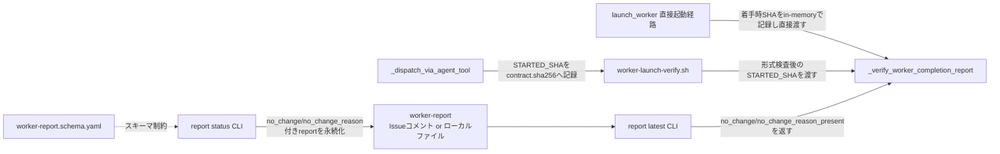
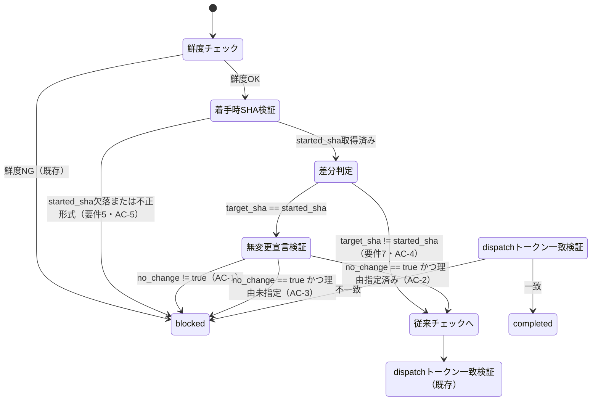

# DESIGN: worker完了確認のtarget_sha一致チェックが「変更ゼロのcompleted自己申告」を検出できない

- Issue: `ISSUE-644`
- 対応する SPEC: `SPEC.md`

## 要件 → 設計要素の対応表

| 要件 / AC-ID | 対応する設計要素 | 備考 |
|---|---|---|
| 要件1（着手時SHAの記録） | `_dispatch_via_agent_tool`のcontract.sha256への`STARTED_SHA`追記、`launch_worker`直接起動経路のin-memory記録 | 2つのdispatch経路それぞれで記録先が異なる |
| 要件2（schemaへの無変更宣言フィールド追加） | `worker-report.schema.yaml`の`no_change`/`no_change_reason`プロパティ追加 | 両方optional、後方互換 |
| 要件3・要件4（無変更完了は明示宣言＋理由必須） | `_verify_worker_completion_report`の判定ロジック拡張 | AC-1〜AC-3 |
| 要件5（着手時SHA欠落時は安全側） | `launch_worker`のSHA取得失敗時fail、`worker-launch-verify.sh`のSTARTED_SHA形式検査 | AC-5 |
| 要件6（既存の安全側チェックを後退させない） | 新判定ブロックは既存チェック（鮮度・dispatchトークン一致・contract整合性）の後段に追加するのみで既存分岐を変更しない | 全AC |
| 要件7（1コミット以上の通常completedは対象外） | `_verify_worker_completion_report`内、`reported_sha != started_sha`の場合は新判定ブロックを丸ごとskip | AC-4 |
| AC-1（無宣言でblocked） | `_verify_worker_completion_report`の無変更宣言検証ブロック | - |
| AC-2（宣言+理由でpass） | 同上 ＋ `report status`/`report latest` CLIの`no_change`/`no_change_reason_present`受け渡し | - |
| AC-3（宣言のみ理由空でblocked） | 同上 | - |
| AC-4（1コミット以上は従来通り、回帰なし） | 新判定ブロックのskip条件 | - |
| AC-5（着手時SHA欠落は安全側blocked） | `launch_worker`のfail-fast、`worker-launch-verify.sh`のSTARTED_SHA形式検査 | - |
| AC-6（既存reportとの後方互換） | schema上両フィールドoptional、`report latest`の未設定時デフォルト扱い | - |

## 責務・境界

### コンポーネント構成

- `worker-report.schema.yaml`: worker報告の固定スキーマ。`no_change`（boolean、既定false）と`no_change_reason`（string、自由記述）の2フィールドを追加する。両方optionalとし、`additionalProperties: false`配下へ正式に列挙する。
- `report status`（`src/commands/report.ts`の`status()`）: 既存8番目の位置引数`dispatch_token`に続けて、9番目`no_change`（`'true'`のときのみ真、それ以外は既定false）・10番目`no_change_reason`（自由記述文字列、省略可）を受理し、report objectへ組み込んでスキーマ検証後に永続化する。CLI自体は「理由が空でも`no_change=true`のreportを受理する」——理由の要否判定は完了確認側（`_verify_worker_completion_report`）の責務とし、report記録層と判定層を分離する。
- `report latest`（同ファイルの`latest()`）: 判定に必要な最小限の情報のみをKEY=VALUE形式で返す。`no_change_reason`の生テキストはそのまま返さず、`no_change_reason_present=true|false`（非空かどうかの真偽値）のみを返す。理由: 既存の出力形式は1フィールド1行のKEY=VALUEであり、自由記述の`no_change_reason`が改行を含むと後続のsedベースparse（`_verify_worker_completion_report`）を破壊しうる。機械判定に必要なのは「理由が具体的に指定されているか」という真偽値のみであり、理由の内容自体の妥当性判断はスコープ外（ゲートレビューの責務）である。理由の生テキストはIssue/PRコメント本文（GitHubモード）またはローカルreportファイル（ローカルモード）に既に構造化YAMLとして保存されており、人間・ゲートレビューはそちらを直接参照できるため情報は失われない。
- `launch_worker`（`.agent-skill-chain/adapters/claude.sh`、直接spawn経路）: worker起動直前に`git rev-parse HEAD`を1回呼び、着手時SHAをローカル変数へ記録する。このSHAは同一関数呼び出し内で`_verify_worker_completion_report`へ直接渡すため、ディスクへの永続化は不要（`worker_started_at`が同経路で既にin-memoryのみで扱われているのと同じ設計上の理由——プロセス境界をまたがない）。SHA取得自体が失敗した場合は既存の`_fail_blocked`経路へ即座に倒す。
- `_dispatch_via_agent_tool`（同ファイル、Agent tool dispatch経路）: `contract.sha256`（Issue #665で導入済みの監査証跡ファイル）へ、既存の`CONTRACT_SHA256`/`CONTRACT_LINES`/`DISPATCH_STARTED_AT`/`DISPATCH_TOKEN`と並べて`STARTED_SHA`（`git rev-parse HEAD`の値）を追記する。この経路は別プロセス（worker本体）の完了後、さらに別のBash呼び出し（`worker-launch-verify.sh`）で検証されるため、プロセス境界をまたぐ永続化が必須になる。
- `worker-launch-verify.sh`: 既存の`INTEGRITY_ERROR`検査チェーン（`CONTRACT_SHA256`一致・`DISPATCH_STARTED_AT`形式・`DISPATCH_TOKEN`非空）へ、`STARTED_SHA`の形式検査（40桁16進数）を追加する。不正・欠落時は既存と同じ`INTEGRITY_ERROR`経路経由で`_fail_blocked`（blocked + `human_escalation_requested: true`）へ倒れる。検査を通過した`STARTED_SHA`を`_verify_worker_completion_report`の新規引数として渡す。
- `_verify_worker_completion_report`（同ファイル）: 判定ロジックの本体。新規引数`started_sha`を追加する。既存の鮮度チェック・`target_sha`とcurrent HEADの一致チェックの直後、dispatchトークン一致チェックの直前に、次の判定ブロックを挿入する。
  1. `started_sha`が空、または40桁16進数の形式に一致しない場合 → fail（要件5、AC-5）。
  2. `reported_sha`（`target_sha`）が`started_sha`と一致しない場合 → このブロックを丸ごとskipし、以降は従来通りの判定のみ行う（要件7、AC-4）。
  3. `reported_sha == started_sha`の場合（dispatch開始後に1コミットも積まれていない）:
     - `report latest`が返す`no_change`が`true`でない → fail（AC-1）。
     - `no_change=true`だが`no_change_reason_present`が`false` → fail（AC-3）。
     - `no_change=true`かつ`no_change_reason_present=true` → このブロックはpassし、以降の既存チェック（dispatchトークン一致等）へ進む（AC-2）。
- contract指示文（`_dispatch_via_agent_tool`と`launch_worker`が組み立てる`worker_completion_dispatch`ブロック、および`_dispatch_via_agent_tool`がAgent tool呼び出し用に生成する`prompt:`文字列）: 既存の「空文字2つとdispatchトークンを追加する」形式の完了報告書式に続けて、「変更が無い場合のみ、9・10番目の引数として`true`と具体的な理由を追加する」という無変更完了報告の書式を追記する。

### 依存関係



循環依存は無い（永続化層 → CLI → 判定ロジックの一方向、およびdispatch経路 → 着手時SHA → 判定ロジックの一方向）。`_verify_worker_completion_report`は`report latest`の出力形式にのみ依存し、schemaやCLI引数の内部実装詳細には依存しない（責務分離）。

### 図示要否の判断

- 判断: `要`
- 根拠: 依存関係が3つ以上ある（`report status`→永続化層→`report latest`→`_verify_worker_completion_report`、および2つのdispatch経路→着手時SHA記録→`_verify_worker_completion_report`）。責務境界となるコンポーネントも6つ（schema、report status、report latest、launch_worker、`_dispatch_via_agent_tool`、`worker-launch-verify.sh`、`_verify_worker_completion_report`）で3つを超える。

## 状態遷移（`_verify_worker_completion_report`の新規判定ブロック）



状態遷移は3つ（着手時SHA検証・差分判定・無変更宣言検証）で図示基準に該当する。

## 関連ADR

```yaml
related_adrs:
  - id: ADR-0060
    relation: references
  - id: ADR-0061
    relation: references
```

ADR-0060（worker completion reportの契約とdispatch鮮度）、ADR-0061（dispatchトークン一致による機械的照合）は、本Issueが拡張する`_verify_worker_completion_report`の既存判定ロジックの前提を定めた決定であり、本Issueはこれらを置き換えずに新しい判定ブロックを追加する。本Issueの決定自体はADR-0062（`docs/adr/ADR-0062-worker-completion-nochange-detection-via-started-sha.md`、`status: proposed`）として別途新規作成する。

## 障害・ロールバック考慮

- 想定される失敗モード:
  - 着手時SHAの記録漏れ・不正形式（`git rev-parse`失敗、`contract.sha256`への追記漏れ等） → 要件5により意図的に安全側（blocked）へ倒れる。既存の`INTEGRITY_ERROR`検査チェーンと同じ経路を再利用するため、新規の失敗モードではなく既存パターンの拡張である。
  - `report status`/`report latest`CLIの位置引数を9・10番目まで数え間違えた既存呼び出し元（もしあれば）が誤動作する懸念 → 新規引数は既存8引数の**末尾へのoptional追加**のみであり、既存の8引数呼び出し（`... '' '' <dispatch_token>`）はそのまま無変更で動作する。
  - schemaの`additionalProperties: false`により、`no_change`/`no_change_reason`をプロパティ一覧へ追加し忘れると`report status`が発行するreport自体がスキーマ検証エラーで失敗する → 実装順序（PLAN.md変更単位1を最初に実施）で回避する。
- ロールバック手順: 本Issueの変更はスキーマへのoptionalフィールド追加・CLI位置引数の末尾追加・`claude.sh`内の新規判定ブロック追加のみであり、いずれも既存の必須フィールド・既存引数・既存分岐を変更しない。問題が発覚した場合は本Issueのcommitを`git revert`するだけで、新判定ブロックが丸ごと消え旧来の「`target_sha`一致のみ」の判定へ即座に戻る。ロールバック後もreportに残った`no_change`/`no_change_reason`フィールドは単に無視される（схема再検証も不要）。
- 影響を受ける既存機能: `launch_worker`（直接spawn経路）、`_dispatch_via_agent_tool`+`worker-launch-verify.sh`（Agent tool dispatch経路）、`report status`/`report latest` CLI、およびこれらが依拠する`worker-report.schema.yaml`。ゲートレビュアや進行役がworker reportを直接読む既存の運用（Issueコメント・ローカルreportファイル）は、新フィールドが存在しない過去のreportも引き続きそのまま読めるため影響を受けない。
