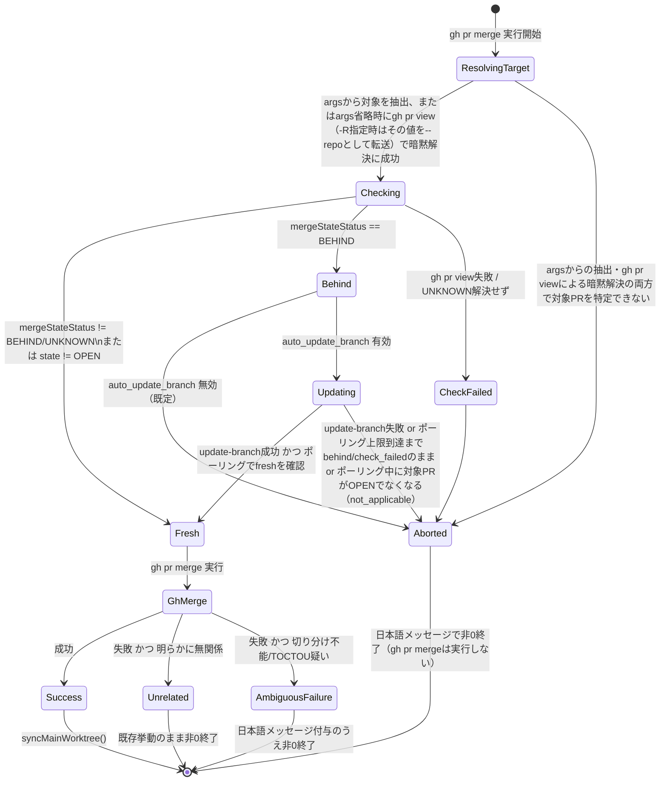

# DESIGN: pr merge が base branch の最新性を保証せず、--admin 常用運用が strict_required_status_checks_policy を事実上バイパスする

- Issue: `ISSUE-493`
- 対応する SPEC: `SPEC.md`

## 要件 → 設計要素の対応表

| 要件 / AC-ID | 対応する設計要素 | 備考 |
|---|---|---|
| 要件1・AC-1 | `PrFreshnessGuard.checkFreshness()`（`gh pr view --json mergeStateStatus,...` による behind 判定） | `mergeStateStatus === 'BEHIND'` を「最新でない」の判定根拠にする |
| 要件2・AC-1 | `merge()` の分岐（既定: 中断） + `config.merge.auto_update_branch`（新設・既定 false） | オプトインしない限り最新化を試みず中断する |
| 要件3・AC-2 | `PrFreshnessGuard.attemptUpdateBranch()`（`gh api -X PUT .../pulls/{n}/update-branch` + `checkFreshness()` の固定間隔ポーリングによる完了確認、上限 `UPDATE_BRANCH_POLL_MAX_ATTEMPTS` 回・合計最大30秒） | update-branch APIは非同期（202 Accepted）のためポーリング必須（ADR-0039 Decision 3）。API呼び出し自体の失敗、およびポーリング上限到達時点で `behind`/`check_failed` のままの場合はいずれも「完了できない」として中断扱い。ポーリング内で呼ぶ `checkFreshness()` はバックオフを行わない単発の問い合わせに限定し（`allowUnknownBackoff: false`）、合計待機時間が「合計最大30秒」の上限記述を超過しないようにする（バックオフは `merge()` が最初に呼ぶ `checkFreshness()` 呼び出し時のみ許容する） |
| 要件4・AC-3 | `merge()` 内でのチェック呼び出し位置（`gh pr merge` 実行前・引数内容を問わず必ず実行） | チェック処理（最新性確認・最新化・再確認のロジック自体）は `--admin` 等のマージ実行オプションの値には依存しないが、`resolveMergeTarget()` は対象PR番号／URL／ブランチを特定するために `args` を解析し、`args` に対象識別子が含まれない場合は `gh pr view --json number`（cwdの現在ブランチに紐づくPRを解決する `gh` CLI標準機構）へフォールバックする。`args` に `-R/--repo` が指定されていた場合、このフォールバック呼び出しはその値を `--repo` として引き継ぎ、`-R` が指す対象repoに対して暗黙解決を行う（`-R` 未指定時はcwdの既定repoのまま、従来どおり `--repo` を付与しない）。詳細は下記「`PrFreshnessGuard`」コンポーネント記述の `resolveMergeTarget()` を参照。この暗黙解決も `gh pr merge` 実行前に必ず完了させ、`--admin` 等のオプションの有無で解決経路を変えない |
| 要件5・AC-4 | `PrFreshnessGuard.checkFreshness()` のエラー境界（`gh pr view` 失敗・`mergeStateStatus` が `UNKNOWN` のまま解決しない場合の扱い）。加えて `PrFreshnessGuard.resolveMergeTarget()` が `args` からの抽出・`gh pr view` によるcwdベースの暗黙解決の両方を試みても対象PRを一意に特定できず `undefined` を返す場合も本要件5・AC-4の適用範囲に含める（トレーサビリティの根拠は本表直下の注記を参照） | いずれも「チェック失敗」として中断する |
| 要件6・AC-5 | `merge()` の正常系分岐（behind でない場合は既存の `gh(['pr','merge',...args])` 呼び出し + `syncMainWorktree()` をそのまま実行） | `gh(['pr','merge',...args])` 自体は本Issue対応前と同一コードパス・同一引数で呼ぶ。`resolveMergeTarget()` の `gh pr view` フォールバックは対象PR特定のためだけに使う読み取り専用の追加呼び出しであり、`args`・`gh pr merge` 呼び出し自体は変更しない。これにより、対象識別子を省略したまま `gh pr merge --admin` をPRブランチ上で実行するという本Issueの前提運用（SPEC.mdの目的・背景節が明記する実運用）でも、cwdに紐づくPRがfreshであれば本Issue対応前と同一の結果（マージ成立）になり回帰しない |
| 要件7・AC-6・AC-7 | `MergeFailureClassifier.classifyMergeFailure(stderr: string)`（`pr-freshness.ts` 内の関数） | 既知の「明らかに無関係」な失敗のみ許可 list で除外し、それ以外は安全側で要件7側として扱う |

### `resolveMergeTarget()` が `undefined` を返す場合のトレーサビリティ注記

SPEC.mdのAC-1〜AC-7は、いずれも「対象PR番号とオプション引数を伴う」実行を前提としており、対象PR番号自体を一意に特定できないケースを直接扱うACは存在しない。一方で `gh pr merge` 自体は、対象（number/url/branch）が引数で省略された場合、現在チェックアウト中のgitブランチから対象PRを暗黙解決する機能を標準で持つ。SPEC.mdの目的・背景節が明記する実運用（PRブランチ上でPR番号を省略したまま `gh pr merge --admin` を実行するパターン）はまさにこの暗黙解決に依存しており、`resolveMergeTarget()` を `args` の解析のみで実装すると、この典型的な運用で常に `undefined` を返して要件6・AC-5が禁じる回帰を生む。したがって `resolveMergeTarget()` は、`args` から対象識別子を抽出できない場合、`gh pr view --json number` を `cwd=root` で呼び出し、`gh pr merge` と同じ「現在のブランチに紐づくPRを暗黙解決する」処理を明示的に行うフォールバックを持つ。`args` からの抽出・`gh pr view` によるcwdベースの暗黙解決の両方を試みても対象PRを一意に特定できない場合（`gh pr view` が非0終了する場合を含む）に限り、要件5が定める「最新性の確認処理自体が失敗した場合」の一種として扱える。要件5の「確認処理自体が失敗した場合」とは、`checkFreshness()` が実行できない・完了できない状況全般を指すところ、`args`からの抽出・`gh pr view`による暗黙解決のいずれによっても確認対象となるPRそのものを一意に特定できない場合は、確認処理（`checkFreshness()`）を開始するための前提入力（対象PRの識別子）自体が欠如しており、確認処理を実行できないという点で、`gh pr view` 失敗や `mergeStateStatus` が `UNKNOWN` のまま解決しない場合と同じ「確認処理自体が失敗した場合」に該当する。したがって `resolveMergeTarget()` が `undefined` を返すケースは、SPEC.mdの新たなACを追加することなく、要件5・AC-4の適用範囲内として扱う設計判断とする。`merge()` は `resolveMergeTarget()` が `undefined` を返した場合、`checkFreshness()` を呼ばずに要件5・AC-4と同一の中断処理（終了コード1以上・日本語エラーメッセージ、`gh pr merge` は実行しない）へ進む。

### 確認通過後のベストエフォート事後検知とSPEC.mdトレーサビリティに関する判断

下記「障害・ロールバック考慮」節で扱う「確認通過後にbaseが進行し `gh pr merge --admin` が黙示的に成立するケース」への対策として、`gh pr merge` 成功後に実行するベストエフォートの事後検知（`preMergeBaseSha` と事後取得した base SHA の比較・不一致時の警告出力）を追加するが、これはSPEC.mdの新たなAC追加を要しない設計判断とする。根拠は次の通り。

- SPEC.mdの「要求」節はすでに「ここでいう「保証」は、確認・最新化・再確認・**実行結果検知**の各段階を組み合わせたベストエフォート的な多段防御を指す」と明記しており、「目的・背景」節も同様に「多段防御（確認→最新化→再確認、および**実行結果の安全側検知**）」と述べている。事後検知はこの既承認の「実行結果検知」段階を、確認通過後にマージが黙示的に成立する具体的な残存リスクに対して具体化した設計要素であり、SPEC.mdの承認済み内容と矛盾しない。
- 一方、要件7・AC-7の条文は「確認通過後の `gh pr merge` 自体がGitHub側で失敗した場合」に限定して「終了コード1以上・日本語エラーメッセージで停止」という強制力のある挙動を要求しており、これは `gh pr merge` が成功して既に取り消せないマージが成立した後にベストエフォートで警告のみを出す（検知できなければ警告を出さず正常終了し、終了コードは変えない）本設計要素とは性質が異なる。したがって本事後検知は要件7・AC-7の条文の対象には含めず、要件7・AC-7の検証（既存の自動テスト）に新たな合否基準を追加しない。
- 本事後検知はexit codeやAC-1〜AC-7いずれの合否判定にも影響を与えない付加的な観測性強化（ベストエフォート、検知不能時は無警告で正常終了）であり、I7（仕様⇔検証の追跡）が要求する「AC-IDと検証方法の対応」を新設する必要がある強制力のある保証を追加するものではない。そのため本設計要素にAC-IDを割り当てず、SPEC.mdの改訂・spec-gate再通過は不要と判断する。
- 将来、この事後検知を「必ず検知できること」「検知できない場合はエラー終了すること」等の強制力のある保証へ格上げする場合は、その時点でSPEC.mdの新規AC追加および spec-gate 再通過が必要になる。本Issueのスコープでは強制力のある保証としないため、その改訂は行わない。

## 責務・境界

### コンポーネント構成

- `PrFreshnessGuard`（新設 `src/lib/pr-freshness.ts`）: 対象PRのhead/base最新性判定・オプトイン時の最新化試行のみを担う。`gh pr view`／`gh api` 以外の外部呼び出しを持たない。
  - `resolveMergeTarget(args: string[], root: string): string | undefined` — まず `gh pr merge` の `args` から対象PR（番号／URL／ブランチ）を、`gh pr merge --help` が定義する値取り型オプション（`-A/--author-email`・`-b/--body`・`-F/--body-file`・`-t/--subject`・`--match-head-commit`・`-R/--repo`〔`gh` 共通の inherited flag〕）の次要素を除外したうえで抽出する。この走査時、`args` に `-R`/`--repo` が含まれていれば（値取り型オプションとして次要素を識別子候補から除外するのと同じ走査の中で）その値をローカル変数 `repoOverride` として保持する（`-R`/`--repo` が含まれない場合 `repoOverride` は未設定のまま）。`args` から対象識別子が見つからない場合、`gh pr merge` 自体が対象省略時に現在のgitブランチから対象PRを暗黙解決する標準動作と同じ状況にあるため、`gh pr view --json number` を `cwd=root` で1回呼び出し、現在チェックアウト中のブランチに紐づくPR番号を暗黙解決するフォールバックを行う（`checkFreshness()` とは別の、対象特定専用の呼び出し）。このフォールバック呼び出し時、`repoOverride` が設定されていれば `--repo <repoOverride>` を付与して同一呼び出しへ転送する（`gh pr view --repo <owner>/<repo> --json number` の形になる）。これにより、`-R` が指す対象repoと、cwdの既定repo（通常は `origin` が指すrepo）が異なる場合でも、フォールバックの暗黙解決は `-R` が指す実際のマージ対象repoに対して行われ、`checkFreshness()` が検証するPRと実際に `gh pr merge` がマージするPRの食い違いを防ぐ（`repoOverride` 未設定時は従来どおり `--repo` を付与せずcwdの既定repoのまま解決する）。`args` からの抽出・`gh pr view` フォールバックのいずれによっても対象を特定できない場合（`gh pr view` が非0終了する場合を含む）にのみ `undefined` を返し、呼び出し元（`merge()`）は要件5・AC-4の中断処理として扱う（対象PRを一意に特定できないため確認処理自体を開始できない場合であり、なぜこれが要件5・AC-4の範囲内と言えるかの根拠は「要件7・AC-6・AC-7」行直下の「`resolveMergeTarget()` が `undefined` を返す場合のトレーサビリティ注記」を参照）。
  - `checkFreshness(root, target, options?: { allowUnknownBackoff?: boolean }): FreshnessResult` — `gh pr view <target> --json number,state,baseRefName,headRefName,mergeStateStatus,baseRefOid` を呼ぶ。`state !== 'OPEN'` なら `status: 'not_applicable'`（後続の `gh pr merge` に既存挙動のまま委ねる。AC-6が扱う「明らかに無関係な失敗」入口）。`options.allowUnknownBackoff`（既定 `true`）が `true` の場合のみ、`mergeStateStatus === 'UNKNOWN'` の間は短い間隔（バックオフ付き、上限5回・合計待機を数秒程度に収める）で再問い合わせし、それでも解決しなければ `status: 'check_failed'`。`allowUnknownBackoff: false` を指定した呼び出し（用途は `attemptUpdateBranch()` 内部のポーリング、詳細は下記）ではバックオフを行わず、1回の問い合わせ結果のみで判定する（`UNKNOWN` であればそのまま `status: 'check_failed'` として返し、バックオフによる待機を追加しない）。`gh pr view` 自体が非0終了した場合も `status: 'check_failed'`。`mergeStateStatus === 'BEHIND'` なら `status: 'behind'`。それ以外は `status: 'fresh'`。`gh pr view` が成功した場合は取得できた `baseRefOid`（呼び出し時点のbase branchのコミットSHA）を `FreshnessResult.baseSha` として付加する（`gh pr view` 失敗時は `baseSha` を付与しない）。この `baseSha` は最新性判定自体（`behind`/`fresh`の判定基準）には使わず、後述「確認通過後のベストエフォート事後検知」でのみ使用する。
  - `attemptUpdateBranch(root, prNumber): UpdateResult`（`UpdateResult` は `{ status: 'updated' | 'failed' | 'not_applicable'; baseSha?: string }`。`baseSha` フィールドは `FreshnessResult.baseSha` と同じ意味・型を持ち、`status: 'updated'` の場合にのみ、後述のポーリングが `fresh` へ到達した時点の `checkFreshness()` 呼び出し結果から引き継いで設定する） — `gh api -X PUT repos/:owner/:repo/pulls/{prNumber}/update-branch` を呼ぶ。この呼び出し自体が非0終了（コンフリクト等）した場合は即 `status: 'failed'`（`baseSha` は付与しない）。update-branch API は非同期実行（202 Accepted）であり、GitHub側の反映完了は呼び出し直後には確定しないため（ADR-0039 Decision 3）、API呼び出し成功後は `checkFreshness()` を固定間隔でポーリングして完了を確認する: 定数 `UPDATE_BRANCH_POLL_INTERVAL_MS = 3000`（3秒間隔）・`UPDATE_BRANCH_POLL_MAX_ATTEMPTS = 10`（最大10回、合計最大30秒）を用い、各回の問い合わせは `checkFreshness(root, target, { allowUnknownBackoff: false })` を呼び、その戻り値（`FreshnessResult`）の `status` が `'fresh'` になった時点で、当該 `FreshnessResult.baseSha`（取得できていれば）を `UpdateResult.baseSha` へそのまま引き継いだうえで即座に `status: 'updated'` を返す（`FreshnessResult.baseSha` が無い場合は `UpdateResult.baseSha` も付与しない）。ポーリング内の各問い合わせを `allowUnknownBackoff: false` に限定するのは、`checkFreshness()` 自身の `UNKNOWN` バックオフ（最大5回・数秒程度）を10回のポーリングそれぞれに重ねてしまうと、合計待機時間が「合計最大30秒」という時間境界の記述と矛盾しうるためであり、バックオフは `merge()` が最初に呼ぶ `checkFreshness()`（`allowUnknownBackoff` 既定 `true`）の呼び出し時のみに許容し、`attemptUpdateBranch()` 内部のポーリングでは行わない。ポーリング中に得られる `status` が `'behind'`・`'check_failed'`（1回の問い合わせで `UNKNOWN` のままだった場合を含む）のいずれであっても「まだ反映されていない」とみなして次のポーリング間隔まで待機し再問い合わせを続ける（`UNKNOWN` 系列に限定しない）。一方、ポーリング中に得られる `status` が `'not_applicable'`（対象PRの `state` がポーリング中に `OPEN` でなくなった場合。例: 外部要因によりポーリング中に対象PRがクローズ・マージされた）の場合は「まだ反映されていない」とはみなさず、残りのポーリング回数を消費せずに直ちにポーリングを打ち切り `status: 'not_applicable'`（`baseSha` は付与しない）を返す。`UPDATE_BRANCH_POLL_MAX_ATTEMPTS` 回に達しても `fresh` にならない場合は `status: 'failed'`（`baseSha` は付与しない）を返し、呼び出し元（`merge()`）が要件3/AC-2の中断処理（日本語エラーメッセージ付きで非0終了、`gh pr merge` は実行しない）へ委ねる。`status: 'not_applicable'` を受け取った呼び出し元（`merge()`）は、要件3が定める「最新化がコンフリクト等により完了できないときは中断する」に準じて中断する（非0終了・`gh pr merge` は実行しない）が、原因が「反映されない（`failed`）」ではなく「対象PRが処理中に無くなった」ことである点を利用者が区別できるよう、通常の最新化失敗メッセージとは異なる「対象PRが処理中にクローズ・マージされたため最新化を中断しました」という趣旨の日本語メッセージを出力する。
  - `MergeFailureClassifier.classifyMergeFailure(stderr: string): 'unrelated' | 'ambiguous'` — 既知の「最新性と明らかに無関係」なパターン（例: 権限不足・PRが既にマージ済み・既にクローズ済みを示す文言）にのみ一致した場合 `unrelated` を返し、それ以外は安全側で `ambiguous` を返す。
- `pr merge` コマンド（既存 `src/commands/pr.ts` の `merge()`）: `merge.autonomous` 確認・`PrFreshnessGuard` の呼び出し・`gh pr merge` 実行・`MergeFailureClassifier` によるエラーメッセージ補完・`syncMainWorktree()` の呼び出し順序を制御する調整役。各処理自体のロジックは自身に持たない。
  - 窓の最小化（設計上の制約）: `status: 'fresh'` が確定した時点（初回 `checkFreshness()` が直接 `fresh` を返した場合、または `attemptUpdateBranch()` のポーリングが `fresh` に到達した場合のいずれか）から `gh(['pr','merge',...args])` を呼び出すまでの間に、追加のネットワークI/O・API呼び出し・その他の待機処理を一切挟まない。`preMergeBaseSha` の取得元は到達経路に応じて次の2通りのいずれかであり、`merge()` はどちらの経路でも一貫して `preMergeBaseSha` をローカル変数へ保持できる: (1) 初回 `checkFreshness()` が直接 `fresh` を返した場合は、その戻り値 `FreshnessResult.baseSha`（存在する場合）を用いる。(2) `attemptUpdateBranch()` のポーリングが `fresh` に到達した場合は、`attemptUpdateBranch()` の戻り値 `UpdateResult.baseSha`（`fresh` 到達時点の `checkFreshness()` 呼び出し結果から引き継がれた値。存在する場合）を用いる。いずれの経路でも、値を保持するだけでそれ以外の処理は行わずただちに `gh(['pr','merge',...args])` を呼ぶ。この制約は、確認からマージ実行までの間隔を実装が合理的に可能な範囲で最小化するというSPEC.mdの未決事項節の要求を、実装上の制約として明示的に固定するものであり、この呼び出し順序ですでにそのような実装フローになっている（`fresh` 判定と `gh pr merge` 呼び出しの間に他の処理を置かない）ことを設計要求として文書化する。
  - 確認通過後のベストエフォート事後検知: `gh pr merge` が成功した場合、`syncMainWorktree()` を呼ぶ前後いずれかのタイミングで、`preMergeBaseSha` が取得できていれば `gh pr view <target> --json baseRefOid`（対象PRが `MERGED` になった後も参照可能な同一APIを再利用する読み取り専用の追加呼び出し）を1回だけ呼び、成功して得られた値（`postMergeBaseSha`）と `preMergeBaseSha` を比較する。両者が異なる場合、これは「確認通過後にbaseへ新しいコミットが追加された状態でマージが成立した形跡がある」ことを意味するため、マージ自体は取り消さず、標準エラー出力へ「マージは成立しましたが、確認時点以降にbaseへ新しいコミットが追加されていた可能性があります。念のため内容を確認してください。」という趣旨の日本語警告メッセージを出力する。`preMergeBaseSha` が未取得（`checkFreshness()` が `baseSha` を返せなかった）、または事後の `gh pr view` 呼び出し自体が失敗する場合は、比較に必要な情報が揃わないため警告を出さずに正常終了する（検知の欠如自体を新たな異常終了理由にしない）。この事後検知の実行有無・成否は終了コードに一切影響しない。この事後検知がSPEC.mdの新たなAC追加を要しない理由は「要件→設計要素の対応表」直下の「確認通過後のベストエフォート事後検知とSPEC.mdトレーサビリティに関する判断」を参照。
- `config`（`.agent-skill-chain/schemas/config.schema.yaml` + `src/lib/config.ts` + `.agent-skill-chain/config/agent-skill-chain.yaml`）: 新設の任意フィールド `merge.auto_update_branch: boolean`（既定=未設定は false 相当、後方互換の任意項目として追加し既存設定ファイルを不正にしない）を保持する。migration定義（AGENTS.md「設定」節が定める設定項目追加手順の⑤に対応）: 本フィールドは既存YAMLに存在しなくても `false` 相当の既定値として扱われる後方互換な任意フィールドであり、既存設定ファイルへの自動書き換え・変換処理を伴うmigrationスクリプトは不要である。`schema_version`（`agent-skill-chain/config/v1`）は据え置く。据え置く理由は、既存フィールドの意味変更を一切伴わない加算のみのスキーマ変更（新設の任意項目追加）であり、既存の `schema_version: agent-skill-chain/config/v1` が前提とする互換性の範囲を超えないためである。
- GitHub API（外部システム）: `gh pr view --json mergeStateStatus` と `gh api -X PUT .../update-branch`。

### 依存関係

```text
merge()（src/commands/pr.ts） → PrFreshnessGuard.resolveMergeTarget/checkFreshness → gh pr view → GitHub API
merge()                        → PrFreshnessGuard.attemptUpdateBranch（config.merge.auto_update_branch有効時のみ）→ gh api update-branch → GitHub API
merge()                        → gh pr merge（既存、透過）→ GitHub API
merge()                        → MergeFailureClassifier.classifyMergeFailure（gh pr merge失敗時のみ）
merge()                        → syncMainWorktree()（既存、gh pr merge成功時のみ）
```

循環依存は無い（`PrFreshnessGuard` は `merge()` に依存しない一方向）。責務は「最新性判定・最新化」（`PrFreshnessGuard`）と「呼び出し順序の制御・既存の自動化確認/同期」（`merge()`）に分離しており、単一コンポーネントへの責務集中は無い。

### 図示要否の判断

- 判断: `要`
- 根拠: 依存関係が3つ以上（`PrFreshnessGuard`・`gh pr merge`・`MergeFailureClassifier`・`syncMainWorktree`・GitHub API）、かつ `mergeStateStatus` の状態遷移が `UNKNOWN → {fresh|behind|check_failed}` → （オプトイン時）`behind → {updated|failed}` と2つ以上あるため。



## 関連ADR

```yaml
related_adrs:
  - id: ADR-0039
    relation: adopts
```

## 障害・ロールバック考慮

- 想定される失敗モード:
  - `args` に対象識別子が含まれず、かつ `gh pr view` によるcwdベースの暗黙解決も失敗する（現在のブランチに紐づくPRが存在しない等、AC-4で中断）。
  - `gh pr view` がネットワーク断・権限不足で失敗する（AC-4で中断）。
  - `mergeStateStatus` が `UNKNOWN` のまま解決しない（GitHub側の計算未完了、AC-4で中断）。
  - `auto_update_branch` 有効時に `update-branch` API がコンフリクトで失敗する（AC-2で中断）。
  - `auto_update_branch` 有効時に `update-branch` API 自体は成功したが、GitHub側の反映が `UPDATE_BRANCH_POLL_MAX_ATTEMPTS` 回のポーリング（合計最大30秒）を超えて完了しない（コンフリクトではなく単なる反映遅延の可能性を含め、区別せず安全側でAC-2の中断扱いにする）。
  - `auto_update_branch` 有効時、ポーリング中に対象PRが外部要因（別セッションによる手動マージ・クローズ等）で `OPEN` でなくなり、`checkFreshness()` が `status: 'not_applicable'` を返す（AC-2に準じて中断するが、通常の最新化失敗と区別できる専用の日本語メッセージを出す。詳細は「責務・境界」節の `attemptUpdateBranch()` 記述を参照）。
  - チェック通過後、`gh pr merge` 実行までの間に別マージが成立し `gh pr merge` 自体が失敗する（AC-7、TOCTOU。マージが失敗するケース。詳細は下記「確認通過後にbaseが進行した場合の2つのTOCTOUサブケース」参照）。
  - チェック通過後、`gh pr merge` 実行までの間に別マージが成立した状態のまま、`--admin` によりGitHub側のup-to-date必須チェックがバイパスされて `gh pr merge --admin` がエラーにならずstaleなまま成立してしまう（TOCTOU。マージが黙って成立するケース。要件1・AC-1が要求する保証をチェック時点でのみ満たし実行時点では満たさない設計上の残存リスクであり、AC-7がカバーする「マージが失敗するケース」とは別種。詳細は下記「確認通過後にbaseが進行した場合の2つのTOCTOUサブケース」参照）。
  - `MergeFailureClassifier.classifyMergeFailure` が実際には無関係な失敗を `ambiguous` と誤分類する（安全側であり、余分な日本語メッセージが付くだけで既存の終了コード・`gh` 標準エラー出力自体は変更されないため実害は限定的）。
- ロールバック手順: 本Issue対応はすべて `src/commands/pr.ts`・新設 `src/lib/pr-freshness.ts`・config スキーマの追加項目に閉じる。問題が生じた場合は当該PRの変更を revert すれば `merge()` は本Issue対応前の「引数を透過して `gh pr merge` を呼ぶだけ」の挙動に戻る。`merge.auto_update_branch` は新設の任意項目のため、既存設定ファイルへの影響は無い。
- 影響を受ける既存機能: `agent-skill-chain pr merge` コマンドのみ。`pr create`・`syncMainWorktree()` 自体のロジック・`merge.autonomous` の既存確認処理は変更しない。

### 確認通過後にbaseが進行した場合の2つのTOCTOUサブケース

`checkFreshness()`（および `auto_update_branch` 有効時の `attemptUpdateBranch()` による再確認）が `fresh` と判定した後、`gh(['pr','merge',...args])` を実際に呼び出すまでの間隔でbaseが進んだ場合、GitHub APIには最新性確認とマージ実行を単一の不可分操作にする手段が無いため（SPEC.mdの目的・背景・未決事項節がすでに受容している残存リスク）、次の2つの異なる結果が起こり得る。両者は起こる現象が異なるため、設計上も区別して扱う。

1. **マージが失敗するケース（AC-7がカバー）**: `--admin` を指定していない、またはブランチ保護の必須チェックが `--admin` で無条件にバイパスされない状況では、base の進行により `gh pr merge` 自体がGitHub側でエラーとなり非0終了する。この場合は `MergeFailureClassifier.classifyMergeFailure()` の判定を経て要件7・AC-7の中断処理（終了コード1以上・日本語エラーメッセージ、`syncMainWorktree()` は呼ばない）へ進む。既存の失敗検知の仕組みでカバーされる。
2. **マージが黙って（エラーにならず）成立してしまうケース（AC-7ではカバーされない、本Issue自体が是正対象とする運用パターン）**: `--admin` は、GitHub側のブランチ保護が要求するup-to-date必須チェック（`strict_required_status_checks_policy` が守ろうとしている性質そのもの）を管理者権限でバイパスするための引数である。したがって、確認通過後にbaseが進んだ状態で `gh pr merge --admin` を実行すると、`--admin` のバイパス機能により、コンフリクト等の他の失敗要因が無い限り `gh pr merge` はエラーにならずstaleなまま成立してしまう可能性が高い。この場合 `gh pr merge` の終了コードは0であり、`MergeFailureClassifier` は呼ばれず、要件7・AC-7の中断処理は発生しない。これは要件1（AC-1）が要求する「最新でないPRはそのままマージされない」という保証を、チェック時点でのみ満たし実行時点では満たさない設計上の穴であり、単に窓を「常時」から「チェック〜マージ実行までの短い間隔」へ縮小しただけでは、この失敗モードの型（`--admin`による黙った成立）自体は解消されない。

サブケース2は技術的に完全排除できない（SPEC.mdの目的・背景・未決事項節が既に受容している残存リスクの一種であり、GitHub APIに確認とマージ実行を不可分にする手段が無いことに起因する）。本設計は、この残存リスクに対して次の2点で多段防御する。

- 窓の最小化（「責務・境界」節、`pr merge` コマンドの「窓の最小化（設計上の制約）」を参照）: `fresh` 判定から `gh pr merge` 実行までの間に不要な処理を一切挟まないことで、サブケース2が顕在化する時間窓自体を実装上可能な限り縮小する。
- ベストエフォートの事後検知（同節「確認通過後のベストエフォート事後検知」を参照）: サブケース2が顕在化してマージが黙って成立した場合でも、可能な範囲でこれを検知し警告する。検知できない場合は警告を出さずに正常終了する（ベストエフォートであり、この検知の欠如自体を新たな異常終了理由にはしない）。

### `--auto` 指定時の非同期マージとの関係（保証範囲の境界）

`gh pr merge` に `--auto`（GitHub側のauto-merge機能を有効化する引数）が含まれる場合、`gh(['pr','merge',...args])` の呼び出し自体はauto-mergeを有効化するだけであり、その時点で実マージが確定するわけではない。実マージは、必須チェックの通過等を待つGitHub側の非同期トリガーにより、呼び出し時点から任意の長さの時間が経過した後に発生する。

本設計が実装する `PrFreshnessGuard` による最新性確認・最新化・「窓の最小化」・確認通過後のベストエフォート事後検知は、いずれも `gh(['pr','merge',...args])` の**呼び出し時点**を対象とする。`args` に `--auto` が含まれる場合でも、`merge()` はこの呼び出し時点までの最新性確認・強制のみを行い、呼び出し成功（auto-merge有効化の受理）後にGitHub側で発生する非同期の実マージタイミングそのものを追跡・再チェックする処理は本設計に含まない。これは上記「確認通過後にbaseが進行した場合の2つのTOCTOUサブケース」（呼び出し時点から実マージまでの間隔が短いことを前提とした残存リスク）とは異なる、呼び出し時点から実マージ確定までの間隔が任意の長さになりうる、より広い同型の残存リスクである。

`--auto` 指定時、実マージ時点における最新性は `--auto` 機構自体（GitHub側の必須チェック再評価等。`--admin` が同時指定されていない限りブランチ保護は引き続き適用される）に委ねられ、本設計の保証範囲外とする。`--admin` と `--auto` が同時に指定された場合は、実マージ時点でブランチ保護がバイパスされたまま非同期マージが確定しうる既知の残存リスクがあり、この場合も本設計の保証範囲外である。この境界の宣言はSPEC.mdの「未決事項」節に対応し、既存のAC-1〜AC-7の合否判定・要件範囲を変更するものではない（ACの範囲変更ではなく、対応不能な既知の限界の宣言として扱う）。
