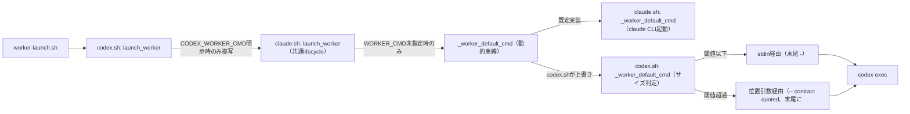

# DESIGN: codex CLI: stdinへ渡すpromptが約64KB付近でUTF-8マルチバイト文字の境界破損を起こし起動失敗する

- Issue: `ISSUE-462`
- 対応する SPEC: `SPEC.md`

## 前提・用語

- `role_contract`: `.agent-skill-chain/scripts/segment.ts`（`_asc_cli segment start`）が組み立てる、segment worker（spec/design/implementation/validation）への動作契約全文。`.agent-skill-chain/adapters/claude.sh` の `launch_worker` がこれを起動対象プロセスへ渡す。
- 共通 lifecycle: `.agent-skill-chain/adapters/claude.sh` が定義する `launch_worker` 関数本体。`.agent-skill-chain/adapters/codex.sh` はこれを `eval "$(declare -f launch_worker | sed '1s/^launch_worker /_codex_worker_lifecycle /')"` で名前を変えて取り込み、認証チェック（`_claude_auth_ok`）等の一部ヘルパー関数の動的束縛（同一プロセス内での関数再定義によるオーバーライド）を通じて Codex 固有の差分だけを適用する。本 Issue が導入する `_worker_default_cmd` も同じオーバーライド機構を使う。
- 境界破損: Codex CLI（`codex exec`）が stdin から prompt を読む際、実測でおおむね 65534 バイト付近でマルチバイト文字（日本語等）の UTF-8 妥当性検証に誤って失敗し `Failed to read prompt from stdin: input is not valid UTF-8` を出して即座に起動失敗する不具合（SPEC.md 参照、上流 Codex CLI 自体の不具合と推測される。上流修正は本 Issue のスコープ外）。

## 要件 → 設計要素の対応表

| 要件 / AC-ID | 対応する設計要素 | 備考 |
|---|---|---|
| AC-1（閾値超過時に代替起動経路へ切り替わる） | `codex.sh: _worker_default_cmd`（新規、`claude.sh` の同名関数を上書き） | サイズ判定・分岐 |
| AC-2（閾値以下では既存のstdin経由起動を維持、退行なし） | `codex.sh: _worker_default_cmd` の else 分岐／`claude.sh: _worker_default_cmd`（既定実装） | 既存の起動コマンド文字列をバイト単位で再構成 |
| AC-3（代替経路でもmodel・reasoning effort・sandbox設定が同一） | `codex.sh: _worker_default_cmd` 内の共通 `base` コマンド組み立て（`_codex_worker_model`/`_codex_worker_effort`/`_codex_worker_sandbox_opts` を分岐前に一度だけ評価） | 分岐後の相違は prompt の受け渡し方法のみ |
| AC-4（CODEX_WORKER_CMD/WORKER_CMD が閾値判定より優先） | `codex.sh: launch_worker`（簡素化）・`claude.sh: launch_worker` の `local worker_cmd="${WORKER_CMD:-}"` 判定（既存のまま） | `worker_cmd` が非空なら hook 自体を呼ばない |
| AC-5（手動回避策が不要になる、hybrid） | 上記全設計要素の組み合わせの結果 | 実際の Codex CLI に対する手動確認を要する（PLAN.md 変更単位5） |

## 責務・境界

### コンポーネント構成

- `worker-launch.sh` / `.agent-skill-chain/scripts/worker-launch.sh`: worker context 解決・アダプタ選択（既存、無変更）。
- `.agent-skill-chain/adapters/codex.sh: launch_worker`: `CODEX_WORKER_CMD`（テスト用完全上書き）が明示された場合のみそれを `WORKER_CMD` へ複写する薄いラッパーへ縮小する。role_contract のサイズ判定・起動コマンド組み立ての責務を持たない。
- `.agent-skill-chain/adapters/codex.sh: _worker_default_cmd`（新規、`claude.sh` 側の同名関数を上書き）: `WORKER_CMD`/`CODEX_WORKER_CMD` がいずれも未指定のときだけ呼ばれる。role_contract のバイトサイズが閾値を超えるかどうかで、Codex CLI へ prompt を渡す経路（stdin 末尾 `-` / 位置引数）を選ぶ。位置引数経路を選んだ場合は、組み立てるコマンド文字列の末尾に `</dev/null` を付与し、`codex exec` 呼び出し自体の stdin を明示的に断つ（決定3。呼び出し元 `bash -c "$worker_cmd" <"$prompt_file"` が渡す外側の fd0 をこの redirect が上書きするため、位置引数を渡しても Codex CLI が prompt_file の内容を `<stdin>` ブロックとして追加で読み込むことはない）。model・reasoning effort・sandbox opts の解決（既存の `_codex_worker_model`/`_codex_worker_effort`/`_codex_worker_sandbox_opts`、いずれも無変更）は分岐の前に一度だけ行い、両分岐で共有する。旧 `launch_worker` が保持していた「`ASC_WORKER_MODEL_TIER` はあるが `ASC_WORKER_MODEL` が届かない場合の防御チェック」と「`codex` コマンド不在時のフォールバック」もこの関数へ移す。
- `.agent-skill-chain/adapters/claude.sh: launch_worker`: 「`WORKER_CMD` 未指定時の既定起動コマンド組み立て」というインライン処理を `_worker_default_cmd` 関数呼び出しへ置き換える（呼び出しタイミング＝role_contract 取得後、認証チェック後という既存の順序は変えない）。Claude adapter 自身は `_worker_default_cmd` を上書きしないため、Claude Code CLI 起動時の既定動作（`--allowed-tools` 付き headless 起動）はビット単位で不変。
- `.agent-skill-chain/adapters/claude.sh: _worker_default_cmd`（新規、既定実装）: 引数 `<segment> <contract>` を受け取るが `contract` は使わない（Claude adapter は本不具合の対象外、SPEC.md「スコープ外」）。`claude` CLI が見つからない場合は非0を返し、呼び出し元が blocked へ倒す。
- Codex CLI（`codex exec`）: 外部実行系。stdin 経由（末尾 `-`）または位置引数 `[PROMPT]` 経由のいずれかで prompt を受理する（後者は上流の仕様として存在する前提。実機での成立確認は PLAN.md 変更単位5・AC-5 hybrid 検証で行う）。

### 依存関係



- 依存方向は一方向（`worker-launch.sh` → adapter → hook → 実行系）であり、`_worker_default_cmd` の既定実装（`claude.sh`）と上書き実装（`codex.sh`）の間に循環依存は無い（`codex.sh` は `claude.sh` を `source` するが逆はない、既存構造のまま）。
- `claude.sh` は Codex 固有の知識（stdin 境界破損・閾値・位置引数経路）を一切持たない。Codex 固有ロジックは `codex.sh` 内の `_worker_default_cmd` 上書きにのみ存在する（ファイル冒頭コメント「Codex 固有の認証、sandbox、model、reasoning effort だけを差し替える」という既存の責務境界方針と整合させる）。

### 図示要否の判断

- 判断: `要`
- 根拠: 依存関係が3つ以上（`worker-launch.sh`・codex.sh・claude.sh（共通lifecycle）・hook・Codex CLI）かつ状態遷移（stdin経路 / 位置引数経路の2分岐）を含むため、テンプレート基準に該当する。

## 決定事項（設計判断）

### 決定1: サイズ判定と起動コマンド組み立てを「既定コマンド組み立てフック」として抽出し、codex.sh がオーバーライドする

**採用案**: `claude.sh` の `launch_worker` 内で行っていた「`WORKER_CMD` 未指定時の既定起動コマンド組み立て」処理を `_worker_default_cmd <segment> <contract>` という1関数へ切り出す。`claude.sh` はこの関数の既定実装（claude CLI 起動、既存動作のまま）を提供し、`codex.sh` は既に確立されている動的束縛パターン（`_claude_auth_ok` の再定義と同型。`codex.sh` は `claude.sh` を `source` した後に同名関数を再定義することで、`eval` で取り込んだ共通 lifecycle のコピーからの呼び出し先を実行時に差し替える）を使って、この関数だけを Codex 用に上書きする。

**却下案A（stdin経路を廃止し常に位置引数経由に統一する）**: 却下理由は次の3点。(1) SPEC.md 要件2（閾値以下は既存のstdin経由起動を維持し退行させない）に反する。(2) 閾値以下の小さな role_contract でも常に argv へ埋め込む経路に切り替えると、既存の起動コマンド文字列（バイト列）が変わり、既存の自動テスト（`test/integration/worker-adapters.test.ts` の model/effort/sandbox opts 検証）が前提にしているコマンド形を壊すリスクを常に負う。(3) 非常に長い role_contract で ARG_MAX（Linux では通常 2MB 前後）に達するリスクを、小さい contract でも一律に負わせることになり不要。

**却下案B（TypeScript 側の worker context 解決で事前にサイズ判定しコマンド文字列を生成する）**: 却下理由は、role_contract の内容確定は `_asc_cli segment start`（bash アダプタ内から呼ばれる）実行後にしか分からず、TypeScript 側（`worker-launch.sh` 呼び出し前）へこの判断を移すには contract 本文を受け渡す新しい経路（追加のファイル書き出し等）を要し変更範囲が不必要に広がる。また、起動コマンド組み立てロジックの正本が bash（adapter層）と TypeScript（CLI層）に分裂し、AGENTS.md I6（正準モデル・単一正本の原則の精神）に反する。

**却下案C（claude.sh 側に直接 Codex 固有のサイズ判定ロジックを書く）**: 却下理由は、`claude.sh` はベンダー中立の共通 lifecycle であり、Codex 固有の stdin 実装バグの知識を混入させると責務境界（ファイル冒頭コメントが明記する「Codex 固有の認証、sandbox、model、reasoning effort だけを差し替える」という既存の役割分担）に反する。将来 Claude CLI 側で同種の問題が起きても、Codex 用の閾値・分岐ロジックが誤って共有されるリスクがある。

### 決定2: 閾値はハードコードせず環境変数 `CODEX_STDIN_SAFE_THRESHOLD_BYTES`（既定 32768 バイト）で上書き可能にする

**採用案**: 閾値は `.agent-skill-chain/config/agent-skill-chain.yaml` へ項目追加せず、`CODEX_IMPLEMENTATION_MODEL` 等と同型の「個別上書き環境変数」として `codex.sh` 内に既定値 32768（32KiB）を持つ。実測された破損境界（65534バイト付近、64KiB=65536に極めて近い）に対し、これはちょうど半分であり、Codex CLI 側の未公開のチャンク境界実装の詳細（正確な境界位置・アラインメント）が変動しても十分な安全マージンを持つ。自動テスト（AC-1/AC-2）は実際に32KiB超のペイロードを用意せずとも、この環境変数を小さい値へ上書きすることで分岐を決定的に検証できる（SPEC.md 要件5）。

**却下案（config スキーマへ項目追加する）**: 却下理由は、AGENTS.md「設定」節が定める項目追加手順（①ハードコード不可の理由→②プロジェクト単位で変わる必要性→③スキーマ更新→④既定値定義→⑤migration定義→⑥必要ならADR）に対し、本値は上流 Codex CLI 側の未公開の実装詳細に対する技術的回避策のマージンであり、プロジェクトごとに恒常的に変える性質の値ではない。既存の `CODEX_*` 系「個別上書き環境変数」と同じ扱い（テスト・一時的な微調整のための上書き口）で要件を満たせるため、スキーマ変更のコストに見合わない。

### 決定3: 位置引数経由では role_contract をシェルエスケープ済みの単一 argv 要素として埋め込み、かつコマンド文字列内で `codex exec` 呼び出し自体の stdin を明示的に `/dev/null` へ redirect する

**採用案**: `codex.sh: _worker_default_cmd` は、閾値超過時に `printf -v quoted_contract '%q' "$contract"` で role_contract をシェルエスケープし、`codex exec ... -- "$quoted_contract" </dev/null` の形（`-`（stdin指示）の代わりに `-- <位置引数>` を渡し、かつコマンド文字列の末尾に `</dev/null` を付与）でコマンド文字列を組み立てる。

**背景（設計判断の根拠）**: 当初案は「位置引数 `[PROMPT]` を渡せば Codex CLI は stdin を読まない」という前提に立っていたが、implementation segment での実機検証により、Codex CLI（`codex exec`）は位置引数が与えられていても、stdin が別ソース（パイプ・ファイルリダイレクト等）へ接続されたままだとそれを追加で `<stdin>` ブロックとして読み込んでしまう（位置引数だけを見て stdin を無視するわけではない）ことが判明した。そのため、当初案のまま `bash -c "$worker_cmd" <"$prompt_file"` の外側 redirect を変更せずに位置引数だけを渡すと、role_contract 全文が依然として stdin 経由でも読み込まれ、境界破損の影響を受け続けてしまい要件1を満たさない。

呼び出し元（`claude.sh: launch_worker`）が行う `bash -c "$worker_cmd" <"$prompt_file"` というプロセス起動自体（外側の fd0 を prompt_file へ redirect する部分）は変更しない。その代わり、bash では `bash -c` へ渡すコマンド文字列内で個別コマンドに付与した redirect が、外側から継承した fd0 を当該コマンドの実行時にのみ上書きする（`bash -c 'cat </dev/null' <file` は `file` の内容を読まない、という挙動で確認済み）。この性質を利用し、位置引数経由の分岐でだけ `codex exec` 呼び出し自体に `</dev/null` を付与することで、呼び出し元（claude.sh）を変更せず、Codex 固有ロジックを `codex.sh` 内に閉じたまま（決定1の責務境界を保ったまま）、当該 `codex exec` プロセスへの stdin 供給を確実に断つ。stdin 経由分岐（閾値以下）は従来どおり `-` を渡し `</dev/null` を付与しないため、AC-2（退行なし）は影響を受けない。

**却下案（呼び出し元 `claude.sh: launch_worker` 側で redirect 先を動的に切り替える）**: 却下理由は、redirect 先の切り替え判断（閾値超過か否か）は role_contract サイズに依存する Codex 固有の判断であり、これを共通 lifecycle（`claude.sh`）側へ持ち込むと、決定1で確立した責務境界（Codex 固有ロジックは `codex.sh` 内の `_worker_default_cmd` 上書きにのみ存在する）に反する。`_worker_default_cmd` が返すコマンド文字列自体に redirect を埋め込むことで、呼び出し元を変更せずに責務境界を保ったまま実現できる。

**却下案（`$(cat)` でその場の stdin から読み取り閾値判定してから再度パイプする、worker_cmd 内で完結させる案）**: 却下理由は、bash のコマンド置換 `$(...)` は末尾の改行をすべて除去する仕様のため、role_contract の末尾に空行が含まれる場合にバイト列が変化し、AC-2（既存のstdin経由起動の完全な退行なし）を壊すリスクがある。`%q` によるエスケープはシェル変数の内容をそのまま再構成する（末尾改行を含め欠落・改変が無い）ため、この問題が生じない。

## 関連ADR

```yaml
related_adrs:
  - id: ADR-0015
    relation: references
  - id: ADR-0016-codex-exec-unsupported-flag-as-config-override
    relation: references
```

- `ADR-0015`（segment worker adapter・model tier config）: `_codex_worker_model`/`_codex_worker_effort` の解決順序を定義しており、本 Issue はこれを分岐前の共通評価として再利用するのみで変更しない。
- `ADR-0016-codex-exec-unsupported-flag-as-config-override`: Codex CLI の未サポートフラグをコマンド組み立てレベルで回避する既存の前例であり、本 Issue（`_worker_default_cmd` オーバーライドによる Codex CLI 起動経路の回避策追加）と同種の「アダプタ層での Codex CLI 制約回避」という設計方針を共有する。

## 障害・ロールバック考慮

- 想定される失敗モード1: `_worker_default_cmd`（codex.sh 上書き）が非0を返す場合（`codex` コマンド不在、`ASC_WORKER_MODEL_TIER` 防御チェック抵触、`CODEX_STDIN_SAFE_THRESHOLD_BYTES` が正の整数でない等）。`claude.sh: launch_worker` は既存の `_fail_blocked`（blocked報告 + lease解放 + 非0非3で返す、I8）へ倒す。lease は既に取得済み・contract は既に取得済みの時点での失敗であり、この順序・fail-safe動作は既存の「起動後のフェイルセーフ」パスと同一（新規の失敗モードを追加しない）。
- 想定される失敗モード2: 位置引数経由で埋め込んだ role_contract が ARG_MAX（Linux では通常 2MB 前後）を超え `bash -c` 自体の起動が失敗する。この場合 `wait "$worker_pid"; rc=$?` が非0を返し、既存の「worker起動が失敗またはtimeoutしました」blocked フェイルセーフへ倒れる（サイレントパスしない、I8）。role_contract は通常数十〜数百KB程度であり、ARG_MAX に対し十分な余裕がある想定だが、将来 role_contract が極端に肥大化した場合の対処（分割送信等）は本 Issue のスコープ外とし、実際に発生した場合は別 Issue として扱う。
- 想定される失敗モード3: 位置引数経由で Codex CLI が想定どおり動作しない（例: `--` 以降の位置引数を `[PROMPT]` として受理しない）。なお「位置引数を渡していても stdin が接続されたままだと追加で `<stdin>` ブロックとして読み込んでしまう」という当初未知だった挙動は、implementation segment の実機検証で判明済みであり、決定3（コマンド文字列末尾への `</dev/null` 付与によるstdin明示的無効化）で対応済みである。この対応後もなお未知の非互換（例: `--` 以降を `[PROMPT]` として受理しない）が残る場合は、AC-5（hybrid 検証、PLAN.md 変更単位5）で実機確認時に判明し、DESIGN.md の決定3（コマンド形）を再検討したうえで design-gate を再通過させる（AGENTS.md「ゲートの継承・無効化」）。
- ロールバック手順: 本 Issue の変更は `codex.sh`/`claude.sh` の関数境界の追加・置き換えのみであり、`CODEX_WORKER_CMD` による完全上書き経路（AC-4、既存かつ本 Issue でも維持）を使えば新規ロジックを経由せず従来のコマンドをそのまま指定できる。PR を revert すれば `_worker_default_cmd` 抽出前の状態（stdin経由のみ）に完全に戻る。
- 影響を受ける既存機能: `.agent-skill-chain/adapters/codex.sh`・`.agent-skill-chain/adapters/claude.sh` の `launch_worker` 経由のセグメントワーカー起動（spec/design/implementation/validation 全セグメント、SPEC.md 要件1）。`launch_gate_reviewer`（ゲートレビュア起動）は本 Issue のスコープ外（SPEC.md「スコープ外」）であり変更しない。
