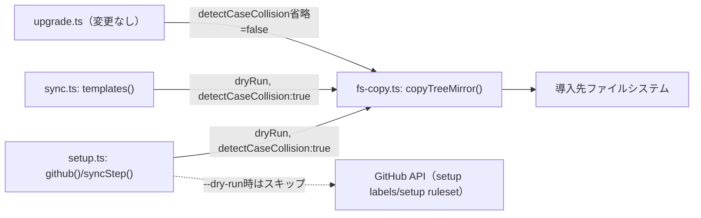

<!--
正本: AGENTS.md §4セグメント・4ゲート
このファイルは Issue 毎に複製して使う雛形である（セグメント: design、成果物: DESIGN.md（PLAN.md は別ファイル）、ゲート: design-gate）。
-->

# DESIGN: setup github / sync templates に --dry-run と上書き保護が無く、大文字小文字を区別しないファイルシステムでカスタムPRテンプレート等を無条件上書きする恐れがある

- Issue: `ISSUE-538`
- 対応する SPEC: `SPEC.md`

## 要件 → 設計要素の対応表

| 要件 / AC-ID | 対応する設計要素 | 備考 |
|---|---|---|
| `AC-1`（`setup github --dry-run`） | `src/commands/setup.ts` の `github()`/`githubBundle()`/`syncStep()` | `--dry-run` 解析、`copyTreeMirror` への `dryRun: true` 伝播、`setup labels`/`setup ruleset` のスキップ |
| `AC-2`（`sync templates --dry-run`） | `src/commands/sync.ts` の `templates()` | `--dry-run` 解析、3件の `copyTreeMirror` 呼び出しへの `dryRun: true` 伝播 |
| `AC-3`（`--help` 文言） | `setup.ts` の `GITHUB_USAGE`、`sync.ts` の `USAGE` | 既存の `init.ts`/`upgrade.ts` の `--dry-run` 説明文と同じ書式に揃える |
| `AC-4`（衝突検知・非dry-run） | `src/lib/fs-copy.ts` の `CopyOptions.detectCaseCollision`（新規）＋ `CopyPlan.addFile` | 検知時は `CliError` で即時中断（fail-closed） |
| `AC-5`（衝突検知・dry-run） | 上記と同一実装 | 検知は計画段階（`applyPlan` 呼び出し前）で行うため `dryRun` の値に依存しない |
| `AC-6`（完全一致時の既存動作維持） | `CopyPlan.addFile` の既存分岐（変更しない） | `detectCaseCollision` は「大文字小文字のみ異なる」場合にのみ発火し、完全一致時は発火しない |
| 要件8・上記スコープ外事項 | `src/commands/upgrade.ts`・`src/commands/init.ts`（変更しない） | `detectCaseCollision` は既定 `false` のオプトインで、`setup.ts`/`sync.ts` のみが明示的に `true` を渡す |

## 責務・境界

### コンポーネント構成

- `src/lib/fs-copy.ts`: ファイルツリーの安全なミラーコピー・衝突検知の実装本体。新規に `CopyOptions.detectCaseCollision`（既定 `false`）を追加する。`true` の場合のみ、`CopyPlan.addFile` が展開先ディレクトリの実エントリ名一覧（`fs.readdirSync`）を大文字小文字を無視して比較し、配布元ファイル名と大文字小文字のみが異なる既存エントリを検知する。
- `src/commands/setup.ts`: `setup github` の CLI 引数解析（`--dry-run`）、`syncStep()` への `dryRun`・`detectCaseCollision: true` の伝播、`--dry-run` 時の `setup labels`/`setup ruleset`（GitHub API 書込み）のスキップ、`GITHUB_USAGE` への説明追加を担う。
- `src/commands/sync.ts`: `sync templates` の CLI 引数解析（`--dry-run`）、`.github/`・`.claude/agents/`・`.claude/skills/` 向け3件の `copyTreeMirror` 呼び出しへの `dryRun`・`detectCaseCollision: true` の伝播、`USAGE` への説明追加を担う。

`src/commands/upgrade.ts`・`src/commands/init.ts` は本 Issue の変更対象外であり、`detectCaseCollision` を渡さない（既定 `false`）ため、`config/agent-skill-chain.yaml` 等 `.github/`・`.claude/agents/`・`.claude/skills/` 以外の配布物の同期挙動・`init` の `copyTreeFailOnConflict` 経由の衝突検知（内容比較による中断）は一切変更されない（SPEC のスコープ外事項を維持する設計上の理由）。

### 依存関係

```text
setup.ts (github/syncStep)   → fs-copy.ts (copyTreeMirror, detectCaseCollision:true) → 導入先ファイルシステム
sync.ts (templates)          → fs-copy.ts (copyTreeMirror, detectCaseCollision:true) → 導入先ファイルシステム
setup.ts (github, --dry-run) → GitHub API（setup labels/setup ruleset）を呼ばずスキップ
upgrade.ts（変更なし）        → fs-copy.ts (copyTreeMirror, detectCaseCollision省略=false) → 導入先ファイルシステム
```

新規の循環依存は発生しない。`fs-copy.ts` は引き続き `setup.ts`・`sync.ts`・`upgrade.ts`・`init.ts` から一方向に呼び出されるライブラリのままである。

### 図示要否の判断

- 判断: `要`
- 根拠: 責務境界（コンポーネント）が `fs-copy.ts`・`setup.ts`・`sync.ts` の3つ以上に及ぶため（上記基準の3番目に該当）。



## 関連ADR

```yaml
related_adrs:
  - id: ADR-0041
    relation: adopts
```

## 障害・ロールバック考慮

- 想定される失敗モード:
  - 大文字小文字衝突検知の誤検知（完全一致ファイルを誤って衝突と判定する）または検知漏れ（実際に衝突しているのに見逃す）。`readdirSync` による実エントリ名の直接比較（`lstatOrNull` によるパス解決に頼らない）により、ホストのファイルシステムが大文字小文字を区別するか否かに関わらず同一の検知結果になるよう設計し、検知漏れのリスクを下げる。
  - `--dry-run` の結線漏れにより、フラグ指定時にも実書込みが発生してしまう（本Issueが修正する既存不備と同種の再発）。`CopyOptions.dryRun` は `fs-copy.ts` 側で既に「計画（`planTree`）と適用（`applyPlan`）を分離」する構造を持っており、CLI層は `dryRun` を伝播するだけでよい。衝突検知自体も `applyPlan` 呼出し前の計画段階（`CopyPlan.addFile`）で行うため、検知時は `dryRun` の値に関わらず一切書込みが発生しない。
  - `setup github --dry-run` が `setup labels`/`setup ruleset` を誤って実行してしまい、GitHub 側へ意図しない書込みが発生する。`githubBundle()` 側で `dryRun` を明示的に分岐し、`--dry-run` 時はこれら2ステップを呼び出し自体行わない（`--dry-run` は「一切の外部書込みを行わない」という一貫した意味を持つ）。
- ロールバック手順: 本変更は `fs-copy.ts`・`setup.ts`・`sync.ts` のみを変更し、外部の調整状態（Issue・PR・state.yaml 等）や配布テンプレートの内容自体は変更しないため、当該 commit を revert するだけで従来動作に戻せる。`copyTreeMirror`/`copyTreeFailOnConflict` の既存シグネチャ・戻り値型（`CopyResult[]`）は変更せず、新規オプション（`detectCaseCollision`）は既定値 `false` の追加のみで後方互換を保つ。
- 影響を受ける既存機能: `setup github`・`sync templates` を大文字小文字のみ異なる既存ファイルを持つリポジトリに対して非dry-runで実行すると、これまで無警告で上書きしていたものが新たに中断（エラー終了）するようになる。これは SPEC の要求どおりの意図した安全側の挙動変化であり、AC-6 により完全一致ファイルの既存動作（無条件上書き）は変更されないことを回帰テストで担保する。`init`・`upgrade` の既存動作は本設計では変更しない。
