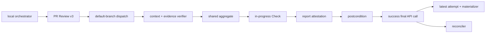

# DESIGN: 強制可能なattested gate Check

- Issue: `ISSUE-283`
- 対応する SPEC: `SPEC.md`

## 要件 → 設計要素の対応表

| 要件 / AC-ID | 対応する設計要素 | 完了条件 |
|---|---|---|
| AC-1 | TrustedGateRecorder / ReportLedger / AttestationVerifier / ReportMaterializer | success-last、耐久report、復元 |
| AC-2 | TrustBackendResolver / LatestAttemptSelector / ImmutableContextValidator | source・SHA・replay・no-fallback拒否 |
| AC-3 | #274 EvidenceVerifier / AggregatePolicy / ActorAuthorizer | v3 latest attemptと独立性 |
| AC-4 | GateReconciler / ArtifactSetComparator | fresh checkoutで集合完全比較 |
| AC-5 | DistributionPreflight / RolloutCoordinator / ruleset renderer | versioned prepare/activate |
| AC-6 | BootstrapLedger | #274固定keyの再開可能な二相記録 |

## 責務・境界

- `TrustBackendResolver`: rulesetとGitHub APIから`dedicated_app|required_workflow`を解決する。標準Actions App単独を拒否する。
- `ActorAuthorizer` / `ImmutableContextValidator`: dispatch actor権限とPR・Issue・base・current SHA・gateをAPIから確定する。
- `EvidenceVerifier` / `AggregatePolicy`: #274のv3 latest-attempt検証・集約を共有する。#283はverdictを再導出しない。
- `TrustedGateRecorder`: backend固有tokenでin_progress Checkを作り、report envelopeをattest後、最後のAPI操作で完了させる。
- `ReportLedger`: canonical reportを上限内inline保存し、超過時はPR comment chunksとCheck内manifestへ耐久保存する。
- `AttestationVerifier`: subject digest、repo、signer workflow/ref/digest、run attempt、Check IDを暗号検証する。
- `LatestAttemptSelector`: exact workflowの`run_number/run_attempt`最大tupleをstatus/conclusionより先に選ぶ。
- `ReportMaterializer`: latest attested successのinline reportまたはmanifest指定chunksをcacheへ原子的に復元する。
- `ArtifactSetComparator` / `GateReconciler`: previous reportとcurrent期待path集合・全digestを比較し、下流を連鎖無効化する。
- `RolloutCoordinator`: versioned environment/workflow/rulesetをprepareし、旧rulesetを残して加算activateする。
- `BootstrapLedger`: #274固定keyの`prepared→completed`をPR Reviewへ記録し、同一keyのmerge再開だけを許可する。



## backend状態遷移

| backend | 起動・再起動 | canonical Check | merge強制 |
|---|---|---|---|
| `dedicated_app` | default branch `repository_dispatch`。証跡追加後に新runをdispatch | 専用Appが作るCheck | required contextのintegration ID |
| `required_workflow` | `pull_request_target`で不足証跡をfailure化。追加後にexact runのfailed jobsを再実行 | workflowが作るattested custom Check | org ruleset required workflowとcontextの論理積 |

Required Workflowはsource repo/path/refをrulesetで固定し、Actions APIのsource SHA、PR event、head SHAも検証する。
native required runがsuccessにならなければcustom Checkだけでmergeできない。custom Checkはrun ID/attemptを束縛し、
再実行時もcandidate codeを実行しない。reconcileは`synchronize`の新run内でprevious headをAPIから取得する。

## 専用App境界と記録プロトコル

`dedicated_app`を現リポジトリの実装backendとする。Appは`Checks: write`、`Commit statuses: write`、
`Metadata: read`だけを持つ。
秘密鍵は固定environment `agent-skill-chain-gate`のsecretに保存し、deployment branchを`main`だけに制限する。
recorder workflowはdefault branchの`repository_dispatch`だけでenvironmentを参照し、candidate codeをcheckout・実行しない。
ruleset source選択要件の`Commit statuses: write`も付与するがstatus発行には使わない。通常`GITHUB_TOKEN`には
`checks: write`を与えない。setupはApp probe Check発行とruleset expected-source受理を実APIで検査する。
forkは両backendの追加隔離に限り、backend判定には使わない。

RecorderはPR/gate単位concurrency（cancelなし）で、PR番号・gate・40桁SHA以外を信頼入力にしない。
選択workflow runの`run_number/run_attempt`をexternal IDへ入れたCheckをin_progressで作成し、Check IDを含むreportを生成する。GitHub artifact
attestationを作成し、`gh attestation verify`でrepo・signer workflow・`refs/heads/main`・signer digestを固定して
検証する。App/ruleset、current head、latest attempt、artifact再計算、attestation再読取が全て成立した後、
approvedならsuccess、rejectedならfailure、判定不能ならaction_requiredへ更新する。success後に検査を置かない。

Selectorはexact workflow path/eventの全status runから最大`run_number/run_attempt`を先に選び、対応Checkを
external IDで一意化する。同時刻、in_progress、API応答順に依存しない。report、evidence、attestation、artifactの
いずれかが不正、またはlatest run/Checkがsuccess以外なら旧successへ戻らない。reconcileはprevious
headの検証済みpath集合をcurrent SHAの期待集合と双方向比較し、追加・削除・digest差異・取得不能を変更として扱う。

## report耐久化・配布・移行

canonical UTF-8 reportは4 MiB、1 chunkは45,000 bytesを上限とする。48 KiB以下はCheckへinline保存し、超過時は
base64 chunkをPR commentsへ保存する。Checkにはreport digest、chunk数・順序・各digestのmanifestを置き、
manifestとreportをattestする。materializerは全chunkをdigest検証してから結合し、4 MiB超はaction_requiredにする。

rolloutは`prepare→activate→retire`とする。prepareは新digest名のenvironment/secret/workflowとdisabled
rulesetを作り、旧系を変更しない。main merge後にprobeとattestationをsmoke testし、新rulesetだけをactiveへ
PUTする。旧activeとの論理積で一時的に厳しくなるだけで保護を弱めない。API再読取と実PR smokeの成功後だけ
旧rulesetをretireする。失敗・並行admin更新時は新rulesetを無効化して旧activeを維持し、secretも上書きしない。

```yaml
related_adrs:
  - id: ADR-0013
    relation: adopts
```

## 障害・ロールバック考慮

- API・attestation・App・environment・ruleset不明はsuccessや部分配備へ倒さず、Checkをaction_requiredにする。
- final success更新の通信結果が不明なら同じrunを成功扱いせず、API再読取後に新attemptを要求する。
- rollbackは新rulesetだけを無効化し、旧workflow/rulesetへ戻す。required context無しの瞬間を作らない。
- bootstrap keyは`repo/PR/SHA/digest`。`prepared`後の失敗は同一keyだけmerge APIを冪等再試行し、PRがmergedなら
  merge SHA/timeを`completed`へ追記する。別key、completed後、通常PRからの呼出しを拒否する。
