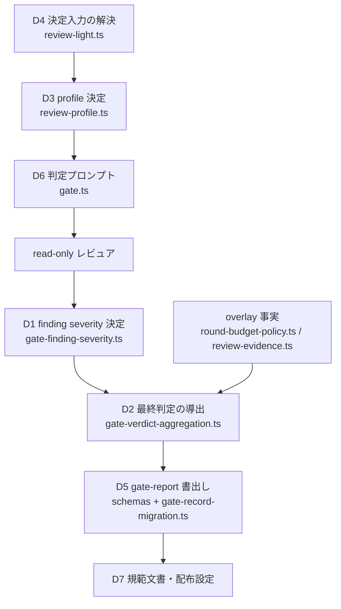
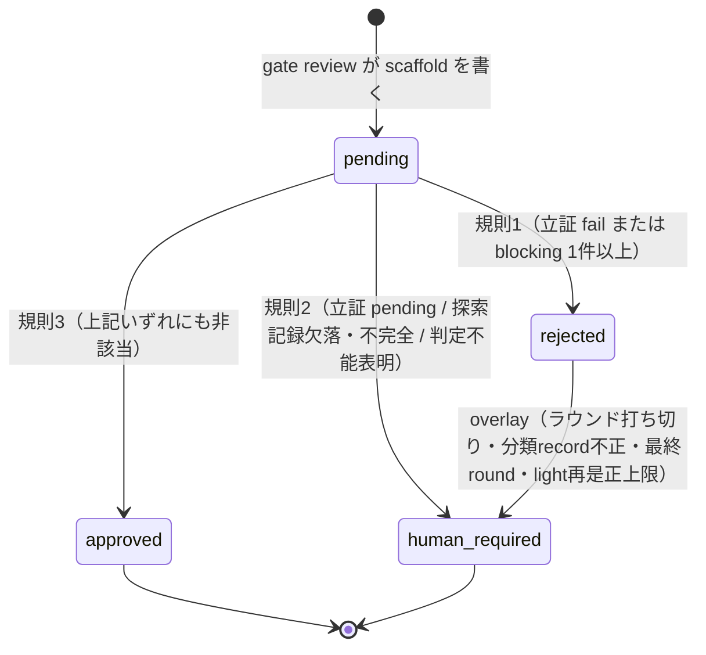

# DESIGN: 反証観点をゲートの合否条件から外し、finding のトリアージへ置き換える

- Issue: `ISSUE-808`
- 対応する SPEC: `SPEC.md`

## 目的・対象範囲

承認済み `SPEC.md` が確定させた3つの状態空間——(a) finding の severity 決定、(b) ゲート最終判定の導出、(c) レビュープロファイルの決定——を、既存モジュールの責務へ最小変更で割り当てる。反証の探索は維持したまま、反証観点の合否値をゲート最終判定の入力から取り除き、blocking への昇格を閉じた列挙の昇格類型と必須根拠に限定し、profile 決定から `risk` の値を取り除く。

対象範囲は agent-skill-chain 本体の判定ロジック・スキーマ・判定プロンプト・規範文書・配布テンプレートである。対象外は本書末尾に列挙する。

## 前提

- 承認済み `SPEC.md` は変更しない。本書は `SPEC.md` の要求 `FALSIFICATION_AS_BINARY_GATE`・`SUBJECTIVE_BLOCKING`・`STRICT_FORCED_BY_RISK`、要件 R1〜R4、受入条件 AC-1〜AC-11 を実装可能な設計要素へ写像するだけであり、要求を追加も削減もしない。
- 本変更は `AGENTS.md`・`.agent-skill-chain/schemas/` 配下を変更するためコア対象であり、独立2体の read-only レビュアによる Strict 判定を要する。
- ゲート最終判定は `approved` / `rejected` / `human_required` / `pending` の4値を持ち、`pending` はレビュー未了、`human_required` はレビュー完了かつ判定不能を意味する。本変更はこの意味論を変えない。
- ISSUE-786 が導入したラウンド予算機構（限定閾値・打ち切り閾値・最終round事前宣言・finding 分類record）は撤去しない。本設計はこれを「最終判定の後段に置く安全側の昇格」として明示的に位置づけ直すだけである。

## 用語

本書で用いる語のうち、`SPEC.md` の用語節が定義済みの語（観点・昇格類型・必須根拠・反証探索記録・明示オプトイン・コア対象）は同一の意味で用いる。本書が新たに導入する語は次のとおり。

- **wire profile**: 既存の証跡・スキーマ・launcher token が保持している2値の profile 表現（`standard` / `strict`）。レビュア体数を決める値であり、既存の互換境界そのものである。
- **profile 決定結果**: `SPEC.md` の R3 が定める3値（`strict` / `light` / `standard`）。wire profile と `light_review` 記録の組へ写像する。
- **判定入力閉包**: 1 attempt の判定に用いる入力の全体。判定プロンプトへ展開した成果物本文・差分・AC-ID 集合・ラウンド文脈・profile 決定結果からなり、レビュアはこの閉包の外を参照できない。
- **overlay**: 最終判定の導出結果に対し、安全側（承認から遠い側）へのみ作用する後段の昇格事実。ラウンド打ち切り・分類record不正・最終round・light 再是正上限の4つ。
- **昇格評価**: 反証観点 finding が昇格類型と必須根拠を満たすかを記録側が機械的に評価する処理。結果を gate-report へ書き残す。

## 入力・出力

**入力**

| 入力 | 供給元 | 形式 |
|---|---|---|
| レビュア verdict | read-only レビュア（stdin JSON、または PR review evidence） | 観点宣言つき finding 群・立証観点の合否値・反証探索記録・判定不能表明 |
| 判定対象成果物と差分 | target SHA の git tree | 判定入力閉包へ展開した本文 |
| AC-ID 集合 | target SHA の `SPEC.md` | `AC-<n>` の集合 |
| profile 決定入力 | Issue ラベル（GitHub モード）／`state.yaml`（ローカルモード）／変更差分／過去ラウンドの gate-report | 真偽値3つと差分解決状態1つ |
| overlay 事実 | ラウンド文脈・最終round事前宣言・finding 分類record・`light_review` 記録 | 真偽値4つ |

**出力**

| 出力 | 保存先 | 形式 |
|---|---|---|
| ゲート最終判定 | gate-report（`reviews/<gate>.yaml` または Check Run 出力）、PR review evidence | `approved` / `rejected` / `human_required` / `pending` |
| finding 群 | 同上の `gate.blockers` | severity・観点・origin・code・evidence 原文・昇格評価結果 |
| 反証探索記録 | 同上の `gate.falsification_search` | 実施有無と探索した反例候補の列挙。合否値を持たない |
| 適用された review profile | 同上の `gate.review_profile` と `gate.light_review` | 決定結果・適用規則番号・決定入力の値 |

## 要件 → 設計要素の対応表

| 要件 / AC-ID | 対応する設計要素 | 検証方法 |
|---|---|---|
| R1 / AC-1 | D1 `validateReviewerVerdictShape`、D5 evidence schema v4・gate-report schema v2 | `automated`（単体: 観点欠落・列挙外値の各入力が `human_required` を返すこと） |
| R1 / AC-2 | D1 `classifyFindingSeverity` の conformance 分岐 | `automated`（単体: 昇格類型・必須根拠を伴わない AC-ID 未達 finding が blocking のまま） |
| R1 / AC-3 | D1 `evaluatePromotion`、D5 gate-report v2 の `promotion` / `promotion_evaluation` | `automated`（単体: 4類型 × 必須根拠充足で blocking、記録内容だけで再現可能） |
| R1 / AC-4 | D1 の降格経路、D5 の原文保持制約 | `automated`（単体: 昇格不成立の3経路が warning 以下、evidence 原文が同一） |
| R2 / AC-5 | D2 `deriveGateFinal` 規則1 | `automated`（単体: 立証 fail・blocking 1件以上の各入力が `rejected`） |
| R2 / AC-6 | D2 `deriveGateFinal` 規則2 | `automated`（単体: 立証 pending・探索記録欠落／不完全・判定不能表明の各入力が `human_required`） |
| R2 / AC-7 | D2 `deriveGateFinal` 規則3 | `automated`（単体: warning/info 多数かつ探索記録ありで `approved`） |
| R3 / AC-8 | D3 `decideReviewProfile`、D4 `resolveReviewProfileInputs`、D7 設定・プロンプトからの `risk` 除去 | `automated`（単体: `risk` 3値すべてで `standard`。統合: `risk` を profile 決定へ渡す経路が存在しないことの grep 検査） |
| R3 / AC-9 | D3 の順序評価と全域性 | `automated`（単体: 決定入力の全組合せに対する表駆動テスト） |
| R4 / AC-10 | D5 スキーマ4件の版更新と `src/lib/gate-record-migration.ts` | `automated`（単体: v1 レコードの `approved` が保持され、再導出されないこと） |
| R4 / AC-11 | D7 `AGENTS.md`・`docs/GLOSSARY.md`・設定テンプレート・`roles.yaml` | `automated`（統合: 規範文書に `risk` 由来の strict 昇格記述が残っていないことの検査） |

## 責務・境界

### コンポーネント構成

新設・改訂するモジュールと、それぞれが単独で負う判断を示す。判断はいずれか1つのモジュールだけが行い、複数箇所へ分散させない。

- **D1 `src/lib/gate-finding-severity.ts`（新設）**: finding 単位の判断だけを負う。観点宣言の検査、昇格類型の閉じた列挙、類型ごとの必須根拠の形式検査、逐語引用の照合、severity の決定。ゲート最終判定を知らない。
- **D2 `src/lib/gate-verdict-aggregation.ts`（改訂）**: attempt 単位の判断だけを負う。slot 件数・判定確定数の検査と、`SPEC.md` R2 の順序評価による最終判定の導出。既存の同名モジュールを置き換え、最終判定を導出する唯一の場所とする。finding の severity を自分で決めない。
- **D3 `src/lib/review-profile.ts`（全面改訂）**: profile 決定だけを負う全域関数。4つの決定入力を受け取り、`SPEC.md` R3 の順序評価で決定結果・適用規則番号・次ラウンドへ持ち越すラチェット値を返す。入出力ともに副作用を持たず、`risk` 型を持たない。
- **D4 `src/lib/review-light.ts`（責務の付け替え）**: D3 の決定入力を Coordination Backend から解決することだけを負う。明示オプトインの有無と付与主体の人間確認、変更差分の解決可否、コア対象の成立、過去ラウンドの strict 確定を読み取る。決定規則そのものは持たない。
- **D5 スキーマとマイグレーション**: `.agent-skill-chain/schemas/{gate-report,state,config}.schema.yaml` の版更新と、`src/lib/gate-record-migration.ts`（新設）による旧版レコードの解釈。旧版レコードの最終判定を再導出しない。
- **D6 判定プロンプト（`src/commands/gate.ts` の `buildReviewerPromptFromResolved`）**: レビュアへ渡す反証ルーブリックを、探索の指示を保ったまま、合否値の要求から昇格類型と必須根拠の申告要求へ置き換える。出力 JSON 契約を新版へ更新する。
- **D7 規範文書と配布物**: `AGENTS.md`・`docs/GLOSSARY.md`・`.agent-skill-chain/config/agent-skill-chain.yaml`・`.agent-skill-chain/templates/{standard,lightweight}/agent-skill-chain.yaml`・`.agent-skill-chain/config/roles.yaml`。

### 依存関係



循環は無い。D1 は D2 を参照せず、D3 は D1・D2 を参照しない。overlay は D2 への入力として合流し、D2 の出力を後から書き換える経路を持たない。

### 状態遷移



overlay は `rejected` と `approved` の双方から `human_required` へのみ遷移させ、逆向きの遷移（`human_required` や `rejected` から `approved` へ）を作らない。この一方向性が、既存のラウンド予算機構を保ったまま `SPEC.md` R2 の順序評価を無傷で保つ根拠である。

### 図示要否の判断

- 判断: `要`
- 根拠: 依存関係が3つ以上（D4→D3→D6→D1→D2→D5→D7 の連鎖と overlay の合流）、状態遷移が2つ以上（規則1〜3の3遷移と overlay 昇格）、責務境界が3つ以上（D1〜D7 の7境界）であり、いずれの基準にも該当する。

## 判断内容

### 判断1: finding の観点宣言と severity 決定（R1 / AC-1〜AC-4）

**データ形状**（gate-report v2 の finding、および evidence v4 の finding）

```yaml
severity: blocking | warning | info
perspective: conformance | falsification      # 新設・必須
origin: specification | design | implementation | validation
code: <文字列>
evidence: [<文字列>, ...]                      # 既存。原文をそのまま保持する
promotion:                                     # 反証観点でレビュアが昇格を申告する場合のみ
  category: issue_purpose_blocked | existing_behavior_regression | data_loss_or_security | ci_build_failure
  quote: <判定対象成果物からの逐語引用>
  basis: <類型ごとの必須根拠>
promotion_evaluation:                          # 記録側が書く。レビュアは書けない
  outcome: promoted | not_promoted
  category: <promoted のときのみ、promotion.category と同値>
  quote_source_path: <promoted のときのみ、引用元の成果物パス>
  rejected_reason: <not_promoted のときのみ、日本語1行>
```

**昇格類型と必須根拠の形式**（閉じた列挙。列挙外の `category` は AC-1 の受理拒否対象）

| 類型 id | 意味 | 必須根拠 `basis` の形式 | 機械的検査 |
|---|---|---|---|
| `issue_purpose_blocked` | 当該 Issue の目的の直接阻害 | 阻害される目的に対応する AC-ID | `AC-<n>` 形式を含み、当該 target SHA の `SPEC.md` から抽出した AC-ID 集合に実在する |
| `existing_behavior_regression` | 既存挙動の回帰 | 回帰する既存挙動を定義する成果物パス、またはテスト題名の逐語引用 | 当該 target SHA に実在するリポジトリ相対パス、または判定入力閉包へ展開済みのテストファイル本文に逐語一致する題名を含む |
| `data_loss_or_security` | データ喪失またはセキュリティ低下 | 喪失・低下が生じる資産のパスと、その資産へ到達する操作の名前 | 双方が当該 target SHA に実在するリポジトリ相対パスまたはコマンド名として解決できる |
| `ci_build_failure` | CI・ビルドの失敗 | 失敗するコマンド行と、その出力または終了コード | `$ ` で始まるコマンド行を1行以上含み、それに続く出力行または終了コード表記を1行以上含む |

`quote` は全類型に共通で必須とし、当該 attempt の判定入力閉包へ本文を展開した成果物のいずれかに逐語一致することを記録側が照合する。照合は改行コードを LF へ正規化し各行の末尾空白を除いたうえで部分文字列一致で行い、正規化後16文字以上を要求する。判定入力閉包へ展開しなかったファイルからの引用は照合対象にせず不一致として扱う——これは既存のハルシネーション防止規約（展開済み一覧に無いファイルの内容を推測してはならない）と同一の境界である。

**severity 決定の順序**（finding 単位。先に成立した規則で確定する）

1. `perspective` が未宣言、または `perspective`・`promotion.category`・`severity` のいずれかが列挙外 → verdict 全体を受理せず、当該 attempt の最終判定を `human_required` とする。値の既定補完も当該 finding の黙殺も行わない（AC-1）。
2. `perspective: conformance` かつ AC-ID の未達・未証跡を指摘している → 昇格類型への該当と必須根拠の有無を問わず `blocking`（AC-2）。判定は当該 finding の `evidence` が AC-ID を含むことで機械的に行う。
3. `perspective: falsification` かつ `promotion` があり、`category` が列挙内で、当該類型の `basis` 形式検査と `quote` 照合の双方を満たす → `blocking`。`promotion_evaluation.outcome: promoted` を記録する（AC-3）。
4. 上記のいずれにも該当しない → レビュアが申告した `warning` / `info` をそのまま採用し、レビュアが `blocking` を申告していた場合は `warning` へ降格する。`severity` 以外（`perspective`・`origin`・`code`・`evidence` 原文）は一切変更せず、降格時は `promotion_evaluation.outcome: not_promoted` と `rejected_reason` を併記する（AC-4）。

規則4の降格は要約・整形・置換・削除を伴わない。既存の降格記録（ISSUE-786 の finding 分類record）および follow-up 起票の経路とは独立に併存し、どちらも他方の記録を上書きしない。

### 判断2: ゲート最終判定の導出（R2 / AC-5〜AC-7）

**単一導出箇所**。最終判定を決める場所を D2 の `deriveGateFinal` 1箇所に統合する。現状は `src/lib/gate-verdict-aggregation.ts`（共通集約）・`src/commands/gate.ts` の `recordVerdict`（light 再是正上限による上書き）・`src/lib/review-evidence.ts`（分類record不正・ラウンド打ち切り・最終round による上書き）の3箇所が最終判定を確定させており、後2者は共通集約の結果を事後に書き換えている。この事後書き換えを廃し、書き換えの根拠であった事実を overlay という入力として D2 へ渡す。

**入力（閉じた4項目 + overlay）**

```
GateFinalInput {
  conformance: 'pass' | 'fail' | 'pending'        # 全 slot の集約値
  blocking_count: number                          # 判断1の severity 決定後の blocking 件数
  falsification_search: 'complete' | 'incomplete' | 'absent'
  inconclusive_declared: boolean                  # レビュアの判定不能表明、または slot 未確定
  overlays: {
    round_cutoff_reached: boolean                 # ISSUE-786 打ち切り閾値到達
    classification_invalid: boolean               # ISSUE-786 finding 分類record不正
    final_round: boolean                          # ISSUE-786 最終round
    light_cutoff_reached: boolean                 # light 再是正上限到達
  }
}
```

反証観点の合否値は入力に存在しない。型としても持たない。

**導出（規則を上から評価し、最初に成立したもので確定）**

1. `conformance === 'fail'` または `blocking_count >= 1` → `rejected`
2. `conformance === 'pending'`、`falsification_search !== 'complete'`、または `inconclusive_declared` → `human_required`
3. 上記のいずれにも該当しない → `approved`

**overlay の適用**（上記の確定後に、承認から遠い側へのみ作用させる）

- `classification_invalid`・`round_cutoff_reached`・`light_cutoff_reached` のいずれかが真 → `human_required`
- `final_round` が真かつ確定結果が `approved` でない → `human_required`

overlay はいかなる場合も `approved` を新たに生み出さない。この不変性を単体テストで固定する。`approved` は規則3を通過した入力だけが到達できる。

**反証探索記録の完全性判定**（`falsification_search` の3値）

```yaml
falsification_search:
  conducted: true
  counterexamples_considered:
    - <探索した反例候補の要約。16文字以上>
    - ...
```

- `absent`: フィールド自体が無い
- `incomplete`: `conducted !== true`、`counterexamples_considered` が空配列、または16文字未満の要素を含む
- `complete`: 上記以外

規則2により `complete` 以外は `approved` へ到達できない。これが反証探索の維持を機械的に担保する経路であり、探索の指示（D6）と合わせて二重に保つ。

**ISSUE-786 との関係**。`SPEC.md` R2 の順序評価では、ラウンド打ち切りが成立し、かつ blocking が残る入力は規則1により `rejected` になる。一方 ISSUE-786 はこの入力を `human_required` へ倒すことを要求する。両者は overlay を「最終判定導出の後段に置く一方向の安全側昇格」として分離することで矛盾なく共存する。R2 の3規則の評価順序は overlay の有無にかかわらず不変であり、実装が別順序で評価する余地を持たない。

**ISSUE-786 の finding 分類record に対する制約**。分類record による blocking → warning の差し替えは、`perspective: falsification` の finding に限る。`perspective: conformance` の finding を対象とする分類record は不正として扱い、`classification_invalid` を立てて `human_required` へ倒す。この制約が無いと、AC-2 が無条件 blocking とする AC-ID 未達が最終round で warning へ差し替えられ、不変条件 I7 が緩む。分類record の機構自体は撤去しない。

### 判断3: レビュープロファイルの決定（R3 / AC-8・AC-9）

**決定入力（閉じた4項目）**

```
ReviewProfileInputs {
  full_opt_in: boolean          # `full` の明示オプトインがあり、付与主体を人間と確認できた
  light_opt_in: boolean         # `light` の明示オプトインがあり、付与主体を人間と確認できた
  diff: 'resolved' | 'unresolved'
  core_target: boolean          # diff === 'resolved' のときのみ意味を持つ
  strict_locked: boolean        # 当該 Issue の当該ゲートが過去ラウンドで strict へ確定済み
}
```

`risk` はこの型に存在しない。D3 のシグネチャから `ReviewRisk` 型を削除し、`risk` を profile 決定へ渡せる経路をコンパイル時に消す。

**決定（規則を上から評価し、最初に成立したもので確定。規則4に条件が無いため全組合せに対して帰結が一意）**

1. `full_opt_in` → `strict`（2体）
2. `diff === 'unresolved'`、`core_target`、または `strict_locked` → `strict`（2体）。あわせて次ラウンドへ持ち越す `strict_locked` を真にする
3. `light_opt_in` → `light`（1体）
4. それ以外 → `standard`（1体）

戻り値は `{ profile, reviewer_count, rule, strict_locked_next }` とし、`rule` に成立した規則番号を含めて gate-report と review evidence へ記録する。第三者が記録だけを読んで決定を再現できる状態にする。

**決定入力の解決**（D4。既存シグナルの読み替えであり、新しいラベル・設定キーを追加しない）

| 入力 | GitHub モード | ローカルモード |
|---|---|---|
| `full_opt_in` | ラベル `autonomy:full` の直近付与 event の actor が User | `state.yaml` の `autonomy: full`。付与主体を機械的に確認できないため常に偽 |
| `light_opt_in` | ラベル `review:light` の直近付与 event の actor が User | `state.yaml` の `review_intensity: light`。同上により常に偽 |
| `diff` / `core_target` | `base...target` 差分の解決可否と、`AGENTS.md`・`.agent-skill-chain/schemas/` 配下・`.agent-skill-chain/config/segments.yaml`・`docs/adr/` 配下への該当、プロジェクトポリシー登録済みのコアパス列挙への該当、`review:core-audit` ラベル | 同左（ラベルの代わりに `state.yaml` の `review_subject: core_audit`） |
| `strict_locked` | 直前ラウンドの gate-report の `light_review.strict_locked` | 同左 |

`full_opt_in` に対しても付与主体の人間確認を課す点が現行からの変更である。現行は `autonomy:full` ラベルの存在だけで strict へ倒しており、確認を経ていない。`SPEC.md` R3 は `full`・`light` の双方に同一の確認を要求する。

`strict_locked` のラチェットは、現行では `light` が要求された場合にしか真へ遷移しない。本設計では規則2が成立した時点で、`light` 要求の有無にかかわらず真にする。降格は人間の明示行為に限る点は変えない。

**wire profile への写像**（既存の互換境界を壊さない）

| 決定結果 | wire profile | `reviewer_count` | `light_review.applied` |
|---|---|---|---|
| `strict` | `strict` | 2 | 偽 |
| `light` | `standard` | 1 | 真 |
| `standard` | `standard` | 1 | 偽 |

review evidence・launcher token・`config.review.<profile>.reviewer_count` が保持する2値の profile 表現は変更しない。`light` と `standard` はいずれもレビュア1体であり、両者の区別は既存の `light_review` 記録が保持し続ける。新しい profile 値を wire へ導入しないため、投稿済み証跡の再検証・ラウンド計数・digest 照合はいずれも影響を受けない。

**`gate review` の profile 引数**。現行の `gate review <issue_id> <gate_id> <profile>` は呼び出し側が渡した profile を基準にし、`light_review` の結果で上書きしていた。本設計では D3 の決定結果を唯一の正とし、引数は決定結果と一致することを検査する宣言として扱う。不一致は日本語の理由と決定結果を示して失敗させる。決定入力に含まれない値（呼び出し側の指定）が profile を変えないことが AC-9 の要件であり、黙って無視するとオペレータが誤った体数を前提に運用を続けるため、失敗させて可視化する。

### 判断4: 破壊的変更の履行（R4 / AC-10・AC-11）

**版更新するスキーマと移行定義**

| スキーマ | 旧版 | 新版 | 変更内容 | 旧版レコードの解釈規則 |
|---|---|---|---|---|
| gate-report | `agent-skill-chain/gate-report/v1` | `.../v2` | `gate.falsification`（合否値）を削除し `gate.falsification_search` を追加。finding へ `perspective`（必須）・`promotion`・`promotion_evaluation` を追加。`gate.review_profile`（決定結果と規則番号）を追加 | v1 レコードは記録済みの `final` をそのまま有効とし、再導出しない。`falsification` の値は `falsification_search: {conducted: true, source: legacy_v1_verdict}` として読み、finding の `perspective` は未宣言のまま保持する。v1 レコードを入力とする新規判定は行わない |
| state | `agent-skill-chain/state/v1` | `.../v2` | `gate.falsification`（`verdict` + `counterexamples_tested`）を `gate.falsification_search`（`conducted` + `counterexamples_considered`）へ置換。`review_profile` の説明から `risk` 由来の遷移記述を削除 | v1 の `gate.falsification.counterexamples_tested` を `counterexamples_considered` として読み、`verdict` は破棄する。`review_profile` の記録値はそのまま保持する |
| config | `agent-skill-chain/config/v1` | `.../v2` | `review.strict.trigger`（`risk_not_normal`・`autonomy_full`）を削除 | v1 の設定文書は受理し、`trigger` を読み捨てる。`doctor` が「当該フィールドは無効であり profile 決定に影響しない」旨を日本語で報告する |
| gate review evidence | `agent-skill-chain/gate-review-evidence/v3` | `.../v4` | verdict から `falsification`（合否値）を削除し `falsification_search` を追加。finding へ `perspective`・`promotion` を追加 | v3 証跡はラウンド計数と過去ラウンド展開の入力としてのみ受理し続ける。現ラウンドの判定入力としては受理しない |

いずれのスキーマも `schema_version` を `oneOf` で新旧2値受理とし、版ごとに必須フィールドを分岐させる。旧版で記録済みの承認は無効化しない——`gate reconcile` が旧版レコードを読んで digest 一致を確認した場合、記録済みの `final: approved` をそのまま最新 SHA へ再発行する。未定義動作と暗黙の読み替えを残さないため、移行規則は `src/lib/gate-record-migration.ts` に単一の写像関数として実装し、スキーマ添付コメントと同一の内容を保つ。

**規範文書の改訂**（AC-11）

- `AGENTS.md` 不変条件 I2: 「立証(conformance)+反証(falsification) の2観点レビューでゲートを通過する」を、2観点の実施を保ったまま、通過条件が立証の充足・blocking 不在・反証探索記録の存在であることを示す記述へ改める。
- `AGENTS.md` 不変条件 I8: 「`risk != normal`（`unclassified` 含む）OR `autonomy == full` → `review_profile: strict`」を削除し、strict の成立条件を R3 の順序評価（`full` 明示オプトイン／コア対象・差分解決不能・過去ラウンド確定／それ以外は既定 `standard`）と一致させる。autonomy の既定 `gated` と昇格を人間の明示行為に限る規則は残す。
- `AGENTS.md` レビュープロファイル節: 「Standard（既定、レビュア1体が conformance→falsification を順に実行）／Light（人間の `review:light` 明示時のみ、危険信号があれば自動で Strict へ固定）／Strict（`risk != normal` OR `autonomy == full`、専任2体）」を、R3 の4規則と体数の対応へ改める。`risk` を profile 決定の入力とする記述を残さない。
- `docs/GLOSSARY.md` の「ゲート」行: 「各セグメント完了時の conformance+falsification 判定」を、反証が合否ではなく finding 産出であることが読み取れる定義へ改める。3列・20行以内の制約を守る。
- `.agent-skill-chain/config/agent-skill-chain.yaml` と `.agent-skill-chain/templates/{standard,lightweight}/agent-skill-chain.yaml`: `review.strict.trigger` を削除する。`modes: [conformance, falsification]` は2観点の実施を表す記述であり残す。
- `.agent-skill-chain/config/roles.yaml` のゲートレビュア契約: 出力を「conformance/falsification verdict」から「立証の合否値・観点宣言つき finding 群・反証探索記録」へ改める。

`AGENTS.md` は現在140行であり上限は150行である。上記はいずれも既存記述の置換であり、行数を増やさない範囲で行う。

**判定プロンプトの改訂**（D6、AC-8 の「判定プロンプトに `risk` 由来の strict 昇格経路が存在しない」を含む）

反証ルーブリックから「blocking 基準を満たす反例が1件も無い場合は falsification=pass とする」「1件以上あれば falsification=fail とする」の2文を削除する。反例の探索指示は削除しない。代わりに、探索した反例候補を `falsification_search.counterexamples_considered` へ列挙すること、blocking として提出する反例には昇格類型 id・逐語引用・類型ごとの必須根拠を付すこと、いずれかを欠く反例は warning 以下として記録することを指示する。既存の3条件（目的阻害性・到達可能性・責務内是正可能性）は4類型の意味説明として引き継ぎ、実証性は `quote` の必須化として引き継ぐ。高ラウンドの限定節（ISSUE-786）はそのまま残す。出力 JSON 契約を evidence v4 の形へ更新する。

## 制約

- 承認済み `SPEC.md` を変更しない。
- 不変条件 I1・I3・I5・I7 を緩めない。特に I7 は判断1の規則2（AC-ID 未達の無条件 blocking）と判断2の分類record制約で維持する。
- 反証の探索そのものを削らない。D6 は探索指示を保ち、D2 の規則2は探索記録の無い attempt を `approved` へ到達させない。
- warning・info の finding を証跡から削除しない。既存の review evidence・gate-report・Issue 分離経路（follow-up 起票）への保持を妨げない。
- コア対象の変更であるため、strict 2体の read-only レビュアが判定できる入力閉包を保つ。本変更は判定入力閉包の構成規則（`src/lib/reviewer-prompt-inputs.ts`）を変更せず、プロンプトへ追加するのは反証ルーブリックの文面と profile 決定結果の記載のみとする。プロンプト長の増分は既存の `prompt_max_input_bytes` の範囲内に収める。
- 新しい設定項目を追加しない。profile 決定は既存のラベル・`state.yaml` フィールド・変更差分・過去 gate-report だけを入力とする。削除する設定項目は `review.strict.trigger` の1件のみであり、これは AC-8 が「`risk` を入力とする strict 昇格経路が設定に存在しない」ことを要求するために必要な削除である。

## 失敗時の安全側挙動

| 失敗 | 挙動 |
|---|---|
| verdict の観点宣言欠落・列挙外値 | 当該 attempt を `human_required`。既定補完も finding の黙殺もしない |
| `quote` の照合に失敗（引用元を判定入力閉包に見つけられない） | 当該 finding を warning へ降格し `rejected_reason` を記録。attempt 全体は失敗させない |
| 必須根拠の形式検査に失敗 | 同上 |
| 反証探索記録の欠落・不完全 | `human_required` |
| profile 決定入力のうち変更差分を解決できない | 規則2により `strict`（安全側） |
| 明示オプトインの付与主体を人間と確認できない | 当該オプトインを無かったものとして扱う。確認不能を理由に昇格させない |
| 旧版スキーマのレコードを読んだ | 記録済みの `final` を保持し、再導出しない。新規判定の入力にはしない |
| 移行写像が解釈できないレコード | `human_required`。推測して読み替えない |

## ロールバック考慮

- 想定される失敗モード: (1) 昇格評価が実欠陥を warning へ落とし続ける、(2) 逐語引用の照合が正当な引用を落として blocking が成立しなくなる、(3) profile 決定の変更でコア対象が strict にならない経路が残る、(4) 旧版レコードの解釈が既存の承認を無効化する。
- ロールバック手順: 本変更は単一 PR で入るため、revert が第一手段である。revert 後、当該期間に v2 として書かれた gate-report は v1 スキーマ検査に適合しなくなる。gate-report は attempt ごとに再生成できる記録であり永続的な利用者データではないため、影響 Issue のゲートを再実行して復旧する。復旧対象の特定は `gate.schema_version` が v2 である gate-report の走査で行う。
- 影響を受ける既存機能: ゲート判定（4ゲート全て）、`gate reconcile` の承認継承、review evidence の検証、ラウンド計数、`doctor` の設定検査、`verify gate-report`。いずれも本 PR 内で追随させる。
- 適用時点で進行中のゲート反復は、判定プロンプトが変わるため投稿済み証跡の prompt digest が期待値と一致しなくなり、やり直しになる。やり直さない場合の判定は既存の digest 一致検査により `human_required` へ倒れる。これは ADR-0068 が既に受け入れている帰結と同型である。

## テスト戦略

`.agent-skill-chain/standards/TEST_POLICY.md` の常時必須区分に従い、単体テストと統合テストを実装セグメントの完了条件とする。

- **単体（D1）**: 観点欠落・列挙外の観点値／類型 id／severity 値の各入力で受理拒否になること。AC-ID 未達 conformance finding が昇格類型・必須根拠なしで blocking のままであること。4類型それぞれについて、必須根拠充足で `promoted`、形式不備・引用不一致・類型非該当の3経路で `not_promoted` かつ warning になること。降格時に `evidence` 原文・`origin`・`code`・`perspective` が不変であること。
- **単体（D2）**: `SPEC.md` R2 の3規則を、立証3値 × blocking 有無 × 探索記録3値 × 判定不能表明の全組合せに対する表駆動テストで固定する。overlay 4種それぞれについて、`approved` を生まないこと・`rejected` と `approved` の双方を `human_required` へ倒すことを検査する。反証観点の合否値を入力に持たないことを型と実行の双方で固定する。
- **単体（D3）**: 決定入力5項目の全組合せ（`diff: unresolved` のとき `core_target` は不問）に対する表駆動テストで、規則番号と体数が一意に定まることを固定する。`risk` の3値を与える経路が存在しないことを、`ReviewRisk` 型の不在と grep 検査の双方で固定する。
- **単体（D5）**: v1 gate-report の `final: approved` が移行写像を通っても `approved` のままであること、`falsification` の合否値が探索記録へ読み替わること、v1 config の `trigger` が読み捨てられ profile 決定へ影響しないこと。
- **統合**: `gate review` → レビュア起動 → `gate record-verdict` → `gate verify-evidence` の1周が、v4 evidence で `approved` / `rejected` / `human_required` の3帰結へ到達すること。v3 証跡がラウンド計数へ引き続き算入されること。コア対象の差分で strict 2体が要求されること。`risk:high` ラベル付き Issue が `standard` になること。
- **CI 既存検査**: `verify gate-report`・`verify doc-length`・`lint-vocab`・`lint-references`・`adr-lint`・`verify-template-sync` を通す。`verify gate-report` は版を判別して検査内容を分岐させる改訂を要する。

## 配布物・展開物の同期

`.agent-skill-chain/templates/{standard,lightweight}/agent-skill-chain.yaml` は `init` が配る設定既定値であり、`.agent-skill-chain/config/agent-skill-chain.yaml` は本リポジトリ自身の設定である。両者から `review.strict.trigger` を同時に削除する。`.agent-skill-chain/templates/github/.github/` 配下は本変更の対象ではないが、`verify-template-sync` は同期検査として実行する。`.agent-skill-chain/templates/claude/skills/gate-review/SKILL.md` は反証観点の記述を持つため、D6 と同じ改訂を反映する。判定プロンプトと `roles.yaml` はいずれも launcher digest の算出対象であるため、変更後は既存証跡の launcher digest が変わる——これは上記「適用時点で進行中のゲート反復はやり直しになる」と同一の帰結であり、追加の措置を要しない。

## 完了条件

- 判断1〜判断4のすべてが実装・スキーマ・判定プロンプト・規範文書で一致している。
- AC-1〜AC-11 のそれぞれに、上記対応表が示す自動検証が存在し成功する。
- 4スキーマの `schema_version` が新版へ更新され、旧版レコードの解釈規則が移行写像とスキーマ添付コメントの双方に明文化されている。
- 最終判定を導出する箇所が D2 の1つだけであり、他の箇所が導出結果を事後に書き換えていない。
- `risk` を profile 決定へ渡す経路が実装・設定・判定プロンプトのいずれにも存在しない。

## 未決事項

- 逐語引用の照合における正規化規則（LF 正規化・行末空白除去・16文字下限）は、既存の finding evidence 検査と同じ下限値を採用した仮の値である。運用実測で正当な引用が落ちる事例が出た場合は下限値の見直しを要する。値の変更はコード定数の変更であり設定項目を追加しない。
- ローカルモードでは明示オプトインの付与主体を人間と機械的に確認する手段が無いため、`full`・`light` のいずれも適用されない。ローカルモードで strict を要する場合はコア対象の経路によって成立する。付与主体確認の手段そのものの導入は本 Issue の射程外であり、必要になった時点で別 Issue とする。

## 対象外

- 判定プロンプトの再現性（`prompt_digest` が実行時のゲート結果に依存する問題）。ISSUE-802 で扱う。
- ラウンド予算機構の撤去。ISSUE-786 で導入した機構は維持し、本設計は overlay として位置づけ直すだけである。
- strict における独立2体の集約規則（論理和）そのものの変更、および2体の逐次起動。後者は ISSUE-784 で扱う。
- テスト実行時間の短縮。ISSUE-785 で扱う。
- レビュアの実行系アダプタの選択・権限・認証。
- quick 免除の判定における `risk` の利用。`SPEC.md` が profile 決定からのみ `risk` を外すことを要求しており、`.agent-skill-chain/ci/verify-artifacts.sh` と `src/lib/gate-quick-exemption.ts` が用いる `risk` はそのまま残す。
- `risk` ラベル・`state.yaml` の `risk` フィールドそのものの廃止。profile 決定の入力から外すだけであり、フィールドは quick 免除の入力として存続する。

## 関連ADR

```yaml
related_adrs:
  - id: ADR-0081
    relation: adopts
```

`docs/adr/ADR-0081-falsification-as-finding-triage-and-risk-independent-profile.md`（status: proposed）が、反証を合否条件から外す判断・overlay による ISSUE-786 との共存・profile 決定から `risk` を外す判断・4スキーマの版更新方針の根拠を記録する。ADR-0068（ラウンド番号導出と反証 blocking 基準）は本決定により反証の合否条件部分だけが置き換わり、ラウンド番号の導出と高ラウンド限定の部分は存続する。ADR-0078（finding 再分類と有効 sub-verdict）は本決定により対象が反証観点 finding へ限定される。ADR-0070（verdict 集約の定足数）は本決定の D2 が引き継ぐ。

## 障害・ロールバック考慮

本書の「失敗時の安全側挙動」節と「ロールバック考慮」節が本項の内容を持つ。要約すると、判定材料が揃わない入力はすべて `human_required` へ収束し、承認が黙って記録される経路を新設しない。overlay は一方向であり、既存のラウンド予算機構による安全側停止を弱めない。切り戻しは PR の revert と、影響 Issue のゲート再実行で完結する。
