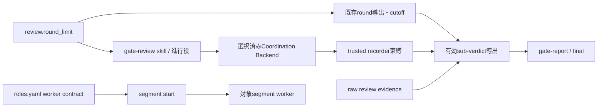

# DESIGN: ゲート差し戻しのラウンド予算と非追記型の是正方針

- Issue: `ISSUE-786`
- 対応する SPEC: `SPEC.md`

## 目的・範囲・前提

本設計は、既存のラウンド予算を進行役へ、非追記型の是正方針を対象セグメントの作業ワーカーへ配布し、最終ラウンド後の finding 分類がゲート判定へ届く経路と、その経路を動かす制御レコードの信頼境界を確定する。入力は Issue の目的・risk・autonomy、対象ゲート、既存 review evidence、`review.round_limit` の解決値、レビュー結果、Coordination Backend 上の制御レコードである。出力は、レビュー開始前の予算宣言、最終ラウンド後の分類・follow-up 手続き、分類後の判定集約結果、全セグメント作業ワーカーの是正契約である。

Issue #729 で実装済みの `review.round_limit`、round 0 起算、耐久 review evidence からの導出、限定閾値、cutoff、導出不能時の通常差し戻しを前提とする。設定、別カウンタ、別の導出元、severity 降格台帳は追加しない。既定値では `cutoff_threshold: 4` が最終 round 4、round 0 から最大5回を意味する。

ラウンド値を解決できない場合は予算による限定・打ち切り・降格を適用せず、取得不能だけを理由に `human_required` へ固定しない。既存の blocking 判定による差し戻しを維持し、この経路の有限性は保証しない。

## 要件 → 設計要素の対応表

| 要件 / AC-ID | 対応する設計要素 | 備考 |
|---|---|---|
| R1 / AC-1 | D1 既存予算の単一利用 | 全ゲートで解決済み cutoff を最終ラウンドとして配布 |
| R1 / AC-2 | D2 進行役の事前宣言契約、D4 投稿者束縛 | レビュー開始前の耐久記録を必須化し、投稿者を束縛する |
| R1 / AC-3 | D2 最終後の4類型分類、D3 分類後の集約 | 限定列挙以外を warning にし、その結果を判定へ届ける |
| R1 / AC-4 | D2 安全分類、D3 導出の限界 | データ喪失・セキュリティ低下は常時 blocking で、導出は類型判定を代行しない |
| R1 / AC-5 | D2 evidence・follow-up 手続き、D3 raw 値の併記 | raw evidence と raw sub-verdict を同じ現行記録へ保持 |
| R1 / AC-6 | D1 cutoff/fallback、D3 収束先、D4 偽造の不採用 | 解決可能時は収束、不能時は既存fallback、偽造で人間判断を無効化させない |
| R2 / AC-7 | D5 worker role contract | 4 workerへ選択的に同一方針を配布 |
| R3 / AC-8 | D3 導出の適用範囲、D4 束縛、D6 回帰防止検査 | ゲート・2観点・レビュア数・Strict・quickを不変にする |

## 責務・境界

### D1: 既存ラウンド予算の単一利用

- `.agent-skill-chain/config/agent-skill-chain.yaml` と standard/lightweight 配布テンプレートの `review.round_limit` を唯一の閾値設定とする。
- `src/lib/gate-round.ts` の既存導出結果と `src/lib/review-evidence.ts` の既存 cutoff 判定を再利用する。本 Issue ではこれらの算出・判定ロジックを変更しない。
- 「最終ラウンド」は解決済み `cutoff_threshold` と同じ値であり、ゲート別の別設定や別名の定数を作らない。
- 導出不能時は accepted ADR-0068 の fallback を維持する。事前宣言記録をラウンド導出元または cutoff 判定入力にしてはならない。

### D2: 進行役へ届くゲート運用契約

`.agent-skill-chain/templates/claude/skills/gate-review/SKILL.md` を進行役向け手続きの正本とし、配布済み `.claude/skills/gate-review/SKILL.md` へ init/upgrade が展開する。標準・軽量の両 profile で同じ skill を配るため、AGENTS.md だけに依存しない。

進行役はラウンド値を解決でき、rejectされた反復の既存導出結果に1を加えた値が解決済み最終ラウンドと一致した時、その差し戻しを確定する同じ状態遷移で「次回が最終」と宣言する。宣言は `gate`、直前の `attempt_id`、解決済み `final_round`、4類型、類型外findingのwarning化・follow-upを含む不変payloadとする。GitHub modeは固定marker付きIssueコメント、local modeは`state.yaml`の任意`gate.round_budget_declaration`に耐久化する。これは既存導出結果のsnapshotであり、round計数やcutoffの導出元にはしない。

最終反復のtrusted launcherはreviewer起動前に、最新完了attemptが宣言の直前attemptと一致し、既存導出値が宣言の`final_round`と一致することを検査する。宣言のCoordination Backend上の作成順序とcanonical digestを既存attemptの開始attestation・prompt・review evidenceへ結線する。宣言なし、レビュー開始後の作成、結果確定後の追加、payloadの上書き、直前attempt・digest・導出値の不一致は証跡検証で拒否して`human_required`とする。GitHubではコメントのAPI作成・更新metadataとPR reviewの順序、localでは開始時に読み取ったstateのdigestとgate-report内のattempt結線を検査するため、事後追加はschema適合だけでは通過できない。attempt IDと既存の開始attestationを再利用し、新round counter・別導出元・宣言専用台帳は作らない。導出不能時は宣言遷移を推測せずD1のfallbackを維持する。

最終ラウンド後は各 finding を次のいずれかへ再分類する。

1. 既出 blocking の未是正
2. Issue 目的の直接阻害
3. test/build 失敗または回帰
4. データ喪失またはセキュリティ低下

1〜4が残れば最終判定は `human_required` とし、進行役の裁量で追加差し戻しをしない。4はラウンド、risk、profileに関係なく blocking とする。類型外findingは同じfinding記録の`severity`をwarningとし、必須`reclassification`に`original_severity`、`classified_severity: warning`、`downgrade_reason`、4類型すべてに該当しない根拠、永続化済み`follow_up_issue_id`を保持する。既存`evidence`配列をraw evidence原文として不変保持し、元reviewの値との完全一致を検査する。

GitHub modeはraw PR reviewを削除・改変せず、source review IDを持つ固定marker付き分類記録にfinding全体を保存する。local modeは`.agent-skill-chain/schemas/gate-report.schema.yaml`の同じ現行findingへ`reclassification`を保存する。`gate record-verdict`とschema検査はcurrent record単独で全必須値とraw evidence一致を判定し、Git履歴からの元severity復元を前提にしない。follow-up永続化前、必須値欠落、raw evidence変更では進行せず`human_required`とする。これはゲートの現行追跡記録の拡張であり、専用の降格台帳やIssue #745のworker除外契約は導入しない。

### D3: 分類後の判定集約規則

配布済みの立証・反証ルーブリックは、blocking finding を付与するとき同じ観点の sub-verdict を fail とすることを求める。したがってレビュアの raw な `fail` と blocking finding は対で提出される。分類が finding の severity だけを差し替え、集約が raw の sub-verdict をそのまま使うと、4類型外の finding だけが残った最終ラウンドでも `rejected` が確定し、SPEC の R1 と完了状態が要求する「warning はゲート後の進行を妨げない」を満たす経路が存在しない。この受理条件を設計として確定する。

1. レビュアが提出した `conformance`・`falsification`・`inconclusive` は書き換えない。GitHub モードの PR review、ローカルモードの入力 verdict のいずれでも raw 値として保持する。
2. 判定の集約は raw 値ではなく**有効 sub-verdict** を入力とする。有効 sub-verdict は、レビュアごとに次の4条件がすべて成立する場合に限り raw の `fail` を `pass` として扱い、1つでも欠ければ raw をそのまま使う。
   - 当該ゲート・当該 attempt の最終ラウンド事前宣言が D2・D4 の検査に合格して成立している
   - 当該レビュアの raw `inconclusive` が false である
   - 当該 attempt の blocking finding が1件残らず有効な分類記録で warning へ差し替えられている
   - 当該レビュアが blocking finding を1件以上提出しており、その `fail` が finding に裏付けられている
3. `rejected` は、有効 sub-verdict に `fail` が1つでもある場合、または分類後の finding に blocking が残る場合とする。raw 値からは判定しない。
4. `approved` は、全レビュアの有効 conformance・有効 falsification がともに `pass`、全レビュアの raw `inconclusive` が false、分類後の blocking が0件、かつ事前宣言が成立している場合に限る。
5. いずれにも収束しない場合（有効 sub-verdict に `pending` が残る、分類記録が不正、宣言が不成立）は `human_required` とする。分類の有無や blocking 件数だけを理由に判定値や `inconclusive` を直接代入する分岐は設けない。
6. 事前宣言が無い経路、ラウンド値を解決できない経路、分類記録が1件も無い経路では条件が成立しないため、判定は本設計の導入前と同一になる。

未分類の blocking が1件でも残れば条件が崩れて raw の `fail` が維持されるため、blocking 件数の消滅だけを根拠に `approved` と `inconclusive: false` を確定する経路は成立しない。有効 sub-verdict は4類型の該当性を自ら判定せず、分類記録が保持する「4類型のいずれにも該当しない」旨の申告に依拠する。この申告を成立させられるのは D4 が定める trusted recorder だけであり、元 severity と raw evidence は不変のまま残るため、事後監査で申告の当否を検証できる。

本導出は R3 が予算の制御対象として認める進行判断に属する。レビュアは両観点を従来どおり完全に評価し、raw 値・検査項目・必要レビュア数・Strict 固定・quick 境界はいずれも変わらない。有効 sub-verdict は raw 値を置き換えるのではなく、raw 値と分類後 finding 集合から進行判断を導く派生値である。

既存の publish 整合検査は `final: approved` に対し `conformance`・`falsification` の両 `pass` を要求する。したがって gate-report の `gate.conformance`・`gate.falsification` には判定へ用いた有効 sub-verdict を記録し、raw 値は同じ現行記録の `gate.subverdict_reclassification`（`original_conformance`、`original_falsification`、`basis: all_blocking_findings_reclassified`）へ、導出が起きた場合にだけ併記する。この追加は SPEC の R2 が認める必要追加に当たる。既存の2フィールドは publish 整合検査の入力とローカルモード唯一の raw 記録を兼ねており、1つのフィールドが有効値と raw 値を同時に保持できないため、書換え・削除・上流最小改訂では AC-5 の追跡と既存 publish 不変条件を同時には満たせない。

### D4: 制御レコードの信頼境界

最終ラウンド事前宣言と finding 分類記録は、D3 を通じてゲート判定を動かす制御レコードである。同じ判定を動かす PR review evidence は登録済み review policy の `execution.trusted_reviewer_actors` で投稿者を束縛しているため、新設した Coordination Backend 経路だけを未束縛にしない。

1. GitHub モードでは制御レコードの採否を Issue コメントの投稿者で束縛する。信頼集合は PR review evidence と同一の `execution.trusted_reviewer_actors` とし、新しい設定項目・別の actor 一覧・署名鍵は導入しない。投稿者はコメント取得に使う既存の GitHub API 応答が返す作成者情報から取り、API 呼び出し回数を増やさない。
2. 投稿者が trusted recorder でないコメントは制御レコードとして採用しない。不正として全体を停止させることはしない。停止させると、Issue へコメントできる任意のアクターが1件投稿するだけで当該ゲートを恒久的に `human_required` へ固定でき、可用性側の攻撃面を新設することになる。採用しない場合の帰結は「宣言なし → `human_required`」「分類なし → blocking のまま `rejected`」であり、いずれも既存の安全側 fallback と同じ値へ落ちる。
3. 制御レコードの作成側と解決側は、marker・`issue_id`・ゲート・投稿者からなる同一の選択規則を使う。重複検査と件数検査は投稿者で絞った後の集合に対して行う。片側だけを絞ると、別ゲートや第三者のコメントを重複と誤認して当該ゲートの宣言を作成不能にし、そのゲートのゲートレビュー自体を停止させる。
4. trusted recorder が投稿した制御レコードに対する既存検査（canonical digest、直前 attempt の一致、作成順序、上書き検知、source review への結線、元 severity と raw evidence の一致）は変更しない。違反する場合は従来どおり不正として `human_required` に倒す。投稿者の束縛はこれらの前段に置く。
5. ローカルモードの制御レコードは Git 管理下の `state.yaml` と gate-report にあり、書込みは writer lease と当該変更のレビューが束縛する。未認証の投稿経路が無いため別の actor 一覧を新設しない。束縛の媒体は異なるが、いずれの Coordination Backend でも制御レコードは無束縛にならない。

### D5: workerへ届く非追記型の是正契約

`.agent-skill-chain/config/roles.yaml` の `spec_worker`、`design_worker`、`implementation_worker`、`validation_worker` の各 `rules` を唯一の worker 正本とする。`src/commands/segment.ts` が起動対象ロールだけを直列化する既存経路により、進行役の手書きなしで対象workerへ届く。

各契約へ同じ意味の次の規範を追加する。

- blocking を局所的な条項・例外・分岐・フラグの追記で塞がず、原因となる既存記述・実装を書き換えるか削除する。
- 不要な要求・挙動を減らして発生源を除けるかを先に評価し、原因が上流なら最小の上流改訂と必要な再ゲートを選ぶ。
- Issue目的に本来必要な追加は例外として認めるが、書換え・削除・不要要求の削減・上流最小改訂のいずれでも目的を達成できない理由を検証可能なworker reportへ残す場合に限る。
- 真因が Issue の範囲外なら成果物を拡張せず、対象SHA・再現コマンド・終了コード・該当assetを実測報告する。

`.agent-skill-chain/schemas/worker-report.schema.yaml`の任意`remediations`は、是正方法を`rewrite|delete|reduce_unneeded|upstream_minimal_revision|required_addition|out_of_scope`から選ぶ。blocking付きremediation dispatchのcompleted報告では1件以上を必須とし、`required_addition`だけは非追加手段で達成不能な具体的理由を必須にする。`report status`は空理由の必要追加をschema検査で拒否する。個別worker間で文言を独自拡張せず、4契約の意味的同値とgate reviewerへの誤配布禁止を検査する。Issue #745が扱う降格済みfindingの除外・伝達は追加しない。

### D6: 配布・回帰検査

- `test/unit/roles.test.ts`: 全4 workerにD5の4規範があり、`gate_reviewer`には編集規範が無いことを検査する。
- `test/unit/gate-round-policy-assets.test.ts`: gate-review skillに既定round 0〜4、最終直前の宣言遷移、4類型、常時blocking、同一findingの追跡値、`human_required`、導出不能fallbackが揃うことを検査する。
- `test/unit/state.test.ts`とゲート証跡検査: local宣言のschema適合・任意性・非導出境界、直前attemptとdigestの一致、宣言なし・レビュー開始後・結果後・上書きの拒否を検査する。GitHub fixtureでもAPI順序とdigest不一致を拒否する。
- `test/unit/review-evidence.test.ts`: D3の有効 sub-verdict 導出を、4条件をそれぞれ単独で崩した入力で検査する。宣言なし、raw `inconclusive: true`、未分類 blocking の残存、finding の裏付けが無い `fail` のいずれでも `approved` にならず、4条件が揃うときだけ `rejected` が解消することを固定する。raw 値が現行記録から失われないことも同じ検査で確認する。
- 信頼境界の検査: trusted recorder 以外が投稿した宣言・分類記録が採用されないこと、同内容を trusted recorder が投稿すれば採用されること、非 trusted の記録が単独ではゲートを停止させないこと、作成側の重複検査も投稿者で絞ることを検査する。
- `test/integration/gate-judgment.test.ts`: warning分類後のcurrent recordだけから元/分類後severity、理由、4類型外根拠、raw evidence、follow-upを検証し、Git履歴を参照しない。有効 sub-verdict を記録した `approved` が既存の publish 整合検査を通ることも確認する。
- `test/integration/worker-adapters.test.ts`: remediation dispatchの報告を検査し、理由なし`required_addition`とremediation未報告を拒否する。
- `test/integration/init.test.ts` と `test/integration/upgrade.test.ts`: standard/lightweight の双方で role contract・gate-review skill・state schema が配布され、配布元との不一致を残さないことを検査する。
- 既存 `test/unit/gate-round.test.ts`、`test/unit/review-evidence.test.ts`、`test/integration/gate-judgment.test.ts` を回帰検査として維持する。round導出、cutoff、取得不能 fallback、Strict のレビュア件数、およびレビュアが提出する raw な conformance/falsification とその記録は変えない。変えるのは D3 が定める有効 sub-verdict の導出と `rejected`・`approved` の再計算だけであり、有効な事前宣言と有効な分類記録が揃わない経路では従来と同一の判定になることを既存テストで固定する。

### 依存関係



循環依存はない。進行役契約は既存runtimeの解決値とraw evidenceを読むが、宣言・分類記録も有効sub-verdictの導出結果もruntimeのラウンド導出へ戻さない。worker契約は対象ロールへ一方向配布される。

### 図示要否の判断

- 判断: `要`
- 根拠: 設定、round runtime、進行役skill、Coordination Backend上の制御レコードとその信頼境界、判定集約、worker contract、配布処理の7責務があり、制御レコードと導出結果をround導出へ戻す循環を防ぐ必要がある。

## 関連ADR

```yaml
related_adrs:
  - id: ADR-0068
    relation: adopts
```

ADR-0068 のround導出、閾値、cutoff、取得不能 fallbackを採用し、その判断境界は変更しない。D3 の有効 sub-verdict 導出と D4 の制御レコード信頼境界は、これらの境界の外側にある新しいアーキテクチャ判断であるため、本Issueで ADR-0078 を `proposed` として作成する（`related_adrs:` は accepted のみを対象とするため同フィールドには載せない）。

## 障害・ロールバック考慮

- 宣言未記録・事後追加・事後変更: attempt結線またはdigest検査で拒否し`human_required`。既存review evidenceを削除・上書きしない。
- 制御レコードの偽造・非trusted投稿: 採用せず、宣言なし・分類なしの既存帰結へ落ちる。停止条件を新設せず、raw evidenceも書き換えない。
- 有効sub-verdict導出の欠陥: 導出は既存集約の入力側に限定し、`final`へ直接代入しない。`gate.subverdict_reclassification`と導出条件を戻せば、raw値による従来判定へ復帰する。
- follow-up永続化失敗: warning findingを黙って消さず `human_required`。便宜的にblockingへ戻して記録失敗を隠さない。
- local declaration・reclassification不正: state/gate-report schema検査で停止する。任意フィールドのため既存state/reportは移行なしで有効とする。
- worker契約の誤配布: role unit testとsegment起動の既存テストで検出し、旧配布物へ戻す。
- ロールバック: role contract、skill、state/gate-report schemaの追加差分と導出条件を同一checkpoint単位でrevertする。既存 `round_limit`、round導出、review evidenceは変更しないため、従来の通常差し戻しへ戻る。
- 影響を受けない機能: ゲート数、2観点、reviewer数、Strict固定、quick免除、既存config/default、反証ルーブリック、レビュアが提出するraw sub-verdict、publishの整合検査、accepted ADR-0068。

## 完了条件・未決事項・対象外

全ACが上記テストへ対応し、standard/lightweight配布物から進行役と4 workerが各自の契約を観測でき、分類後の判定集約と制御レコードの信頼境界が両Coordination Backendで同じ意味を持つことを完了条件とする。未決事項はない。降格専用台帳、降格済みfindingのworker contract除外、別round counter、新設定項目、制御レコード用の別actor一覧・署名鍵、一般的な分量上限・テスト適用性、Strict並列化、別スループット施策、診断改善は対象外とする。
