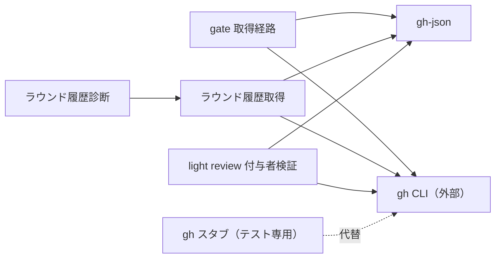

# DESIGN: gh の --slurp 依存を除去し、古い gh の環境でゲートの取得経路が黙って劣化しないようにする

- Issue: `ISSUE-774`
- 対応する SPEC: `SPEC.md`

## 目的・対象範囲・前提

`gh api --paginate --slurp` に依存している 12 箇所の一覧取得を、`--slurp` を持たない gh（下限 2.45.0）でも成立させ、取得または解釈に失敗した場合はその事実が利用者に見えるようにする。対象は `src/` 配下の gh 起動引数と、その標準出力を解釈する処理、および自動検証用の gh スタブである。`.agent-skill-chain/scripts/` と adapters の gh 呼び出し、GitHub REST API の直接呼び出しへの移行、gh の最低バージョン検査は対象外とする。

前提（実測済み）: 配列応答は `--paginate` のみで全ページが単一の平坦な配列として得られる。オブジェクト応答は `--paginate` のみでは連結された複数の JSON 文書として得られ、単一文書としては解釈できない。`--slurp` は各ページを要素とする配列を返す。

## 用語（本 DESIGN 内での定義）

- 配列応答: トップレベルが JSON 配列である一覧応答（PR の commits・reviews、対象 SHA に対応する PR、Issue の events）。
- オブジェクト応答: トップレベルが JSON オブジェクトで、要素配列を属性として持つ一覧応答（Check Run 一覧、Actions run 一覧）。
- 出力形 (i): 単一の JSON 文書。出力形 (ii): 空白区切りで連結された複数の JSON 文書。出力形 (iii): 各ページを要素とする配列（従来 `--slurp` が返した形）。
- ラウンド履歴: 同一 Issue・同一ゲートの過去ゲート反復の判定記録。GitHub モードでは PR へ投稿されたレビュー証跡から導出する。
- 無言の劣化: 取得または解釈に失敗したにもかかわらず、失敗が利用者に見える形で提示されず、取得結果が空である場合と外形上区別できないまま後続処理が正常終了すること。

## 要件 → 設計要素の対応表

| 要件 / AC-ID | 対応する設計要素 | 備考 |
|---|---|---|
| 要件 1 / `AC-1` | `gate 取得経路`・`ラウンド履歴取得`・`light review 付与者検証` | 12 箇所から `--slurp` のみを除去し `--paginate` は残す |
| 要件 2 / `AC-2`・`AC-3` | `gh-json` | 出力形 (i)(ii)(iii) の受理を単一モジュールへ集約する |
| 要件 3 / `AC-4` | `gh-json` + 各呼び出し側の失敗写像 | パーサは例外を送出するのみで空集合へ倒れない |
| 要件 4 / `AC-6` | `ラウンド履歴診断` | 標準エラー出力のみ。終了コード 0、判定プロンプト本文は不変 |
| 要件 5 / `AC-5` | `ラウンド履歴取得` + `gh スタブ` | `--slurp` を拒否するスタブでラウンド番号導出が成立することを実証する |
| 要件 6 / `AC-9` | `gh スタブ` + `fetchReviews` 注入口 | 実行環境の gh 実体・設定・恒久 PATH を変更しない |
| 要件 7 / `AC-7`・`AC-8` | `gh-json` の単一文書優先経路 + 既存 golden fixture 検査 | 従来形 (i)(iii) は従来と同一の解釈結果を返す |

## 設計判断

### 判断 1: 標準出力が空または空白のみの場合は解釈失敗とする

標準出力に JSON 文書が 1 つも存在しない場合（0 バイト、または空白文字のみ）は解釈失敗とし、要素 0 件の一覧として扱わない。要素 0 件は、`[]` や `{"check_runs":[]}` のように JSON 文書が実在し、その内容が空である場合にのみ成立する。

| 標準出力 | 解釈 |
|---|---|
| `[]` / `{"check_runs":[]}` / `[[],[]]` | 要素 0 件（正当な空一覧） |
| 空（0 バイト）/ 空白文字のみ | 解釈失敗 |
| 文書として閉じていない断片・JSON でない文字列 | 解釈失敗 |

根拠: gh は空の一覧に対しても必ず 1 つの JSON 文書を出力する。したがって空出力は「一覧が空である」という証拠を何も持たず、gh が出力を produce できないまま終了コード 0 を返した場合と区別できない。これを 0 件として扱うことは本 Issue が除去しようとしている無言の劣化そのものである。現行実装も空文字列に対して `JSON.parse` が例外を投げるため、本判断は現行の安全側挙動を明文化するものであり挙動を後退させない。

### 判断 2: 出力形 (iii) のオブジェクト応答も同一経路で受理する

オブジェクト応答用の抽出は、まず文書列へ分割し、各文書が配列であればその各要素をページとみなし、配列でなければ当該文書自体を 1 ページとみなす。これにより出力形 (iii) のオブジェクト応答（`[{"check_runs":[...]},{"check_runs":[...]}]`）と出力形 (ii) を同一経路で扱う。ページに当該属性が無い、または配列でない場合はそのページの寄与を 0 件とする（現行挙動の保持）。ページが JSON オブジェクトでない場合は解釈失敗とする。

`AC-3` の Then は出力形 (ii) のオブジェクト応答のみを名指しているが、出力形 (iii) は `--slurp` を受け付ける gh が返す形そのものであるため、`AC-8`（`--slurp` を受け付ける gh でも結果が変わらない）の検証対象として扱う。すなわち出力形 (iii) のオブジェクト応答は `AC-8` で検証し、未検証のまま残さない。

### 判断 3: ラウンド履歴の取得失敗は「0 件」と区別できるため、終了コード 0 のままとしてよい

ラウンド履歴の取得に失敗した場合、失敗は次の 2 経路で利用者に提示される。

- 判定プロンプト本文（標準出力・レビュアが読む）: 取得できなかった旨と理由、および「これは過去ラウンドが存在しないことを意味しない」旨、高ラウンドの限定を適用しない旨を出力する。過去ラウンドが実在しない場合は「本ラウンドは初回（ラウンド 0）」と出力する。両者は別文言であり外形上区別できる。この分岐は既存実装が持つ挙動であり、本 Issue では変更しない。
- 標準エラー出力（進行役・人間が読む）: 取得できなかった旨と理由を 1 行の診断として出力する。本 Issue で新設する。

無言の劣化は「失敗が利用者に見える形で提示されず、取得結果が空である場合と外形上区別できないまま後続処理が正常終了すること」と定義される。上記により失敗は提示され、0 件とも区別できるため、この経路は無言の劣化に該当しない。したがって終了コードを 0 のままとする設計を許容する。終了コードを非 0 にしない理由は、`gate reviewer-prompt` の責務がプロンプトの生成であり、ラウンド履歴はプロンプトの一部にすぎないためである。ここで停止させると、ラウンド予算が導入される前と同じ判定すら実行できなくなり、可用性が要求以上に後退する。

診断は `unavailable` の全理由（ローカルモード、PR 番号未指定、attempt_id 未指定、trusted actor 未登録、gh 非 0 終了、解釈失敗）に対して一律に出力し、区別は理由文字列が担う。取得経路の失敗だけを特別扱いすると、`unavailable` の理由が増えたときに再び無言化するためである。

## 責務・境界

### コンポーネント構成

- `gh-json`（新規、`src/lib/gh-json.ts`）: gh 標準出力の文字列を受け取り、出力形 (i)(ii)(iii) を判別して要素列を返す純関数群。文書列への分割、配列応答用の要素抽出、オブジェクト応答用の要素抽出、専用の解釈失敗例外を持つ。単一の JSON 文書として解釈できる入力はその結果を用い、解釈できない場合にのみ文字列走査で文書境界を求める。走査は文字列リテラルとエスケープを認識し、括弧の深さが 0 へ戻る位置を文書の終端とする（レビュー本文には括弧を含む文字列が現れるため、改行や空白による分割では成立しない）。既定値へのフォールバックは行わず、cli 層にも実行系にも依存しない。
- `gate 取得経路`（`src/commands/gate.ts`）: 承認済み baseline の解決、証跡検証、Check Run report の実体化。gh 起動と、`gh-json` の解釈失敗を停止（使い方エラー）へ写す責務を持つ。
- `ラウンド履歴取得`（`src/lib/gate-round.ts`）: PR レビュー証跡の取得とラウンド文脈の導出。解釈失敗を理由付きの取得不能へ写す。
- `light review 付与者検証`（`src/lib/review-light.ts`）: Issue events の取得と付与者判定。解釈失敗を「検証不成立」（strict 側）へ写す。
- `ラウンド履歴診断`（`src/commands/gate.ts` の `gate reviewer-prompt` ハンドラ）: 取得不能を標準エラー出力へ 1 行で提示する。標準出力と終了コードには触れない。
- `gh スタブ`（`test/helpers/gh-stub.ts`）: 出力形の切り替えと、`--slurp` を含む起動を `unknown flag: --slurp` で非 0 終了させるモードを提供する。

各呼び出し側は gh 標準出力を直接 `JSON.parse` しない。解釈は `gh-json` に一元化し、提示形式の決定だけを呼び出し側に残す。これにより責務が 1 箇所へ集中することを避けつつ、12 箇所の解釈の食い違いを構造的に排除する。

### 依存関係



`gh-json` は他のどのコンポーネントにも依存しない終端であり、循環依存は生じない。

### 図示要否の判断

- 判断: `要`
- 根拠: コンポーネント間・外部システムを含む依存関係が 3 つ以上ある（3 つの呼び出し側 → `gh-json`、および各呼び出し側 → gh CLI）。責務境界も 3 つ以上あるため、基準に該当する。

## 関連ADR

```yaml
related_adrs: []
```

本設計の判断根拠は `ADR-0073`（`status: proposed`）に記録する。`related_adrs:` は `accepted` の ADR のみを対象とするフィールドであるため、設計ゲート承認前の本 ADR はここへ記載しない。

## 障害・ロールバック考慮

- 想定される失敗モード 1: 連結文書の分割が誤り、要素が欠落または重複する。特に文字列リテラル内の括弧を誤って数えると文書境界がずれる。検出手段は `AC-2`・`AC-3` の自動検証と、括弧を含むレビュー本文を与える回帰検証である。
- 想定される失敗モード 2: 判定プロンプト本文が変化し、既に記録済みの証跡の prompt digest と一致しなくなる。証跡検証が不成立へ倒れ、既存 PR のゲートが止まる。検出手段は既存の golden fixture 検査（`AC-7`）である。本 Issue の診断追加を標準エラー出力に限定するのはこの失敗モードを避けるためである。
- 想定される失敗モード 3: 判断 1 により、正当に空である応答が解釈失敗として扱われる。gh が空一覧にも JSON 文書を返す以上は発生しない想定だが、発生した場合は当該経路だけを特例化せず、`ADR-0073` を改めて全経路の扱いを揃える。
- ロールバック手順: 本 Issue の変更はモジュール 1 つの追加と呼び出し置換、および標準エラー出力への 1 行追加のみで構成し、状態ファイル・スキーマ・GitHub 側の永続物・設定既定値を変更しない。したがって PR の revert のみで変更前の挙動へ完全に戻る。移行手順や後片付けは不要である。
- 影響を受ける既存機能: 承認済み baseline の解決、証跡検証、Check Run report の実体化、`gate reviewer-prompt` のラウンド履歴、`review:light` の付与者検証。いずれも gh 一覧応答の解釈経路を共有するため、回帰検証は 5 経路すべてを対象とする。

## 完了条件

`src/` 配下に `--slurp` を含む gh 起動引数が存在しないこと。出力形 (i)(ii)(iii) のいずれからも同一の要素集合が得られること。空出力・解釈不能出力が 0 件として扱われないこと。ラウンド履歴の取得不能が標準エラー出力へ提示されること。判定プロンプト本文が変化しないこと。以上が自動検証で示されていること。

## 未決事項

- 無し。各変更単位の順序と検証の粒度は `PLAN.md` で確定する。

## 対象外

- gh を介さない GitHub REST API の直接呼び出しへの移行、gh の最低バージョン検査、`--slurp` 以外の gh 互換性問題、取得失敗時の再試行・キャッシュ・レート制限対策。
- `.agent-skill-chain/scripts/` および adapters 配下の gh 呼び出し。これらは `--slurp` を含まない。
- `review:light` 付与者検証の失敗に対する診断出力の追加。当該経路は失敗時に strict 側へ倒れ、規律が弱まる方向の劣化を生まない。
