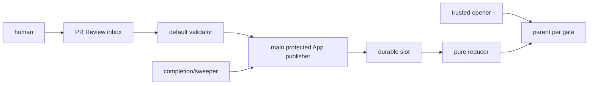

# DESIGN: human gateをGitHub正準sessionから一回だけ復帰させる

- Issue: `ISSUE-278` / 対応する SPEC: `SPEC.md`

## 目的・依存

human gateをGitHub PR aggregateとCheck/Reviewエンティティでモデル化し、判定耐久化、純粋集約、Check発行を分離する。
実装開始条件は、Issue #283 / PR #284が実装しmainに実在するI/Oなし`verifyGithubReviewEvidence(options)`（`src/lib/review-evidence.ts`）と、同PRのdedicated App・main限定environment・ruleset integrationを規定するaccepted ADR-0013であり、未成立ならsession開始前にfail-closedとする。

## ACと設計要素

| AC-ID | 設計要素 |
|---|---|
| AC-1 | GateSetResolver / SessionRepository |
| AC-2 | TrustBackendGuard / DedicatedAppPublisher |
| AC-3 | SerializedReducer / OwnershipRecovery |
| AC-4 | ReviewInbox / RecoverySweeper |
| AC-5 | ArtifactClassifier / ArtifactSet |
| AC-6 | SlotEnvelopeMapper / pure Strict reducer |
| AC-7 | CheckStateMapper / BackendGuard |
| AC-8 | ProvenanceEnvelope / distribution tests |

## DDD境界と正準record

- `HumanGateSession` rootはparent ID、一意key、base/target、gate/profile、状態、集合digestを守る。`ReviewInbox`は機械marker付きPR Reviewの追記集合で、candidateはCheckを書かない。
- `SlotEnvelope`はsession/slot/invocation、actor、review/run/Check ID、verdict/digest、nonce/stateを保持し、`ArtifactClassifier`はGit diff/objectだけからgate別recordを導出する。
- `SessionRepository`だけが同App parent/slotを探索し、`DedicatedAppPublisher`だけがcreate/PATCHする。`SerializedReducer`はinbox/retryを担い、純粋reducerへAPI/replay状態を渡さない。

parent keyは`repository_id/PR/target_sha/gate/check_name/publisher_app_id`、session IDはそのdigestである。同SHA/name/Appを列挙し、0件なら作成、1件ならexternal ID/bodyを照合して再利用、複数なら`action_required`で停止する。
旧Actions App由来Checkはrequired sourceにならず、gate-publish/reconcile/opener/submitを#283 publisherへ置換するため同名required Checkのwriterは増えない。

## trust・起動・liveness

全candidate workflow/jobの`GITHUB_TOKEN`は`checks: none`、readは`contents`と`pull-requests`だけとする。publisher jobだけが#283のmain限定`agent-skill-chain-gate` environmentで専用App tokenを取得する。
rulesetは各required名とApp `integration_id`を組にし、parent/slot create/PATCHとreconcileを同じAppに限る。

openerはdefault branch CLIでPR APIのbase/current head SHAを固定し、diffから開始gateを`spec→design→implementation→validation`順に導出してgateごとに冪等sessionを開く。PR codeはGit objectとして読むだけである。
humanはsession/slot/invocation入りPR Reviewを投稿する。read-only `pull_request_review` runの完了を`workflow_run`で受けるdefault-branch publisher、またはmain指定`workflow_dispatch`がdrainを起動し、publisherはAPIからReview本文・actor・PRを再取得する。

PR Reviewをdurable inboxとし、未消費判定はslotの`source_review_id/submission_digest`不在で導出する。同一PR/gate publisherは`cancel-in-progress: false`と公式の`queue: max`を補助利用するが、
100 pending超過は取消されるため正本にしない。各runは未処理ReviewをID順にdrainし、run完了triggerとdefault-branch定期sweeperも同じdrainを起動するため、dispatch/pending取消後も復旧できる。



## non-atomic PATCH・所有・状態写像

Checks PATCHは条件付き更新を提供しないためCASとは扱わない。専用Appを唯一writerとし、同じprotected publisher laneで直列化する。処理前にparent/slot/Reviewを再読し、slotへ`processing_nonce`とowner run IDを書いて再読一致を確認する。
通信結果不明なら同nonceでpostconditionを再読し、成立済みはno-opとする。前owner runがpending/runningなら触らず、Actions APIでterminalと確認した場合だけ新nonceで引き継ぐ。
slot記録後にaggregate digestを再読してparentを更新する。terminal同digestはno-op、異digest・逆結論は拒否し、失敗はReviewを未消費のままsweeperへ渡す。

| record state | Check status | conclusion |
|---|---|---|
| parent awaiting/reducing | `completed` | `action_required` |
| parent approved / rejected | `completed` | `success` / `failure` |
| parent human_required/invalidated | `completed` | `action_required` |
| slot queued / processing | `queued` / `in_progress` | なし |
| slot approved / rejected | `completed` | `success` / `failure` |
| slot human_required/invalid | `completed` | `action_required` |

## artifact分類・集約

| gate抽象output | 具体path分類 |
|---|---|
| spec: `SPEC.md` | root `SPEC.md` |
| design: `DESIGN.md, ADR, PLAN.md` | root `DESIGN.md`,`PLAN.md`、`docs/adr/ADR-*.md` |
| implementation: `code, unit_test_results` | 他分類に属さない全変更path。source/test/workflow/config/schema/scriptを含む |
| validation: acceptance/regression results | root `VALIDATION.md` |

base→targetの各pathをA/M/Dかつ一つのgateへ分類する。recordは`path,change,base_digest?,target_digest?`で、
Dはbase blob digestと固定`deleted` markerを持つtombstoneである。path正規化・sortしたcanonical JSONの
SHA-256を集合digestとする。open/submit双方が同じresolverで再導出し、`saved⊆derived`かつ
`derived⊆saved`、各record/digest一致を要求する。空、重複、未分類、取得不能は承認しない。

`verifyGithubReviewEvidence`はcontextとimmutable review配列だけを受け、2固定slot、異actor/invocation、
binding、artifact集合、判定優先順位を検査して`approved|rejected|human_required`と理由を返す既存の
I/Oなし関数である。#278はCheck/Reviewをこの関数が要求する入力形（GithubReviewRecord相当）へ写像するだけで、
replay選択、nonce、retry、Check状態写像は同関数の外に置く。同関数の判定ロジック自体は変更しない。

## 障害・ロールバック・関連ADR

App/environment/ruleset、依存API、API再読取、sweeperの不明状態はsuccessにせず、旧publisherへfallbackしない。
rollbackは新publisher/rulesetを無効化し#283の旧active enforcementを維持する。ADR-0011は本DESIGN自身の
判断なので自己参照しない。ADR-0013はacceptedになった時点でのrebaseでテンプレート規範の
`{id: ADR-0013, relation: adopts}` objectとして追加し、design gateを再通過する
（`verifyGithubReviewEvidence`はADR-0013とは別に既にmainへ実装済みのコードであり、related_adrs経由の
参照ではなく直接のコード依存として扱う）。

```yaml
related_adrs: []
```
