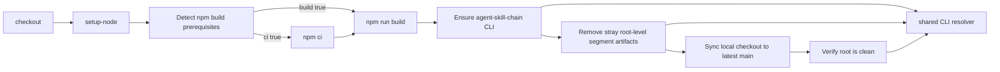

# DESIGN: 配布CIテンプレート agent-skill-chain-root-cleanup.yml の npm ビルド前提を条件付きにする

- Issue: `ISSUE-686`
- 対応する SPEC: `SPEC.md`

## 要件 → 設計要素の対応表

SPEC.md の全要件・全 AC-ID は、下表の 6 つの設計要素へ対応する。設計要素はいずれも root-cleanup ワークフロー定義（配布正本と展開先の 2 ファイル）と、その振る舞いを固定する自動テストに閉じており、CLI 本体・除去処理・root clean 検証・共有 CLI 解決実装のいずれも変更しない。

| 要件 / AC-ID | 対応する設計要素 | 備考 |
|---|---|---|
| 要件1（`npm ci` は package.json + lockfile のときのみ実行） | E1 npm 前提判定ステップ、E2 npm 実行ステップの実行条件 | 判定結果 `ci` を `npm ci` ステップの実行条件に用いる |
| 要件2（`npm run build` は `npm ci` 条件成立 かつ 有効な `scripts.build` のときのみ実行） | E1、E2 | 判定結果 `build` は 2 入力の論理積として導く |
| 要件3（前提検査自体は異常終了せず判定結果を出力する） | E1 | すべての判定を条件式内で評価し、ステップは常に終了コード 0 で終わる |
| 要件4（除去処理・root clean 検証の前に CLI 解決可能性を保証し、共有実装を用いる） | E3 CLI 保証ステップ、E4 ステップ配置順序 | 共有 CLI 解決実装を `source` して公開関数を呼ぶ |
| 要件5（既存の振る舞い・認証情報を変更しない） | E4、E5 配布正本と展開先の同一内容維持 | 追加は 2 ステップと既存 2 ステップへの実行条件付与のみ |
| 要件6（配布正本と展開先が同一内容） | E5 | 一方向の複製手順＋同期検査 |
| AC-1 | E1、E2、E6 振る舞い検証テスト | 非 Node.js 構成・lockfile 単独構成の 2 系 |
| AC-2 | E3、E4、E6 | ワークフロー定義の構造検査 |
| AC-3 | E1、E2、E6 | 自リポジトリ相当構成 |
| AC-4 | E2、E4、E5、E6 | 許容差分の範囲と全テストスイート成功 |
| AC-5 | E5、E6 | 同期検査と 2 ファイル一致アサーション |
| AC-6 | E1、E6 | `scripts.build` 非正常値を含む複数構成 |
| AC-7 | E1、E2、E6 | lockfile 不在時は build も「不可」 |
| AC-8 | E3、E6 | 解決可能な模擬構成での成功と解決経路出力 |
| AC-9 | E3、E6 | 解決不能な模擬構成での非ゼロ終了 |

## 責務・境界

### コンポーネント構成

- `E1 npm 前提判定ステップ`（ワークフロー内のステップ。名称 `Detect npm build prerequisites`、識別子 `npm-prereq`）: 実行時の作業ツリー構成を観測し、`ci` と `build` の 2 つの真偽値出力をステップ出力へ書き出すことだけを責務とする。npm コマンドの実行・ファイルの生成は行わない。
  - 判定入力 A（install 前提）: `package.json` が通常ファイルとして存在し、かつ `package-lock.json` または `npm-shrinkwrap.json` の少なくとも一方が存在する。
  - 判定入力 B（build script 妥当性）: `package.json` を JSON として解析し、`scripts` オブジェクトの `build` の値が文字列であり、かつ前後の空白を除いた結果が空でない。`package.json` 不在・JSON として解析不能・`scripts` 不在・`build` キー不在・値が空文字列／空白のみ／`null`／文字列以外の型、のいずれもすべて「不成立」とする。
  - 出力: `ci` は A の値。`build` は A かつ B。A を B へ合成するのは、依存を導入しないまま build script を実行すると devDependencies 未導入により典型的に失敗し、失敗箇所が移動するだけで「npm 前提の不成立を理由に失敗しない」という要求を満たせないため。A と B を別々に評価したうえで積を取る形にすることで、lockfile 不在の構成と `scripts.build` のみを欠く構成を判定入力の段階で区別できる状態を保つ。
  - 異常終了しないための制約: 判定は `[[ ... ]]` 条件式および `if` の条件位置での外部コマンド呼び出しとしてのみ評価し、解析失敗の標準エラー出力は捨てる。ステップ本体の最後の命令は出力の書き込みとする。これにより、GitHub Actions の既定シェル（失敗時に即時終了する設定）でも、どの入力構成でもステップは終了コード 0 で終わる。特に `package.json` が JSON として解析不能な場合は、解析コマンドの非ゼロ終了が条件式の値としてのみ扱われ、判定ステップは異常終了せずに `build` を「不可」として出力する。判定ステップ自体が異常終了すると、本 Issue が是正しようとしている「npm 由来の理由で root-cleanup が必ず失敗する」状態を別経路で再現してしまうため、この制約は設計上必須である。
  - 解析不能な `package.json` に対して `ci` を「可」のままとする理由: 要件は `npm ci` の実行条件を「`package.json` の存在」と「lockfile の存在」だけで定義しており、判定ステップが独自に JSON 妥当性を実行条件へ追加すると、要件と実装の判定条件が乖離して仕様⇔検証の対応が崩れる。加えて、解析不能な `package.json` は「npm 前提を持たない構成」ではなく consumer 側の壊れた Node.js 構成であり、この場合は `npm ci` がその場で明示的に失敗して原因が可視化されるほうが安全側である（沈黙して先へ進めない）。一方 `build` は判定入力 B が成立しないため必ず「不可」となり、依存未導入・構成破損の状態で build script が起動することはない。
  - 上記の割り切りが残す害: 解析不能な `package.json` と lockfile を併せ持つ consumer では、依存導入ステップがその場で失敗し、後続の CLI 保証・除去処理・main 同期・root clean 検証へ到達しない。すなわち、本 Issue が解消対象として挙げた 2 つの害（root 直下の成果物が除去されず残留する／恒常的に失敗するワークフローが 1 本存在し後続の本物の失敗が埋没する）と同型の状態が、この構成では残る。それでもこの割り切りを採るのは次の理由による。(i) 当該構成は「npm 前提を持たない consumer」ではなく consumer 側の構成破損であり、是正の主体は consumer 側にある。判定ステップが破損を検知して「不可」と偽り npm 手順を丸ごと飛ばすと、破損が root-cleanup の実行結果から見えなくなり、consumer は自身の `package.json` が壊れていることに気付かないまま他のワークフロー・ローカル作業で同じ失敗を繰り返す。破損を隠蔽するほうが有害である。(ii) 要件は `npm ci` の実行条件を `package.json` と lockfile の存在だけで定義しており、判定ステップが独自に JSON 妥当性を実行条件へ追加すると、要件と実装の判定条件が乖離して仕様⇔検証の対応が崩れる。(iii) 残る害の範囲は当該破損が是正されるまでの期間に限られ、失敗箇所（依存導入ステップ）と原因（`package.json` の解析失敗）がその場の出力に現れるため、原因不明のまま滞留しない。
- `E2 npm 実行ステップの実行条件`: 既存の `npm ci` ステップと `npm run build` ステップに、それぞれ E1 の出力 `ci`・`build` が真であることを要求する実行条件を付与する。ステップ本体のコマンド・順序・環境は変更しない。
- `E3 CLI 保証ステップ`（名称 `Ensure agent-skill-chain CLI`）: 後続の CLI 依存ステップが実行される前に、agent-skill-chain CLI が解決可能であることを検査し、解決できないなら明示的に失敗することを責務とする（fail-fast 検査）。解決結果そのものを後続ステップへ引き渡す責務は持たない（後述「ステップ境界と解決結果の伝播」）。実行条件は付けない（npm 手順の実行有無に関わらず常に実行する）。ステップは次を順に行う。
  1. 作業ツリー内の共有 CLI 解決実装（`.agent-skill-chain/scripts/cli-resolve.sh`）を `source` して読み込む。読み込めない場合はその時点で非ゼロ終了する。
  2. 共有実装の公開関数 `asc_resolve_cli` を呼ぶ。同関数は 3 経路をこの順で探索し、最初に成立した経路の起動コマンドを共有変数へ確定する: (a) リポジトリ内のビルド成果物 `bin/agents-md.js`、(b) `node_modules/.bin/agent-skill-chain`、(c) `PATH` 上の `agent-skill-chain`（`--help` が起動できることまで確認する）。
  3. 3 経路がいずれも成立しない場合、同関数は自動導入フォールバックへ進み、npm によるグローバル導入を試みたうえで導入先を `PATH` へ前置して再解決する。
  4. 解決に成功した場合は、共有実装が確定した起動コマンドの形から表示用の経路名を導き、それを含む 1 行を標準出力へ出す。導出は既知の 2 形（`node` と作業ツリー内のビルド成果物パスからなる 2 要素の形／作業ツリー内の依存ディレクトリ配下の実行ファイルパス 1 要素の形）との照合だけで行い、いずれにも一致しない場合は特定の経路名を断定せず「それ以外の経路（`PATH` 上のコマンド、または自動導入で用意されたもの）」を表す文言を出す。これにより経路が追加・改名されても、本ステップが誤った経路名を出したり失敗したりすることはない。
  5. 解決に失敗した場合は、共有実装が返した非ゼロ終了コードでステップを終了する。失敗理由（自動導入の無効化・npm 不在・導入失敗・導入後の再解決失敗のいずれか）は共有実装が標準エラーへ出力済みであり、ステップはそれを握り潰さない。
  - ステップ境界と解決結果の伝播: GitHub Actions ではジョブ内の各ステップが独立したシェルプロセスとして実行される。したがって共有実装が確定した起動コマンドを保持する共有変数も、自動導入時に前置された `PATH` も、次のステップへは引き継がれない（引き継ぐには実行系が用意する PATH 追記ファイルへ書き出す必要がある）。本設計はその書き出しを行わず、後続の CLI 依存ステップがそれぞれ共有実装を読み込んで独立に再解決する前提を採る。理由は 3 点。(i) 除去処理ラッパー・root clean 検証ラッパーはいずれも自身で共有実装を読み込んで解決する構造であり、伝播が無くても解決できる。3 経路のうちビルド成果物と依存ディレクトリ配下の実行ファイルは作業ツリー上に残るため、E3 がそれらの経路で成功した構成では後続ステップも同じ経路で解決できる。(ii) 自動導入の導入先ディレクトリは共有実装の内部事情であり、それを取り出して PATH 追記ファイルへ書くには共有実装の内部表現へ踏み込む必要があるため、解決ロジックを複製しないという境界を崩す。(iii) 姉妹ワークフロー（PR 契機の検査ワークフロー）の同名ステップも PATH 追記ファイルへの書き出しを行わず、各ステップが独立に再解決する形を採っている。配布物内に整合しない 2 つの形を併存させない。
  - 上記の帰結として、本ステップの実質は「CLI が解決可能であることの事前確認（解決不能なら即座に失敗させる）」と「自動導入が必要な構成における導入という作業環境への副作用」であり、後続ステップの解決成否を直接引き渡して保証するものではない。自動導入経路が起動した構成での後続ステップの振る舞いは障害・ロールバック考慮に記す。
  - 本ステップが「何もしない no-op」と区別可能である根拠: 第一に、3 経路のいずれでも解決できず自動導入も成立しない模擬構成では、本ステップは非ゼロ終了で失敗し失敗理由が出力される。ステップ本体を空にすると同じ構成で終了コードが 0 になるため、この 1 点だけで no-op は必ず検出できる。この根拠は経路名の出力に一切依存しないため、共有実装側の経路が追加・改名されても失われない。第二に、解決可能な模擬構成では、終了コード 0 に加えて経路名を含む 1 行が標準出力へ現れる。この文言は共有実装の出力形式に依存する補助的な観測点であるため、検証では終了コードと実行後の解決可能性を主たる判定に置き、経路名の確認は既知の 2 形に対応する出力に限定する。
  - 責務の境界（解決ロジックと表示）: 3 経路の探索順・各経路の成立条件の判定・自動導入の可否判断と実行・失敗時のメッセージは、すべて共有実装側の責務であり本ステップは複製しない。本ステップが持つのは、共有実装が確定した起動コマンドを表示用の経路名へ写す処理だけで、探索も成立判定も行わない。共有実装は解決経路の識別子を返す契約を持たず、確定結果として起動コマンドのみを公開するため、この写像は共有実装の出力形式に対する既知の結合である。本 Issue は共有実装を変更しないため契約追加はせず、上記のとおり照合を既知の 2 形に限定し未知の形を総括表現へ落とすことで、結合が陳腐化しても誤った断定が生じない形に留める。
- `E4 ステップ配置順序`: ワークフロー内のステップ列を「チェックアウト → Node.js セットアップ → E1 判定 → `npm ci`（条件付き） → `npm run build`（条件付き） → E3 CLI 保証 → 除去処理 → ローカルチェックアウトの main 同期 → root clean 検証」に固定する。E1・E3 の 2 ステップの追加と E2 の実行条件付与以外に、既存ステップの内容・順序・権限・同時実行制御・実行契機・使用する認証情報は変更しない。
  - E3 を npm 手順の後に置く理由: 自リポジトリと同じ構成の consumer では、経路 (a) のビルド成果物は `npm run build` によって、経路 (b) の実行ファイルは `npm ci` によってのみ用意される。E3 をこれらより前に置くと、両経路がまだ存在せず `PATH` 経路も無い状態から自動導入フォールバックが起動する。自動導入はネットワークと公開レジストリに依存し、本 Issue の対象外の別要因で成立しないことがあるため、後段の build 完了後であれば不要だったはずの失敗要因をワークフローへ持ち込むことになる。npm 手順の後に置けば、npm 前提を満たす consumer はリポジトリ内のビルド成果物で解決でき、自動導入が起動するのは 3 経路のいずれも成立しない consumer に限られる。
  - E3 を除去処理・root clean 検証より前に置く理由: 両ステップは CLI への薄いラッパー経由で実行され、CLI を解決できなければその内部で停止する。CLI の解決可能性を先に確定させることで、CLI 未検出が「除去処理の途中で起きる不透明な失敗」ではなく「CLI 保証ステップの明示的な失敗」として現れる。
  - main 同期ステップが CLI 実体を失わせないこと: 同期は既定ブランチの内容を作業ツリーへ反映するが、ビルド成果物ディレクトリと依存ディレクトリはいずれも Git 追跡対象外（無視対象）であり、同期によって削除されない。`PATH` 経路・自動導入の結果も同期の影響を受けない。したがって E3 を除去処理の前で 1 回だけ実行すれば、同期後の root clean 検証まで、各ステップが独立に再解決するうえでの解決可能性は保たれる。ここで保たれるのは解決可能性（作業ツリー上の経路と `PATH` 上のコマンドが存在し続けること）であり、E3 が確定した解決結果そのものではない。ステップ境界を越えて引き渡されるのは作業ツリーとランナー環境の状態だけであり、共有変数・`PATH` 前置は引き継がれない（E3 の項に記載）。
- `E5 配布正本と展開先の同一内容維持`: 変更は配布正本（`.agent-skill-chain/templates/github/.github/workflows/agent-skill-chain-root-cleanup.yml`）を編集し、その内容を本リポジトリの展開先（`.github/workflows/agent-skill-chain-root-cleanup.yml`）へ複製する一方向の手順で行う。両者の一致は、テンプレート同期検査と、2 ファイルの内容一致を直接アサートする既存の単体テストの二重で担保する。
- `E6 振る舞い検証テスト`: 配布正本のワークフロー定義からステップ実体を機械的に取り出し、一時ディレクトリに用意した模擬構成の上で実行して、判定結果・終了コード・出力を確認する。取り出しは、ワークフローを YAML として解析し、対象ジョブのステップ列から識別子（判定ステップ）または名称（CLI 保証ステップ）で一意に選び、その実行本文を得る形とする。取り出した実行本文と取り出し元の記述が一致していることは、実行本文の各行が配布正本ファイルの生テキスト中にブロックスカラーのインデント込みでそのまま現れることを確認して担保する（乖離があればテスト自身が失敗する）。
  - 判定ステップの模擬構成: (a) 何も持たない構成、(b) lockfile のみを持つ構成、(c) `package.json`＋lockfile＋有効な `scripts.build`、(d) `package.json`＋lockfile で `scripts` 不在／`build` キー不在／空文字列／空白のみ／`null`／文字列以外の型、(e) `package.json`＋有効な `scripts.build` で lockfile 不在、(f) JSON として解析不能な `package.json`。いずれも判定ステップの終了コードが 0 であることを併せて確認する。
  - CLI 保証ステップの模擬構成: 3 経路それぞれを単独で用意した構成（終了コード 0 と実行後に CLI が解決可能であることを主たる判定とし、併せて追加導入が起動しないこと、標準出力の文言が用意した経路に対応すること——既知の 2 形は各々の経路名、それ以外は総括表現——を確認する）と、3 経路がいずれも無く自動導入も成立しない構成（非ゼロ終了と失敗理由の出力を確認する）。自動導入の成否は、`PATH` 先頭へ置いた記録用の代替 npm コマンドで制御し、実ネットワークへは一切アクセスしない。
  - 構造検査: 配布正本の定義上で、CLI 保証ステップが除去処理ステップ・root clean 検証ステップより前にあること、実行条件を持たないこと、共有 CLI 解決実装を参照していること、`npm ci`・`npm run build` の各ステップが判定ステップの対応する出力を実行条件に持つことを確認する。

### 依存関係

```text
root-cleanup ワークフロー定義（配布正本）
  → E1 判定ステップ（外部依存: node コマンド、ステップ出力ファイル）
  → E2 実行条件（E1 の出力にのみ依存）
  → E3 CLI 保証ステップ → 共有 CLI 解決実装 → （3経路のいずれか | 自動導入フォールバック）
  → 除去処理ラッパー → 共有 CLI 解決実装 → CLI
  → root clean 検証ラッパー → 共有 CLI 解決実装 → CLI
E5 複製手順: 配布正本 → 展開先（一方向）
E6 テスト → 配布正本の定義（読み取りのみ）
```

依存は一方向であり循環は無い。E3 と各ラッパーは同一の共有 CLI 解決実装へ依存するが、共有実装はワークフロー・ラッパーのいずれへも逆依存しない。



### 図示要否の判断

- 判断: `要`
- 根拠: 責務境界となるコンポーネントが 6 つ（判定ステップ・npm 実行ステップ群・CLI 保証ステップ・共有 CLI 解決実装・CLI 依存ラッパー群・テスト）あり基準の 3 つ以上に該当する。加えて、本設計の中心的な判断はステップの前後関係（判定 → 条件付き npm 手順 → CLI 保証 → CLI 依存処理 → 同期 → 検証）であり、この順序と共有 CLI 解決実装への収束を図で固定しておくことが、実装時の配置ミス（CLI 保証を build より前に置く等）を防ぐうえで有効である。

## 関連ADR

```yaml
related_adrs:
  - id: ADR-0007
    relation: references
```

ADR-0007 は、main への push を契機に root 直下へ混入したセグメント成果物を短命ブランチ・PR・admin merge で除去する root-cleanup 自動化と、その実行に既存の管理者権限つき認証情報を再利用し新規の認証情報を追加しない方針を定めた決定である。本 Issue はその実行契機・除去手順・認証情報の運用を一切変更せず、実行環境の前提（npm 手順の条件化と CLI の存在保証）だけを追加する。

本 Issue 自体の決定（判定述語の厳格化、build 条件への install 条件の合成、CLI 保証ステップの配置と失敗時の扱い）は `docs/adr/ADR-0065-root-cleanup-npm-prerequisite-and-cli-guarantee.md`（`status: proposed`）として新規作成する。ADR を作成する理由は、姉妹ワークフローが持つ既存の判定形と本ワークフローの判定形が意図的に一致しなくなる（build 条件への合成と `scripts.build` 妥当性判定の厳格化）ためであり、この差異が意図的なものであることを記録しないと、将来の変更で「揃える」方向の誤った修正が入りうるためである。CLI 解決処理そのものを共有実装へ集約し自動導入フォールバックを既定とする決定は既存の別 ADR（`docs/adr/ADR-0064-cli-resolution-shared-implementation-and-auto-install-fallback.md`、`status: proposed`）が保持しており、本 Issue はその実装を呼び出すのみで内容を変更しない。

## 障害・ロールバック考慮

- 想定される失敗モード:
  - 判定ステップが自リポジトリ構成で誤って「不可」を返すと、ビルド成果物が生成されないまま CLI 保証ステップが自動導入経路へ落ちる。自動導入は外部レジストリに依存するため、この誤りは root-cleanup の恒常的な失敗として現れる。自リポジトリ相当構成を模した振る舞い検証と、本リポジトリ自身の main への push で実測される実行結果の双方で検知できる。
  - 3 経路のいずれでも CLI を解決できない consumer では、CLI 保証ステップが非ゼロ終了で失敗し root-cleanup は完了しない。これは本設計が意図する振る舞い（沈黙して後続へ伝播させず、明示的な失敗として顕在化させる）であり、自動導入経路そのものの成立可否は本 Issue の変更対象外である。
  - 自動導入経路が起動した consumer では、CLI 保証ステップの `PATH` 前置がステップ境界を越えないため、後続の除去処理ステップ・root clean 検証ステップが再解決の過程で同じ自動導入を再度起動しうる。グローバル導入は既に導入済みの状態に対しても成立するため振る舞いは変わらないが、導入先がランナーの既定 `PATH` に含まれない環境では CLI 依存ステップごとに導入と再解決の往復が生じ、実行時間と外部レジストリへのアクセス回数が増える。これは本設計が解決結果を伝播させない選択（E3 の項に記載）の代償として受け入れる範囲であり、振る舞いの正否には影響しない。解消が必要になった場合は、共有 CLI 解決実装側が導入先を公開する契約を追加する変更として別途扱う。
  - 解析不能な `package.json` と lockfile を併せ持つ consumer では、依存導入ステップが失敗して以降のステップへ到達せず、本 Issue が解消対象とした 2 つの害（root 直下成果物の残留・恒常的に失敗するワークフローの存在）と同型の状態が残る。これは構成破損を隠蔽しないための意図的な割り切りであり（E1 の項に理由を記載）、consumer 側で `package.json` を是正することで解消する。
  - 配布正本と展開先の一方だけを編集すると両者が乖離する。テンプレート同期検査と 2 ファイル一致の単体テストで検知する。
  - 判定ステップの実行本文をワークフロー定義から取り出して実行する検証は、取り出し元と取り出し結果が乖離すると空振りしうる。取り出した各行が取り出し元の生テキストに現れることの確認を検証手順自身へ組み込むことで、この空振りを防ぐ。
- ロールバック手順: 変更対象は配布正本と展開先の同一差分（判定ステップと CLI 保証ステップの追加、既存 2 ステップへの実行条件付与、先頭コメントの更新）と、新規追加するテストのみである。問題が生じた場合は当該差分を revert すれば、npm 手順を無条件に実行する従来のワークフローへ即座に戻せる。CLI 本体・共有 CLI 解決実装・除去処理・root clean 検証・認証情報の運用はいずれも変更しないため、revert の影響範囲もワークフロー定義とテストに閉じる。
- 影響を受ける既存機能: root-cleanup の実行（main への push 契機）。npm 前提を満たすリポジトリでは、判定結果がいずれも「可」となるため従来と同じ手順が同じ順序で実行され、CLI 保証ステップはビルド成果物経路で解決して追加導入を行わない。姉妹ワークフロー（PR 契機の検査ワークフロー、リスク判定ワークフロー）は変更しない。既に配布済みの consumer は、更新コマンドの実行によって本変更を受け取る。
