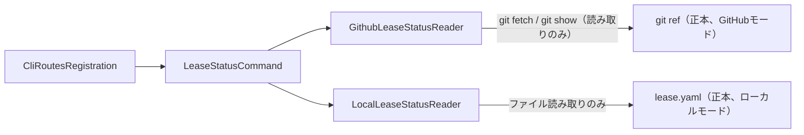

# DESIGN: writer leaseの現在状態を副作用無しで確認できる読み取り専用コマンドが無く、Issueコメントの古い記録を誤って現在状態と誤認しうる

- Issue: `ISSUE-602`
- 対応する SPEC: `SPEC.md`

## 要件 → 設計要素の対応表

| 要件 / AC-ID | 対応する設計要素 | 備考 |
|---|---|---|
| AC-1（有効leaseの現在状態を副作用無しで正本から取得・表示） | `LeaseStatusCommand`（`src/commands/lease.ts` の新規 `status()`）＋ `GithubLeaseStatusReader`／`LocalLeaseStatusReader` | いずれも既存の読み取り専用関数のみを呼び出し、ref・ファイルへの書込みを一切行わない。 |
| AC-2（Issueコメントの記載内容ではなく正本の値を返す） | `GithubLeaseStatusReader`（`src/lib/github-lease.ts` の既存 `allLeasesFor`/`readLeaseFromRef` を再利用） | `readLeaseFromRef` は `git fetch`＋`git show` のみでgit refから読み出す実装であり、`gh issue view`／Issueコメント本文を経由する経路（`cleanupLeaseComment`・`report latest` 等）を一切呼ばない。 |
| AC-3（存在しない場合と期限切れの場合を区別可能な形で出力） | `LeaseStatusCommand` 内の状態分類ロジック（`classifyLeaseState`、新規） | 正本から読み出したエントリの有無と `expires_at` の比較のみで `not_found`／`expired`／`active` の3値に分類する。コマンド自体の異常終了（Issue不在・接続失敗等）は既存の `fail()`（`src/lib/cli-io.ts`）でexit code 1以上として区別する。 |
| AC-4（機械可読な構造化出力を選択的に取得） | `LeaseStatusCommand` の `--json` 引数分岐 | 人間可読出力と同一の分類結果（`status`・`holder`・`segment`・`acquired_at`・`expires_at`・`remaining_seconds`）を `JSON.stringify` して標準出力へ返す。分類ロジック自体は出力形式と独立させ、二重実装を避ける。 |
| AC-5（segment省略時は対象Issueの有効leaseを全件取得） | `LeaseStatusCommand` の segment 省略分岐 | GitHubモードは `activeLeasesFor(issueNumber)`（既存、`allLeasesFor` を `expires_at` でフィルタ済み）をそのまま使う。ローカルモードは1 Issueにつき `lease.yaml` が1ファイルのみのため、ファイルが存在し期限内であれば単一件を返す。 |
| AC-6（credential・書込み権限を要求しない） | `LeaseStatusCommand`／`GithubLeaseStatusReader`／`LocalLeaseStatusReader` | `lease-credential.ts`（`readLeaseCredential`・`resolveCredentialToken` 相当）を一切importしない。GitHubモードの `git fetch`／`git ls-remote` は既存の `acquire` の事前競合チェックと同じ読み取り専用操作であり、リポジトリへの書込み権限を要求しない。 |
| AC-7（既存lease系サブコマンドの回帰無し） | 変更範囲の限定（既存 `acquire`/`release`/`renew`/`resume`/`reclaim` のexport・内部ロジックは無変更） | `status()` は新規exportの追加のみとし、既存関数のシグネチャ・呼び出し順序・戻り値を変更しない。`cli-routes.ts` への1エントリ追加のみで既存route定義は変更しない。 |

## 責務・境界

### コンポーネント構成

- `LeaseStatusCommand`（`src/commands/lease.ts` の新規 `status()`）: CLI引数（`issue_id`・任意の`segment`・`--json`）の解釈、Coordination Backendに応じた読み取りコンポーネントへの委譲、分類結果の出力整形（人間可読／JSON）を担う。状態変更・Issueコメント投稿は一切行わない。
- `GithubLeaseStatusReader`（`src/lib/github-lease.ts` の既存 `allLeasesFor`・`activeLeasesFor`・`readLeaseFromRef` を再利用する呼び出し経路。分類専用に `classifyLeaseState` を新規追加）: GitHubモードの正本（`refs/agent-skill-chain/leases/<issue_number>-<segment>`）から `git fetch`／`git show` のみで読み出す。`postLeaseComment`・`cleanupLeaseComment`・`markActiveWriterLeaseLabel` 等の書込み系関数は呼ばない。
- `LocalLeaseStatusReader`（`src/lib/local-state.ts` の既存 `leaseFilePath` と `src/lib/yaml-io.ts` の既存 `tryReadYamlFile` を再利用する呼び出し経路）: ローカルモードの正本（Issue毎 `lease.yaml`）を読むだけで、`writeYamlFileAtomic`・`writeYamlFileExclusive` 等の書込み系関数は呼ばない。
- `CliRoutesRegistration`（`src/lib/cli-routes.ts` への `'lease status': lease.status` の追加）: 既存のディスパッチテーブルへ1エントリ追加するのみで、既存route定義は変更しない。

### 依存関係



`GithubLeaseStatusReader` と `LocalLeaseStatusReader` は `LeaseStatusCommand` からのみ呼ばれる独立した経路であり、互いに依存しない（`config.coordination.backend` の値でどちらか一方だけを呼ぶ、既存 `acquire`/`release`/`renew` と同じ分岐構造）。循環依存は無い。

### 図示要否の判断

- 判断: `要`
- 根拠: 責務境界（`LeaseStatusCommand`・`GithubLeaseStatusReader`・`LocalLeaseStatusReader`・`CliRoutesRegistration`）が3つ以上存在するため、上記Mermaid図で依存関係を明示した。状態遷移（`not_found`／`expired`／`active`の3分類）はいずれも正本の読み取り結果に対する分類であり、コマンド実行によって遷移を引き起こすものではないため、別途状態遷移図は設けない。

## 関連ADR

```yaml
related_adrs:
  - id: ADR-0002
    relation: references
  - id: ADR-0024
    relation: references
```

ADR-0002（`github-lease-git-ref-cas`、`status: accepted`）は、GitHubモードの writer lease 正本を Issue コメントではなく git ref（compare-and-set）と定義した決定であり、本設計の `GithubLeaseStatusReader` が正本として git ref のみを参照する根拠になっている。ADR-0024（`writer-lease-human-reclaim-without-credential`、`status: accepted`）は、writer credential を要求しない読み取り・回収系コマンドの前例であり、本設計の `--json`・credential不要という性質（AC-6）と整合する先行決定として参照する。いずれも本 Issue で新たに提案する決定そのものではないため、別途 `ADR-0045`（`status: proposed`）で「読み取り専用の状態確認コマンドは正本のみを参照しIssueコメント・credentialを一切使わない」という設計判断を明文化する。

## 障害・ロールバック考慮

- 想定される失敗モード1: `LeaseStatusCommand` の実装が誤って書込み系関数（`acquireLeaseRef`・`renewLeaseRef`・`postLeaseComment`・`writeYamlFileAtomic`・`writeYamlFileExclusive` 等）を呼び出してしまうと、読み取り専用であるべきコマンドがlease状態やIssueコメントを変更してしまい、AC-1・AC-2・AC-6に違反する。実装セグメントは、コマンド実行前後でGitHubモードなら対象 ref の SHA（`git rev-parse`）、ローカルモードなら `lease.yaml` の内容・mtimeが変化しないことを検証するテストケースを追加し、この回帰を検出可能にする。
- 想定される失敗モード2: ローカルモードで `lease.yaml` が存在しない、または不正なYAMLでパースに失敗した場合に、`LeaseStatusCommand` が未捕捉の例外を投げてコマンド自体が異常終了すると、AC-3が要求する「lease無し」と「コマンド異常終了」の区別が失われる。実装セグメントは、`tryReadYamlFile` の既存の安全な `undefined` 返却契約（不正YAML・ファイル不在のいずれも例外を投げず `undefined` を返す既存実装）にそのまま乗せることで、この失敗モードを構造的に排除する。
- 想定される失敗モード3: GitHubモードで対象 Issue・segment に対応する ref が存在しない場合と、`git fetch` 自体が認証・接続エラーで失敗した場合を、`readLeaseFromRef`（既存実装）はいずれも `undefined` として区別せず返す。AC-3は「lease無し」と「コマンド自体の異常終了（接続失敗等）」を区別可能にすることを要求するため、実装セグメントは `LeaseStatusCommand` 側で `git fetch` の終了コード・stderrを判定し、認証・接続エラーの兆候（`classifyPushFailure` が用いる分類とは別に、fetch特有のエラー文言）を検出した場合は `fail()` で異常終了として扱う分岐を追加する必要がある（既存 `readLeaseFromRef` の戻り値だけでは不足するため、実装セグメントでの追加判定が必須）。
- ロールバック手順: 本設計が追加するのは `src/commands/lease.ts` の新規 export（`status`）、`src/lib/github-lease.ts` の新規分類ヘルパー、`src/lib/cli-routes.ts` の1エントリのみであり、いずれも既存exportの変更を伴わない。問題が発生した場合は追加分のみを `git revert` すれば既存の `acquire`/`release`/`renew`/`resume`/`reclaim` の動作に一切影響を与えずに復旧できる。
- 影響を受ける既存機能: なし（新規コマンドの追加のみ）。既存の `allLeasesFor`・`activeLeasesFor`・`readLeaseFromRef`・`leaseFilePath`・`tryReadYamlFile` のシグネチャ・戻り値・副作用は変更しないため、これらを呼び出す既存の `acquire`/`release`/`renew`/`resume`/`reclaim`・`segment start` 等への影響も無い。
