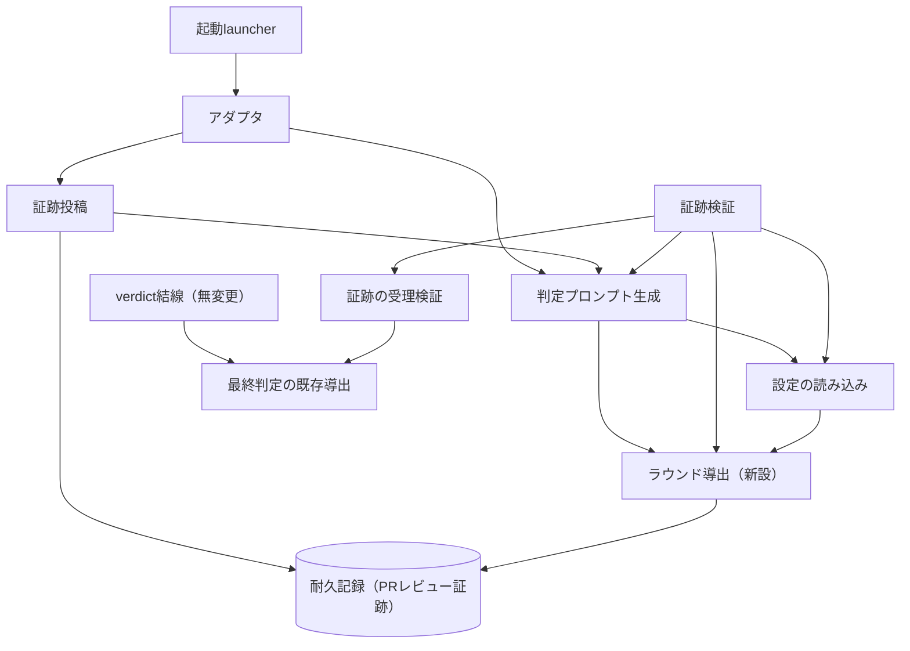

# DESIGN: 反証ルーブリックに合格到達条件・blocking 基準・過去ラウンド・ラウンド上限を与え、ゲートを収束させる

- Issue: `ISSUE-729`
- 対応する SPEC: `SPEC.md`

## 目的・対象範囲

ゲートレビュアへ渡す判定プロンプトの反証ルーブリックには合格に到達する条件が無く、反例の能動的探索だけを命じている。本設計は、(a) 反証ルーブリックへ合格到達条件と blocking 基準を置き、(b) 同一 Issue・同一ゲートの過去ラウンドの判定記録を判定プロンプトへ展開し、(c) ラウンド番号を既存の耐久記録から導出して高ラウンドでの blocking 適用範囲の限定と打ち切りを与える、という3つの変更を、判定プロンプトの生成処理・レビュア証跡の検証処理・設定の3箇所へ配置する。

対象範囲は次の6点である。(1) 反証ルーブリックの記述内容、(2) 過去ラウンドの判定記録の展開、(3) ラウンド番号の導出単位・導出元・導出時点、(4) 高ラウンドでの blocking 適用範囲の限定、(5) 打ち切り時の判定不能の機械的設定、(6) 閾値の設定項目・既定値・下限・順序関係の強制。

対象外は次のとおりであり、いずれも無変更とする。立証ルーブリックの記述、レビュアの verdict から最終判定を導く既存の導出規則そのもの、レビュア証跡の投稿・検証の信頼境界（起動元の隔離・launcher digest・one-time token・slot 検証・trusted recorder actor の照合）、severity をテキスト照合で機械的に書き換える機構（導入しない）、finding 台帳の永続化（Issue #745）、判定プロンプトへの実装ファイル・設定ファイルの展開（Issue #751）、網羅要求型の受入条件の充足判定（Issue #755）、risk トリアージの機械化、専任2体の専門分化。

## 前提の実地確認

設計の前提となる現行動作を実物に当たって確認した。レビュアには実装ファイルが展開されないため、各行の根拠となる原文を次節にそのまま引用する。

| 確認対象 | 実測した現行動作 | SPEC との整合 |
|---|---|---|
| 反証ルーブリックの現行記述 | 反例を能動的に 1 件以上探索することを命じ、探索を打ち切ってよい条件を与えていない。合格に到達する条件の記述が無い | 一致（SPEC 目的・背景の引用と同一） |
| 立証ルーブリックの現行記述 | 全 AC-ID の充足を判定し、1 件でも欠落・未証跡なら不合格とする。裏返せば全件充足で合格という到達条件が一意に定まる | 一致（対象外として維持可能） |
| 最終判定の既存導出 | レビュアの verdict の判定不能表明が真であるとき、他の値によらず人間判断を返す | 一致（SPEC 前提および未決事項の確認要求に対応） |
| 証跡検証経路の最終判定導出 | 上記とは別の導出が証跡検証側にあり、blocking の有無を判定不能表明より先に評価するため、blocking があると差し戻しが優先される | **不足**。打ち切りは blocking が残る状態で人間判断へ移す必要があるため、評価順序の明示が要る（D7） |
| ラウンド計数の既存機構 | 軽量プロファイルの再是正ラウンド計数のみが存在し、軽量プロファイルが適用された場合にだけ打ち切りへ作用する。Standard・Strict にはラウンドの概念自体が無い | 一致（SPEC 要件5・6 が求める新設の根拠） |
| 軽量プロファイルの計数の格納先 | Issue 番号ごとの調整状態ディレクトリ配下の判定記録ファイルであり、GitHub モードでは一時ディレクトリ配下に置かれる | 一致（SPEC が耐久記録を別に求める根拠） |
| 軽量プロファイルの打ち切りの適用経路 | 打ち切りは verdict 結線コマンド側にのみ実装されており、GitHub モードの証跡検証経路には無い | 一致（SPEC 対象外。本設計は当該経路へ手を入れない） |
| 耐久記録の実在と識別子 | 各ラウンドのレビュア証跡が PR のレビューとして投稿され、反復識別子・slot 番号・レビュア実行識別子・profile・target_sha・verdict 全体を保持する | 一致（SPEC 前提） |
| 耐久記録の取得手段 | 証跡検証コマンドが PR のレビュー全件を頁送りで取得済みであり、同一手段を判定プロンプト生成側からも使える | 一致（新規の永続ストアを設けずに済む） |
| 証跡の信頼境界 | 証跡の投稿主体が登録済みの trusted recorder actor であることを、証跡検証が明示的に照合している | 一致（ラウンド計数も同じ照合を要する。D2） |
| 判定プロンプトの同一性検査 | レビュアが見たプロンプトと trusted 側が再生成したプロンプトの digest 一致が、証跡受理の必要条件になっている | 一致（ラウンド導出の時点整合が digest 整合の条件になる。D3） |
| ゲート反復とレビュア体数 | 1 回の反復で反復識別子を 1 つ採番し、profile が定める体数だけ slot を逐次実行する。同一反復の全 slot が同じ反復識別子を持つ | 一致（SPEC 用語「ゲート反復」「反復識別子」） |
| 判定プロンプト生成の呼び出し元 | 判定プロンプト生成コマンドは Issue 番号・ゲート・target_sha・base_sha だけを受け取り、PR 番号も反復識別子も受け取っていない | **不足**。ラウンド導出のため両者の受け渡しが要る（D3） |
| 閾値設定の置き場所 | レビュー関連の設定はレビュープロファイルごとの節を持ち、追加項目はスキーマの既定値定義と対で与える形になっている | 一致（D6） |

### 確認箇所の原文

**反証ルーブリックと立証ルーブリックの現行記述。** 判定プロンプト生成処理 `src/commands/gate.ts` の該当箇所は次のとおりである。

```ts
    sections.push('## conformance（立証）ルーブリック');
    sections.push(
      '- 適用対象の全 AC-ID / 要件が当該セグメント成果物で証跡付きに充足されているかを判定する。' +
        '1 件でも欠落・未証跡なら conformance=fail とし、欠落を生んだセグメントを origin に持つ blocking finding を付与する。',
    );
    sections.push('## falsification（反証）ルーブリック');
    sections.push(
      '- 反例（未処理エッジ・矛盾・危険な既定・未テストの失敗経路・spec⇔実装乖離）を能動的に 1 件以上探索する。' +
        'blocking な反例が 1 件でもあれば falsification=fail とし origin 付き blocking finding を付与する。',
    );
```

**最終判定の既存導出。** 同ファイルの導出関数は次のとおりで、判定不能表明が真であれば他の値によらず人間判断を返す。SPEC の未決事項が求めた当該経路の実在確認は、この引用をもって充足する。

```ts
function deriveFinal(verdict: ReviewerVerdict): GateReport['gate']['final'] {
  const hasBlocking = (verdict.blockers ?? []).some((b) => b.severity === 'blocking');
  if (verdict.inconclusive === true || verdict.final === 'human_required') return 'human_required';
  if (verdict.conformance === 'pass' && verdict.falsification === 'pass' && !hasBlocking) return 'approved';
  if (verdict.conformance === 'fail' || verdict.falsification === 'fail' || hasBlocking) return 'rejected';
  return 'human_required';
}
```

**証跡検証経路の最終判定導出。** レビュア証跡の検証処理 `src/lib/review-evidence.ts` は、上記とは別に次の導出を持つ。blocking の有無を先に評価するため、判定不能表明が真でも blocking があれば差し戻しになる。打ち切りをこの経路へ載せる際に評価順序を明示しなければならない理由がこれである。

```ts
  const rejected = verdicts.some(
    (verdict) => verdict.conformance === 'fail' || verdict.falsification === 'fail',
  ) || hasBlocking;
  const approved = verdicts.every(
    (verdict) =>
      verdict.conformance === 'pass' &&
      verdict.falsification === 'pass' &&
      verdict.inconclusive === false,
  ) && !hasBlocking;
  const final = rejected ? 'rejected' : approved ? 'approved' : 'human_required';
```

**ラウンド計数の既存機構と適用経路。** 上限値は `src/lib/review-light.ts` に次の 1 行として定義されている。

```ts
export const LIGHT_REVIEW_MAX_REMEDIATION_ROUNDS = 1;
```

これを使う打ち切りは `src/commands/gate.ts` の verdict 結線コマンドにのみ存在し、軽量プロファイルが適用された場合に限って作用する。証跡検証経路には同等の処理が無い。

```ts
    const lightReviewCutoffReached =
      report.gate.light_review?.applied === true &&
      report.gate.light_review.remediation_round >= LIGHT_REVIEW_MAX_REMEDIATION_ROUNDS &&
      (hasBlocking || conformance === 'fail' || falsification === 'fail');
    if (lightReviewCutoffReached) verdict.inconclusive = true;
    const final = deriveFinal(verdict);
```

**軽量プロファイルの計数の格納先。** 判定記録ファイルのパス解決 `src/lib/local-state.ts` は、GitHub モードで一時ディレクトリ配下を基点にすると明記している。

```ts
 * `backend: 'github'` の場合は上記のリポジトリroot直下配置を使わず、`githubModeScratchRoot`
 * （os.tmpdir() 配下）を基点にする（Issue #399）。
```

この判断は ADR-0031 が確定させたものであり、同 ADR は次のとおり述べている。

```text
4. **ラウンド計数・ラチェット状態の格納先**: 直前ラウンドの`gate-report`（`remediation_round`・`strict_locked`
   の両方を含む）は、既存の`reviewFilePath()`（ローカルモード: `reviews/<gate>.yaml`としてGit管理下、
   GitHubモード: `os.tmpdir()`配下のスクラッチ、Issue #399で導入済みの既存パターン）から同一読み取り処理で
   取得する。新規の恒久ストアは作らない。
```

**耐久記録の実在と識別子。** レビュア証跡の構造 `src/lib/review-evidence.ts` は反復識別子と slot を保持する。

```ts
export interface ReviewEvidence {
  schema_version: 'agent-skill-chain/gate-review-evidence/v3';
  issue_id: string;
  gate: 'spec' | 'design' | 'implementation' | 'validation';
  profile: 'standard' | 'strict';
  target_sha: string;
  attempt_id: string;
  expected_count: 1 | 2;
```

**耐久記録の取得手段。** 証跡検証コマンドは PR のレビュー全件を頁送りで取得している。同一の取得をラウンド計数へ再利用する。

```ts
    const reviewsResponse = gh(
      ['api', `repos/{owner}/{repo}/pulls/${prNumber}/reviews?per_page=100`, '--paginate', '--slurp'],
      root,
    );
```

**証跡の信頼境界。** 証跡検証は投稿主体が登録済み actor であることを照合する。

```ts
    if (!options.trustedActors.includes(actor)) return fail(`review ${review.id} のactorはtrusted recorderではありません`);
```

**判定プロンプトの同一性検査。** 証跡検証は、trusted 側で再生成したプロンプトの digest と証跡が持つ digest の一致を要求する。

```ts
    if (evidence.prompt_digest !== options.expectedPromptDigest) {
      return fail(`review ${review.id} のprompt digestが一致しません`);
    }
```

**ゲート反復とレビュア体数。** 起動 launcher `.agent-skill-chain/scripts/gate-local-review.sh` は反復識別子を 1 つ採番し、slot を逐次実行する。slot 1 の証跡投稿は slot 2 のプロンプト生成より前に完了する。

```bash
attempt_nonce="$(node -e 'process.stdout.write(require("node:crypto").randomBytes(12).toString("hex"))')"
attempt_id="attempt-${GATE_ID}-${TARGET_SHA:0:12}-${attempt_nonce}"
```

```bash
for slot in $(seq 1 "$COUNT"); do
  run_id="${run_ids[$((slot - 1))]}"
  ASC_BASE_REF="$BASE_SHA" \
```

**判定プロンプト生成の呼び出し元。** アダプタ `.agent-skill-chain/adapters/claude.sh` は次のとおり呼び出しており、PR 番号も反復識別子も渡していない。両者はアダプタの実行環境に変数として存在する（証跡投稿時に使用している）。

```bash
  if ! prompt="$(_asc_cli gate reviewer-prompt "$issue_id" "$gate_id" "$target_sha" "${ASC_EVIDENCE_BASE_SHA:-}")"; then
```

**閾値設定の置き場所。** 設定ファイル `.agent-skill-chain/config/agent-skill-chain.yaml` のレビュー節は次のとおりである。

```yaml
review:
  adapter: claude                # claude | codex | human（判定ステップが起動する launch_gate_reviewer 実体）
  standard: {reviewer_count: 1, modes: [conformance, falsification]}
  strict:   {reviewer_count: 2, trigger: {risk_not_normal: true, autonomy_full: true}}
```

## 設計判断

### D1. 反証ルーブリックを合格到達条件・blocking 基準・不緩和条項の3部構成へ置き換える

判定プロンプトの反証ルーブリックを次の内容へ置き換える。以下は設計が確定させる規範的な記述内容であり、実装はこの意味を保った文字列を生成する。

- 合格到達条件: blocking 基準を満たす反例が 1 件も無い場合、反証を pass とする。これは正常かつ第一級の帰結であり、pass にするために基準を緩めることも、pass を避けるために基準を満たさない反例を blocking へ引き上げることもしない。
- 探索指示: 反例（未処理エッジ・矛盾・危険な既定・未テストの失敗経路・spec と実装の乖離）を探索する。「能動的に 1 件以上探索する」という記述は置かない。
- blocking 基準: 目的阻害性・到達可能性・責務内是正可能性の 3 条件をすべて満たす反例だけを blocking とし、いずれかを満たさない反例は warning 以下として記録する（記録自体は省略しない）。3 条件はラウンド番号によらず常に必要条件である。
- 不合格条件: blocking 基準を満たす反例が 1 件以上あれば反証を fail とし、origin 付きの blocking finding を付与する。
- 不緩和条項（要件7）: ラウンド番号やレビュープロファイルを理由に、データ喪失・セキュリティ低下・既存機能の回帰・当該 Issue の目的の未達という区分そのものを blocking の対象から除外しない。これらの区分に該当し、3 条件と実証性をすべて満たす反例は、ラウンド番号とプロファイルによらず blocking のままとする。
- 適用範囲の限定: 本節の基準は反証観点の反例にのみ適用し、立証観点の AC-ID 未達・未証跡の指摘には適用しない。

**不緩和条項は十分条件の表明であり、実証性を必要条件として追加しない。** 「3 条件と実証性をすべて満たす反例は blocking のままである」という言明は、blocking から除外されないものの十分条件を述べるだけで、実証性を満たさない反例を blocking から外す規則ではない。したがって限定閾値未満のラウンドの判定プロンプトにも置いてよく、AC-5 が禁じる「実証性を blocking の追加要件として課す記述」には当たらない。実証性の語義そのものは、限定の有無によらず常に置く用語定義として与える（定義は SPEC の用語をそのまま用いる）。定義は反例を blocking から外す規則を含まない。

**立証ルーブリックへは 3 条件を波及させない。** 3 条件を立証側の指摘にも適用すると、AC-ID の欠落という現行の不合格条件が「目的阻害性を満たす欠落」へ狭まり、仕様と検証の追跡（不変条件 I7）が後退する。反証側の反例にのみ適用することを、ルーブリックの本文に明示する。

### D2. ラウンド番号はゲート反復を単位とし、trusted actor の耐久記録の反復識別子から数える

ラウンド番号を次のとおり定義する。同一 Issue・同一ゲートについて、耐久記録に現れるレビュア証跡のうち、(a) 証跡の schema 版・Issue 識別子・ゲート識別子が一致し、(b) 投稿主体が登録済みの trusted recorder actor であり、(c) 反復識別子が当該ラウンドの反復識別子と異なるものを取り、その反復識別子の相異なる個数をラウンド番号とする。初回は 0 になる。

- **証跡の件数からは数えない。** Strict は 1 反復につき 2 件の証跡を残すため、件数で数えるとラウンド番号がレビュア体数に比例して整数倍にずれる。反復識別子は 1 反復に 1 つだけ採番され同一反復の全 slot へ共通に記録されるため、相異なる個数はゲート反復の回数と一致する。Standard で同じ回数の反復を行った場合も同じ値になる。
- **target_sha では絞り込まない。** 是正のたびに target_sha は変わるが、同一 Issue・同一ゲートの反復は同じ系列に属する。絞り込むと毎ラウンド 0 に戻り、打ち切りが一度も発火しない。
- **trusted recorder actor 以外の投稿は数えない。** この照合を落とすと、証跡と同形の本文を PR へ投稿できる主体がラウンド番号を任意に押し上げられる。押し上げは限定閾値の早期到達を通じて blocking の適用範囲を狭める方向にも働くため、単なる妨害ではなく承認の敷居を下げる経路になる。証跡受理側が既に行っている照合と同一の集合を用いる。
- **当該ラウンド自身の反復識別子を除外する。** 除外の理由は D3 に述べる時点整合であり、安全側の副作用として、進行中の反復が自らのラウンド番号を押し上げて限定・打ち切りを早めることも起きない。
- **構造不正な証跡は数えない。** 反復識別子を取り出せない証跡は計数から落とす。落とすとラウンド番号は小さくなり、限定も打ち切りも遅れる側へ倒れる。

新規の永続ストアは設けない。導出元は既に存在する PR レビュー証跡だけである。軽量プロファイルの再是正ラウンド計数は本ラウンド番号とは別の量であり、格納先・単位・用途のいずれも変更しない（ADR-0031 の当該判断を維持する）。

### D3. 導出時点は4箇所あり、当該反復の除外によって全時点で同値になる

ラウンド番号は次の4時点で導出される。括弧内は導出主体である。

1. slot 1 の判定プロンプト生成時（trusted base の判定プロンプト生成処理）
2. slot 2 の判定プロンプト生成時（Strict のみ。同上）
3. 各 slot の証跡投稿時（証跡投稿コマンドが prompt digest を再計算するため）
4. 証跡検証時（証跡検証コマンドが期待 prompt digest を再生成し、かつ打ち切りを判定するため）

反復の進行中に耐久記録へ加わる証跡は、すべて当該反復の反復識別子を持つ。したがって当該反復の反復識別子を計数から除外すれば、計数対象の集合は反復の開始から検証までの間に変化せず、4時点の導出結果は同値になる。除外しない設計では、slot 1 の証跡投稿を境に slot 2 のプロンプトと slot 1 のプロンプトが食い違い、prompt digest の一致検査が必ず失敗する。

**時点1・2・3で使う反復識別子は、起動 launcher が採番して実行環境へ渡している値をそのまま用いる。** 判定プロンプト生成コマンドは PR 番号と反復識別子を追加の入力として受け取り、アダプタは証跡投稿時に使うのと同じ値を渡す。時点4で使う反復識別子は、証跡検証が既に行っている「当該 target_sha の最新反復の選択」の結果を用いる。

**判定に使うラウンド番号と、プロンプトへ現れるラウンド番号を区別する。** 前者は時点4（GitHub モード）または verdict 結線時点（それ以外）に導出した値であり、限定・打ち切りの適用可否を決める。後者は時点1・2で導出した値であり、判定プロンプトの内容と digest を決める。両者は上記の同値性により通常一致する。一致しない場合（反復の進行中に別の反復の証跡が現れた場合、または一方の時点でのみ耐久記録を取得できなかった場合）は、既存の prompt digest 一致検査が証跡を受理せず人間判断へ倒れる。承認が黙って記録される経路は生じない。

**要件6 が求める「導出できない場合」は判定時点の導出可否を指す。** プロンプト生成時点の導出可否は判定の入力ではなく、プロンプトの由来一致検査の対象である。

### D4. 導出できない場合は限定と打ち切りだけを止め、差し戻しの反復は維持する

耐久記録からラウンド番号を導出できない場合を、次のとおり扱う。

- 高ラウンドの限定（D5 の追加要件）を適用しない。適用しない側が blocking の適用範囲が広い安全側である。
- 打ち切りを理由とする承認を記録しない。打ち切り自体が発火しないため、承認も人間判断も打ち切りを理由には生じない。
- 差し戻しの経路は禁じない。未解消の blocking が残る場合は通常どおり差し戻しとし、是正・再レビューの反復を継続する。各ラウンドの帰結は、導出可否によらず承認・差し戻し・人間判断のいずれかである。

導出できない場合とは、耐久記録そのものを参照できない場合である。具体的には、Coordination Backend がローカルモードである場合（判定記録ファイルは最新ラウンドの内容のみを保持し、反復ごとの履歴を持たないため反復識別子の集合を復元できない）、PR 番号が与えられない呼び出しである場合、trusted recorder actor の登録が無い場合、および耐久記録の取得に失敗した場合である。

**判定プロンプトでは「過去ラウンドが無い」と「取得できなかった」を別の文言で展開する。** 取得失敗を初回と同一に扱うと、実際には過去ラウンドが存在するのに過去ラウンドが無いと展開され、蒸し返しの抑止が黙って無効になる。前者は本ラウンドが初回である旨とラウンド番号 0 を、後者は過去ラウンドの判定記録を取得できなかった旨・過去ラウンドが存在しないことを意味しない旨・ラウンド番号を導出できていない旨を展開する。

### D5. 過去ラウンドの展開内容と分量上限

判定プロンプトへ、同一 Issue・同一ゲートの過去ラウンドの判定記録を、古い順に次の内容で展開する。

- ラウンドごと: ラウンド番号、そのラウンドの target_sha、slot ごとの立証・反証の判定と判定不能表明。
- finding ごと: severity、origin、finding code、および根拠要約。

根拠要約は、当該 finding が成果物のどの記述を対象とし、そこにどの欠陥があると述べたかを示す。証跡の finding が保持する根拠の記述をそのまま用い、1 finding あたり 600 文字を上限として超過分を切り詰め、切り詰めた旨を明示する。code・severity・判定の3項目だけでは、当該ラウンドの成果物と突き合わせて是正済みか未修正かを判別できず、次項の指示が実行不能な指示になるためである。

**分量上限。** 過去ラウンドの節全体を 24000 文字までとする。超過する場合は古いラウンドから順に節から落とし、落としたラウンド番号と分量上限により省略した旨を明示する。黙って落とさない。打ち切り閾値の既定値の下では過去ラウンドは最大 4 反復であり、Strict・1 反復あたり 3 件の finding を仮定しても概算 14400 文字であるから、上限は通常の運用では拘束しない。

**過去ラウンドが 1 つ以上ある場合に限り、次の指示を併せて展開する。** 過去ラウンドで記録済みの finding code のうち、当該ラウンドの成果物で是正済みと確認できる論点は、新たな根拠を示さずに再び blocking として提出しない。当該ラウンドの成果物で未修正のまま残っている blocking を同一 code で再提出することは、この禁止の対象ではなく許容する。

### D6. 閾値は設定で与え、下限と順序関係を設定エラーとして強制する

限定閾値と打ち切り閾値をレビュー設定の新しい節として与える。

```yaml
review:
  round_limit:
    narrowing_threshold: 2   # 限定閾値。これ以上のラウンドで実証性を blocking の追加要件にする
    cutoff_threshold: 4      # 打ち切り閾値。これに達したラウンドで未解消 blocking が残れば人間判断へ移す
```

- **下限。** 限定閾値は 1 以上、打ち切り閾値は 2 以上とする。限定閾値が 0 だと限定閾値未満のラウンドが存在せず、限定前後の比較そのものが構成できないため、限定が真に狭める操作であることを機械的に検証できない。打ち切り閾値の下限 2 は、順序関係と限定閾値の下限から従う。
- **順序関係。** 限定閾値は打ち切り閾値より真に小さくなければならない。等しい設定を含め、これを満たさない設定は設定エラーとして拒否し、当該設定ではゲートレビューを実行しない。等号を許すと、限定が初めて効くラウンドと打ち切りが発火するラウンドが一致し、限定が承認率を引き上げる機会を一度も持たないまま判断が人間へ流れる。
- **検査の置き場所。** 下限と整数性はスキーマで表現する。設定項目間の大小関係はスキーマでは表現できないため、設定の読み込み処理がスキーマ検証の直後に順序関係を検査し、違反時は日本語の理由を付けて例外とする。設定の読み込みはゲート関連の全コマンドが通る唯一の入口であるため、この位置に置けば当該設定でゲートレビューが実行されない。
- **既定値の根拠。** 限定閾値 2・打ち切り閾値 4 は、初回を 0 とする通し番号の下で「3 反復目から限定を効かせ、5 反復目で打ち切る」ことを意味する。実測では ISSUE-721 の実装ゲートが 1 反復、本 Issue の要求・要件ゲートが 4 反復で承認に達した一方、ISSUE-733 は 9 反復、ISSUE-692 は 10 反復、ISSUE-680 は 13 反復を要した。既定値は、収束した実測例（1 反復・4 反復）を打ち切らず、発散した実測例を 5 反復で止める最小の値として選ぶ。閾値は設定であり、運用実績に応じて引き上げられる。

### D7. 打ち切りは trusted な処理が機械的に設定し、差し戻し判定より先に評価する

判定に使うラウンド番号が打ち切り閾値に達しており、かつ当該ラウンドの verdict に未解消の blocking finding が残っている場合、verdict を受け取って記録する trusted な処理が判定不能を機械的に設定し、最終判定を人間判断とする。承認は記録しない。レビュアの自己申告に依存させると、レビュアの自然言語判断の当否を検証できないという前提の下で停止性が保証されない。

**評価順序。** 証跡検証経路の既存導出は blocking の有無を判定不能表明より先に評価するため（前掲の引用）、打ち切りの判定は差し戻しの判定より先に置く。すなわち最終判定は「打ち切り成立なら人間判断、さもなくば既存導出のとおり」とする。レビュア自身が申告した判定不能と blocking が同時に立つ場合の既存の評価順序は変更しない（本 Issue の対象外であり、変更は差分と回帰範囲を広げるため）。

**理由の提示。** 打ち切りにより人間判断となった場合、ラウンド番号・打ち切り閾値・未解消 blocking の件数を含む理由を、検証結果が既に持つ理由欄へ載せる。判定記録のスキーマへは項目を追加しない。SPEC の受入条件はラウンド番号の記録を求めておらず、追加はスキーマ変更と配布・移行の負担を伴うためである。

**verdict 結線コマンド側は無変更とする。** 当該経路はローカルモード向けであり耐久記録を参照できないため、打ち切りは構造上発火しない。同経路に既にある軽量プロファイルの打ち切りも変更しない。

### D8. プロファイル横断の適用範囲

限定と打ち切りは Standard・Strict のいずれにも同一の規則で適用する。ラウンドの単位がゲート反復でありレビュア体数に依存しないため、両プロファイルで同じ反復回数に対して同じラウンド番号が求まる。プロファイルごとに閾値を分けることはしない。分けると、同一 Issue の途中でプロファイルが Strict へ切り替わった場合にどちらの閾値を適用するかという新たな未定義状態が生じる。

軽量プロファイルが適用されたゲートでは、既存の再是正ラウンドの打ち切りと本設計の打ち切りが併存し、いずれかが成立した時点で人間判断へ移る（論理和）。既存の打ち切りは一時領域に置かれた計数に依存し、GitHub モードでは verdict 結線経路にしか実装されていないため実質的に作用しない。本設計の打ち切りは耐久記録から導出するため、当該経路の欠落に対する後備として働く。既存の打ち切りの実装・閾値・格納先はいずれも変更しない。

高ラウンドの限定は反証観点の反例にのみ適用し、軽量プロファイル追加ルーブリックが定める「AC-ID 未達の指摘は常に blocking とし warning 以下へ格下げしない」という立証観点の規則とは適用対象が交わらない。両者が同一の指摘に対して逆向きに働くことはない。

## 要件 → 設計要素の対応表

| 要件 / AC-ID | 対応する設計要素 | 備考 |
|---|---|---|
| 要件1, `AC-1` | D1（合格到達条件・探索指示の置換） | 反例を必ず 1 件以上見つける記述を除去する |
| 要件2, `AC-2` | D1（blocking 基準の 3 条件） | 3 条件は全ラウンドの必要条件。限定の有無によらず併記する |
| 要件3, `AC-3` | D5（展開内容と分量上限）, D4（初回と取得不能の区別） | 根拠要約を必須の展開項目とする |
| 要件4, `AC-4` | D5（蒸し返し禁止の指示と、未修正 blocking の再提出の許容） | 禁止対象は是正済み論点に限る |
| 要件5, `AC-5` | D1（不緩和条項が実証性を必要条件にしないこと）, D5（限定の追加要件）, D6（閾値・下限・順序） | 限定後の集合は 3 条件を保ったままの真部分集合 |
| 要件5 の順序関係, `AC-8` | D6（下限と順序関係の設定エラー化） | 等号も拒否する |
| 要件6 の計数単位・導出元, `AC-9` | D2（反復識別子の相異なる個数）, D4（導出不能時の劣化） | 証跡の件数からは数えない。target_sha の変化で 0 へ戻さない |
| 要件6 の打ち切り, `AC-6` | D7（trusted 側の機械設定と評価順序） | レビュアの自己申告に依存しない |
| 要件6 の導出時点, `AC-6`, `AC-9` | D3（4時点の同値性） | 当該反復の除外により時点整合を得る |
| 要件7, `AC-7` | D1（不緩和条項）, D8（適用範囲の非交差） | 重大性の区分そのものを除外しない |
| 要件5・6 のプロファイル横断適用 | D8（Standard・Strict 同一規則、軽量との論理和） | 閾値をプロファイルごとに分けない |

## 上流ゲートからの申し送り事項の反映

要求・要件セグメントのゲートは、SPEC を承認したうえで3件の申し送りを残した。いずれも SPEC の受入条件を変更せず、設計側で確定させて閉じる。

| 申し送り | 実質 | 本設計での反映先 |
|---|---|---|
| 閾値の下限が未指定で検証が部分的 | SPEC は閾値の順序関係のみを要求し、各閾値が取り得る最小値を定めていない。限定閾値 0 を許すと限定閾値未満のラウンドが存在せず、限定が真に狭める操作であることを検証できない | D6（限定閾値の下限 1・打ち切り閾値の下限 2 をスキーマで表現し、順序関係を設定の読み込み時に検査する） |
| ラウンド上限のプロファイル横断の適用範囲 | Standard・Strict・軽量適用時のそれぞれで、どの上限がどう作用するかが未確定 | D8（Standard・Strict は同一規則。軽量の既存打ち切りとは論理和。限定は反証観点にのみ適用し軽量の立証側規則と交わらない） |
| ラウンド導出の順序が未指定 | いつ導出し、どの時点の値を判定とプロンプトに使うかが未確定 | D3（導出時点を4箇所として列挙し、当該反復の除外により同値になることを設計上の不変条件として固定する。判定側とプロンプト側の役割を分離する） |

## 責務・境界

### コンポーネント構成

- ラウンド導出（新設）: 耐久記録のレビュー一覧を入力として、ラウンド番号と過去ラウンドの判定記録を導出し、導出できない場合はその旨を返す。閾値の下限・順序関係の検査述語も併せて提供する。設定の読み込みには依存しない（閾値は引数で受け取る）ため、設定の読み込み処理から検査述語を呼んでも循環しない。
- 判定プロンプト生成: 既存の責務に加えて、ラウンド導出の結果を受け取り、反証ルーブリック・高ラウンドの追加要件・過去ラウンドの節を組み立てる。ラウンド導出の結果は引数として外から与えることもできる（検証用）。
- 証跡投稿: 既存の責務のまま。prompt digest の再計算に用いる判定プロンプトを、自らが持つ PR 番号・反復識別子から導出したラウンド情報付きで生成する。
- 証跡検証: 既存の責務に加えて、最新反復の反復識別子を先に確定させ、それを除外して導出したラウンド情報から期待 prompt digest を生成し、打ち切り成否を判定して最終判定へ反映する。
- verdict 結線（ローカル向け）: 無変更。
- 設定の読み込み: 既存の責務に加えて、閾値の順序関係をスキーマ検証の直後に検査する。
- 起動 launcher・アダプタ: 既存の責務のまま。アダプタは判定プロンプト生成へ PR 番号と反復識別子を渡す。

責務集中を避けるため、ラウンド導出は「数える・並べる・切り詰める」だけを行い、プロンプト文字列の組み立ても判定への反映も行わない。判定プロンプト生成は文字列の組み立てだけを行い、耐久記録の取得規則を持たない。打ち切りの成否判定は証跡検証に置き、プロンプト生成側は打ち切りを知らない。

### 依存関係



依存は一方向であり循環は無い。設定の読み込みがラウンド導出へ向かうのは閾値の順序関係の検査述語を呼ぶためだけであり、ラウンド導出は設定の読み込みを参照しない（閾値は呼び出し側が引数で渡す）。ラウンド導出が触れる外部は耐久記録の取得のみで、判定にも文字列組み立てにも関与しない。

### 図示要否の判断

- 判断: `要`
- 根拠: 責務境界が8つ（起動launcher・アダプタ・判定プロンプト生成・証跡投稿・証跡検証・ラウンド導出・設定の読み込み・verdict結線）あり基準の3つ以上に該当する。依存関係も耐久記録と最終判定の既存導出を含めて13本あり基準の3つ以上に該当する。

## 関連ADR

```yaml
related_adrs:
  - id: ADR-0068
    relation: adopts
  - id: ADR-0031
    relation: references
```

ADR-0068 は本 Issue の設計セグメントで新規作成する決定であり、ラウンド番号をゲート反復単位で既存の耐久記録から導出すること、当該反復を計数から除外して導出時点間の同値を得ること、限定を 3 条件の維持を前提とする真部分集合として定義すること、および打ち切りの判定不能を trusted 側が機械的に設定することを記録する。作成時点の状態は `proposed` であり、設計ゲート承認時に `accepted` へ遷移する。ADR-0031 は軽量プロファイルの再是正ラウンド計数の格納先を確定させた既存の決定であり、本設計は当該計数を変更せず別の量として併存させる。

## 検出されない状態（設計上の既知の限界）

- 耐久記録を参照できない環境では有限性が保証されない。ローカルモードおよび PR 番号を伴わない呼び出しでは打ち切りが発火せず、差し戻しの反復が続き得る。SPEC が対象外として確定させた範囲である。
- 進行役が Issue コメントで行った severity の降格は耐久記録に現れないため、過去ラウンドの展開には降格前の severity が現れる。finding 台帳の永続化は Issue #745 の射程である。
- 判定プロンプトへ展開されない実装ファイル・設定ファイルに起因する反例の妥当性は、レビュア側では依然として検証できない。Issue #751 の射程である。
- レビュアが同一の欠陥を異なる finding code で再提出する場合、蒸し返しの抑止は code の一致に依存しないため、過去ラウンドの根拠要約との突き合わせというレビュアの自然言語判断に委ねられる。機械的な同一性判定は行わない。

## 障害・ロールバック考慮

- 想定される失敗モード1: ラウンド番号の導出が意図より大きく出て、限定または打ち切りが早く効きすぎる。切り戻しは設定の閾値の引き上げで足り、コードの変更を要しない。閾値には上限を設けないため、打ち切り閾値を十分大きくすれば打ち切りは実質的に無効化される。限定閾値も同様である。
- 想定される失敗モード2: 導出時点の同値性が崩れ、prompt digest の一致検査が失敗し続ける。この場合の最終判定は人間判断であり、承認が黙って記録されることはない。切り戻しはアダプタから判定プロンプト生成への PR 番号・反復識別子の受け渡しを取り止めることで足りる。受け渡しが無ければ全時点で「導出できない」に揃い、限定も打ち切りも適用されない本変更前と同等の判定へ復帰する。
- 想定される失敗モード3: 過去ラウンドの展開により判定プロンプトが長大化し、レビュアの入力上限に触れる。分量上限（1 finding あたり 600 文字、節全体 24000 文字）が上界を与える。上限を超えた場合は古いラウンドから省略され、省略した旨が明示される。さらに縮める必要が生じた場合は両定数の引き下げのみで対応でき、他の設計要素へ波及しない。
- 想定される失敗モード4: 反証ルーブリックの緩和により、これまで検出できていた欠陥を見逃す。3 条件はラウンドによらず必要条件のままであり、限定は 3 条件を保ったうえで実証性を加える真部分集合であるため、blocking の範囲が現行より広がることはあっても、重大性の区分そのものが除外されることはない（不緩和条項）。想定外の見逃しが生じた場合の切り戻しは、反証ルーブリックの当該変更の取り消しであり、ラウンド導出・閾値・打ち切りとは独立に取り消せる。
- 影響を受ける既存機能: 判定プロンプトの内容（したがって prompt digest。本変更の適用前に投稿された証跡は、変更後の期待 digest と一致しなくなる。適用時点で進行中のゲート反復はやり直しになり、やり直さない場合の判定は人間判断へ倒れる）、証跡検証の最終判定（打ち切り成立時のみ変化する）、設定スキーマ（項目追加。既定値を持つため既存の設定ファイルは無変更で妥当のまま）、判定プロンプト生成コマンドの引数（末尾に任意引数を追加するため既存の呼び出しは無変更で動作する）。判定記録のスキーマ、証跡の schema 版、信頼境界の検査、立証ルーブリック、verdict 結線経路は無変更である。
