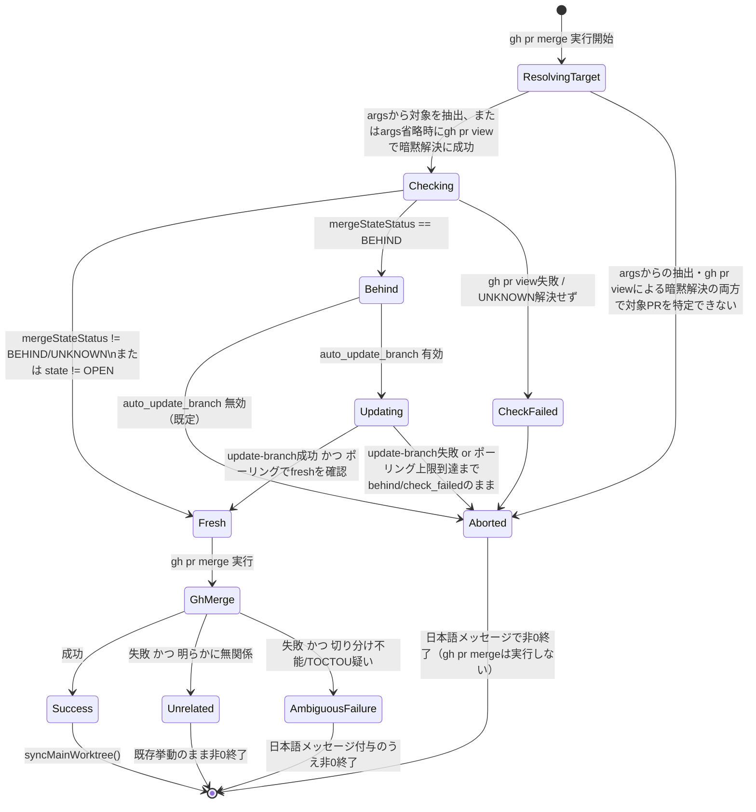

# DESIGN: pr merge が base branch の最新性を保証せず、--admin 常用運用が strict_required_status_checks_policy を事実上バイパスする

- Issue: `ISSUE-493`
- 対応する SPEC: `SPEC.md`

## 要件 → 設計要素の対応表

| 要件 / AC-ID | 対応する設計要素 | 備考 |
|---|---|---|
| 要件1・AC-1 | `PrFreshnessGuard.checkFreshness()`（`gh pr view --json mergeStateStatus,...` による behind 判定） | `mergeStateStatus === 'BEHIND'` を「最新でない」の判定根拠にする |
| 要件2・AC-1 | `merge()` の分岐（既定: 中断） + `config.merge.auto_update_branch`（新設・既定 false） | オプトインしない限り最新化を試みず中断する |
| 要件3・AC-2 | `PrFreshnessGuard.attemptUpdateBranch()`（`gh api -X PUT .../pulls/{n}/update-branch` + `checkFreshness()` の固定間隔ポーリングによる完了確認、上限 `UPDATE_BRANCH_POLL_MAX_ATTEMPTS` 回・合計最大30秒） | update-branch APIは非同期（202 Accepted）のためポーリング必須（ADR-0039 Decision 3）。API呼び出し自体の失敗、およびポーリング上限到達時点で `behind`/`check_failed` のままの場合はいずれも「完了できない」として中断扱い |
| 要件4・AC-3 | `merge()` 内でのチェック呼び出し位置（`gh pr merge` 実行前・引数内容を問わず必ず実行） | チェック処理（最新性確認・最新化・再確認のロジック自体）は `--admin` 等のマージ実行オプションの値には依存しないが、`resolveMergeTarget()` は対象PR番号／URL／ブランチを特定するために `args` を解析し、`args` に対象識別子が含まれない場合は `gh pr view --json number`（cwdの現在ブランチに紐づくPRを解決する `gh` CLI標準機構）へフォールバックする。この暗黙解決も `gh pr merge` 実行前に必ず完了させ、`--admin` 等のオプションの有無で解決経路を変えない |
| 要件5・AC-4 | `PrFreshnessGuard.checkFreshness()` のエラー境界（`gh pr view` 失敗・`mergeStateStatus` が `UNKNOWN` のまま解決しない場合の扱い）。加えて `PrFreshnessGuard.resolveMergeTarget()` が `args` からの抽出・`gh pr view` によるcwdベースの暗黙解決の両方を試みても対象PRを一意に特定できず `undefined` を返す場合も本要件5・AC-4の適用範囲に含める（トレーサビリティの根拠は本表直下の注記を参照） | いずれも「チェック失敗」として中断する |
| 要件6・AC-5 | `merge()` の正常系分岐（behind でない場合は既存の `gh(['pr','merge',...args])` 呼び出し + `syncMainWorktree()` をそのまま実行） | `gh(['pr','merge',...args])` 自体は本Issue対応前と同一コードパス・同一引数で呼ぶ。`resolveMergeTarget()` の `gh pr view` フォールバックは対象PR特定のためだけに使う読み取り専用の追加呼び出しであり、`args`・`gh pr merge` 呼び出し自体は変更しない。これにより、対象識別子を省略したまま `gh pr merge --admin` をPRブランチ上で実行するという本Issueの前提運用（SPEC.mdの目的・背景節が明記する実運用）でも、cwdに紐づくPRがfreshであれば本Issue対応前と同一の結果（マージ成立）になり回帰しない |
| 要件7・AC-6・AC-7 | `MergeFailureClassifier.classifyMergeFailure(stderr: string)`（`pr-freshness.ts` 内の関数） | 既知の「明らかに無関係」な失敗のみ許可 list で除外し、それ以外は安全側で要件7側として扱う |

### `resolveMergeTarget()` が `undefined` を返す場合のトレーサビリティ注記

SPEC.mdのAC-1〜AC-7は、いずれも「対象PR番号とオプション引数を伴う」実行を前提としており、対象PR番号自体を一意に特定できないケースを直接扱うACは存在しない。一方で `gh pr merge` 自体は、対象（number/url/branch）が引数で省略された場合、現在チェックアウト中のgitブランチから対象PRを暗黙解決する機能を標準で持つ。SPEC.mdの目的・背景節が明記する実運用（PRブランチ上でPR番号を省略したまま `gh pr merge --admin` を実行するパターン）はまさにこの暗黙解決に依存しており、`resolveMergeTarget()` を `args` の解析のみで実装すると、この典型的な運用で常に `undefined` を返して要件6・AC-5が禁じる回帰を生む。したがって `resolveMergeTarget()` は、`args` から対象識別子を抽出できない場合、`gh pr view --json number` を `cwd=root` で呼び出し、`gh pr merge` と同じ「現在のブランチに紐づくPRを暗黙解決する」処理を明示的に行うフォールバックを持つ。`args` からの抽出・`gh pr view` によるcwdベースの暗黙解決の両方を試みても対象PRを一意に特定できない場合（`gh pr view` が非0終了する場合を含む）に限り、要件5が定める「最新性の確認処理自体が失敗した場合」の一種として扱える。要件5の「確認処理自体が失敗した場合」とは、`checkFreshness()` が実行できない・完了できない状況全般を指すところ、`args`からの抽出・`gh pr view`による暗黙解決のいずれによっても確認対象となるPRそのものを一意に特定できない場合は、確認処理（`checkFreshness()`）を開始するための前提入力（対象PRの識別子）自体が欠如しており、確認処理を実行できないという点で、`gh pr view` 失敗や `mergeStateStatus` が `UNKNOWN` のまま解決しない場合と同じ「確認処理自体が失敗した場合」に該当する。したがって `resolveMergeTarget()` が `undefined` を返すケースは、SPEC.mdの新たなACを追加することなく、要件5・AC-4の適用範囲内として扱う設計判断とする。`merge()` は `resolveMergeTarget()` が `undefined` を返した場合、`checkFreshness()` を呼ばずに要件5・AC-4と同一の中断処理（終了コード1以上・日本語エラーメッセージ、`gh pr merge` は実行しない）へ進む。

## 責務・境界

### コンポーネント構成

- `PrFreshnessGuard`（新設 `src/lib/pr-freshness.ts`）: 対象PRのhead/base最新性判定・オプトイン時の最新化試行のみを担う。`gh pr view`／`gh api` 以外の外部呼び出しを持たない。
  - `resolveMergeTarget(args: string[], root: string): string | undefined` — まず `gh pr merge` の `args` から対象PR（番号／URL／ブランチ）を、`gh pr merge --help` が定義する値取り型オプション（`-A/--author-email`・`-b/--body`・`-F/--body-file`・`-t/--subject`・`--match-head-commit`・`-R/--repo`〔`gh` 共通の inherited flag〕）の次要素を除外したうえで抽出する。`args` から対象識別子が見つからない場合、`gh pr merge` 自体が対象省略時に現在のgitブランチから対象PRを暗黙解決する標準動作と同じ状況にあるため、`gh pr view --json number` を `cwd=root` で1回呼び出し、現在チェックアウト中のブランチに紐づくPR番号を暗黙解決するフォールバックを行う（`checkFreshness()` とは別の、対象特定専用の呼び出し）。`args` からの抽出・`gh pr view` フォールバックのいずれによっても対象を特定できない場合（`gh pr view` が非0終了する場合を含む）にのみ `undefined` を返し、呼び出し元（`merge()`）は要件5・AC-4の中断処理として扱う（対象PRを一意に特定できないため確認処理自体を開始できない場合であり、なぜこれが要件5・AC-4の範囲内と言えるかの根拠は「要件7・AC-6・AC-7」行直下の「`resolveMergeTarget()` が `undefined` を返す場合のトレーサビリティ注記」を参照）。
  - `checkFreshness(root, target): FreshnessResult` — `gh pr view <target> --json number,state,baseRefName,headRefName,mergeStateStatus` を呼ぶ。`state !== 'OPEN'` なら `status: 'not_applicable'`（後続の `gh pr merge` に既存挙動のまま委ねる。AC-6が扱う「明らかに無関係な失敗」入口）。`mergeStateStatus === 'UNKNOWN'` の間は短い間隔（バックオフ付き、上限5回・合計待機を数秒程度に収める）で再問い合わせし、それでも解決しなければ `status: 'check_failed'`。`gh pr view` 自体が非0終了した場合も `status: 'check_failed'`。`mergeStateStatus === 'BEHIND'` なら `status: 'behind'`。それ以外は `status: 'fresh'`。
  - `attemptUpdateBranch(root, prNumber): UpdateResult` — `gh api -X PUT repos/:owner/:repo/pulls/{prNumber}/update-branch` を呼ぶ。この呼び出し自体が非0終了（コンフリクト等）した場合は即 `status: 'failed'`。update-branch API は非同期実行（202 Accepted）であり、GitHub側の反映完了は呼び出し直後には確定しないため（ADR-0039 Decision 3）、API呼び出し成功後は `checkFreshness()` を固定間隔でポーリングして完了を確認する: 定数 `UPDATE_BRANCH_POLL_INTERVAL_MS = 3000`（3秒間隔）・`UPDATE_BRANCH_POLL_MAX_ATTEMPTS = 10`（最大10回、合計最大30秒）を用い、`status: 'fresh'` になった時点で即座に `status: 'updated'` を返す。ポーリング中に得られる `status` が `'behind'`・`'check_failed'`（`UNKNOWN` が `checkFreshness()` 内部の短期リトライでも解決しない場合を含む）のいずれであっても「まだ反映されていない」とみなして次のポーリング間隔まで待機し再問い合わせを続ける（`UNKNOWN` 系列に限定しない）。`UPDATE_BRANCH_POLL_MAX_ATTEMPTS` 回に達しても `fresh` にならない場合は `status: 'failed'` を返し、呼び出し元（`merge()`）が要件3/AC-2の中断処理（日本語エラーメッセージ付きで非0終了、`gh pr merge` は実行しない）へ委ねる。
  - `MergeFailureClassifier.classifyMergeFailure(stderr: string): 'unrelated' | 'ambiguous'` — 既知の「最新性と明らかに無関係」なパターン（例: 権限不足・PRが既にマージ済み・既にクローズ済みを示す文言）にのみ一致した場合 `unrelated` を返し、それ以外は安全側で `ambiguous` を返す。
- `pr merge` コマンド（既存 `src/commands/pr.ts` の `merge()`）: `merge.autonomous` 確認・`PrFreshnessGuard` の呼び出し・`gh pr merge` 実行・`MergeFailureClassifier` によるエラーメッセージ補完・`syncMainWorktree()` の呼び出し順序を制御する調整役。各処理自体のロジックは自身に持たない。
- `config`（`.agent-skill-chain/schemas/config.schema.yaml` + `src/lib/config.ts` + `.agent-skill-chain/config/agent-skill-chain.yaml`）: 新設の任意フィールド `merge.auto_update_branch: boolean`（既定=未設定は false 相当、後方互換の任意項目として追加し既存設定ファイルを不正にしない）を保持する。
- GitHub API（外部システム）: `gh pr view --json mergeStateStatus` と `gh api -X PUT .../update-branch`。

### 依存関係

```text
merge()（src/commands/pr.ts） → PrFreshnessGuard.resolveMergeTarget/checkFreshness → gh pr view → GitHub API
merge()                        → PrFreshnessGuard.attemptUpdateBranch（config.merge.auto_update_branch有効時のみ）→ gh api update-branch → GitHub API
merge()                        → gh pr merge（既存、透過）→ GitHub API
merge()                        → MergeFailureClassifier.classifyMergeFailure（gh pr merge失敗時のみ）
merge()                        → syncMainWorktree()（既存、gh pr merge成功時のみ）
```

循環依存は無い（`PrFreshnessGuard` は `merge()` に依存しない一方向）。責務は「最新性判定・最新化」（`PrFreshnessGuard`）と「呼び出し順序の制御・既存の自動化確認/同期」（`merge()`）に分離しており、単一コンポーネントへの責務集中は無い。

### 図示要否の判断

- 判断: `要`
- 根拠: 依存関係が3つ以上（`PrFreshnessGuard`・`gh pr merge`・`MergeFailureClassifier`・`syncMainWorktree`・GitHub API）、かつ `mergeStateStatus` の状態遷移が `UNKNOWN → {fresh|behind|check_failed}` → （オプトイン時）`behind → {updated|failed}` と2つ以上あるため。



## 関連ADR

```yaml
related_adrs:
  - id: ADR-0039
    relation: adopts
```

## 障害・ロールバック考慮

- 想定される失敗モード:
  - `args` に対象識別子が含まれず、かつ `gh pr view` によるcwdベースの暗黙解決も失敗する（現在のブランチに紐づくPRが存在しない等、AC-4で中断）。
  - `gh pr view` がネットワーク断・権限不足で失敗する（AC-4で中断）。
  - `mergeStateStatus` が `UNKNOWN` のまま解決しない（GitHub側の計算未完了、AC-4で中断）。
  - `auto_update_branch` 有効時に `update-branch` API がコンフリクトで失敗する（AC-2で中断）。
  - `auto_update_branch` 有効時に `update-branch` API 自体は成功したが、GitHub側の反映が `UPDATE_BRANCH_POLL_MAX_ATTEMPTS` 回のポーリング（合計最大30秒）を超えて完了しない（コンフリクトではなく単なる反映遅延の可能性を含め、区別せず安全側でAC-2の中断扱いにする）。
  - チェック通過後、`gh pr merge` 実行までの間に別マージが成立し `gh pr merge` 自体が失敗する（AC-7、TOCTOU）。
  - `MergeFailureClassifier.classifyMergeFailure` が実際には無関係な失敗を `ambiguous` と誤分類する（安全側であり、余分な日本語メッセージが付くだけで既存の終了コード・`gh` 標準エラー出力自体は変更されないため実害は限定的）。
- ロールバック手順: 本Issue対応はすべて `src/commands/pr.ts`・新設 `src/lib/pr-freshness.ts`・config スキーマの追加項目に閉じる。問題が生じた場合は当該PRの変更を revert すれば `merge()` は本Issue対応前の「引数を透過して `gh pr merge` を呼ぶだけ」の挙動に戻る。`merge.auto_update_branch` は新設の任意項目のため、既存設定ファイルへの影響は無い。
- 影響を受ける既存機能: `agent-skill-chain pr merge` コマンドのみ。`pr create`・`syncMainWorktree()` 自体のロジック・`merge.autonomous` の既存確認処理は変更しない。
