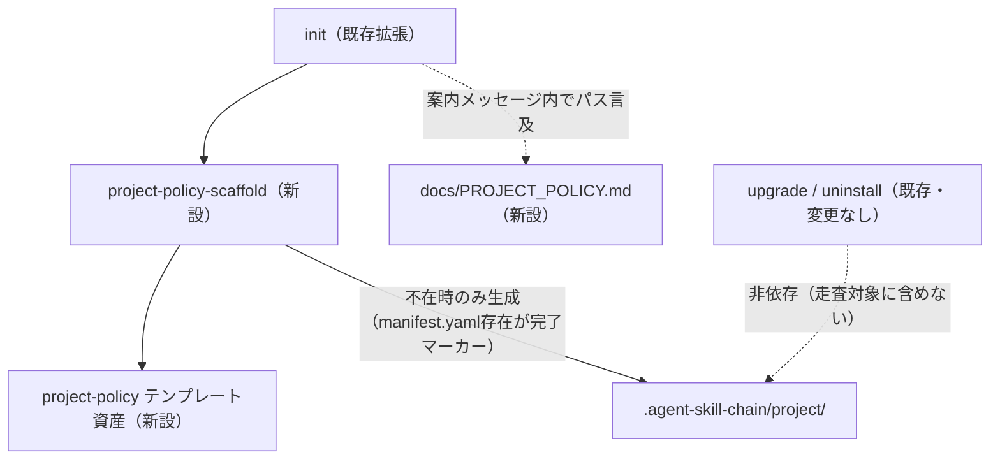

# DESIGN: consumer project固有ポリシー（`.agent-skill-chain/project/`）の作成導線・雛形が皆無で導入時に設定方法が分からない

- Issue: `ISSUE-586`
- 対応する SPEC: `SPEC.md`

## 要件 → 設計要素の対応表

| 要件 / AC-ID | 対応する設計要素 | 備考 |
|---|---|---|
| 要件1・要件6 / `AC-1`, `AC-6` | `src/lib/project-policy-scaffold.ts`（新設）＋ `.agent-skill-chain/templates/project-policy/`（新設テンプレート資産）＋ `src/commands/init.ts`（既存拡張） | `init` 実行時に `.agent-skill-chain/project/manifest.yaml` が既に存在する場合は完全no-opとし、要件6（再実行時の非上書き）を満たす |
| 要件2 / `AC-2` | `.agent-skill-chain/templates/project-policy/manifest.yaml`（新設テンプレート）＋ 既存 `src/lib/schema.ts` の `project-policy` バリデータ | テンプレートは `project.id` のプレースホルダ置換後、`.agent-skill-chain/schemas/project-policy.schema.yaml` の必須フィールドを過不足なく満たす内容にする |
| 要件3 / `AC-3` | 既存 `src/lib/asset-manifest.ts` の `NAMESPACED_ENTRIES`（`project` を含まない、変更なし）＋ `project-policy-scaffold` が生成ファイルを所有権記録へ登録しない設計 | `upgrade` は `.agent-skill-chain/project/` の存在自体を認識しないため、既存の不可侵の不変条件は変更を要さず維持される |
| 要件4 / `AC-4` | 同上（`src/commands/uninstall.ts` は変更しない） | `uninstall` も同じ理由で `.agent-skill-chain/project/` を保持する既存動作を維持する |
| 要件5 / `AC-5` | `docs/PROJECT_POLICY.md`（新設文書） | `manifest.yaml`・`RULES.md` の完結した最小具体例を自己完結して記載する |

## 責務・境界

### コンポーネント構成

- `project-policy-scaffold`（新設 `src/lib/project-policy-scaffold.ts`）: `.agent-skill-chain/project/manifest.yaml` の存在検査を行い、不在の場合にのみ `project-policy テンプレート資産` を読み込み、`project.id` のプレースホルダ（`__PROJECT_ID__`）を導入先ディレクトリ名（`path.basename(targetDir)`）へ置換した上で `manifest.yaml`・`RULES.md` の2ファイルを書き込む。この2ファイルは常に対で扱い、`manifest.yaml` の存在を「scaffold適用済み」の唯一のシグナルとする（書込み順序は `RULES.md` → `manifest.yaml` とし、後者の存在を完了マーカーとして扱う）。生成したファイルパスは `src/lib/ownership-record.ts` が管理する所有権記録へ一切登録しない。`--dry-run` 時はファイル書込みを行わず、作成予定または「既存のため変更なし」のいずれかを表す計画結果のみを返す。
- `project-policy テンプレート資産`（新設 `.agent-skill-chain/templates/project-policy/manifest.yaml`・`.agent-skill-chain/templates/project-policy/RULES.md`）: `.agent-skill-chain/schemas/project-policy.schema.yaml` の必須フィールド（`schema_version`・`project.id`/`policy_version`・`documents.common`/`roles`・`precedence.level`/`overrides`・`constraints.may_override_core_invariants`/`unregistered_documents_are_normative`）を過不足なく満たすコメント付き雛形と、それに対応する `RULES.md` の記述例を保持する読み取り専用のソース。`.agent-skill-chain/templates/` 配下に置かれるため配布物としては通常どおり導入先へコピーされるが、この内容が生成先 `.agent-skill-chain/project/` へ機械的に反映される経路は `project-policy-scaffold` のみである。既存の `NAMESPACED_ENTRIES`（`src/lib/asset-manifest.ts` が `collectManagedAssetMappings` の走査対象として定義する名前空間一覧）には `project-policy/` を追加しない。そのため `upgrade` のミラー同期・`init` の管理対象アセット複製のいずれの対象にもならず、生成先である `.agent-skill-chain/project/` への波及を構造的に断つ。
- `init`（既存 `src/commands/init.ts` の拡張）: 既存の管理対象アセット複製処理が完了した後段で `project-policy-scaffold` を1回呼び出す。呼び出し結果（作成した／既存のため変更しなかった）を実行結果一覧へ追記する。実行結果に関わらず、`docs/PROJECT_POLICY.md` とスキーマパス（`.agent-skill-chain/schemas/project-policy.schema.yaml`）への案内文言を summary へ必ず追加する。
- `docs/PROJECT_POLICY.md`（新設文書）: `.agent-skill-chain/project/` の目的・対象・スキーマ必須フィールドの解説・`manifest.yaml` と `RULES.md` を組み合わせた完結した最小具体例・`upgrade`/`uninstall` が `project/` へ不可侵/保持である既存の不変条件（由来として `AGENTS.md` を挙げる）を自己完結して記載する。

### 依存関係

- `init` → `project-policy-scaffold`（呼出し）
- `project-policy-scaffold` → `project-policy テンプレート資産`（読み取り専用）
- `init` → `docs/PROJECT_POLICY.md`（案内メッセージ内でのパス言及。コード依存ではなくテキスト参照）
- `upgrade`/`uninstall`（既存、コード変更なし）は `.agent-skill-chain/project/` を走査・参照しない（非依存を維持することが本設計の中心的制約）

```text
init → project-policy-scaffold → project-policy テンプレート資産 → .agent-skill-chain/project/(生成)
init → docs/PROJECT_POLICY.md（テキスト参照のみ）
upgrade/uninstall（既存） -- 非依存（.agent-skill-chain/project/ を走査しない） --> .agent-skill-chain/project/
```

### 図示要否の判断

- 判断: `要`
- 根拠: 新設・変更対象のコンポーネントが `project-policy-scaffold`・`project-policy テンプレート資産`・`init`（拡張）・`docs/PROJECT_POLICY.md` の4つで責務境界が3つ以上あり、依存関係も `init→scaffold`・`scaffold→テンプレート資産`・`init→docs` の3本以上ある。いずれの基準にも該当するため図示を必須とする。



## 関連ADR

```yaml
related_adrs:
  - id: ADR-0042
    relation: adopts
```

`ADR-0042-project-policy-scaffold-outside-managed-asset-system.md` は本Issue起票時点で `status: proposed` である。AGENTS.md「ADR・テンプレート・テスト適用性」節が定めるADRライフサイクル（`proposed → accepted`、設計ゲート承認時にfinalizationワーカーがwriter lease取得の上statusのみ更新）に従い、本design-gateの承認をもって `status: accepted` へ更新する手続きが必要になる。この更新作業自体は本design-gate承認後にfinalizationワーカーが行うものであり、本DESIGN.mdの作成（design_worker、writer lease保有）では実施しない。

## 障害・ロールバック考慮

- 想定される失敗モード:
  - (a) `init` 実行中にプロセスが中断され、`RULES.md` のみ書込み済みで `manifest.yaml` が未書込みの中途半端な状態が残るケース。書込み順序を `RULES.md` → `manifest.yaml` とし、`manifest.yaml` の存在を「scaffold適用完了」の唯一のゲート条件とすることで、再実行時にこの不完全状態を検知し両ファイルを再生成できる（`manifest.yaml` が存在しない限り常に両方を(再)生成する設計のため、中途半端な状態を放置しない）。
  - (b) プレースホルダ置換（`__PROJECT_ID__` → `path.basename(targetDir)`）の結果が空文字列や意味の薄い値になるケース（例: 導入先パスの末尾がセパレータのみ等の特殊な入力）。`.agent-skill-chain/schemas/project-policy.schema.yaml` の `project.id` は `type: string` のみを要求するため schema 検証自体は通るが、意味のある識別子にはならない。この場合でも導入処理自体は継続し、`docs/PROJECT_POLICY.md` 内に「`project.id` は導入後に手動で書き換えてよい」旨の注記を含めることで対処する（schema違反にはならないため実装は追加の分岐を持たない）。
- ロールバック手順: 生成される `.agent-skill-chain/project/manifest.yaml`・`RULES.md` は通常のGit管理下ファイルであり、所有権記録・`.installed_version` など他の永続状態に一切登録されない。不要な場合は `git rm` または手動削除だけで完全に取り除ける。取り除いた後に `init` を再実行すれば、既存の存在検査ゲート（`manifest.yaml` 不在時のみ生成）により同じ雛形が再生成される。
- 影響を受ける既存機能: `init` のみ。`upgrade`・`uninstall` は `NAMESPACED_ENTRIES` 定数（`src/lib/asset-manifest.ts`）を変更せず、生成された `.agent-skill-chain/project/` 配下ファイルを所有権記録へ登録しないため、コード変更なしで既存の不可侵・保持の不変条件が維持される（回帰確認は `PLAN.md` の変更単位5で扱う）。
