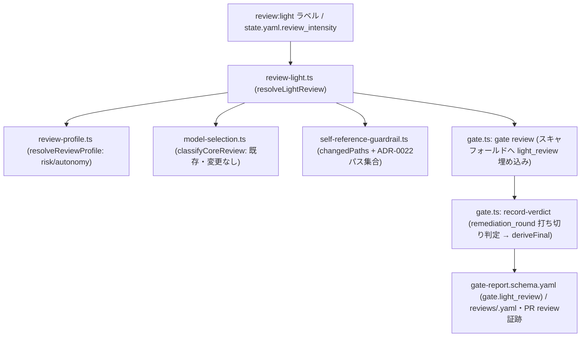

# DESIGN: review:light ラベルによる軽量レビュープロファイルの導入

- Issue: `ISSUE-449`
- 対応する SPEC: `SPEC.md`

## 要件 → 設計要素の対応表

| 要件 / AC-ID | 対応する設計要素 | 備考 |
|---|---|---|
| 要件1・AC-2・AC-12 | `review:light` ラベル（GitHub）／`state.yaml.review_intensity`（ローカル）、`src/lib/review-light.ts` の `LIGHT_REVIEW_LABEL` | `size:quick`（`src/lib/quick-mode.ts`）とは別モジュール・別フィールドで独立 |
| 要件2・AC-3 | `src/lib/review-light.ts` の `resolveLightReview()` が既存 `classifyCoreReview()`（`src/lib/model-selection.ts`）を呼び出し | 新規ロジックを作らず既存のcore_review判定を再利用 |
| 要件3・AC-4 | `src/lib/review-profile.ts`（新規抽出）の `resolveReviewProfile()` を `resolveLightReview()` が参照 | 既存I8ロジック（risk/autonomy）の唯一の実装箇所に統一 |
| 要件4・AC-5 | `src/lib/self-reference-guardrail.ts`（新規抽出、`quick-mode.ts` の `GUARDRAIL_PATHS`/`changedPaths` を移設） | ADR-0022と同一パス集合を`quick-mode.ts`・`review-light.ts`が共有し重複させない |
| 要件5 | `resolveLightReview()` の `applied` 判定、`gate reviewer-prompt` の light向けルーブリック追記 | Strict強制条件（要件2〜4）に該当しない限りStandard相当の1体レビュー |
| 要件6・AC-8 | `gate.ts` の `record-verdict` に追加する打ち切り強制ロジック、`light_review.remediation_round` | `deriveFinal()` 既存の `inconclusive → human_required` 経路を再利用 |
| 要件7・AC-6、要件8・AC-7 | `gate reviewer-prompt` のlight向けルーブリック追記（hybrid検証） | severityはレビュア判定のため機械的完全検証はしない設計判断（下記「未検証で許容する範囲」） |
| 要件9・AC-9 | `resolveLightReview()` の付与主体未確認時フォールバック | `size:quick`の`gh`未認証時フォールバック（`quick-mode.ts:89-104`相当）と同型 |
| 要件10・AC-11 | `resolveLightReview()` の入力を「ラベル／state.yamlフィールド／変更差分パス集合」のみに限定 | 成果物内容を読まない。要件4のパス集合参照は差分パスのみで内容非依存のため抵触しない |
| 要件11・AC-10 | `.agent-skill-chain/schemas/gate-report.schema.yaml` に追加する `gate.light_review` プロパティ | `requested`・`applied`・`disabled_reasons`・`remediation_round` |
| 要件12・AC-1 | `light_review` はgate-report/state.yamlどちらも既存必須項目に追加しない任意プロパティ | 未指定時は`resolveLightReview()`が`requested=false`を返し既存経路を素通り |
| 要件13・AC-13 | 変更なし（既存の`human_confirmation.before_implementation`・`merge.autonomous`実装に一切触れない） | 新規コード・スキーマ変更が対象外設定を参照/変更しないことを設計レベルで保証 |
| ラベル定義 | `.agent-skill-chain/templates/github/provisioning/labels.yaml` に `review:light` 追加 | `setup-labels.sh`経由で反映 |
| 正本文書更新 | `AGENTS.md` §4セグメント・4ゲート の「レビュープロファイル」記述にLightを追加 | この変更自体が要件4のガードレール対象パスに該当し、本Issue自身がStrict強制される（自己整合） |

## 責務・境界

### コンポーネント構成

- `src/lib/review-profile.ts`（新規）: risk/autonomyラベルまたは`state.yaml`から`standard | strict`を導出する唯一の実装。既存 `gate.ts` 内の1箇所のインライン式（trusted-gate再構築コンテキスト）をこの関数呼び出しへ置換し、I8ロジックの実装箇所を1つに集約する。
- `src/lib/self-reference-guardrail.ts`（新規、`quick-mode.ts`から抽出）: ADR-0022が定義する自己参照ガードレール対象パス（`docs/adr/`・`.agent-skill-chain/config/segments.yaml`・`AGENTS.md`・`.agent-skill-chain/schemas/`）の判定と、base差分＋作業ツリー差分を合成する`changedPaths()`を提供する。`quick-mode.ts`と`review-light.ts`の両方から利用され、パス集合の二重管理を避ける。
- `src/lib/review-light.ts`（新規）: `review:light`ラベル／`review_intensity`フィールドの読み取り、`resolveReviewProfile()`・`classifyCoreReview()`・`self-reference-guardrail`の3判定を合成した`resolveLightReview()`、および直前ラウンドの`gate-report`（`reviewFilePath()`が指す既存のスクラッチ／コミット済みファイル）から`remediation_round`を導出するロジックを持つ。`quick-mode.ts`と同じ「シグナル未読取・差分未解決は非適用」という安全側フォールバック方針を踏襲する。
- `src/commands/gate.ts`（既存、拡張）: `gate review`スキャフォールド生成時に`resolveLightReview()`の結果を`gate.light_review`へ埋め込み、`record-verdict`で`light_review.applied && remediation_round > LIGHT_REVIEW_MAX_REMEDIATION_ROUNDS && (hasBlocking || fail)`のとき`inconclusive`を強制してから既存の`deriveFinal()`へ渡す。
- `.agent-skill-chain/schemas/gate-report.schema.yaml`（既存、拡張）: `gate.light_review`（任意プロパティ）を追加。
- `.agent-skill-chain/schemas/state.schema.yaml`（既存、拡張）: `review_intensity: light | full`（既定`full`）を追加。既存必須項目（`required`配列）は変更しない。
- `.agent-skill-chain/templates/github/provisioning/labels.yaml`（既存、拡張）: `review:light`ラベル定義を追加。
- `gate reviewer-prompt`（既存コマンドの出力テキスト、拡張）: `light_review.applied === true`のときのみ、AC未達＝常時blocking／セキュリティ・データ喪失・互換性破壊・不変条件違反＝自動blocking昇格／その他のwarning以下は対応必須としない、という3行のルーブリックを追記する。

### 依存関係



### 図示要否の判断

- 判断: 要
- 根拠: 依存関係が3つ以上（`review-light.ts`から`review-profile.ts`・`model-selection.ts`・`self-reference-guardrail.ts`への3方向依存）かつ責務境界となるコンポーネントが3つ以上（`review-light.ts`・`self-reference-guardrail.ts`・`review-profile.ts`・`gate.ts`拡張）に該当するため、mermaidで依存関係を明示した。

## 関連ADR

```yaml
related_adrs:
  - id: ADR-0022
    relation: references
```

`ADR-0022`（quickモードの成果物免除シグナル）は`accepted`済みであり、本設計が踏襲する「成果物非依存の調整状態プリミティブ」「自己参照ガードレール」というパターンの直接の先例として参照する。本Issue自身の決定（軽量シグナルの独立軸化・打ち切り基準の具体値）は新規ADR（`docs/adr/ADR-0031-review-light-signal-and-remediation-cutoff.md`、`status: proposed`）に記録する。

## 障害・ロールバック考慮

- 想定される失敗モード1: `review-light.ts`の実装不備により、Strict強制条件（要件2〜4）に該当するにもかかわらず`applied=true`を返す。
  - 対応: `resolveLightReview()`は3判定（`resolveReviewProfile`・`classifyCoreReview`・self-reference-guardrail）のいずれかがStrict相当を示した場合に`applied=false`を返す論理積として実装し、単体テストで3条件それぞれの単独該当ケースを網羅する。仮に見落としがあっても、`record-verdict`はAC-6/AC-7（AC未達・不変条件違反等の自動blocking昇格）を独立して適用するため、軽量プロファイルの誤適用が直ちに承認漏れへ波及しない多層防御になる。
- 想定される失敗モード2: `remediation_round`のスクラッチ格納先（GitHubモードでは`os.tmpdir()`配下、Issue #399の既存方針を踏襲）が失われる（別マシン・別セッション・tmpdir clear）。
  - 対応: 直前ラウンドの記録を読めない場合は`remediation_round = 0`から再開する。これは打ち切りまでの許容ラウンド数が実質1回分増えるだけであり、AC-6/AC-7のblocking自動昇格・AC-9の付与主体未確認フォールバックには一切影響しない。速度上の利益が一時的に目減りするだけで安全性は損なわれない（許容するトレードオフとして`docs/adr/ADR-0031-...`に明記する）。
- 想定される失敗モード3: `resolveLightReview()`のcore_review／guardrail判定が差分取得エラー等で`unresolved`を返す。
  - 対応: `classifyCoreReview()`は既存実装が`unresolved`時に`required: true`を返す（安全側）ため、そのまま`applied=false`に反映される。`self-reference-guardrail`側も`changedPaths()`が差分未解決を示す場合は`quick-mode.ts`と同じ規約で非適用に倒す。
- ロールバック手順: `light_review`はgate-report/state.yamlいずれも任意プロパティであり、`review:light`ラベル・`review_intensity`フィールドを一切付与しなければ既存の判定経路（AC-1で保証）へ完全に戻る。ロールバックは本変更のrevertのみで足り、既存Issueへのマイグレーションは不要。
- 影響を受ける既存機能: `gate.ts`の`materialize-check-report`パス（1736行付近の`profile`算出インライン式）を`resolveReviewProfile()`呼び出しへ置換するため、当該関数の単体テストで既存のrisk/autonomy判定結果が変化しないことを回帰確認する。

## 未検証で許容する範囲（設計判断）

要件7（AC-6）・要件8（AC-7）はSPEC.mdで検証方法見込みが`hybrid`と明示されている。`severity`（blocking/warning/info）はレビュア（AI/人間）が判定する自由記述領域であり、「この指摘がAC未達を意味するか」「セキュリティ/データ喪失/互換性破壊/不変条件違反に該当するか」を`code`・`evidence`のテキストから機械的に確定する手段は存在しない（誤検知・見落としの双方でキーワード照合は不適切）。したがって本設計は機械的なseverity書き換えを行わず、`gate reviewer-prompt`のルーブリック強化（レビュア向け指示の明確化）に留める。AC-6/AC-7の充足は、design-gate・implementation-gate自体のレビュアによる`gate reviewer-prompt`出力の内容確認（hybrid）で担保する。
