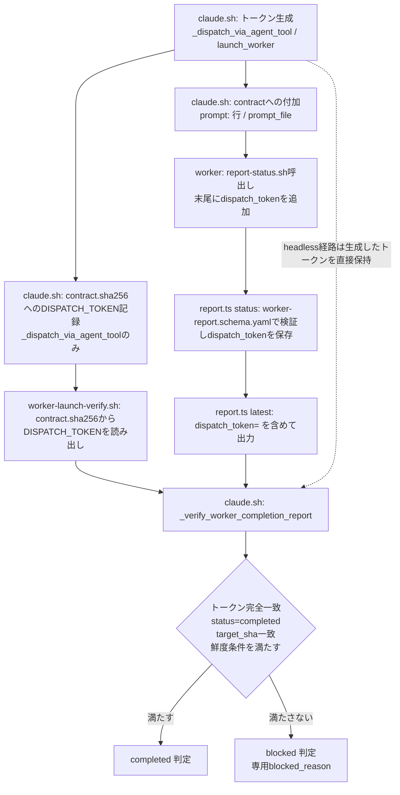

# DESIGN: worker完了報告の照合がタイムスタンプ比較のみに依存し、target_shaが変化しない再試行で無関係な過去サイクルの報告を誤って完了根拠として採用しうる

- Issue: `ISSUE-661`
- 対応する SPEC: `SPEC.md`

## 要件 → 設計要素の対応表

| 要件 / AC-ID | 対応する設計要素 | 備考 |
|---|---|---|
| `AC-1`（dispatchサイクルごとの一意なトークン発行） | `_dispatch_via_agent_tool`のトークン生成（`.agent-skill-chain/adapters/claude.sh`）、`launch_worker`のトークン生成（同ファイル） | 既存の`mktemp`ベースのランダム性を再利用し、新規の乱数生成器を追加しない |
| `AC-2`（contractへのトークン機械的付加） | Agent tool dispatchの`prompt:`行への追記（claude分岐・codex分岐）、headless起動経路の`prompt_file`内容への追記 | `config/roles.yaml`の`role_contracts.*.completion`・`src/commands/segment.ts`の`buildCompletionReportBlock`は変更しない（AC-7） |
| `AC-3`（完了報告へのトークン保持・読み出し） | `.agent-skill-chain/schemas/worker-report.schema.yaml`への任意フィールド追加、`src/commands/report.ts`の`status()`・`latest()` | 既存の`status=`/`target_sha=`/`created_at=`抽出パターンとの後方互換を保つ追加行 |
| `AC-4`（トークン完全一致が完了根拠の必須条件） | `_verify_worker_completion_report`（`.agent-skill-chain/adapters/claude.sh`）へのトークン照合追加 | 既存のstatus/target_sha/created_at判定に追加する形で実装する |
| `AC-5`（target_sha不変の再試行での過去サイクル誤採用防止） | 同上（`_verify_worker_completion_report`）＋`.agent-skill-chain/scripts/worker-launch-verify.sh`の`contract.sha256`読み出し | dispatchサイクルごとに新しいトークンが発行されるため、target_shaが同一でもトークン不一致で機械的に拒否される |
| `AC-6`（トークン欠落・不一致はblocked） | 同上（`_verify_worker_completion_report`の新しい判定分岐と専用blocked_reason文言） | 既存の3分岐（未報告／鮮度不足／status・sha不一致）と独立した4番目の分岐として追加する |
| `AC-7`（既存completion条件の非変更） | `config/roles.yaml`の`role_contracts.*.completion`・`worker-report.schema.yaml`の既存必須フィールドは変更しない | 新フィールドはスキーマ上任意（`required`に追加しない）、CLI引数も末尾への追加専用（既存呼び出しの位置引数を変更しない） |
| `AC-8`（ローカルモードとの整合） | `report.ts`の`latest()`ローカル分岐（`reportFilePath`直接読み） | GitHub/ローカルとも`_verify_worker_completion_report`という単一の照合ロジックを共有し、モード固有の追加ロジックを持たない |

## 責務・境界

### コンポーネント構成

- `.agent-skill-chain/schemas/worker-report.schema.yaml`: worker報告の固定スキーマ。任意プロパティ`dispatch_token`（文字列）を追加する。既存の`required`・他プロパティは変更しない。
- `src/commands/report.ts`（`status()`）: `report status`サブコマンドの実装。既存の位置引数`issue_id role segment status target_sha [blocked_reason] [human_escalation_requested]`の**末尾に**任意の8番目の位置引数`dispatch_token`を追加する。値が与えられた場合のみ`WorkerReport.dispatch_token`へ設定し、スキーマ検証にかける。
- `src/commands/report.ts`（`latest()`）: `report latest`サブコマンドの実装。既存の`status=`/`target_sha=`/`created_at=`出力に加え、`dispatch_token=<値または空文字>`を追加の1行として出力する（ローカル・GitHub両モード共通）。
- `.agent-skill-chain/adapters/claude.sh`（トークン生成）: `_dispatch_via_agent_tool`と`launch_worker`（headless起動経路）が、各々の起動サイクル開始時点で一意なdispatchトークンを1つ生成する責務を持つ。両者とも生成方式は`mktemp`のランダムサフィックス機構を再利用し、暗号論的な強度は要求しない（SPEC.mdスコープ外）。
- `.agent-skill-chain/adapters/claude.sh`（contractへの付加）: 生成したトークンの具体的な値と、`report-status.sh`実行時に末尾の追加引数として渡すべきことを指示する一文を、workerへ実際に配達される文字列（Agent tool dispatchでは`prompt:`行、headlessでは`prompt_file`の内容）へ追記する責務を持つ。`config/roles.yaml`の`role_contracts.*.completion`本文・`buildCompletionReportBlock`が生成する既存の`report-status.sh`コマンド例文自体は変更しない（既存指示への上乗せ、AC-7）。
- `.agent-skill-chain/adapters/claude.sh`（`_verify_worker_completion_report`）: 完了報告の唯一の照合ロジック。既存の引数（`issue_id role segment started_at`）に加え、5番目の引数として`expected_dispatch_token`を受け取る。既存の未報告判定・鮮度判定・status/target_sha判定に加え、`report latest`が返す`dispatch_token=`値と`expected_dispatch_token`の完全一致を新たな必須条件とする。
- `.agent-skill-chain/scripts/worker-launch-verify.sh`: Agent tool dispatch経路の完了確認スクリプト。`contract.sha256`から`DISPATCH_TOKEN`を読み出し（`DISPATCH_STARTED_AT`と同じ監査ファイルの追加キーとして）、`_verify_worker_completion_report`へ渡す。`DISPATCH_TOKEN`欠落・空は既存の`DISPATCH_STARTED_AT`欠落と同様に監査証跡不備としてblockedへ倒す。
- `docs/adr/ADR-0061-...`: 本設計の決定・トレードオフを記録する。

### 依存関係

```text
claude.sh(トークン生成) → claude.sh(contractへの付加/contract.sha256記録) → worker(report-status.sh呼出し) → report.ts(status/latest) → claude.sh(_verify_worker_completion_report)
```

下記「図示要否の判断」の該当条件を満たすため、詳細な依存関係はMermaidで図示する。

### 図示要否の判断

以下のいずれかに該当する場合、図示（Mermaid）を必須とする。該当しない単純な一段の変更では図を強制しない。

- 依存関係（コンポーネント間・外部システム含む）が3つ以上ある
- 状態遷移が2つ以上ある
- 責務境界（コンポーネント）が3つ以上ある

該当する場合は、本ファイル中に ```mermaid フェンス（`graph`・`stateDiagram-v2` 等の軽量記法）で依存関係・状態遷移を記載する。該当しない場合も、判断根拠（該当なしの理由）を必ず記載する。

- 判断: `要`
- 根拠: 責務境界が3つ以上（トークン生成／contractへの付加・伝達／完了判定ロジック／監査ファイル読み出し）あり、依存関係も4つ以上（生成→付加、付加→worker報告、監査ファイル→照合、report.ts→照合）存在するため、テキスト矢印表記では追跡困難であり図示を必須とする。



## 設計判断の詳細

### トークンの生成方式（AC-1）

- `_dispatch_via_agent_tool`は既存の`dispatch_temp_dir="$(mktemp -d "$temp_base/agent-skill-chain-worker-dispatch.XXXXXX")"`が生成する一意なディレクトリ名の`basename`をそのままdispatchトークンとして再利用する（SPEC.mdの由来Issue本文が示す実現方針と一致）。新規の乱数生成コードを追加せず、既存のOSレベルの`mktemp`一意性保証にそのまま乗る。
- `launch_worker`（headless起動経路）はdispatch_temp_dirに相当する永続ディレクトリを作らないため、同じ命名規則（`agent-skill-chain-worker-dispatch.XXXXXX`）で`mktemp -u`（ディレクトリを作らずファイル名のみ生成）を用いて同形式のトークンを生成する。生成タイミングは既存の`worker_started_at`取得と同じ箇所（workerサブプロセス起動直前）とする。
- 両経路とも、同一Issue・同一segmentに対する別サイクル（過去または並行）で発行されたトークンと偶然一致する確率は、`mktemp`のデフォルトエントロピー（6文字のランダムサフィックス、OSごとの乱数源）に依存する。SPEC.mdのスコープ外事項（暗号論的な強度の規定）どおり、本設計はこれ以上の強度を要求しない。

### contractへの付加方式（AC-2）

- ADR-0060により、`report-status.sh`実行指示そのもの（`role: <role>`のYAMLダンプの後に付加される`worker_completion_report:`ブロック、`src/commands/segment.ts`の`buildCompletionReportBlock`が生成）は既に確立済みであり、本Issueはこれを変更しない。
- dispatchトークンは`buildCompletionReportBlock`実行後（`segment start`呼び出し後）にしか値が定まらないため、`segment.ts`側では埋め込めない。そのため、Agent tool dispatch経路では既存の`prompt:`行（`「workerは成果物をcommit・pushした後、contractに記載されたreport-status.shによるcompleted投稿を実行してから最終応答する。」`という一文の直後）へ、具体的なトークン値と「report-status.sh実行時に末尾の追加引数として渡す」ことを明示する一文を追記する。この一文はclaude分岐・codex分岐の両方の`prompt:`行に同一内容で追加する。
- headless起動経路では、workerへ配達される唯一の文字列が`contract`（`prompt_file`の内容）そのものであるため、`prompt_file`へ書き込む直前に同内容の追記を`contract`本文の末尾へ付加する。これにより、AC-2が要求する「contract本文（またはdispatchプロンプト）」のいずれかへのトークン埋め込みを、経路ごとに存在する実際の配達物へ確実に反映する。
- 既存の`report-status.sh <issue_id> <role> <segment> completed <target_sha>`という指示文言自体は変更しない。追記は独立した一文として置き、既存文言の意味を変えない（AC-7）。

### 完了報告データ構造とCLI（AC-3）

- `worker-report.schema.yaml`へ次のプロパティを追加する（`required`には含めない）。

  ```yaml
  dispatch_token:
    type: string
    description: "workerへ配達されたdispatchサイクル固有の識別子。report-status.sh呼出し時に末尾の追加引数として渡された値をそのまま保持する。"
  ```

  `schema_version`は`agent-skill-chain/worker-report/v1`のまま更新しない。理由: 本変更は既存必須フィールド・既存プロパティの意味を一切変更しない後方互換な追加（optional property追加）であり、`dispatch_token`を持たない既存の報告データ（consumer projectの既存レコード、ローカルモードの既存reportファイル）は引き続き同スキーマに適合する。`additionalProperties: false`により未知キーは依然拒否されるため、スキーマへの明示追加自体は必須だが、意味論上の破壊的変更ではないためバージョン不変とする。
- `src/commands/report.ts`の`status()`は、既存の6番目（`blocked_reason`）・7番目（`human_escalation_requested`）に続く8番目の位置引数として`dispatch_token`を受け取る。値が与えられた場合のみ`WorkerReport.dispatch_token`へ設定する（既存の`blocked_reason`/`human_escalation_requested`と同じ「値がある場合のみ含める」パターン）。値が無い呼び出し（既存の全ワーカー種別・既存テスト）は従来どおり動作する。
- `src/commands/report.ts`の`latest()`は、ローカル・GitHub両モードの出力へ`dispatch_token=<値>`（値が無い報告は空文字）を追加行として出力する。既存の`status=`/`target_sha=`/`created_at=`という行単位の`sed -n 's/^xxx=//p'`抽出パターンとの後方互換を保つ（ISSUE-658が確立した増分パターンをそのまま踏襲）。

### 完了判定ロジック（AC-4, AC-5, AC-6）

- `_verify_worker_completion_report`のシグネチャを`_verify_worker_completion_report <issue_id> <role> <segment> <started_at> <expected_dispatch_token>`へ拡張する（5番目の新規引数）。
- 既存の判定順序（未報告→鮮度不足→status/target_sha不一致）はそのまま維持し、いずれもパスした後に新しい第4の判定として次を追加する。

  ```text
  reported_token="$(sed -n 's/^dispatch_token=//p' <<<"$latest")"
  if [[ -z "$expected_dispatch_token" || "$reported_token" != "$expected_dispatch_token" ]]; then
    printf '%s\n' 'workerの報告が今回のdispatchサイクルに由来すると確認できませんでした（dispatchトークン不一致、過去サイクルの報告の可能性）'
    return 1
  fi
  ```

  `expected_dispatch_token`が空（呼び出し側の実装漏れ等）の場合も安全側でトークン不一致と同じ扱いにする（I8）。
- この判定はstatus/target_sha一致判定の**後**に置く。理由: target_sha不一致など既存の診断的理由が先に返る現状の振る舞い（診断メッセージの優先順位）を変えず、既存テストが検証する既存3分岐の文言・順序を保持したまま、トークン不一致という新しい失敗理由を追加するに留める（AC-7の「既存条件を弱化しない」の実装上の裏付け）。
- 呼び出し側の変更:
  - `launch_worker`（headless）: 生成した`dispatch_token`ローカル変数を`_verify_worker_completion_report`呼び出しの5番目の引数として渡す。
  - `worker-launch-verify.sh`: `contract.sha256`から`DISPATCH_TOKEN`を読み出し、既存の`DISPATCH_STARTED_AT`欠落チェックと同様に、欠落・空を`INTEGRITY_ERROR`として扱ってからblockedへ倒す。読み出せた場合は`_verify_worker_completion_report`へ渡す。

### ローカルモードとの整合（AC-8）

- ローカルモードは`reportFilePath`が指す1 segment 1 fileの構造を持つため、`report latest`のローカル分岐は当該ファイルをそのまま読み、`dispatch_token`フィールドが存在すればその値を、無ければ空文字を返す。GitHubモードのMARKER付きコメント検索と異なり複数サイクル分の履歴が同一ファイルに残らないが、`_verify_worker_completion_report`はモードを意識せず`report latest`の出力のみを見るため、ローカル・GitHubで判定ロジックが分岐しない。ローカルモードで「target_shaが変化しない再試行」（AC-5相当）が起きた場合も、前サイクルのファイルに残っているdispatch_tokenは新サイクルで新規生成されたトークンと一致しないため、同様にblockedへ倒れる。

## 関連ADR

```yaml
related_adrs:
  - id: ADR-0060
    relation: references
```

## 障害・ロールバック考慮

- 想定される失敗モード:
  - `worker-report.schema.yaml`へのプロパティ追加を誤って`required`に含めてしまうと、`dispatch_token`を渡さない既存呼び出し（旧バージョンのworker、`dispatch_token`未対応のconsumer project）がスキーマ検証エラーで報告自体に失敗し、AC-7（既存条件の非弱化）に違反する。実装時は`required`配列を変更しないことをテストで固定する。
  - `_verify_worker_completion_report`の新しい判定分岐を既存の3分岐より前に置いてしまうと、既存テストが期待する診断メッセージの優先順位（例: target_sha不一致メッセージが先に出るべきケース）が変わり、既存テストが偽陽性でblockedの理由文言違いにより失敗する。実装順序（4番目の判定として追加）をテストで固定する。
  - Agent tool dispatchのcodex分岐へのトークン追記を書き漏らすと、`worker_adapter=codex`のときだけ常にトークン不一致でblockedになる回帰が生じる。claude分岐・codex分岐の双方へのテストを用意する。
- ロールバック手順: 本Issueが導入する変更はいずれも既存フィールド・既存必須引数を変更しない加算的な変更であるため、`git revert`で当該PRのcommitを打ち消すだけで、`dispatch_token`を含まない旧来の完了報告・完了判定へ復帰できる。スキーマの`schema_version`を変更していないため、revert後も途中で作成された（`dispatch_token`付きの）報告データを再度読み込んでも`additionalProperties: false`エラーにはならず、単に余剰プロパティとして無視されずスキーマ側にフィールド定義が残る限り互換に読める（スキーマ自体をrevertした場合は、`dispatch_token`を含む古い報告データの再検証時にのみ`additionalProperties`エラーとなり得るが、報告データは追記専用でありrevert時点で新規検証対象になるのは新しい報告のみである）。
- 影響を受ける既存機能: `report status`/`report latest` CLI（末尾への引数追加・出力行追加のみ、既存呼び出しは非破壊）、`_verify_worker_completion_report`（ISSUE-642/ISSUE-658の既存判定ロジックを内包したまま拡張）、`worker-launch-verify.sh`（`contract.sha256`の読み出しキーが1つ増える）、`launch_worker`のheadless起動経路。`config/roles.yaml`の`role_contracts.*`・`worker-report.schema.yaml`の既存必須フィールドには影響しない。
