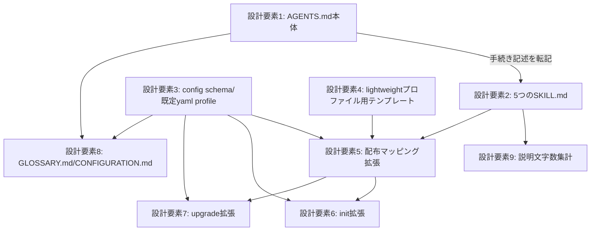

<!--
正本: AGENTS.md §4セグメント・4ゲート
このファイルは Issue 毎に複製して使う雛形である（セグメント: design、成果物: DESIGN.md（PLAN.md は別ファイル）、ゲート: design-gate）。
-->

# DESIGN: ADR-0023を実装し、常時規律モデルとは別にスキル経由のオンデマンド軽量プロファイルを提供する

- Issue: `ISSUE-503`
- 対応する SPEC: `SPEC.md`

## 対象範囲・前提・用語・入力・出力

### 対象範囲

本DESIGNの対象は、ADR-0023（本Issue起票時点 `status: proposed`）のDecision 1〜5（強制層は現状維持、規範層をAGENTS.md本体〔事実と常時規則〕とSKILL.md群〔手続き〕へ分割、SKILL.mdはセグメント・役割粒度で分割し単一の巨大スキルにしない、軽量プロファイルという新規導入形態を`init`に追加、配布形式は配布元正本アセット配下のスキルテンプレート）を、`agent-skill-chain`（npm CLI）本体の配布物として実現するための設計判断である。対象は新規に `init` を実行する導入と、導入済みプロジェクトへの `upgrade` によるスキルテンプレート同期（要件3）であり、既存導入済みプロジェクトのプロファイル切替（`profile` フィールドの値を `standard`⇔`lightweight` で変更する手順）は対象外とする。consumer projectが `.agent-skill-chain/project/` に置く固有ポリシーは配布対象外のため本DESIGNの対象外とする。

### 前提

- ADR-0023（`status: proposed`）が示したDecisionを前提として実装可能な設計へ具体化する。ADR自体の `accepted` への遷移は本design-gateでのADR承認時に確定し、本DESIGNの成立はADR承認を妨げない。
- 実行環境としてClaude Codeスキル機構（`SKILL.md` フロントマター、Discovery→Activation→Executionの段階的ロード）が利用可能であることを前提とする。
- **既存実装コードの参照**: 本DESIGNは実装コードを新規に作成しないが、設計要素の実現可能性を現行実装（`src/lib/asset-manifest.ts`・`src/lib/template-sync.ts`・`src/lib/fs-copy.ts`・`src/commands/init.ts`・`src/commands/upgrade.ts`・`src/lib/legacy-migration.ts`・`.agent-skill-chain/schemas/config.schema.yaml`・`docs/CONFIGURATION.md`）の現状構造に基づいて具体化する。
- **core_review該当の明記**: 本Issueの変更差分は `.agent-skill-chain/project/manifest.yaml` の `model_selection.core_review.triggers.exact_paths`（`AGENTS.md`）および `path_prefixes`（`.agent-skill-chain/config/`・`.agent-skill-chain/schemas/`）に該当する。したがって本Issueのdesign-gateは `review_profile: strict`（専任2レビュア、`frontier_coding`・`maximum_reasoning`）が自動的に必須になる（AGENTS.md I8、`.agent-skill-chain/project/manifest.yaml`）。新設する `.agent-skill-chain/templates/claude/skills/` 配下は現行manifestの `path_prefixes` に`.agent-skill-chain/templates/github/` は含むが `.agent-skill-chain/templates/claude/` は含まないため単独では該当しないが、上記2つの該当により本Issue全体は既にstrict対象である。

### 用語

- **軽量プロファイル**: `init` 実行時に選択できる導入形態の一つ。`CLAUDE.md` から `@AGENTS.md` への常時importを行わず、`coordination.backend: local` を既定にし、`setup github`・`enforce on` に相当する強制層を適用しない。既定プロファイルと同様に `.claude/skills/` 配下へスキル群を配置する。軽量プロファイルかどうかを機械的に判定する唯一の正本は、生成される `.agent-skill-chain/config/agent-skill-chain.yaml` の新規フィールド `profile` の値が `lightweight` であることであり、`coordination.backend: local` の値のみからは判定しない（既定プロファイルのまま利用者が手動で `coordination.backend: local` を選んだ通常のローカルモードと値として区別できないため）。
- **既定プロファイル（常時規律モデル）**: `init` のプロファイル未指定時の既定動作。`CLAUDE.md` が `@AGENTS.md` を常時importし、`.claude/skills/` 配下へスキル群を配置する。`setup github`・`enforce on` は利用者が別途明示実行する任意コマンドとして提供される（既存動作通り）。生成される `.agent-skill-chain/config/agent-skill-chain.yaml` の `profile` フィールドは既定で `standard` になる。
- **強制層**: PreToolUse hook配線（`enforce on`）およびGitHub branch ruleset・label適用（`setup github`）など、規律からの逸脱を機械的に阻止する仕組み。
- **規範層**: `AGENTS.md` 本体および `SKILL.md` 群が記述する、それ自体は機械強制を伴わない規範・手続き知識。
- **手続き**: ゲート審査の進め方・worktree操作手順・ADRライフサイクル操作手順・成果物テンプレート記入手順など、実行順序や具体的操作を伴う記述。SKILL.mdへ切り出す対象。
- **事実と常時規則**: 状態や作業段階に依存せず常に成立する規範であり、`AGENTS.md` 本体に残す対象。判定基準は「特定の操作を段階的に実行する手順（何をどの順で行うか、どのコマンドをどう呼ぶか等のステップバイステップの説明）」であれば `SKILL.md` へ移す対象（「手続き」）とし、それ以外（不変条件・恒久的な事実・常に成立する制約・原則・用語の正本参照等）は `AGENTS.md` 本体に残す対象とする、というものである。

### 入力

- `init` コマンドが受け取るプロファイル指定オプション（設計要素6で `--profile=lightweight` / `--profile=standard` として確定する）。
- 導入先の対象ディレクトリのパス。
- 対象ディレクトリの既存ファイル状態（`.claude/skills/` 配下等、軽量プロファイル導入対象ファイルとの内容衝突検知に用いる）。

### 出力

- 生成される `AGENTS.md`（事実と常時規則に限定・150行以内、プロファイルを問わず引き続きroot直下へ生成・配置する正本ファイルとして存置する）・`CLAUDE.md`（軽量プロファイルでは `@AGENTS.md` の常時import記述を含まない）。
- `.claude/skills/` 配下に複製される5つの `SKILL.md`（設計要素2、Issue起票とworktree開始・セグメント作業・ゲート審査・PR作成とマージ・後片付けの各役割に対応、プロファイルを問わず常に配置）。
- 生成される `.agent-skill-chain/config/agent-skill-chain.yaml`（`coordination.backend`、および軽量プロファイルかどうかを機械的に判定する唯一の正本となる新規フィールド `profile`〔値は `lightweight` または `standard`、既定 `standard`〕を含む、設計要素3）。
- 更新される `docs/GLOSSARY.md`（「軽量プロファイル」・「既定プロファイル」の用語行を3列形式で追加、追加後も20行以内を維持）・`docs/CONFIGURATION.md`（設計要素8）。
- 標準出力メッセージ（軽量プロファイル選択時、機械的阻止が無い旨を明示する日本語メッセージ、設計要素6）。
- 衝突検知時のエラーメッセージ（衝突ファイルパスと理由を含む日本語、終了コード1以上）。
- スキル説明文の文字数集計結果を記録する成果物（設計要素9）。

（本節「対象範囲・前提・用語・入力・出力」の内容は `SPEC.md` の「目的・背景」「前提」「用語」「入力」「出力」節に基づく。SPEC.mdの承認済み内容は変更しない。）

## 要件 → 設計要素の対応表

| 要件 / AC-ID | 対応する設計要素 | 備考 |
|---|---|---|
| 要件1・AC-1 | 設計要素1（AGENTS.md本体の改定） | 判定基準の適用結果を本DESIGNが確定する |
| 要件2・AC-2 | 設計要素2（5つのSKILL.md） | 配布元正本・配置・自己完結内容を定める |
| 要件3・AC-3 | 設計要素5（配布マッピング拡張）・設計要素6（init拡張）・設計要素7（upgrade拡張） | プロファイル問わずinit新規配置・upgrade同期 |
| 要件4・AC-4 | 設計要素3（config schema `profile`）・設計要素4（lightweightプロファイル用テンプレート）・設計要素6（init拡張） | AGENTS.mdファイル自体は省略しない |
| 要件5・AC-5 | 設計要素6（init拡張・標準出力メッセージ） | 具体的文言を本DESIGNで確定する |
| 要件6・AC-6 | 設計要素6（init拡張・既定分岐は現行動作を維持） | 既定プロファイルの分岐は現行 `CLAUDE.md`・`ROOT_LEVEL_ENTRIES` を変更しない |
| 要件7・AC-7 | 設計要素1（I2セル改定）・設計要素3（`profile`が判定正本） | 「非強制性の類推」を用いない直接根拠で記述する |
| 要件8・AC-8 | 設計要素9（説明文字数集計） | レポートファイル形式で記録する |
| 要件9・AC-9 | 設計要素6のうち処理順序3（既存pre-flight方式の維持） | AC-9は衝突時非破壊方針（pre-flight維持）を指し、AC-5（標準出力メッセージ）とは別内容 |
| 要件10・AC-1 | 設計要素1（root直下許可リストへ `.claude/` 追加） | 行数増加を伴わない改定 |
| 要件11・AC-10 | 設計要素8（GLOSSARY.md・CONFIGURATION.md更新） | 20行以内を維持する具体案を示す |

## 責務・境界

### コンポーネント構成

- `設計要素1: AGENTS.md本体`: 不変条件・4セグメント/4ゲート対応・root許可リスト・I2セルを保持する規範層の正本。本Issueでは「事実と常時規則」判定基準に基づき手続き記述を除去し、`.claude/` 追加とI2セル追記のみを行う。
- `設計要素2: 5つのSKILL.md`（`.agent-skill-chain/templates/claude/skills/{issue-start,segment-work,gate-review,pr-merge,cleanup}/SKILL.md`）: セグメント・役割粒度の手続き知識の正本。実処理は持たず、既存CLIサブコマンド・スクリプトの呼び出し手順書として書く。
- `設計要素3: config schema/既定yamlの profile フィールド`（`.agent-skill-chain/schemas/config.schema.yaml`・`.agent-skill-chain/config/agent-skill-chain.yaml`）: 「軽量プロファイルかどうか」を機械的に判定する唯一の正本値を保持する。
- `設計要素4: 軽量プロファイル用テンプレート`（`.agent-skill-chain/templates/lightweight/{CLAUDE.md,agent-skill-chain.yaml}`）: 軽量プロファイル選択時に配布する `CLAUDE.md`（`@AGENTS.md` import無し）・`agent-skill-chain.yaml`（`profile: lightweight`・`coordination.backend: local` 等）の配布元コンテンツ。
- `設計要素5: 配布マッピング拡張`（`src/lib/template-sync.ts`・`src/lib/asset-manifest.ts`）: `claude_skills` マッピング追加、および `config`・`CLAUDE.md` エントリのprofile対応分解ロジック（設計要素2・3・4を配布元として解決する）。
- `設計要素6: init拡張`（`src/commands/init.ts`）: `--profile` オプション解析、pre-flight衝突検知の対象拡張、`profile` フィールドの生成先ファイルへの反映、標準出力メッセージ。
- `設計要素7: upgrade拡張`（`src/commands/upgrade.ts`）: `.claude/skills/` 同期を含む既存ミラー同期を維持しつつ、`agent-skill-chain.yaml` の `profile` フィールド値のみをupgrade前後で保存・復元する。
- `設計要素8: 用語・設定ドキュメント`（`docs/GLOSSARY.md`・`docs/CONFIGURATION.md`）: 「軽量プロファイル」「既定プロファイル」の用語行、および `profile` 設定項目の設定リファレンス見出し（`verify config-doc-sync` が要求）。
- `設計要素9: スキル説明文字数集計`（`.agent-skill-chain/scripts/skill-description-budget.sh` + `.agent-skill-chain/templates/claude/DESCRIPTION_BUDGET.md`）: 設計要素2の各 `description`・`when_to_use` 文字数を実測し記録するスクリプトと、その出力を書き込んだレポートファイル。レポートファイルは `claude_skills` 配布マッピング（設計要素5、source: `.agent-skill-chain/templates/claude/skills/`）の source ディレクトリの**外側**、`.agent-skill-chain/templates/claude/` 直下に置く——スキル本体ではない内部向け計測記録がコンシューマの `.claude/skills/` へ配布されることを避けるため。

反証観点（責務集中の回避）: 「profileという1つの値」を判定正本とする設計要素3以外のどの設計要素も、profileの意味を独自に再定義しない（設計要素5〜7は設計要素3の値を読むだけで、判定ロジックを重複実装しない）。SKILL.md（設計要素2）は手続きの正本を持つが実処理を持たず、CLI本体（既存資産、変更対象外）の呼び出し手順書に徹する。

### 依存関係

- 設計要素1・2は独立した文書改定（相互に参照しない実体だが、設計要素1から除去した手続き記述の内容は設計要素2へ転記する）。
- 設計要素5は設計要素2・3・4を配布元として参照する。
- 設計要素6・7は設計要素3・5に依存する。
- 設計要素8は設計要素3の値を記述対象とする（独立更新、依存先からの読み取りはドキュメントとして行うのみ）。
- 設計要素9は設計要素2に依存する（生成済みSKILL.mdの内容を読む）。



### 図示要否の判断

- 判断: `要`
- 根拠: 責務境界となるコンポーネントが9個（3つ以上）、依存関係が11本（3つ以上）存在するため、図示要否の基準に該当する。上記Mermaid `graph TD` で依存の向きを示した。

## 設計要素ごとの詳細

### 設計要素1: AGENTS.md本体の改定

判定基準（SPEC.md §用語「手続き」の定義）を現行 `AGENTS.md`（本Issue着手時点146行）へ適用した結果、次の2箇所を「特定の操作を段階的に実行する手順」と判定し、`SKILL.md`（設計要素2）へ転記のうえAGENTS.md本体からは除去する。

1. **「4セグメント・4ゲート」節のASCIIフロー図**（`Issue作成 → worktree作成 → SPECワーカーが最初のcheckpointをpush → ... → auto-mergeまたは人間マージ`）: システム全体を通じた操作の実行順序を列挙した記述であり、判定基準の「ステップバイステップの説明」に該当する。除去後は、セグメント・成果物・ゲートの対応表（既存表）と「4セグメント」という固定数の事実のみを本体に残す。転記先は5つのSKILL.mdへ分散する（`issue-start` はIssue作成〜最初のcheckpoint push、`segment-work` は各セグメントの同一PR head branchへのcommit/push、`gate-review` はゲート通過判定、`pr-merge` はDraft→Ready→マージ）。各SKILL.mdは自己完結性の原則に従い、転記時に自身の担当範囲のみを完結して記載する（他スキルへの手順委譲はしない）。
2. **「設定」節の項目追加手順（①→⑥の番号付き手順）**: 「①ハードコード不可の理由→②プロジェクト単位で変わる必要性→③スキーマ更新→④既定値定義→⑤migration定義→⑥必要ならADR」という段階的手順であり、判定基準に該当する。除去後は「設定項目の追加は正当化・スキーマ更新・既定値・migration定義を要する」という制約の事実のみを1文で本体に残し、具体的な手順の順序立てはSKILL.md（`segment-work`、設計要素2）の設計セグメント向け記述へ転記する。

上記以外の節（不変条件表・Coordination Backend・役割・権限・writer lease・ブランチ・worktree・ゲートの継承・無効化・ADR・テンプレート・テスト適用性・成果物の自己完結性・参照・コメントの陳腐化防止・`docs/system-spec/`・GitHub配布・マルチAI対応・プロジェクト固有ポリシー・ディレクトリ構成・用語）は、判定基準に照らし「不変条件・恒久的な事実・常に成立する制約・原則・用語の正本参照」に該当するため、本体に残す。理由: いずれも「何を」「いつ」「なぜ」を定める事実・制約の記述であり、「どのコマンドをどの順で呼ぶか」という実行手順を含まない（例: 「ゲートの継承・無効化」節は `gate-reconcile.sh` が恒常的に行う挙動の記述であり、利用者が手で実行する手順ではない。「ブランチ・worktree」節のブランチ名/worktreeパス命名規約パターンはI4の機械的検証が直接参照する固定パターンであり、これらはSPEC.md用語節が既に(a)(b)の適用例として挙げている）。

「ブランチ・worktree」節にはこのほか「削除は `cleanup.sh` 経由のみ（writer lease不在・未commit/未push無し・PR完了済みを検査後 `git worktree remove` → `prune`）」という削除前チェック順の記述が同一段落内に存在する。この一文単独は「どの順で検査するか」を述べる点で判定基準の「ステップバイステップの説明」に部分的に該当しうるが、次の理由により本体からは除去せず存置する: (i) この記述は利用者が手で実行する手順ではなく、`cleanup.sh` 自体が内部的に恒常的に行う挙動の圧縮された要約であり、「ゲートの継承・無効化」節の `gate-reconcile.sh` の扱いと同じ性質を持つ、(ii) 同一段落内でI4の機械的検証根拠（ブランチ名/worktreeパス命名規約パターン）と一体になっており、分割除去しても行数上の実益がない、(iii) `cleanup` コマンド経由以外の直接削除を禁じるという制約（`enforce on` が拒否する）そのものは常時成立する規則であり除去対象の「4セグメント全体の操作順序」「設定項目追加手順」とは性質が異なる。この判定に伴い、設計要素2 `cleanup` スキルの「対応する手続き」欄が本節の記述を参照する関係は「AGENTS.md本体からの除去を伴う転記」ではなく、「AGENTS.md本体に事実として残したまま、`cleanup` SKILL.mdが自己完結性の原則に従い同じ検査順序を実行手順として重複して記載する」という関係に修正する（設計要素2の当該記述もこの関係に合わせて修正する）。

このほか、要件10に基づき「ディレクトリ構成」節の root直下許可リストへ `.claude/` を追加する（既存の1行「root直下は AGENTS.md・CLAUDE.md・README.md・`docs/`・`.github/`・`.worktrees/` のみ」を「...`.worktrees/`・`.claude/` のみ」へ改める。1行内の追記であり物理行数は増えない）。同節冒頭のASCIIディレクトリツリーのコードブロックにも、`.github/` 行の直後へ `.claude/            # .agent-skill-chain/templates/claude/ の展開結果` の1行を追加し、散文の許可リストとコードブロックの内容を一致させる（1行追加のため物理行数は+1）。

要件7・AC-7に基づき、不変条件表I2セルへ次の趣旨の文言を追記する（既存1セル内への追記であり、これも物理行数を増やさない）。「GitHubモードの非強制性への類推」を用いず、プロファイル軸固有の直接根拠（強制層に加えセグメントゲートの機械的検査・記録機構も導入しない設計方針）を独立に記載する:

> **ローカルモードかつ `profile: lightweight` でない場合は不変条件。GitHub モード、または `profile: lightweight` の場合はガイドライン**（実施要否は進行役が判断）。GitHub モードがガイドラインになる根拠は自動CI強制の不在（既存）。`profile: lightweight` がガイドラインになる根拠は、強制層（PreToolUse hook・GitHub branch ruleset）に加え、セグメントゲートの機械的検査・記録機構（`reviews/<gate>.yaml` 等）も導入しない設計方針であることそのもの（新設、モード軸とは独立）。`profile` の値は `.agent-skill-chain/config/agent-skill-chain.yaml` の `profile` フィールド（設計要素3）でのみ機械的に判定する。

**行数見積り**: 着手時点146行。除去（ASCIIフロー図ブロック約7行、設定手順パラグラフの圧縮約1〜2行）により約8〜9行減、追加（root許可リスト・I2セルは同一行内追記のため実質0行、`.claude/` 追加自体も同一行、ディレクトリツリーコードブロックへの1行追加分のみ+1行）。したがって改定後は150行以内に収まる見込みであり、最終確認はAC-1のとおり `.agent-skill-chain/ci/verify-doc-length.sh`（自動）で行う。

### 設計要素2: 5つのSKILL.md

配布元正本ディレクトリ: `.agent-skill-chain/templates/claude/skills/`。展開先: `.claude/skills/`（設計要素3の `templates.claude_skills_target` 既定値）。既存の `.agent-skill-chain/templates/claude/agents/agent-skill-chain-worker.md` と同じ配布元名前空間（`templates/claude/`）配下に併置する。

| # | ディレクトリ名 | 対応する手続き | 主な参照先（呼び出し手順として記載） |
|---|---|---|---|
| 1 | `issue-start` | Issue起票とworktree開始 | `.agent-skill-chain/scripts/issue-start.sh`、ブランチ・worktree命名規約 |
| 2 | `segment-work` | セグメント作業（①要求・要件／②設計・実装計画／③実装／④独立検証の4セグメント全て、①のみDraft PR作成を条件分岐で含む） | `.agent-skill-chain/scripts/segment-start.sh`、writer lease取得手順、①のみ `.agent-skill-chain/scripts/pr-create.sh` 呼び出し、設定項目追加手順（①〜⑥、設計要素1から転記） |
| 3 | `gate-review` | ゲート審査（design-gate承認後、ADRを伴うIssueに限り、ADRライフサイクル操作〔`docs/adr/`配下ADRの`status: proposed→accepted`遷移、`adr finalize`相当のCLI呼び出し〕をfinalization手続きとして後続で扱う） | `.agent-skill-chain/scripts/gate-*.sh`（`gate review`・`gate publish`等）、conformance/falsification 2観点の進め方、design-gate承認時の`adr finalize`呼び出し手順 |
| 4 | `pr-merge` | PR作成とマージ（Draft PR自体の作成は`segment-work`の①条件分岐が担い、本スキルはDraft→Ready for Review化とauto-mergeまたは人間マージを担う。名称は要件2・AC-2の呼称に合わせるが、実際のDraft PR新規作成手順との重複を避けるため対象範囲をこのとおり明記する） | `.agent-skill-chain/scripts/pr-create.sh`（Ready化）、CI結果確認手順 |
| 5 | `cleanup` | 後片付け | `.agent-skill-chain/scripts/cleanup.sh`、writer lease不在・未commit/未push無し・PR完了済みの検査順序（AGENTS.md本体「ブランチ・worktree」節に事実として残る同一の検査順序を、`cleanup` SKILL.mdが実行手順として自己完結的に重複記載する。設計要素1参照） |

各 `SKILL.md` のYAMLフロントマターは少なくとも `name`・`description`・`when_to_use` を持つ（Claude Codeスキル機構のDiscovery段階で読み込まれる情報、ADR-0023調査1(a)）。本文は自己完結性の原則（AGENTS.md §成果物の自己完結性）に従い、目的・対象範囲・前提・用語・入力・出力・要求または判断内容（手続きの場合は手順そのもの）・制約・完了条件・検証方法・未決事項・対象外を内部に記載する。他のSKILL.mdやAGENTS.mdへの意味の委譲（「詳細はAGENTS.md参照」等の記述のみで済ませること）は禁止する——実行に必要な手順本体は各SKILL.md内に完結して書く。500行以内（Claude Code公式推奨、ADR-0023調査1(h)）を目安の制約とするが、本Issueは新たな機械的行数上限をCIへ追加しない（AGENTS.md 150行・テンプレート100行の既存 `verify doc-length` はAGENTS.md本体と `templates/issue/*.md`・`templates/adr/ADR.md` のみを対象とし、本Issueはこの対象集合を拡張しない——不要な機能追加を避けるため）。

`segment-work` スキルは要件2の設計判断に従い①②③④の4セグメント共通の手続き（writer lease取得→`worker-launch.sh`起動→checkpoint push→ゲートレビュー依頼）を土台とし、①要求・要件セグメントのときのみ「初回checkpoint push直後にDraft PR作成」という追加ステップを条件分岐として記載する。この統合は異種手続き（起票・ゲート審査・PR操作・後片付け）を1つに詰め込むものではなく単一種類の手続きの繰り返しであるため、要件2が禁じる「単一の巨大スキル化」に抵触しない（SPEC.md要件2の判断をそのまま踏襲する）。

**ADRライフサイクル操作手順の割当**: SPEC.md §用語「手続き」は「ADRライフサイクル操作手順」をSKILL.mdへ切り出す対象の一例として明示する。本DESIGNはこれを `gate-review` スキルへ割り当てる（AGENTS.md「ADR・テンプレート・テスト適用性」節が定める `proposed → accepted` の遷移は「設計ゲート承認時」に発生するため、design-gate承認の判定と同じ手続きの中で扱うのが自然であり、`segment-work` の設計セグメント固有の条件分岐として割り当てる代替案よりも、承認判定という単一のトリガーに手続きを一本化できる）。この割当はSPEC.md要件2の「セグメント作業スキルの範囲」（①②③④の4セグメント共通手続きへの統合、異種手続きを混在させない）を変更しない——ADR finalizationは特定セグメントの成果物作成手続きではなく、design-gate承認という判定行為に付随する手続きであるため、`segment-work`ではなく`gate-review`の担当範囲（ゲート審査・判定記録）に自然に属し、要件2が定めるセグメント作業スキルの対象（4セグメント共通の成果物作成手続き）を拡張しない。

### 設計要素3: config schemaの `profile` フィールド

`.agent-skill-chain/schemas/config.schema.yaml` のトップレベル `properties` へ次を追加する（`required` 配列には追加しない——`issue_sync`・`merge`・`human_confirmation` と同じ後方互換パターンに倣い、既存の未導入プロジェクトの設定ファイルが本Issue適用後も引き続き妥当であることを保証する。加算のみの変更のため `schema_version: agent-skill-chain/config/v1` は据え置き、migrationスクリプトは不要——値が無い場合は `standard` として扱う後方互換ルールそのものがmigration定義に相当する）。

```yaml
profile:
  type: string
  enum: [standard, lightweight]
```

`.agent-skill-chain/config/agent-skill-chain.yaml`（本リポジトリ自身の設定であり、`init` の既定プロファイル分岐の配布元でもある）のトップレベルへ `profile: standard` を明示的に追加する。これにより、既定プロファイルでの `init` はこのファイルをそのまま複製するだけで要件4(iv)の「既定プロファイル選択時は `profile: standard`」を満たす（新たなテンプレート変換ロジックを要しない）。

軽量プロファイル用の値（`profile: lightweight`・`coordination.backend: local`）は、この既存ファイルを直接書き換えるのではなく、設計要素4の専用テンプレートファイルとして独立に持つ（本リポジトリ自身の運用設定と軽量プロファイル既定値は性質が異なるため——本リポジトリは `worker.segment_overrides.implementation`（codex）・`merge.autonomous: true` 等、常時規律モデルの自己適用に特化した設定を持ち、これをそのまま軽量プロファイル利用者の既定値として複製するのは要件4の意図に反する）。

`docs/CONFIGURATION.md` の「設定項目一覧」へ `### \`profile\`` 見出しを追加する（`verify config-doc-sync` がスキーマの全トップレベル項目に対応する見出しの存在を検査するため、追加しないとCIが失敗する）。記載内容: 既定値 `standard`、取りうる値 `standard | lightweight`、影響（軽量プロファイルかどうかを機械的に判定する唯一の正本、`init`時にのみ確定し`upgrade`では変更されない）、詳細参照先（本DESIGN.mdの由来であるADR-0023、および `AGENTS.md` 不変条件I2）。あわせて「独立な設定軸の関係」表へ `profile` の行を追加し、`coordination.backend` とは独立した軸である旨（`profile: lightweight` は `init` 時に `coordination.backend: local` を既定にするが、両者は別フィールドであり、既定プロファイルのまま利用者が手動で `coordination.backend: local` を選んだ場合と値として区別されることを明記する）。

### 設計要素4: 軽量プロファイル用テンプレート

新設ディレクトリ `.agent-skill-chain/templates/lightweight/` に次の2ファイルを置く。

- `CLAUDE.md`: `@AGENTS.md` の常時import記述を含まない内容（例: 見出し・「応答は日本語とする。」等の非import記述のみを残し、`AGENTS.md` はroot直下に存置されオンデマンド参照・スキル経由参照の対象であることを示す短い注記を含める）。AC-4が検査する「`@AGENTS.md` の常時import記述が含まれない」を満たす。
- `agent-skill-chain.yaml`: `profile: lightweight`、`coordination.backend: local`、その他のフィールドは `.agent-skill-chain/schemas/config.schema.yaml` の必須項目を満たす軽量プロファイル向けの妥当な既定値（本リポジトリ自身の常時規律モデル固有設定は継承しない。`worker.adapter: human`、`review.adapter` は省略可、`durability.backend: local_mirror` 等、コンシューマの手動運用を前提とした値とする）。`templates.verify_sync: true` は既定プロファイルと同じ値を明示する。`templates.claude_skills_source`/`claude_skills_target`（設計要素5）はこのファイルへ明示値を追加しない——設計要素5が定めるとおり、`claude_agents_source`/`claude_agents_target` と同じ既存パターン（コード側の `??` フォールバック既定値のみに依存し、設定ファイルへは明示記載しない）に倣うため。両フィールドを省略しても、コード側フォールバックにより既定プロファイルと同じ実効パスへ解決される。

このディレクトリは `NAMESPACED_ENTRIES`（`src/lib/asset-manifest.ts`）には追加しない——`config`・`CLAUDE.md` それぞれの通常のprofile非依存コピー経路とは別に、設計要素5・6が明示的にこの2ファイルを参照する専用ソースとして扱う。

### 設計要素5: 配布マッピング拡張

`.agent-skill-chain/schemas/config.schema.yaml` の `templates` オブジェクトの `properties` へ、既存の `claude_agents_source`/`claude_agents_target`（`required` 配列には含まれない任意プロパティ、`type: string`、スキーマ上の既定値記載なし——既定値は `resolveTemplateMappings` 呼び出し側のコード中の `??` フォールバックが担う）と同じ形式で次の2フィールドを追加する（`templates.required: [github_source, github_target, verify_sync]` は変更しない——`claude_agents_source`/`claude_agents_target` と同様に任意項目とする）。

```yaml
templates:
  properties:
    claude_skills_source: {type: string}
    claude_skills_target: {type: string}
```

`.agent-skill-chain/config/agent-skill-chain.yaml` および `.agent-skill-chain/templates/lightweight/agent-skill-chain.yaml`（設計要素4）の `templates` セクションには、`claude_agents_source`/`claude_agents_target` と同様にこの2フィールドを明示値として追加しない（既存の `claude_agents_source`/`claude_agents_target` がどちらの設定ファイルにも明示記載されておらず、コード側 `?? '既定パス'` フォールバックのみに依存している既存パターンを維持するため）。これにより本Issueのconfig設定ファイル側の変更は設計要素3が定める `profile` 追加のみで足り、`templates` セクションへの追加記載は不要となる。

`src/lib/template-sync.ts` の `TemplateMapping['id']` に `'claude_skills'` を追加し、`resolveTemplateMappings` へ次のマッピングを追加する。

```ts
{
  id: 'claude_skills',
  source: resolveConfiguredSource(targetRoot, config.templates.claude_skills_source ?? '.agent-skill-chain/templates/claude/skills'),
  dest: path.resolve(targetRoot, config.templates.claude_skills_target ?? '.claude/skills'),
}
```

`computeTemplateSyncDiffs` の `displayPath` 分岐・`packageSourceTree` 時の展開先空スキップ判定（既存の `claude_agents` と同じ扱い——本リポジトリ自身は `.claude/` を追跡しないため、パッケージソースツリー自身の検査では未展開を許容する）に `claude_skills` を追加する。

`src/lib/asset-manifest.ts` の `collectManagedAssetMappings` を次のとおり拡張する（シグネチャに `profile?: 'standard' | 'lightweight'` を追加、省略時 `'standard'`）。

- `ROOT_LEVEL_ENTRIES` ループ: `CLAUDE.md` エントリのみ、`profile === 'lightweight'` のとき `src` を `packageRoot()/.agent-skill-chain/templates/lightweight/CLAUDE.md` に置き換える（`AGENTS.md`・`docs/GLOSSARY.md` は従来どおり）。
- `NAMESPACED_ENTRIES` ループ: `config` エントリのみディレクトリ単位コピーを行わず、ファイル単位へ分解する——`roles.yaml`・`segments.yaml` は従来どおり `packageRoot()/.agent-skill-chain/config/` から、`agent-skill-chain.yaml` は `profile === 'lightweight'` のとき `packageRoot()/.agent-skill-chain/templates/lightweight/agent-skill-chain.yaml` から、それ以外は従来どおり `packageRoot()/.agent-skill-chain/config/agent-skill-chain.yaml` からマッピングする（他の `standards`・`templates`・`schemas`・`adapters`・`scripts`・`ci`・`hooks` は従来どおりディレクトリ単位のまま変更しない）。
- `resolveTemplateMappings` の呼び出しから `claude_agents` に加え `claude_skills` のマッピングを追加する（プロファイルに関係なく常に追加——要件3が「プロファイルを問わず」配置を求めるため）。

反証観点（既存所有権記録・削除候補判定の整合性）: `init`（`writeOwnershipRecord`）と `upgrade`（`resolveStaleAssets`）は同一の `collectManagedAssetMappings` を呼ぶ構造（Issue #492由来）を維持するため、`config` のファイル単位分解後もこの一致は保たれる。ただし `upgrade` は導入時に選んだprofileを維持する必要があるため（要件3）、`upgrade.ts` は呼び出し時に対象の既存 `profile` 値（後述、設計要素7）を渡す。所有権記録の粒度変更（`config` のファイル単位分解）と、config配下ディレクトリの列挙がコード上ハードコードである点の実質的なリスクは、実装セグメントで追加した自動回帰テスト（`test/unit/config.test.ts`・`test/integration/upgrade.test.ts` 等、`profile` 分岐を含めnpm test全件pass）でカバーされている。

### 設計要素6: init拡張

`src/commands/init.ts` の引数解析を拡張し、`--profile=lightweight` または `--profile=standard` を受け付ける（省略時 `standard`。不正な値は日本語エラーで終了コード1以上）。既存の位置引数検出ロジック（`args.find((a) => a !== '--dry-run')`）を、`--dry-run` と `/^--profile=/` の両方を除外するよう変更する。

処理順序:

1. 選択された `profile` を確定する。
2. `collectManagedAssetMappings(targetDir, profile)`（設計要素5）で対象マッピングを取得する。
3. 既存のpre-flight方式（要件9・AC-9、`copyTreeFailOnConflict(..., { dryRun: true })` による全対象の事前検査）をそのまま適用する——設計要素5の拡張によりマッピング対象集合が増える（`.claude/skills/` 配下・`agent-skill-chain.yaml` の分解後エントリ）だけであり、pre-flight方式自体（実書き込み前の全対象検査、1件でも衝突があれば1件も書き込まない）は変更しない。
4. 実書き込み後、`profile === 'lightweight'` の場合は標準出力へ次の趣旨の日本語メッセージを追加する（要件5・AC-5）:

   > 軽量プロファイルで導入しました。PreToolUse hook（`enforce on`）・GitHub branch ruleset（`setup github`）などの強制層は導入されていません。本パッケージが定める規律（不変条件・4セグメント運用等）からの逸脱を機械的に阻止する手段は現状ありません。

5. 既存の `writeOwnershipRecord`・`.installed_version` 書き込みロジックは変更しない（設計要素5の返す `ManagedAssetMapping[]` を経由するのみで、`init.ts` 側の以降の処理には影響しない）。

要件4(iii)「`setup github`・`enforce on` に相当する強制層の適用を実行しない」は、既存の `init` が元々どちらも呼び出していない（`setup github`・`enforce on` は利用者が別途明示実行する任意コマンド、SPEC.md前提・ADR-0023 Decision 1）ため、軽量プロファイル分岐でも追加の抑止ロジックは不要であり、既存動作がそのまま要件を満たす。

### 設計要素7: upgrade拡張

`src/commands/upgrade.ts` に、`config/agent-skill-chain.yaml` の `profile` フィールドのみを対象とする保存・復元ロジックを追加する（他の全フィールドは既存どおり `copyTreeMirror` によって配布元の値へ復元される、本Issueが変更しない既存の挙動——「スコープ外」節・forbidden制約により、本Issueの対象は新設フィールド `profile` の保存のみとする）。

1. 既存の `collectManagedAssetMappings` 呼び出し前に、対象の現在の `agent-skill-chain.yaml` を読み既存 `profile` 値を取得する（`loadConfig` 相当）。取得結果は次の3ケースに機械的に区別し、いずれの場合も最終的な値は `standard` にフォールバックするが、警告発火の要否はケースにより異なる。
   - **ケースA（ファイルが存在しない）**: 新規導入相当であり `standard` が正しい既定値である。警告は出さない。
   - **ケースB（ファイルは存在するが `profile` フィールドが単純に存在しない）**: 本機能導入前から存在するレガシー設定ファイルという正常な後方互換ケースであり（設計要素3の後方互換ルールそのもの）、`standard` として扱う想定内の挙動である。警告は出さない。
   - **ケースC（異常値）**: ファイルは存在するがパース不能、または `profile` フィールドは存在するがその値が `standard`・`lightweight` のいずれでもない不正な値である場合。破損・手動編集ミス等の異常ケースであり、`standard` へフォールバックしたうえで標準エラー出力へ次の趣旨の日本語警告メッセージを出す。「既存の `agent-skill-chain.yaml` の `profile` 設定を読み取れなかった（または不正な値だった）ため、既定値 `standard` として扱います。既に `profile: lightweight` を選択している場合は、`upgrade` 完了後に対象ファイルの `profile` フィールドを確認してください。」ケースCの復旧処理は対象ファイルの状態に応じて2通りに分かれる。(i) ファイル自体はYAMLとしてパース可能だが `profile` フィールドの値のみが既知enum外の不正値である場合、`profile` フィールドのみをその場修復し、他の全フィールド（`templates.*` 等）は既存の値を保持する。(ii) ファイル自体がYAMLとしてパース不能、またはパース結果がオブジェクトでない場合、`profile` フィールド単位の部分修復ができないため、対象ファイル全体をパッケージ同梱の標準プロファイル既定config（`.agent-skill-chain/config/agent-skill-chain.yaml`——本リポジトリ自身が使う `worker.segment_overrides.implementation: codex`・`merge.autonomous: true` 等の常時規律モデル固有設定を含む、通常の配布用既定ファイルそのもの）で置換する。(ii)では `profile` だけでなく他の全フィールドも標準既定値へ戻るが、これは意図された既知の制約である（パース不能なファイルからは元の設定意図をフィールド単位で復元できないため）。`profile` と他フィールドが常に一貫してstandardへ揃うため、「`profile` だけstandardになり他フィールドは軽量プロファイル既定値のまま残る」という危険な不整合は生じない。

   これにより、`profile: lightweight` 選択済みプロジェクトで設定ファイルが破損した場合（ケースC）に `profile` が黙って `standard` へ反転する事態を利用者が検知できるようにする一方、`profile` フィールドを持たない大多数の既存標準プロファイルプロジェクト（ケースB）が `upgrade` のたびに誤った警告を受け取ることを防ぐ。ケースA・B・Cの区別は「対象ファイルが存在するか」「`profile` フィールドが存在するか」「値が既知enumか」という機械的な条件のみで行う。
2. `collectManagedAssetMappings(targetDir, preservedProfile)`（設計要素5）を呼び出す。これにより、`config` エントリの `agent-skill-chain.yaml` 側マッピングのsrcが、保存済み `profile` に対応するテンプレート（既定プロファイル済みなら `packageRoot()/.agent-skill-chain/config/agent-skill-chain.yaml`、軽量プロファイル済みなら `packageRoot()/.agent-skill-chain/templates/lightweight/agent-skill-chain.yaml`）に解決される。これにより「`profile` フィールド自体の値はupgradeで変更しない」（要件3・AC-3）を、既存の `copyTreeMirror` 全体コピー機構をそのまま使いながら満たす（`profile` だけを個別にパッチする特殊処理を新設しない——配布元選択の時点でprofileが確定しているため）。
3. `.claude/skills/`（設計要素5の `claude_skills` マッピング）は他の管理対象と同じく無条件にミラー同期される（要件3が求める「プロファイルを問わず同期」）。

反証観点（フィールド混入時の一貫性）: 軽量プロファイル済みプロジェクトが `upgrade` を実行すると、`agent-skill-chain.yaml` 全体が `.agent-skill-chain/templates/lightweight/agent-skill-chain.yaml`（設計要素4）の最新内容で上書きされる。これは他フィールドについても既存の「upgradeは配布元の最新値へ復元する」という仕様（本Issue範囲外、GIT_CONVENTIONS.md等で既に確認済みの既存挙動）と一貫しており、`profile` だけを特別扱いしているわけではない——`profile` に対応する配布元ファイルの「選択」だけが本Issueの新設ロジックである。

### 設計要素8: 用語・設定ドキュメント更新

`docs/GLOSSARY.md`（現状10行のデータ行、全体16行、上限20行）へ次の2行を追加する（追加後18行、上限内）。

| 用語 | 定義 | 禁止同義語 |
|---|---|---|
| 軽量プロファイル | `init` 実行時に選択できる導入形態。`profile: lightweight`。`CLAUDE.md`常時import・強制層（`setup github`・`enforce on`）・セグメントゲート機械的検査機構を導入しない | ライトプロファイル、lightweightモード（英語表記のみでの言い換え） |
| 既定プロファイル | `init` 未指定時の既定導入形態。`profile: standard`。`CLAUDE.md` が `@AGENTS.md` を常時importする常時規律モデル | 標準モード、standardプロファイル（英語表記のみでの言い換え） |

`docs/CONFIGURATION.md` は設計要素3で述べたとおり `### \`profile\`` 見出しと「独立な設定軸の関係」表への行を追加する。

### 設計要素9: スキル説明文字数集計

`.agent-skill-chain/scripts/skill-description-budget.sh` を新設する。`.agent-skill-chain/templates/claude/skills/*/SKILL.md` を走査し、各ファイルのYAMLフロントマターから `description`・`when_to_use`（存在する場合）を抽出し文字数を数え、スキルごとの内訳と合計を標準出力へ出す（grepできる形式、AGENTS.mdの前文が定めるUNIX哲学に合わせる）。実行結果を `.agent-skill-chain/templates/claude/DESCRIPTION_BUDGET.md`（スキルごとの文字数・合計文字数の生データの表）として実装セグメントでコミットする。特定モデルの文脈長数値やその分母を用いた比率計算は行わない（SPEC.md要件8のとおり、生データの実測・記録のみを目的とする）。

**配置先（設計要素5との整合）**: 出力先は `.agent-skill-chain/templates/claude/skills/` の**外側**（親ディレクトリ直下）とする。設計要素5が定める `claude_skills` 配布マッピングの source は `.agent-skill-chain/templates/claude/skills/` 配下に限定されるため、この配置により `DESCRIPTION_BUDGET.md` は `init`/`upgrade` のいずれでもコンシューマの `.claude/skills/` へ複製されない。本ファイルはスキルそのものではなく、5つの `SKILL.md`（設計要素2）の計測結果を記録する内部向けレポートであり、コンシューマへ配布すべき対象ではないため、この配置は意図した設計判断である。

## 関連ADR

```yaml
related_adrs:
  - id: ADR-0023
    relation: adopts
```

`ADR-0023-agent-skill-chain-as-skill-feasibility.md` は本Issue起票時点で `status: proposed` である。AGENTS.md「ADR・テンプレート・テスト適用性」節が定めるADRライフサイクル（`proposed → accepted`、設計ゲート承認時にfinalizationワーカーがwriter lease取得の上statusのみ更新）に従い、本design-gateの承認をもって `status: accepted` へ更新する手続きが必要になる。この更新作業自体は本design-gate承認後にfinalizationワーカーが行うものであり、本DESIGN.mdの作成（design_worker、writer lease保有）では実施しない。

## 障害・ロールバック考慮

- 想定される失敗モード:
  1. 軽量プロファイル用 `CLAUDE.md`（設計要素4）に誤って `@AGENTS.md` importが残存し、AC-4が回帰する。
  2. `upgrade`（設計要素7）の `profile` 保存・復元ロジックに不備があり、軽量プロファイル済みプロジェクトの `profile` 値が `upgrade` で `standard` に戻ってしまい、AC-3・AC-7の判定基準（`profile` フィールドが唯一の正本）が崩れる。
  3. `collectManagedAssetMappings` のprofile対応分解（設計要素5）により、`config` ディレクトリの走査ロジックが `init`/`upgrade` で乖離し、Issue #492が是正した「所有権記録キー集合と削除候補判定基準の一致」が再び崩れる。
  4. 新設の `.claude/skills/` パスが、既存の `LEGACY_SKILLS_DIR`（`src/lib/legacy-migration.ts`、旧世代skill-chain方式の残留検知が走査するパス）と衝突し、誤検知または検知漏れが起きる。実際に `src/lib/legacy-migration.ts` を確認したところ、`LEGACY_SKILLS_DIR` は `path.join('.claude', 'skills')` であり、その値は本Issueが新設する配布先ディレクトリと物理的に完全一致する文字列 `.claude/skills` である。すなわち `detectLegacyAssets` は新設SKILL.md群も走査対象ディレクトリに含める。
- ロールバック手順: 本Issueの変更は既存ファイルの破壊的変更を伴わない加算的変更（新規ファイル追加・スキーマへのoptionalフィールド追加・`collectManagedAssetMappings`の引数追加とconfig分解ロジック追加）である。問題発覚時はPRをrevertすれば配布元テンプレートは旧状態に戻る。`schema_version` を更新しないため、既にこのIssueの成果物をpushしただけでconsumer側の`upgrade`が壊れることはない（configの`profile`は後方互換のoptionalフィールドであり、旧スキーマの設定ファイルは本Issue適用後も引き続き妥当）。
- 影響を受ける既存機能: `init`/`upgrade`の`collectManagedAssetMappings`呼び出し（引数追加は省略可能なオプション引数とし、呼び出し元を全て更新することで後方互換の破壊を避ける）、`computeTemplateSyncDiffs`（`claude_skills`分岐追加）、`docs/CONFIGURATION.md`（`verify config-doc-sync`が新規項目の見出し欠落を検査するため、実装セグメントは本DESIGNが指定する見出し追加を確実に行う必要がある）。上記失敗モード4のうち物理パスの一致（`.claude/skills`）自体は確認済みの事実であり回避できないが、`detectLegacyAssets` の実際の判定条件は `LEGACY_SKILL_CONTENT_MARKERS`（`00_要求定義`等の旧世代トークン）をファイル内容が含むかどうかのみであり、パスが一致すること自体では finding を発生させない。したがって上記失敗モード4（誤検知）は、新設SKILL.md群のファイル名・内容がこれらのトークンを含まない限り発生しない——本DESIGNが指定するSKILL.md内容はこれらのトークンを使用しないため設計上回避される。実装セグメントはコミット前に新設SKILL.md本文へこれらのトークン文字列が含まれないことを確認する。
