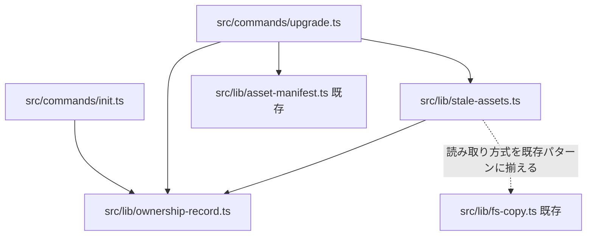
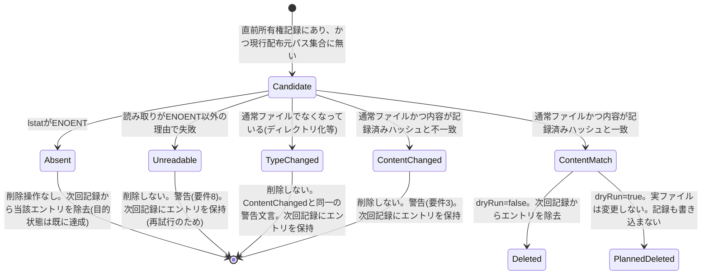

<!--
正本: AGENTS.md §4セグメント・4ゲート
このファイルは Issue 毎に複製して使う雛形である（セグメント: design、成果物: DESIGN.md（PLAN.md は別ファイル）、ゲート: design-gate）。
-->

# DESIGN: upgrade が配布元で廃止されたファイルを導入先から削除しない（過去の負債が残留する）

- Issue: `ISSUE-492`
- 対応する SPEC: `SPEC.md`

## 要件 → 設計要素の対応表

| 要件 / AC-ID | 対応する設計要素 | 備考 |
|---|---|---|
| 要件1 / `AC-1` | `src/lib/ownership-record.ts`、`src/commands/init.ts`、`src/commands/upgrade.ts` | `init`・`upgrade` の両方が書込み関数を呼ぶ |
| 要件2〜3 / `AC-2` | `src/lib/stale-assets.ts`（`ContentMatch → Deleted`）、`src/commands/upgrade.ts` | |
| 要件2〜3 / `AC-3` | `src/lib/stale-assets.ts`（`ContentChanged` 分岐） | dry-run/非dry-runで同一の候補計算関数を呼ぶため警告文が一致する |
| 要件3 / `AC-4` | `src/lib/stale-assets.ts`（差分計算：所有権記録に無いパスは候補集合に入らない） | |
| 要件4 / `AC-5` | `src/lib/asset-manifest.ts`（既存: `NAMESPACED_ENTRIES` が `project` を含まない）、`src/lib/stale-assets.ts`（防御的追加除外） | 二重防御（構造的除外＋実行時除外） |
| 要件5 / `AC-6` | `src/commands/upgrade.ts`（`dryRun` 分岐は削除の実行有無のみを切替える） | |
| 要件6 / `AC-7`, `AC-11` | `src/commands/upgrade.ts`（削除実行・失敗集約・出力順序） | |
| 要件8 / `AC-8`, `AC-10` | `src/lib/stale-assets.ts`（`Absent`／`Unreadable` 分岐） | |
| 要件2 / `AC-9` | `src/lib/stale-assets.ts`（差分計算：現行配布元に存在するパスは候補集合に入らない） | |

## 責務・境界

### コンポーネント構成

- `src/lib/ownership-record.ts`（新設）: `.agent-skill-chain/.owned-files.json` の読み取り・書き込みのみを担う。読み取り時、JSON構文または想定構造に一致しない場合は例外を投げず「所有権記録なし（空）」として扱い、警告文字列を返す。書き込みはパスの正規化（`root` からの相対パス、`/` 区切りへ統一）とアトミック性（一時ファイルへ書いてから rename）を担う。ファイル内容の意味解釈（削除要否判定）は行わない。
- `src/lib/stale-assets.ts`（新設）: (1) 直前の所有権記録エントリ集合と、今回コピー対象になる現行配布元のファイルパス集合との差分から削除候補集合を求める純関数、(2) 各候補ファイルを実際の導入先ファイルシステムに対して分類する関数（`Absent | Unreadable | TypeChanged | ContentMatch | ContentChanged`）、(3) 分類結果から実際の削除（`dryRun=false` の時のみ）と次回所有権記録に残すエントリ集合を計算する関数、を持つ。`.agent-skill-chain/project/` 配下は差分計算の入力に現れない（`NAMESPACED_ENTRIES` に含まれないため）ことに加え、本モジュール内でもパスprefix一致による防御的除外を行う。
- `src/commands/upgrade.ts`（既存を拡張）: 既存のミラーコピー処理（`copyTreeMirror`）が返す実際の配布ファイルパス一覧を「現行配布元パス集合」として `stale-assets.ts` に渡し、削除候補の分類・（非dry-runなら）削除実行を行う。削除結果・警告を既存の `summary` へ既存のフォーマット（`${prefix}${action}: ${path}`）で追記する。削除失敗が1件以上あった場合は、成功した全結果を含む `summary` を先に標準出力へ書き出してから、失敗ファイルの一覧を含むメッセージで非ゼロ終了する（既存の `ok()`/`fail()` の単純な二者択一ではなく、両方を順に使う）。処理完了後（削除失敗の有無に関わらず）、`ownership-record.ts` を通じて所有権記録を更新する。
- `src/commands/init.ts`（既存を拡張）: 初回コピー完了後、`ownership-record.ts` を通じて所有権記録を新規作成する（直前の記録は存在しないため、削除候補計算は行わない）。
- `src/lib/asset-manifest.ts`（既存、変更なし）: `NAMESPACED_ENTRIES` が `project` を含まないという既存の構造的境界が、本設計の `.agent-skill-chain/project/` 不可侵性（要件4）の一次的な保証根拠であり続ける。

### 依存関係



### 候補ファイルの状態遷移



### 図示要否の判断

- 判断: `要`
- 根拠: 新設・変更コンポーネントが `ownership-record.ts`・`stale-assets.ts`・`upgrade.ts`・`init.ts` の4つで責務境界が3つ以上に該当し、候補ファイルの分類状態遷移も5状態・2遷移以上に該当するため、両基準に該当する。

## 関連ADR

```yaml
related_adrs:
  - id: ADR-0039
    relation: adopts
```

## 障害・ロールバック考慮

- 想定される失敗モード（所有権記録の破損）: `.agent-skill-chain/.owned-files.json` がJSON構文エラー、または想定スキーマと異なる形になっている場合、`ownership-record.ts` は例外を投げず「所有権記録なし（空集合）」として扱う。結果として今回の実行では削除候補が0件になり（安全側、I8）、`upgrade` は削除以外の通常のミラーコピー処理を継続する。標準出力へ「所有権記録を読み取れなかったため、今回は削除候補の判定をスキップしました」という警告を1行追加する。次回実行時、正常な記録が新規に書き込まれていれば通常どおり削除候補判定が再開する。
- 想定される失敗モード（削除実行中のI/Oエラー）: 複数の削除候補のうち一部が失敗しても、失敗した候補の処理で全体を中断しない（best-effort継続）。全候補の処理が終わった後に、成功した更新・削除結果を含む `summary` を先に標準出力へ書き出し、その後で失敗ファイル一覧を含む非ゼロ終了を返す（要件6・要件11）。
- 想定される失敗モード（所有権記録の書き込み失敗）: 実ファイルの更新・削除が完了した後に記録書き込みが失敗した場合、`upgrade` 全体は異常終了として扱う。次回実行時は前回書き込みに失敗した（＝更新されていない）所有権記録を読み取ることになるが、その記録は前回実行前の状態を指しているため、既に削除済みのファイルが再び削除候補になることはない（既に物理的に存在しないため `Absent` 分岐に入り、削除操作は発生しない）。
- ロールバック手順: 導入先は通常Gitで管理されたリポジトリであるため、意図しない削除が発生した場合は導入先リポジトリの `git status`／`git checkout -- <path>` で復元できる。本設計はこの復元経路をあてにし、`upgrade` 自身にアプリケーションレベルの取り消し機能は持たせない。
- 影響を受ける既存機能: `init`・`upgrade` のみ変更する。`uninstall` は変更しない（SPEC.mdスコープ外）。そのため `.agent-skill-chain/.owned-files.json` は `uninstall` 実行後も導入先に残存する既知の未解消事項として残る（次Issueでの解消検討対象、本Issueでは対応しない）。
