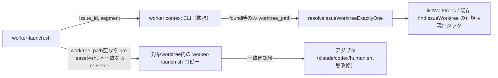

# DESIGN: bugfix: worker-launchが対象issueの専用worktreeへcdせず、複数worktree並存時に対象を特定できない

- Issue: `ISSUE-442`
- 対応する SPEC: `SPEC.md`

## 要件 → 設計要素の対応表

| 要件 / AC-ID | 対応する設計要素 | 備考 |
|---|---|---|
| 起動系はissue_idから対象worktreeパスを一意に解決すること（AC-1, AC-2） | `resolveIssueWorktreeExactlyOne`（`src/lib/worktree.ts`） | 既存 `findIssueWorktree` は最初の一致を返すのみで複数該当を検知しないため新設 |
| ワーカー実行コンテキストが対象worktreeと一致すること（AC-1, AC-2） | `worker-launch.sh` の解決・再実行ブロック | `cd` + 対象worktree内コピーへの `exec` |
| 呼び出し元のcwd・スクリプトパスに依存しないこと（AC-3） | `worker-launch.sh` の解決・再実行ブロック | 解決はissue_idのみに基づく。`BASH_SOURCE`依存を再実行で無効化する |
| 一意に解決できない場合はlease取得前に安全側停止すること（AC-4） | `resolveIssueWorktreeExactlyOne` の `not_found`/`ambiguous` 判定 + `worker context` の任意出力行 + `worker-launch.sh` の空チェック | lease取得（`acquire_lease`）より前段に配置する |
| 完了確認が対象worktree基準のHEADで行われること（AC-5） | `worker-launch.sh` の `cd` の副作用 | `.agent-skill-chain/adapters/claude.sh` の既存 `git rev-parse HEAD` 呼び出しはcwd依存のため無改修で正しくなる |

## 責務・境界

### コンポーネント構成

- `resolveIssueWorktreeExactlyOne`（`src/lib/worktree.ts`、新設）: issue_idに対応するworktreeを`git worktree list --porcelain`（`listWorktrees`）とworktree命名パターンから一意に解決する。0件は`not_found`、2件以上は`ambiguous`、1件のみ`found`を返す判別可能な結果を返す。既存`findIssueWorktree`のpath-pattern正規表現構築ロジックを共有関数へ抽出して再利用し、`findIssueWorktree`自体の挙動（既存8箇所の呼び出し元）は変更しない。
- `agent-skill-chain worker context <issue_id> <segment>`（`src/commands/worker.ts`、既存拡張）: `resolveIssueWorktreeExactlyOne`が`found`を返した場合のみ`worktree_path=<絶対パス>`行を追加出力する。`not_found`/`ambiguous`時は行を出力しない（コマンド自体は既存どおり成功する）。segment省略形（3行のみを返す既存の「従来互換」経路）は変更しない。
- `worker-launch.sh`（`.agent-skill-chain/scripts/worker-launch.sh`、既存拡張）: `worker context`呼び出し直後、adapter/model等の他フィールド抽出より前に、`worktree_path=`行の有無を検査する。無ければ（`not_found`/`ambiguous`のいずれか）lease取得前にexit 2で停止する。値がある場合、自身の`REPO_ROOT`（`BASH_SOURCE`起点で解決した値）と比較し、一致しなければ対象worktree内へ`cd`したうえで、対象worktree自身が持つ`.agent-skill-chain/scripts/worker-launch.sh`のコピーへ`exec`で処理を委譲する（一回限りの再実行、環境変数による再帰ガード付き）。
- アダプタ（`.agent-skill-chain/adapters/{claude,codex,human}.sh`）: 無改修。再実行後のプロセスのcwdが対象worktreeになる副作用により、`acquire_lease`・`_asc_cli segment start`・ワーカーサブプロセス起動・完了確認の`git rev-parse HEAD`が、すべて対象worktree基準で動作するようになる。

### 依存関係



### 図示要否の判断

- 判断: `要`
- 根拠: 依存関係が3系統以上（worker-launch.sh→worker context CLI、worker context CLI→resolveIssueWorktreeExactlyOne、resolveIssueWorktreeExactlyOne→listWorktrees/既存正規表現ロジック、worker-launch.sh→対象worktree内コピーへの委譲）存在するため上記基準に該当する。

## 関連ADR

`ADR-0004-worktree-path-resolution.md`（`repoRoot()`/`worktreeRoot()`の責務分離）は本設計が前提とする既存の基盤だが、本Issue時点で`status: proposed`のままaccepted化されていないため、`adr-lint.sh check`の`accepted`限定規則に従い構造化`related_adrs:`には含めない（自然文での由来言及に留める）。本Issueの新設ADRは既存のacceptedなADRのいずれとも直接の`adopts`/`supersedes`関係を持たないため、`related_adrs`は空とする。

```yaml
related_adrs: []
```

## 障害・ロールバック考慮

- 想定される失敗モード:
  - 対象worktreeがissue_idから一意に解決できない（存在しない、または命名規則上複数該当）: `worker context`が`worktree_path`行を出さず、`worker-launch.sh`がlease取得前にexit 2で停止する（AC-4）。writer leaseは一切取得されない。
  - 対象worktreeにagent-skill-chain CLIの実行手段（`bin/agents-md.js`のビルド、`node_modules/.bin/agent-skill-chain`、またはグローバルインストール）が無い: 再実行後の`_asc_cli`解決が失敗し、既存の「CLIが見つかりません」エラーで安全側停止する。これは`launch_worker`が「cwd=対象issueのworktree内で動く前提」であることをテストが既に明記している既存の前提（#166）であり、本Issueが新たに課す要件ではない。
  - `git worktree list --porcelain`が一時的に失敗する（`index.lock`実体化中の競合等、git内部の一時的エラー）: `listWorktrees`が例外を送出し、`worker context`コマンド自体が失敗する。`worker-launch.sh`の既存の`_cli worker context`失敗時exit 2分岐（無改修）がそのまま捕捉する。
  - 再実行後もworktree解決結果が一致しない極端なケース（並行してworktreeが削除・再作成される等）: 環境変数による一回限りの再帰ガードにより、無限ループせず安全側でexit 2にする。
- ロールバック手順: 本Issueの変更は`worker context`への任意出力行追加、`resolveIssueWorktreeExactlyOne`という新規関数追加、`worker-launch.sh`冒頭への解決・再実行ブロック追加のみで構成される加算的変更であり、スキーマ・データ移行を伴わない。該当commitをrevertすれば、既存の`findIssueWorktree`・アダプタ本体・他の`worker context`呼び出し元（human.sh、テスト群）は無改修のまま従前の挙動に戻る。
- 影響を受ける既存機能: `findIssueWorktree`の8箇所の既存呼び出し元（`issue resume`・`verify`・`adr`・`gate`・`lease`・`pr`・`cleanup`・`reconcile`）は本設計で変更しないため無影響。`worker context`のsegment省略形（3行のみを返す従来互換経路）・アダプタ本体（claude/codex/human.sh）も無改修。
