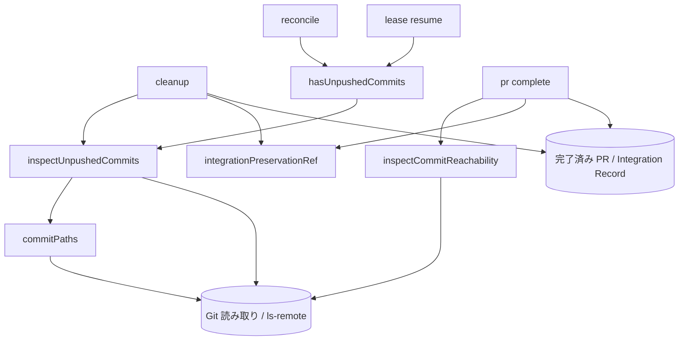

# DESIGN: worktree削除の「未pushのcommit」判定がsquash merge済みブランチを誤ってブロックする

- Issue: `ISSUE-692`
- 対応する SPEC: `SPEC.md`

## 目的・対象範囲

worktree 削除コマンド（`agent-skill-chain cleanup <issue_id>` と、その薄いラッパーである `.agent-skill-chain/scripts/cleanup.sh`）が持つ4つの削除前検査のうち、「未pushのcommitが無い」条件の判定方式を設計し直す。squash merge 済みで作業内容が完全に保全されている worktree を削除できるようにしつつ、まだどこにも保全されていない commit が残る worktree の削除は従来どおり拒否する。

対象は、未push判定の中核ロジック（`src/lib/worktree.ts`）、その判定へ「既知の保全位置」を供給する経路（`src/commands/cleanup.ts`・`src/commands/pr.ts`）、および同じ判定を共有する2つの利用側（`src/commands/reconcile.ts`・`src/commands/lease.ts`）である。worktree の削除操作そのもの（Git の worktree 削除と prune）、他3条件（writer lease・未commitの変更・PR/Integration Record 完了）の判定基準は対象外とする。

本 Issue は当初 `size:quick` 指定で着手したが、変更差分に `.agent-skill-chain/schemas/integration.schema.yaml` を含むため quick 免除が成立せず、通常フローの成果物（本 `DESIGN.md` と `PLAN.md`）が必要である。実装は本書の大部分について完了済みであり、本書はその設計判断を記述する。ただし本ラウンドの設計見直しで新たに確定した3点（reflog 由来の過去 push 位置を採用しないこと、`head_sha` を持たない完了済み Integration Record を単独の拒否理由にしないこと、すべての live remote head について object 取得を試みること）は未実装であり、実装すべき変更単位として `PLAN.md` に列挙する。いずれも判定を厳格化する方向か、作業消失を伴わない拒否を減らす方向の変更であり、本書が定める判定の意味が正本である。

## 前提・用語

- Issueブランチ: 1つの Issue に対応するブランチ。1 Issue = 1 ブランチ = 1 worktree = 1 PR の分離規約に従う。
- 統合先ブランチ（base）: Issue ブランチの変更が最終的に取り込まれる既定ブランチ。本書では `base` と表記する。
- ブランチ固有 commit: `merge-base(branch, base)` から Issue ブランチ先端までの commit 列。判定の単位はこの1件ずつである。
- 保全済み: そのブランチ固有 commit の変更内容が、実 remote 上のいずれかの ref から到達可能であるか、または統合先ブランチへ取り込まれている状態。本設計では「記録済み push 位置から到達可能である」「統合先または実 remote の head から到達可能である」「（補助的に）その commit が触れた path の内容が統合先の現在内容と一致する」のいずれかで成立させる。
- 記録済み push 位置: 実 remote 上のいずれかの ref から到達可能であることが確認済み、または確認済みであったと Git 上の証跡で裏付けられる commit SHA。本設計での供給源は、live remote head、完了済み PR の `headRefOid`、および検証 ref で裏付けた Integration Record の `head_sha` の3つに限る。ある commit が記録済み push 位置の祖先であれば、その commit も実 remote 上の ref から到達可能である。
- ローカル限定 commit: 上記のいずれも成立しない commit。worktree を削除すると復元できない。
- live remote head: `git ls-remote --heads <remote>` が返す、実 remote 上の ref とその SHA。ローカルの `refs/remotes/...`（remote-tracking ref）とは独立した情報源であり、実 remote の現在値を表す。
- 既知の保全位置（`KnownPreservedCommit`）: 判定の外側（Coordination Backend）から供給される、「この SHA は保全されている」という主張。GitHub モードでは完了済み PR の `headRefOid`、local backend では Integration Record の `head_sha`。
- 検証 ref: local backend で統合完了を記録した時点の保全位置を Git 上に固定する ref。`refs/agent-skill-chain/integrations/<issue番号>` を用いる。
- 判定不能（`indeterminate`）: 保全済みか否かを確定できない状態。安全側として削除を拒否する。

## 入力・出力

判定の入力は、対象 worktree のパス、Issue ブランチ名、および任意の「既知の保全位置」である。判定は Git の読み取り操作と remote への問い合わせ（`ls-remote`、および不足 object の取得）のみで完結し、Issue ブランチ・統合先ブランチ・remote 上の ref・作業ツリーを書き換えない。

判定の出力は次の3値のいずれかである。

| 出力 | 意味 | 付随情報 |
|---|---|---|
| 未push無し | ブランチ固有 commit がすべて保全済み | なし |
| `unpreserved_commits` | 保全されていない commit が確定的に存在する | 該当 commit の SHA 列 |
| `indeterminate` | 保全済みか否かを確定できない | 確定できなかった事由の日本語文字列 |

コマンドとしての出力契約は、削除成功時は終了コード0と削除した worktree パスを標準出力へ、削除しない場合は非0終了コードと日本語の拒否理由を標準エラー出力へ、という既存契約を維持する。`unpreserved_commits` の場合は件数と短縮 SHA を理由へ含め、`indeterminate` の場合は確定できなかった事由を含める。

## 要件 → 設計要素の対応表

| 要件 / AC-ID | 対応する設計要素 | 備考 |
|---|---|---|
| 要件1（拒否はローカル限定commit存在時のみ） | `inspectUnpushedCommits`（commit 単位の保全判定） | SHA一致・祖先関係の不成立自体を拒否根拠にしない |
| 要件2（squash merge済みを保全済みと判定） | 記録済み push 位置からの到達可能性判定 | ブランチ先端が記録済み push 位置であれば、全ブランチ固有 commit がその祖先として成立する。統合先が分岐後に前進していても、Issue ブランチ先端の tree と一致する commit が統合先に無くても結果は変わらない |
| 要件3（merge commit・rebase merge も同様） | 到達可能性判定（`base` と記録済み push 位置を到達元集合へ含める） | merge commit は `base` からの祖先関係で、rebase merge は記録済み push 位置（rebase 前のブランチ先端）からの祖先関係で成立する |
| 要件4（upstream追跡refの状態に依存しない） | remote-tracking ref を live remote head と一致する場合のみ到達元へ採用する設計 | upstream 設定の有無・gone・別ブランチ指定のいずれも判定根拠にしない |
| 要件5（拒否時にcommit特定情報を出力） | `unpreserved_commits` の SHA 列と `cleanup` の日本語メッセージ生成 | PR 完了だけを根拠に検査を省略しない（検査を完了検査より先に実行） |
| 要件6（確定不能時は拒否） | `indeterminate` の生成条件と `cleanup` の拒否経路 | 事由文字列を日本語で出力 |
| 要件7（読み取りのみ） | Git 読み取りコマンドへの限定。例外は object 取得（`fetch --no-tags <remote> <sha>`）と、`pr complete` による検証 ref の作成 | いずれもブランチ・作業ツリー・remote 上の ref を書き換えない |
| 要件8（他3条件と削除経路は不変） | `cleanup` の検査順序変更のみに留め、lease・未commit・完了検査の判定基準と削除経路は変更しない | 検査順序は要件5のため未push検査を完了検査より前へ移動 |
| 要件9（他用途の安全性維持） | `hasUnpushedCommits` の boolean 互換ラッパーを維持し、`reconcile`・`lease` は既知の保全位置を渡さない | 情報不足時は「未保全側」へ倒れ、回収・再開のいずれも作業を失わせない |
| 要件10（Gitの事実で成立、両モードで誤検知なし） | 保全根拠の主軸を Git 上の到達可能性に置き、Coordination Backend 由来の値は検証を経てから採用する | `head_sha` は検証 ref または現在の到達可能性で裏付けてから採用。`head_sha` を持たない完了済み Record は根拠を1つ供給しないだけであり、それ自体を拒否理由にはしない |
| `AC-1` | 記録済み push 位置からの到達可能性判定（ブランチ先端が記録済み push 位置であること） | 統合先前進・remote ref 削除済みでも削除できる。内容一致による補助判定には依存しない |
| `AC-2` | commit 単位の到達可能性判定と `unpreserved_commits` 出力 | マージ後に追加した未push commit を検出 |
| `AC-3` | 「push 実績が無いと確定できる」経路（remote 未設定・remote に当該ブランチ不在） | `indeterminate` ではなく `unpreserved_commits` として SHA を出す |
| `AC-4` | 到達可能性判定（`base` からの祖先関係） | merge commit・fast-forward |
| `AC-5` | 記録済み push 位置からの到達可能性判定（rebase 前のブランチ先端が記録済み push 位置であること） | 別 SHA として統合先へ載っても、元の commit 列は記録済み位置の祖先である。内容一致による補助判定には依存しない |
| `AC-6` | upstream 追跡設定を判定根拠に用いない設計 | 追跡先が統合先を指していても結果が変わらない |
| `AC-7` | live remote head を到達元集合へ加える設計 | push 済み・未マージでも拒否されない |
| `AC-8` | `indeterminate` の生成条件（統合先を特定できない等） | 事由付きで拒否 |
| `AC-9` | `cleanup` の他3条件の検査を変更しないこと | 検査順序のみ変更 |
| `AC-10` | `hasUnpushedCommits` の boolean 互換ラッパーと、`reconcile`・`lease` が既知の保全位置を渡さない呼び出し | 情報不足時は安全側（未保全側）へ倒れる |

## 責務・境界

### コンポーネント構成

- `inspectUnpushedCommits`（判定の中核）: worktree パス・ブランチ名・任意の既知の保全位置を受け取り、上表の3値を返す。ブランチ固有 commit の列挙、保全根拠の収集、commit ごとの判定、判定不能の検出をすべてここで行う。責務は「判定」のみで、削除も状態更新も行わない。
- `hasUnpushedCommits`（互換ラッパー）: 同じ入力を受け、3値を boolean へ畳み込む。理由を必要としない既存利用側のための最小境界であり、独自の判定ロジックを持たない。
- `inspectCommitReachability`（単一 commit の到達可能性）: 1つの SHA について「統合先または実 remote の head から到達可能か」を、到達可能／到達不能／判定不能の3値で返す。内容一致は根拠に用いない。統合完了を記録する側が、記録しようとしている位置が実在の保全位置かを事前確認するために使う。
- `commitPaths`（変更 path 列挙）: 1つの commit が触れた path の集合を返す。root commit とマージ commit を含めて漏れなく列挙し、失敗時は判定不能の事由を返す。返す文字列は commit 由来であり信頼できない入力として扱う。
- `integrationPreservationRef`（検証 ref 名の解決）: Issue 番号から検証 ref 名を導く唯一の関数。記録側と検証側で ref 名が乖離しないようにする。
- `cleanup`（削除の可否決定）: 4条件（有効な writer lease 不在・未commitの変更が無い・未pushのcommitが無い・PR または Integration Record が完了済み）を検査し、すべて満たす場合のみ worktree を削除する。既知の保全位置を判定へ供給し、判定結果を日本語の拒否理由へ変換する。4条件以外の拒否理由を追加しない——`head_sha` の欠落のような根拠の不足は、判定への入力が1つ減ることとしてのみ扱い、独立した拒否条件に昇格させない。
- `pr complete`（local backend の統合完了記録）: Integration Record を `merged`／`closed` へ遷移させ、その時点の Issue ブランチ先端を検証したうえで `head_sha` と検証 ref へ記録する。
- `reconcile`・`lease`（判定の他利用側）: 既知の保全位置を渡さずに boolean 判定のみを使う。

### 依存関係



依存は一方向であり循環が無い。利用側（`cleanup`・`reconcile`・`lease`・`pr complete`）は判定側へ依存するが、判定側は利用側を知らない。判定側は Coordination Backend を直接読まず、既知の保全位置という値としてのみ受け取る。

### 図示要否の判断

- 判断: `要`
- 根拠: 依存関係が3つ以上ある（利用側4つが判定側の3関数へ依存し、判定側は Git および Coordination Backend 由来の値へ依存する）。責務境界も3つ以上ある（判定・削除可否決定・統合完了記録）。基準に該当するため上記の依存関係図を記載した。

## 保全根拠の種類と優先順位

判定は「その commit が失われないと言えるか」を根拠の集合で決める。根拠は次の4種類であり、**到達可能性を主根拠、内容一致を補助根拠**とする二層構造を採る。同種の根拠の間に優先順位は無く、いずれか1つでも成立すれば保全済みとする。層の間には順序があり、補助根拠は主根拠が成立しない commit にのみ、かつ後述の適用条件を満たす場合にのみ適用する。

| # | 根拠 | 採用条件 | 採用しない場合に起きること |
|---|---|---|---|
| 1 | live remote head からの到達可能性 | `git ls-remote --heads` が実 remote から返した head SHA。ローカルの remote-tracking ref の有無・鮮度を前提条件にしない。object がローカルに無い場合は、当該 head が Issue ブランチのものかを問わず取得を試み、取得できなければ判定不能とする | ローカル ref が削除済み・古い環境で、実際には push 済みの commit を未保全と誤判定する |
| 2 | remote-tracking ref | `refs/remotes/<remote>/<branch>` の値が live remote head と一致する場合に限り到達元として採用する。reflog に残る過去の `update by push` 位置は採用しない | 実 remote と値が一致するローカル ref を到達元名として使えなくなるだけで、判定結果は根拠1と同一になる |
| 3 | 完了済み PR の `headRefOid` | GitHub モードで、`state` が `MERGED` または `CLOSED` の PR が返した head SHA。object がローカルに存在することを確認して採用する | squash merge 後に remote ブランチが削除された構成で push 位置を復元できず、統合済みの worktree を削除できない（AC-1 が成立しない） |
| 4 | Integration Record の `head_sha` と検証 ref | local backend で、Record が完了状態かつ `head_sha` を持つ場合。**その値をそのまま信用せず**、(a) 現在も到達元集合から到達可能である、または (b) 検証 ref `refs/agent-skill-chain/integrations/<issue番号>` がその SHA を指している、のいずれかを確認してから採用する | local backend で remote を持たない構成の統合済み worktree を削除できない |

根拠3・4を無検証で採用しないことが本設計の要点である。Coordination Backend の値は Git 上の保全を保証しない——記録された時点で実際には push も統合もされていない位置が記録され得るため、その位置を起点に「自分は自分の祖先である」という自己参照で保全を成立させると、ローカル限定 commit を保全済みと誤判定して失う。根拠4の (b) は、記録時点で到達可能性を確認したという事実を Git 上の ref として残すことで、後から remote ref が消えても記録の正当性を再確認できるようにするものである。

**根拠2で reflog を採用しない理由。** reflog の `update by push` エントリは、現在の live remote head の祖先であるか、祖先でないかのいずれかである。祖先である場合、そのエントリから到達できる commit は live remote head からも到達でき、根拠1に対して何も追加しない。祖先でない場合、それは remote ブランチが force-push により旧履歴を捨てた痕跡であり、当該 SHA は現在の remote 上のどの ref からも到達できず統合先にも取り込まれていない。この状態は SPEC が定めるローカル限定 commit そのものであるため、保全根拠として採用すると削除により作業を失う。すなわち reflog は、追加の判定力を持つ唯一の場面が同時に唯一の危険な場面であり、根拠として採らない。

**根拠3が「実 remote 上の ref から到達可能」を満たす理由。** GitHub は PR ごとに `refs/pull/<PR番号>/head` を remote 上に保持し、この ref は PR が `MERGED`・`CLOSED` になった後も、head ブランチの ref が削除された後も残る。`headRefOid` はその ref が指す SHA であるため、`git ls-remote --heads` の一覧に現れなくても実 remote 上の ref から到達可能であり、保全済みの定義を満たす。PR が存在するという事実自体が当該 ref の存在を含意するため、採用に際して追加の remote 問い合わせは求めない。裏返せば、この根拠は「GitHub が当該 PR を保持している」という前提に依存する。前提が崩れる場合（リポジトリ自体の削除等）は worktree の有無にかかわらず作業が失われるため、本判定の守備範囲外とする。

収集した根拠は2つの集合に集約する。ひとつは「記録済み push 位置」の集合（根拠1のうち Issue ブランチの head、根拠3、根拠4）、もうひとつは「到達元 ref」の集合（統合先ブランチ、根拠1の全 head、根拠2の ref）である。ブランチ固有 commit は、いずれかの集合の要素から到達可能であれば保全済みとする。

## 内容一致による補助判定

### 位置づけと適用範囲

内容一致は、記録済み push 位置からも到達元 ref からも到達できない commit に対してのみ働く、**一方向の十分条件**である。一致すれば保全済みと確定し、一致しなければ何も確定しないため、その commit は他の根拠が無い限り未保全側（安全側）へ倒れる。

このため本設計は、squash merge・rebase merge・cherry-pick で SHA が変わる構成の保全立証を内容一致に依存させない。これらの構成では、統合前のブランチ先端が記録済み push 位置として得られ、ブランチ固有 commit はすべてその祖先であるため、到達可能性だけで全 commit の保全が成立する。AC-1（統合先前進 + remote ref 削除済みの squash merge）と AC-5（rebase merge）が成立する根拠はこの到達可能性であり、内容一致ではない。

内容一致が実際に働くのは、記録済み push 位置より後に作られた commit だけである。この範囲では、同一 path を複数 commit で更新した場合の中間 commit——path の途中状態を持つ commit——は、統合先の現在内容と一致しないため内容一致では保全済みにできない。これは仕様上正しい帰結である。中間状態そのものは統合先に存在せず、SPEC が定める保全済みの条件（remote 上の ref から到達可能、または統合先へ取り込み済み）を満たさないためである。記録済み push 位置より前にある中間 commit は、その位置の祖先であるため到達可能性で保全済みとなり、この制約の影響を受けない。

### 判定の詳細

- 比較対象は、当該 commit が触れた path の集合（`commitPaths` が返す集合）である。ブランチの最終差分ではなく commit ごとの変更 path を用いる。最終差分では、途中で追加し後で取り消した path が集合から消え、その commit を取りこぼすためである。
- 比較は、当該 commit の当該 path の内容と、統合先ブランチの現在の内容を突き合わせる。一致すれば当該 commit は内容として取り込まれていると扱う。
- **適用条件: 記録済み push 位置が1つ以上存在する場合に限る。** push 実績が1つも見つからない状態で内容一致だけを根拠にすると、「push 済みで squash 統合されたもの」と「一度も push されておらず内容がたまたま一致するもの」を区別できない。区別できない以上、内容一致は保全の証拠にならない。したがって push 実績が皆無の状況では、内容が一致していても未保全として扱う（AC-3 の要求と一致する）。
- 変更 path が空の commit（空 commit）には内容比較を適用しない。比較対象が無い以上「内容として取り込まれている」とは言えず、到達可能性が無ければ未保全とする。
- 比較に用いる path は commit 由来の文字列であり、Git の pathspec magic（`:(exclude)...` 等）として解釈され得る。解釈されると比較対象が空集合になり、差分無し（=統合済み）へ倒れて未保全 commit を見逃す。これを防ぐため、比較を行う Git 呼び出しには `--literal-pathspecs` を付け、commit 由来の文字列が pathspec magic として解釈される経路を残さない。
- 比較コマンドが「差分あり／差分なし」以外の終了状態を返した場合は、未保全とも保全済みとも判定せず判定不能とする。

## Integration Record の `head_sha`

local backend には remote が存在しない構成があり得るため、「push 済みか」の代わりに「統合完了時点で保全を確認した位置か」を根拠にする必要がある。この位置を保持する場所として `.agent-skill-chain/schemas/integration.schema.yaml` へ `head_sha`（40桁の16進 SHA、任意フィールド）を追加した。

- 意味: status を `merged` または `closed` へ遷移した時点で、統合済みとして記録した Issue ブランチの commit SHA。
- 記録タイミング: 完了状態への遷移時のみ。Draft の作成時には記録しない。Draft 時点の位置は push 実績も統合実績も保証しないため、それを保全根拠にすると未 push の位置を「統合済みの位置」として扱う誤りが生じる。
- 記録前の検証: 遷移を行う `pr complete` は、Issue ブランチ先端が統合先または実 remote の head から到達可能であることを `inspectCommitReachability` で確認する。到達不能なら記録せず日本語で理由を返す。判定不能でも記録しない。確認後に先端が変化していないことを再確認してから書き込み、同時に検証 ref を当該 SHA へ設定する。
- 欠落時の扱い: `head_sha` を持たない完了済み Record（本変更以前に作られたもの）では位置を推測しない。**この欠落は保全根拠を1つ供給しないことを意味するだけであり、それ自体を独立した削除拒否の理由にはしない。** 判定は他の Git 上の根拠（統合先からの祖先関係、live remote head、内容一致）だけで行い、それらで保全を立証できれば削除する。立証できない場合は通常どおり `unpreserved_commits` または `indeterminate` として拒否し、そのメッセージへ後述の復旧手順を併記する。欠落そのものを拒否理由にすると、merge commit 方式で統合され統合先の祖先になっているブランチのように Git だけで保全が立証できる worktree まで削除できなくなり、SPEC 要件1（拒否はローカル限定 commit が存在する場合のみ）と要件8（他3条件の意味と挙動を変えない）に反する。
- 欠落時の復旧手順: 利用者が取るべき対応として、(a) 当該ブランチを remote へ push し直して live remote head を復活させる、または (b) 統合時点の Issue ブランチ SHA を確認し、Record へ `head_sha` として記録したうえで検証 ref `refs/agent-skill-chain/integrations/<issue番号>` を同じ SHA へ設定する、のいずれかを案内する。(b) で検証 ref の設定まで求めるのは、`head_sha` の追記だけでは根拠4の採用条件（現在の到達可能性、または検証 ref による裏付け）を満たさず、remote ref が既に消えた構成では再実行しても同じ拒否が繰り返されるためである。案内は利用者が実際に完了できる手順でなければならない。
- 後方互換性: `head_sha` は任意フィールドであり、既存 Record はスキーマ検証を引き続き通る。挙動面では、既存 Record を持つ worktree のうち Git だけで保全を立証できないものの削除が「拒否」方向へ変化する。これは作業消失を伴わない安全側の変化であり、上記の復旧手順で解消する。スキーマ変更が quick 免除の解除条件に該当することを踏まえ、フィールドの追加のみに留め、既存フィールドの意味・必須性は変更していない。

## 判定不能（`indeterminate`）と安全側の定義

本設計における安全側とは、**常に削除を拒否する側**である。削除は不可逆であり、誤って削除した場合の損失（復元不能な作業消失）と、誤って拒否した場合の損失（運用上の不便）は等価ではない。

判定不能とするのは次の場合である。いずれも「保全されていないと確定した」わけではなく「確定できない」状態であり、`unpreserved_commits` とは区別して事由を出力する。

- 統合先ブランチを特定できない。
- 分岐点（merge-base）を確定できない、またはブランチ固有 commit を列挙できない。
- remote 一覧または remote-tracking ref 一覧を取得できない。
- 実 remote への問い合わせ（`ls-remote`）が失敗する（ネットワーク不通等）。
- live remote head の object がローカルに無く、取得もできない。対象は Issue ブランチの head に限らず、`ls-remote --heads` が返したすべての head である。到達元集合へ加えられない head が残ると「その head から到達可能だったかもしれない」という未確定が残るため、未保全と確定させずに判定不能とする。
- commit の変更 path を列挙できない、または内容比較が想定外の終了状態を返す。
- 既知の保全位置として渡された SHA の object がローカルに存在しない。この場合は当該根拠を採用しないだけであり、他の根拠で保全を立証できればそのまま保全済みとなる。

逆に、次は判定不能ではなく確定的な未保全（`unpreserved_commits`）として扱う。remote が設定されていない、または実 remote に当該ブランチが存在しないことを確認できた場合である。この状態は「一度も push されていない」と確定できるため、commit の SHA を含む日本語メッセージを出す。判定不能として事由だけを返すと、利用者は何を失いかけたのか分からない。

`cleanup` は未push検査を統合完了検査より先に実行する。保全されていない commit が存在する場合は、統合の完了状況にかかわらずその旨と commit 情報を出力する。完了検査を先に置くと、統合が未完了である限り未保全 commit の存在が利用者へ伝わらない。

## 判定を共有する他用途の契約（`reconcile`・`lease` resume）

未push判定は、削除可否の決定以外に次の2用途で共有される。どちらも本設計の対象であり、扱いを設計として確定させる。

- `reconcile`（期限切れ writer lease の回収可否判定）: 回収候補の Issue について専用 worktree を探し、worktree が既に無いか、または「未commitの変更が無く、かつ未push判定が『未push無し』を返す」場合にのみ回収して差し支えないと判断する。いずれも成立しない場合は回収せず人間判断へ昇格する。
- `lease` の resume 経路（作業継続のための lease 再取得時の残作業判定）: 「未commitの変更がある」または「未pushのcommitがある」のいずれかが成立する場合にのみ、継続すべき残作業があるとみなして lease の再取得を成立させる。どちらも成立しない場合は再開を拒否し人間判断へ昇格する。

**両用途とも、既知の保全位置（`KnownPreservedCommit`）を渡さずに boolean 互換ラッパーを呼ぶ。** 既知の保全位置は Coordination Backend が保持する統合位置（完了済み PR の head SHA、または Integration Record の `head_sha` と検証 ref）であり、これを収集して判定へ供給する責務は削除可否を決定する `cleanup` にのみ置く。回収可否判定と残作業判定は統合の完了状態を判断材料に持たない設計であるため、同じ情報を持ち込まない。

この帰結として、**squash merge 等により別 SHA として統合済みで、かつ remote 上の Issue ブランチ ref も remote-tracking ref も存在しない worktree——実際には保全済みの worktree——も、これら2用途では「保全されていない作業が残る」側として扱われる。** 統合位置を受け取らない以上、その commit が統合先へ取り込まれている事実を判定側が立証する根拠を持たないためである。

この扱いは本設計が意図した定義された挙動であり、次の3点により未定義でも不安全でもない。

1. 決定的である。判定入力（既知の保全位置を渡さない呼び出し、remote 側 ref の不在、統合先から到達不能なブランチ先端）に対して結果は一意に定まり、実行のたびに変わる余地が無い。
2. 誤りの方向が常に安全側である。`reconcile` は当該 lease を回収せず人間判断へ昇格するのみで、lease・worktree・commit のいずれも削除しない。`lease` の resume は再開を許すのみで、ブランチ先端も作業ツリーも書き換えない。どちらの経路も作業を失わせない。
3. 実際に失われる作業が無い。同じ worktree に対し、統合位置を受け取る `cleanup` は削除に成功する。すなわち作業は統合先へ保全されており、2用途の「未保全側」扱いは情報不足に由来する安全側の据え置きにとどまる。

残る影響は、回収されない期限切れ lease が運用上残り得ることに限られる。これは削除拒否と同種の運用上の不便であり、作業消失でも未定義動作でもない。

上記の扱いは、ローカル限定 commit が残る構成と、squash merge 済みで保全済みの構成（remote の Issue ブランチ ref・remote-tracking ref がいずれも削除済み）の双方を2用途それぞれで実行する自動テストにより固定する。すなわち本用途の判定の証跡は本 Issue の範囲内で成立させ、外部の後続作業へ委ねない。

これら2用途へ既知の保全位置を供給する（＝保全済み worktree を保全済み側として扱う）かどうかは、削除の誤検知の解消とは独立した設計判断であるため、本 Issue では変更しない。

## 関連ADR

本設計は、既存の accepted ADR が定めた判断を採用・変更・置換するものではないため、`related_adrs:` に列挙すべき accepted ADR は無い。

```yaml
related_adrs: []
```

本設計が含む判断のうち、保全根拠の採否規則——到達可能性を主根拠とし内容一致を一方向の補助に限ること、Coordination Backend 由来の位置を裏付け無しに採用しないこと、reflog 由来の過去 push 位置を採用しないこと——は、本 Issue 固有の実装詳細ではなく以後の保全判定全体を拘束する判断であるため、ADR-0066 として `status: proposed` で新規作成した。設計ゲート承認時に accepted へ遷移する。

## 障害・ロールバック考慮

- 想定される失敗モード1（偽陰性・重大）: 保全されていない commit を保全済みと誤判定し、worktree 削除で作業を失う。復元不能であるため最も避けるべき失敗である。対策として、主根拠を到達可能性に置き、内容一致は push 実績が確認できる場合のみの補助に限定し、Coordination Backend 由来の位置は検証を経てから採用し、確定できない場合は必ず拒否する。
- 想定される失敗モード2（偽陽性・軽微）: 保全済みの worktree の削除を拒否する。作業消失は伴わず、利用者は理由を読んで対処できる。判定が曖昧な場合は常にこちら側へ倒す。
- 想定される失敗モード3（外部依存の不安定性）: `ls-remote` がネットワーク事情で失敗する。この場合は判定不能となり削除を拒否する。オフライン環境では統合済み worktree の削除が一時的にできなくなるが、作業消失は起きない。
- ロールバック手順: 本変更は判定ロジックと、Integration Record への任意フィールド追加のみで構成される。切り戻しは当該変更の revert で完結し、データ移行を伴わない。追加した `head_sha` は任意フィールドであるため、切り戻し後も既存 Record はスキーマ検証を通り、値は無視されるだけである。作成済みの検証 ref は Git の独立した ref 名前空間にあり、切り戻し後は参照されなくなるだけで既存の ref・ブランチへ影響しない。
- 影響を受ける既存機能: `cleanup` の削除可否判定（本 Issue の対象）、`reconcile` の回収可否判定と `lease` の resume 可否判定（判定関数を共有するため、判定結果の変化がそのまま伝播する）、`pr complete` として新設した local backend の統合完了記録経路。`cleanup` の他3条件の判定基準と削除経路、`pr create` の既存挙動は変更しない。

## 制約

- 判定のためにブランチ・ref・作業ツリーを書き換えない。例外は、判定に必要な object をローカルへ取得する操作と、`pr complete` が統合完了を記録する際に作成する検証 ref のみであり、いずれも既存のブランチ・作業ツリー・remote 上の ref を変更しない。
- 出力契約（成功時は削除した worktree パスを標準出力へ、失敗時は非0終了コードと日本語理由を標準エラー出力へ）を維持する。
- 判定を利用者が無効化・強制迂回できるオプションを設けない。
- `.agent-skill-chain/schemas/integration.schema.yaml` への変更はフィールド追加に限り、既存フィールドの意味・必須性を変更しない。

## 完了条件・検証方法

- 完了条件: SPEC.md の要件1〜10 と AC-1〜AC-10 に対応する設計要素が上記対応表のとおり定義され、判定の3値・保全根拠の採否条件・安全側の定義が本書内で確定していること。
- 検証方法: 全 AC を自動テストで検証する。squash merge・merge commit・rebase merge の3方式で削除が成功すること、および過去に検出された偽陰性の反例（最終差分が空になる構成、squash 後に追加したローカル限定 commit・空 commit、相殺 path が最終差分から消える構成、squash 済み path 上の commit と取り消し、古い remote-tracking ref が残る構成、pathspec magic と同名のファイルを追加した構成、未 push の位置が記録された Record を用いる構成）で削除が拒否されることを、いずれも `cleanup` コマンドの終了コードと worktree の残存／削除を一体で検証する。本ラウンドで確定させた3点についても、(a) force-push により live remote head から到達不能になった過去 push 位置だけが reflog に残る構成で削除が拒否されること、(b) `head_sha` を持たない完了済み Record を持ちつつ merge commit 方式で統合先の祖先になっている構成で削除が成功すること、(c) Issue ブランチ以外の live remote head の object がローカルに無い構成で、取得に成功すれば判定が成立し、取得に失敗すれば事由付きの判定不能となること、をそれぞれ検証する。判定を共有する `reconcile`・`lease` の2用途についても、ローカル限定 commit が残る構成と squash merge 済みで保全済みの構成の双方を実行し、扱いを固定する。検証の実施結果は `VALIDATION.md` が保持する。

## 未決事項

- `reconcile`・`lease` の2用途へ既知の保全位置を供給するかどうか。現状は供給せず安全側へ倒しているが、期限切れ lease が回収されずに残る運用上の不便が実害となる場合は再検討の余地がある。
- 検証 ref による保全根拠は、ローカルの ref のみを拠り所とする。remote へ push 済みであることを復元元とする耐久性の考え方より弱い保証であり、根拠の強化方式は本 Issue では確定していない。

## スコープ外

- writer lease・未commitの変更・PR または Integration Record 完了という他3条件の判定基準そのものの変更。
- worktree 削除後のローカルブランチ削除や remote ブランチ削除といった、削除範囲の拡張。
- マージ方式の変更、PR マージコマンドの挙動変更、マージ後の統合先ブランチ同期処理の変更。
- 検証 ref による保全根拠がローカルの ref のみに閉じており、remote へ push 済みであることを復元元とする耐久性より弱い保証にとどまること。根拠自体は本設計内で成立しており AC の充足に不足は無いため、保証の強化のみを別 Issue（Issue #740 として起票済み）へ分離する。

かつて別 Issue（Issue #736）へ分離していた「`head_sha` を持たない既存 Integration Record の扱い」と「Issue ブランチ以外の live remote head の object 取得」は、いずれも SPEC の要件1・要件6・AC-1 の充足に直接影響するため分離を取り消し、本書の該当箇所（Integration Record の `head_sha`、判定不能と安全側の定義）で本 Issue の設計として確定させた。
