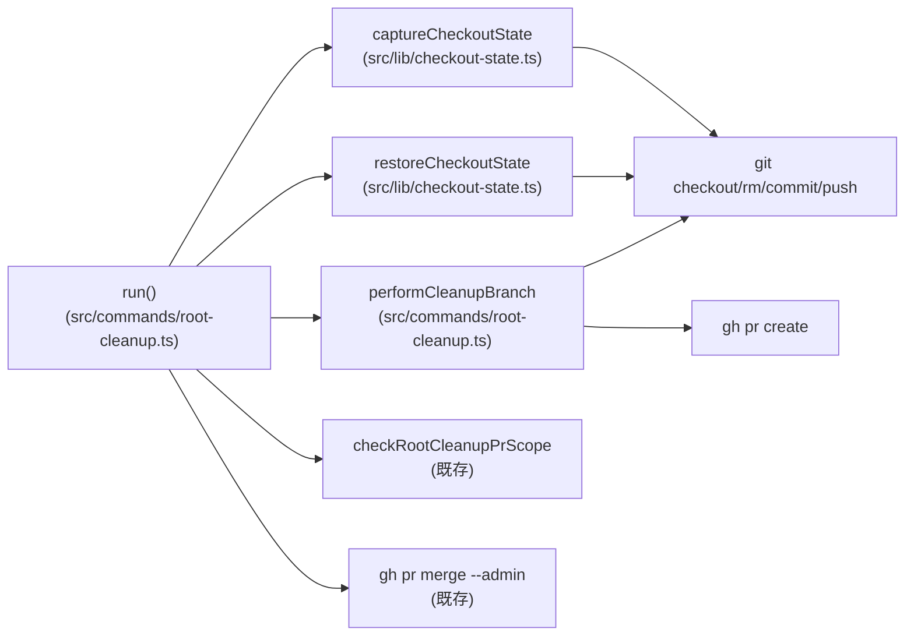
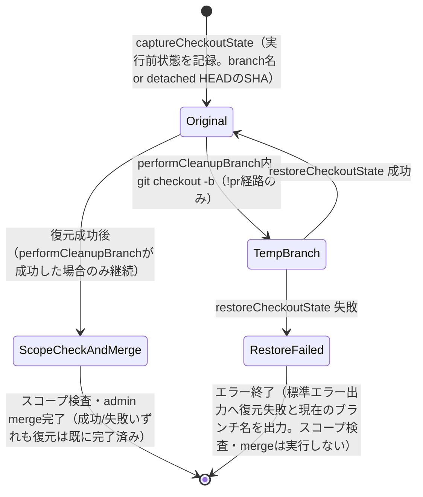

# DESIGN: root-cleanup runを永続main worktreeから直接実行すると実行後に一時ブランチのまま取り残されmainへ戻らない

- Issue: `ISSUE-619`
- 対応する SPEC: `SPEC.md`

## 要件 → 設計要素の対応表

| 要件 / AC-ID | 対応する設計要素 | 備考 |
|---|---|---|
| `AC-1`（mainチェックアウト中の復元） | `captureCheckoutState`・`restoreCheckoutState`（`src/lib/checkout-state.ts`）、`run()` オーケストレーション（`src/commands/root-cleanup.ts`） | 一時ブランチ作成前に記録し、ローカルgit操作完了直後に復元する |
| `AC-2`（main以外チェックアウト中の復元） | 同上 | `captureCheckoutState` はブランチ種別を問わずリテラルなブランチ名を記録する |
| `AC-3`（no-opでのチェックアウト状態不変） | 既存の早期 `return ok(...)`（`detectStrayRootArtifacts` が0件の分岐、変更なし） | `captureCheckoutState` 呼び出し自体に到達しない経路を維持する |
| `AC-4`（既存OPENブランチ・PR再利用時のチェックアウト状態不変） | 既存の `existingBranch && pr` 分岐（変更なし） | `performCleanupBranch` を呼ばない経路を維持し、`captureCheckoutState`/`restoreCheckoutState` を一切実行しない |
| `AC-5`（push・PR作成失敗時も復元） | `performCleanupBranch`（`src/commands/root-cleanup.ts`、既存 `if (!pr)` 内ロジックの抽出）、`run()` の復元呼び出し | `performCleanupBranch` がエラーを返しても `restoreCheckoutState` を必ず呼ぶ |
| `AC-6`（CIランナー既存動作への非回帰） | `run()` オーケストレーション（復元成功時のみスコープ検査・admin mergeへ進む既存フローを維持） | 復元処理の追加が成功時の標準出力・終了コード形式を変更しないことをテストで確認する |
| 要件（detached HEADからの復元） | `captureCheckoutState`／`restoreCheckoutState` の `CheckoutState` 判別共用体（`{ kind: 'branch'; name }` \| `{ kind: 'detached'; sha }`） | `git rev-parse --abbrev-ref HEAD` が文字列 `HEAD` を返す場合はdetachedとして現在commitのSHAを記録し、復元時は当該SHAへ `git checkout <sha>` する |
| 要件（復元失敗時のエラー終了・現在ブランチ名の出力） | `restoreCheckoutState` の戻り値（エラーメッセージ文字列 \| `undefined`）、`run()` のfail-closed分岐 | 復元失敗時は `checkRootCleanupPrScope`・`gh pr merge --admin` を実行せず即座にエラー終了する |

## 責務・境界

### コンポーネント構成

- `src/lib/checkout-state.ts`（新規）: worktreeのチェックアウト状態（ブランチ名 or detached HEADのSHA）の記録・復元のみを担当する。root-cleanup固有のロジック（対象ファイル検出・PR作成・スコープ検査・マージ判断）には一切関与しない。`src/lib/worktree.ts` の `resolveCurrentBranchInfo`（CI環境の `GITHUB_HEAD_REF` 代替を伴う、検証目的の論理ブランチ名解決）とは別関数として実装する。復元対象は実行前にチェックアウトしていた**実際のref**（ブランチ名またはcommit SHA）であり、CI都合の代替名へすり替えてはならないため。
  - `captureCheckoutState(root): CheckoutState`: 実行開始時点のチェックアウト状態を記録する。
  - `restoreCheckoutState(root, state): string | undefined`: 記録した状態へチェックアウトを戻す。成功時は `undefined`、失敗時は復元先・現在のブランチ名を含むエラーメッセージ文字列を返す（例外を投げない、呼び出し元が確実にハンドリングできるようにするため）。
- `src/commands/root-cleanup.ts`（変更）:
  - `performCleanupBranch(root, branch, stray): { pr: OpenPr } | { error: string }`（新規、既存の `if (!pr)` 内ロジックのリファクタ抽出）: `git checkout -b`・`ensureGitIdentity`・`git rm`・`git commit`・`git push`・`gh pr create` を行い、ローカルのチェックアウト切り替えを伴う処理をこの関数内に閉じ込める。マージ判断・スコープ検査には関与しない（既存の責務分担を維持）。
  - `run()`（変更）: オーケストレーションのみを担当する。`existingBranch && pr` の再利用経路（AC-4）では従来どおり `captureCheckoutState`/`performCleanupBranch`/`restoreCheckoutState` を一切呼ばない。新規ブランチ作成が必要な経路（`!pr`）でのみ、`captureCheckoutState` → `performCleanupBranch` → `restoreCheckoutState` の順に呼ぶ。
- `test/helpers/gh-stub.ts`（変更）: 既存の `failMergeCount`/`failMergeMessage`（admin merge失敗の疑似）と同型の `failPrCreateCount`/`failPrCreateMessage` を追加し、`gh pr create` 呼び出しを意図的に失敗させられるようにする（AC-5の統合テストで、一時ブランチへの切り替え後・PR作成前後の失敗を再現するため）。

### 依存関係



循環依存は無い（`checkout-state.ts` は `root-cleanup.ts` に依存しない一方向）。`performCleanupBranch` はマージ判断（`scope`/`merge`）を一切呼ばず、`run()` のみがマージ判断とチェックアウト復元の両方を調停する。

### 図示要否の判断

- 判断: `要`
- 根拠: 責務境界（コンポーネント）が `captureCheckoutState`・`restoreCheckoutState`・`performCleanupBranch`・`run()` オーケストレーション・`checkRootCleanupPrScope`・admin merge呼び出しの6つで3つ以上に該当し、かつチェックアウト状態の遷移（実行前状態 → 一時ブランチ → 復元成功/復元失敗）が2つ以上あるため、上記グラフに加えて状態遷移図を記載する。



`Original` 状態は「no-op」（AC-3）と「既存OPENブランチ・PR再利用」（AC-4）では一度も離脱しない（`captureCheckoutState`/`performCleanupBranch` 自体を呼ばないため、上記状態遷移に入らない）。

## 関連ADR

```yaml
related_adrs:
  - id: ADR-0007
    relation: references
  - id: ADR-0043
    relation: references
```

（`ADR-0007`: root-cleanup run自体の基本動作を確定した既存決定。`ADR-0043`: root-cleanup runのPR base branch解決に関する既存決定。本Issueの新規ADRはチェックアウト状態の復元順序・fail-closed方針についてのみ新たに決定する。）

## 障害・ロールバック考慮

- 想定される失敗モード:
  - `restoreCheckoutState` 自体が失敗する（例: 復元先ブランチの参照が実行中に消失した、worktreeに競合するuntracked/変更内容が生じた等）場合、`run()` はスコープ検査・admin mergeへ進まず、即座にエラー終了する（fail-closed）。この時点で一時ブランチのcommit・push・PR自体は既に成立している可能性があるため、進行役・人間が手動でチェックアウトを復元し、必要ならPRを手動でマージ・クローズできる状態を維持する（一時ブランチ・PRを自動では破棄しない）。
  - `performCleanupBranch` の途中（`git rm`/`commit`/`push`/`gh pr create`）で失敗した場合、`restoreCheckoutState` は必ず呼ばれ、復元が成功すればworktreeは実行前の状態に戻る。復元も失敗した場合は上記と同様にfail-closedでエラー終了する。
- ロールバック手順: 本変更はworktreeのチェックアウト状態を復元する処理を追加するのみで、既存の削除対象ファイル検出・スコープ検査・admin mergeロジック自体は変更しない。問題が生じた場合は本Issueのcommitをrevertすれば、チェックアウト復元処理を含まない既存の `root-cleanup run` の動作（本Issue着手前の状態）に戻せる。
- 影響を受ける既存機能: `.github/workflows/agent-skill-chain-root-cleanup.yml` から呼ばれるCIランナー経路（使い捨てcheckout）。AC-6により、成功時の標準出力・終了コード形式に回帰が無いことを統合テストで確認する。
