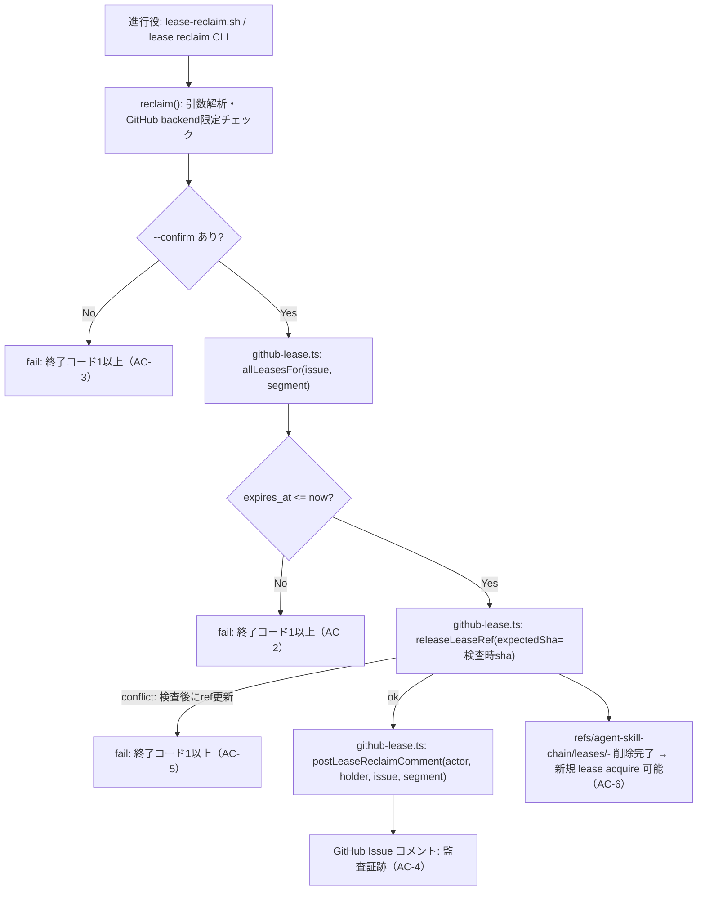
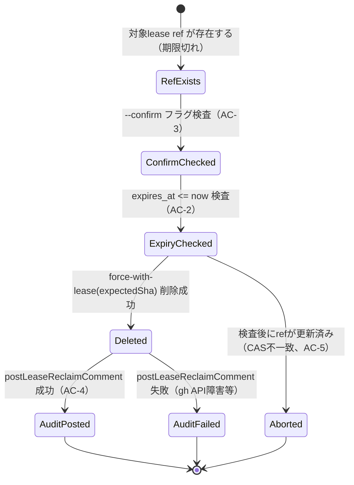

# DESIGN: bugfix: 期限切れ+credential紛失writer leaseを人間が回収するための正規CLI経路が無い

- Issue: `ISSUE-441`
- 対応する SPEC: `SPEC.md`

## 要件 → 設計要素の対応表

| 要件 / AC-ID | 対応する設計要素 | 備考 |
|---|---|---|
| 要求（credential不要の正規CLI回収経路） | `lease reclaim` コマンド（`src/commands/lease.ts` の `reclaim()`） | GitHub Coordination Backend限定。ローカルモードは `lease acquire` 自身が期限切れ既存ファイルを検出し回収・再試行する既存経路（`src/commands/lease.ts` の `acquire()` ローカル分岐）を既に持つため対象外（下記「依存関係」参照）。 |
| AC-1（期限切れleaseを回収できる） | `reclaim()`：`--confirm` 検査 → `allLeasesFor` による対象lease取得 → 期限切れ検査 → `releaseLeaseRef` 呼び出し | 既存 `releaseLeaseRef`（`src/lib/github-lease.ts`）をそのまま再利用する。新規のref削除ロジックは作らない。処理順序はmermaid図・状態遷移図・PLAN.md #2 の実装手順と一致させ、`--confirm` 検査を先頭に置く（AC-3行参照）。 |
| AC-2（期限内leaseは回収できない） | `reclaim()` 内の `expires_at > now` 検査（`releaseLeaseRef` 呼び出し前に早期return） | `lease resume` の期限検査（`resume()` 内、既存実装）と同じ比較方式に揃える。この検査に到達する時点で `--confirm` 検査（AC-3）は既に通過済みである。 |
| AC-3（確認オプションなしでは回収しない） | `reclaim()` 冒頭の `--confirm` フラグ検査。検査失敗時は標準エラー出力へ固定メッセージ「`--confirm` オプションを付けて再実行してください」を表示してから終了コード1以上で終了する | `upgrade` コマンドの `--dry-run`（`args.includes('--flag')`、`src/commands/upgrade.ts`）と同じ引数解析パターンを踏襲する。メッセージ文言は `RECLAIM_USAGE` とは別の専用文字列として `reclaim()` 内に定数化する（SPEC.md AC-3 Then節が要求する「再実行を促すメッセージ」に対応）。 |
| AC-4（回収証跡がCoordination Backendに記録される） | `postLeaseReclaimComment()`（新規、`src/lib/github-lease.ts`） | 既存 `postLeaseComment`／`cleanupLeaseComment` とは別マーカー・別関数にする（可視性コメントの削除対象に監査コメントが巻き込まれないようにするため）。 |
| AC-5（検査後にrefが更新された場合は回収せず安全側で停止する） | 既存 `releaseLeaseRef` の `force-with-lease=<ref>:<expectedSha>` 削除（`src/lib/github-lease.ts`、変更なし） | `reclaim()` は検査時に読んだ `sha` を `expectedSha` としてそのまま渡すだけで、ADR-0002のCAS保証をそのまま継承する。 |
| AC-6（回収後は新規lease取得が可能になる） | 既存 `acquireLeaseRef`（`src/lib/github-lease.ts`、変更なし） | ref削除により非fast-forward拒否の前提が消えるため、既存 `lease acquire` の実装を変更せずに満たされる。 |
| AC-7（writer credentialを保有していない回収操作でも成立する） | `reclaim()` は `readLeaseCredential`／`resolveCredentialToken`／`tokensEqual` を一切呼び出さない | credential系ヘルパー（`src/lib/lease-credential.ts`）への依存を持たないことをコードパス上の設計原則として明示する。回収主体（進行役）の識別は `--actor` オプション（省略時 `git config user.name`、さらに未設定なら固定文字列 `unknown-operator` へフォールバック）で行い、writer credentialとは無関係の情報源にする。 |

## 責務・境界

### コンポーネント構成

- `lease reclaim` CLIコマンド（`src/commands/lease.ts` の `reclaim()`、`RECLAIM_USAGE` 定数）: 引数解析（issue_id・segment・`--confirm`・`--actor`）、期限切れ検査、`--confirm` 検査、GitHub backend限定チェック、下位関数の呼び出し順序の制御を担う。
- `cli-routes.ts` ルート登録: `'lease reclaim': lease.reclaim` を既存の `'lease acquire'`／`'lease release'`／`'lease renew'`／`'lease resume'` と同列に追加するだけの配線責務。
- `github-lease.ts` 監査コメント生成（`postLeaseReclaimComment()`、新規）: 回収主体・回収日時・対象Issue/segment・回収前holderを含む固定フォーマットのIssueコメントをGitHub API（`gh issue comment`）へ投稿する。
- `github-lease.ts` 既存CAS/読み出しプリミティブ（`allLeasesFor`／`releaseLeaseRef`、変更なし）: ref読み出しと条件付き削除の責務は既存のまま再利用するだけで、reclaim専用の分岐やパラメータを追加しない。
- `.agent-skill-chain/scripts/lease-reclaim.sh`（新規）: `lease-acquire.sh`／`lease-release.sh` と同型の、CLIサブコマンドへの薄い委譲ラッパー。

責務が1箇所に集中していないかの確認（反証観点）: 「監査コメントの内容生成」を `reclaim()` 側に置かず `github-lease.ts` 側の専用関数に閉じ込めることで、Issueコメントのフォーマット（MARKER・本文構造）に関する責務を既存の `postLeaseComment`／`renderLeaseComment` と同じ層に集約し、CLIコマンド層はオーケストレーション（検査順序の制御）のみを担う。

### 依存関係

```text
lease-reclaim.sh（配布ラッパー）
  → src/commands/lease.ts: reclaim()（CLIコマンド層、引数解析・検査順序制御）
    → src/lib/github-lease.ts: allLeasesFor（対象lease読み出し）
    → src/lib/github-lease.ts: releaseLeaseRef（force-with-lease削除、既存）
    → src/lib/github-lease.ts: postLeaseReclaimComment（監査コメント投稿、新規）
      → git（origin への ref 操作）
      → gh（GitHub Issue コメントAPI）
cli-routes.ts → src/commands/lease.ts: reclaim（ルート登録のみ、片方向）
```

`reclaim()` は `lease-credential.ts`（credential読み書き）へは依存しない（AC-7）。既存の `release()`／`resume()`／`acquire()` は `reclaim()` から呼ばれず、`reclaim()` も既存コマンドの内部状態（credentialファイル等）を変更しない——双方向の依存や循環は発生しない。

### 図示要否の判断

- 判断: `要`
- 根拠: 責務境界が3つ以上ある（CLIコマンド層 `reclaim()`、`github-lease.ts` ライブラリ層、配布スクリプトラッパー層の3層）ため、下記の依存関係図と状態遷移図を記載する。





## 関連ADR

```yaml
related_adrs:
  - id: ADR-0002
    relation: adopts
```

本設計は ADR-0002（GitHub writer lease の正本を git ref のforce無しpushによるCAS相当保証とする決定、`accepted`）が定める `releaseLeaseRef` の force-with-lease削除保証をそのまま再利用する。credential不要での回収を選んだ理由・トレードオフは本Issueで新規作成する ADR（`docs/adr/ADR-0024-...md`、`status: proposed`）に記録する。ADR-0014（期限切れdirty leaseのresume、`status: proposed`）はcredential一致を前提とする別経路であり、本Issoのスコープ外（SPEC.md「スコープ外」節）として変更しない——`related_adrs:` には `status: proposed` の ADR を含められない（`.agent-skill-chain/templates/adr/ADR.md` の stale参照検査は `accepted` のみを対象とする）ため、本文中の自然文言及に留める。

## 障害・ロールバック考慮

- 想定される失敗モード:
  - (a) `--confirm` なしで実行: 何も変更されず、標準エラー出力へ固定メッセージ「`--confirm` オプションを付けて再実行してください」を表示した上で終了コード1以上（AC-3）。
  - (b) 対象leaseが期限内: 何も変更されず終了コード1以上（AC-2）。
  - (c) 期限切れ検査後、削除実行までの間に対象holderが `lease resume`／`lease renew` に成功しrefを更新した: `releaseLeaseRef` のforce-with-lease条件不一致によりref削除が拒否され、ref状態は更新後の値のまま保持される。終了コード1以上（AC-5）。
  - (d) ref削除（`releaseLeaseRef`）は成功したが、直後の `postLeaseReclaimComment`（gh issue comment 投稿）がネットワーク障害・権限不足等で失敗する: ref状態は正しく回収済み（AC-6を満たす）だが監査証跡が残らないため、コマンドは終了コード1以上を返し、標準エラー出力に「ref削除は成功したが監査コメント投稿に失敗した」旨と手動での `gh issue comment` 実行を促すメッセージを表示する。ref削除の巻き戻しは行わない（削除自体は正当な回収であり、取り消すとAC-6の状態を壊すため）。
  - (e) (d)の状態のまま同一コマンドを再実行する: 対象leaseは既に削除済みのため手順(5)の `allLeasesFor(...).find(...)` は該当なしとなり、通常の「対象lease未検出」fail経路に合流する。この経路の標準エラーメッセージを「対象の writer lease が見つかりません（既に回収済み、または issue_id/segment 指定誤りの可能性があります）」という固定文言にすることで、(d)から再実行した操作者が「前回実行が既にref削除に成功していた可能性」を推測できるようにする。監査コメントの有無を照会して(d)由来か指定誤りかを機械的に判別する追加ロジックは持たない——`postLeaseReclaimComment`の成否と`allLeasesFor`の状態は別ドメインであり、両者を突き合わせる判定ロジックを追加すると責務がCLIコマンド層に集中するため、本Issueのスコープでは静的メッセージの改善に留める。
- ロールバック手順: (a)(b)(c) はいずれも状態変更が発生しないため、ロールバック不要（安全側で停止済み）。(d) はref状態のロールバック対象ではなく、進行役が手動で `gh issue comment <issue> --body "..."` を実行し証跡を補完する。(e) は新たな状態変更を伴わないため対応不要（操作者が(d)の可能性を認識した上で監査コメントの手動投稿要否を判断する）。
- 影響を受ける既存機能: `lease acquire`／`lease release`／`lease renew`／`lease resume` の検査ロジック・スキーマ・refフォーマットは無変更（SPEC.mdのスコープ外節）。`releaseLeaseRef`／`allLeasesFor` は新規呼び出し元（`reclaim()`）が増えるのみで、既存呼び出し元（`release()`／`resume()`）の挙動・シグネチャは変更しない。
