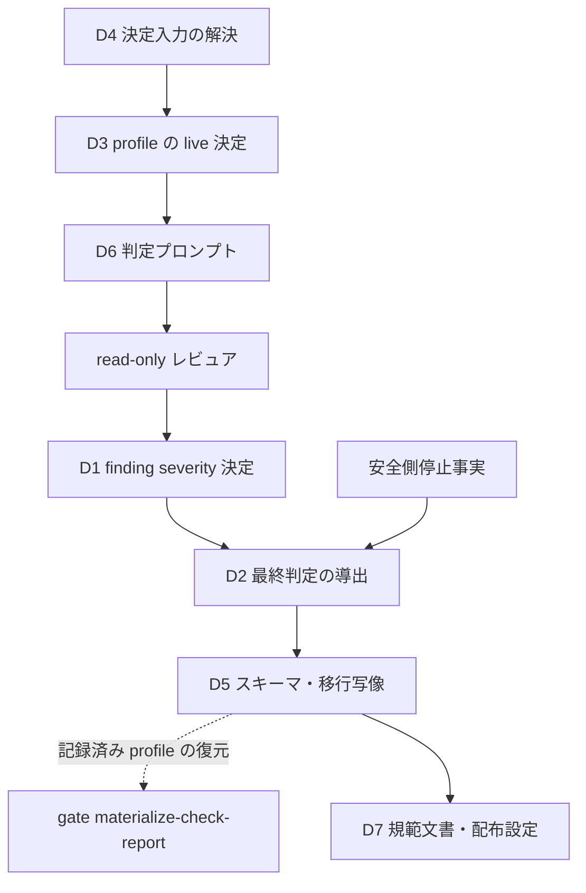
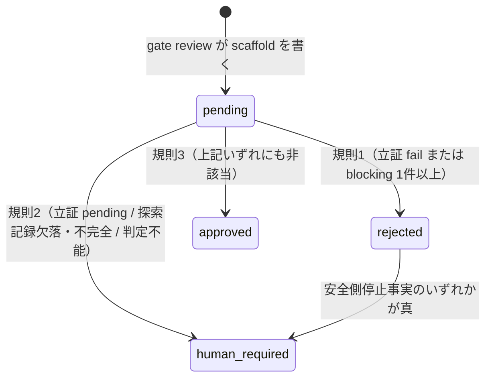

# DESIGN: 反証観点をゲートの合否条件から外し、finding のトリアージへ置き換える

- Issue: `ISSUE-808`
- 対応する SPEC: `SPEC.md`

## 目的・対象範囲

承認済み `SPEC.md` が確定させた3つの状態空間——(a) finding の severity 決定、(b) ゲート最終判定の導出、(c) レビュープロファイルの決定——を既存モジュールの責務へ最小変更で割り当てる。反証の探索は維持したまま、反証観点の合否値を最終判定の入力から取り除き、blocking への昇格を閉じた列挙の昇格類型と必須根拠に限定し、profile 決定から `risk` の値を取り除く。対象範囲は agent-skill-chain 本体の判定ロジック・スキーマ・判定プロンプト・規範文書・配布テンプレートであり、対象外は本書末尾に列挙する。

## 前提

承認済み `SPEC.md` は変更しない。本書は要求 `FALSIFICATION_AS_BINARY_GATE`・`SUBJECTIVE_BLOCKING`・`STRICT_FORCED_BY_RISK`、要件 R1〜R4、受入条件 AC-1〜AC-11 を実装可能な設計要素へ写像するだけであり、要求を追加も削減もしない。本変更は `AGENTS.md`・`.agent-skill-chain/schemas/` 配下を変更するためコア対象であり、独立2体の read-only レビュアによる Strict 判定を要する。ゲート最終判定は `approved` / `rejected` / `human_required` / `pending` の4値であり、`pending` はレビュー未了、`human_required` はレビュー完了かつ判定不能を意味する。本変更はこの意味論を変えない。ISSUE-786 が導入したラウンド予算機構と light 再是正上限は撤去せず、最終判定の後段に置く一方向の安全側振り替えとして位置づけ直す。

## 用語

`SPEC.md` の用語節が定義済みの語（観点・昇格類型・必須根拠・反証探索記録・明示オプトイン・コア対象）は同一の意味で用いる。本書が新たに導入する語は次の4つである。

- **wire profile**: 既存の証跡・スキーマ・launcher token が保持する2値の profile 表現（`standard` / `strict`）。レビュア体数を決める値であり、既存の互換境界そのものである。
- **live 決定**: これから実施する attempt の profile を決めること。入力は `SPEC.md` R3 の閉じた列挙だけであり `risk` を含まない。結果は3値（`strict` / `light` / `standard`）で、wire profile と `light_review` 記録の組へ写像する。
- **記録済み profile の復元**: 既に投稿・発行済みの証跡・Check を検証するために、当時その記録へ書かれた profile 値を読むこと。決定規則を再適用しない。
- **安全側停止事実**: 最終判定の導出結果を承認から遠い側へのみ振り替える後段の事実。分類record不正・ラウンド打ち切り・light 再是正上限の3つ。

## 入力・出力

| 区分 | 項目 | 供給元 / 保存先 | 形式 |
|---|---|---|---|
| 入力 | レビュア verdict | read-only レビュア（stdin JSON、または PR review evidence） | 観点宣言つき finding 群・立証観点の合否値・反証探索記録・判定不能表明 |
| 入力 | 判定対象成果物と差分、AC-ID 集合 | target SHA の git tree と同 SHA の `SPEC.md` | 判定プロンプトへ展開した本文、昇格評価の引用照合対象、`AC-<n>` の集合 |
| 入力 | profile 決定入力、安全側停止事実 | Issue ラベル（GitHub モード）／`state.yaml`（ローカルモード）／変更差分／直前ラウンドの gate-report／ラウンド文脈／finding 分類record／`light_review` 記録 | 真偽値4つと差分解決状態1つ、真偽値3つ |
| 出力 | ゲート最終判定、finding 群、反証探索記録、適用された review profile | gate-report（`reviews/<gate>.yaml` または Check Run 出力）と PR review evidence の `gate.final`・`gate.blockers`・`gate.falsification_search`・`gate.review_profile`・`gate.light_review` | 4値の最終判定、severity と観点と origin と code と evidence 原文と昇格評価結果、探索の実施有無と反例候補の列挙（合否値を持たない）、決定結果と適用規則番号と決定入力の値 |

## 要件 → 設計要素の対応表

| 要件 / AC-ID | 対応する設計要素 | 検証方法 |
|---|---|---|
| R1 / AC-1 | D1 `validateReviewerVerdictShape`、D5 evidence v4・gate-report v2 | `automated`（単体: 観点欠落・列挙外値の各入力が受理拒否を経て `human_required` になる） |
| R1 / AC-2 | D1 `classifyFindingSeverity` の `conformance_failure` 分岐 | `automated`（単体: `unmet` / `evidence_missing` が昇格類型・必須根拠なしで blocking。単なる AC-ID 言及は AC-4） |
| R1 / AC-3 | D1 `evaluatePromotion`、D5 gate-report v2 の `promotion` / `promotion_evaluation` | `automated`（単体: 4類型 × 必須根拠充足で blocking、記録内容だけで再現可能） |
| R1 / AC-4 | D1 の降格経路、D5 の原文保持制約 | `automated`（単体: 昇格不成立の各経路が warning 以下、evidence 原文が同一） |
| R2 / AC-5 | D2 `deriveGateFinal` 規則1 | `automated`（単体: 立証 fail・blocking 1件以上の各入力が `rejected`） |
| R2 / AC-6 | D2 `deriveGateFinal` 規則2 | `automated`（単体: 立証 pending・探索記録欠落／不完全・判定不能の各入力が `human_required`） |
| R2 / AC-7 | D2 `deriveGateFinal` 規則3 と安全側停止事実の適用規則 | `automated`（単体: warning/info 多数かつ探索記録ありで `approved`。3事実いずれが真でも `approved` が保たれる） |
| R3 / AC-8 | D3 `decideReviewProfile`、D4 `resolveLiveReviewProfile`、判断3のinventory、D5 `decodeLegacyEvidenceProfile`、D7の旧経路除去 | `automated`（単体: 他入力同一なら`risk` 3値で同じ結果。統合: inventory全経路に`risk`由来のlive入力が無い） |
| R3 / AC-9 | D3 の順序評価と全域性 | `automated`（単体: 決定入力の全組合せに対する表駆動テスト） |
| R4 / AC-10 | D5 スキーマ4件の版更新と `src/lib/gate-record-migration.ts` | `automated`（単体: v1 レコードの `approved` が保持され再導出されない。統合: 旧版 Check の再構築が成功し続ける） |
| R4 / AC-11 | D7 `AGENTS.md`・`docs/GLOSSARY.md`・設定テンプレート・`roles.yaml`・配布スキル | `automated`（統合: 2規範文書に反証の非二値化、4昇格類型、類型別必須根拠、R3 の profile 順序があり、旧 `risk` 昇格記述が無いことを固定文字列で検査） |

## 責務・境界

### コンポーネント構成

- **D1 `src/lib/gate-finding-severity.ts`（新設）**: finding 単位の判断だけを負う。観点宣言と `conformance_failure` の検査、昇格類型の閉じた列挙、類型ごとの必須根拠の形式検査、逐語引用の照合、severity の決定。ゲート最終判定を知らず、自分で確定させない。
- **D2 `src/lib/gate-verdict-aggregation.ts`（改訂）**: attempt 単位の判断だけを負う。slot 件数・判定確定数の検査、`SPEC.md` R2 の順序評価による最終判定の導出、安全側停止事実の適用。最終判定を導出する唯一の場所とする。finding の severity を自分で決めない。
- **D3 `src/lib/review-profile.ts`（全面改訂）**: profile の live 決定だけを負う全域関数。R3 の4論理入力（差分解決可否とコア成立を別scalarにした5項目）を受け、順序評価で決定結果・適用規則番号・次ラウンドのラチェット値を返す。副作用・`risk` 型・旧記録復号を持たない。
- **D4 `src/lib/review-light.ts`（責務の付け替え）**: `resolveLiveReviewProfile` facade として、明示オプトインの人間確認、差分解決、コア成立、直前ラウンドの strict 確定を Coordination Backend から解決して D3 へ一度だけ渡す。決定規則を複製しない。
- **D5 スキーマとマイグレーション**: `.agent-skill-chain/schemas/{gate-report,state,config}.schema.yaml` と review evidence の版更新、および `src/lib/gate-record-migration.ts`（新設）。旧版レコードの解釈と、v3 evidence の `profile`・`expected_count` から記録済み wire profile を復号する `decodeLegacyEvidenceProfile` だけを負う。決定規則を持たず D3 を呼ばない。
- **D6 判定プロンプト（`src/commands/gate.ts` の `buildReviewerPromptFromResolved`）**: 反証ルーブリックを、探索の指示を保ったまま、合否値の要求から昇格類型と必須根拠の申告要求へ置き換える。出力 JSON 契約を新版へ更新する。
- **D7 規範文書と配布物**: `AGENTS.md`・`docs/GLOSSARY.md`・`.agent-skill-chain/config/{agent-skill-chain,roles}.yaml`・`.agent-skill-chain/templates/{standard,lightweight}/agent-skill-chain.yaml`・`.agent-skill-chain/templates/claude/skills/gate-review/SKILL.md`。

各判断はいずれか1つのモジュールだけが行い、複数箇所へ分散させない。D3 と D5 は互いを参照しない。live 決定と記録済み profile の復元を同一関数へ混ぜないことが、AC-8（`risk` 経路の不在）と AC-10（既存承認の非無効化）を同時に満たす条件である。

### 依存関係



循環は無い。D1 は D2 を参照せず、D3 は D1・D2・D5 を参照しない。安全側停止事実は D2 への入力として合流し、D2 の出力を後から書き換える経路を持たない。

### 状態遷移



`approved` から出る遷移は無い。安全側停止事実は `rejected` からの1本だけを生み、`approved` を生むことも消すこともない。

### 図示要否の判断

- 判断: `要`
- 根拠: 依存関係が3つ以上（D4→D3→D6→D1→D2→D5→D7 の連鎖と安全側停止事実の合流）、状態遷移が2つ以上（規則1〜3の3遷移と安全側振り替え）、責務境界が3つ以上（D1〜D7 の7境界）であり、いずれの基準にも該当する。

## 判断内容

### 判断1: finding の観点宣言と severity 決定（R1 / AC-1〜AC-4）

**データ形状**（gate-report v2 の finding、および evidence v4 の finding）

```yaml
severity: blocking | warning | info
perspective: conformance | falsification      # 新設・必須
origin: specification | design | implementation | validation   # 既存
code: <文字列>                                 # 既存
evidence: [<文字列>, ...]                      # 既存。原文をそのまま保持する
conformance_failure: {ac_id: AC-<n>, kind: unmet | evidence_missing}  # 立証の AC-ID 未達・未証跡だけ
promotion:                                     # 反証観点でレビュアが昇格を申告する場合のみ
  category: issue_purpose_blocked | existing_behavior_regression | data_loss_or_security | ci_build_failure
  quote_path: <引用元のリポジトリ相対パス>
  quote: <quote_path のファイル本文からの逐語引用>
  basis: <類型ごとの必須根拠>
promotion_evaluation:                          # 記録側が書く。レビュアは書けない
  outcome: promoted | not_promoted
  category: <promoted のときのみ、promotion.category と同値>
  rejected_reason: <not_promoted のときのみ、日本語1行>
```

**昇格類型と必須根拠の形式**（閉じた列挙。列挙外の `category` は AC-1 の受理拒否対象）

| 類型 id | 意味 | 必須根拠 `basis` の形式 | 機械的検査 |
|---|---|---|---|
| `issue_purpose_blocked` | 当該 Issue の目的の直接阻害 | 阻害される目的に対応する AC-ID | `AC-<n>` 形式を含み、当該 target SHA の `SPEC.md` から抽出した AC-ID 集合に実在する |
| `existing_behavior_regression` | 既存挙動の回帰 | 回帰する既存挙動を定義する成果物パス、またはテスト題名の逐語引用 | 当該 target SHA に実在するリポジトリ相対パス、または同 SHA のテストファイル本文に逐語一致する題名を含む |
| `data_loss_or_security` | データ喪失またはセキュリティ低下 | 喪失・低下が生じる資産のパスと、その資産へ到達する操作の名前 | 双方が当該 target SHA に実在するリポジトリ相対パスまたはコマンド名として解決できる |
| `ci_build_failure` | CI・ビルドの失敗 | 失敗するコマンド行と、その出力または終了コード | `$ ` で始まるコマンド行を1行以上含み、それに続く出力行または終了コード表記を1行以上含む |

**入力閉包と引用照合**。`quote_path` と `quote` は全類型に共通で必須とする。D6 が target SHA から解決し prompt digest に束縛した判定入力パス集合を evidence と gate-report に保存し、D1 はその集合内の本文だけを読む。`quote` は LF 正規化・行末空白除去後に16文字以上の逐語一致を要求する。これにより read-only レビュアは供給済み本文だけで根拠を作れ、記録側と第三者は gate-report の target SHA・入力パス集合・引用から同じ分類を再現できる。

**severity 決定の順序**（finding 単位。先に成立した規則で確定する）

1. `perspective` が未宣言、または `perspective`・`promotion.category`・`severity` のいずれかが列挙外 → verdict 全体を受理しない。値の既定補完も当該 finding の黙殺も行わない。受理拒否は当該 slot の verdict を未確定として D2 の `inconclusive` へ写像し、最終判定は D2 の規則2で `human_required` になる（AC-1）。
2. `perspective: conformance` かつ `conformance_failure` があり、`ac_id` が target SHA の `SPEC.md` の AC 集合に実在する → 昇格類型と必須根拠を問わず `blocking`（AC-2）。単に `evidence` が AC-ID を含むだけではこの規則へ入れない。`conformance: fail` なのに有効な `conformance_failure` が0件、または当該宣言があるのに `conformance: pass` の verdict は形状不整合として受理せず AC-1 へ戻す。
3. `perspective: falsification` かつ `promotion` があり、`category` が列挙内で、当該類型の `basis` 形式検査と `quote` 照合の双方を満たす → `blocking`。`promotion_evaluation.outcome: promoted` を記録する（AC-3）。
4. 上記のいずれにも該当しない → レビュアが申告した `warning` / `info` をそのまま採用し、`blocking` の申告は `warning` へ降格する。`severity` 以外（`perspective`・`origin`・`code`・`evidence` 原文）は一切変更せず、降格時は `promotion_evaluation.outcome: not_promoted` と `rejected_reason` を併記する（AC-4）。

規則4の降格は要約・整形・置換・削除を伴わない。ISSUE-786 の finding 分類record および follow-up 起票の経路とは独立に併存し、どちらも他方の記録を上書きしない。

### 判断2: ゲート最終判定の導出（R2 / AC-5〜AC-7）

**単一導出箇所**。現状は `src/lib/gate-verdict-aggregation.ts`（共通集約）・`src/commands/gate.ts` の `recordVerdict`（light 再是正上限による上書き）・`src/lib/review-evidence.ts`（分類record不正・ラウンド打ち切り・最終round による上書き）の3箇所が最終判定を確定させており、後2者は共通集約の結果を事後に書き換えている。この事後書き換えを廃し、書き換えの根拠であった事実を安全側停止事実として D2 へ渡す。

```
GateFinalInput {
  conformance: 'pass' | 'fail' | 'pending'   # 全 slot の集約値
  blocking_count: number                     # 判断1の severity 決定後の blocking 件数
  falsification_search: 'complete' | 'incomplete' | 'absent'
  inconclusive: boolean                      # レビュアの判定不能表明 / slot 未確定 / verdict 形状の受理拒否
  stop_facts: {
    classification_invalid: boolean           # ISSUE-786 finding 分類record が検査不合格
    round_budget_exhausted: boolean           # ISSUE-786 の打ち切り閾値へ到達
    light_budget_exhausted: boolean           # light 再是正上限へ到達
  }
}
```

反証観点の合否値は入力に存在せず、型としても持たない。`conformance` は ADR-0078 の有効sub-verdict導出を適用した後の集約値であり、その導出は D2 の入力を組み立てる側（`src/lib/review-evidence.ts` と `recordVerdict`）が行う。導出の適用条件は本変更で変えず、対象を `perspective: falsification` の finding へ限定する制約だけを加える。

**導出**（規則を上から評価し、最初に成立したもので確定する）

1. `conformance === 'fail'` または `blocking_count >= 1` → `rejected`
2. `conformance === 'pending'`、`falsification_search !== 'complete'`、または `inconclusive` → `human_required`
3. 上記のいずれにも該当しない → `approved`

**安全側停止事実の適用**（規則は1つだけ）。上記の確定結果が `approved` でなく、かつ3つの安全側停止事実のいずれかが真である → `human_required`。確定結果が `approved` のときは適用しない。この単一規則により `approved` は規則3を通過した入力だけが到達でき、事実の真偽が `approved` を消すことも生むこともない。事実ごとに異なる例外条件を持たせないのは、`approved` を除外する事実と除外しない事実が混在すると規則が非対称になり、同一入力に対する帰結が記述から一意に読めなくなるためである。事実ごとの `reason` 文字列は現行どおり区別して記録し、ISSUE-786 の診断情報を失わない。

**既存挙動との対応**。現行実装の3つの事後上書きは、この単一規則の下で次のとおり保存される。

| 現行の条件 | 現行の帰結 | 本設計の帰結 |
|---|---|---|
| 分類record不正（blocking 残存） | `human_required` | 規則1で `rejected` → 事実が真 → `human_required`（同一） |
| 分類record不正（blocking 0件・立証 pass・探索記録あり） | `human_required` | `approved`（意図的変更。下記） |
| 最終round到達 ∧ blocking 残存 | `human_required` | 規則1で `rejected` → 事実が真 → `human_required`（同一） |
| 最終round到達 ∧ 確定結果が `approved` でない | `human_required` | `rejected` または `human_required` → 事実が真 → `human_required`（同一） |
| 最終round到達 ∧ 確定結果が `approved` | `approved` | `approved`（同一） |
| light 上限到達 ∧ 否定判定が残る | `human_required` | 規則1で `rejected` → 事実が真 → `human_required`（同一） |
| light 上限到達 ∧ 否定判定が残らない | `approved` | `approved`（同一） |
意図的変更は2行目の1件のみである。差し替え対象となる blocking が0件のとき、分類recordの不正は判定へ影響し得ず、blocking を消して安全側停止を回避する経路も存在しない。この1件を現行のまま無条件 `human_required` に据え置くと AC-7（立証 pass・blocking 0件・探索記録ありの attempt を `approved` とする）を満たせない。不正の事実は `reason` へ記録し続ける。他の6行はいずれも現行と同一の帰結であり、ISSUE-786 の有限性保証は失われない。
**反証探索記録**。`gate.falsification_search` は `conducted`（真偽値）と `counterexamples_considered`（探索した反例候補の要約の配列）を持ち、合否値を持たない。フィールド自体が無ければ `absent`、`conducted !== true` または配列が空か16文字未満の要素を含めば `incomplete`、それ以外を `complete` とする。規則2により `complete` 以外は `approved` へ到達できない。これが反証探索の維持を機械的に担保する経路であり、探索の指示（D6）と合わせて二重に保つ。
**ISSUE-786 の finding 分類record に対する制約**。分類record による blocking → warning の差し替えは `perspective: falsification` の finding に限る。`perspective: conformance` の finding を対象とする分類record は不正として扱い `classification_invalid` を立てる。この制約が無いと、AC-2 が無条件 blocking とする AC-ID 未達が最終round で warning へ差し替えられ、不変条件 I7 が緩む。分類record の機構自体は撤去しない。

### 判断3: レビュープロファイルの決定（R3 / AC-8・AC-9）

`ReviewProfileInputs` は R3 の4論理入力を、`full_opt_in`・`light_opt_in`・`diff`（`resolved` / `unresolved`）・`core_target`・`strict_locked` の5 scalarで表す。`core_target` は差分解決時だけ意味を持つ。`risk` は型に存在せず、`ReviewRisk`・`ReviewAutonomy`・`resolveReviewProfile` を削除する。D3 は次を上から評価し、規則4で全域を閉じる。

1. `full_opt_in` → `strict`（2体）
2. `diff === 'unresolved'`、`core_target`、または `strict_locked` → `strict`（2体）。あわせて次ラウンドへ持ち越す `strict_locked` を真にする
3. `light_opt_in` → `light`（1体）
4. それ以外 → `standard`（1体）

戻り値は `{ profile, wire_profile, reviewer_count, rule, inputs, strict_locked_next }` とし、gate-report v2・evidence v4・launcher tokenへ同じ値を記録する。
**live 決定と記録経路の全数**。実装では次の表を正準inventoryとして `test/integration/review-profile-paths.test.ts` に固定する。D3/D4 以外が `risk`・`autonomy`・ラベルから profile を導出することを禁止する。
| 経路 | 改訂後の責務 |
|---|---|
| `src/commands/gate.ts` の `review` | D4を呼ぶlive決定入口。既存profile引数は互換のため構文だけ検査するが決定へ使わず、scaffoldへ決定結果を書き、stdoutで返す |
| `verifyEvidence` と `buildVerifiedGateReport` | D4の再導出結果をv4 evidence・必要体数と照合する。後者は生のprofileでなく決定オブジェクトだけを受ける |
| `recordTrustedCheck` → `fetchTrustedGateApiContext` → `buildVerifiedGateReportFromTrustedContext` | API contextにIssue eventsを追加し、D4が `full` / `light` の人間付与と差分を解決する。`trusted-gate-recorder.ts` のriskラベル式を削除する |
| `materializeCheckReport` | v2は同じAPI contextからD4で再導出する。v1はD5の旧証跡復号へ分岐し、riskラベル式を削除する |
| `gate-local-review.sh`、`gate-launch-reviewer.sh`、各adapter、`submitEvidence` | `review` が返した値をlauncher token・attempt・v4 evidenceへ無変換で運ぶ。引数はtoken/scaffoldとの一致検査だけに使い、決定しない |
| `reviewerContext` / core model policy | コア分類とmodel能力を返すだけとしprofileを変更しない。launcherのcore検査はscaffoldのD3規則番号との整合検査に置換する |
| `issue start` | 起票時は差分が無いためprofileを決めない。直書き式と`review_profile`を削除し、state v2の`gate.profile`はattempt開始時だけ書く |
| `recordVerdict` / `publish` / `reconcile` | profile引数を持たず決定もしない。scaffoldに記録済みの決定を保持し、v2形状だけを更新する |
`submit-evidence`・`verify-evidence` の既存profile引数はwire互換の検査値として残すが、tokenまたはD4結果と不一致なら `human_required` とする。設定の `review.strict.trigger` と配布スキルの旧profile定義も削除するため、表外からlive決定へ値を注入できない。
**v1 profile の復元**。gate-report v1 自体にprofileは無い。GitHubの旧Check再構築では、同じ `attempt_id`・target・gate に属する完備v3 evidenceの `profile` を復元元とし、全slotの値一致、`expected_count`（1=`standard`、2=`strict`）、充足slot数を照合する。不一致・証跡欠落は推測せず `human_required`。旧 `final` は再導出せず、コア対象なら復元値が `strict` であることも独立検査する。
**決定入力の解決**（D4。既存シグナルの読み替えであり、新しいラベル・設定キーを追加しない）

| 入力 | GitHub モード | ローカルモード |
|---|---|---|
| `full_opt_in` | ラベル `autonomy:full` の直近付与 event の actor が User | `state.yaml` の `autonomy: full`。付与主体を機械的に確認できないため常に偽 |
| `light_opt_in` | ラベル `review:light` の直近付与 event の actor が User | `state.yaml` の `review_intensity: light`。同上により常に偽 |
| `diff` / `core_target` | `base...target` 差分の解決可否と、`AGENTS.md`・`.agent-skill-chain/schemas/` 配下・`.agent-skill-chain/config/segments.yaml`・`docs/adr/` 配下への該当、プロジェクトポリシー登録済みのコアパス列挙への該当、`review:core-audit` ラベル | 同左（ラベルの代わりに `state.yaml` の `review_subject: core_audit`） |
| `strict_locked` | 直前ラウンドの gate-report の `light_review.strict_locked` | 同左 |
`verifyGrantorIsHuman` はラベル名を引数に取る共通関数へ置換し、`full` と `light` を同じevent規則で検査する。`strict_locked` は規則2の成立時点で `light` の有無にかかわらず真にする。
**wire profile への写像**。決定結果 `strict` は wire profile `strict`・2体・`light_review.applied` 偽、`light` は `standard`・1体・真、`standard` は `standard`・1体・偽へ写像する。review evidence・launcher token・`config.review.<profile>.reviewer_count` が保持する2値表現は変更しない。新しい profile 値を wire へ導入しないため、投稿済み証跡の再検証・ラウンド計数・digest 照合はいずれも影響を受けない。

### 判断4: 破壊的変更の履行（R4 / AC-10・AC-11）

**版更新するスキーマと外部契約の変化**。版を上げるのは、旧版文書が新版の必須・禁止フィールドに適合しなくなる次の4件に限る。`.agent-skill-chain/schemas/{segments,lease,worker-report,integration,validation-report,project-policy}.schema.yaml` は本変更でフィールドが変わらないため据え置く。

| スキーマ | 旧版 → 新版 | 外部契約の変化（1対1） | 旧版レコードの解釈規則 |
|---|---|---|---|
| gate-report | `.../gate-report/v1` → `v2` | `gate.falsification`（合否値）を禁止し `falsification_search` を必須化する。findingへ`perspective`・`conformance_failure`・`promotion`・`promotion_evaluation`、gateへ`review_profile`（決定・規則・入力）と`review_input_paths`を定義する | v1の記録済み`final`を再導出しない。旧反証値は履歴表示だけに読み替え、findingの観点は未宣言のまま保持し、新規判定へ使わない |
| state | `.../state/v1` → `v2` | 必須フィールドから `review_profile` を削除する。`gate.falsification`（`verdict` + `counterexamples_tested`）を受理せず `gate.falsification_search`（`conducted` + `counterexamples_considered`）を必須とする。`gate.profile` を必須から任意へ変える | v1 の `gate.falsification.counterexamples_tested` を `counterexamples_considered` として読み `verdict` は破棄する。`review_profile`・`gate.profile` の記録値はそのまま保持し、live 決定の入力にしない |
| config | `.../config/v1` → `v2` | `review.strict.trigger` を受理しない（`review.strict` の必須は `reviewer_count` のみになる）。v1 は `additionalProperties: false` かつ `trigger` を必須とするため、フィールド削除は版を上げないと旧版文書を不正化する | v1 の設定文書は受理し `trigger` を読み捨てる。`doctor` が「当該フィールドは無効であり profile 決定に影響しない」旨を日本語で報告する |
| gate review evidence | `.../gate-review-evidence/v3` → `v4` | verdict から `falsification`（合否値）を受理せず `falsification_search` を必須とする。finding へ `perspective` を必須追加し `promotion` を許可する | v3 証跡はラウンド計数と過去ラウンド展開の入力としてのみ受理し続ける。現ラウンドの判定入力としては受理しない |

各スキーマは `oneOf` で新旧を分岐し、`src/lib/config.ts` と `gate-record-migration.ts` が版別に読む。`gate reconcile` はdigest一致のv1承認をv1のまま再発行し、変更ありのv1だけをv2 pending scaffoldへ移す。移行規則は単一写像とスキーマコメントに同じ内容を置く。

**規範文書・配布物の改訂**（AC-11）。追加条項を作らず既存定義を置換する。`AGENTS.md` I2 は、立証の AC 未達は blocking、反証は合否値を持たない探索、反証 finding の blocking は `issue_purpose_blocked`・`existing_behavior_regression`・`data_loss_or_security`・`ci_build_failure` と各類型の必須根拠が揃う場合だけ、通過は立証 pass・blocking 0・探索記録 complete と1行内で定義する。I8 とレビュープロファイル節は R3 の「full → 差分不能/コア/strict固定 → light → standard」の順序へ置換し、`risk` 条件を削除する。`docs/GLOSSARY.md` の「ゲート」行にも同じ4類型・必須根拠・非二値化を収める。`test/integration/normative-gate-contract.test.ts` は両文書に4 id、必須根拠、反証非二値、R3順序があることと旧 `risk != normal` / 危険信号文言が無いことを検査する。

`.agent-skill-chain/config/agent-skill-chain.yaml` と `.agent-skill-chain/templates/{standard,lightweight}/agent-skill-chain.yaml` は自身の `schema_version` をv2へ上げて `review.strict.trigger` を削除する。`roles.yaml` はゲートレビュア出力を「立証合否・`conformance_failure`・観点つき finding・反証探索記録」へ置換する。`.agent-skill-chain/templates/claude/skills/gate-review/SKILL.md` はprofile定義、出力、手順4〜6、制約を新契約へ置換し、Light追加ルーブリックも4類型だけを使う。template-syncと上記統合テストで展開物の残存旧語彙を検出する。`AGENTS.md` は140行・上限150行であり、いずれも既存行の置換で行数を増やさない。

**判定プロンプトの改訂**（D6、AC-8 の「判定プロンプトに `risk` 由来の strict 昇格経路が存在しない」を含む）。反証ルーブリックから「blocking 基準を満たす反例が1件も無い場合は falsification=pass とする」「1件以上あれば falsification=fail とする」の2文を削除する。反例の探索指示は削除しない。代わりに、探索した反例候補を `falsification_search.counterexamples_considered` へ列挙すること、blocking として提出する反例には昇格類型 id・引用元パス・逐語引用・類型ごとの必須根拠を付すこと、いずれかを欠く反例は warning 以下として記録することを指示する。既存の3条件（目的阻害性・到達可能性・責務内是正可能性）は4類型の意味説明として、実証性は逐語引用の必須化として引き継ぐ。高ラウンドの限定節（ISSUE-786）はそのまま残す。出力 JSON 契約を evidence v4 の形へ更新し、profile 決定結果と適用規則番号をプロンプトへ記載する。判定プロンプトの生成元（`src/commands/gate.ts`）は launcher digest の算出対象集合に含まれないため、本改訂は launcher digest ではなく `prompt_digest` の不一致として現れる。`.agent-skill-chain/config/roles.yaml` は launcher digest の算出対象であり、その改訂は launcher digest を変える。

## 制約

- 承認済み `SPEC.md` を変更しない。不変条件 I1・I3・I5・I7 を緩めない。特に I7 は判断1の規則2（AC-ID 未達の無条件 blocking）と判断2の分類record制約で維持する。
- 反証の探索そのものを削らない。D6 は探索指示を保ち、D2 の規則2は探索記録の無い attempt を `approved` へ到達させない。warning・info の finding を証跡から削除せず、既存の review evidence・gate-report・follow-up 起票への保持を妨げない。
- 判定入力閉包の構成規則（`src/lib/reviewer-prompt-inputs.ts`）を変更しない。プロンプトへ追加するのは反証ルーブリックの文面と profile 決定結果の記載のみとし、増分は既存の `prompt_max_input_bytes` の範囲内に収める。
- 新しい設定項目を追加しない。削除する設定項目は `review.strict.trigger` の1件のみであり、これは AC-8 が「`risk` を入力とする strict 昇格経路が設定に存在しない」ことを要求するために必要な削除である。

## 失敗時の安全側挙動

| 失敗 | 挙動 |
|---|---|
| verdict の観点宣言欠落・列挙外値 | 当該 slot を未確定として `inconclusive` へ写像し、D2 の規則2で `human_required`。既定補完も finding の黙殺もしない |
| `quote` の照合失敗、`quote_path` が target SHA に存在しない、または必須根拠の形式検査失敗 | 当該 finding を warning へ降格し `rejected_reason` を記録。attempt 全体は失敗させない |
| 反証探索記録の欠落・不完全 | `human_required` |
| profile 決定入力のうち変更差分を解決できない | 規則2により `strict`（安全側） |
| 明示オプトインの付与主体を人間と確認できない | 当該オプトインを無かったものとして扱う。確認不能を理由に昇格させない |
| 旧版スキーマのレコードを読んだ／移行写像が解釈できないレコード | 前者は記録済みの `final` と profile を保持し再導出せず、新規判定の入力にもしない。後者は `human_required` とし推測して読み替えない |

## テスト戦略

`.agent-skill-chain/standards/TEST_POLICY.md` の常時必須区分に従い、単体テストと統合テストを実装セグメントの完了条件とする。

- **単体（D1）**: 観点欠落・列挙外値・立証合否と `conformance_failure` の矛盾を受理拒否にする。`unmet` / `evidence_missing` は blocking、単なる AC-ID 言及は warning 以下にする。4類型は必須根拠充足で `promoted`、形式不備・引用不一致・入力閉包外・類型非該当で `not_promoted` にし、原文を保持する。運用実測の3欠陥相当も固定する。
- **単体（D2）**: 立証3値 × blocking 有無 × 探索記録3値 × `inconclusive` の全組合せに対する表駆動テストで規則1〜3を固定する。安全側停止事実3件 × 基礎導出3値の9通りについて、基礎導出が `approved` のときは3件いずれが真でも `approved` のまま、`rejected` のときは `human_required`、`human_required` のときは不変であることを固定する。写像の像に `approved` が新たに現れないことを固定する。反証観点の合否値を入力に持たないことを型と実行の双方で固定する。
- **単体（D3）**: 決定入力5項目の全組合せ（`diff: unresolved` のとき `core_target` は不問）に対する表駆動テストで規則番号と体数が一意に定まることを固定する。`risk` 3値のいずれを Issue へ与えても決定結果が変わらないことを固定する。
- **単体（D5）**: v1 gate-report の `approved` を再導出しないこと、旧反証値の読み替え、v3 evidenceの1/2 slotからstandard/strictを復元すること、不一致を推測しないこと、v1 configのtriggerを読み捨てること。
- **統合**: v4 evidence の3帰結、v3のラウンド計数、コアstrict、`risk` 3値で同一profile、旧strict Check再構築、inventory全経路でprofile引数が決定へ使われず `risk` がD3/D4へ入らないこと、scaffold・reconcile・全schema literalがv2であること、AC-11の規範契約を検査する。
- **CI 既存検査**: `verify gate-report`（版を判別して検査内容を分岐させる改訂を要する）・`verify doc-length`・`lint-vocab`・`lint-references`・`adr-lint`・`verify-template-sync` を通す。

## 完了条件

- 判断1〜判断4のすべてが実装・スキーマ・判定プロンプト・規範文書で一致し、AC-1〜AC-11 のそれぞれに対応表が示す自動検証が存在し成功する。
- 4スキーマの `schema_version` が新版へ更新され、旧版レコードの解釈規則が移行写像とスキーマ添付コメントの双方に明文化されている。上記4件以外のスキーマの版は変わっていない。最終判定を導出する箇所が D2 の1つだけであり、他の箇所が導出結果を事後に書き換えていない。
- 判断3のinventoryにある全経路がテストで列挙され、D3/D4以外にprofile決定がなく、`risk` がlive決定・設定・判定プロンプトへ入らない。

## 未決事項

- 逐語引用の照合における正規化規則（LF 正規化・行末空白除去・16文字下限）は、既存の finding evidence 検査と同じ下限値を採用した仮の値である。運用実測で正当な引用が落ちる事例が出た場合は下限値の見直しを要する。値の変更はコード定数の変更であり設定項目を追加しない。
- ローカルモードでは明示オプトインの付与主体を人間と機械的に確認する手段が無いため、`full`・`light` のいずれも適用されない。ローカルモードで strict を要する場合はコア対象の経路によって成立する。付与主体確認の手段そのものの導入は本 Issue の射程外であり、必要になった時点で別 Issue とする。

## 対象外

- 判定プロンプトの再現性（`prompt_digest` が実行時のゲート結果に依存する問題）は ISSUE-802、ラウンド予算機構の撤去は行わず ISSUE-786 の機構を維持、テスト実行時間の短縮は ISSUE-785 で扱う。
- strict における独立2体の集約規則（論理和）そのものの変更、および2体の逐次起動（後者は ISSUE-784 で扱う）。レビュアの実行系アダプタの選択・権限・認証。
- quick 免除の判定における `risk` の利用。`SPEC.md` は profile 決定からのみ `risk` を外すことを要求しており、`.agent-skill-chain/ci/verify-artifacts.sh` と `src/lib/gate-quick-exemption.ts` が用いる `risk` はそのまま残す。
- `risk` ラベル・`state.yaml` の `risk` フィールドそのものの廃止。profile 決定の入力から外すだけであり、フィールドは quick 免除の入力として存続する。

## 関連ADR

```yaml
related_adrs:
  - id: ADR-0081
    relation: adopts
```

`docs/adr/ADR-0081-falsification-as-finding-triage-and-risk-independent-profile.md`（status: proposed）が、反証を合否条件から外す判断・安全側停止事実による ISSUE-786 との共存・profile 決定から `risk` を外す判断・live 決定と記録済み profile の復元を分離する判断・4スキーマの版更新方針の根拠を記録する。ADR-0068（ラウンド番号導出と反証 blocking 基準）は本決定により反証の合否条件部分だけが置き換わり、ラウンド番号の導出と高ラウンド限定の部分は存続する。ADR-0078（finding 再分類と有効 sub-verdict）は本決定により対象が反証観点 finding へ限定される。ADR-0070（verdict 集約の定足数）は本決定の D2 が引き継ぐ。

## 障害・ロールバック考慮

- 想定される失敗モード: (1) 昇格評価が実欠陥を warning へ落とし続ける、(2) 逐語引用の照合が正当な引用を落として blocking が成立しなくなる、(3) profile 決定の変更でコア対象が strict にならない経路が残る、(4) 旧版レコードの解釈が既存の承認を無効化する。
- ロールバック手順: 本変更は単一 PR で入るため revert が第一手段である。revert 後、当該期間に v2 として書かれた gate-report は v1 スキーマ検査に適合しなくなる。gate-report は attempt ごとに再生成できる記録であり永続的な利用者データではないため、影響 Issue のゲートを再実行して復旧する。復旧対象の特定は `gate.schema_version` が v2 である gate-report の走査で行う。
- 影響を受ける既存機能: ゲート判定（4ゲート全て）、`gate reconcile` の承認継承、`gate materialize-check-report` による旧 Check の再構築、review evidence の検証、ラウンド計数、`issue start` の `state.yaml` 初期化、`doctor` の設定検査、`verify gate-report`。いずれも本 PR 内で追随させる。
- 適用時点で進行中のゲート反復は、判定プロンプトが変わるため投稿済み証跡の `prompt_digest` が期待値と一致せずやり直しになる。やり直さない場合の判定は既存の digest 一致検査により `human_required` へ倒れる（ADR-0068 が既に受け入れている帰結と同型）。判定材料が揃わない入力はすべて `human_required` へ収束し、承認が黙って記録される経路を新設しない。安全側停止事実の適用は一方向であり、既存のラウンド予算機構による安全側停止を弱めない。
