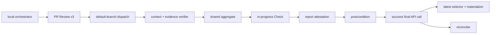

# DESIGN: 強制可能なattested gate Check

- Issue: `ISSUE-283`
- 対応する SPEC: `SPEC.md`

## 要件 → 設計要素の対応表

| 要件 / AC-ID | 対応する設計要素 | 完了条件 |
|---|---|---|
| AC-1 | TrustedGateRecorder / AttestationVerifier / ReportMaterializer | success-last、耐久report、復元 |
| AC-2 | TrustBackendResolver / LatestCheckSelector / ImmutableContextValidator | source・SHA・replay・no-fallback拒否 |
| AC-3 | #274 EvidenceVerifier / AggregatePolicy / ActorAuthorizer | v3 latest attemptと独立性 |
| AC-4 | GateReconciler / ArtifactSetComparator | fresh checkoutで集合完全比較 |
| AC-5 | DistributionPreflight / template同期 / ruleset renderer | 対応backendだけを原子的配備 |
| AC-6 | BootstrapGuard | #274のPR・SHA・digest一意な一回限り記録 |

## 責務・境界

- `TrustBackendResolver`: rulesetとGitHub APIから`dedicated_app|required_workflow`を解決する。標準Actions App単独を拒否する。
- `ActorAuthorizer` / `ImmutableContextValidator`: dispatch actor権限とPR・Issue・base・current SHA・gateをAPIから確定する。
- `EvidenceVerifier` / `AggregatePolicy`: #274のv3 latest-attempt検証・集約を共有する。#283はverdictを再導出しない。
- `TrustedGateRecorder`: 専用App tokenでin_progress Checkを作り、report envelopeをattest後、最後のAPI操作で完了させる。
- `AttestationVerifier`: subject digest、repo、signer workflow/ref/digest、run attempt、Check IDを暗号検証する。
- `LatestCheckSelector`: enforcement source・name・SHA一致runの最大IDをconclusionより先に選ぶ。
- `ReportMaterializer`: latest attested successの`output.text`だけをgate-report cacheへ原子的に復元する。
- `ArtifactSetComparator` / `GateReconciler`: previous reportとcurrent期待path集合・全digestを比較し、下流を連鎖無効化する。
- `DistributionPreflight`: attestation利用可否、App/environment/rulesetまたはRequired Workflowを全検査してから展開する。
- `BootstrapGuard`: #274固定PR/SHA/digestの未使用を確認し、owner承認と非gate CI証跡をPR Reviewへ一度だけ記録する。



## 信頼境界とプロトコル

`dedicated_app`を現リポジトリの実装backendとする。Appは`Checks: write`と`Metadata: read`だけを持つ。
秘密鍵は固定environment `agent-skill-chain-gate`のsecretに保存し、deployment branchを`main`だけに制限する。
recorder workflowはdefault branchの`repository_dispatch`だけでenvironmentを参照し、candidate codeをcheckout・実行しない。
rulesetの全gate contextへApp integration IDを埋める。通常`GITHUB_TOKEN`には`checks: write`を与えない。

`required_workflow`はorg/enterprise rulesetのworkflow source repo/path/refを固定し、実行時にsource SHA・PR event・
attestation signerを再検証する。forkは両backendの追加隔離に限り、backend判定には使わない。

RecorderはPR/gate単位concurrency（cancelなし）で、PR番号・gate・40桁SHA以外を信頼入力にしない。
専用App Checkをin_progressで作成後、Check IDを含むcanonical report envelopeを生成する。GitHub artifact
attestationを作成し、`gh attestation verify`でrepo・signer workflow・`refs/heads/main`・signer digestを固定して
検証する。App/ruleset、current head、latest attempt、artifact再計算、attestation再読取が全て成立した後、
approvedならsuccess、rejectedならfailure、判定不能ならaction_requiredへ更新する。success後に検査を置かない。

Materializerとreconcilerは全conclusionの最大Check IDを先に選び、そのrunだけを検証する。report、evidence、
attestation、artifactのいずれかが不正、またはlatestがsuccess以外なら旧successへ戻らない。reconcileはprevious
headの検証済みpath集合をcurrent SHAの期待集合と双方向比較し、追加・削除・digest差異・取得不能を変更として扱う。

## 配布・移行・関連ADR

setup/upgradeはread-only preflight後にstagingへ展開し、同期・ruleset適用まで成功した時だけ置換する。
既存consumerはbackend未構成なら現状を変更せず設定エラーにする。GitHub App作成自体は一回限りowner操作だが、
環境作成・secret登録・ruleset配線・検証はsetup CLIが行う。AI credentialやrunner追加は要求しない。

```yaml
related_adrs:
  - id: ADR-0013
    relation: adopts
```

## 障害・ロールバック考慮

- API・attestation・App・environment・ruleset不明はsuccessや部分配備へ倒さず、Checkをaction_requiredにする。
- final success更新の通信結果が不明なら同じrunを成功扱いせず、API再読取後に新attemptを要求する。
- rollbackはworkflow/CLIをPRでrevertするがrequired contextを外さない。復旧まではmerge停止を維持する。
- bootstrap used-keyは`repo/PR/SHA/digest`で一意化し、別SHA・二回目・通常PRからの呼出しを拒否する。
