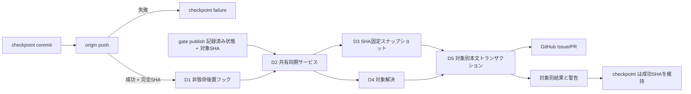

# DESIGN: Sync issue artifacts at each checkpoint push

- Issue: `ISSUE-816`
- 対応する SPEC: `SPEC.md`

## 目的・対象範囲

成功した checkpoint push を耐久性境界とし、その後に GitHub Issue/PR 本文への成果物同期を独立して試行する。同期は push 済み完全 SHA の Git tree だけを入力とする一方向の派生処理であり、失敗しても checkpoint の終了コード、標準出力の SHA、remote ref を変更しない。既存の `gate publish` も同じ同期サービスを使い、設定、対象選択、本文保護、競合処理、上限処理を二重実装しない。

対象は `src/commands/checkpoint.ts`、`src/commands/gate.ts`、`src/lib/issue-sync.ts`、branch から Issue 番号を解決する共有処理、および既存テストの拡張である。設定、スキーマ、4セグメント、ゲート判定、Check Run の契約は変更しない。

## 前提・用語・入出力

- 前提: checkpoint は commit 後に `origin` への push が成功して初めて完全 SHA を同期へ渡す。push 失敗時は同期しない。
- 同期候補: target SHA、同 SHA に実在する成果物 payload、既存ゲート表示から構成する固定マーカーブロック。
- CAS 観測値: GitHub から読み取った対象本文全体。マーカー区間だけでなく、マーカー外の第三者更新も競合として検知する。
- 入力: backend、既存 `issue_sync` 3設定、Issue 番号、branch、target SHA、同 SHA の Git tree、既存ゲート記録、対象本文。
- 出力: 対象ごとの `synced_full`、`synced_fallback`、`sync_failed_no_write`、または全体の `not_applicable` と診断。checkpoint 呼出し元には完全 SHA と非致命警告を返す。

## 要件 → 設計要素の対応表

| 要件 / AC-ID | 対応する設計要素 | 備考 |
|---|---|---|
| AC-1 | D1 checkpoint 後置フック、D2 共有同期サービス | 4成果物の各 push 後に gate 非依存で実行 |
| AC-2 | D1 適用条件判定 | local/disabled は GitHub API を呼ばず `not_applicable` |
| AC-3 | D1 target SHA 引渡し、D3 SHA 固定スナップショット | 作業コピーや移動する branch tip を読まない |
| AC-4 | D4 対象解決、D5 対象別トランザクション | 3 target と PR 0/1/複数、`both` の独立性 |
| AC-5 | D5 厳密境界解析・本文全体 CAS | 追加、置換、不正拒否、反復冪等性 |
| AC-6 | D5 排他的サイズ決定 | full、fallback、no-write を生成後本文長で決定 |
| AC-7 | D3 可逆 payload codec | 存在ファイルのみ、規定順序で無害化・復号 |
| AC-8 | D3 ゲート表示モデル、D6 読み戻し禁止 | target SHA と現在/過去/未判定を表示し状態は変更しない |
| AC-9 | D1 非致命境界、D5 対象別結果 | push 成功を維持し対象・理由・SHAを警告 |
| AC-10 | D2 共有同期サービス、D5 競合順序 | checkpoint と gate publish の契約を共通化 |

## 責務・境界

### コンポーネント構成

- D1 checkpoint オーケストレータ (`src/commands/checkpoint.ts`): 従来どおり stage、commit、branch 解決、push、完全 SHA 確定までを致命処理として実行する。push 成功後だけ設定と Issue 番号を解決して D2 を `try/catch` 内で呼び、全結果を SHA 付き警告へ変換した後も `ok(sha)` を返す。stdout は既存どおり SHA 1行だけとする。
- D2 共有同期サービス (`src/lib/issue-sync.ts`): gate 固有名の入口を trigger 非依存の入口へ置き換え、checkpoint と `gate publish` の双方から同じ target SHA で呼ぶ。適用条件、スナップショット生成、対象解決、対象別更新を順序付けるだけで、commit、push、Check Run、ゲート状態の生成・更新は行わない。
- D3 SHA 固定スナップショットと renderer (`src/lib/issue-sync.ts`): `git show <targetSha>:<artifact>` で実在する4成果物だけを取得する。payload は全 `&` を `&amp;`、次に両固定マーカーの先頭 `<` を `&#60;` に変換し、逆順の decoder で元文字列を復元できる純粋関数とする。
- D4 Issue/PR 対象解決: branch pattern から Issue 番号を一意に抽出する共有関数と、既存の open PR 一意選択を使う。`both` は Issue と PR を別の D5 呼出しへ分け、PR 解決失敗を Issue 更新へ波及させない。
- D5 本文更新トランザクション (`src/lib/issue-sync.ts`): 境界解析、候補生成、上限状態決定、本文全体 CAS、最大1回の再試行、書込み、型付き結果を対象ごとに閉じ込める。API 失敗・境界不正・縮退不能・未解消競合は書き込まず `sync_failed_no_write` とする。
- D6 ゲート表示アダプタ: 既存記録から `final` と `target_sha` の組を読み、同期 target と一致すれば「この checkpoint の状態」、不一致なら「過去の SHA の状態で最新 checkpoint の通過を示さない」、記録無しなら「未判定」と描画する。同期本文は競合検知以外では読み戻さず、ゲート判定入力にしない。

### 処理順序と依存関係



依存方向は command → 共有同期サービス → Git/GitHub adapter の一方向である。同期サービスから checkpoint や gate command を呼び戻さず、循環依存を作らない。

### 図示要否の判断

- 判断: `要`
- 根拠: 4つ以上の責務境界と、push 成否および対象別結果の複数分岐があるため、順序と非致命境界を図示した。

## 詳細設計

### marker・CAS・重複実行

境界 parser は開始・終了マーカーの出現数と順序を検査し、`absent`、`valid`、`invalid` の一つだけを返す。`absent` は元本文を切り詰めず末尾へ1区間を追加し、`valid` は境界を含む区間だけを置換し、`invalid` は no-write とする。

各試行では本文全体を読み、最新ゲート記録から候補を再描画し、full と fallback の完成本文を別々に生成する。full が上限以下なら `synced_full`、それ以外で fallback が上限以下なら `synced_fallback`、双方超過なら `sync_failed_no_write` とする。候補と現本文が同一なら書込みを省略して対応する成功状態を返す。

書込み直前に本文全体を再取得し、観測本文と1文字でも異なれば、最新本文・最新ゲート記録から全処理を1回だけ再実行する。再競合では no-write とする。現在の正常ブロックが示す同期 SHA が候補より Git 履歴上で新しい場合、または両 SHA の順序を証明できない場合も no-write とし、遅延した checkpoint/gate publish が新しい同期を巻き戻さない。同一 SHA の checkpoint と gate publish は、再試行時のゲート記録再読込と同一候補の no-op により安全に収束する。マーカーブロックの読取りは freshness/CAS にだけ使い、ゲート状態の真偽を決める入力には使わない。

GitHub API に原子的な条件付き本文更新が無いため、最終再取得と edit の間の競合を完全には排除できない。この既知制約は既存 compare-and-swap 相当契約の範囲であり、競合を観測した経路は常に no-write 側へ倒す。

### 非致命性と観測性

D2 は対象ごとの結果・対象種別・番号・target SHA・理由を返し、command が `issue-sync:` 接頭辞で stderr へ出す。予期しない例外も checkpoint 後置フック境界で警告へ変換する。`both` では一方を先に確定しても他方の失敗で取り消さない。checkpoint の commit/push 前の失敗だけが従来どおり非0となり、同期処理は stdout を使用しない。

## 関連ADR

```yaml
related_adrs: []
```

ADR-0021 の Git から GitHub 本文への一方向転記、3設定、固定対象成果物、非致命性に整合させる。同 ADR は proposed のため accepted ADR 専用の `related_adrs` には登録しない。本 Issue は gate publish に限定されていた呼出し契機と、その実装で不足していた可逆無害化・厳密境界・排他的上限・SHA付きゲート表示を具体化するため、新しい長期判断や設定は追加せず proposed ADR は作成しない。

## 障害・ロールバック考慮

- 想定される失敗モード: push 失敗、設定/Issue番号解決不能、Git object 読取り失敗、PR 不在/複数、API 読書き失敗、marker 境界不正、CAS 競合、本文上限、古い SHA の遅延同期。
- 隔離: push 失敗だけは checkpoint 失敗とし、それ以外は対象別 no-write 警告にする。marker 外本文を切り詰めず、成功済み対象を補償更新で戻さない。
- ロールバック手順: checkpoint 後置フックを外し、gate command の呼出しを共有同期入口へ維持または従来入口へ戻す。Git commit と remote push、既存マーカー本文、ゲート記録は残るためデータ移行は不要である。
- 影響を受ける既存機能: checkpoint の stderr に同期診断が加わるが stdout/終了コード契約は維持する。gate publish の Check Run 成否、ローカル backend、disabled 設定は変わらない。

## 制約・完了条件・検証方法

- 新設定、schema、成果物種別、Check Run、ゲート状態を追加しない。GitHub 本文から成果物や判定を逆生成しない。
- 実装は4成果物すべての checkpoint、3 target、SHA 固定、CAS、marker codec、3上限状態、同一/過去/未判定ゲート表示を自動テストする。
- `npm run build`、対象自動テスト、全テスト、doc-length、lint-references、lint-vocab が成功し、AC-1〜AC-10 の証跡を validation セグメントへ渡せることを完了条件とする。

## 未決事項・対象外

未決事項はない。GitHub の条件付き更新 API 新設、コメント/外部ストレージへの分割、過去 Issue の補正同期、設定変更、ゲート判定変更、成果物以外のファイル同期は対象外とする。
