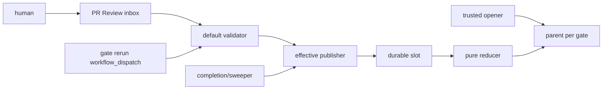

# DESIGN: human gateをGitHub正準sessionから一回だけ復帰させる

- Issue: `ISSUE-278` / 対応する SPEC: `SPEC.md`

## 目的・依存

human gateをGitHub PR aggregateとCheck/Reviewエンティティでモデル化し、判定耐久化、純粋集約、Check発行を分離する。
実装開始条件は、Issue #283 / PR #284が実装しmainに実在するI/Oなし`verifyGithubReviewEvidence(options)`（`src/lib/review-evidence.ts`）が存在しテストが通ることだけである。dedicated App・main限定environment・ruleset integrationを規定するADR-0013は現在`status: proposed`であり、accepted化と実配備はIssue #283系列の責務で本Issueの対象外とする。本設計はtrust backendの配備状況を実装開始の前提条件にせず、配備状況を実行時に分類して振る舞いを決める（後述のフェーズ設計）。

## ACと設計要素

| AC-ID | 設計要素 |
|---|---|
| AC-1 | GateSetResolver / SessionRepository |
| AC-2 | TrustBackendClassifier / PublisherSelector / DedicatedAppPublisher / LegacyPublisher |
| AC-3 | SerializedReducer / OwnershipRecovery |
| AC-4 | ReviewInbox / RecoverySweeper |
| AC-5 | ArtifactClassifier / ArtifactSet |
| AC-6 | SlotEnvelopeMapper / pure Strict reducer |
| AC-7 | CheckStateMapper / BackendGuard |
| AC-8 | ProvenanceEnvelope / distribution tests |
| AC-9 | HumanDeferralNotice / RerunEntryContract / RerunEvidenceRecord / GateRerunWorkflow |
| AC-10 | TrustBackendGuard（`inconsistent`時のfail-closed停止と停止力維持） |

## DDD境界と正準record

- `HumanGateSession` rootはparent ID、一意key、base/target、gate/profile、状態、集合digestを守る。`ReviewInbox`は機械marker付きPR Reviewの追記集合で、candidateはCheckを書かない。
- `SlotEnvelope`はsession/slot/invocation、actor、review/run/Check ID、verdict/digest、nonce/stateを保持し、`ArtifactClassifier`はGit diff/objectだけからgate別recordを導出する。
- `SessionRepository`だけが同App parent/slotを探索し、有効publisherだけがcreate/PATCHする。`SerializedReducer`はinbox/retryを担い、純粋reducerへAPI/replay状態を渡さない。

parent keyは`repository_id/PR/target_sha/gate/check_name/publisher_app_id`、session IDはそのdigestである。同SHA/name/Appを列挙し、0件なら作成、1件ならexternal ID/bodyを照合して再利用、複数なら`action_required`で停止する。

## trust backendのフェーズ分類とpublisher選択

`TrustBackendClassifier`は、専用App credential（App ID・private key）の解決可否、main限定environmentの存在、required contextへの`integration_id`固定の3点を設定値とGitHub API応答だけから読み、`absent`／`consistent`／`inconsistent`の3値へ決定的に分類する純粋判定である。副作用を持たず、分類結果と根拠列挙だけを返す。

`PublisherSelector`はこの分類から有効publisherをちょうど一つ選ぶ。

| 分類 | フェーズ | 有効publisher | session | trust主張 |
|---|---|---|---|---|
| `absent` | A（既存publisher期） | `LegacyPublisher`（`GITHUB_TOKEN`、`checks: write`） | 開始しない | 主張しない（`publisher_phase: legacy`） |
| `consistent` | B（専用App期） | `DedicatedAppPublisher`（main限定environmentのApp token） | 開始する | 主張する（`publisher_phase: dedicated_app`） |
| `inconsistent` | なし | なし（`TrustBackendGuard`が停止） | 開始しない | 主張しない |

`LegacyPublisher`は現行の`gate publish`経路そのもので、判定基準は本Issue以前と同一に保つ。本Issueが加える変更は、Check outputへ`publisher_phase`・trust主張の有無・再評価証跡を書き足すことだけである。フェーズAで`LegacyPublisher`を残すのは、止めるとrequired Checkを発行する主体が消えて`action_required`によるmerge停止自体が失われるためであり、fail-closedは「前提が揃わない環境で新しいtrust主張を有効化しない」ことを指す。

フェーズBでは全candidate workflow/jobの`GITHUB_TOKEN`を`checks: none`にし、readは`contents`と`pull-requests`だけとする。publisher jobだけがmain限定`agent-skill-chain-gate` environmentで専用App tokenを取得する。rulesetは各required名とApp `integration_id`を組にし、parent/slot create/PATCHとreconcileを同じAppに限る。`LegacyPublisher`のChecks書込み無効化とruleset固定は同一の配備変更で行い、同名required Checkに有効なwriterが二つ同時に存在する期間を作らない。

A→Bの遷移は人間の配備行為だけが起こす。実装側に昇格経路は持たない。Bで前提が崩れた場合は`inconsistent`として停止し、Aへ自動fallbackしない（自動降格でtrust主張を弱めたままmergeを通さないため）。

## 復帰入口・再評価証跡

`RerunEntryContract`は候補入口をworkflow定義から列挙し、(1) 当該定義に実在する、(2) PR番号と対象SHAを入力として受理する、(3) 起動が当該SHAのgate再評価を実際に走らせ再評価証跡を更新する、の三条件を満たすものだけを案内対象とする。現行の`pull_request_target`・`pull_request_review`トリガはPR番号と対象SHAを人間が入力として指定できず、`push`はSHAを変えてしまうため、三条件を満たす入口は既存に存在しない。よって`GateRerunWorkflow`として`workflow_dispatch`入口を新設する。

`GateRerunWorkflow`は`pr_number`・`target_sha`・`gate`（省略時は変更pathから導出）を入力に取り、default branch上のprotected版だけが実行される。処理順は次のとおり。PR metadataをAPIで取得しcurrent headと`target_sha`を照合、不一致なら再評価を行わず`evaluation_outcome=sha_mismatch`の再評価証跡だけを書いて停止する。一致すればbaseをcheckoutし対象SHAをread-only Git objectとしてfetchし、既存のevidence検証と集約を対象SHAに対して再実行し、`PublisherSelector`が選んだ有効publisherがrequired Checkを更新する。起動権限はrepositoryへのwrite権限保持者に限られ、これを案内本文の権限境界として明示する。

`RerunEvidenceRecord`は`rerun_invocation_id`（起動ごとに一意）・`pr_number`・`evaluated_target_sha`・`evaluated_at`・`evaluation_input_digest`・`evaluation_outcome`（`approved`／`rejected`／`human_required`／`config_error`／`sha_mismatch`）・`publisher_phase`を持ち、有効publisherがrequired CheckのoutputへJSONとして上書き保存する。Check結論の写像とは独立に、必ず毎回更新する。これにより「再評価した結果として`action_required`である」ことと「放置されたstaleな`action_required`」を、結論を見ずに証跡だけで機械的に区別できる。

`HumanDeferralNotice`はhuman adapterのdeferred（`final=human_required`＋通知＋終了コード3）時に、`RerunEntryContract`が解決した入口識別子・対象PR番号・対象SHA・required check名・権限境界だけを本文へ埋める。案内本文とworkflow定義の入口識別子・入力名・required名は同一のresolverから導出し、乖離を自動テストで検出する。trust backend状態が`inconsistent`の環境では、この起動は`TrustBackendGuard`のfail-closed停止へ収束するが、その停止自体も`evaluation_outcome=config_error`の再評価証跡として記録されるため、AC-9が要求する「実際に処理が走ったこと」は満たされ、deferral状態の`action_required`は維持される。

コア分類かつ`adapter=human`のgateでは、再評価は毎回`evaluation_outcome=human_required`へ収束し、Check結論は`action_required`のまま維持される。これはAC-6の停止系Thenが求める正常終局であり、同時にAC-9の後件（新しい`rerun_invocation_id`・`evaluated_at`の生成）も満たす。本設計はこの収束を欠陥として扱わず、収束を何度でも再計算できることを復帰可能性の定義とする。

## inbox・直列化

humanはsession/slot/invocation入りPR Reviewを投稿する。read-only `pull_request_review` runの完了を`workflow_run`で受けるdefault-branch publisher、`GateRerunWorkflow`のdispatch、定期sweeperのいずれもが同じdrainを起動する。publisherはAPIからReview本文・actor・PRを再取得する。

PR Reviewをdurable inboxとし、未消費判定はslotの`source_review_id/submission_digest`不在で導出する。同一PR/gate publisherは`cancel-in-progress: false`と公式の`queue: max`を補助利用するが、
100 pending超過は取消されるため正本にしない。各runは未処理ReviewをID順にdrainするため、dispatch/pending取消後も復旧できる。



## non-atomic PATCH・所有・状態写像

Checks PATCHは条件付き更新を提供しないためCASとは扱わない。フェーズBでは専用Appを唯一writerとし、同じprotected publisher laneで直列化する。処理前にparent/slot/Reviewを再読し、slotへ`processing_nonce`とowner run IDを書いて再読一致を確認する。
通信結果不明なら同nonceでpostconditionを再読し、成立済みはno-opとする。前owner runがpending/runningなら触らず、Actions APIでterminalと確認した場合だけ新nonceで引き継ぐ。
slot記録後にaggregate digestを再読してparentを更新する。terminal同digestはno-op、異digest・逆結論は拒否し、失敗はReviewを未消費のままsweeperへ渡す。再評価証跡は結論がno-opの場合でも更新する（起動が走った事実は結論の変化と独立に記録するため）。

| record state | Check status | conclusion |
|---|---|---|
| parent awaiting/reducing | `completed` | `action_required` |
| parent approved / rejected | `completed` | `success` / `failure` |
| parent human_required/invalidated | `completed` | `action_required` |
| slot queued / processing | `queued` / `in_progress` | なし |
| slot approved / rejected | `completed` | `success` / `failure` |
| slot human_required/invalid | `completed` | `action_required` |

## artifact分類・集約

| gate抽象output | 具体path分類 |
|---|---|
| spec: `SPEC.md` | root `SPEC.md` |
| design: `DESIGN.md, ADR, PLAN.md` | root `DESIGN.md`,`PLAN.md`、`docs/adr/ADR-*.md` |
| implementation: `code, unit_test_results` | 他分類に属さない全変更path。source/test/workflow/config/schema/scriptを含む |
| validation: acceptance/regression results | root `VALIDATION.md` |

base→targetの各pathをA/M/Dかつ一つのgateへ分類する。recordは`path,change,base_digest?,target_digest?`で、
Dはbase blob digestと固定`deleted` markerを持つtombstoneである。path正規化・sortしたcanonical JSONの
SHA-256を集合digestとする。open/submit双方が同じresolverで再導出し、`saved⊆derived`かつ
`derived⊆saved`、各record/digest一致を要求する。空、重複、未分類、取得不能は承認しない。この集合digestを
再評価証跡の`evaluation_input_digest`として用いる。

`verifyGithubReviewEvidence`はcontextとimmutable review配列だけを受け、最新attemptの固定slot数、
`run_id`・`slot`の非重複と必要slot集合の充足、全slot一致の`launcher_token_digest`、binding、artifact集合、
判定優先順位を検査して`approved|rejected|human_required`と理由を返す既存の
I/Oなし関数である。#278はCheck/Reviewをこの関数が要求する入力形（GithubReviewRecord相当）へ写像するだけで、
replay選択、nonce、retry、Check状態写像は同関数の外に置く。同関数の判定ロジック自体は変更しない。
同関数はactorをtrusted recorder許可集合への所属としてのみ検査し、2件のactorが別人格であることは承認条件に
しない。`actor_relation`は証跡として記録するだけで判定へ寄与しないため、#278も人格差をapprovedの条件に
用いない。
同関数はさらに、writer actorが未解決または0件のとき、およびコア分類（`coreReviewRequired`真）でprofileが
Strictでない・`model_tier=frontier_coding`／`reasoning_tier=maximum_reasoning`を証明できない・
`adapter=human`である証跡があるときに`human_required`を返す。`SlotEnvelopeMapper`はこの停止を正常終局として
写像し、能力値やactor集合を補完・迂回しない。したがってhuman gateの`success`到達は非コア分類のgateに限られ、
コア分類のgateではparentが`action_required`のまま維持される。

## 障害・ロールバック・関連ADR

App/environment/ruleset、依存API、API再読取、sweeperの不明状態はsuccessにせず、`inconsistent`として停止する。
フェーズBからフェーズAへの自動fallbackは実装しない。rollbackが必要な場合は、新publisherとruleset固定を人間が
明示的に外してフェーズAへ戻す配備操作として行い、その間もLegacyPublisherによるrequired Check発行と
`action_required`によるmerge停止は維持される。ADR-0011は本DESIGN自身の
判断なので自己参照しない。ADR-0013はacceptedになった時点でのrebaseでテンプレート規範の
`{id: ADR-0013, relation: adopts}` objectとして追加し、design gateを再通過する
（`verifyGithubReviewEvidence`はADR-0013とは別に既にmainへ実装済みのコードであり、related_adrs経由の
参照ではなく直接のコード依存として扱う）。

```yaml
related_adrs: []
```
