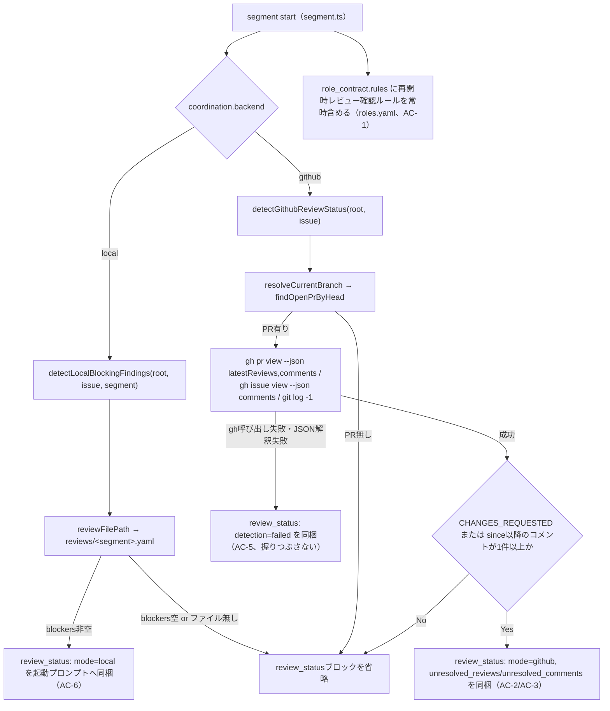

# DESIGN: bugfix: resumeしたsegment workerがPR/Issueのレビューフィードバックを一切参照せず静的completion checklistだけで完了と自己判定する

- Issue: `ISSUE-446`
- 対応する SPEC: `SPEC.md`

## 要件 → 設計要素の対応表

| 要件 / AC-ID | 対応する設計要素 | 備考 |
|---|---|---|
| AC-1（全ワーカーのrole_contractに再開時レビュー確認ルールが常に含まれる） | `.agent-skill-chain/config/roles.yaml` の `role_contracts.{spec_worker,design_worker,implementation_worker,validation_worker}.rules` への静的行追加 | backend・検出成否に関わらず常に含まれる最小対応（SPEC要件1）。既存の `loadRoles`／`toYamlString` 経路をそのまま通るため新規コードは不要。 |
| AC-2（GitHubモード：未対応レビューの検出・同梱） | `src/lib/review-status.ts`（新規）`detectGithubReviewStatus()` の `unresolved_reviews` | `gh pr view <pr> --json latestReviews` はreviewer毎の最新reviewのみを返す（GitHub自身のマージブロック判定と同じ基準）ため、追加の重複排除ロジックを持たない。 |
| AC-3（対象Issue/PRの未対応コメントの検出） | 同モジュール `detectGithubReviewStatus()` の `unresolved_comments` | PRコメント（`gh pr view --json comments`）とIssueコメント（`gh issue view --json comments`）の双方を対象にし、`created_at` が対象ブランチの最新commit時刻より後のものだけを「未対応」とみなす（下記「未対応の判定基準」参照）。 |
| AC-4（誤検出しない） | 同モジュールの判定ロジック自体（`state !== 'CHANGES_REQUESTED'` を除外・`since` 基準時刻以前のコメントを除外・`<!-- agent-skill-chain:`定型marker始まりのコメントを除外）＋ `src/commands/segment.ts` 側で空配列時はブロック自体を省略 | 「対応が必要な既存レビューが存在する」という虚偽の通知を作らないためには、該当が無い場合にセクション自体を出力しないのが最も確実（`buildIssueBlock` が採る既存パターンと同じ方針）。marker除外の根拠は「未対応の判定基準」節参照。 |
| AC-5（検出失敗時の安全側継続） | 同モジュールが `gh` 呼び出し失敗・JSON解釈失敗を `{ detection: 'failed', reason }` として明示的に返す。`segment start`（`src/commands/segment.ts`）は例外を投げずこの値をそのままプロンプトへ含め、AC-1の静的ルール追加（roles.yaml）とは独立に動作を継続する | 「握りつぶし」＝検出失敗を「未検出（＝レビュー無し）」として扱うことを指す。本設計は失敗自体を検出失敗として明示するため、AC-4の「誤検出しない」とは競合しない（失敗は「無い」ではなく「わからない」として区別する）。 |
| AC-6（ローカルモード：gate-report上の未解決blocking findingの検出・同梱） | 同モジュール `detectLocalBlockingFindings()` | 対象segmentと同名のgate（`reviews/<segment>.yaml`、`src/lib/local-state.ts` の `reviewFilePath()`）を読み、`gate.blockers` が非空なら同梱する。gate id と segment 名は `spec/design/implementation/validation` で1:1対応するため追加のマッピング表は不要。 |
| AC-7（実地再現シナリオでの言及付き完了判定） | 上記AC-2/AC-3/AC-5の実装が土台となる。設計要素自体は追加しない（実装・独立検証セグメントでworker-launch.shの実起動を通じて確認するhybrid検証） | SPEC「検証方法見込み: hybrid」のとおり、本ACは自動テストだけでなく実際のworker起動ログの確認を要する。DESIGN/PLANでは対応する自動化可能な設計要素（AC-2/3/5）を確実に満たすことが前提条件になる。 |

## 責務・境界

### コンポーネント構成

- `roles.yaml`（`.agent-skill-chain/config/roles.yaml`）: 4ワーカー共通の静的ルール文字列を保持するだけの宣言的データ。ロジックを持たない（AC-1）。
- `review-status.ts`（`src/lib/review-status.ts`、新規）: Coordination Backend（GitHub API／ローカルgate-report）から「未解決のレビューフィードバック」を検出し、プロンプトへ埋め込み可能な構造化データへ変換する責務のみを持つ。GitHub呼び出し（`gh`）・git呼び出し（直近commit時刻取得）・ローカルYAML読み込みの3つの入力源を抽象化し、`segment.ts` へは判定済みの結果だけを返す。
- `segment.ts`（`src/commands/segment.ts`）: 既存の `buildIssueBlock`（ローカルモードのtitle/request同梱）と同列に、`review-status.ts` の結果をYAML整形して起動プロンプトへ連結するだけのオーケストレーション責務。判定ロジック自体は持ち込まない。
- `gh-open-pr.ts`（`src/lib/gh-open-pr.ts`、既存・変更なし）: 対象ブランチに紐づくOPENなPRを解決する既存関数 `findOpenPrByHead()` をそのまま再利用する。PR解決ロジックの重複実装を避ける。
- `worktree.ts`（`src/lib/worktree.ts`、既存・変更なし）: 現在の作業ブランチ名解決に既存の `resolveCurrentBranch()` をそのまま再利用する。
- `local-state.ts`（`src/lib/local-state.ts`、既存・変更なし）: ローカルモードのgate-reportパス解決に既存の `reviewFilePath()` をそのまま再利用する。

責務集中の確認（反証観点）: GitHub API呼び出し・ローカルYAML読み込み・「未対応」の判定基準（CHANGES_REQUESTED／comment created_at比較）はすべて `review-status.ts` 1箇所に閉じ込め、`segment.ts` は「結果を埋め込むかどうか（空なら省略）」というプレゼンテーション層の判断だけを行う。判定基準を変更する際に `segment.ts` を触る必要が無いようにする。

### 未対応の判定基準（設計判断）

SPEC.mdは「未対応のレビュー・コメント」の検出を要求するが、GitHubのコメントAPI自体には「対応済み/未対応」を表すフラグが無いため、機械的に判定可能な基準を本設計で確定する。

- **レビュー（AC-2）**: `gh pr view <pr> --json latestReviews` はreviewer毎に最新の1件だけを返す。GitHubのマージブロック判定自体もこの「reviewer毎の最新state」を基準にしており、同一reviewerが後から `APPROVED` を出せば古い `CHANGES_REQUESTED` は自動的に上書きされる。したがって `latestReviews` の中で `state === 'CHANGES_REQUESTED'` のものだけを「未対応」とみなせば十分であり、追加の重複排除・時系列比較ロジックは不要。
- **コメント（AC-3）**: 単純コメント（Issue/PRいずれも）には状態フラグが無いため、「対象ブランチの最新commit時刻（`git log -1 --format=%cI HEAD`）より後に作成されたコメント」を「その後の作業でまだ反映されていない可能性がある＝未対応」とみなす。これはSPECの実害再現シナリオ（進行役がコメント投稿→新しいcommitが1つも無いままworkerを再起動）と厳密に一致し、workerが自分の直近commitより後に来たフィードバックだけを見れば良いという単純な基準になる。コメントのスレッド解決状態（resolved/unresolved、GraphQL専用）までは扱わない——スコープ外節「PRレビュー本文・コメント本文の要約・翻訳・NLP処理」と同様、機械的に判定可能な最小基準に留める。
- **定型marker除外（AC-4関連の設計判断）**: 上記の時刻基準だけでは、workerやgate-review自体がIssue/PRへ投稿する定型コメント（完了報告・review evidence等）も「未対応」として誤検出しうる。`detectGithubReviewStatus()` は、コメント本文が既知の定型marker（`<!-- agent-skill-chain:` で始まる行。worker完了報告(`worker-report`)・gate-review-evidence双方が用いる既存prefix）で始まる場合、そのコメントを「未対応」の判定対象から除外する。**投稿者（author）による除外は採用しない**——本リポジトリ実測（Issue #441/#445コメント履歴）のとおり、worker報告・gate-review-evidence・進行役による純粋な人間向け修正依頼コメントは全て同一のGitHub actor（`gh` credentialの実行主体）から投稿されており、author単位で除外すると本Issueが解消対象とする「進行役の修正依頼コメントそのもの」まで誤って除外してしまう（design-gate指摘、2026-08-05）。定型marker（機械可読な構造化データの先頭に付与される既存prefix）の有無だけが、自動化由来コメントと人間向け自由文コメントを区別できる唯一の機械的信号である。これによりAC-4（誤検出の禁止）が、人間以外が投稿した自動化由来コメントの再検出という未処理エッジケースも含めて満たされる。

### 依存関係

```text
.agent-skill-chain/config/roles.yaml（role_contracts.rules、静的データ）
                                                          ↘
src/commands/segment.ts（start）
  ├─ backend === 'local' → src/lib/review-status.ts: detectLocalBlockingFindings()
  │                          → src/lib/local-state.ts: reviewFilePath()
  │                          → src/lib/yaml-io.ts: tryReadYamlFile()
  └─ backend === 'github' → src/lib/review-status.ts: detectGithubReviewStatus()
                              → src/lib/worktree.ts: resolveCurrentBranch()
                              → src/lib/gh-open-pr.ts: findOpenPrByHead()
                              → src/lib/exec.ts: gh() / git()（PR review・comments取得、直近commit時刻取得）
```

### 図示要否の判断

- 判断: `要`
- 根拠: 依存関係が3つ以上ある（`review-status.ts` は `local-state.ts`／`worktree.ts`／`gh-open-pr.ts`／`exec.ts` の4モジュールに依存する）ため、下記に依存関係・分岐フローを図示する。



## 関連ADR

```yaml
related_adrs: []
```

本Issue専用の新規ADR（`docs/adr/ADR-0025-worker-resume-review-feedback-detection.md`、`status: proposed`）を作成し、「未対応」の判定基準（CHANGES_REQUESTED latest-per-reviewer基準・comment created_at基準）をなぜ採用したか、GraphQL reviewThreadのresolved状態を使わなかった理由を記録する。既存の `accepted` ADRで本設計が直接 `adopts` するものは無いため、`related_adrs` は空にする（本文中の自然文言及のみ行う）。

## 障害・ロールバック考慮

- 想定される失敗モード:
  - (a) GitHubモードで対象branchにOPENなPRがまだ無い（例: spec segmentの初回起動時、Draft PR作成前）: `findOpenPrByHead` が `undefined` を返し、`detectGithubReviewStatus` も検出対象自体が無いとして `undefined` を返す。エラーにはせず、`review_status` ブロックを省略するだけで従来どおり `segment start` は成功する。
  - (b) `gh` コマンド自体が失敗する（未認証・ネットワーク障害・レートリミット等）: `detection: 'failed'` として明示し、理由文字列（stderr先頭200文字程度）を含めてプロンプトへ渡す。「レビュー無し」と偽装しない（AC-5）。`segment start` 自体は失敗させない——検出失敗を理由にworker起動全体をブロックすると、GitHub API障害時に全セグメントが進行不能になり、AC-5が要求する「検出失敗時も最小対応が機能し続ける」に反するため。
  - (c) `gh` の出力がJSONとして解釈できない（将来の `gh` CLI仕様変更等）: try/catchで捕捉し(b)と同じ `detection: 'failed'` 経路に合流させる。
  - (d) ローカルモードで `reviews/<segment>.yaml` が存在するが壊れたYAML（手動編集・中断書き込み等）: `readYamlFile` は例外を投げるため、`detectLocalBlockingFindings` 内でtry/catchし、検出不能として `undefined` を返す（`segment start` をクラッシュさせない）。SPECのAC-5はGitHubモード限定の要求だが、「検出処理の失敗でworker起動そのものが止まる」という悪化を避ける方針はローカルモードでも同じ理由（AGENTS.md I8 安全側ラチェット＝既定は安全側だが、機能停止そのものは安全側ではない）で適用する。
  - (e) `latestReviews`／`comments` の件数が多く、プロンプトが際限なく肥大化する: 本Issoのスコープ外（「role_contractへ埋め込む情報量が増えることに伴うトークン量・長大化のトリミング戦略の確定」）。設計時点では件数上限・本文トリミングを導入せず、全件をそのまま埋め込む。肥大化が実運用で問題になった場合は別Issueで対処する。
  - (f) worker自身・gate-review自身がIssue/PRへ投稿した定型コメント（完了報告・review evidence等）が、次回resume時に「未対応の既存コメント」として誤って再検出される: 「未対応の判定基準」節の定型marker除外（`<!-- agent-skill-chain:` 始まりの本文を除外）により対処済み。author単位の除外は、進行役の正当な修正依頼コメントも同一actorから投稿されるため採用しない。
- ロールバック手順: 本変更は既存の `role_contract` 出力へ新しいセクション（`review_status:`）を追加するだけで、既存フィールド（`role:`／`issue:`／`rules:` 等）の意味・順序は変更しない。問題が発覚した場合は `roles.yaml` の追加ルール行と `segment.ts` の `review_status` 組み込み呼び出しを削除するだけで従来動作に戻せる（新規ファイル `review-status.ts` は未参照になるだけで副作用を残さない）。
- 影響を受ける既存機能: `buildIssueBlock`（ローカルモードのtitle/request同梱、Issue #183 AC-5）はスコープ外節のとおり変更しない。`gh-open-pr.ts`／`worktree.ts`／`local-state.ts` の既存関数はシグネチャ変更を伴わない再利用のみで、既存呼び出し元（release bump・root-cleanup run等）への影響は無い。
