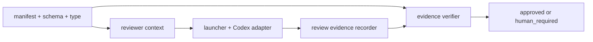

# DESIGN: Codex core review の reasoning effort を high に固定する

- Issue: `ISSUE-814`
- 対応する SPEC: `SPEC.md`

## 目的・対象・入出力

Codex core review の必須 tuple を `gpt-5.6-sol / high / read-only` に一意化する。入力は登録済み project policy、core 判定、reviewer context、adapter 起動値、review evidence であり、出力は同じ tuple を証明した Strict review 2体の証跡、または不一致時の `human_required` である。Claude・human・通常 worker・non-core reviewer・固定 bootstrap 履歴は対象外とする。

## 要件 → 設計要素の対応表

| 要件 / AC-ID | 対応する設計要素 | 備考 |
|---|---|---|
| AC-1 | D1 policy 正本同期 | model、Strict、2体は維持し effort だけを `high` にする |
| AC-2 | D2 tuple 伝播・照合境界 | context、adapter、recorder、verifier を同じ policy 値へ結線する |
| AC-3 | D3 文書・fixture 同期 | 現行 core policy の旧期待値だけを更新する |
| AC-4 | D4 非対象契約の回帰境界 | Claude、human、worker、non-core、bootstrap を不変にする |
| AC-5 | D5 正負の拒否テスト | `high` を受理・記録し、core の `xhigh` を拒否する |

## 責務・境界

### コンポーネント構成

- D1 policy 正本同期: `.agent-skill-chain/project/manifest.yaml` の Codex `reasoning_effort` と `.agent-skill-chain/schemas/project-policy.schema.yaml` の const、`src/lib/model-selection.ts` の型を `high` に合わせる。新しい値域・fallback・互換フラグは作らない。
- D2 tuple 伝播・照合境界: `src/commands/gate.ts` が reviewer context と recorder/verifier へ policy 値を渡し、`.agent-skill-chain/scripts/gate-launch-reviewer.sh` と `.agent-skill-chain/adapters/codex.sh` が `model_reasoning_effort="high"`、read-only sandbox、override attestation を照合する。`src/lib/review-evidence.ts` は記録値を protected policy と完全一致で検証する。これらの汎用処理は実測テストがハードコードを示した場合だけ変更する。
- D3 文書・fixture 同期: `.agent-skill-chain/project/MODEL_TIER_TABLE.md` の Codex 行と、proposed の `docs/adr/ADR-0009-core-review-provider-capability-policy.md` にある Context/Decision の旧具体値を訂正する。新規 ADR は作らない。
- D4 非対象契約の回帰境界: `frontier_coding / maximum_reasoning`、Strict、reviewer 2体、read-only、Claude capability probe、human の `human_required`、通常 worker の `xhigh` 値域、non-core の明示 `xhigh`、bootstrap ledger を保持する。
- D5 テスト境界: policy/context/adapter/evidence の正負テストと、既存 Strict evidence fixture を現行 tuple に同期する。

### 依存関係



依存は policy から起動・記録・検証への一方向であり、adapter や evidence から policy を書き戻さないため循環しない。

### 図示要否の判断

- 判断: `要`
- 根拠: policy、context、adapter、recorder、verifier の5責務があり、同一 tuple の伝播と独立照合を図示する必要がある。

## テスト・fixture の同期範囲

- policy/schema: `test/unit/model-selection.test.ts` と `test/integration/self-extension-policy.test.ts` で `high`、Strict、2体、Claude/human 不変を検証し、旧 `xhigh` manifest が schema 不適合になる反例を加える。
- reviewer context: `test/integration/gate-judgment.test.ts` で `codex_required_reasoning_effort=high` を検証する。
- adapter: `test/integration/gate-adapters.test.ts` で `gpt-5.6-sol/high/read-only` の attested 起動を成功させ、同 model/read-only でも `xhigh` は起動前に `human_required` とする。
- evidence: `test/unit/review-evidence.test.ts` で Strict 2 slot の `high` 証跡を承認し、片方が `xhigh` なら policy mismatch で `human_required` とする。
- core evidence fixture: `test/integration/gate-evidence.test.ts`、`test/integration/gate-round-budget-convergence.test.ts`、`test/integration/gate-gh-slurp-compat.test.ts` の core/Strict tuple を `high` にする。`test/integration/gate-submit-evidence-reachability.test.ts` の standard/non-core 明示 `xhigh` は回帰境界として残す。

## 関連ADR

```yaml
related_adrs:
  - id: ADR-0031
    relation: references
  - id: ADR-0079
    relation: references
```

ADR-0031 が core 対象の Strict 優先を、ADR-0079 が Codex model と fail-closed 起動境界を確定しており、本設計はそれらを変更しない。ADR-0009 は proposed で、誤った具体値の訂正は既存判断の責務境界を変えないため、新規 ADR は不要である。

## 障害・ロールバック考慮

- 想定される失敗モード: policy/schema/型/文書/fixture の一部だけが旧値のまま残り、起動拒否、証跡拒否、または誤った承認が起きる。
- ロールバック手順: 当該実装 checkpoint を一括 revert し、policy と全伝播先を旧 tuple に整合した状態へ戻す。値の混在した部分ロールバックはしない。
- 影響を受ける既存機能: Codex core review の reasoning 値だけ。model、reviewer 数、独立性、read-only、attestation、fail-closed、他 adapter と通常 worker は影響を受けない。

## 完了条件・検証・未決事項

全 AC の自動テスト、型検査、文書検査が成功し、現行 core policy を示す生きた asset に旧必須値が残らないことを完了条件とする。未決事項はない。
