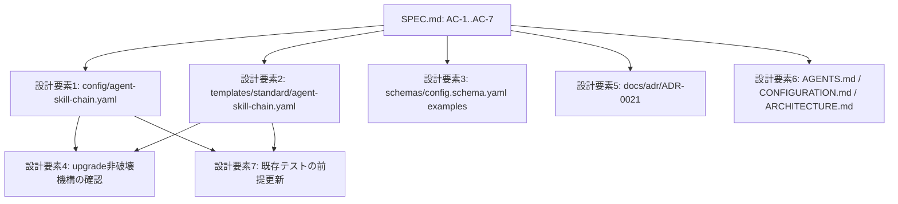

# DESIGN: issue_sync の既定値を enabled: true へ変更する（GitHubモードではGitHub Issueを正本とすべき）

- Issue: `ISSUE-567`
- 対応する SPEC: `SPEC.md`

## 要件 → 設計要素の対応表

| 要件 / AC-ID | 対応する設計要素 | 備考 |
|---|---|---|
| `AC-1`（GitHubモード向け既定設定で有効） | 設計要素1: 恒久設定ファイルの既定値 | 本リポジトリ自身の dogfooding 用設定 |
| `AC-2`（配布用テンプレートの既定設定でも有効） | 設計要素2: 標準プロファイル配布テンプレートの既定値 | `init` が配布する consumer project 向け既定値 |
| `AC-3`（設定スキーマ上のデフォルト値記述の整合） | 設計要素3: スキーマ記述例の整合 | 型・必須項目制約自体は変更しない |
| `AC-4`（既存プロジェクトの明示設定は不変） | 設計要素4: 既存の非破壊機構の再確認 | 新規実装は行わず既存の `upgrade` 除外仕様に委ねる |
| `AC-5`（ADR-0021の既定値決定記述の改定） | 設計要素5: ADR-0021 の D-2・D-4・D-5・Consequences 改定 | 本 DESIGN.md 自体が本改定を実施する（`status: proposed` のため本文編集可） |
| `AC-6`（規範文書・利用者向け文書の整合） | 設計要素6: 規範文書群の記述整合 | AGENTS.md・`docs/CONFIGURATION.md`・`docs/ARCHITECTURE.md` |
| `AC-7`（既存の同期仕様テストの非回帰） | 設計要素7: 既存自動テストの前提更新 | 転記処理自体のロジック・テストケースは変更しない |

## 責務・境界

### コンポーネント構成

本 Issue は `issue_sync` の転記処理そのもの（`src/lib/issue-sync.ts`・`src/commands/gate.ts` の呼び出し箇所）には一切手を加えない。`resolveSyncSettings` は既に設定ファイルの `issue_sync.enabled` の値をそのまま読む実装になっており、値の意味付け（true=有効・false=無効・未設定=無効）を変更する必要が無いためである。変更対象は「その値として何が既定で書き込まれているか」「その既定値をどう説明しているか」の 2 種類のみであり、これらを次の 7 つの設計要素に分離する。

- `設計要素1` 恒久設定ファイルの既定値: `.agent-skill-chain/config/agent-skill-chain.yaml` の `issue_sync.enabled` を `false` から `true` へ変更し、説明コメント（既定が有効である旨・明示的な `false` でオプトアウトできる旨）を書き直す。本リポジトリ自身は `coordination.backend: github` を使う GitHub モードのプロジェクトであるため、AC-1 の対象そのものである。
- `設計要素2` 標準プロファイル配布テンプレートの既定値: `.agent-skill-chain/templates/standard/agent-skill-chain.yaml`（`coordination.backend: github` が既定の consumer 向けテンプレート）の `issue_sync.enabled` を同様に `true` へ変更する。`.agent-skill-chain/templates/lightweight/agent-skill-chain.yaml` は `issue_sync` セクション自体を持たず、かつ既定の `coordination.backend` が `local`（GitHub モードではない）であるため対象に含めない。この判断は「設計要素4」の非破壊機構と対になる根拠（未設定＝無効という既存の後方互換規則）に依拠する。
- `設計要素3` スキーマ記述例の整合: `.agent-skill-chain/schemas/config.schema.yaml` の `examples`（`coordination.backend: github` を使う例）内の `issue_sync: {enabled: false, ...}` を `{enabled: true, ...}` へ書き換える。スキーマの型定義・`required: [enabled]` 制約・`additionalProperties: false` 等の構造は変更しない。
- `設計要素4` 既存の非破壊機構の再確認: `agent-skill-chain upgrade` は `config/agent-skill-chain.yaml` を一般アセット同期（配布元での上書き）の対象から除外済みであり（`src/commands/upgrade.ts` の `recoveredConfigDest` 分岐）、consumer project が既に書き込み済みの値（本改定前に `init` した場合は明示的な `false`）は本改定によって遡及的に上書きされない。この既存挙動そのものは変更しない。設計として行うのは、この既存挙動が AC-4 の要求（明示的に `false` を設定済みの既存プロジェクトは変更されない）を満たすことの確認と、その根拠の明文化のみである。
- `設計要素5` ADR-0021 の改定: `docs/adr/ADR-0021-github-issue-sync-full-text-content-canonical.md` は `status: proposed` であるため、本 Issue の設計セグメントが直接本文を書き換える（`accepted` 後の不変化ルールの対象外）。D-2（適用範囲・既定値）・D-4 の項目6（既存プロジェクトの移行）・D-5（`enabled` の説明）・Consequences の該当箇所を、新しい既定値（GitHubモードでは既定 `true`、明示的な `false` でオプトアウト可能）に合わせて改定する。ADR-0021 が既に確定した同期の仕組み自体（マーカー方式・転記対象・`target`・`max_body_chars` の意味・一方向転記であること）には一切変更を加えない。
- `設計要素6` 規範文書群の記述整合: AGENTS.md（Coordination Backend 節の表・後続段落）・`docs/CONFIGURATION.md`（`issue_sync` の既定値説明）・`docs/ARCHITECTURE.md`（成果物内容の正本に関する補足段落）内の「既定は無効」「既定 `enabled: false`」という記述を、新しい既定値と矛盾しない記述へ書き換える。AGENTS.md はリポジトリの構成規約により変更差分に含まれると通常フローが強制される対象であり、本 Issue は既に quick 免除の対象外（`docs/adr/` を差分に含むため）でもあるため、通常の 4 セグメントフローの中で扱う。
- `設計要素7` 既存自動テストの前提更新: `test/helpers/tmp-repo.ts` の `createTmpRepo` は本リポジトリ自身の `.agent-skill-chain/`（設計要素1で `true` に変わる `config/agent-skill-chain.yaml` を含む）を複製してテスト fixture を作る。そのため `test/integration/issue-sync.test.ts` の `issue-sync: 既定（issue_sync.enabled: false）では Issue 本文が一切変更されない` というテストは、設計要素1の変更後は前提が成立しなくなる（fixture の実際の既定値が `true` になる）。転記ロジック自体は変更しないため、このテストは「既定値のまま」ではなく「明示的に `setIssueSync(repoDir, { enabled: false })` で無効化した場合」に本文が変更されないことを検証する形へ書き換える。あわせて、fixture の設定ファイルを一切上書きしない場合に実際の既定値（`true`）で転記が行われることを検証するテストケースを追加し、AC-1・AC-7 の両方をカバーする。

### 依存関係



各設計要素は `src/lib/issue-sync.ts`・`src/commands/gate.ts` の転記ロジックを一切変更しない独立した既定値・記述の書き換えであり、要素間で循環する依存は存在しない。設計要素4・設計要素7のみ、設計要素1・2で書き込む具体的な既定値（`true`）を前提として確認・更新を行う一方向の依存を持つ。

### 図示要否の判断

- 判断: `要`
- 根拠: 責務境界（設計要素）が3つ以上（7つ）存在するため、AGENTS.md が定める図示必須基準に該当する。上記 Mermaid 図に、各設計要素が SPEC.md のどの受入条件から導出され、既定値を確定する要素（1・2）に依存する要素（4・7）がどれかを示した。

## 関連ADR

```yaml
related_adrs:
  - id: ADR-0021
    relation: adopts
```

`related_adrs` は「参照・コメントの陳腐化防止」節の局所契約に従い、ADR-0021 が既に確定した同期の仕組み（マーカー方式・転記対象・一方向転記であること）をこの設計が前提として採用していることを示す由来情報である。ADR-0021 自体の D-2・D-4・D-5・Consequences は本 Issue の設計要素5として同じ変更セット内で改定する。

## 障害・ロールバック考慮

- 想定される失敗モード:
  - 既定値の書き換え漏れ（例: `templates/standard/agent-skill-chain.yaml` のみ変更し `config/agent-skill-chain.yaml` を変更し忘れる等）により、AC-1〜AC-3 のいずれかが未達のまま実装ゲートへ進む。
  - `test/integration/issue-sync.test.ts` の「既定」テストを見落とし、fixture の実際の既定値が `true` に変わったことでテストが赤くなる（設計要素7で明示的に対応済み）。
  - 規範文書（設計要素6）の一部箇所のみ更新し、他の「既定は無効」記述が残留する（`.agent-skill-chain/scripts/lint-references.sh` の対象外の自然文であるため機械検査には掛からず、レビュアの目視確認に依存する）。
- ロールバック手順: 本 Issue の変更は「YAML の1フィールドの真偽値」「Markdown の既定値説明文」「ADR本文の該当節」「テストの前提」のみであり、コードロジックの変更を含まない。問題が判明した場合は当該 PR の revert のみで安全に戻せる。ロールバック後は `issue_sync.enabled` は全既定値において `false` に戻り、既存の転記ロジック（`src/lib/issue-sync.ts`）自体には一切影響しない。
- 影響を受ける既存機能: 新規に `init` するプロジェクト（GitHubモード・profile: standard）でのみ、`gate publish` 実行時に Issue/PR 本文への転記が既定で有効になる。転記の失敗はゲート通過自体を妨げない仕様（ADR-0021 D-3）であるため、既存の `gate publish` の成否判定ロジックへの影響は無い。既に `init` 済みの既存プロジェクト・ローカルモードのプロジェクトは無影響（AC-4・SPEC.md スコープ外に明記済み）。
