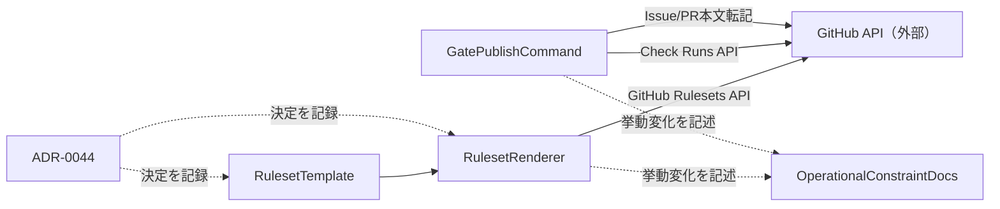

# DESIGN: gate publishのCheck Run発行がGitHub Appトークン無しでは不可能で、配布rulesetの必須化と相まって標準導入経路のPRが恒久的にマージ不能になりうる

- Issue: `ISSUE-593`
- 対応する SPEC: `SPEC.md`

## 要件 → 設計要素の対応表

| 要件 / AC-ID | 対応する設計要素 | 備考 |
|---|---|---|
| AC-1（配布テンプレートのrequired status checksから発行不能な4件を除去） | `RulesetTemplate`（`.agent-skill-chain/templates/github/provisioning/rulesets/main.json`） | `required_status_checks.required_status_checks` を `verify` の1件のみへ更新する。 |
| AC-2（gate publishが一度も成功しなくても通常PRがマージ可能） | `RulesetTemplate` + `RulesetRenderer`（AC-1適用後、`setup github`が完走しASC_GATE_APP_ID無しでも`verify`のみのrulesetが適用される経路） | AC-1単独では`RulesetRenderer`が壊れ`setup ruleset`自体が失敗するため、`RulesetRenderer`側の設計変更が不可欠（後述「本設計のスコープ境界」）。 |
| AC-3（Check Run発行失敗時もsyncGateArtifactsを独立試行） | `GatePublishCommand`（`src/commands/gate.ts` の `publish()`） | `publishCheckRun()`の成否と`syncGateArtifacts()`呼び出しの実行順序を分離する。 |
| AC-4（verify-template-syncの継続成功、テンプレートJSONをそのまま用いる経路の確認） | `RulesetRenderer`（`src/commands/setup.ts` の `renderRulesetWithDedicatedApp`/`loadRenderedRuleset`/`rulesetStep`） | AC-1で対象4件がテンプレートから消えるため、専用App binding処理を「gate check contextがテンプレートに存在する場合のみ」に条件化し、存在しない既定経路ではテンプレートJSONをそのまま用いる。`.github/`ツリー自体は無変更のため`verify-template-sync.sh`は影響を受けない。 |
| AC-5（gate publishの現状の運用制約の文書化） | `OperationalConstraintDocs`（`docs/ASC_GATE_APP_ID_RUNBOOK.md`・`README.md`） | 既存runbookの前提（`setup ruleset`は常に`ASC_GATE_APP_ID`必須）がAC-1/AC-4適用後は真でなくなるため、runbookの前提部分を更新し、現状制約（発行元workflow不在・rulesetへの現状不寄与・任意実行の記録専用ツール）を明記する。README.mdの`gate publish`記載箇所から当該runbookへの参照を追加する。 |

## 責務・境界

### コンポーネント構成

- `RulesetTemplate`（`.agent-skill-chain/templates/github/provisioning/rulesets/main.json`）: branch rulesetの配布用定義（正本）。必須ステータスチェックの内容を保持するだけで、レンダリングやAPI呼び出しは行わない。
- `RulesetRenderer`（`src/commands/setup.ts`）: `RulesetTemplate`を読み込み、`ASC_GATE_APP_ID`が指すApp IDを条件付きで`required_status_checks`へ結線し、GitHub Rulesets APIへ適用する（`loadRenderedRuleset`→`rulesetStep`）。
- `GatePublishCommand`（`src/commands/gate.ts` の `publish()`）: gate-reportをCheck Runへ発行し、成否に関わらずIssue/PR本文への成果物転記（`syncGateArtifacts()`、`src/lib/issue-sync.ts`）を独立して試行する。
- `OperationalConstraintDocs`（`docs/ASC_GATE_APP_ID_RUNBOOK.md`・`README.md`）: `RulesetRenderer`の挙動変化と`gate publish`の現状の運用制約を利用者へ伝える。
- `ADR-0044`: 上記の決定（drift是正・専用App binding条件化・sync独立化）の理由を記録する。

### 依存関係



`RulesetTemplate`と`GatePublishCommand`は互いに依存しない独立した2系統（ruleset適用系統／Check Run発行・転記系統）であり、循環依存は無い。`OperationalConstraintDocs`と`ADR-0044`はいずれも他コンポーネントの実行時挙動には影響せず、記述のみを行う。

### 図示要否の判断

- 判断: `要`
- 根拠: 責務境界（`RulesetTemplate`・`RulesetRenderer`・`GatePublishCommand`・`OperationalConstraintDocs`・`ADR-0044`）が3つ以上存在するため、上記Mermaid図で依存関係を明示した。

## RulesetRendererの条件付き専用App binding（AC-2/AC-4の核心）

AC-1で`RulesetTemplate`から4つのgate check contextを除去すると、既存の`renderRulesetWithDedicatedApp()`はそのままでは機能しない。既存実装は次の2点を無条件に要求する:

1. `parseDedicatedAppId(env.ASC_GATE_APP_ID)` が有効なApp IDを返すこと（未設定・不正なら例外）。
2. `GATE_CHECK_NAMES`（4件）のそれぞれが`required_status_checks`内にちょうど1件ずつ存在すること（0件なら「定義が一意ではありません」で例外）。

AC-1適用後の既定テンプレートは`verify`のみを含むため、この2条件は常に不成立となり、`setup ruleset`／`setup github`が常に失敗する（`ASC_GATE_APP_ID`を設定していても失敗する）。これはAC-2（標準導入経路でPRがマージ可能であること）とAC-4（テンプレートJSONをそのまま用いる経路の維持）の両方に反する。

**設計判断**: `renderRulesetWithDedicatedApp()` を次のように条件分岐させる。

- `required_status_checks`内に`GATE_CHECK_NAMES`のいずれか1件以上が存在する場合: 既存の全検証・binding処理（`ASC_GATE_APP_ID`必須、4件それぞれの一意性検証、`integration_id`設定）を無変更のまま適用する。将来、専用GitHub Appによる`gate publish`完全運用（ADR-0016 Decision節が言及する`dedicated_app`/`required_workflow` backend）を選ぶ利用者が、手元のテンプレート複製に4件を再度加える場合の経路として維持する。
- `required_status_checks`内に`GATE_CHECK_NAMES`のいずれも存在しない場合（AC-1適用後の既定テンプレート）: `ASC_GATE_APP_ID`の要求・binding処理を行わず、テンプレートをそのまま返す。`setup ruleset`は`ASC_GATE_APP_ID`未設定でも完走する。

この分岐により、既定経路（4件を含まない配布テンプレート）は`ASC_GATE_APP_ID`非依存で完走し、AC-2を満たす。既存の`renderRulesetWithDedicatedApp`の単体テスト（`test/unit/setup-ruleset.test.ts`。4件全て存在するテンプレートに対する挙動、および部分欠損・重複を拒否する挙動）は入力テンプレートが常に4件を含むため無変更のまま成立し続ける。「0件時はテンプレートをそのまま返す」という新しい分岐だけが実装セグメントで追加のテストケースを要する。

## 関連ADR

```yaml
related_adrs:
  - id: ADR-0016
    relation: references
```

ADR-0016（`reconcile-workflow-run-trust-boundary`、`status: accepted`）のDecision節は、専用GitHub Appによる`integration_id`限定（`dedicated_app`/`required_workflow` backend）を「対応する実装は既にコードベースに存在するが、専用GitHub Appの作成・installationおよびrulesetへの`integration_id`反映という運用手続きが未実施」と記録している。本設計は、その運用手続き自体（専用Appの作成・installation）をこのIssueで実施・活性化するものではなく、その未活性化状態のままでも標準導入経路が破綻しないよう`RulesetRenderer`の適用条件を明確化するものである（ADR-0013「強制identityとworkflow attestationを満たすCheckだけをゲート正本にする」、`status: proposed`、は本Issueのスコープ外。`proposed`のため`related_adrs`には含めず本文中の言及に留める）。

## 障害・ロールバック考慮

- 想定される失敗モード1: `RulesetTemplate`は更新したが`RulesetRenderer`の条件分岐を実装し忘れた場合、既定テンプレート（4件を含まない）に対し`ASC_GATE_APP_ID`未設定なら即座に例外、設定していても「定義が一意ではありません」で例外となり、`setup ruleset`／`setup github`が常に失敗する回帰を生む。実装セグメントは、4件を含まないテンプレートに対する新規テストケース（`ASC_GATE_APP_ID`未設定でも例外なく完走し入力テンプレートと同一内容が返ることを検証）を`test/unit/setup-ruleset.test.ts`へ追加し、この回帰を検出可能にする。
- 想定される失敗モード2: `GatePublishCommand`の呼び出し順序変更（Check Run発行失敗時もIssue/PR転記を試行する）により、転記処理自体が例外を投げた場合に`publish`コマンド全体が意図せず異常終了しない設計とする（既存実装同様、`syncGateArtifacts()`呼び出しは`try/catch`で包み、失敗はstderrへの警告としてのみ扱う）。
- ロールバック手順: `RulesetTemplate`（JSON）・`RulesetRenderer`（`src/commands/setup.ts`）・`GatePublishCommand`（`src/commands/gate.ts`）はいずれも同一PR内の独立したファイル単位の変更であり、問題箇所のみを`git revert`可能。ruleset適用はAPI呼び出しの冪等なPUT/POST（`rulesetStep`が既存ruleset IDを検出しPUT、無ければPOST）のため、テンプレートを旧版へ戻して`setup ruleset`を再実行すれば適用済みrulesetも旧内容へ復元できる。
- 影響を受ける既存機能: `setup ruleset`／`setup github`（`ASC_GATE_APP_ID`が既定では不要になる）、`gate publish`（Check Run発行失敗時の出力に転記結果が追加される）、`docs/ASC_GATE_APP_ID_RUNBOOK.md`（既定テンプレートに対しては本手順が不要になる旨の前提更新）。専用GitHub Appを既に導入し、手元のテンプレート複製に4件のgate check contextを維持している既存consumerの経路には影響しない（`RulesetRenderer`の分岐条件に該当し続けるため）。
