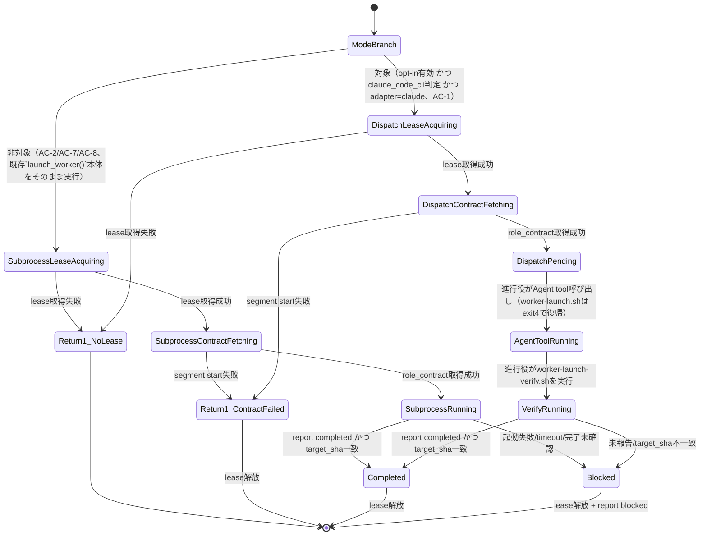

# DESIGN: 進行役がClaude Codeの場合、worker-launch.shが起動するsegment workerをこのセッションのサブエージェントツリー上で可視化する

- Issue: `ISSUE-448`
- 対応する SPEC: `SPEC.md`

## 技術検証の結論（未決事項1・2への回答）

design segmentでの検証結果を先に要約する。以降の設計要素はこの結論を前提とする。

**検証事実**: 進行役（Claude Code CLIセッション）のBashツール呼び出しは環境変数 `CLAUDECODE=1` を継承する（本design segment作業中に `env | grep CLAUDECODE` で実測確認済み）。この値は `worker-launch.sh` を実行するシェルプロセス自身の環境に存在するため、追加の外部プロセス起動や推測なしに参照できる。ただし本変数はClaude Code CLIが内部的に設定するものであり将来のバージョンで変更され得るため、要件7が要求する「判定不能時は安全側フォールバック」を必ず実装する（判定ロジックは`_orchestrator_is_claude_code_cli_session()`として後述のコンポーネント構成で定義する）。

**未決事項1（AC-1とI5の両立）への回答**: 両立可能と判断する。ただし design-gate round1 で指摘された通り、当初案（Agent toolの`prompt`引数へcontract本文をそのまま埋め込む）は論拠不十分であり、輸送方式を修正した。

現行のheadless subprocess方式がI5と両立する構造上の理由は、著述主体・commit主体が変わらないことに加えて、より根本的には**role_contract本文の内容が進行役を駆動するLLM自身の生成コンテキストに一切入らない**ことにある。`launch_worker()`は`contract="$(_asc_cli segment start ...)"`でcontractを取得し`printf '%s' "$contract" >"$prompt_file"`で一時ファイルへ書き出したうえで`bash -c "$worker_cmd" <"$prompt_file"`とファイルリダイレクトで渡しており、これらは1回のBashツール呼び出し内でシェルプロセス自身が行う。進行役LLMが実際に発行するBashツールコマンド文字列にcontractの内容は一切現れず、進行役はcontractの中身を「読んで」いない。

当初案（`_dispatch_via_agent_tool()`が"contract本文"を標準出力へ書き、進行役がそれをAgent toolの`prompt`引数として再度送出する）はこの不変条件を破る。Bashツールの標準出力は進行役LLMの生成コンテキストへ読み込まれ、それを次のツールコール引数として再送出する行為は、たとえ「加工しない」指示であっても、進行役の生成過程にcontract全文を通過させることに変わりなく、shellが中継しLLMは中身を見ないという現行方式の中継とは構造的に異なる。

**修正した設計**: `_dispatch_via_agent_tool()`はcontract本文を標準出力へ一切書かない。代わりに、既存の`prompt_file`パターン（`launch_worker()`と同型）でシステム一時ディレクトリ（`mktemp -d`、worktree外・Git非追跡、`_run_reviewer_sanitized`と同型のパーミッション`chmod 700`）へcontractをファイルとして書き出し、進行役へは (1) 固定・短文のdispatch指示テンプレート（contractの内容に一切依存しない定型文）と (2) そのファイルパスのみを標準出力へ返す。進行役はAgent toolを`subagent_type: "agent-skill-chain-worker"`、`prompt`にこの定型文＋ファイルパスのみを渡して呼び出す。定型文は「指定ファイルをBashツールで`cat`し、その標準出力全体を一切要約・改変せず自分の動作契約として厳密に実行せよ」という指示であり、実際のcontract本文はサブエージェント自身が自分のBashツール呼び出しで`cat`して直接読み込む——進行役の生成コンテキストにcontract本文は一度も現れない。これはstdinファイルリダイレクトが果たしていた「シェルが中継しLLMは中身を見ない」という性質を、Agent tool呼び出しという新しい輸送経路上でも再現する設計である。

**AC-4の機械的完全性担保（design-gate round2指摘1・round5指摘1への対応）**: 当初案はサブエージェントへの定型指示として「Readツールで全文読み込め」を採用したが、Claude CodeのReadツールは既定で先頭2000行までしか読み込まず、かつ各行に行番号プレフィックスを付与する。2000行超過時にoffset/limitで分割読み込みする手順を定型文へ追加してもLLMの指示追従性に完全性の担保を委ねることになり、AC-4（role_contract全文が加工・要約・追記なく伝わること）を機械的に保証できないと判断した（design-gate round5指摘）。

このため設計を変更し、定型文の指示を「ReadツールでなくBashツールで`cat <contract.mdの絶対パス>`を実行し、その標準出力全体を一切要約・改変せず自分の動作契約として厳密に実行せよ」へ切り替える。`cat`は行数制限も行番号プレフィックスも持たない決定的なコマンドであり、この切り替えにより2000行分割読み込み手順・行番号除去手順のいずれも不要になる。あわせて、`_dispatch_via_agent_tool()`は標準出力へcontract.mdのSHA256ダイジェスト（`CONTRACT_SHA256=<hex>`行）と行数（`CONTRACT_LINES=<n>`行）を追加で出力する。これはcontract.mdの内容そのものではなく固定運用メタデータ（ハッシュ値・行数という不透明な値）でありcontractの内容には依存しないため、AGENTS.md I5には抵触しない。この値は、`worker-launch-verify.sh`が一時ディレクトリを削除する前まで`contract.md`が改変されていないことを`sha256sum`で独立に照合できる監査証跡として機能する——LLMの指示追従性のみに依存せず、`cat`という決定的なコマンドの性質自体（分割・省略・行番号付与を一切行わない）が完全性を構造的に担保し、SHA256ダイジェストはその構造的保証を事後にも機械的に検証可能にする。

この修正により、進行役が生成する内容（Agent tool呼び出しの`prompt`引数）はcontractの内容に一切依存しない固定運用メタデータ（既存の起動コマンド文字列`bash -c "$worker_cmd" <"$prompt_file"`と同格の「調整状態操作」）のみとなり、AGENTS.md I5が禁じる「成果物の著述・内容の取り込み」——内容を理解・加工・判断し、それを踏まえて何かを行うこと——には該当しない。進行役はcontractの中身を一度も認識せず、ファイルパスという不透明なポインタを右から左へ渡すに過ぎない。

副次的な利点として、この設計はAC-4（role_contract全文が加工・要約・追記なく伝わること）についても当初案より頑健である。当初案では進行役LLMが長大なcontract本文をツールコール引数として再生成する必要があり、生成過程での省略・言い換えのリスクを理論上排除できなかったが、修正案ではサブエージェント自身が`cat`でファイルをバイト単位で読み込むため、そのリスクが構造的に存在しない。同一の判断根拠はADR-0030 Decision 2にも記録する。

**未決事項2（I3耐久性との関係）への回答**: 新方式はheadless subprocess方式が持つ「進行役プロセスからの完全独立」を持たない、という制約を受け入れたうえで運用する。ただし (a) Agent tool呼び出しは`run_in_background: false`（フォアグラウンド）で行うことを進行役への手順として必須化し、現行の`wait "$worker_pid"`と同じ「進行役のターンが終わるまでworkerも終わらない」というブロッキング的性質を保つ、(b) 進行役セッションがworker完了前に異常終了した場合の回復手段は、新方式固有の仕組みを追加するのではなく、既存のwriter lease TTL失効・ADR-0024（credentialなしreclaim）・`issue-resume.sh`という既存の耐久性の安全網にそのまま委ねる。これは新しい失敗経路の発生頻度は変える（進行役プロセスに紐づく分、発生し得る場面が増える）が、失敗からの回復手段の**種類**は増やさない。この受容はopt-in既定無効（要件8）という安全側の判断を裏付ける追加の理由でもある。同一の判断根拠はADR-0030 Decision 3にも記録する。

**待機中のlease renewal（design-gate round1指摘2への対応）**: 現行方式では、サブプロセスの生存中`renewal_interval_seconds`（既定900秒）ごとに`renew_lease`を呼ぶ処理は、`launch_worker()`内で`wait "$worker_pid"`と並行するバックグラウンドサブシェル（同一Bashツール呼び出し内で起動・`kill "$renew_pid"`で同一呼び出し内で終了）として実装されている。新方式では`_dispatch_via_agent_tool()`自身がexit code 4で即座に復帰し、Agent tool呼び出し（進行役のターンをまたぐブロッキング待機）は別のBashツール呼び出しの外側で起きるため、同一Bashツール呼び出し内で完結するサブシェルでは待機中の期間をカバーできない。したがって`_dispatch_via_agent_tool()`は、既存のrenewサブシェルと同じrenewループ本体を、`setsid`で新しいセッションへ切り離し`disown`した**独立デーモンプロセス**として起動する（`_dispatch_lease_renew_daemon()`、`claude.sh`新設）。デーモンは (1) 起動元のBashツール呼び出しの終了後も生存し続け、`renewal_interval_seconds`ごとに`renew_lease`を呼び続ける、(2) 自身のPIDをcontractファイルと同じ一時ディレクトリ内の`renew.pid`へ書き出す、(3) 新規env `ASC_DISPATCH_MAX_WAIT_SEC`（既定14400秒＝lease TTL既定3600秒の4倍、既存`WORKER_TIMEOUT_SEC`の既定1800秒よりも長い——Agent tool呼び出しは人間が観察する進行役のフォアグラウンドターンであり、非対話subprocessより長時間になり得るため）を超えて生存した場合は自ら終了しrenewを止める（無期限延命を防ぎ、進行役セッションが異常終了しverifyが実行されない場合にlease TTL失効による既存の安全網（ADR-0024）が最終的に機能することを保証する）。この上限値は環境変数で上書き可能だが、既定値を超えて正常に継続する長時間のAgent tool呼び出しは、design-gate round5指摘（dispatch-renew-daemon-timeout-decoupled-from-liveness）を受けた設計判断として現時点ではサポート対象外とする——「進行役セッションが応答不能」と「正常に長時間動作中」をbashデーモンが決定的に区別する手段が無いため、この2つのケースを区別せず一律に上限で打ち切る制約を既知の限界として受容する（詳細は下記の障害・ロールバック考慮）。`worker-launch-verify.sh`は完了確認・lease解放の前段で、この一時ディレクトリの`renew.pid`を読み取れれば対応プロセスへ`kill`を送ってからcontractファイルごと一時ディレクトリを削除する（PIDファイルが無い場合はデーモンが未起動または既に自己終了しているとみなしスキップする、AC-3のblocked規律には影響しない）。

**PID再利用への対策（design-gate round4指摘、renew-pid-reuse-raceへの対応）**: `renew.pid`に記録したPIDは、デーモンが`ASC_DISPATCH_MAX_WAIT_SEC`超過等で自己終了した後、OSにより無関係な別プロセスへ再割当てされ得る。`worker-launch-verify.sh`が`renew.pid`読み取り後に無条件で`kill`を送ると、再利用されたPIDを持つ無関係なプロセスを誤って終了させるリスクがある。これを避けるため、`_dispatch_lease_renew_daemon()`は自身のコマンドライン引数に一時ディレクトリの絶対パス（`mktemp -d`が生成した固有パスであり、他プロセスと衝突しない識別子として機能する）をそのまま含めて起動する（例: `setsid bash -c '... "$dispatch_temp_dir" ...' & disown`のように、当該パスをそのプロセスの引数列自体に残す）。`worker-launch-verify.sh`は`renew.pid`のPIDへ`kill`を送る前に`ps -p <pid> -o args=`（プロセスが存在しなければ`ps`自体が失敗し「不在」と判定できる）で取得したコマンドライン文字列に当該一時ディレクトリの絶対パスが含まれることを確認し、含まれない場合はPID再利用とみなし`kill`を送らずスキップする（PIDファイルが無い場合と同じ扱い、AC-3のblocked規律には影響しない）。詳細は下記のコンポーネント構成に記載する。

**kill送信とlease解放の競合対策（design-gate round5指摘、renew-daemon-kill-release-raceへの対応）**: 上記の照合によりPID再利用でないと確認できた場合、`worker-launch-verify.sh`は`kill`（SIGTERM）を送った直後に`release_lease`を呼ぶのではなく、`kill -0 <pid>`を短い間隔でポーリング（例: 200ms間隔で最大10回、計2秒）してプロセスの実際の終了を確認してから一時ディレクトリを削除し`release_lease`へ進む。ポーリング終了時点で依然生存している場合は`kill -9`で強制終了を試みたうえで、それでも終了を確認できなければ既存のTTL失効安全網（ADR-0024）に委ね`release_lease`の呼び出し自体はブロックせず先へ進める（デーモンが生存し続けても、release後は次回renewが失敗し始めるだけで、最終的にTTL失効により回収される）。これによりkill送信直後のデーモン生存中に`release_lease`とrenewが競合するレースを避ける。

**新規に判明したリスク（ツール許可範囲の粗さ）**: `--allowed-tools`によるBashコマンド単位の許可制御（`WORKER_ALLOWED_TOOLS_DEFAULT`）は、Claude CodeのAgent tool・カスタムsubagent種別の`tools:`定義がツール単位（Read/Edit/Bash等）でしか制御できないため、同じ粒度で再現できない。この差分への対応（除外するツールの一覧）は下記のコンポーネント構成のカスタムsubagent種別定義に記載する。同一の論拠はADR-0030 Consequencesにも記録する。

**新規に判明したリスク（worker-identity-attestation-gap、design-gate round3指摘への対応）**: AGENTS.md「役割・権限・writer lease」節が列挙する`protected-base隔離launcher・one-time attempt token・固有run ID/slot・launcher digest`等のactor分離メカニズムは、Agent tool dispatch方式では進行役セッションと同一credential・同一プロセス内でworker subagentが動くため失われるのではないか、という懸念がある。`.agent-skill-chain/adapters/claude.sh`を確認した結果、これらの分離メカニズムは**read-onlyレビュア（`launch_gate_reviewer`が呼ぶ`_run_reviewer_sanitized()`。同関数はAI reviewerへmodel providerのローカルlogin保存先だけを渡し、GitHub credential・gh/git設定・caller HOMEを渡さない実装になっている）専用**であり、writer役割（`launch_worker()`が起動するsegment worker）には現行のheadless subprocess方式でも同種の分離が実装されていない。`launch_worker()`は`WORKER_ALLOWED_TOOLS_DEFAULT`に`Bash(git push:*)`等のpush権限を含めて渡しており、workerが呼び出し元環境のgh/git credentialをそのまま継承する設計である——writerはpush等の書込み権限を必要とするため、read-onlyレビュアと異なりcredential隔離が構造的に成立しない。したがって、AGENTS.md「役割・権限・writer lease」節のactor分離メカニズムは**GitHub actorがwriterとrecorderで同一の場合に両者を別roleとみなすための手段**であり、writer（segment worker）と進行役の間のactor分離を保証するものではない。Agent tool dispatch方式は、read-onlyレビュアのcredential隔離（`_run_reviewer_sanitized()`）には一切変更を加えないため、この論点においては新方式固有の後退（regression）を生まない——既存モデルが元々持っていなかった分離を、新方式でも引き続き持たないというだけである。

**進行役セッションでの直接実地検証（design-gate round4指摘への対応）**: 上記の未決事項1・2の回答および各リスク論点は、いずれもClaude Code CLIの実行環境が持つ技術的特性を前提とする。design-gate round4の指摘を受け、進行役自身がこのセッション（Claude Code CLI、`CLAUDECODE=1`）で以下3点を直接実地検証した（design segment作業中の間接的な推測ではなく、実際に実行したコマンドと出力を伴う実測）。

1. **`setsid`+`disown`デーモンのBashツール呼び出し境界を越えた生存**: `setsid bash -c "sleep 5; echo alive >> marker" < /dev/null > /dev/null 2>&1 & disown` を1回のBashツール呼び出しで実行してその呼び出しを終了させた後、**別の（後続の）Bashツール呼び出し**で5秒後に`marker`ファイルが実際に作成されていることを確認した。`_dispatch_lease_renew_daemon()`が前提とする「起動元のBashツール呼び出しが終了した後もデーモンプロセスが生存し続ける」という性質は実機で成立する。
2. **worktree外一時ディレクトリのAgent tool経由サブエージェントからの読み取り可能性**: worktree外（`/tmp`直下）に`chmod 700`で作成したディレクトリへcontractファイルを配置し、Agent tool経由でgeneral-purpose subagentを起動して当該ファイルを`cat`させたところ、正しく内容（"test-contract-content-12345"）を読み取れることを確認した。`_dispatch_via_agent_tool()`が前提とする「`mktemp -d`一時ディレクトリ→サブエージェントがBashツールの`cat`で直接読む」という輸送経路は実機で成立する。
3. **credential継承**: 同一のAgent tool呼び出し内で`gh auth status`・`git config user.name`・`git remote -v`をsubagentに実行させ、進行役自身と同一のgh認証（account: adachi-tatsuru、repo権限を含むtoken scopes）・同一のgit設定・同一のorigin remoteをsubagentが継承していることを確認した。これは上記「worker-identity-attestation-gap」の「writerは呼び出し元環境のcredentialをそのまま継承する」という判断の実機裏付けであり、Agent tool dispatch方式固有の新しい後退ではないことを補強する。

以上3点はいずれも進行役セッションでの直接実地検証（実行コマンドと出力を伴う）であり、design segment作業中の間接的な推測ではない。同一の検証結果はADR-0030 Decisionにも記録する。

## 要件 → 設計要素の対応表

| 要件 / AC-ID | 対応する設計要素 | 備考 |
|---|---|---|
| 要件1・AC-1 | セッション判定関数、`claude.sh` dispatch分岐、dispatch payload、カスタムsubagent種別 | 3条件すべて成立時のみdispatchへ分岐 |
| 要件2・AC-2 | `claude.sh` dispatch分岐のelse節（既存`launch_worker`本体、無変更） | 非対象ケースは既存コードパスを一切変更しない |
| 要件3・AC-3 | `worker-launch-verify.sh`（新規） | lease取得前失敗はdispatch分岐前の共通処理、起動後失敗はverifyスクリプトが同一の規律で処理 |
| 要件4・AC-4 | contractファイル（一時ディレクトリ`contract.md`）とdispatch payload（定型文＋ファイルパス）の分離、`CONTRACT_SHA256`/`CONTRACT_LINES`出力 | contract本文は標準出力にもAgent toolのprompt引数にも一切現れず、workerが自ら`cat`でファイルから直接読み込む（進行役による加工不可能。SHA256/行数は事後の完全性照合用の監査証跡） |
| 要件5・AC-5 | commit経路無変更の確認（`checkpoint.sh`・writer lease credential） | dispatch分岐でもcommit主体・経路は変わらない |
| 要件6・AC-6 | dispatch分岐専用のテスト境界（`ASC_AGENT_TOOL_DISPATCH`・`ASC_ORCHESTRATOR_SESSION_OVERRIDE`） | 既存`WORKER_CMD`境界は既定off時そのまま機能 |
| 要件7・AC-7 | `_orchestrator_is_claude_code_cli_session()`（`claude.sh`） | 判定不能・不定値はすべてfalse＝フォールバック |
| 要件8・AC-8 | `worker.agent_tool_dispatch.enabled`（config schema新規項目）、`worker-selection.ts`拡張 | 既定false、3条件の一つとして評価 |

## 責務・境界

### コンポーネント構成

- `config.schema.yaml` / `agent-skill-chain.yaml`: `worker.agent_tool_dispatch: {enabled: boolean}`（既定false）を新規追加する後方互換な任意項目。既存の`issue_sync`・`merge`・`human_confirmation`と同型。
- `src/lib/worker-selection.ts`: `WorkerSelection`に`agentToolDispatch: boolean`を追加。`resolveWorkerSelection`が`config.worker.agent_tool_dispatch?.enabled ?? false`を解決する（純粋関数、既存方針を継承）。
- `src/commands/worker.ts`（`context`サブコマンド）: 常に`agent_tool_dispatch=<true|false>`行を出力する（`adapter`と同じく常時出力。segment別上書きは持たない単一のグローバル設定のため）。
- `.agent-skill-chain/scripts/worker-launch.sh`: `WORKER_CONTEXT`から`agent_tool_dispatch=`行を読み取り、`ASC_AGENT_TOOL_DISPATCH`環境変数として常にexportする。それ以外の既存ロジック（worktree自己解決含むADR-0029の仕組み）は無変更。
- `.agent-skill-chain/adapters/claude.sh`:
  - 新規関数 `_orchestrator_is_claude_code_cli_session()`: `ASC_ORCHESTRATOR_SESSION_OVERRIDE`（テスト用モック境界、`CLAUDE_AUTH_PROBE_CMD`と同型）が設定されていればその値で判定し、無指定時は`${CLAUDECODE:-}` が厳密に `"1"` の場合のみ真を返す。それ以外（未設定・空・`"1"`以外の値）はすべて偽＝要件7のフォールバック対象とする。
  - `launch_worker()` 冒頭に分岐を追加: `ASC_AGENT_TOOL_DISPATCH == true` かつ `_orchestrator_is_claude_code_cli_session` が真の場合のみ新関数 `_dispatch_via_agent_tool()` を呼ぶ。それ以外は既存の`launch_worker()`本体（lease取得〜subprocess起動〜完了確認〜解放）を一切変更せず実行する（AC-2/AC-7/AC-8）。
  - `_dispatch_via_agent_tool()`（新規）: (1) `acquire_lease`（失敗時は現行と同じくblocked報告なしでreturn 1）、(2) `_asc_cli segment start`（失敗時はlease解放のみでreturn 1）、(3) `mktemp -d`でworktree外・Git非追跡の一時ディレクトリ（`chmod 700`）を作り、contract本文をその中の`contract.md`へ書き出す（**標準出力へcontract本文は一切書かない**）、(4) `_dispatch_lease_renew_daemon()`を`setsid ... & disown`で切り離して起動し、そのPIDを同ディレクトリの`renew.pid`へ書き出す、(5) 標準出力へ、contractの内容に一切依存しない固定・短文のdispatch指示テンプレート（`subagent_type: "agent-skill-chain-worker"`・`prompt`に含めるべき定型文言「指定ファイルをBashツールで`cat`し、その標準出力全体を一切要約・改変せず動作契約として厳密に実行せよ」・`contract.md`の絶対パス・完了後に`worker-launch-verify.sh`を実行する旨）に加えて、**`(3)`で作った一時ディレクトリの絶対パスを独立した行（固定プレフィックス例: `DISPATCH_TEMP_DIR=<path>`）**、呼び出し元が受け取った`issue_id`をそのまま独立した行（固定プレフィックス`ISSUE_ID=<issue_id>`、`worker-launch.sh`の引数としてすでに渡されている値の転記でありcontractの内容には非依存）、および`contract.md`のSHA256ダイジェスト（`CONTRACT_SHA256=<hex>`行）と行数（`CONTRACT_LINES=<n>`行、いずれも監査証跡でありcontractの内容には非依存）として明示的に出力する。あわせて`(3)`のステップの一部として、同じ値（SHA256ダイジェストと行数）を一時ディレクトリ内の`contract.sha256`ファイルへ2行で書き出す——標準出力への出力は進行役向けの即時可視化用、`contract.sha256`ファイルは`worker-launch-verify.sh`が後段で独立に再計算・照合するための永続的な保存先であり、両者は同一値の異なる伝達経路である（design-gate round7指摘contract-sha256-audit-trail-unconsumedへの対応、実際の照合手順は下記`worker-launch-verify.sh`の記述を参照）。その後(6) exit code `4`（新規、"dispatch_required"）でreturn する。**workerサブプロセスは起動しない。leaseは解放しない**（現行のhuman adapter `deferred`と同様、非同期継続中を意味する）。lease renewal専用のデーモンプロセスは(4)の通り例外的に起動する。標準出力仕様（design-gate round2指摘2・round8指摘verify-script-missing-issue-id-argへの対応）: 進行役はAgent tool呼び出し完了後、この`ISSUE_ID=<issue_id>`行と`DISPATCH_TEMP_DIR=<path>`行から issue_id と一時ディレクトリの絶対パスを読み取り、`worker-launch-verify.sh <issue_id> <一時ディレクトリの絶対パス>`という形で第1・第2位置引数として渡す（引数仕様は下記`worker-launch-verify.sh`の記述を参照）。この受け渡しは進行役がBashツール標準出力の中から固定プレフィックス行を機械的に転記するだけの調整状態操作であり、contractの内容には一切依存しないためI5に抵触しない。
  - `_dispatch_lease_renew_daemon()`（新規）: `_dispatch_via_agent_tool()`が`setsid`で起動する独立プロセス。`renewal_interval_seconds`（既定900秒）ごとに`renew_lease`を呼び続け、起動から`ASC_DISPATCH_MAX_WAIT_SEC`（既定14400秒＝lease TTL既定3600秒の4倍。design-gate round5指摘への対応として既定7200秒から引き上げ）を超えたら自ら終了する。起動元のBashツール呼び出しが終了した後も生存し続ける点が、`launch_worker()`内の既存renewサブシェル（同一呼び出し内で起動・終了）との違い。PID再利用対策として、自身の起動コマンドライン引数に一時ディレクトリの絶対パスをそのまま含める（`ps -p <pid> -o args=`で`worker-launch-verify.sh`から照合可能にするため）。
- `.agent-skill-chain/scripts/worker-launch-verify.sh`（新規）: `worker-launch.sh`と同じworktree自己解決ロジック（ADR-0029のself-resolution、絶対パス直接呼び出しでmain扱いになる既知の罠を回避）を再利用する。この自己解決ロジックは、Issue #442（PR #454、マージ済み）で進行役自身が実地検証・66件のテスト（実bash駆動E2Eテストを含む）により確認済みの通り、**呼び出し元のcwd・呼び出しパスに一切依存せず、issue_idから対象worktreeを一意に解決し、必要であればcd+execで対象worktreeへ自己リダイレクトする**設計である（design-gate round7指摘verify-script-worktree-resolution-unverified-across-agent-tool-boundaryへの対応）。したがって、Bash→Agent tool→Bashという呼び出し列を経て`worker-launch-verify.sh`が実行される際に進行役のcwdが維持されるか否かに関わらず、本ロジックは正しく対象worktreeへ到達する——この設計の存在意義自体が「呼び出し元のcwdが何であっても正しいworktreeへ到達する」ことであり、新規のエンジニアリングを要しない。**引数仕様（design-gate round8指摘verify-script-missing-issue-id-argへの対応）**: 第1位置引数（必須）として`_dispatch_via_agent_tool()`が標準出力へ出した`ISSUE_ID=<issue_id>`のissue_idを、第2位置引数（必須）として同じく標準出力の`DISPATCH_TEMP_DIR=<path>`の一時ディレクトリ絶対パスを受け取る（`worker-launch-verify.sh <issue_id> <DISPATCH_TEMP_DIRの絶対パス>`）。issue_idは、本スクリプトが冒頭で再利用する`worker-launch.sh`と同じworktree自己解決ロジック（ADR-0029、issue_idから対象worktreeを一意に解決する）と、後段の`report latest`・`release_lease`呼び出し双方が必須で要求する入力であり、これらいずれも一時ディレクトリパスだけからは導出できないため独立した引数として渡す。いずれか一方でも未指定、または一時ディレクトリパスが存在しない場合は`_dispatch_via_agent_tool()`が呼ばれていない誤用とみなし、lease操作を一切行わずexit 1で即座に失敗する（AC-3のblocked規律とは別扱い——そもそもdispatchが成立していないケース）。`report_status`呼び出しに必要な`role="${segment}_worker"`のsegmentは、追加の引数を設けず、一時ディレクトリ内の`contract.md`から`launch_worker()`が行うrole抽出（`sed -n 's/^role:[[:space:]]*//p'`で先頭行を取得）と同じパターンで読み取る——contract.mdは削除前の時点でまだ存在するため、この抽出はディレクトリ削除より前（後述のsha256照合と同時期）に行う。引数が有効な場合、まず当該一時ディレクトリの`renew.pid`を読み取れれば、`ps -p <pid> -o args=`で取得したコマンドライン文字列に当該一時ディレクトリの絶対パスが含まれることを確認したうえで対応プロセスへ`kill`（SIGTERM）を送る（PIDファイルが無い場合、または`ps`結果が一時ディレクトリの絶対パスを含まない＝PID再利用とみなせる場合は、いずれもkillせずスキップする——後者は design-gate round4指摘renew-pid-reuse-raceへの対応）。`kill`送信後は`kill -0 <pid>`を短い間隔でポーリング（例: 200ms間隔で最大10回、計2秒）してプロセスの実際の終了を確認してからディレクトリごと削除する。ポーリング終了時点で依然生存していれば`kill -9`で強制終了を試みたうえで、それでも終了を確認できなければ既存のTTL失効安全網（ADR-0024）に委ね処理を先へ進める（design-gate round5指摘renew-daemon-kill-release-raceへの対応、`kill`送信直後のデーモン生存中に後続の`release_lease`とrenewが競合するレースを避ける）。

続けて、一時ディレクトリを削除する前に`contract.md`へ`sha256sum`を再計算し、`_dispatch_via_agent_tool()`が同ディレクトリへ書き出した`contract.sha256`ファイルの値（`CONTRACT_SHA256`/`CONTRACT_LINES`と同一の値）と照合する（design-gate round7指摘contract-sha256-audit-trail-unconsumedへの対応、監査証跡として出力されるだけで誰も照合しない状態を解消する）。一致すれば`contract.md`はcontractファイル書き出し後から現時点まで改変されていないと確認できたことになる。`contract.sha256`ファイル自体が存在しない場合（dispatch開始直後にverifyが呼ばれた等、想定外の運用）はこの照合をスキップし後続処理へ進む。値が不一致の場合は、workerが実際に`cat`して実行した契約内容が進行役の意図した内容と異なっていた可能性を示す完全性違反とみなし、後続の`report`照合の結果に関わらず`role="${segment}_worker"`で`report_status ... blocked`してから`release_lease`しexit 2（既存のreport不一致と同一の規律）で返す。

照合（一致、またはファイル不在によるスキップ）の後、一時ディレクトリごと削除し、続けて`_asc_cli report latest`とHEADのSHA照合を行い、一致すれば`release_lease`してexit 0、不一致・未報告ならば`role="${segment}_worker"`で`report_status ... blocked`してから`release_lease`しexit 2（現行`_fail_blocked`と同一の規律、AC-3）で返す。
- カスタムsubagent種別 `.agent-skill-chain/templates/claude/agents/agent-skill-chain-worker.md`（新規配布資産）: `tools:` フロントマターに `Read, Grep, Glob, Edit, Write, MultiEdit, Bash` を許可し、`Agent`（無制限な再帰dispatch防止）・`ExitPlanMode`・`NotebookEdit`・`WebFetch`・`WebSearch`・`Artifact` を明示的に含めない。`init`/`upgrade`が`.claude/agents/agent-skill-chain-worker.md`へ同期する（既存`templates.github_source/github_target`と同型の新規config項目 `templates.claude_agents_source`/`templates.claude_agents_target`を追加し、`verify-template-sync.sh`の検査対象へ加える）。Bashコマンド単位の許可制御（`WORKER_ALLOWED_TOOLS_DEFAULT`と同等の粒度）はClaude Codeのsubagent種別定義では実現できないため完全な同等物ではない（後述の障害・ロールバック考慮を参照）。

  **`Read`ツールを除外できない理由（design-gate round8指摘worker-tools-permit-read-undermines-cat-guarantee検討結果）**: `cat`方式（AC-4機械的完全性担保）の効果を構造的に確定させるには`tools:`から`Read`自体を除外することが理想だが、以下2点により実現できないと判断した。(a) segment workerは自身の正規責務として、`contract.md`とは別の既存成果物（`SPEC.md`・accepted ADR・`.agent-skill-chain/standards/`等、role_contractの`inputs`が列挙する入力群、任意サイズ・任意個数）を読み込む必要があり、これらは`cat`定型指示の対象外——`Read`無しでは要件1が要求するsegment worker本来の作業（成果物の読み込み）自体が遂行不能になる。(b) Claude CodeのEditツールは、同一会話内で対象ファイルへの先行`Read`呼び出しが行われていることを前提とする既存のツール仕様を持つため、`Read`を`tools:`から除外すると成果物編集そのもの（`Edit`呼び出し）が機能しなくなる——AC-4の完全性担保を強めるためにAC-1が要求するsegment workerとしての正規機能自体を破壊することになり本末転倒である。したがって`Read`は`tools:`に残す。この結果、AC-4のcontract.md初期読み込みにおける完全性担保は、**ツール制限による構造的強制ではなく、(1) 定型指示による`cat`使用の明示、(2) `CONTRACT_SHA256`/`CONTRACT_LINES`監査証跡による事後のファイル改変検知、の2層に留まる**。(2)は`contract.md`がディスク上で書き出し後に改変されていないことは検知できるが、workerが指示に反し`Read`ツールでcontract.mdを読み込み2000行切断・行番号プレフィックス混入した内容を認識してしまうこと自体を検知・防止する構造的保証ではない。これは既知の残存リスクとして受容する（role_contractは単一segmentの契約であり実運用上は2000行を大幅に下回る規模に留まるため実害の発生可能性は低いこと、完全性逸脱がworkerの成果物欠落として現れた場合は後続のgateレビューで間接的に捕捉され得ることを緩和要素とする。詳細は下記の障害・ロールバック考慮9を参照）。
- dispatch手順の文書化: `_dispatch_via_agent_tool()`が出力するorchestrator向け指示（Agent toolを`subagent_type: "agent-skill-chain-worker"`・`prompt`に定型文＋contractファイルの絶対パス（contract本文そのものではない）・`run_in_background: false`で呼び出し、完了後に標準出力の`ISSUE_ID=<issue_id>`行・`DISPATCH_TEMP_DIR=<path>`行からissue_idと一時ディレクトリの絶対パスを読み取り、`worker-launch-verify.sh <issue_id> <その絶対パス>`を第1・第2位置引数付きで実行する手順）に加えて、`.agent-skill-chain/standards/`配下に手順の正本を1箇所置き、dispatch payloadはその正本への言及ではなく要旨を都度出力する（成果物の自己完結性原則を各ワーカーではなく進行役向け運用手順に適用したもの。禁止されている「詳細はXを参照」ではなく、都度必要な要旨をpayload自体に含める）。

### 依存関係

```text
agent-skill-chain.yaml(worker.agent_tool_dispatch)
  → worker-selection.ts(resolveWorkerSelection)
  → worker.ts(context)
  → worker-launch.sh(ASC_AGENT_TOOL_DISPATCH export)
  → claude.sh(_orchestrator_is_claude_code_cli_session, launch_worker分岐)
  → _dispatch_via_agent_tool()
      → contract.md（一時ディレクトリ、mktemp -d）
      → _dispatch_lease_renew_daemon()（setsid切り離し、renew.pidを同ディレクトリへ）
  → 進行役(Agent tool呼び出し, subagent_type=agent-skill-chain-worker, promptは定型文+contract.mdパスのみ / 標準出力のISSUE_ID=<issue_id>行・DISPATCH_TEMP_DIR=<path>行を保持)
  → agent-skill-chain-workerサブエージェント(contract.mdをBashツールの`cat`で読み込み)
  → worker-launch-verify.sh <issue_id> <DISPATCH_TEMP_DIRの絶対パス>(第1・第2位置引数、renew.pidをkillし一時ディレクトリ削除 → report照合 → release_lease)
  → report-status.sh / lease-release.sh
```

循環依存なし。`worker-launch-verify.sh`は`worker-launch.sh`のworktree自己解決ロジックを再利用する（新規重複実装を避ける）。`_dispatch_lease_renew_daemon()`は`_dispatch_via_agent_tool()`が起動するが、以後は独立プロセスとして生存し双方向の依存を持たない（`worker-launch-verify.sh`がPIDファイル経由で一方向にkillするのみ）。

### 状態遷移

（design-gate round8指摘lease-acquisition-position-contradictionへの対応）モード判定（`ModeBranch`）は`launch_worker()`冒頭で行われ、lease取得・contract取得（`LeaseAcquiring`/`ContractFetching`）より**前**に位置する。非対象経路（`SubprocessLeaseAcquiring`以下）は既存`launch_worker()`本体が自身のlease取得・contract取得を行い、対象経路（`DispatchLeaseAcquiring`以下）は`_dispatch_via_agent_tool()`が自身のlease取得・contract取得を独立に行う——両者は共有の前段ステップとして抽出せず、それぞれの経路が自分のlease取得・contract取得コードを独立に持つ（上記コンポーネント構成の`_dispatch_via_agent_tool()`説明(1)(2)と同一）。これは、要件2・AC-2が要求する「非対象経路は既存コードパスを一切変更しない」を、既存`launch_worker()`本体からlease取得・contract取得ロジックを共有関数へ抽出するといった変更を一切加えずに満たすための設計判断である。



`_dispatch_lease_renew_daemon()`は`DispatchPending`遷移時に起動し、`VerifyRunning`開始時（`worker-launch-verify.sh`冒頭）にkillされるまで、上記状態遷移と並行して独立に生存し続ける（`ASC_DISPATCH_MAX_WAIT_SEC`超過時は自己終了）。この並行プロセスの生死は、`worker-launch.sh`自身が返す終了コード（dispatch経路では`1`または`4`のみ）にも、`worker-launch-verify.sh`という別スクリプト呼び出しが返す終了コード（`0`/`1`/`2`）にも影響しない。終了コードの全体像は次の対応表を参照。

### 終了コード対応表（design-gate round4指摘、exit-code-doc-inconsistencyへの対応）

新方式が関わる終了コードは`worker-launch.sh`と新設`worker-launch-verify.sh`という2つの独立したスクリプト呼び出しに分散する。両者は別々のBashツール呼び出しで実行されるため混同しないよう対応関係を明記する。

| スクリプト | コード | 意味 | 新規/既存 |
|---|---|---|---|
| `worker-launch.sh`（`claude.sh`アダプタ経由） | `0` | worker完了（非dispatch経路のみ。dispatch経路では`worker-launch.sh`自体はこの値を返さない） | 既存 |
| 同上 | `1` | lease取得失敗、または`segment start`（role_contract取得）失敗（dispatch/非dispatch経路共通。状態遷移図の`Return1_NoLease`/`Return1_ContractFailed`に対応） | 既存 |
| 同上 | `2` | 起動後のBlocked（非dispatch経路のみ、既存`_fail_blocked`） | 既存 |
| 同上 | `3` | deferred（`human`アダプタ専用。本Issueの変更対象外であり、claude.sh dispatch経路では使用しない） | 既存（本Issue無関係） |
| 同上 | `4` | dispatch_required（dispatch経路のみ。leaseを解放せず復帰し、進行役がAgent tool呼び出し後に`worker-launch-verify.sh`を実行する） | 新規（本Issue） |
| `worker-launch-verify.sh`（新設。`worker-launch.sh`とは別のBashツール呼び出しで実行） | `0` | Completed（report照合一致、lease解放済み） | 新規（本Issue） |
| 同上 | `1` | 引数不正（dispatchが成立していない誤用。lease操作を一切行わない） | 新規（本Issue） |
| 同上 | `2` | Blocked（report未照合/不一致、既存`_fail_blocked`と同一規律） | 新規（本Issue） |

dispatch経路における状態遷移図の`Completed`/`Blocked`終端は`worker-launch-verify.sh`の終了コード（`0`/`2`）であり、`worker-launch.sh`自体の終了コードではない。`worker-launch.sh`冒頭コメントの終了コード一覧（PLAN.md #10）は、既存の`0`（非dispatch完了）・`3`（human専用deferred）・その他＝error（`1`・`2`を包括、dispatch/非dispatch双方で既存と同じ意味のため新たな区別は設けない）はそのまま維持し、新規`4`（dispatch_required）のみを追加する。新設`worker-launch-verify.sh`には別途独自の終了コードコメント（`0`＝Completed・`1`＝引数不正・`2`＝Blocked）を新規記載する。

### 図示要否の判断

- 判断: `要`
- 根拠: 依存関係が3つ以上（config→resolve→CLI→script→adapter→Agent tool→verify script）、状態遷移が2つ以上（DispatchPending/AgentToolRunning/VerifyRunningという新規分岐を含む）、責務境界（コンポーネント）も3つ以上該当する。

## 関連ADR

```yaml
related_adrs:
  - id: ADR-0015
    relation: references
  - id: ADR-0029
    relation: adopts
```

（本Issueで新規作成するADRは`docs/adr/`にproposedとして追加する。上記は既存accepted ADRへの参照。）

## 障害・ロールバック考慮

- 想定される失敗モード:
  1. `_orchestrator_is_claude_code_cli_session`の誤判定（`CLAUDECODE`が将来別の意味に変わる等）: 要件7により誤って真と判定するリスクはあるが、`ASC_ORCHESTRATOR_SESSION_OVERRIDE`によるテストでの明示検証と、既定off（要件8）により実害の露出範囲は限定される。
  2. dispatch後、進行役がAgent tool呼び出しを行わずに放置する（人間の操作ミス・進行役の判断ミス）: `_dispatch_lease_renew_daemon()`が最大`ASC_DISPATCH_MAX_WAIT_SEC`（既定14400秒）まではleaseを延命し続けるため、TTL失効による検知は既存の単純な放置（TTL既定3600秒で失効）より遅れうる。ただしデーモン自身が上限で自己終了するため無期限の延命にはならず、その後は既存のTTL失効（既定3600秒）と`ADR-0024`のcredentialなしreclaim、`issue-resume.sh`による再開が最終的に安全網として機能する。回復の**手段**は既存のもの1種類のままであり、新方式固有の追加復旧コードは持たない（発生しうる検知までの時間が延びるだけ）。
  3. `ASC_DISPATCH_MAX_WAIT_SEC`は「放置・異常終了」と「Agent tool呼び出しが正常に長時間継続中」を区別できない（design-gate round5指摘dispatch-renew-daemon-timeout-decoupled-from-livenessへの対応）: bashデーモンには両者を決定的に見分ける手段が無いため、一律に上限で打ち切る。既定値をlease TTL既定3600秒の4倍（14400秒）に引き上げることで通常の作業時間内での誤打ち切りの実害を抑えるが、根本的な区別不能性自体は解消しない。この上限を超えて正常に継続するAgent tool呼び出しは現時点ではサポート対象外の既知の制約として受容し、値自体は環境変数で調整可能にする。
  4. Agent tool呼び出し中に進行役セッションが異常終了する: 未決事項2の回答のとおり、既存の耐久性安全網（lease TTL・reclaim・resume）に委ねる。`run_in_background: false`を必須化することで、少なくとも「進行役のターンが正常終了した時点でworkerも完了している」という現行同等の性質は保つ。この場合も`_dispatch_lease_renew_daemon()`は進行役プロセスから独立しているため（`setsid`切り離し）、進行役セッションの異常終了によって道連れで終了することはなく、失敗モード2と同じ上限付き延命→TTL失効という経路をたどる。
  5. カスタムsubagent種別のツール許可がBashコマンド単位で絞れない: 機械的な多重防御が1層減るリスクを受容し、既定off（opt-in）で露出を限定する。将来的な緩和（例: Bashコマンド単位のフックによる補完）は本Issueのスコープ外とし、必要なら別Issueで扱う。
  6. `_dispatch_lease_renew_daemon()`自体が異常終了・シグナル未達等でleaseを更新できなくなる、またはPIDファイルが読み取れず`worker-launch-verify.sh`がkillできない: いずれの場合も既存のTTL失効・reclaim・resumeの安全網でカバーされる範囲であり（デーモンが止まればより早くTTLが失効するだけ）、新たな未回復状態を生まない。一時ディレクトリ・contract本文がGit非追跡かつworktree外（`mktemp -d`、`chmod 700`）に留まるため、削除漏れが起きても成果物やcredentialの漏えいには繋がらない。
  7. `worker-launch-verify.sh`がkill送信後の終了確認ポーリングでもデーモンの終了を確認できない場合（design-gate round5指摘renew-daemon-kill-release-raceへの対応）: `kill -9`まで試みても終了を確認できなければ`release_lease`をブロックせず先へ進める。以後デーモンが生存し続けても、release後のrenewは対象leaseが既に解放済みのため実効を持たず、最終的に既存のTTL失効安全網に吸収される。新たな未回復状態は生まない。
  8. `contract.md`の`sha256sum`再計算値が`contract.sha256`の記録値と不一致（design-gate round7指摘contract-sha256-audit-trail-unconsumedへの対応）: workerが実行した契約内容が進行役の意図した内容から改変された可能性を示す完全性違反であり、report照合結果によらず即座に`blocked`として扱う（既存のreport不一致と同一の規律、AC-3）。一時ディレクトリはworktree外・`chmod 700`のため第三者による改変の可能性は低いが、この照合により万一の改変（ディスク破損・並行プロセスによる誤操作等）を検知できる。
  9. workerが定型指示に反し`Read`ツールでcontract.mdを読み込み2000行切断・行番号プレフィックス混入した内容を認識する（design-gate round8指摘worker-tools-permit-read-undermines-cat-guarantee検討結果、上記コンポーネント構成のカスタムsubagent種別説明を参照）: `tools:`から`Read`を除外できない（Editツールの先行Read要件・SPEC.md等既存成果物の読み込み要件のため）ことに由来する既知の残存リスクであり、`CONTRACT_SHA256`/`CONTRACT_LINES`監査証跡はcontract.mdファイル自体の改変検知はできてもこのケース（ファイルは無改変だがworkerの認識内容が欠落）は検知できない。role_contractは単一segmentの契約であり実運用上は2000行を大幅に下回るため実害の発生可能性は低く、万一発生してもcontract違反（要件・ACの欠落）として後続のgateレビューで間接的に捕捉され得る。構造的な完全解消は行わず、既知の限界として受容する。
- ロールバック手順: `worker.agent_tool_dispatch.enabled`を`false`に戻す（または未設定のままにする）ことで即座に既存のheadless subprocess方式へ全面的に戻る。新規追加したスクリプト・関数はopt-in条件が成立しない限り呼ばれないため、コードの削除を伴わないロールバックが可能。
- 影響を受ける既存機能: `worker-launch.sh`・`claude.sh`の`launch_worker()`は分岐追加のみで既存コードパス自体は無変更（AC-2）。`codex.sh`・`human.sh`は`ASC_AGENT_TOOL_DISPATCH`を一切参照しないため無影響。
