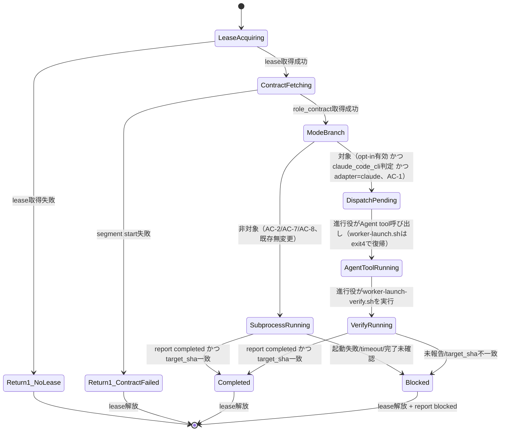

# DESIGN: 進行役がClaude Codeの場合、worker-launch.shが起動するsegment workerをこのセッションのサブエージェントツリー上で可視化する

- Issue: `ISSUE-448`
- 対応する SPEC: `SPEC.md`

## 技術検証の結論（未決事項1・2への回答）

design segmentでの検証結果を先に要約する。以降の設計要素はこの結論を前提とする。

**検証事実**: 進行役（Claude Code CLIセッション）のBashツール呼び出しは環境変数 `CLAUDECODE=1` を継承する（本design segment作業中に `env | grep CLAUDECODE` で実測確認済み）。この値は `worker-launch.sh` を実行するシェルプロセス自身の環境に存在するため、追加の外部プロセス起動や推測なしに参照できる。ただし本変数はClaude Code CLIが内部的に設定するものであり将来のバージョンで変更され得るため、要件7が要求する「判定不能時は安全側フォールバック」を必ず実装する（後述 §セッション判定）。

**未決事項1（AC-1とI5の両立）への回答**: 両立可能と判断する。根拠は、現行のheadless subprocess方式でも起動主体（進行役の`bash -c`呼び出し）とcommit実行主体（サブプロセス内で走る`checkpoint.sh`呼び出し）は既に分離されており、進行役はrole_contract全文をstdin経由で「中身を読まずに」中継しているに過ぎない。Agent tool経由の起動もこの構造を保つ——進行役はAgent toolの`prompt`引数にrole_contract全文を**加工せず**渡すだけであり、実際のファイル編集・commit・push・report発行はサブエージェント自身のターンの中で、既存の`checkpoint.sh`（writer lease credential経由）が行う。輸送経路がstdinからAgent tool `prompt`引数に変わるだけで、著述主体・commit主体は変わらない。詳細は下記 §Agent Tool Dispatch分岐 と ADR（本Issue）参照。

**未決事項2（I3耐久性との関係）への回答**: 新方式はheadless subprocess方式が持つ「進行役プロセスからの完全独立」を持たない、という制約を受け入れたうえで運用する。ただし (a) Agent tool呼び出しは`run_in_background: false`（フォアグラウンド）で行うことを進行役への手順として必須化し、現行の`wait "$worker_pid"`と同じ「進行役のターンが終わるまでworkerも終わらない」というブロッキング的性質を保つ、(b) 進行役セッションがworker完了前に異常終了した場合の回復手段は、新方式固有の仕組みを追加するのではなく、既存のwriter lease TTL失効・ADR-0024（credentialなしreclaim）・`issue-resume.sh`という既存の耐久性の安全網にそのまま委ねる。これは新しい失敗経路の発生頻度は変える（進行役プロセスに紐づく分、発生し得る場面が増える）が、失敗からの回復手段の**種類**は増やさない。この受容はopt-in既定無効（要件8）という安全側の判断を裏付ける追加の理由でもある。詳細はADR参照。

**新規に判明したリスク（ツール許可範囲の粗さ）**: `--allowed-tools`によるBashコマンド単位の許可制御（`WORKER_ALLOWED_TOOLS_DEFAULT`）は、Claude CodeのAgent tool・カスタムsubagent種別の`tools:`定義がツール単位（Read/Edit/Bash等）でしか制御できないため、同じ粒度で再現できない。この差分は下記 §カスタムsubagent種別 で扱い、ADRのConsequencesに明記する。

## 要件 → 設計要素の対応表

| 要件 / AC-ID | 対応する設計要素 | 備考 |
|---|---|---|
| 要件1・AC-1 | セッション判定関数、`claude.sh` dispatch分岐、dispatch payload、カスタムsubagent種別 | 3条件すべて成立時のみdispatchへ分岐 |
| 要件2・AC-2 | `claude.sh` dispatch分岐のelse節（既存`launch_worker`本体、無変更） | 非対象ケースは既存コードパスを一切変更しない |
| 要件3・AC-3 | `worker-launch-verify.sh`（新規） | lease取得前失敗はdispatch分岐前の共通処理、起動後失敗はverifyスクリプトが同一の規律で処理 |
| 要件4・AC-4 | dispatch payloadの構造（contract本文とorchestrator向け手順の分離） | contract本文は一切加工せずAgent toolのprompt引数へ渡す |
| 要件5・AC-5 | commit経路無変更の確認（`checkpoint.sh`・writer lease credential） | dispatch分岐でもcommit主体・経路は変わらない |
| 要件6・AC-6 | dispatch分岐専用のテスト境界（`ASC_AGENT_TOOL_DISPATCH`・`ASC_ORCHESTRATOR_SESSION_OVERRIDE`） | 既存`WORKER_CMD`境界は既定off時そのまま機能 |
| 要件7・AC-7 | `_orchestrator_is_claude_code_cli_session()`（`claude.sh`） | 判定不能・不定値はすべてfalse＝フォールバック |
| 要件8・AC-8 | `worker.agent_tool_dispatch.enabled`（config schema新規項目）、`worker-selection.ts`拡張 | 既定false、3条件の一つとして評価 |

## 責務・境界

### コンポーネント構成

- `config.schema.yaml` / `agent-skill-chain.yaml`: `worker.agent_tool_dispatch: {enabled: boolean}`（既定false）を新規追加する後方互換な任意項目。既存の`issue_sync`・`merge`・`human_confirmation`と同型。
- `src/lib/worker-selection.ts`: `WorkerSelection`に`agentToolDispatch: boolean`を追加。`resolveWorkerSelection`が`config.worker.agent_tool_dispatch?.enabled ?? false`を解決する（純粋関数、既存方針を継承）。
- `src/commands/worker.ts`（`context`サブコマンド）: 常に`agent_tool_dispatch=<true|false>`行を出力する（`adapter`と同じく常時出力。segment別上書きは持たない単一のグローバル設定のため）。
- `.agent-skill-chain/scripts/worker-launch.sh`: `WORKER_CONTEXT`から`agent_tool_dispatch=`行を読み取り、`ASC_AGENT_TOOL_DISPATCH`環境変数として常にexportする。それ以外の既存ロジック（worktree自己解決含むADR-0029の仕組み）は無変更。
- `.agent-skill-chain/adapters/claude.sh`:
  - 新規関数 `_orchestrator_is_claude_code_cli_session()`: `ASC_ORCHESTRATOR_SESSION_OVERRIDE`（テスト用モック境界、`CLAUDE_AUTH_PROBE_CMD`と同型）が設定されていればその値で判定し、無指定時は`${CLAUDECODE:-}` が厳密に `"1"` の場合のみ真を返す。それ以外（未設定・空・`"1"`以外の値）はすべて偽＝要件7のフォールバック対象とする。
  - `launch_worker()` 冒頭に分岐を追加: `ASC_AGENT_TOOL_DISPATCH == true` かつ `_orchestrator_is_claude_code_cli_session` が真の場合のみ新関数 `_dispatch_via_agent_tool()` を呼ぶ。それ以外は既存の`launch_worker()`本体（lease取得〜subprocess起動〜完了確認〜解放）を一切変更せず実行する（AC-2/AC-7/AC-8）。
  - `_dispatch_via_agent_tool()`（新規）: (1) `acquire_lease`（失敗時は現行と同じくblocked報告なしでreturn 1）、(2) `_asc_cli segment start`（失敗時はlease解放のみでreturn 1）、(3) 標準出力へ「contract本文」と「進行役向けdispatch手順」を区分して出力し、(4) exit code `4`（新規、"dispatch_required"）でreturn する。**サブプロセスは起動しない。leaseは解放しない**（現行のhuman adapter `deferred`と同様、非同期継続中を意味する）。
- `.agent-skill-chain/scripts/worker-launch-verify.sh`（新規）: `worker-launch.sh`と同じworktree自己解決ロジック（ADR-0029のself-resolution、絶対パス直接呼び出しでmain扱いになる既知の罠を回避）を再利用したうえで、`_asc_cli report latest`とHEADのSHA照合を行い、一致すれば`release_lease`してexit 0、不一致・未報告ならば`role="${segment}_worker"`で`report_status ... blocked`してから`release_lease`しexit 2（現行`_fail_blocked`と同一の規律、AC-3）で返す。
- カスタムsubagent種別 `.agent-skill-chain/templates/claude/agents/agent-skill-chain-worker.md`（新規配布資産）: `tools:` フロントマターに `Read, Grep, Glob, Edit, Write, MultiEdit, Bash` を許可し、`Agent`（無制限な再帰dispatch防止）・`ExitPlanMode`・`NotebookEdit`・`WebFetch`・`WebSearch`・`Artifact` を明示的に含めない。`init`/`upgrade`が`.claude/agents/agent-skill-chain-worker.md`へ同期する（既存`templates.github_source/github_target`と同型の新規config項目 `templates.claude_agents_source`/`templates.claude_agents_target`を追加し、`verify-template-sync.sh`の検査対象へ加える）。Bashコマンド単位の許可制御（`WORKER_ALLOWED_TOOLS_DEFAULT`と同等の粒度）はClaude Codeのsubagent種別定義では実現できないため完全な同等物ではない（後述の障害・ロールバック考慮を参照）。
- dispatch手順の文書化: `_dispatch_via_agent_tool()`が出力するorchestrator向け指示（Agent toolを`subagent_type: "agent-skill-chain-worker"`・`prompt`にcontract本文そのまま・`run_in_background: false`で呼び出し、完了後に`worker-launch-verify.sh`を実行する手順）に加えて、`.agent-skill-chain/standards/`配下に手順の正本を1箇所置き、dispatch payloadはその正本への言及ではなく要旨を都度出力する（成果物の自己完結性原則を各ワーカーではなく進行役向け運用手順に適用したもの。禁止されている「詳細はXを参照」ではなく、都度必要な要旨をpayload自体に含める）。

### 依存関係

```text
agent-skill-chain.yaml(worker.agent_tool_dispatch)
  → worker-selection.ts(resolveWorkerSelection)
  → worker.ts(context)
  → worker-launch.sh(ASC_AGENT_TOOL_DISPATCH export)
  → claude.sh(_orchestrator_is_claude_code_cli_session, launch_worker分岐)
  → _dispatch_via_agent_tool()
  → 進行役(Agent tool呼び出し, subagent_type=agent-skill-chain-worker)
  → worker-launch-verify.sh
  → report-status.sh / lease-release.sh
```

循環依存なし。`worker-launch-verify.sh`は`worker-launch.sh`のworktree自己解決ロジックを再利用する（新規重複実装を避ける）。

### 状態遷移



### 図示要否の判断

- 判断: `要`
- 根拠: 依存関係が3つ以上（config→resolve→CLI→script→adapter→Agent tool→verify script）、状態遷移が2つ以上（DispatchPending/AgentToolRunning/VerifyRunningという新規分岐を含む）、責務境界（コンポーネント）も3つ以上該当する。

## 関連ADR

```yaml
related_adrs:
  - id: ADR-0015
    relation: references
  - id: ADR-0029
    relation: adopts
```

（本Issueで新規作成するADRは`docs/adr/`にproposedとして追加する。上記は既存accepted ADRへの参照。）

## 障害・ロールバック考慮

- 想定される失敗モード:
  1. `_orchestrator_is_claude_code_cli_session`の誤判定（`CLAUDECODE`が将来別の意味に変わる等）: 要件7により誤って真と判定するリスクはあるが、`ASC_ORCHESTRATOR_SESSION_OVERRIDE`によるテストでの明示検証と、既定off（要件8）により実害の露出範囲は限定される。
  2. dispatch後、進行役がAgent tool呼び出しを行わずに放置する（人間の操作ミス・進行役の判断ミス）: lease は取得済みのまま保持され続けるため、既存のTTL失効（既定3600秒）と`ADR-0024`のcredentialなしreclaim、`issue-resume.sh`による再開が安全網として機能する。新方式固有の追加復旧コードは持たない。
  3. Agent tool呼び出し中に進行役セッションが異常終了する: 未決事項2の回答のとおり、既存の耐久性安全網（lease TTL・reclaim・resume）に委ねる。`run_in_background: false`を必須化することで、少なくとも「進行役のターンが正常終了した時点でworkerも完了している」という現行同等の性質は保つ。
  4. カスタムsubagent種別のツール許可がBashコマンド単位で絞れない: 機械的な多重防御が1層減るリスクを受容し、既定off（opt-in）で露出を限定する。将来的な緩和（例: Bashコマンド単位のフックによる補完）は本Issueのスコープ外とし、必要なら別Issueで扱う。
- ロールバック手順: `worker.agent_tool_dispatch.enabled`を`false`に戻す（または未設定のままにする）ことで即座に既存のheadless subprocess方式へ全面的に戻る。新規追加したスクリプト・関数はopt-in条件が成立しない限り呼ばれないため、コードの削除を伴わないロールバックが可能。
- 影響を受ける既存機能: `worker-launch.sh`・`claude.sh`の`launch_worker()`は分岐追加のみで既存コードパス自体は無変更（AC-2）。`codex.sh`・`human.sh`は`ASC_AGENT_TOOL_DISPATCH`を一切参照しないため無影響。
