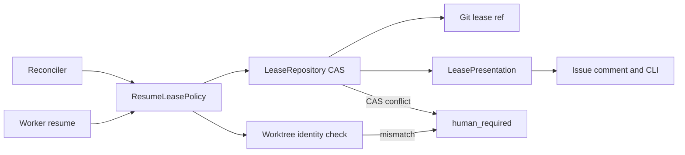
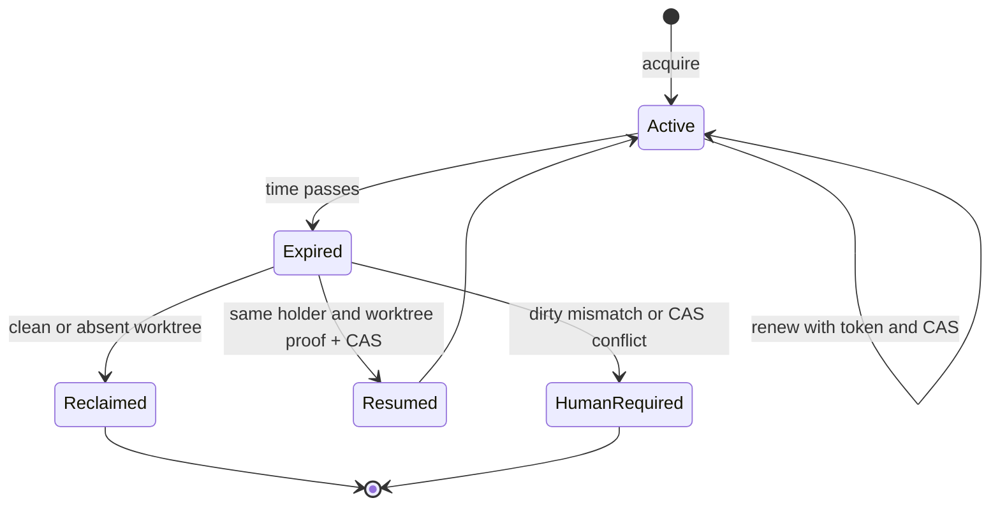

# DESIGN: 期限切れ writer lease の再開と秘密情報の隔離

- Issue: `ISSUE-286`
- 対象ブランチ: `bugfix/286-expired-writer-lease-resume-and-redaction`
- 関連 ADR: `ADR-0014-expired-writer-lease-resume-and-redaction`

## 目的・対象範囲

GitHub backend の writer lease を、期限切れ後も同一作業の dirty worktree だけは安全に再開できる
状態にする。同時に、lease token を commit subject、Issue comment、CLI 出力から除去する。対象は
lease acquire、renew、release、resume、reconcile と GitHub lease ref の表現である。

## 責務と境界

| Context | 入力 | 出力 | 責務 | 禁止 |
|---|---|---|---|---|
| LeaseRepository | issue、segment、holder、lease ref | 現在 lease と CAS 結果 | ref の読取り、比較更新、削除 | token を可視 Git metadata に書く |
| ResumeLeasePolicy | 期限切れ lease、専用 worktree、resume proof | resumed / human_required | 同一作業の証明と安全な移譲 | 異なる holder や worktree の奪取 |
| LeasePresentation | lease の公開可能な属性 | comment、CLI 表示 | holder、期限、状態だけを表示 | token や secret payload の直列化 |
| Reconciler | 期限切れ lease と worktree 状態 | reclaimed / human_required | clean は回収、dirty は保護・再開案内 | dirty 変更の削除、勝手な再開 |

## 構造と依存方向

`LeaseRepository` が token を含む非表示 payload を ref object に保存する唯一の境界である。
`LeasePresentation` は公開 DTO を受け取り、token を持たないため、表示経路が token を誤って
出力できない。resume は既存 ref の object ID を期待値とする compare-and-swap を使い、検査後に
別作業者が更新した場合も上書きしない。

## データと状態遷移

lease ref の commit subject は、schema version、Issue、segment、holder、取得時刻、期限、状態を
含む token 非含有の公開 YAML とする。token は commit の tree に置く非表示 payload に保持し、
commit subject・Issue comment・CLI では `holder` と `expires_at` だけを表示する。

旧形式 ref は reader が検出した時点で legacy と扱う。期限切れなら reconcile が token を表示せず
削除できる。正当な resume は新形式 ref に比較更新する。期限内の旧形式 lease は既存の holder が
renew/release するまで token の露出範囲を拡大せず、他作業者に取得させない。

## 再開証明

resume は `issue start` で作った worktree を `git worktree list --porcelain` から解決し、次を
すべて検査する。

- ref の Issue と segment がコマンド引数に一致する。
- resume proof の holder が ref の holder に一致する。
- worktree の branch が Issue の branch 命名規約と ref の Issue に一致する。
- worktree が dirty であり、reconcile が保護対象と判断する状態である。
- ref の object ID が read 時から CAS 更新時まで変化していない。

いずれかが不成立なら、ref、worktree、local branch を変更せず `human_required` を返す。

## 障害時の扱い

- GitHub API、fetch、push、credential が失敗した場合は成功として扱わず、既存 ref と worktree を
  変更しない。
- legacy payload の parse に失敗した場合は token を含む raw text をエラーへ連結せず、unknown
  legacy lease として `human_required` にする。
- Issue comment や label の更新失敗は正本ではないため lease の成否を変更しないが、token 非露出を
  守る presenter を必ず経由する。

## 完了条件と検証

AC-1〜AC-3 は Git/gh stub を用いる統合テストで、正常、CAS 競合、mismatch、各表示経路を
検証する。AC-4 は旧 commit subject を fixture で作り、token の absence を自動検査した上で、
実 GitHub ref に対する migrate/reclaim の実行手順を `VALIDATION.md` に残す。
