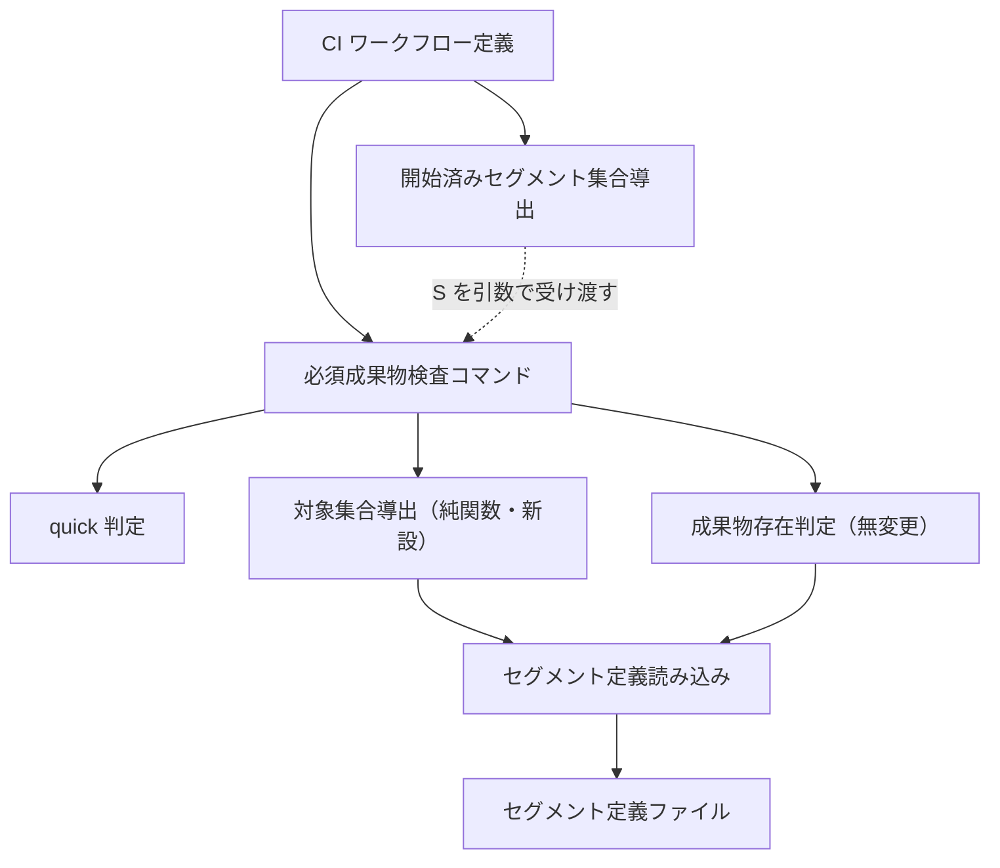

# DESIGN: quick免除が解除されたIssueでも成果物が1つも無いセグメントが必須成果物検査の対象にならない欠陥の是正

- Issue: `ISSUE-741`
- 対応する SPEC: `SPEC.md`

## 目的・対象範囲

必須成果物検査は、開始済みと判定されたセグメントに対してのみ実行される。開始済みの判定根拠はそのセグメントの成果物がブランチ差分に現れることだけであるため、成果物が1つも作られていないセグメントは検査対象から外れ、欠落が永久に検出されない。本設計は、検査を適用するセグメントの集合（以下 R）を「開始済みセグメント集合（以下 S）」から「S に上流セグメントを閉包追加した集合」へ拡張し、その導出を単体テストから直接呼び出せる実行可能アセット側へ置く。成果物の存在判定規則（成果物存在述語）・セグメント定義・quick 免除の規則そのものは変更しない。

対象範囲は次の4点である。(a) R の導出規則の新設、(b) quick シグナルの解決可否を判定結果の第一級の状態として保持すること、(c) CI ワークフローが quick シグナルを解決できる権限とトークンを必須成果物検査へ与えること、(d) S の解決失敗が起きない前提を検査済みの不変条件として保証し、解決失敗を空の S として読み替えないこと。検査対象判定（ブランチ名からの Issue 番号解決と許可条件の照合）、成果物存在述語、セグメント定義とその `outputs`、quick 免除の対象成果物集合とガードレール対象パスは対象外であり無変更とする。

## 前提の実地確認

要求・要件セグメントのゲートレビューでは、既存実装・設定・ワークフロー定義・関連 ADR がレビュア側へ展開されておらず、SPEC が「現行動作を維持する」と述べた箇所の妥当性が未検証のまま申し送られた。本設計では該当箇所を実物に当たって確認した。結果は次のとおりで、いずれも SPEC の前提と一致する。

| 確認対象 | 実測した現行動作 | SPEC との整合 |
|---|---|---|
| セグメント連鎖順序 | `spec → design → implementation → validation → completed` の一本鎖 | 一致（SPEC 用語「セグメント順序」） |
| 各セグメントの `outputs` | spec=[`SPEC.md`]／design=[`DESIGN.md`, `ADR`, `PLAN.md`]／implementation=[`code`, `unit_test_results`]／validation=[`acceptance_test_results`, `regression_test_results`] | 一致（成果物存在述語の3分類が過不足なく対応する） |
| 要件3（quick 免除有効時の挙動） | 免除有効時は `SPEC.md`・`DESIGN.md`・`PLAN.md`・`acceptance_test_results`・`regression_test_results` を要求対象から除外し、`ADR`・`code`・`unit_test_results` は除外しない | 一致（維持可能） |
| 要件4（免除解除理由の提示） | quick 要求かつ非免除のとき、解除理由を列挙した固定書式のメッセージを標準エラー出力へ書く | 一致（維持可能） |
| 要件5（シグナル解決不能時） | 解決失敗を「quick 未要求」と同一に畳み込んでおり、両者を区別する状態を持たない | **不足**。区別のための状態追加が必要（下記 D3） |
| 要件6（S の解決失敗） | S 導出スクリプトは base 解決失敗・差分算出失敗のいずれでも終了コード1を返す | 一致。ただし CI 側で終了コードが握り潰され、失敗が空の S として下流へ渡る（下記 D5） |
| S 導出段より前の base 取得 | リポジトリ取得は履歴を切り詰めない深度指定であり、base ブランチは明示的に取得済み。展開結果と配布テンプレートの同一性は無条件に検査される。3段とも S 導出段より前にあり、失敗すればその時点でジョブが停止する | SPEC が求める非退行（新たに失敗しない）と両立する形で握り潰しを解消できる（下記 D5） |
| 要件7（S が空） | S が空なら検査を1回も実行せず成功する | 一致（維持可能） |
| 要件11（検査対象判定） | Issue 番号を解決できれば検査対象、解決できなくても Dependabot ブランチかつ作成者が Dependabot、または厳密形式の root-cleanup ブランチかつ作成者が admin 権限なら検査省略、いずれにも該当しない場合と権限確認自体に失敗した場合は終了コード1 | 一致（維持可能。SPEC の K1・K2・K3 と過不足なく対応する） |
| 必須成果物検査への権限・トークン | ワークフローの権限宣言に Issue 読み取りが無く、当該実行段の環境変数にもトークンが無い | 一致（SPEC 前提のとおり CI では quick 免除が一度も適用されていない） |
| 非 Draft PR での先行失敗 | root 直下成果物の検査は非 Draft のときのみ実行され、必須成果物検査より前の段に位置する | 一致（SPEC 前提のとおり、受入条件の観測単位を直接実行に置く必要がある） |

### 確認箇所の原文

上表の各行は実物のファイル内容に基づく事実主張である。本文書だけで真偽を確かめられるようにするため、確認箇所の原文をそのまま引用する。引用元は、セグメント定義ファイル `.agent-skill-chain/config/segments.yaml`、CI ワークフロー定義（展開結果 `.github/workflows/agent-skill-chain-ci.yml` と配布テンプレート `.agent-skill-chain/templates/github/.github/workflows/agent-skill-chain-ci.yml`。両者は現状バイト単位で同一であり、下記の同期検査段がその同一性を無条件に検査する）、および開始済みセグメント集合の導出スクリプト `.agent-skill-chain/scripts/detect-changed-segments.sh` である。

**セグメント連鎖順序と各セグメントの `outputs`。** セグメント定義ファイルの定義本体は次のとおりである。

```yaml
schema_version: agent-skill-chain/segments/v1
segments:
  - {id: spec,           outputs: [SPEC.md],                                                next: design}
  - {id: design,         outputs: [DESIGN.md, ADR, PLAN.md],                                 next: implementation}
  - {id: implementation, outputs: [code, unit_test_results],                                 next: validation}
  - {id: validation,     outputs: [acceptance_test_results, regression_test_results],        next: completed}
```

`next` を先頭要素から辿ると `spec → design → implementation → validation → completed` の一本鎖になる。先頭要素は他のどの要素の `next` にも現れない `spec` として一意に定まる。`completed` は `id` を持つ要素として定義に存在せず `next` の値としてのみ現れるため `outputs` を持たない。

**必須成果物検査を実行する段への権限・トークン付与状況。** ワークフロー定義の権限宣言は次の2行のみである。

```yaml
permissions:
  contents: read
```

必須成果物検査を実行する段は次のとおりで、`env:` を持たず、Issue ラベル取得に要するトークンもリポジトリ識別子も与えていない。

```yaml
      - name: verify-artifacts (開始済みセグメントごと)
        if: steps.ctx.outputs.skip_checks != 'true'
        run: |
          tr ',' '\n' <<< "${{ steps.segments.outputs.values }}" | while IFS= read -r segment; do
            [[ -z "$segment" ]] && continue
            ./.agent-skill-chain/ci/verify-artifacts.sh "${{ steps.ctx.outputs.issue_id }}" "$segment"
          done
```

**非 Draft PR での root 直下成果物検査の先行。** root 直下成果物の検査段は次のとおりである。

```yaml
      - name: verify-root-clean (merge-ready)
        # ISSUE-590: マージ準備完了状態（Draftではない）のPRについて、repoRoot直下に対象4ファイル
        # （SPEC.md/DESIGN.md/PLAN.md/VALIDATION.md）が残存していないかを既存の
        # .agent-skill-chain/ci/verify-root-clean.sh（verify root-clean CLI、Issue #208で導入済み・
        # 無変更のまま再利用）で検査する。Issueブランチへ削除commitを追加できない制約上、
        # validation-gateまで正常に完了したPRでもこの検査は常に失敗する設計であり（ADR-0046）、
        # マージには `--admin` によるbypassを要求する。Draft中はroot直下に対象ファイルが存在する
        # ことが正常な中間状態であるため、draft == false のときのみ実行する。
        if: steps.ctx.outputs.skip_checks != 'true' && github.event.pull_request.draft == false
        run: ./.agent-skill-chain/ci/verify-root-clean.sh
```

同ジョブの段は定義順に実行される。段名を定義順に並べると `actions/checkout` → `actions/setup-node` → `Detect npm build prerequisites` → `npm ci` → `npm run build` → `Ensure agent-skill-chain CLI` → `Fetch base branch for diff-based checks` → `Derive issue_id` → `verify-branch-name` → `verify-worktree-path` → `verify-root-clean (merge-ready)` → `verify-template-sync` → `Detect started segments` → `verify-artifacts (開始済みセグメントごと)` → `verify-spec-bdd` → `verify-design-diagram` → `verify-ac-coverage` → `verify-adr (PRで変更されたADRごと)` → `lint-vocab` → `lint-references` → `Fetch base branch for secret scan` → `lint-secrets (PRで追加された行のみ)` → `adr-lint` であり、root 直下成果物の検査段は必須成果物検査段より前に位置する。したがって非 Draft PR ではジョブが必須成果物検査段へ到達しない。受入条件と完了条件の観測単位を CI ジョブ全体ではなく検査の直接実行へ置く必要があるのはこのためである。

## 設計判断

### D1. 対象集合の導出を入出力を持たない純関数へ切り出す

R の導出を、Git・GitHub・ファイルシステムのいずれにも触れない関数として実装する。入力は「S」「セグメントの連鎖順序」「閉包追加を行うか否か」の3つ、出力は「対象セグメントと、それが閉包追加されたものか否かの標識」の列である。副作用と外部依存を持たないため、CI ワークフローを起動せずに単体テストから直接呼び出して閉包の有無を検証できる。CI ワークフロー定義側には上流判定も閉包追加対象の判定も一切書かない。

連鎖順序は固定列として実装側に再定義せず、セグメント定義の `next` を先頭要素から辿って導出する。先頭要素は「他のどのセグメントの `next` にも現れない要素」として決定する。

### D2. 閉包追加対象の決定規則

S が空なら R も空とする。S が空でなく閉包追加を行う場合、連鎖順序上で S の最も下流の要素より前に位置し、S に含まれず、かつ閉包追加除外集合に属さないセグメントを R へ加える。除外集合は「実装」「独立検証」の2つである。

実装セグメントを除外する理由は、その必須成果物が差分そのもの（コード変更・テスト変更）であり、コード変更を伴わない文書のみの Issue には産出物が原理的に存在しないため、強制すると正当な Issue を失敗させることにある。

独立検証セグメントの除外は、現行のセグメント定義の下では常に空振りする（除外を書かなくても結果は同一である）。根拠は連鎖順序上の位置ではない。独立検証が閉包追加対象になるのは S に独立検証より下流の要素が含まれる場合であり、連鎖順序上で独立検証の下流にあるのは終端の `completed` だけである。`completed` はセグメント定義に要素として存在せず連鎖の行き先としてのみ現れるため `outputs` を持たず、S は成果物がブランチ差分に現れることを根拠に導出される以上 `completed` が S に入ることはない。したがって独立検証が閉包追加対象になる状態自体が現行定義の下では構成できない。それでも規則として明記するのは、将来セグメント定義が延長され独立検証の下流に `outputs` を持つ要素が置かれた場合にも、独立検証を閉包追加しない意図を規則側に残すためである。

### D3. quick シグナルの解決可否を判定結果の第一級の状態にする

現行の quick 判定は、シグナルの取得失敗（GitHub モードでの Issue ラベル取得失敗、ローカルモードでの Issue 状態ファイル読み取り失敗）を「quick 未要求」と同一の結果へ畳み込んでいる。免除の可否だけを問う限りこの畳み込みは安全側で正しいが、本設計では「解決できたうえで未要求」と「解決できない」で閉包追加の有無が分かれるため区別が要る。

判定結果に「シグナル入力自体を取得できたか」を表す真偽値を追加する。GitHub モードではラベル取得コマンドが非0終了した場合と応答を解釈できない場合、ローカルモードでは Issue 状態ファイルを読めない場合を未解決とする。閉包追加を行う条件は「解決できた、かつ免除を適用しない」の連言とする。未解決のときは解決できなかった旨と、そのため免除も閉包追加も適用しない旨を標準エラー出力へ書く。

**未解決条件が SPEC の列挙する解決不能要因をすべて覆うことの確認。** SPEC は GitHub モードの解決不能要因として「権限・トークン未付与、API エラー、レート制限、当該 Issue 不在」の4つを列挙する。上の2条件（取得コマンドの非0終了・応答の解釈不能）がこの4つを覆うことを、現行のラベル取得実装と実測で確認した。

現行のラベル取得実装 `src/lib/quick-mode.ts` の該当箇所は次のとおりで、取得コマンドの終了コードが0以外の場合と、標準出力を JSON として解釈できない場合を、いずれも同一の結果（quick 未要求）へ畳み込んでいる。本設計はこの2つの分岐点をそのまま未解決の契機として用いる。

```ts
  const view = gh([`issue`, 'view', issueNumber, '--json', 'labels'], root);
  // gh 未認証・ネットワーク不通・Issue 不在などは安全側（standard）へ倒す。quick は
  // 明示的なオプトインでのみ成立し、シグナルを読めない状況で自動適用してはならない。
  if (view.status !== 0) return { size: 'standard', risk: 'unclassified' };
  let payload: GhLabelsPayload;
  try {
    payload = JSON.parse(view.stdout) as GhLabelsPayload;
  } catch {
    return { size: 'standard', risk: 'unclassified' };
  }
```

第1の条件は原因ではなく結果（非0終了）で定義されているため、取得が成功終了しなかったすべての場合を覆う。残る危険は「取得できていないのに終了コード0を返す」場合だけであり、それが成立すると解決成功かつ quick 未要求へ誤分類され、要件5・`AC-12`・`AC-13` の反例になる。この危険が現実に成立しないことを、本リポジトリで次のとおり実測した。

当該 Issue が不在の場合。

```
$ gh issue view 99999999 --json labels; echo "exit=$?"
GraphQL: Could not resolve to an issue or pull request with the number of 99999999. (repository.issue)
exit=1
```

認証情報が与えられていない場合（`gh` の設定ディレクトリを空にし、トークンの環境変数を取り除いて実行）。

```
$ env -u GH_TOKEN -u GITHUB_TOKEN GH_CONFIG_DIR=<空のディレクトリ> gh issue view 741 --json labels; echo "exit=$?"
To get started with GitHub CLI, please run:  gh auth login
Alternatively, populate the GH_TOKEN environment variable with a GitHub API authentication token.
exit=4
```

トークンは与えられているが API が HTTP エラーを返す場合。

```
$ GH_TOKEN=<無効な値> gh issue view 741 --json labels; echo "exit=$?"
HTTP 401: Bad credentials (https://api.github.com/graphql)
exit=1
```

3件とも標準出力は空、終了コードは0以外、診断は標準エラー出力である。したがって「当該 Issue 不在」は第1の条件（非0終了）へ帰着し、終了コード0かつ空応答という誤分類経路は存在しない。「権限・トークン未付与」も同じく第1の条件へ帰着する。「API エラー」「レート制限」はいずれも API が HTTP エラーを返す事象であり、3件目の実測が示すとおり `gh` は API の HTTP エラーを非0終了として返すため、これも第1の条件へ帰着する。第2の条件（応答の解釈不能）は、終了コード0でありながら標準出力が JSON でない場合——中継プロキシによる応答の置換など——を受け止める残余条項である。よって D3 の2条件は SPEC が列挙する4要因をすべて覆う。ローカルモードでは Issue 状態ファイルの読み取り自体が成否の唯一の入力であり、読めない場合を未解決とすることで同様に覆う。

この既定は、強制を強める方向ではなく弱める方向へ倒す点で agent-skill-chain の通常の安全側既定と逆であるため、判断とその根拠を ADR として独立に記録する。

### D4. CI ワークフローが必須成果物検査へ Issue 読み取り権限とトークンを与える

ワークフローの権限宣言へ Issue の読み取りを追加し、必須成果物検査を実行する段の環境変数へトークンとリポジトリ識別子を与える。この2点が本変更の実効化スイッチであり、これらを与えない環境ではシグナルが解決できず R は S と等しくなって挙動は本変更前と同一になる。配布テンプレートと展開結果は同一に保つ。

### D5. S の解決失敗が起きない前提を保証し、解決失敗を空の集合として読み替えない

S 導出スクリプト自体は base 解決失敗・差分算出失敗のいずれでも終了コード1を返すが、CI ワークフローはその出力を整形コマンドへパイプしており、パイプ全体の終了コードは末尾の整形コマンドのものになる。実行段は失敗しないまま S が空文字列となり、検査が1回も実行されずにジョブが成功する。空の S は「どのセグメントも開始されていない」という判定結果であって「判定できなかった」ことではないため、両者を同一の値へ畳み込むこの経路は、本 Issue が塞ごうとしている「検査が走らないまま緑になる」穴と同種である。閉包追加を導入しても S が空である限り無効化されるため、同一変更で是正する。

是正の方向は2つある。(i) 解決失敗をジョブ失敗として顕在化させる。(ii) 解決失敗そのものが起きない前提を保証する。(i) だけを採ると base を取得できない実行環境の PR が新たに赤くなり、SPEC の非退行保証（quick シグナルを解決できない実行環境で実行されるすべての PR が本変更によって新たに失敗しないこと）に対する反例を生む。当該環境が base も取得できない場合が該当するためである。よって (ii) を主たる是正とし、(i) は (ii) の下で新たな失敗を生まないことを確かめたうえで併せて行う。

**前提が既に成立していることの確認。** ワークフロー定義を実地に読み、S 導出段より前に次の3段が同一ジョブ内・同一の実行条件で置かれ、いずれも失敗すればその時点でジョブが停止することを確認した。

| 先行段 | 保証する内容 |
|---|---|
| リポジトリ取得 | 履歴を切り詰めない深度を指定しており浅い複製にならない。共通祖先の算出に必要な履歴が揃う |
| base ブランチの明示取得 | base 参照名が空でないとき base を取得する。本ワークフローは pull request 事象でのみ起動し、当該事象では base 参照名が空にならない |
| 展開結果と配布テンプレートの同期検査 | 無条件に実行され、両者が同一でなければ失敗する。上記2段を配布先が弱めた状態では S 導出段へ到達しない |

**根拠の原文。** 上表の3段、比較対象となる S 導出段と後続段、および S 導出スクリプトの該当箇所を原文で示す。

*根拠(1) リポジトリ取得深度が履歴を切り詰めないこと。* ジョブ最初の段は次のとおりで、`fetch-depth: 0` は全履歴の取得を指定する値であり浅い複製にならない。

```yaml
    steps:
      - uses: actions/checkout@v7.0.1
        with:
          fetch-depth: 0
```

*根拠(2) base 取得段が S 導出段より前に、S 導出段より弱い実行条件で存在すること。* base 取得段と S 導出段は次のとおりである。

```yaml
      - name: Fetch base branch for diff-based checks
        # verify-artifacts の code 判定（git diff base...HEAD）が base を解決できるようにする。
        # actions/checkout@v7.0.1 はPRのマージrefのみをフェッチし、baseブランチ自体はローカルに
        # 存在しないため（PR #172 run 29717941752 で実落ち）、ここで明示的にフェッチする
        # （下記 verify-adr ステップと同一パターン。remote.origin.fetch の既定refspecにより
        # `origin/$BASE_REF` としてローカルへ反映される）。
        if: github.base_ref != ''
        env:
          BASE_REF: ${{ github.base_ref }}
        run: git fetch origin "$BASE_REF"
```

```yaml
      - name: Detect started segments
        id: segments
        if: steps.ctx.outputs.skip_checks != 'true'
        env:
          BASE_REF: ${{ github.base_ref }}
        run: |
          values="$(./.agent-skill-chain/scripts/detect-changed-segments.sh "$BASE_REF" | paste -sd, -)"
          echo "values=$values" >> "$GITHUB_OUTPUT"
```

段名の定義順（前掲）において base 取得段は S 導出段より前にある。ワークフローの起動条件は次のとおり `pull_request` 事象に限られ、当該事象では base 参照名が空にならないため、base 取得段の条件 `github.base_ref != ''` は S 導出段が実行されるあらゆる場合に真である。

```yaml
on:
  pull_request:
    types: [opened, synchronize, reopened, ready_for_review]
```

展開結果と配布テンプレートの同期検査段は `if:` を持たず無条件に実行され、両者が一致しなければその時点でジョブが停止する。この段も S 導出段より前にある。配布先が上記2段を弱めた定義を持つ場合、S 導出段へ到達する前にこの段で停止する。

```yaml
      - name: verify-template-sync
        run: ./.agent-skill-chain/ci/verify-template-sync.sh
```

S 導出スクリプトが base を解決する箇所は次のとおりで、`origin/<base 参照名>` を先に試す。上記の取得段によりこの参照は必ず存在する。

```bash
if git rev-parse --verify --quiet "origin/$BASE_REF" >/dev/null; then
  BASE_REV="origin/$BASE_REF"
elif git rev-parse --verify --quiet "$BASE_REF" >/dev/null; then
  BASE_REV="$BASE_REF"
else
  echo "base branchを解決できません: $BASE_REF" >&2
  exit 1
fi
```

*根拠(3) 差分算出失敗は後続の別の段が同一条件で既に失敗させること。* S 導出スクリプトの差分算出箇所は次のとおりで、失敗時は終了コード1を返す。

```bash
if ! git diff --name-only "$BASE_REV...HEAD" >"$tmpfile"; then
  echo "git diff failed for $BASE_REV...HEAD" >&2
  exit 1
fi
```

同一の base に対する同形式の差分算出を、S 導出段と同じ `if:` 条件を持つ後続段がパイプを介さずに行っている。

```yaml
      - name: verify-adr (PRで変更されたADRごと)
        if: steps.ctx.outputs.skip_checks != 'true'
        env:
          BASE_REF: ${{ github.base_ref }}
        run: |
          git fetch origin "$BASE_REF"
          CHANGED_ADRS="$(git diff --name-only "origin/$BASE_REF"...HEAD -- 'docs/adr/*.md')"
          for adr_path in $CHANGED_ADRS; do
            ./.agent-skill-chain/ci/verify-adr.sh "$adr_path"
          done
```

`shell:` を明示しない `run:` の既定シェルは `bash -e` であり `pipefail` を含まない。S 導出段はコマンド置換の内側にパイプを持つため、スクリプトが返す終了コード1がパイプ末尾の整形コマンドの終了コードに置き換わり、段の失敗として現れない。これが握り潰しの実体である。一方 verify-adr 段はコマンド置換の結果を変数へ代入するだけでパイプを持たないため、`git diff` の失敗はそのまま段の失敗になる。

したがって S 導出段に到達した時点で base 参照は必ず解決でき、`base 解決失敗` は起きない。残る失敗要因は共通祖先が無く差分算出自体が失敗する場合だけだが、同一の base に対する同一形式の差分算出を後続の別の段が同じ実行条件でパイプを介さずに行っており、その段は現状でも当該条件で失敗する。すなわち該当する PR は本変更の前から赤い。

**設計。** (a) 上記の前提を偶然成立している性質ではなく検査済みの不変条件へ格上げする。ワークフロー定義に対する静的検査として、リポジトリ取得の深度が履歴を切り詰めないこと・base 取得段が S 導出段より前に存在すること・S 導出段が導出の失敗を空の S へ読み替えないことを確認する。(b) S 導出段における終了コードの握り潰しを解消し、導出失敗が空の S として下流へ渡らないようにする。(a) の確認により (b) は現状で緑の PR を赤へ変えず、既に確定しているジョブ失敗の報告位置を、理由を提示できる段へ移すだけである。

**S 導出スクリプトの失敗時メッセージは変更しない。** 当初は差分算出失敗時の文面を base 解決失敗時と同じ日本語へ揃える案を採っていたが、これは取りやめる。SPEC の要件6 は S を解決できない場合の挙動を「判定不能として失敗し、理由を標準エラー出力へ提示する（現行動作を維持する）」と定める。上に原文を引用したとおり、現行実装は base 解決失敗時に `base branchを解決できません: <base 参照名>`、差分算出失敗時に `git diff failed for <base 参照>...HEAD` を標準エラー出力へ書いて終了コード1を返しており、「失敗する」「理由を提示する」「両者を互いに区別できる」のいずれも既に満たしている。文面の言語を揃えることは、要件6 が維持を求めている現行動作に対する変更であり、かつ本 Issue の目的（対象集合の拡張と、導出失敗を空集合へ読み替える経路の解消）に寄与しない。よって本 Issue では文面を変更せず現行のまま維持する。これは要求・要件セグメントから設計セグメントへ申し送られた「base ブランチ解決失敗以外の要因で S が解決できない場合のメッセージ粒度を要件6 に照らして確認すること」への回答でもある——確認の結果、現行の粒度が要件6 を満たしており変更を要さない。

**他案を採らない理由。** 握り潰しの是正を本 Issue のスコープから外す案は、S が空へ潰れる経路を残したまま閉包追加だけを導入することになり、本 Issue の是正が実効を持たないまま完了しうる状態を許す。SPEC の非退行保証へ例外を追記する案は、承認済みの要求節を変更して受入条件の再通過を要する一方、上記の確認により例外を必要とする実体が無い。

### D6. 検査対象判定は現行のまま維持し、直接実行によって観測する

検査対象判定はワークフロー定義のシェル記述に置かれたままとする。要件9 が実行可能アセット側へ移すことを求めているのは R の導出だけであり、検査対象判定については要件11 が現行動作の維持を求めている。受入条件が求める「直接実行」は、当該実行段の記述本文をワークフロー定義から取り出して同等のシェルとして実行し、終了コードと出力を確認する既存の検証方式で満たす。この方式は CI ジョブの段の並び順に依存しないため、非 Draft PR で先行段が必ず失敗するという性質の影響を受けない。

### D7. 失敗・診断メッセージの構成

診断はすべて標準エラー出力へ日本語で書き、次の構成を持つ。利用者が1回の実行で「どのセグメントがなぜ検査され、何が足りず、次に何をすべきか」を判断できることを設計目標とする。

- 対象集合の要約: 検査の開始前に R の各要素を、それが開始済みか閉包追加されたものかの標識とともに列挙する。検査結果が成功か失敗かに関わらず出力する。どのセグメントがなぜ検査対象になったのかを、失敗の有無と独立に確認できるようにするためである。
- 欠落: セグメント名と欠落した成果物名を対にして列挙する。閉包追加によって R へ加わったセグメントについては、当該セグメントが開始されていないこと自体が失敗理由であると読み取れる語を付す。開始済みセグメントの欠落は「作りかけの成果物を仕上げる」、閉包追加分の欠落は「上流セグメントを開始する」という別の是正行動に対応するため、両者を文面で区別する。
- quick 免除の解除: 解除の理由（リスク区分が normal でない、または変更差分がガードレール対象を含む）を欠落の列挙と同時に提示する。免除されると期待した利用者が、解除理由と欠落の双方を1回の実行で把握できるようにするためである。
- quick シグナルの未解決: 解決できなかった旨と、そのため免除も閉包追加も適用しない旨を提示する。強制が弱い側へ倒れたことを沈黙させないためである。一時的失敗と恒久的な未付与は観測側から区別できないため文面でも区別しない。
- S の解決失敗: base を解決できない場合と差分を算出できない場合を、いずれも理由として標準エラー出力へ提示し、両者を互いに区別できる文面とする。本項目のみ新設・変更ではなく現状維持の明示である。現行実装が既にこの構成を満たしており、要件6 が現行動作の維持を求めているため文面を変更しない（D5 参照）。

## 要件 → 設計要素の対応表

| 要件 / AC-ID | 対応する設計要素 | 備考 |
|---|---|---|
| 要件1, `AC-8`, `AC-9` | D1（対象集合の純関数）, D2（閉包追加規則） | 閉包追加が起きる場合の充足・欠落 |
| 要件2, `AC-6` | D2（閉包追加除外集合） | 実装は実質的な除外、独立検証は空振りの除外 |
| 要件3, `AC-4`, `AC-5` | D3（免除有効時は閉包追加せず R=S）, 既存の免除対象除外（無変更） | 現行動作の維持 |
| 要件4, `AC-10`, `AC-11` | D3（解除時は閉包追加を行う）, D7（解除理由の提示） | 解除理由の判定自体は現行実装をそのまま用いる |
| 要件5, `AC-12`, `AC-13` | D3（解決可否の第一級化と未解決時の劣化）, D7（未解決である旨の提示） | 未解決時は R=S、理由を提示 |
| 要件6, `AC-2` | D5（前提の保証と空集合への読み替えの解消）, D7（S 解決失敗の理由提示） | base 解決失敗・差分算出失敗の両方で理由を区別して提示 |
| 要件7, `AC-3` | D1（S が空なら R も空） | 検査を1回も実行しない |
| 要件8, `AC-5`, `AC-7`, `AC-9`, `AC-11` | D1（対象セグメントに閉包追加標識を持たせる）, D7（失敗・診断メッセージの構成） | 閉包追加分は未開始であること自体を失敗理由として示す |
| 要件9, `AC-15` | D1（純関数への切り出しと単体テストからの直接呼び出し） | ワークフロー定義に導出規則を書かない |
| 要件10, `AC-14` | D4（権限・トークン付与とテンプレート同期） | 静的検査で観測する |
| 要件11, `AC-1`, `AC-16` | D6（検査対象判定の維持と直接実行による観測） | 実装は無変更 |

## 責務・境界

### コンポーネント構成

- セグメント定義読み込み: セグメントの連鎖順序と各セグメントの `outputs` を提供する。連鎖順序の導出責務を持つ。
- 対象集合導出（新設・純関数）: S・連鎖順序・閉包追加可否から R を導出し、各要素に閉包追加標識を付す。外部入出力を持たない。
- quick 判定: シグナルの解決可否・要求有無・免除可否と解除理由を返す。既存責務にシグナル解決可否の表明を追加する。
- 成果物存在判定: 1つの必須成果物について存在を判定する。本設計では無変更で再利用する。
- 必須成果物検査コマンド: 上記4者を組み合わせ、対象集合の要約と欠落を標準エラー出力へ書き、終了コードを決める。単一セグメントを引数で受ける従来の呼び出し形式は、閉包追加を行わない従来どおりの挙動として残す。
- 開始済みセグメント集合導出: 差分から S を導出する。本設計では失敗時のメッセージのみを扱い、導出規則は変更しない。
- CI ワークフロー定義: 検査対象判定を行い、S の導出に必要な base を先行して取得し、S を導出し、S を必須成果物検査コマンドへ渡す。導出の失敗を空の S へ読み替えない。R の導出規則は持たない。

責務集中を避けるため、R の導出（純関数）と R の適用（コマンド）を分離する。導出側は外部状態を持たないため単体テストが安価であり、適用側は既存の成果物存在判定を呼ぶだけの薄い層に留まる。

### 依存関係



依存は上から下への一方向であり、循環は無い。対象集合導出はセグメント定義読み込み以外に依存せず、quick 判定・成果物存在判定・Git のいずれからも独立している。

### 図示要否の判断

- 判断: `要`
- 根拠: 責務境界が7つ（CI ワークフロー定義・開始済みセグメント集合導出・必須成果物検査コマンド・quick 判定・対象集合導出・成果物存在判定・セグメント定義読み込み）あり基準の3つ以上に該当し、依存関係も9本で基準の3つ以上に該当するため。

## 関連ADR

```yaml
related_adrs:
  - id: ADR-0067
    relation: adopts
```

ADR-0067 は本 Issue の設計セグメントで新規作成する決定であり、必須成果物検査の対象集合を開始済みセグメントの上流閉包へ拡張すること、閉包追加対象を要求・要件セグメントと設計・実装計画セグメントに限ること、および quick シグナルを解決できない実行環境では閉包追加を行わず本変更前と同一の対象集合へ劣化させることを記録する。作成時点の状態は `proposed` であり、設計ゲート承認時に `accepted` へ遷移する。

## 検出されない状態（設計上の既知の限界）

本設計を適用しても次の状態では欠落が検出されない。いずれも SPEC が例外またはスコープ外として確定させた範囲に収まる。

- 実装セグメントの成果物欠落。閉包追加除外集合に属するため、独立検証セグメントのみが開始済みで実装セグメントが未開始という状態でも実装セグメントは R に入らない。文書のみの Issue を失敗させないための意図した設計である。
- 下流セグメントが1つも開始されていない段階での上流成果物の欠落。閉包追加は S の最も下流の要素より上流にのみ及ぶため、`SPEC.md` だけを変更した PR では設計・実装計画セグメントは R に入らない。
- base 側に同名の成果物ファイルが残存している場合の欠落。成果物存在述語はワークツリー上のファイル存在を根拠に含み、述語の変更はスコープ外であるため、当ブランチで一切作成していなくても存在すると判定される。設計・実装計画セグメントが閉包追加されたときの `ADR` 出力は「`docs/adr/` 配下に `.md` が1つ以上ある」というリポジトリ水準の判定であり、ADR を1つでも持つリポジトリでは常に充足する。したがって閉包追加された設計・実装計画セグメントで実効的に強制されるのは `DESIGN.md` と `PLAN.md` である。
- 差分に現れるパスがどのセグメントにも対応しない変更のみからなる PR。S が空になり R も空になる。開始済みセグメント判定そのものの変更はスコープ外である。

## 障害・ロールバック考慮

- 想定される失敗モード1: 閉包追加が意図せず広く適用され、正当な PR が新たに失敗する。切り戻しは D4 の権限・トークン付与のみを取り消せばよい。シグナルが解決できなくなり R は S と等しくなるため、コードを一切戻さずに本変更前の判定へ復帰できる。これが本設計の第一のロールバック手段である。
- 想定される失敗モード2: 対象集合導出の規則自体に誤りがあり、閉包追加の有無が仕様と食い違う。切り戻しは必須成果物検査コマンドの呼び出しを従来の単一セグメント形式へ戻すこと。従来形式は閉包追加を行わないため、ワークフロー定義の1箇所の変更で本変更前の挙動へ復帰する。
- 想定される失敗モード3: Issue ラベル取得の一時障害・レート制限により、免除が有効な Issue でも解除扱いになる。この場合は未解決として扱われるため閉包追加は行われず、免除対象の成果物も要求されない従来どおりの対象集合になる。新たに失敗する PR は生じない。
- 想定される失敗モード4: D5 の是正により、これまで空の S として読み替えられていた S の解決失敗がジョブ失敗として現れる。D5 に記した先行3段の確認により、S 導出段へ到達した時点で base 参照は必ず解決でき、残る差分算出の失敗は後続段が同一条件で既に失敗させているため、本変更の前に緑だった PR が新たに赤くなることはない。想定外の環境で影響が生じた場合は、当該実行段の握り潰し解消のみを取り消せば従来の挙動へ戻る。この切り戻しは S を再び空へ潰す代償を伴うため、恒久措置とせず原因究明までの暫定手段として用いる。
- 影響を受ける既存機能: 必須成果物検査（呼び出し形式の追加と対象集合の拡張）、quick 判定（返り値への状態追加。既存の呼び出し側は追加項目を参照しないため挙動不変）、CI ワークフローの権限宣言と2つの実行段。成果物存在判定・セグメント定義・検査対象判定・quick 免除の対象成果物集合とガードレールは無変更であり、これらに依存する他の検査への影響は無い。
